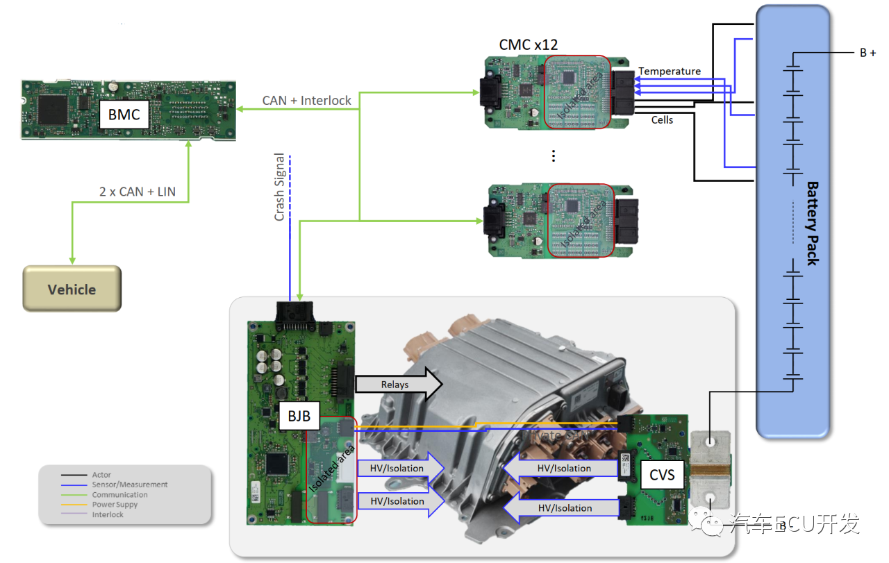
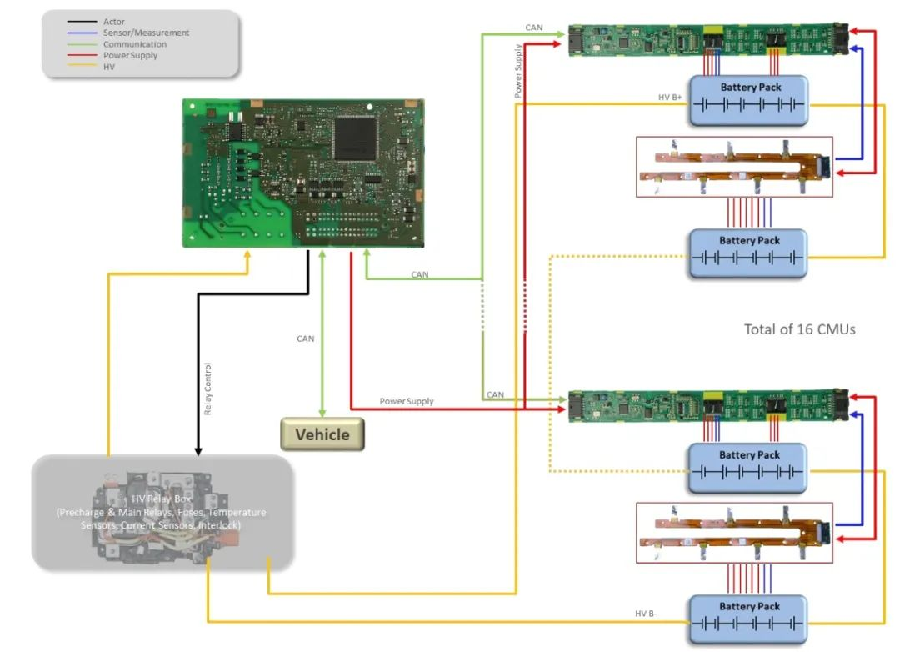
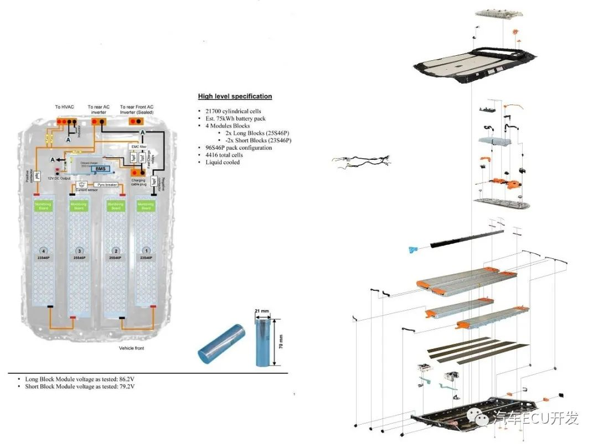

# 电池管理系统 BMS

电池管理系统是动力电池的管家，负责电池的电压、温度、电量的管理。

主要功能：防止电池过充、过放，尽量减缓电池衰减，在电池有问题时上报。
- 电芯电压、电流、温度的监控
  - 通过高精度 ADC 芯片进行采样。这是最基本最重要的基础功能。
  - 温度还会对电池冷却液、模组温度进行采样。
  - 这些参数通过CAN总线传输自BMU，为后续热管理、SOC、SOH 功能提供输入。
- 绝缘检测
- SOC（State of Charge）计算
  - SOC 表示当前动力电池的剩余容量计算。SOC = 剩余电量/额定电量 * 100%
  - SOC 精确计算要求高，大多数采用安时积分，再加修正参数。修正参数主要是为了减小累计误差和随机误差，国标中规定误差不能超过5%。通常在不同的工况下，需要不同的修正参数，充电工况、静态工况、动态工况等。
- SOH监控
  - SOH 指 State of Health，表示电池的监控状态，评估电池弱化状态。
  - 目前通常用容量衰减和直流内阻来判定：（1）电池容量小于 80% 额定容量；（2）直流内阻大于120%标称内阻。
  - SOH的计算通常是根据前期开发过程中标定的map，然后根据不同温度、放电倍率、放电深度等变量进行查map，然后加上权重，即计算电池的SOH。
- SOP 计算
  - SOP 是 State of Power 缩写，通过温度和SOC查map得到当前电池的可用充放电功率，BMU通过CAN总线将参数发送给VCU，VCU在请求扭矩的时候，会考虑该参数，比如在达到截止电压前进行部分功率限制。
- 电池均衡
  - 电池均衡是为了消除电芯在使用过程中产生的电芯不一致性。电池均衡技术包含主动均衡和被动均衡，主动均衡的原理是容量高的电芯通过电路给容量低的充电，使其达到一致，这种方式结构复杂，成本高。
- 放电功率计算
- 故障诊断
  - 根据BMS不同的错误状态采取不同的处理措施，比如限功率、断开高压、在仪表盘提示故障信息。除了这些动作之外，还会存储故障码以及相关的数据，为后续问题分析提供故障时刻的数据。
- 充电管理
- 高低压管理
- 唤醒管理

## 基本组成

电池管理系统的基本组成如下图所示：

主要有：
- BMU
  - 也称为电池管理控制器BMC
- CMU
  - 也称电池模组控制器CMC
  - 负责电池模组中电芯电压、温度、电流的监控，并通过CAN总线反馈给BMU
- 高压控制器
  - 主要控制主、副继电器，高压采样等。

## BMS 系统的形态

BMS的形态分为集中式和分布式。
- 集中式：将电芯的电压、温度、电流采集、SOC计算、SOH监控等功能集中到一个控制器中实现。
  - 优点：成本低、结构紧凑、可靠性高
  - 应用：容量低、电压低的场景适用。例如电动摩托

- 分布式：
  - 其中的CMU主要负责电池组中电芯电压、温度、电流的架空、电芯的均衡；BMU负责SOC计算、SOH监控、热管理、故障诊断、对外通信等；高压控制器主要控制主副继电器、绝缘检测、高压采样等。
  - 应用：适用于现在新能源汽车常用架构、模组和电池包分级管理，更好的实现模块管理，比如车型不同的配置有不同的续航里程，只需要增删部分电池模组来实现。

例如下图所示，特斯拉Model S Plain的12V锂离子电池BMS：

> 使用了NXP MM9Z1——638 主控芯片。

## 当前主机厂的BMS系统

### 奥迪 e-tron 的BMS
奥迪e-tron的BMS系统的整体架构图

奥迪e-tron的BMS它是由：
- 一个电池管理控制器(BMC)
  - 主芯片 32bit 的 SPC5746
  - 电源芯片 MCZ33905
  - CAN 收发器 TJA1051
  
- 12个电池模组控制器(CMC)
  - 由Marquardt提供的，MCU为 SPC5602
  - 电源监控芯片为 MC33771
  - 供电和CAN收发器由NXP的 UJA1164提供。

- 电池接线盒(BJB)
  - 此处的BJB由 DraxImaier 提供，其中用于监控隔离电压的ADC信号为Microchip的两个结合16/24位分辨的 MCP391。
  - 主芯片为MPC5744P
  - 电源芯片为MC33908。
- 电流电压传感器(CVS)组成。

### 未来ES8的BMS系统
蔚来ES8的BMS系统，由一个BMU和16个CMU组成，其中BMU是由博世中国提供，CMU由CATL提供。

- BMU 
  - 主芯片：采用了常见的英飞凌 TC275
  - 博世 ASIC系统基础芯片 0D273
  - CAN 收发器 ADUM5401W，同时该隔离器集成了 DC/AC 的功能，为高压侧AD转换器供电。
  
- 电池接线盒(BJB)
  - 由ST的一个双通道 VND5050AJ、一个单通道 VN5025AJ和一个四通道VNQ5050AK高边驱动器驱动。

- CMU
  - 采用被动均衡
  - 主控芯片为AD的LTC6811HG-2和NXP的S9S12G128F0MLH，主要用来电压监控和通信
  - 同时采用的NXP的UJA1164TK作为高速CAN的收发器和为S12供电。
  - 高压和低压侧由四通道Si8641BD进行数字隔离
  - 唤醒信号通过东芝的TLX9185A光耦合成器从低压侧传输至高压侧。
  - CMU还采用了Ti的N74LV4051A-Q1，8通道多路复用器进行温度监控。
  - 电池包中的16个CMU通过柔性印刷电路进行连接，柔性电路上还包含2个温度传感器和熔断器件。

### 特斯拉 Model 3 的BMS系统

可以看出Model 3的电池管理系统是1主4从的分布式架构。相较于奥迪e-tron的1主12从或者蔚来的1主16从架构，Model 3的架构相对比较简单。其中Master主要负责高压采样、电流检测、高低边驱动、绝缘检测、高压互锁、继电器控制、对外CAN通信等功能，Slave负责单体电压检测、温度检测等功能。

Master有两个微处理器:
- 一个是德州仪器的TMS570LS0432，封装为LQFP176，
- 一个是飞思卡尔SPC5746CSMKU6，封装为LQFP100。
- 副MCU TMS570可检测主MCU SPC5764工作状态，一旦发现其失效可获取控制权限。
- 其二者在硬件上的功能分配从下面的局部硬件原理图可以看出些分工，其中主MCU负责电流检测、CAN通信，而高低边驱动、HVIL检测、Pyro fuse由副MCU负责，像高压和绝缘检测、CMC通信主副MCU都有备份。

每个Slave有菊花链接口，另外边缘有27个触点，其中24个用于电池电压监控，另外使用 37.4 Ω的电阻执行被动电池均衡。4个Slave通过菊花链的形式连接起来.

## 发展趋势

随着电池一致性的增强，以及AI、云计算、大数据的大力发展，BMS与云结合，以及无线BMS为后续BMS的发展趋势。

无线BMS系统(如图7所示)形成了一个网络环境，使得通信路径更加多元，同时无线传输解决了汽车配线线束和连接器引起并长期存在的可靠性问题，并且系统鲁棒性更好，无线传输减少了低压线束和连接器，降低重量的同时也降低了成本，同时电池包结构简单，最后独立性更强，留出的空间可以放进更多的电池，也有利于电池梯次利用的灵活性。

云BMS是将数据上传到云端，云端对数据进行处理，并建立电池的故障模型、AI监督模型等，可动态优化SOC模型以及自动融合算法，实现在线健康度精确观察，以及SOH的精准评估，优化BMS策略延长电池寿命。

