# 自动驾驶与网络安全

随着车辆自动化程度的提高，保护车辆功能的安全措施应防御未经授权的访问和操纵，以保证车辆，其组件及其功能（尤其是车辆控制功能）的安全运行的完整性。确保最高的安全标准并以尽可能最佳的方式保护车辆安全，这是维护自动驾驶功能持久扩展的根本利益，同时要考虑到这样做的最新技术水平。

## 为何信息安全在整个自动驾驶系统安全中占据如此高的地位？

- 自动驾驶车辆普遍需要连接外部网络，网络攻击面扩大，容易吸引攻击者攻击。
- 自动驾驶车辆中承载了大量软件，蕴涵了大量算法、数据，容易收到病毒、木马、勒索病毒、rootkit等恶意代码的影响。
- 自动驾驶车辆之间的数据通信依靠无线网络，容易被干扰或窃听。
- 自动驾驶车辆中的测绘数据（地图等）、个人隐私数据是各国政府和民众的关注要点，需要重点保护。
- 自动驾驶车辆所使用的诸多传感器可能受到新型网络攻击手段的影响。
- L2级到L3、L4级，自动驾驶功能更加依赖外部数据、传感数据、地图、位置信息等，依赖高带宽、低延时、并行计算，攻击者发动的拒绝服务攻击可能在多个层面存在。

##  A Survey of Autonomous Driving : common practices and emerging technologies.

>E. Yurtsever, J. Lambert, A. Carballo and K. Takeda, "A Survey of Autonomous Driving: Common Practices and Emerging Technologies," in IEEE Access, vol. 8, pp. 58443-58469, 2020, doi: 10.1109/ACCESS.2020.2983149.

根据美国NHTSA的研究，94%的道路交通事故由人为失误因素导致。在此背景下，自动驾驶系统（Automated Driving Systems，ADSs）被开发用于防止交通事故、节能减排、 transporting the mobility-impaired 、降低驾驶压力等。

研究ADSs的关键问题包括：
- 当前挑战 present chanllenges
- 可用的和新涌现的架构 available and emerging high-level system architectures
- 独立的核心功能 individual core functions
  - 定位 localization
  - 映射 mapping
  - 预测 perception
  - 规划 planning
  - 车辆控制 vehicle control
  - 人机接口 human interface 
- 可用数据集 available datasets
- 软件栈 software stacks
- 模拟工具 simulation tools
- 算法 algorithms

### 系统组件和架构

#### 系统架构
经典的系统架构如下图所示：

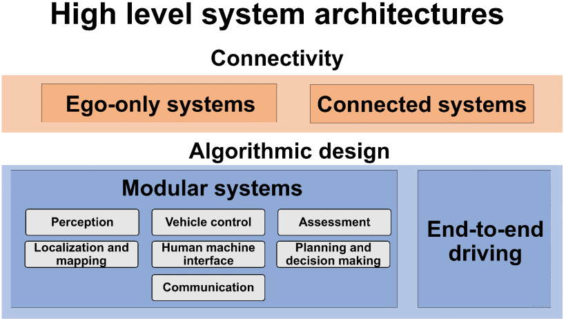

- ego-only systems，执行所有在单一车辆上，不依赖其他车辆和基础设施的必要的自动驾驶操作。
- 模块系统，模块化ADS的核心功能可总结为：
  - 定位 localization
  - 映射 mapping
  - 预测 perception
  - 规划 planning
  - 车辆控制 vehicle control
  - 人机接口 human interface 
  - 典型的pipelines 开始于原始传感器输入到定位和别的对象检测模块；接着是场景预测和决策生成；最后是控制模块和引擎命令。
  - 模块化系统的主要问题在于会传导错误和引入过多的复杂性。例如特斯拉事故中，预测模块产生的一个错误，将白色拖车误以为是天空，这个错误被传到到其他组件以致发生事故。

- 端到端的驾驶
  - 一些研究称其为直接感知（direct perception），直接传感器输入生成Ego-motion，可以是方向盘和踏板的连续动作或离散动作，例如加速和转向。
  - 主要的3种端到端驾驶方法：直接监督的深度学习、神经进化、深度强化学习。

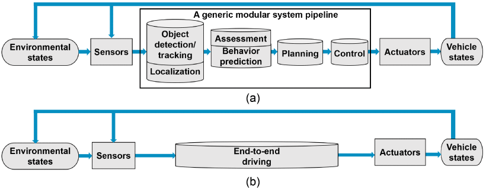

上图是Information flow diagrams of: (a) a generic modular system, and (b) an end-to-end driving system.

- 连接系统。
  - 目前运行中的连接系统尚未出现，但未来包括Vehicular Ad hoc NETwork（VANETs）、V2X。
  - 连接系统可以克服单一平台的缺陷，例如感知范围、盲点、计算限制等等。
  - VANETS包括两种不同方式：传统基于IP网络的和信息中心网络（Information-Centric Networking，ICN）

#### 传感器和硬件

当前的ADS使用了各种各样的车载传感器。许多任务需要鲁棒性和可靠性的任务要求高度传感器冗余。

硬件单元可以分为5类：
- 用于感知的外部感知传感器 exteroceptive sensors for perception
- 用于完成监测车辆内部状态任务的本体感知传感器 proprioceptive sensors for internal vehicle state monitoring tasks
- 通信阵列 communication arrays,
- 执行器 actuators,
- 计算单元 computational units.

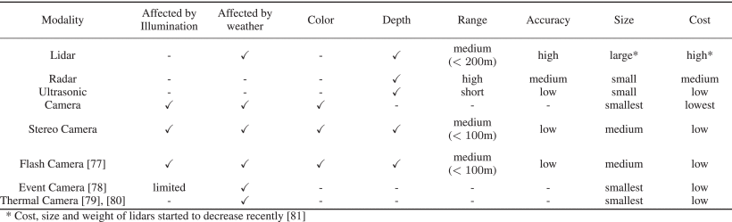

##### 单眼摄像头 Monocular Cammeras

摄像头可以被动感知色彩，没有任何向外发送的测试信号。感知色彩对于某些任务非常重要，例如：交通信号灯识别。

特点：
- 技术成熟。2-D 计算机视觉算法是当前较为的成熟领域（established field）。
- 不像环境发射任何信号
- 照明条件（Illumination conditions）严重影响性能
- 单一摄像头难以获得深层信息
- 季节条件影响性能

##### 全向摄像头 Omnidirectional Camera

全向摄像头是另一种摄像头阵列，有广泛的用途。导航、定位、映射需要全景视野功能。

特性：
- 360度 2D 视野。
- 全景视野（panoramic view）

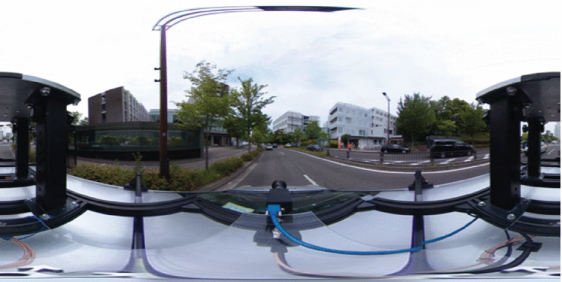
##### 事件摄像头 Event Cameras
事件摄像头是ADS中新近出现的感知方式，它根据视觉刺激（visual stimulus）异步记录单个像素的数据，因此他的输出是不规则的数据点序，或者因亮度变化触发的事件。

特点：
- 输出为不规则数据点序列或亮度触发的事件
- 响应时间以微秒计
- 当前主要限制为像素大小和图像分辨率（image resolution），例如 下面图片中DAVIS40 图像像素大小为18.5*18.5微米，分辨率为240*180.

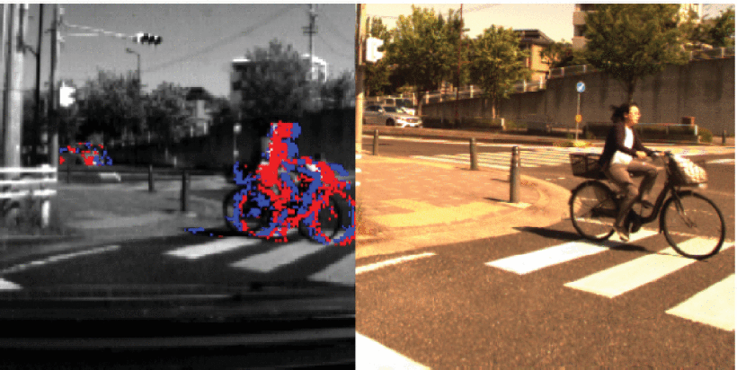

##### 雷达

雷达、激光雷达、超声传感器对于弥补摄像头的缺陷很有帮助。深层信息，例如：对象距离可以通过这些传感器获取的3D信息得到。

- 可以获得3D信息，即 Depth information（深度信息）
- 不受照明条件影响
- 主动发射信号测量
- 轻量化（可以安装在侧后镜中）
- 成本低（普通radar）

##### 激光雷达（lidar）
激光雷达使用与雷达相同的工作原理，但它辐射的是红外线光波（infrared light waves）。

- 200米内有精确度高
- 成本高
- 受雾、雪等天气影响
- 尺寸比一般雷达大

有了激光雷达助力，人类感知能力较ADS感知能力已经处于劣势，特别是照明条件不足的情况下。

##### 内部/本体感知传感器 Proprioceptive sensors

本体感知是另一个关键领域。车辆状态，例如速度、加速度、偏航（yaw）等必须被连续测量，以执行平台安全。这些信号通过CAN总线传递。

这类传感器包括：
- 轮编码器（wheel encoders） 用于测量里程（odometry）
- 惯性导航测试设备（Inertial Measurement Units，IMU）用于监视速度（velocity）和位置（position）变化。
- 转速表（tachometers）用于测量速度和高度

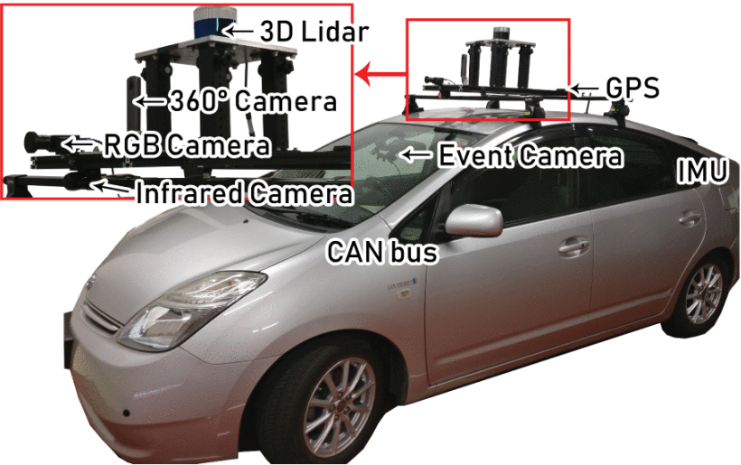

### 定位与映射（Localization and Mapping)

定位功能是导航等功能的基础。

常见的定位方法包括：
- 全球定位系统（global positioning system，GPS）与惯性导航单元（inertial measurement unit）的结合方法,即 GPS-IMU fusion方法。
- 同步定位和映射（Simultaneous Localization And Mapping，SLAM）方法
- 基于先验的图的定位（a priori map-based localization）

### GPS-IMU
GPS-IMU融合的主要原理是利用绝对位置读数对航位推算的累积误差进行间隔校正.

- 位置和方向的变化，由IMU测量
- 通用航位推算（dead reckoning）错误会随着时间增加而累积
- 通过整合GPS读数，IMU的累积误差可以被修正

- GPS-IMU本身不能应用于车辆定位，因为其性能指标不符合要求。密集城市环境下，要求非常高精度的定位值。
- GPS功能会因频道和高建筑物影响时断时续
- GPS-IMU 仅能应用于高阶路径规划

### SLAM （Simultaneous Localization and Mapping）
SLAM是在同一时间进行在线地图制作和定位车辆，它不需要周围环境的先验信息。这是机器人定位在室内环境下的常见方法。

- 不需要环境先验信息
- 高计算量，性能若能提高则有较大应用空间。
- 户外环境下的性能，比预建地图方式要差
- 可用于任何环境下

### 基于先验地图的定位

基于先验地图的定位技术的核心思想是匹配：通过将在线读数与详细的预构建地图上的信息进行比较，找到最佳匹配的位置，实现定位。通常在匹配过程开始时使用初始姿势估计，例如GPS。地图构建有多种方法和首选模式。

环境的变化会对基于地图的方法的性能产生负面影响。这种影响在农村地区尤其普遍，因为路边植被和建筑的变化，地图的过去信息可能会偏离实际环境。此外，这种方法还需要额外的地图制作步骤。

有两种不同的基于地图的方法:
- 地标搜索(landmark search )
- 匹配(matching)。

#### 地标搜索 landmark search
这种方法比点云匹配方法有较小的计算消耗。如果有足够的地标存在，那么它是一种健壮的定位技术。在城市环境里，标杆、路缘、标志和道路标记可以用作地标。

路标检测方法，可以使用lidar和 Monte carlo localization（MCL）。在这个方法里，道路标志和路缘被匹配到一张3D地图中，来找到车辆的位置。将单个前置摄像头检测到的道路标记与具有全球坐标的低容量数字标记地图进行比较和匹配。然后，使用粒子滤波器（particle filter）根据检测到的道路标记和GPS-IMU输出更新车辆的位置和方向。一种基于道路标记检测的定位技术中提出了两个面向地面的摄像头、GPS-IMU航位推算、里程计和精确的标记位置图。还有另一种基于视觉的方法，该方法使用单摄像头和地理参考交通标志。

总的来看，这一方法有一个主要劣势：路标依赖似的该系统在路标不足时会失效。

#### 点云匹配

当前定位系统主要使用的是多模型点云匹配方法。简言之，覆盖较小区域的在线扫描点云将围绕其中心进行迭代平移和旋转，以与较大的先验点云地图进行比较。两点云之间最佳匹配的位置和方向给出了传感器相对于地图的局部位置。对于初始姿态估计，GPS通常用于航位推算。我们使用这种方法来定位我们的车辆。匹配过程如下图所示：

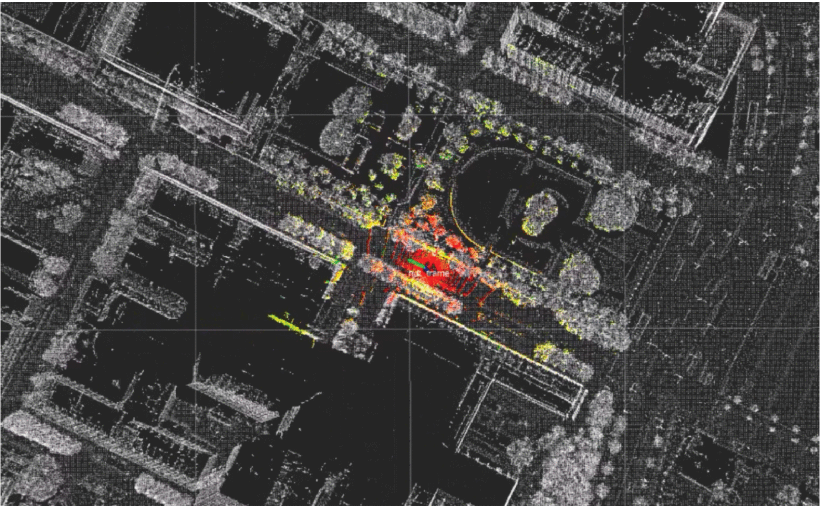

这里使用的是NDT匹配来定位车辆在Nagoya 大学校园里的位置。白色点属于离线预设的地图，彩色图是在线扫描得到的。目标是找到白色点图和彩色点图的最佳匹配，通过这一点来定位车辆。

下面这个图创建具有聚集扫描的3D点云地图。我们使用Autoware进行映射。

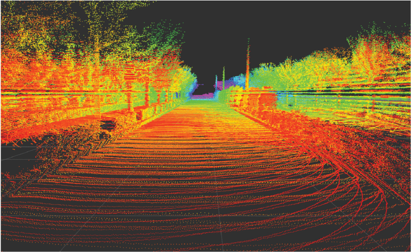

在一些开创性研究中，使用激光雷达收集的点云地图来增强惯性导航和定位。粒子过滤器保持二维坐标和偏航角的三维矢量。一些研究中使用了带有概率地图的多模态方法，以在城市环境中实现定位，且均方根误差小于10厘米。与其逐点比较两个点云并丢弃不匹配的读取，不如对所有观测数据的方差进行建模，并将其用于匹配任务。有文献提出了一种使用多分辨率高斯混合图（GMM）的激光雷达扫描匹配算法。在一些文献中，将迭代最近点（ICP）与正态分布变换（NDT）进行了比较。在无损检测中，累积的传感器读数被转换成一个网格，该网格由从落入其“单元/体素”的扫描点获得的平均值和协方差表示。NDT被证明比点对点ICP匹配更可靠。有的文献中提出了3D NDT匹配的改进版本，使用道路标记匹配增强了NDT。还有的研究开发了一种基于无损检测的蒙特卡罗定位（MCL）方法，该方法利用离线静态地图和不断更新的短期地图。在该方法中，NDT占用网格用于短期地图，仅在静态地图未能给出充分解释时使用。

地图生成和维护是消耗时间和资源的。因此，一些研究人员如认为，考虑到道路网络的规模和快速变化，使用先验地图的方法是不可行的。

#### 2D 到 3D 匹配

匹配在线2D数据到一张已有的 3D 地图是一种正在形成的方法。这一技术使用ADS上的单一摄像头，代替更多昂贵的激光雷达。但是这张预先建立的3D地图是由激光雷达生成的。

基于摄像头的定位可能会在将来更流行，它比激光雷达便宜很多。

### 感知 Perception

感知周围环境并提取对安全导航至关重要的信息是ADS的一个关键目标。使用不同感知模式的各种任务都属于感知范畴。基于几十年的计算机视觉研究，摄像头是最常用的感知传感器，3D视觉成为一种强有力的替代/补充。

本节的提醒分为核心感知任务，包括：
- 基于图像的目标检测
- 语义分割
- 三维目标检测
- 道路和车道检测
- 目标跟踪

#### 检测 Detection
##### 基于图像的对象检测 Image-Based Object Detection

目标检测是指识别感兴趣物体的位置和大小。ADSs关注静态对象（从交通信号灯和标志到十字路口）和动态对象（如其他车辆、行人或骑自行车的人）。

广义目标检测作为计算机视觉中的一个核心问题由来已久，其目标是确定图像中是否存在特定类别的对象，然后通过矩形边界框确定其大小。本节主要讨论最先进的目标检测方法，因为它们代表了ADS管道中其他几个任务的起点，例如目标跟踪和场景理解。

物体识别研究始于50多年前，但直到最近，在20世纪90年代末和21世纪初，算法性能才达到与驾驶自动化相关的水平。2012年，深卷积神经网络（DCNN）AlexNet打破了ImageNet图像识别的挑战。这导致了注意力几乎完全转向监督学习，尤其是用于目标检测的深度学习。关于基于图像的一般目标检测有很多广泛的调查。这里的重点是可以应用于广告的最先进的方法。

虽然当前方法都依赖于DCNNs，但彼此之间有明确的区分：
- 单一阶段检测框架，使用单一网络同时实现对象检测定位和分类预测；
- 区域建议检测框架（Region proposal methods ，RPN）使用两个不同的阶段，首先提出感兴趣的一般区域，然后通过单独的分类器网络进行分类。

区域建议检测方法在当前的检测性能居于领先地位，但需要消耗较高的计算资源，通常难以实现、训练和调优。而单一阶段检测算法较为快速和低内存消耗，适于实时驾驶自动化。

YOLO（You Only Look Once）是一种流行的单一阶段检测器。近来发展了YOLOv2，YOLO9000和YOLOv3等版本。

速度更快的另一种广泛应用的算法是SSD（single shot detector）。

在ADS中同时考虑精确性和计算消耗是非常重要的，检测方法不仅需要可靠，还需要实时执行，使得使用尽可能短的时间来完成规划和控制车辆行驶。

RPN方法使用两阶段进行检测，已被证明在目标识别和定位精度方面是无与伦比的，近年来计算成本也有了很大提高。这个方法更适合检测相关的其他任务，例如语义分割（semiotic segmentation）。通过迁移学习（transfer learning），RPNs 可以同时实现多个感知任务，逐步成为在线应用采用的方法。随着ADS应用的发展，RPNs可能会代替单一阶段检测网络。

下图显示了面对ImageNet1K测试集，各类2D边界框估计架构，按最大5%误差排序的结果。参数数（Num.Params）和层数（Num.Layers）暗示了算法的计算成本。

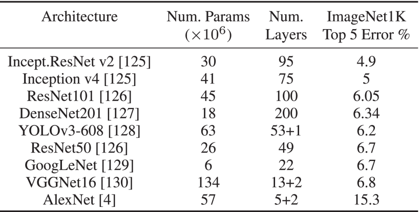

###### 基于全方位和事件摄像机的感知

360度视觉，或者至少是全景视觉，对于更高水平的自动化是必要的。这可以通过相机阵列来实现，不过为了实现图像拼接，需要在每个相机之间进行精确的外部校准。或者，可以使用全向摄像机，或者使用带有广角鱼眼镜头的较小摄像机阵列。然而，它们很难进行本质上的校准；球面图像高度失真，使用的相机模型必须考虑镜面反射或鱼眼镜头失真，这取决于产生全景图像的相机模型。模型和校准的准确性决定了生成的未失真图像的质量，在该图像上使用了上述2D视觉算法。图3显示了鱼眼透镜产生两个球面图像，然后组合成一个全景图像的示例。一些失真不可避免地仍然存在，但尽管在校准方面存在这些挑战，全向相机已被用于许多应用，如SLAM和3D重建。

事件摄像机是一种全新的模式，它输出通常由观察场景中的运动引起的异步事件。这使得动态目标检测的传感模式变得有趣。另一个吸引人的因素是它们的响应时间约为微秒，因为帧速率是高速驾驶的一个重要限制。传感器分辨率仍然是一个问题，但新型号正在迅速改进。它们被用于与ADS密切相关的各种应用。最近的一项调查概述了姿势估计和SLAM、视觉惯性里程计和3D重建以及其他应用方面的进展。最值得注意的是，最近发布了一个使用事件摄影机进行端到端驾驶的数据集，初步实验表明，事件摄影机的输出在一定程度上可以用于预测汽车转向角

###### 光照不好，外观也在变化

使用摄像头的主要缺点是，照明条件的变化会显著影响其性能。低光照条件本质上很难处理，而由于阴影移动、过度的天气或季节变化导致的照明变化可能会导致算法失败，尤其是有监督的学习方法。例如，雪极大地改变了场景的外观，并隐藏了车道标记等潜在的关键特征。一种简单的替代方法是使用替代传感模式进行感知，但激光雷达在雾和雪等天气条件下也有困难，而且雷达对于许多感知任务缺乏必要的分辨率。传感器融合策略通常用于避免任何单点故障。

通过红外传感器进行的热成像也可用于弱光条件下的目标检测，这对行人检测尤其有效。还开发了尝试直接处理动态光照条件的纯摄像头方法。人们提出了两种方法，一种是尝试提取光照不变特征，另一种是评估特征的质量。经过预处理的、光照不变的图像已应用于ADS，并被证明可以在很长一段时间内提高定位、映射和场景分类能力。尽管如此，如何应对因照明不足或不断变化而带来的不可预测的情况仍然是阻碍广告广泛实施的核心挑战。

##### 语义分割

除了图像分类和目标检测，计算机视觉研究还解决了图像分割的任务。这包括使用类别标签对图像的每个像素进行分类。这项任务对于驾驶自动化特别重要，因为一些感兴趣的对象由边界框定义得很差，尤其是道路、交通线、人行道和建筑物。城市区域的分割场景如图8所示。与基于类别标记像素的语义分割不同，实例分割算法进一步分离同一类别的实例，这在驱动自动化方面很重要。换句话说，可能有不同轨迹和行为的物体必须相互区分。我们使用COCO数据集来训练实例分割算法Mask R-CNN，样本结果如下图8所示。

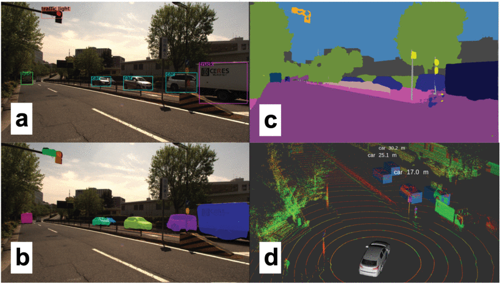

上图是名古屋大学附近的一个城市场景，由我们的实验车辆收集的摄像头和激光雷达数据，以及最先进的感知算法的目标检测输出。（a） 一个前置摄像头的视图，带有来自YOLOv3的边界框结果，（b）来自MaskRCNN的实例分割结果。（c） DeepLabv3产生的语义分割掩码。（d） 3D激光雷达数据与第二次目标检测结果。在这四种算法中，只有3D perception算法向检测到的对象输出范围。

分割（Segmentation）最近已成为实时应用的可行方法。通常，这一领域的发展与基于图像的目标检测同步进行。前面提到的屏蔽R-CNN是更快的R-CNN的推广。多任务R-CNN网络可以同时实现精确的包围盒估计和实例分割，也可以推广到其他任务，如行人姿势估计，只需最少的领域知识。以每秒5帧的速度运行意味着它正在接近广告的实时使用范围。

Mask RCNN的体系结构更类似于通过使用区域建议网络进行目标检测的体系结构，与此不同，分割网络通常采用卷积的组合进行特征提取。然后进行反褶积，也称为转置卷积，以获得像素分辨率标签。特征金字塔网络也常用，例如在PSPNet中，它还引入了用于分割的扩展卷积。这种稀疏卷积的思想随后被用于开发DeepLab，最新版本是目前最先进的对象分割技术。我们在广告中使用了DeepLab，分段框架如图8所示。

虽然目前大多数分割网络速度太慢，计算成本太高，无法用于ADS，但需要注意的是，许多分段网络最初是针对不同的任务进行训练的，例如边界盒估计，然后推广到分段网络。此外，这些网络可以学习图像的通用特征表示，并且可以推广到许多任务中。这表明单一的、广义的感知网络可能能够处理广告所需的所有感知任务。

##### 三维目标检测

鉴于摄像头的价格合理、可用性和广泛的研究，几乎所有算法都使用摄像头作为主要的感知方式。然而，摄像机的局限性对广告至关重要。除了前面讨论的照明外，基于摄像机的目标检测发生在投影图像空间中，因此场景的规模未知。为了将这些信息用于动态驾驶任务，如避障，有必要将基于2D图像的检测与3D度量空间之间的差距缩小。因此，深度估计是必要的，虽然立体或多视角系统更为稳健，但事实上，单台摄像机也可以进行深度估计。这些算法必然需要解决昂贵的图像匹配问题，这会给已经复杂的感知管道增加大量的处理成本。

一种相对较新的传感方式，3D激光雷达，为3D感知提供了一种替代方案。收集的3D数据本质上解决了规模问题，而且由于它们有自己的发射源，因此它们在照明条件下的可靠性要低得多，也不太容易受到过度天气的影响。传感模式收集代表场景表面的稀疏3D点，如图9所示，这些点很难用于目标检测和分类。物体的外观会随着距离的变化而变化，经过一段距离后，每个物体只有很少的数据点可用于检测物体。这给检测带来了一些挑战，但由于数据是世界的直接表示，因此更容易分离。传统方法通常使用欧几里德聚类或区域增长方法将点分组为对象。通过各种滤波技术，例如地面滤波和基于地图的滤波，这种方法变得更加稳健。我们实现了一个3D对象检测管道，从原始点云输入中获取聚集对象。图9显示了该过程的一个示例。

上图概述了从3D点云数据中检测目标的传统方法。首先使用各种过滤和数据缩减方法，然后使用聚类。我们的数据采集平台采集的行人三维激光雷达数据中的不同颜色点显示了生成的聚类。

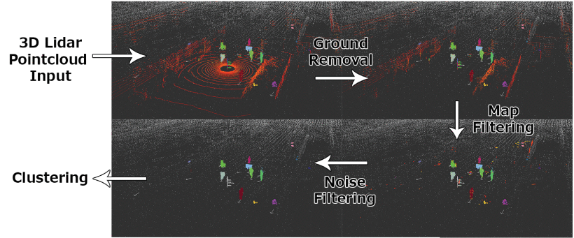

与基于图像的方法一样，机器学习最近也取代了3D检测方法。这些方法也被显著地应用于RGB-D，它可以产生类似的但有颜色的点云；由于RGB-D在户外的使用范围有限且不可靠，因此还没有用于ADS应用。通过称为VoxelNet 的3D占用网格，点数据的3D表示首次应用于RGB-D数据中的对象检测。此后不久，一种类似的方法被用于激光雷达创建的点云。受基于图像的方法启发，使用了3D CNN，尽管计算成本非常高。

VoxelNet 首次给出了仅用于点云三维边界盒估计的令人信服的结果。VoxelNet 学习了从原始点云数据到VoxelNet 格的编码，而不是手工制作离散化过程中计算的输入特征。他们的体素特征编码器（voxel feature encoder，VFE）使用一个完全连接的神经网络，将每个占据的体素中可变数量的点转换为固定大小的特征向量。然后，使用特征向量编码的VoxelNet 格作为上述RPN的输入，用于多类对象检测。通过利用激光雷达数据的自然稀疏性，这项工作在精度和计算效率方面都提高了一秒。我们使用了SECOND，示例结果如图8所示。最近产生了几种算法，如表7所示，精度不断提高，但3D卷积的计算复杂性仍然是实时使用的一个问题。

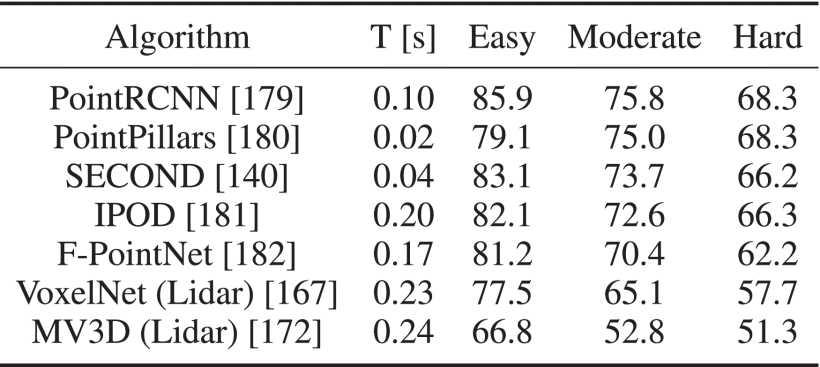

上表显示了 KITTI 3D物体检测测试集车辆等级的平均精度（AP），以%为单位，根据中等类别精度订购。这些算法只使用点云数据。

基于激光雷达的感知的另一个选择是点云数据的二维投影。点云数据在2D中有两种主要表示形式，第一种是图10所示的所谓深度图像，其主要灵感来自基于摄像头的方法，这些方法通过深度估计执行3D对象检测，以及对RGB-D数据进行操作的方法。VeloFCN网络提出使用单通道深度图像作为浅层单级卷积神经网络的输入，该网络生成3D车辆方案，许多其他算法采用这种方法。深度图像的另一个用途是对激光雷达点进行语义分类。

下图是由合成激光雷达数据生成的深度图像，在 CARLA 模拟器中生成。

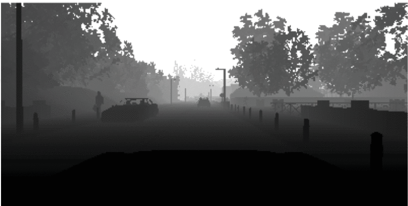

另一个越来越受欢迎的2D投影，部分是由于新的KITTI基准，是投影到鸟瞰图（BV）图像。这是点云的俯视图，如图11所示。鸟瞰图像纯粹在二维空间中离散化，因此高度不同的激光雷达点相互遮挡。MV3D算法使用相机图像、深度图像以及多通道BV图像；每个通道对应不同的高度范围，以便将这些遮挡最小化。其他几项工作重复使用了基于摄像头的算法，并训练了有效的网络，用于二维BV图像上的三维目标检测。目前正在KITTI数据集和nuScenes数据集上评估最先进的算法，因为它们提供有标签的3D场景。表7显示了KITTI基准上的主要方法，以及检测时间。2D方法的计算成本要低得多，但考虑到点稀疏性的最新方法是实时可行的，并且快速接近ADSs中集成所需的精度。

下图是3D激光雷达数据的鸟瞰透视图，来自KITTI数据集的样本

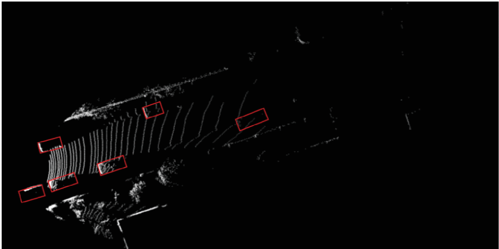

雷达：雷达传感器已经用于各种感知应用，在各种类型的车辆中，不同型号的车辆在互补范围内工作。虽然不如激光雷达精确，但它可以在高距离探测目标并估计其速度。在感知系统中使用物体形状估计时，缺乏精确性是一个主要缺点，分辨率太低。因此，它可以用于车辆等大型物体的距离估计，但对于行人或静态物体来说，这是一个挑战。另一个问题是大多数雷达的视野非常有限，迫使复杂的雷达传感器阵列覆盖整个视野。然而，雷达已被广泛用作ADAS组件，用于近距离警告和自适应巡航控制等应用。虽然雷达和激光雷达通常被视为相互竞争的传感方式，但它们很可能会在全自动驾驶系统中同时使用。雷达的射程很长，成本低，对恶劣天气也很稳定，而激光雷达提供精确的目标定位能力，如第四节所述。

与雷达类似的另一个传感器是声纳设备，尽管它们的极短距离小于2米，且角度分辨率差，因此它们的使用仅限于非常近的障碍物探测。

#### 目标跟踪

目标跟踪通常也称为多目标跟踪（MOT）和多目标检测与跟踪（DATMO）。对于复杂和高速情况下的全自动驾驶，仅估计位置是不够的。有必要估计动态对象的航向和速度，以便应用运动模型来跟踪对象随时间的变化，并预测未来的轨迹以避免碰撞。这些轨迹必须在规划使用的车辆框架中进行估计，因此必须通过多个摄像头系统、激光雷达或雷达传感器获取距离信息。3D激光雷达通常用于精确的距离信息和大视场，允许长时间跟踪。为了更好地应对不同传感模式的局限性和不确定性，通常使用传感器融合策略进行跟踪。

常用的目标跟踪器依赖于简单的数据关联技术和传统的过滤方法。当在3D空间中以高帧速率跟踪对象时，最近邻方法通常足以建立对象之间的关联。然而，基于图像的方法需要建立一些外观模型，其可以考虑使用颜色直方图、梯度和诸如KLT的其他特征来评估相似度。基于点云的方法也可以使用相似性度量，如点密度和Hausdorff距离。由于关联错误总是有可能的，因此经常使用多个假设跟踪算法，这确保了跟踪算法可以在任何单个时间步从糟糕的数据关联中恢复。使用占用地图作为所有传感器参与的框架，然后在该框架中进行数据关联是常见的，尤其是在使用多个传感器时。为了获得平滑的动态，检测结果被传统的贝叶斯滤波器过滤。卡尔曼滤波对于简单的线性模型是足够的，而扩展和无迹卡尔曼滤波器用于处理非线性动态模型。我们实现了一个基于基本粒子滤波的目标跟踪算法，在对比摄像头和3D激光雷达透视图中跟踪行人的示例如图12所示。

图12显示在城市道路交叉口，有几个被跟踪的行人和骑自行车的人，他们使用基本的粒子过滤器。过去的轨迹显示为白色，当前航向和速度显示为箭头的方向和大小，样本由我们的数据采集平台采集。

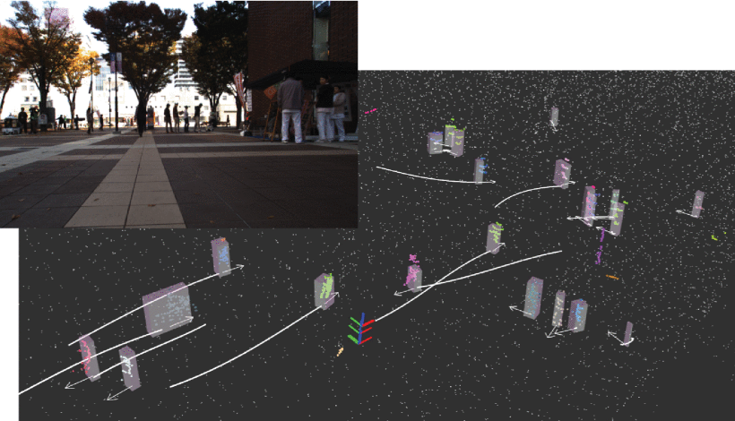

被跟踪对象的物理模型通常也用于更稳健的跟踪。在这种情况下，会使用非参数方法，如粒子过滤器，并跟踪物理参数，如对象的大小以及动力学。更复杂的过滤方法，如Rao Blackwellized粒子过滤器，也被用于跟踪L形车辆模型的动态变量和车辆几何变量。针对车辆和行人提出了各种模型，而一些模型可推广到任何动态对象。

最后，深度学习也应用于跟踪问题，尤其是图像跟踪。通过基于CNN的方法，有的方法实时实现单目图像中的跟踪。估计物体动力学的多任务网络也正在出现，这进一步表明，处理多个感知任务的广义网络可能是ADS感知的未来。

#### 道路和车道检测

之前介绍的边界框估计方法可用于定义某些感兴趣的对象，但不适用于道路等连续曲面。确定可驾驶表面对于ADSs至关重要，并且已作为检测问题的一个子集进行了专门研究。虽然可以通过语义分割来确定可驾驶表面，但自动车辆需要理解道路语义才能正确通过道路。从感知的角度来看，理解车道以及它们如何通过合并和交叉口连接仍然是一个挑战。在本节中，我们概述了当前用于道路和车道检测的方法，并让读者参考对传统方法和最先进方法，的深入调查。

这个问题通常被细分为几个任务，每个任务都能实现一定程度的自动化。
- 最简单的方法是从ego车辆的角度确定可驾驶区域。
- 然后可以将道路划分为车道，并确定车辆的主车道。
- 合理距离内的主车道估计允许ADAS技术，如车道偏离警告、车道保持和自适应巡航控制。
- 更具挑战性的是确定其他车道及其方向，并最终理解复杂的语义，如当前和未来方向，或合并和转弯车道。
- 这些ADAS或ADS技术在任务、检测距离和可靠性方面有不同的标准，但全自动驾驶需要对道路结构有完整的语义理解，并能够在远距离检测多条车道。如图13所示的注释地图对于理解车道语义非常有用。

下图是用拓扑信息注释三维点云地图。大量的注释员被用来绘制右边的地图。

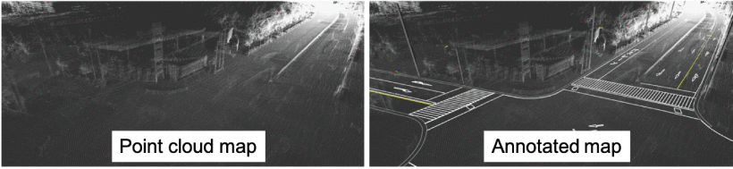

目前的道路理解方法通常首先依赖于外部感知数据预处理。当使用相机时，这通常意味着执行图像颜色校正以使照明条件正常化。对于激光雷达，可以使用几种滤波方法来减少数据中的杂波，例如地面提取或基于地图的滤波。对于任何传感模式，识别与静态道路场景冲突的动态对象是一个重要的预处理步骤。然后，对校正后的数据进行道路和车道特征提取。颜色统计和强度信息、梯度信息和各种其他过滤器已用于检测车道标记。道路估算也使用了类似的方法，通常道路的均匀性和边缘的高程差允许应用区域增长方法。立体摄像系统以及3D激光雷达已被用于直接确定道路的3D结构。最近，使用了基于机器学习的方法，将地图与视觉融合，或使用完全基于外观的分割。

一旦估算出曲面，将使用模型拟合来建立道路和车道的连续性。已经使用了通过参数模型（如直线和样条曲线）进行的几何拟合，以及非参数连续模型。已经使用了假设平行车道的模型，最近提出了集成拓扑元素（如车道分割和合并）的模型。

时间整合完成了道路和车道分割流程。这里，车辆动力学与道路跟踪系统结合使用，以实现平稳的结果。动态信息也可以与卡尔曼滤波或粒子滤波一起使用，以获得更平滑的结果。

道路和车道估计是一个研究非常深入的领域，许多方法已经成功地集成到车道保持辅助系统中。然而，大多数方法仍然充满假设和局限性，能够处理复杂道路拓扑的真正通用系统尚未开发。通过对拓扑进行编码的标准化路线图和新兴的基于机器学习的道路和车道分类方法，稳健的驾驶自动化系统正在慢慢形成。

### 评估 Assessment

稳健的ADS应不断评估情况的总体风险水平，并预测周围人类驾驶员和行人的意图。缺乏敏锐的评估机制可能会导致事故。本节将评估分为三个子类：
- 总体风险和不确定性评估
- 人类驾驶行为评估
- 驾驶风格识别。

#### 风险和不确定性评估

总体评估可总结为量化驾驶现场的不确定性和风险水平。这是一种很有前途的方法，可以提高ADS管道的安全性。

一些文件中提出了使用贝叶斯方法来量化和测量深层神经网络的不确定性。设计了一种贝叶斯深度学习体系结构，用于在整个ADS管道中传播不确定性，并在一个假设场景中展示了它相对于传统方法的优势。总之，每个模块在整个管道中传递和接受概率分布，而不是精确的结果，这增加了系统的整体鲁棒性。

另一种方法是单独评估驾驶现场的总体风险水平，即管道外。在一些文献中，感官输入被输入到风险推理框架中，以使用隐马尔可夫模型（HMMs）和语言模型检测不安全的车道变更事件。最近，在一项研究中引入了一个深层时空网络，用于推断驾驶场景的总体风险水平。此方法的实现是开源的。我们采用这种方法来评估车道变更的风险水平，如图14所示。

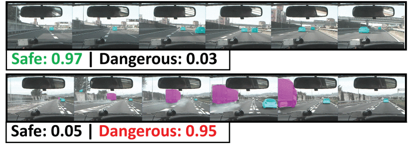

上图14显示了评估驾驶场景的总体风险水平。我们采用了一个基于开源深时空视频的风险检测框架来评估图中所示的图像序列。

#### 周围驾驶行为评估

了解周围的人类驾驶员意图与中长期预测和决策最相关。为了增加对周围物体行为的预测范围，应考虑人类特征，并将其纳入预测和评估步骤。从广告的角度理解周围驾驶员的意图在该领域并不常见，因此，最先进的技术尚未建立。

在一些研究中，使用隐马尔可夫模型（HMM）预测目标车辆的未来行为，通过学习人类驾驶特征，预测时间范围延长了56%。所提议的系统用预先定义的动作标记观测结果。然后，使用HMMs以数据为中心学习每种类型的特征。另一些研究中提出了另一种基于学习的方法，其中贝叶斯网络分类器用于预测高速公路上单个驾驶员的操纵。有文献中介绍了一种结合混合状态系统和HMM的长期驾驶员行为预测框架。还有的研究通过符号化框架将周围的车辆信息与自我行为结合起来。在另一研究中，通过对安全和危险数据进行训练的HMM框架实现了对危险切入动作的检测。使用支持向量机（SVM）和贝叶斯滤波器提前1.3秒预测车道变化事件。

主要的挑战是理解人类意图的短观察窗口和实时高频计算需求。ADS通常只能观察周围车辆几秒钟。在这些情况下，无法使用需要更长观察期的复杂驾驶行为模型。

#### 驾驶风格识别 Driving Style Recognition
 
2016年，谷歌的自动驾驶汽车在换道时与迎面而来的公交车相撞，当时谷歌认为公交车司机会让步。然而，巴士司机却加速了。如果ADS能够理解公交车司机的个性、独特的驾驶风格，并预测他的行为，那么这起事故可能就不会发生。

驾驶风格是一个宽泛的术语，没有既定的通用定义。此外，认识周围的人类驾驶风格是一个严重缺乏研究的话题。然而，在一些研究中可以找到对人类驾驶的ego车辆驾驶风格分类的全面审查。读者可以参考这些论文进行全面的评论。本小节的其余部分简要概述了基于人类驾驶自我车辆的驾驶风格识别。

通常，驾驶风格是根据攻击性或油耗来定义的。例如，一些研究引入了一个基于规则的模型，根据冲动对驾驶风格进行分类。该模型通过一组规则和冲动阈值来决定动作是积极的还是平静的。根据[233]中的平均速度对驾驶员进行了分类。在传统方法中，驾驶风格类的总数和含义是预先定义的。绝大多数驾驶风格识别文献使用两个[83]、[213]、[222]、[223]、[227]或三个[234]-[235][236]类。在连续域中表现驾驶风格并不常见，但也有一些研究。在[237]中，驾驶风格被描述为−1和+1，分别代表轻度和活跃。分类方法详见表8。

表8 Driving Style Categorization of Human-Driven Ego Vehicles

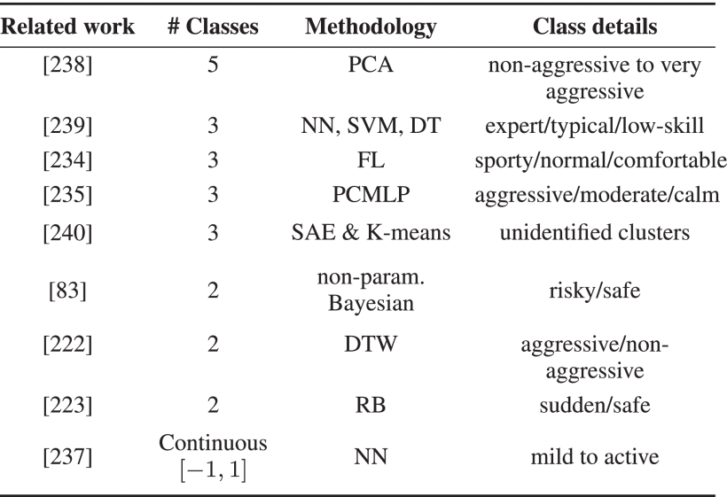

最近，基于机器学习的方法被用于驾驶风格识别。在[238]中使用了主成分分析，并以无监督的方式检测到五种不同的驾驶类别，在[241]中使用了基于GMM的驾驶员模型来识别成功驾驶的单个驾驶员。在后一项研究中，分别研究了跟车和踏板操作行为。文献[242]提出了另一种基于GMM的驾驶风格识别模型，用于电动汽车里程预测。在[222]中，作者报告了一个高成功分数的动态时间扭曲攻击性事件检测。[243]中使用了贝叶斯方法对环岛上的驾驶风格进行建模，[244]中使用了贝叶斯方法对关键制动情况进行评估。在[245]中，单词袋和K-均值聚类被用来表示个人驾驶特征。使用堆叠式自动编码器从不同的驾驶员中提取独特的驾驶特征，然后通过聚类找到宏驾驶风格的质心[240]。另一个自动编码器网络用于提取特定于道路类型的驾驶特征[246]。类似地，驾驶行为被编码在一个3通道RGB空间中，带有一个深度稀疏自动编码器，以可视化个人驾驶风格[247]。

目前还没有将驾驶风格识别成功整合到真实世界的广告渠道中的报道。然而，这些研究是有希望的，并指出了广告发展的一个可能的新方向。

### 规划和决策制定 lanning and Decision Making

规划工作可以被分为两个子任务：
- 全局路线规划 global route planning 
- 局部路线规划 local path planning

图15中显示了规划器利用了已标记的向量地图，我们使用OpenPlanner[219]，这是一种基于图形的规划器，来说明一种典型的规划方法。

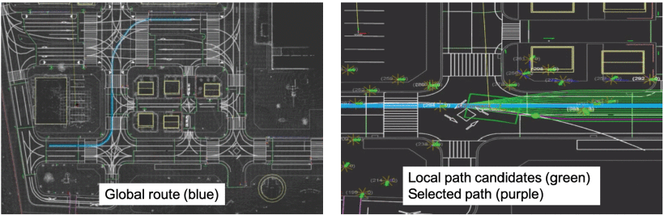

#### 全球规划

全球规划师负责在道路网络上找到从起点到最终目的地的路线。用户通常定义最终目的地。全球导航是一门研究得很好的学科，十多年来，高性能已经成为行业标准。几乎所有现代生产的汽车都配备了导航系统，利用GPS和离线地图来规划全球路线。

路线规划是在有向图中寻找点对点的最短路径，传统方法在[248]中分四类进行了研究。这些是：
- 目标导向
- 基于分隔符
- 分层
- 有界跳跃技术。

A* search[249]是一种标准的目标导向路径规划算法，近50年来广泛应用于各个领域。

基于分隔符的技术的主要思想是从图中删除顶点[250]或圆弧的子集，并计算覆盖图。使用叠加图计算最短路径可以加快查询速度。

分层技术利用了道路层次结构。例如，美国的道路等级可以自上而下分别列为高速公路、干道、集路和地方道路。对于路由查询，层次结构的重要性随着起点和终点之间的距离变长而增加。最短的路径可能不再是最快或最理想的路线。远离目的地，从而使路线更长一些，以走最近的公路坡道，与走当地道路的最短路径相比，可能会导致更快的旅行时间。[251]中提出了收缩层次（CH）方法来开发道路层次。

预先计算选定顶点之间的距离并在查询时利用它们是有界跳跃技术的基础。预先计算的快捷方式可以部分或专门用于导航。然而，在大型网络的大多数情况下，预先计算来自每对顶点的所有可能路由的天真方法是不切实际的。一种可能的解决方案是使用hub labeling（HL）[252]。这种方法也需要预处理。与顶点关联的标签由附近的中心顶点及其距离组成。这些标签满足以下条件：任意给定两个顶点的标签之间必须至少存在一个共享中心顶点。HL是路由规划[248]中最快的查询时间算法，其代价是高存储使用率。

上述算法的组合在最先进的系统中很流行。例如，[253]将分隔符与有界跳方法相结合，并使用Arc标志（TNR+AF）算法创建了中转节点路由。现代的路线规划人员可以在几毫秒内进行查询。

#### Local Planning
局部规划的目标是执行全局规划而不失败。换句话说，为了完成其行程，ADS必须在给定起点和终点的配置空间（C-space）中找到避开障碍物的轨迹，并满足优化标准。[19]中介绍了详细的本地规划审查，其中运动规划的分类分为四组：
- 基于图形的规划器
- 基于采样(SBP)的规划器
- 插值曲线规划器
- 数值优化方法。

在总结了这些传统的规划之后，本节最后介绍了新兴的基于深度学习的规划器。表9简要总结了局部规划方法：

最近，基于深度学习（DL）和强化学习的局部规划器开始作为替代方案出现。完全卷积的3D神经网络可以从感官输入（如激光雷达点云）生成未来路径[265]。关于这个主题的一个有趣的观点是，使用深度分割网络[266]使用路径建议分割图像数据。[268]中使用深度强化学习在模拟环境中实现了在闭塞交叉口规划安全路径。端到端驾驶和基于深度学习的本地规划者之间的主要区别在于输出：前者输出直接的车辆控制信号，如转向和踏板操作，而后者生成轨迹。这使得DL规划器能够集成到传统管道中[24]。

基于深度学习的规划师很有前途，但它们尚未在现实系统中得到广泛应用。缺乏硬编码的安全措施、泛化问题、需要标记数据是需要解决的一些问题。

### 人机交互

车辆通过HMI模块与其驾驶员/乘客进行通信。这种交流的性质在很大程度上取决于目标，目标可分为两个：
- 主要驾驶任务
- 次要任务。

这些任务的交互强度取决于自动化水平。如果手动操作的零级常规车需要持续的用户输入进行操作，则五级ADS可能仅在行程开始时需要用户输入。此外，互动的目的可能会影响强度。从执行主要驾驶任务到监控自动化过程的转变提出了新的HMI设计要求。

关于汽车HMI技术有几项调查，如[269]、[270]，主要是从分散注意力的角度进行的。与视觉任务相比，辅助任务的手动用户界面更为理想[269]。主要原因是视力是绝对必要的，而且在主要驾驶任务中没有其他选择。视觉界面交互需要持续时间在0.6到1.6秒之间的浏览，平均时间为1.2秒[269]。因此，需要视觉的次要任务界面会分散注意力，对驾驶有害。

听觉用户界面（AUI）是HMI设计视觉负担的良好替代品。AUI是全方位的：即使用户没有参与，听觉提示也很难错过[271]。音频交互的主要挑战是自动语音识别（ASR）。ASR是一个非常成熟的领域。然而，在汽车领域还有其他挑战；由于风和道路噪音等无法控制的驾驶舱条件导致性能低下[272]。除了简单的语音命令，与广告的自然语言对话互动仍然是一个尚未实现的概念，还有许多尚未解决的挑战[273]。

HMI面临的最大挑战是三级和四级自动化。用户和广告需要相互理解，否则，他们将无法理解对方的意图[270]。在最先进的技术中，从手动驾驶过渡到自动驾驶，反之亦然，很容易失败。最近的研究表明，与执行辅助任务相比，驾驶员在监控自动驾驶时表现出较低的认知负荷[288]。尽管一些实验系统可以通过基于头部和眼睛跟踪的面向驾驶员的摄像头识别驾驶员的活动[289]，并在模拟环境中通过视觉和听觉提示为驾驶员的交接做好准备[290]，但目前还不存在具有高效交接交互模块的真实系统。这是一个有待解决的问题[291]，未来的研究应侧重于提供更好的方法，让驾驶员为缓解过渡期做好准备[41]。

### 数据集和可获取工具

#### 数据集和指标 Datasets and Benchmarks

数据集对研究人员和开发人员至关重要，因为大多数算法和工具在上路之前都必须经过测试和培训。

通常情况下，感官输入被输入到一堆具有不同目标的算法中。通常的做法是在带注释的数据集上分别测试和验证这些功能。例如，摄像机的输出2D vision可以输入到目标检测算法中，以检测周围的车辆和行人。然后，这些信息可以在另一个算法中用于规划目的。尽管这两种算法在本例的堆栈中是连接在一起的，但在开发过程中，可以分别处理和验证对象检测部分。由于计算机视觉是一个研究很好的领域，因此有专门用于目标检测和跟踪的注释数据集。这些数据集的存在增加了开发过程，并使跨学科研究团队能够更高效地相互协作。对于端到端驾驶，数据集必须包括额外的ego车辆信号，主要是转向和纵向控制信号。

随着学习方法的出现，支持它们的训练数据集也出现了。PASCAL VOC数据集[292]从2005年增长到2012年，是第一个包含大量ADS相关类数据的数据集之一。然而，这些图像通常以单个对象为特征，场景和比例不能代表驾驶场景中遇到的情况。2012年，KITTI Vision Benchmark[177]通过提供相对大量的标记驾驶场景，纠正了这种情况。它仍然是与驾驶自动化相关的应用中使用最广泛的数据集之一。然而，就数据量和标记类的数量而言，它远不如ImageNet[131]和COCO[152]等通用图像数据库。虽然这些通用图像数据库无疑对培训有用，但它们缺乏足够的上下文来测试ADS的能力。加州大学伯克利分校DeepDrive[275]是一个最近的数据集，包含带注释的图像数据。在英国，牛津机器人车[53]使用六个摄像头、激光雷达、GPS和惯性导航系统收集了超过1000公里的驾驶数据，但没有注释。ApolloScape是一个尚未完全公开的最新数据集[278]。Cityscapes[274]通常用于计算机视觉算法作为基准集。Mapillary Vistas是一个带有注释的大图像数据集[276]。TorontoCity基准[286]是一个非常详细的数据集；然而，它还没有公开。nuScenes数据集是使用激光雷达和图像传感器的最新城市驾驶数据集[178]。逗号ai发布了他们的数据集[293]的一部分，其中包括7.25小时的驾驶时间。在DDD17[89]中，记录了大约12小时的驾驶数据。LiVi集[281]是一个新的数据集，包含激光雷达、图像和驾驶行为。CommonRoad[294]是运动规划的新基准。

自然主义驾驶数据（Naturalistic driving data）是另一种类型的数据集，集中于驾驶的单个元素：驾驶员。SHRP2[283]包括3000多名志愿者参与者在3年的收集期内的驾驶数据。其他自然驾驶数据集包括100辆汽车研究[284]、euroFOT[285]和NUDrive[282]。表10显示了这些数据集的比较。

表10 Driving Datasets

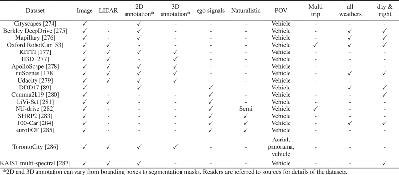

### 开源框架
开源框架对研究人员和业界都非常有用。这些框架可以“民主化”广告开发。Autoware[122]、Apollo[295]、Nvidia DriveWorks[296]和openpilot[297]是能够在现实世界中运行ADS平台的最常用软件栈。在本研究中，我们利用Autoware[122]实现了核心自动驾驶功能。

模拟在ADS开发中也占有重要地位。由于试验车辆的仪器成本仍然很高，并且在公共道路网络上进行试验受到高度监管，因此模拟环境有利于在道路试验之前开发某些算法/模块。此外，可以轻松地在模拟中测试与行人碰撞等高度危险的场景。CARLA[164]是为此目的开发的城市驾驶模拟器。TORCS[298]是为赛道模拟而开发的。一些研究人员甚至使用了《侠盗猎车手V》（Grand Theft Auto V ）等电脑游戏[299]。Gazebo[300]是一种常见的机器人仿真环境。对于交通模拟，SUMO[301]是一个广泛使用的开源平台。[302]提出了将真实世界的测量集成到模拟环境中的不同概念。

### 小结

在这项关于自动驾驶系统的调查中，我们概述了一些关键创新以及现有系统。虽然自动驾驶的前景诱人，而且已经向消费者推销，但这项调查显示，这项研究仍然存在明显的差距。已经提出了几种架构模型，从完全模块化到完全端到端，每种都有各自的缺点。用于定位、测绘和感知的最佳传感模式仍然存在分歧，算法仍然缺乏准确性和效率，对适当在线评估的需求已经变得明显。不理想的路况仍然是一个悬而未决的问题，以及如何应对过度的天气。车对车通信仍处于起步阶段，而由于所需的复杂基础设施，尚未实施基于云的集中式信息管理。人机交互是一个尚未得到充分研究的领域，有许多尚未解决的问题。

自动驾驶系统的发展依赖于科学学科和新技术的进步。因此，我们讨论了可能对自动驾驶技术产生重大影响的最新研究进展，无论是通过克服以前方法的弱点，还是通过提出替代方案。这项调查表明，通过跨学科的学术合作以及行业和公众的支持，剩余的挑战是可以解决的。有针对性地努力确保各级自动驾驶系统的稳健性，安全高效的道路就在眼前。

