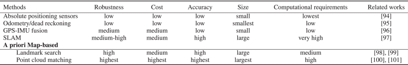

# 自动驾驶与网络安全

随着车辆自动化程度的提高，保护车辆功能的安全措施应防御未经授权的访问和操纵，以保证车辆，其组件及其功能（尤其是车辆控制功能）的安全运行的完整性。确保最高的安全标准并以尽可能最佳的方式保护车辆安全，这是维护自动驾驶功能持久扩展的根本利益，同时要考虑到这样做的最新技术水平。

## 为何信息安全在整个自动驾驶系统安全中占据如此高的地位？

- 自动驾驶车辆普遍需要连接外部网络，网络攻击面扩大，容易吸引攻击者攻击。
- 自动驾驶车辆中承载了大量软件，蕴涵了大量算法、数据，容易收到病毒、木马、勒索病毒、rootkit等恶意代码的影响。
- 自动驾驶车辆之间的数据通信依靠无线网络，容易被干扰或窃听。
- 自动驾驶车辆中的测绘数据（地图等）、个人隐私数据是各国政府和民众的关注要点，需要重点保护。
- 自动驾驶车辆所使用的诸多传感器可能受到新型网络攻击手段的影响。
- L2级到L3、L4级，自动驾驶功能更加依赖外部数据、传感数据、地图、位置信息等，依赖高带宽、低延时、并行计算，攻击者发动的拒绝服务攻击可能在多个层面存在。

##  A Survey of Autonomous Driving : common practices and emerging technologies.

>E. Yurtsever, J. Lambert, A. Carballo and K. Takeda, "A Survey of Autonomous Driving: Common Practices and Emerging Technologies," in IEEE Access, vol. 8, pp. 58443-58469, 2020, doi: 10.1109/ACCESS.2020.2983149.

根据美国NHTSA的研究，94%的道路交通事故由人为失误因素导致。在此背景下，自动驾驶系统（Automated Driving Systems，ADSs）被开发用于防止交通事故、节能减排、 transporting the mobility-impaired 、降低驾驶压力等。

研究ADSs的关键问题包括：
- 当前挑战 present chanllenges
- 可用的和新涌现的架构 available and emerging high-level system architectures
- 独立的核心功能 individual core functions
  - 定位 localization
  - 映射 mapping
  - 预测 perception
  - 规划 planning
  - 车辆控制 vehicle control
  - 人机接口 human interface 
- 可用数据集 available datasets
- 软件栈 software stacks
- 模拟工具 simulation tools
- 算法 algorithms

### 系统组件和架构

#### 系统架构
经典的系统架构如下图所示：

- ego-only systems，执行所有在单一车辆上，不依赖其他车辆和基础设施的必要的自动驾驶操作。
- 模块系统，模块化ADS的核心功能可总结为：
  - 定位 localization
  - 映射 mapping
  - 预测 perception
  - 规划 planning
  - 车辆控制 vehicle control
  - 人机接口 human interface 
  - 典型的pipelines 开始于原始传感器输入到定位和别的对象检测模块；接着是场景预测和决策生成；最后是控制模块和引擎命令。
  - 模块化系统的主要问题在于会传导错误和引入过多的复杂性。例如特斯拉事故中，预测模块产生的一个错误，将白色拖车误以为是天空，这个错误被传到到其他组件以致发生事故。

- 端到端的驾驶
  - 一些研究称其为直接感知（direct perception），直接传感器输入生成Ego-motion，可以是方向盘和踏板的连续动作或离散动作，例如加速和转向。
  - 主要的3种端到端驾驶方法：直接监督的深度学习、神经进化、深度强化学习。

上图是Information flow diagrams of: (a) a generic modular system, and (b) an end-to-end driving system.

- 连接系统。
  - 目前运行中的连接系统尚未出现，但未来包括Vehicular Ad hoc NETwork（VANETs）、V2X。
  - 连接系统可以克服单一平台的缺陷，例如感知范围、盲点、计算限制等等。
  - VANETS包括两种不同方式：传统基于IP网络的和信息中心网络（Information-Centric Networking，ICN）

#### 传感器和硬件

当前的ADS使用了各种各样的车载传感器。许多任务需要鲁棒性和可靠性的任务要求高度传感器冗余。

硬件单元可以分为5类：
- 用于感知的外部感知传感器 exteroceptive sensors for perception
- 用于完成监测车辆内部状态任务的本体感知传感器 proprioceptive sensors for internal vehicle state monitoring tasks
- 通信阵列 communication arrays,
- 执行器 actuators,
- 计算单元 computational units.

##### 单眼摄像头 Monocular Cammeras

摄像头可以被动感知色彩，没有任何向外发送的测试信号。感知色彩对于某些任务非常重要，例如：交通信号灯识别。

特点：
- 技术成熟。2-D 计算机视觉算法是当前较为的成熟领域（established field）。
- 不像环境发射任何信号
- 照明条件（Illumination conditions）严重影响性能
- 单一摄像头难以获得深层信息
- 季节条件影响性能

##### 全向摄像头 Omnidirectional Camera

全向摄像头是另一种摄像头阵列，有广泛的用途。导航、定位、映射需要全景视野功能。

特性：
- 360度 2D 视野。
- 全景视野（panoramic view）

##### 事件摄像头 Event Cameras
事件摄像头是ADS中新近出现的感知方式，它根据视觉刺激（visual stimulus）异步记录单个像素的数据，因此他的输出是不规则的数据点序，或者因亮度变化触发的事件。

特点：
- 输出为不规则数据点序列或亮度触发的事件
- 响应时间以微秒计
- 当前主要限制为像素大小和图像分辨率（image resolution），例如 下面图片中DAVIS40 图像像素大小为18.5*18.5微米，分辨率为240*180.

##### 雷达

雷达、激光雷达、超声传感器对于弥补摄像头的缺陷很有帮助。深层信息，例如：对象距离可以通过这些传感器获取的3D信息得到。

- 可以获得3D信息，即 Depth information（深度信息）
- 不受照明条件影响
- 主动发射信号测量
- 轻量化（可以安装在侧后镜中）
- 成本低（普通radar）

##### 激光雷达（lidar）
激光雷达使用与雷达相同的工作原理，但它辐射的是红外线光波（infrared light waves）。

- 200米内有精确度高
- 成本高
- 受雾、雪等天气影响
- 尺寸比一般雷达大

有了激光雷达助力，人类感知能力较ADS感知能力已经处于劣势，特别是照明条件不足的情况下。

##### 内部/本体感知传感器 Proprioceptive sensors

本体感知是另一个关键领域。车辆状态，例如速度、加速度、偏航（yaw）等必须被连续测量，以执行平台安全。这些信号通过CAN总线传递。

这类传感器包括：
- 轮编码器（wheel encoders） 用于测量里程（odometry）
- 惯性导航测试设备（Inertial Measurement Units，IMU）用于监视速度（velocity）和位置（position）变化。
- 转速表（tachometers）用于测量速度和高度

## 定位与映射（Localization and Mapping)

定位功能是导航等功能的基础。

常见的定位方法包括：
- 全球定位系统（global positioning system，GPS）与惯性导航单元（inertial measurement unit）的结合方法,即 GPS-IMU fusion方法。
- 同步定位和映射（Simultaneous Localization And Mapping，SLAM）方法
- 基于先验的图的定位（a priori map-based localization）

### GPS-IMU
GPS-IMU融合的主要原理是利用绝对位置读数对航位推算的累积误差进行间隔校正.

- 位置和方向的变化，由IMU测量
- 通用航位推算（dead reckoning）错误会随着时间增加而累积
- 通过整合GPS读数，IMU的累积误差可以被修正

- GPS-IMU本身不能应用于车辆定位，因为其性能指标不符合要求。密集城市环境下，要求非常高精度的定位值。
- GPS功能会因频道和高建筑物影响时断时续
- GPS-IMU 仅能应用于高阶路径规划

### SLAM （Simultaneous Localization and Mapping）
SLAM是在同一时间进行在线地图制作和定位车辆，它不需要周围环境的先验信息。这是机器人定位在室内环境下的常见方法。

- 不需要环境先验信息
- 高计算量，性能若能提高则有较大应用空间。
- 户外环境下的性能，比预建地图方式要差
- 可用于任何环境下

### 基于先验地图的定位

这种方法的核心思想在于匹配比较：定位通过比较在线读数与预先建立的地图信息