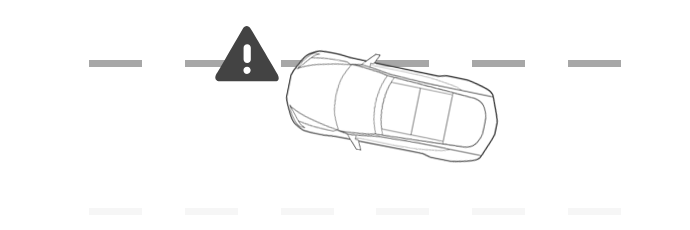
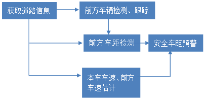
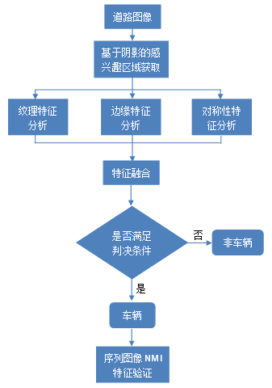
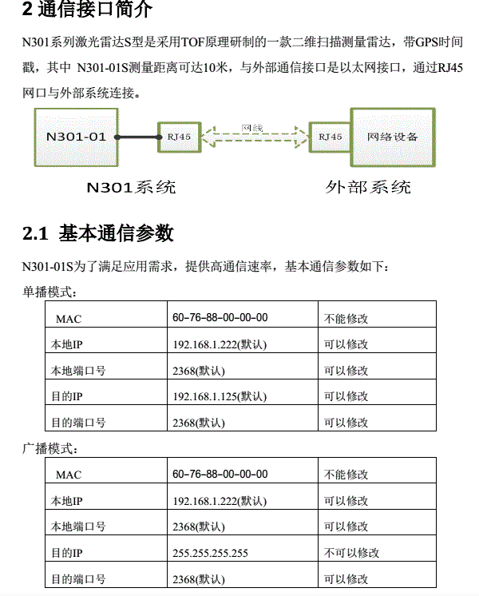
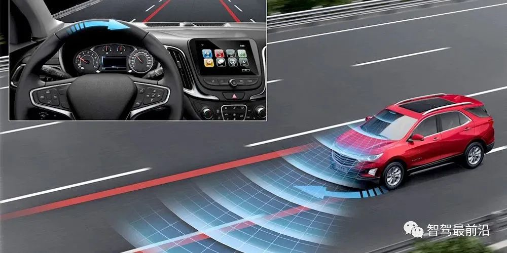

# 自动驾驶典型应用场景安全分析
智能化是实现汽车作为人们第三生活空间这一目标的重要技术路径，当前汽车智能化主要有两大发展方向：驾驶自动化和座舱智能化。自动驾驶（ADAS/AD）的使命是将人的脚（纵向控制）、手（横向控制）、眼（感知）和脑（决策）等从驾驶任务中解放出来。人的精力被释放出来后，进一步促进了人在汽车内办公、休闲和娱乐的需求，这些需求推动了汽车座舱的数字化、信息化以及新兴的人机交互模式等技术的蓬勃发展，这也就是“智能座舱（Intelligent Cockpit）”技术。

## 辅助自动驾驶场景安全分析

通过 C-V2X 工作组、C-SAE、C-ITS 等中国标准及产业组织共同研究，面向辅助驾驶阶段定义了 17 个 C-V2X 的基础应用场景。这些应用场景基于 C-V2X 信息交互，实现车辆、道路设施、行人等交通参与者之间的实时状态共享，辅助驾驶员进行决策。

序号 类别 应用名称
1 安全 前向碰撞预警 FCW
2 安全 交叉路口碰撞预警
3 安全 左转辅助
4 安全 盲区预警 / 变道辅助
5 安全 逆向超车预警
6 安全 紧急制动预警
7 安全 异常车辆提醒
8 安全 车辆失控预警
9 安全 道路危险状况提示
10 安全 限速预警
11 安全 闯红灯预警
12 安全 弱势交通参与者碰撞预警
13 效率 绿波车速引导
14 效率 车内标牌
15 效率 前方拥堵提醒
16 效率 紧急车辆提醒
17 信息服务 汽车近场支付

### 前向碰撞预警场景

Forward Collision Warning (FCW)前方碰撞预警系统能够通过摄像头系统或雷达系统来时刻监测前方车辆，判断本车于前车之间的距离、方位及相对速度，当存在潜在碰撞危险时对驾驶者进行警告。FCW系统本身可能不采取任何制动措施去避免碰撞或控制车辆。

2017年3月7日，交通运输部组织制定了交通运输行业标准《营运客车安全技术条件》，并于2017年4月1日起正式实施，要求9米以上的营运客车要求必须具备车道偏离预警系统（LDW）和前方碰撞预警系统（FCW），并给出了13个月的过渡期。交通部此项强制要求是国内首个强制安装ADAS系统的案例，由此可见，LDW和FCW是 ADAS 的必备基础功能。

上图为：LDW - 车道偏离警告LDW 系统会在驾驶员的车辆并入另一条车道而没有激活转向信号时发出警报。

上图为：FCW – 前方碰撞警告
FCW系统监控车辆和前方车辆的速度。它还监控两辆车之间的距离。一旦系统预见到即将发生的碰撞，系统就会提醒驾驶员。

上图为HMW – 车头时距监测警告
当前方车辆离车辆太近时，HMW 系统会向驾驶员发出警报。

上图为PCW – 行人碰撞警告
PWC 系统在检测到可能与行人发生碰撞时会向驾驶员发出警报。

上图为AEB – 自动紧急制动
AEB 系统检测到潜在的碰撞并在驾驶员忽略其他碰撞警告时启动紧急制动。

相关统计数据表明，由于驾驶员的主观因素导致的交通事故占比最高，若在交通事故发生前的1.5s给驾驶员发出预警，可避免90%的碰撞事故，大大减少交通事故的伤害。而汽车防碰撞安全控制系统就是通过各种传感器，比如摄像头、雷达等，实时检测车辆周围的物体，并检测目标车辆距离本车的距离。当安全距离小于阈值时，则发出警报提示驾驶员，有效降低了交通事故的发生。

其实，对汽车防碰撞系统的研究源远流长，早在20世纪70年代，日本就开始进行了汽车碰撞系统的研究，1999年，本田、丰田、日产三大车厂各自开始开发自己的前车碰撞预警系统，2003年在美版雅阁中本田首次安装了自己的碰撞缓解制动系统（CMBS），可以看做是现在FCW（Forward Collision Warning）系统的前身。CMBS系统的工作原理是：当毫米波雷达探测到前方可能有碰撞危险时，便以警告的方式提醒驾驶员，如果继续接近，当系统判断将要追尾时，则会采取自动制动措施。而日本另一大汽车厂商丰田的预碰撞安全系统最早是在2003年安装在雷克萨斯LX和RX车系上，同样也是采取了毫米波雷达作为传感器。欧美对此的研究也不落后，作为全球安全领域的领军者——沃尔沃在2006年的S80上首次安装了碰撞预警系统，通过毫米波雷达来检测车距，发现危险时会提示驾驶员立即制动，同时会推动制动片接近制动盘，以便为驾驶员制动提供最快的反应速度，2007年系统升级后，沃尔沃便增加了自动制动的功能。现在，FCW功能已经成为ADAS系统常见的标准配置。

#### 前碰撞预警系统FCW实现原理详解

首先，通过分析传感器获取的前方道路信息对前方车辆进行识别和跟踪，如果有车辆被识别出来，则对前方车距进行测量。同时利用车速估计，根据安全车距预警模型判断追尾可能，一旦存在追尾危险，便根据预警规则及时给予驾驶人主动预警。

可以将其分为三个部分：
- 前方车辆识别
- 前方车距检测
- 安全车距预警模型构建

##### 前方车辆识别：
- 可以采用的传感器有：单目视觉、立体视觉、毫米波雷达、多传感器融合
- 单目视觉会读图像进行识别的研究最多，知名adas公司Mileview主要采用此方法。这种方法的车辆检测一般都是依靠车辆特征信息，如车辆形状、车高与车宽的比例等作为检测车辆边缘的约束条件，对图像进行边缘增强处理后获得一些包含车辆信息的水平和垂直边缘，从而对车辆进行检测。使用单目摄像头的算法简单、计算的实时性强，但单目视觉方案容易受到光照、阴影等外界环境因素的影响，使其可靠性下降。

- 立体视觉，直接模拟人类视觉处理景物方式，通过多个视点观察同一景物，获取不同视角下的感知图像。技术尚不成熟。

- 多传感器融合，是当前研究主流，常见的有：视觉+激光雷达、视觉+毫米波雷达。除了成本高，计算较为复杂也是一个问题。

##### 前方车距检测

车距测量是FCW系统的重要组成部分，超声波、毫米波、激光雷达、视觉摄像头都可以实现。
- 超声波测距原理简单、成本最低，但其测距精准性受室外温度影响大，衰减快，因此目前只适合短距离测距，主要用在倒车雷达上。
- 实际应用中，常用的是毫米波雷达和视觉方案。
- 通常24GHz的毫米波雷达适于近距离探测；77GHz的毫米波雷达适于远距离探测。

- 视觉测距所需的算法比较复杂，通常有单目视觉和双目视觉两种。单目视觉采用摄像机的焦距和事先确定的参数来估算车距，而双目视觉测距是利用视差的原理，通过对两幅图像进行计算机分析和处理，确定物体的三维坐标，可采用公垂线中点法计算出距离。
- 鉴于视觉技术采集的信息量丰富，以及目前图像处理技术的巨大进步和计算能力已经能够保证图像处理实时性要求，价格低廉的视觉方案成为最理想的选择。
  
例如：对前方车辆的跟踪和测距都是动态进行的，如果前方车辆突然变道超车，FCW必须马上将跟踪车辆切换的新的目标上。

##### 安全车距预警模型

在模型设计上，马自达模型、本田模型以及伯克利模型是比较经典的安全车距模型，后续的很多模型都是在其基础上进行改良。

- 马自达模型：当发现前车减速时，开始向安全车距警报系统发送信息。当前后车辆距离低于跟随车的制动距离时，系统向制动器发出指令，跟随车开始减速，最后与前车速度均见到零时，此时两车之间距离为5米。该模型的本质是实时计算最小安全距离，从而对车速进行预警和控制。

- 本田模型：该公司研制的汽车防撞系统采用的是两次报警模型，第一次为提醒报警，第二次为制动报警。该模型的提醒报警距离的确定是先对驾驶人进行多次试验得到数据，然后通过大数据处理得到最佳安全距离。

- 伯克利模型：也采用两次报警方式，提醒报警的距离计算是沿用马自达的模型，不同的是讲前后车的制动减速取为相等的值。制动报警距离的计算采用的是非保守的方法，为了不影响驾驶人正常操作。该模型是综合考虑上面两类方法的优点，实用性有较大提高。

#### 安全分析
##### 攻击面梳理
从该场景的实现情况来看，可能受到网络攻击影响的组件有：
- 传感器
- 内部通信
  - 连接超声波雷达的 LIN 或 CAN
  - 连接毫米波雷达的 CAN 或 CAN-FD
  - 连接摄像头
  - 激光雷达
    - UART串行通信
    - 以太网接口（RJ45头）例如深圳镭神智能公司的N301激光雷达S型。UDP协议
    - 法雷奥新款激光雷达系统能够以450万像素、每秒25帧的速度重建车辆周围的3D实时图像。
- 计算环境安全威胁
- 面向算法漏洞的攻击

### 盲区预警/变道辅助
由于汽车后视镜存在视觉盲区，变道之前就看不到盲区的车辆，如果盲区内有超车车辆，此时变道就会发生碰撞事故。在大雨天气、大雾天气、夜间光线昏暗，更加难以看清后方车辆，此时变道就面临更大的危险，盲点监测系统就是为了解决后视镜的盲区而产生的。

盲点监测系统BSD（ Blind Spot Detection)，是汽车上的一款安全类的高科技配置，主要功能是扫除后视镜盲区，依赖于车辆尾部两个雷达时刻监测车辆的侧后面和侧面状态，如果车辆位于该区域内，驾驶员将通过后视镜上盲点警告指示灯和组合仪表获得相关警告提示，避免在车道变换过程中由于后视镜盲区而发生事故。

## 自动驾驶典型应用场景及技术需求

5G 技术的更大数据吞吐量、更低时延、更高安全性和更海量连接等特性，极大地促进了智能驾驶和智慧交通发展。产业各方开始了面向自动驾驶的增强型应用场景的研究与制定，一方面从基础典型应用场景的实时状态共享过渡到车与车、车与路、车与云的协同控制，增强了信息交互复杂程度，可实现协同自动驾驶与智慧交通的应用；另一方面基于通信与计算技术的提升，交通参与者之间可以实时传输高精度视频、传感器数据，甚至是局部动态高精度地图数据，提高了感知精度与数据丰富程度。

序号 类别 应用名称
1 安全 协作式变道
2 安全 协作式匝道汇入
3 安全 协作式交叉口通行
4 安全 感知数据共享 / 车路协同感知
5 安全 道路障碍物提醒
6 安全 慢行交通轨迹识别及行为分析
7 效率 车辆编队
8 效率 协作式车队管理
9 效率 特殊车辆信号优先
10 效率 动态车道管理
11 效率 车辆路径引导
12 效率 场站进出服务
13 效率 基于实时网联数据的交通信号配时动态优化
14 效率 高速公路专用道柔性管理
15 效率 智能停车引导
16 信息服务 浮动车数据采集
17 信息服务 差分数据服务
18 信息服务 基于车路协同的主被动电子收费
19 信息服务 基于车路协同的远程软件升级

3GPP 将增强的应用场景分为 4 类，包括：车辆编队行驶、半 / 全自动驾驶、传感器信息交互和远程驾驶；

5GAA 也针对面向自动驾驶的增强应用场景进行了定义，涉及安全、效率、自动驾驶、公共服务等方面。

面向自动驾驶的增强应用场景对数据交互技术、高精度定位技术、多传感器融合技术、高性能处理平台、高精度地图等提出了新的需求。
- 在通信方面，单车上下行数据速率需求大于 10 Mbit/s，部分场景需求 50 Mbit/s，
- 时延需求为 3 ～ 50 ms，
- 可靠性需大于99.999%；
- 在信息交互方面，需实时交互车辆、道路、行人的全量数据，
- 利用多传感器融合技术获取实时动态交通高精度地图；
- 在数据处理方面，单车每天将产生高达 PB 级的数据，对数据的存储、分析等计算能力提出了更高的要求；
- 在定位方面，需达到亚米级甚至厘米级的定位精度。

## ADAS / AD

早期的ADAS技术主要以被动报警为主，如今的ADAS主要是主动干预。

通常，L0-L2级自动驾驶，习惯用ADAS表征；L2+级自动驾驶，用ADAS/AD表征，以示过渡；L3-L4级自动驾驶，用AD表征。

### 功能
目前（2021）常见的ADAS系统包括：

主动安全功能：
- 车道偏离预警系统（Lane departure warning system, LDWS）
- 车道保持系统LKS（Lane keeping System）
- 前碰撞预防系统FCW （Front collision warning）
- 行人碰撞预警（Pedestrian collision warning）
- 自动紧急制动AEB（Autonomous Emergency barking warning）
- 盲点监测系统BSD （Blind spot detection warning）
- 变道辅助LCA （Lane Changing Assist）
- 后向碰撞预警（Rear Collision Warning）
- 车道居中控制（Lane Centering Control）

驾驶舒适性：
- 驾驶员疲劳预警系统DFM
- 自适应巡航系统ACC（adaptive cruise control）
- 自适应灯光控制ALC
- 交通拥堵辅助TJA（traffic jam assist）
- 集成巡航辅助ICA（Integrated cruise assistant）
- 高速公路辅助HWA（Highway assist）
- 夜视系统NVD等
- 导航自动驾驶辅助NOA（navigation on autopilot）

泊车辅助：
- 自动泊车系统APA（automated parking assist）
- 远程泊车辅助RPA（Remote Parking Assist）
- 家庭区域泊车辅助HPA（Home zone parking pilot)
- 全景环视监控AVM（Around View Monitoring）
- 召唤Summon

L3/L4级监督或无监督的自动驾驶：
- 交通拥堵领航TJP：驾驶员可以在拥堵的高速或快速路上放开手脚，同时注意力可以长时间内从驾驶环境中转移，看手机或接电话、看风景等活动。该系统最高工作速度为40-60kph。
- 高速公路领航HWP
- 自动代客泊车AVP（Automated valet parking）：对于停车场等封闭场，用户在指定下客点下车，通过手机APP下达泊车指令，车辆在接收到指令后可自动行驶到停车位，不需要用户操作与监控。AVP被称为是解决用户最后一公里自由的L4级自动驾驶技术，是目前最有希望成为商业落地的自动驾驶技术应用场景。
- 城市领航CP（city-pilot），也成Urban pilot，属于开放道路下的L4级别自动驾驶功能。
#### LDWS

车道偏离预警系统LDWS（ Lane departure warning system）是指行车中未打转向灯突然大幅度偏离车道，不正常偏移时，行车记录仪一旦判定行驶路线有异，便会以行车记录仪的显示屏幕提醒驾驶人，并发出声响警告对司机进行警示。这将使司机可以马上采取行动，回到原行车道上。

车道偏离预警系统主要由4部分组成:
- HUD抬头显示器
- 摄像头
- 控制器
- 传感器

当车道偏离预警系统开启时，摄像头（一般安置在车身侧面或后视镜位置）会时刻采集行驶车道的标识线，通过图像处理获得汽车在当前车道中的位置参数。

当检测到汽车偏离车道时，传感器会及时收集车辆数据和驾驶员的操作状态，之后由控制器发出警报信号，**整个过程大约在0.5秒完成**，为驾驶者提供更多的反应时间。而如果驾驶者打开转向灯，正常进行变线行驶，那么车道偏离预警系统不会做出任何提示。

#### 车道保持系统LKS

车道保持辅助系统（Lane keeping system）属于智能驾驶辅助系统中的一种。它可以在车道偏离预警系统（LDWS）的基础上对刹车的控制协调装置进行控制。对车辆行驶时借助一个摄像头识别行驶车道的标识线将车辆保持在车道上提供支持。可检测本车在车道内的位置，并可自动调整转向，使本车保持在车道内行驶。

如果车辆接近识别到的标记线并可能脱离行驶车道，那么会通过方向盘的振动，或者是声音来提请驾驶员注意，并轻微转动方向盘修正行驶方向，使车辆处于正确的车道上，若方向盘长时间检测到无人主动干预，则发出报警，用来提醒驾驶人员。

如果车道保持辅助系统识别到本车道两侧的标记线，那么系统处于待命状态。这通过组合仪表盘中的绿色指示灯显示。当系统处于待命状态下，如果在Y过标记线前打了转向灯，警告信号就会被屏蔽，认定驾驶员为有意识地换道。

该系统主要应用于结构化的道路上，如高速公路和路面条件较好（车道线清晰）的公路上行驶。当车速达到65km/h或以上才开始运行。

#### 自适应巡航系统ACC

自适应巡航系统ACC（Adaptive Cruise Control）是一项舒适性的辅助驾驶功能。如果车辆前方畅通，自适应巡航（ACC）将保持设定的最大巡航速度向前行驶。如果检测到前方有车辆，自适应巡航（ACC） 将根据需要降低车速，与前车保持基于选定时间的距离，直到达到合适的巡航速度。

自适应巡航也可称为主动巡航，类似于传统的定速巡航控制，该系统包括雷达传感器、数字信号处理器和控制模块。在自适应巡航系统中，系统利用低功率雷达或红外线光束得到前车的确切位置，如果发现前车减速或监测到新目标，系统就会发送执行信号给发动机或制动系统来降低车速，从而使车辆和前车保持一个安全的行驶距离。

当前方道路障碍清除后又会加速恢复到设定的车速，雷达系统会自动监测下一个目标。主动巡航控制系统代替司机控制车速，避免了频繁取消和设定巡航控制。当与前车之间的距离过小时，ACC控制单元可以通过与制动防抱死系统、发动机控制系统协调动作，使车轮适当制动，并使发动机的输出功率下降，以使车辆与前方车辆始终保持安全距离。自适应巡航系统适合于多种路况，为驾驶者提供了一种更轻松的驾驶方式。

#### 前碰撞预防系统FCW
前碰撞预防系统FCW (Forward Collision Warning)是通过雷达系统来时刻监测前方车辆，判断本车与前车之间的距离、方位及相对速度，当存在潜在碰撞危险时对驾驶者进行警告。FCW系统本身不会采取任何制动措施去避免碰撞或控制车辆。

通过分析传感器获取的前方道路信息对前方车辆进行识别和跟踪，如果有车辆被识别出来，则对前方车距进行测量。同时利用车速估计，根据安全车距预警模型判断追尾可能，一旦存在追尾危险，便根据预警规则及时给予驾驶人主动预警。

#### 自动泊车系统APA

自动泊车系统APA（Automatic Parking Assist）是利用车载传感器（一般为超声波雷达或摄像头）识别有效的泊车空间，并通过控制单元控制车辆进行泊车。相比于传统的倒车辅助功能，如倒车影像以及倒车雷达，自动泊车的功能智能化程度更高，有效的减轻了驾驶员的倒车困难。

全自动泊车辅助系统APA，通过控制车辆的加减速度和转向角度自动停放车辆。该系统通过AVM（环视）和USS（超声波雷达）感知泊车环境，使用IMU和车轮传感器估计车辆姿态（位置和行驶方向），并根据驾驶员的选择自动或手动设置目标泊车位。然后系统进行自动泊车轨迹计算，并通过精确的车辆定位与车辆控制系统使车辆沿定义的泊车轨迹进行全自动泊车，直至到达最终目标泊车位。

#### 盲点监测系统BSD

由于汽车后视镜存在视觉盲区，变道之前就看不到盲区的车辆，如果盲区内有超车车辆，此时变道就会发生碰撞事故。在大雨天气、大雾天气、夜间光线昏暗，更加难以看清后方车辆，此时变道就面临更大的危险，盲点监测系统就是为了解决后视镜的盲区而产生的。

盲点监测系统BSD（ Blind Spot Detection)，是汽车上的一款安全类的高科技配置，主要功能是扫除后视镜盲区，依赖于车辆尾部两个雷达时刻监测车辆的侧后面和侧面状态，如果车辆位于该区域内，驾驶员将通过后视镜上盲点警告指示灯和组合仪表获得相关警告提示，避免在车道变换过程中由于后视镜盲区而发生事故。

#### 驾驶员疲劳预警系统DFM

驾驶员疲劳预警系统DFM（Driver Fatigue Monitor System）主要是通过摄像头获取的图像，通过视觉跟踪、目标检测、动作识别等技术对驾驶员的驾驶行为及生理状态进行检测，当驾驶员发生疲劳、分心、打电话、抽烟等危险情况时在系统设定时间内报警以避免事故发生。DFM系统能有效规范驾驶员的驾驶行为、大大降低交通事故发生的几率。

通过分析驾驶员的疲劳特征（如打哈欠、闭眼等），对疲劳行为及时发出疲劳驾驶预警。高精准度的算法甚至能做到不受时间段、光照情况、是否戴墨镜等外界条件影响，始终对驾驶员的疲劳状态进行有效管理。当驾驶人员产生生理疲劳状态时，立即发出预警警告，及时唤醒驾驶员，避免严重事故发生。

#### 自适应灯光控制ALC

自适应灯光控制ALC（Adaptive Light Control）是一种智能灯光调节系统。通过感知驾驶员操作、车辆行驶状态、路面变化以及天气环境等信息，AFS 自动控制前照灯实时进行上下、左右照明角度的调整，为驾驶员提供最佳道路照明效果。

自适应前照灯系统共由四部分组成：传感器、ecu、车灯控制系统和前照灯。汽车车速传感器和方向盘转角传感器不断地把检测到的信号传递给ecu，ecu根据传感器检测到的信号进行处理，把处理完后的数据进行判断，输出前照灯转角指令，使前照灯转过相应的角度。

汽车在转弯时，重点是要提前看到所转方向的障碍物，根据现实驾驶的经验，车灯一般只需转过o～15°即可，只需要所转方向侧的那只前照灯实现智能转向就可，另一侧前照灯还是保持原来的方向。虽简化了控制，仍然能够达到预期的效果。它可以通过控制系统能够显著改善各种路况下的照明效果，提高行车安全。

#### 自动紧急制动AEB 

自动紧急制动AEB（Autonomous Emergency Braking）是一种汽车主动安全技术，主要由 3 大模块构成，其中测距模块的核心包括微波雷达、激光雷达和视频系统等，它可以提供前方道路安全、准确、实时的图像和路况信息。

AEB 系统采用雷达测出与前车或者障碍物的距离，然后利用数据分析模块将测出的距离与警报距离、安全距离进行比较，小于警报距离时就进行警报提示，而小于安全距离时即使在驾驶员没有来得及踩制动踏板的情况下，AEB 系统也会启动，使汽车自动制动，从而为安全出行保驾护航。

#### 夜视系统NVD 

夜视系统NVD（Night Vision Device）是一种源自军事用途的汽车驾驶辅助系统。在这个辅助系统的帮助下，驾驶者在夜间或弱光线的驾驶过程中将获得更高的预见能力，它能够针对潜在危险向驾驶者提供更加全面准确的信息或发出早期警告。

夜视系统NVD由安置于车前保险杠的（UFPA）侦测传感器和液晶抬头显示器（HUD）组成，主要是通过主动式红外照射、微光夜视技术以及红外热成像技术，来帮助驾驶者看见以汽车远光灯无法清楚辨识的物体，驾驶者可将虚拟影像当作前方视野的一部分，提升了视线不佳时的行车安全性。