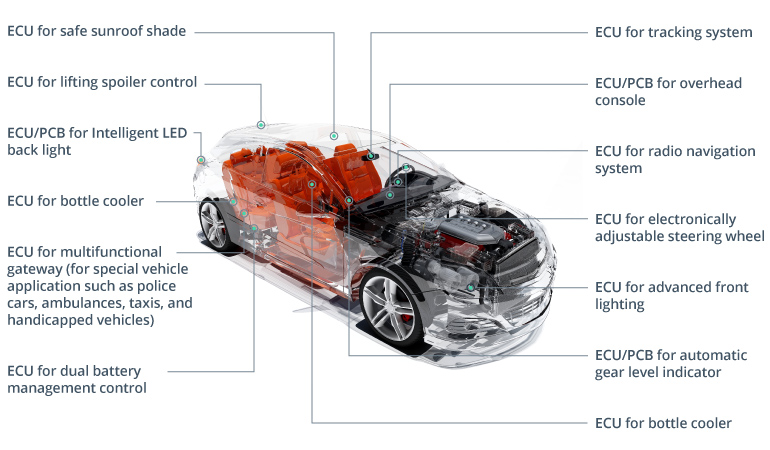

# 自动驾驶操作系统

自动驾驶汽车不仅仅是一台巨大的、外形奇特的车轮上的计算机。它更像一个数据中心，由执行或负责不同任务的联网计算机组成。自动驾驶汽车操作系统在这些计算机上各有不同。

**复杂性是自动驾驶汽车中汽车操作系统平台的关键属性。**建造自动驾驶汽车是一项挑战。构建自动驾驶汽车操作系统更具挑战性。

让汽车更智能、更安全比建造今天在我们的街道上行驶的任何车辆要困难得多。自动驾驶汽车的汽车操作系统也是如此。选择汽车操作系统是一件大事，因为它需要控制汽车的核心功能，同时保证乘客和驾驶环境的安全。

在自动驾驶汽车中构建和运行操作系统不仅需要知识，还需要大量的知识 定制软件开发 和计算能力。每辆自动驾驶汽车都使用[数亿行代码](https://informationisbeautiful.net/visualizations/million-lines-of-code/)。查看此可视化，比较不同服务和应用程序需要多少行代码。

自动驾驶汽车的操作系统是具有多个大脑的技术怪物。这并不奇怪，因为它们必须替代方向盘后人脑的能力。这是数量与质量同等重要的情况。电子控制单元 (ECU) 充当自动驾驶汽车 (AV) 的大脑。ECU 可以被视为小型计算机。它们的大小、用途和运行的操作系统各不相同。

自动驾驶汽车是一个多样化和复杂的环境，允许多个操作系统共存。不仅如此，它们甚至可以在同一硬件上相互叠加运行。从发动机到挡风玻璃刮水器的每一个部件，从转向到制动的每一个汽车控制都在 ECU 的指导下。

我们可以将自动驾驶汽车中的所有 ECU 大致分为两类：

- ECU负责ADAS和控制汽车操作，如转向、换档、制动、油耗等。这些 ECU 可以由各种实时操作系统 (RTOS) 管理。

- ECU 负责 A/V 信息娱乐系统并运行不同的应用程序。这些 ECU 可以由更类似于在 PC 上运行的操作系统来操作。这些不仅可以是 RTOS，还可以是通用操作系统 (GPOS)。

## 自动驾驶汽车所采用的os举例

### QNX Neutrino 

QNX Neutrino 是自动驾驶汽车os中公认的领导者。[它](http://blackberry.qnx.com/en/products/neutrino-rtos/neutrino-rtos)是一种汽车实时操作系统，用于在成功和安全执行所需的时间范围内运行所有流程和操作。除了汽车操作系统之外，黑莓旗下的 QNX Software Systems 还构建了先进的汽车开发平台，运行自动驾驶汽车创新中心，并提供专门的团队（福特使用的）来扩展 QNX Neutrino 操作系统并提供其他服务。

黑莓的 QNX 声称他们正在构建一个联网汽车操作系统以及安全、可扩展和可信的软件解决方案，以实现联网和自动驾驶汽车的未来。为了证明这一点，该公司在无人驾驶和半无人驾驶车辆的新自动化控制系统以及新的安全和安保系统以及 V2V 和 V2I 通信技术方面进行了大量投资。

使用它的汽车品牌： QNX Neutrino 已经与大约 40 家汽车制造商合作，包括福特、讴歌、大众、宝马和奥迪。您可以阅读有关QNX 联网和自动驾驶汽车计划的更多信息 [这里](http://blackberry.qnx.com/en/solutions/industries/automotive/index).

### WindRiver VxWorks

[VxWorks](https://www.windriver.com/products/vxworks/) 是一种实时车辆操作系统，符合 [ISO 26262安全标准](https://www.iso.org/standard/68383.html)。它的创建者 Wind River 是一家面向包括汽车在内的安全关键领域的全球物联网软件提供商。该车辆操作系统可帮助汽车制造商和 OEM 部署安全、可靠和可靠的自动驾驶平台。

使用它的汽车品牌：东芝、博世、宝马、福特、大众等。您可以阅读更多关于风河针对联网和自动驾驶汽车的计划 [这里](https://www.windriver.com/markets/automotive/).

### Green Hills INTEGRITY®

这种汽车实时操作系统是 Green Hills ADAS 平台的一部分，该平台是一个完整的解决方案，用于构建安全、高性能和可扩展的 ADAS 系统的软件组件。Green Hills 声称，产品级电子控制单元由 [INTEGRITY ](https://www.ghs.com/products/rtos/integrity.html)车辆操作系统将简化对生命至关重要的自动驾驶汽车应用程序的开发和测试。

使用它的汽车品牌： Green Hills 主要通过与原始设备制造商和一级/二级供应商的合作伙伴关系开展工作。您可以阅读有关Green Hills 联网和自动驾驶汽车计划的更多信息[ 这里](https://www.ghs.com/products/auto_adas.html).

### NVIDIA DRIVE™ 操作系统
尽管 NVIDIA 没有引领汽车操作系统竞赛，但我们不能低估芯片制造商的作用，他们的 GPU 是许多自动驾驶汽车的核心处理引擎。2016 年，NVIDIA 推出了自动驾驶汽车操作系统 DriveWorks Alpha 1。尽管它在汽车界并没有引起太大的轰动，但这个可扩展的自动驾驶人工智能平台框架几乎每个月都会出现新的发展。[英伟达驱动 ](https://developer.nvidia.com/drive/drive-software)不仅仅是一个汽车操作系统：它是一个巨大的平台，其产品和服务肯定会取悦原始设备制造商和一级供应商。

使用它的汽车品牌： DriveWorks 被全球 370 家汽车制造商、一级供应商、开发商和研究人员使用，包括特斯拉、大众、梅赛德斯-奔驰、奥迪、维宁尔和博世。您可以阅读有关NVIDIA 联网和自动驾驶汽车计划的更多信息 [这里](https://www.nvidia.com/en-us/self-driving-cars/).

### Mentor Nucleus® 操作系统
西门子旗下的 Mentor 提供的一系列服务可帮助汽车制造商和 OEM 满足日益增长的集成 ADAS、驾驶员信息和信息娱乐的趋势。这Nucleus®实时自动驾驶汽车操作系统就是这些服务之一。此外，Mentor 还推出了 DRS360 自动驾驶平台，旨在提供 5 级自动驾驶汽车所需的低延迟、高精度传感。

https://www.mentor.com/embedded-software/nucleus/

https://www.mentor.com/mentor-automotive/autonomous
### Linux
Linux 是自动驾驶汽车中流行的操作系统平台。甚至几年前，谷歌自动驾驶汽车中的计算机还在运行Linux，大众和通用汽车的原型也是如此。Linux 有多种版本，但汽车中使用最广泛的两个版本是 Ubuntu 和嵌入式 Linux。

像大多数汽车操作系统一样，Linux 不是一个单一的操作系统。这是一个完整的基于基金会的组织，称为 Automotive Grade Linux (AGL)，它提高了系统的安全性，并致力于远程信息处理解决方案和地图项目。除了现在大量使用 Linux 的信息娱乐堆栈之外，实时汽车操作系统 Linux 将在最高级别的自动驾驶中发挥作用。

使用它的汽车品牌：宝马、通用、大众、丰田、雪佛兰、本田、梅赛德斯、特斯拉、Lyft、百度。您可以阅读有关联网和自动驾驶汽车的 Linux 计划的更多信息 [这里](https://www.automotivelinux.org/).

### 安卓汽车操作系统
谷歌并没有节省资源来带头管理自动驾驶汽车的信息娱乐系统。这家科技巨头计划通过扩展版来做到这一点[安卓汽车](https://www.android.com/auto/)，目前仅在与 Android 智能手机配对时有效。显示在信息娱乐显示屏上，这个联网汽车操作系统提供对 Google Play 生态系统的访问，并通过高级 Google 助理连接到系统级操作。该系统也是可定制的，使其对汽车制造商和最终用户更具吸引力。

使用它的汽车品牌：沃尔沃和奥迪已与谷歌签订合同，将在 2020 年开始使用该汽车操作系统的升级版。紧随其后的是雷诺-日产-三菱联盟，该联盟正在与谷歌合作嵌入 Android 操作系统未来车辆中的汽车系统。您可以阅读有关Google 联网和自动驾驶汽车计划的更多信息 [这里](https://source.android.com/devices/automotive).

### Apple CarPlay
如果您听说 Google 开创了某种服务，请留意 Apple（反之亦然）。诚然，很难说苹果的信息娱乐系统提供了一个成熟的联网汽车操作系统，但他们确实有一个王牌：一个名为 Titan 的所谓“秘密”自动驾驶项目。众所周知，苹果也在为该品牌生产的自动驾驶汽车开发自己的操作系统。现在，我们所能做的就是等着看他们能将当前版本的[Carplay](https://www.apple.com/ios/carplay/).

使用它的汽车品牌：截至今天，Apple CarPlay 已作为标准或可选功能提供给 30 多家制造商，包括奥迪、宝马、丰田、日产、福特、本田、马自达和梅赛德斯-奔驰。

### ROS（机器人操作系统）
不要被它的名字所欺骗： 机器人操作系统本身不是操作系统。它是一个开源软件平台和一套机器人编程工具。自动驾驶汽车由执行不同功能但应作为单个系统进行通信和管理的各种 ECU 组成。这就是 ROS 可以提供帮助的地方。它适用于完全分布式的计算术语，这意味着不同的计算机可以参与控制过程，但作为一个实体。

阻止汽车行业大规模采用 ROS 的主要问题是安全性。由于没有防止第三方进入 ROS 网络的安全机制，人们永远不会同意将自己的生命交到这个开放平台的手中。汽车制造商非常清楚这一点。

使用它的汽车公司：通用汽车、宝马、福特、博世。您可以阅读有关联网和自动驾驶汽车的 ROS 计划的更多信息 [这里](https://roscon.ros.org/2018/presentations/ROSCon2018_LessonsLearnedSelfDriving.pdf).

### 微软
微软Windows，世界上最受欢迎的台式机和笔记本电脑操作系统，在联网和自动驾驶计划方面落后。然而，微软确实有计划与需要为其车辆配备操作系统的汽车制造商合作，并帮助他们开发自己的自动驾驶能力。借助包括 Azure、Office 365、Cortana 和其他基于云的智能服务的 Microsoft 互联车辆平台，微软肯定会加入自动驾驶热潮。

使用它的汽车公司：雷诺-日产联盟。