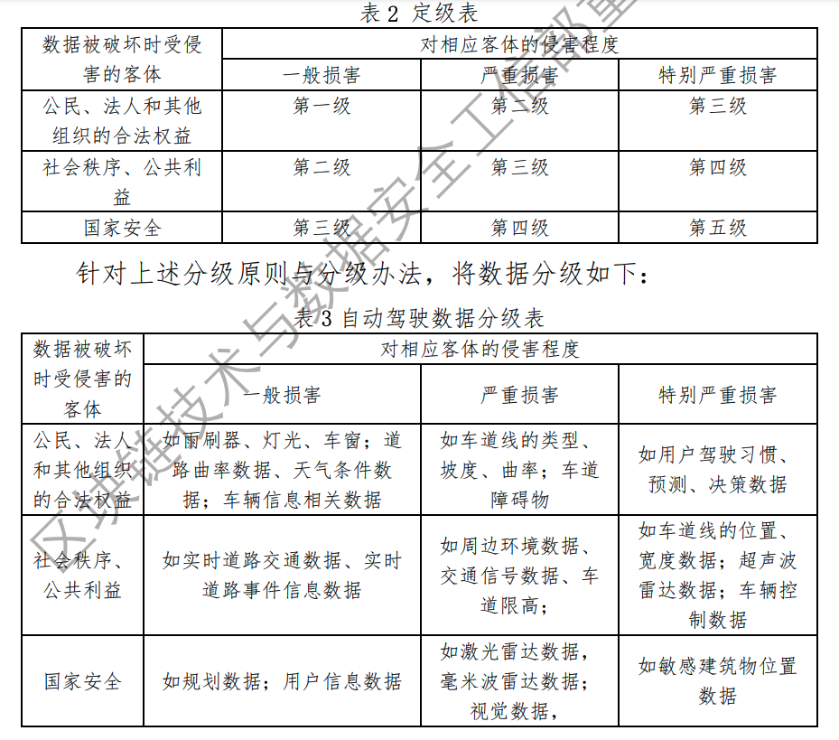

# 自动驾驶数据安全

自动驾驶汽车指主要依靠人工智能、视觉计算、雷达和全球定位及车路协同等技术，使汽车具有环境感知、路径规划和自主控制的能力，从而可让计算机自动操作的机动车辆。

有别于传统人工驾驶车辆，自动驾驶车辆的最大特点是 AI 技术的主导，其驾驶过程是机器不断收集驾驶信息并进行信息分析和自我学习从而达到自动驾驶的系统工程。伴随自动驾驶汽车的发展，每辆汽车将从过去的封闭转向开放，融入到联网的平台中进行实时的信息交互。

在自动驾驶产业链中，数据的采集、存储、处理、传输、共享等生命周期各环节潜在的安全威胁都给自动驾驶数据防护带来了全新的挑战，要想实现自动驾驶汽车规模化、商业化落地，必须解决“数据安全”这一“拦路虎”。

## 法规要求
- 《民法总则》要求任何组织和个人在获取他人个人信息时，应依法取得并确保信息安全，不得对他人信息进行非法收集、使用、加工、传输，不得非法买卖、提供或公开他人个人信息。
- 2017.6.1.《网络安全法》，《网络安全法》第三十七条规定，“关键信息基础设施的运营者在中华人民共和国境内运营中收集和产生的个人信息和重要数据应当在境内存储。因业务需要，确需向境外提供的，应当按照国家网信部门会同国务院有关部门制定的办法进行安全评估；法律、行政法规另有规定的，依照其规定”。

- 《数据安全法》
- 《信息安全技术个人信息安全规范》
- 《个人信息和重要数据出境安全评估办法（征求意见稿）》
- 《车联网（智能网联汽车）产业发展行动计划》等法规政策要求
- 2019 年 5 月 28 日，国家网信办公布了《数据安全管理办法（征求意见稿）》，对于重要数据的发布、共享和出境作出了原则性审批规定。 
- 《军事设施保护法》，自动驾驶过程中不可避免地要实时采集和分析行驶过程中的地理地貌和道路建筑信息。如果相关设备一旦靠近军事设施，就有可能违反《军事设施保护法》第三章和第四章中，关于军事禁区和军事管理区的规定。通常军事管理区的划定范围比较大，一般来说，部队家
属院、营区生活区等都属于军事管理区。而这类地域正是车辆进出比较频繁的地方。如果自动驾驶汽车进入此类地区，所有采集的道路信息都需经军事管理区管理单位审查同意。

- 《中华人民共和国测绘法》《中华人民共和国测绘法》中第八章第四十七条规定地理信息生产、保管、利用单位应当对属于国家秘密的地理信息的获取、持有、提供、利用情况进行登记并长期保存，实行可追溯管理。自动驾驶数据感知收集过程中会不断采集地理信息，相关地理信息中若涉及到属于国家秘密的地理信息需要在有关部门登记并保存。但目前如何界定自动驾驶过程中采集的地理信息是否属于国家秘密仍是自动驾驶数据领域的一个重要课题。

### 国际法规
- 2017 年 9 月，美国众议院通过了 HR3388 号《自动驾驶法案》，其全称为（《车辆发展中确保生命安全的未来开发和研究法》），该法案从自动驾驶汽车的管理、安全标准的制定、系统网络安全的构建、检测和评估、隐私保护等方面为监管确立了基本框架，并规定美国高速公路安全管理局及各州的行政部门仅可执行与《自动驾驶法案》中所规定尺度一致或更为严格的标准，同时美国高速公路安全管理局可通过修订现行法规和豁免的方式统一监管自动驾驶汽车的设计、制造等生产环节。
- 美国两位议员提交的《汽车安全与隐私法案》还提出了“驾驶数据”这一概念，其主要包括收集的与车辆状态（包括位置、速度、用户信息）相关的电子信息。
- 《通用数据保护条例》（GDPR）于 2018 年 5 月 25 日生效并取代 1995 年的《数据保护指令》。GDPR 旨在加强和统一欧盟境内所有个人数据保护有关规定，并对欧盟境内的个人数据出境问题做出了明确的规定。

- 欧盟委员会于 2016 年 11 月 30 日发布了欧盟网联汽车战略（“欧盟战略”），表明了个人数据和隐私保护对于自动驾驶汽车能否成功落地应用起着决定性作用。欧盟认为必须使用户对他们的个人数据未被当作商品感到放心，且消费者对于如何及以何种目的使用他们的数据保有有效的控制权力。
- 2017 年 1 月 13 日，欧盟网络和信息安全机构（ENISA)发布了《智能汽车网络安全与适应力》的研究报告（“ENISA 指南”），提出了应对网络威胁，保障智能汽车安全的最佳实践和建议。
- 德国联邦议院于 2017 年 5 月 12 日修订了德国《道路交通法》，通过了德国首部针对智能汽车的法律规范，澄清了包括基本概念、许可条件、责任归属等重要问题，在一定程度上为智能汽车在德国的发展清除了法律上的障碍。就数据而言，法案规定当驾驶操作方在驾驶员和高度或完全自动系统之间发生转变时，自动驾驶汽车将储存由卫星导航系统确定的地点和时间信息；如果系统对驾驶员提出了接管汽车驾驶的要求，或者
系统出现了技术故障，这些信息也同样会被保存。同时，针对智能汽车采集数据的利用，法案规定了车主提供数据的义务，并且规定了高度或全自动化功能的汽车必须具有根据通用的国际标准来记录汽车在某一时刻究竟由驾驶人控制，还是由高度或全自动化功能控制，即所谓的“黑匣子”记录功能。上述数据应根据道路交通监管部门的要求依法提交，相关部门同时享有保存和使用相关数据的权利。此外，数据的保存时效也需满足特定要求，在发生交通事故的情况下需保存三年。

## 安全事件

如果自动驾驶相关数据遭到窃取或篡改，会直接造成财产或生命损失，相比传统数据破坏危害更大。近几年，自动驾驶数据安全领域事件频发，标志性事件如 
- 2015 年查理·米勒和克里斯·瓦拉塞克攻击了 Jeep Cherokee 车联网系统，利用 Linux 系统漏洞，远程控制汽车的多媒体系统，进而对瑞萨 V850 控制器固件进行修改，获取远程向CAN 总线发送指令的权限，从而能够完全控制车辆；
- 2015 年，来自德国 ADAC 汽车协会的安全研究人员对宝马 Connected Drive 进行中间人攻击，通过伪基站对通信控制协议进行逆向工程后，伪造控制指令数据解锁汽车；
- 2016 年，宝马车载娱乐系统爆出远程操纵 0day 漏洞，恶意攻击者可以借助此漏洞绕过 VIN 码（车辆识别码）会话验证环节获取另一用户的 VIN，然后利用该 VIN 接入访问和编辑其他用户的汽车设置。
- 2016 年，安全研究院卡姆卡尔发现，利用安吉星导航系统的漏洞，能够远程控制超过数百万辆的通用汽车；
- 2016 年，在Black Hat 大会上，相关人员演示了通过 OBD 接口设备攻击汽车 CAN 总线，干扰汽车驾驶。此外，OBD 设备还可采集总线数据、伪造 ECU控制数据，造成 TCU 自动变速箱控制单位等系统的故障；
- 2016 年，来自挪威安全公司 Promon 的专家在入侵用户手机后，获取了特斯拉 App 账户用户名和密码等数据，然后登录特斯拉车联网服务平台，从而可以随时对车辆进行定位、追踪，并可解锁、启动车辆；
- 2018 年 7 月，由于数据管理平台在使用远程数据同步工具 rsync 处理数据时，备份服务器没有限制使用者的 IP 地址，也未设置身份验证等用户访问权限，导致百余家车企的机密文件被曝光，包括大众、特斯拉、丰田、福特、通用、菲亚特克莱斯勒等车企。

## 自动驾驶数据安全标准规范

- ISO/TC22 制定道路车辆信息安全标准。
  - ISO/TC22 是国际标准化组织下设的道路车辆技术委员会。2018年，该组织围绕 ISO/SAE 21434（道路车辆-信息安全工程）在美国、
波兰、以色列等地召开联合工作组会议，明确了该标准的结构框架、适用范围、特定对象和主要内容等，并指出该标准适用于道路车辆的电子电气系统以及各系统间的接口交互与通信，规范了企业对车辆信息安全的管理，提出了道路车辆在安全生命周期内的电子电气系统、系统间接口交互、系统间通信的信息安全技术要求，总结了安全风险与威胁评估方法、信息安全系统测试评价方法、信息安全流程开发管控要求等内容。

- 企业联合白皮书《自动驾驶安全第一》白皮书由安波福、奥迪、百度、宝马、德国大陆集团、戴姆勒、菲亚特克莱斯勒、HERE、英飞凌、英特尔和大众等 11 家公司联合发布。该白皮书为基于安全的自动驾驶乘用车的开发、测试及验证等各阶段提供了指导，旨在共同建立自动驾驶的行业安全标准，同时强调通过设计、测试与验证实现安全的重要性。该白皮书表明可以通过车辆感知传感器（如摄像头、激光雷达、超声波、麦克风等）获取周围环境中的所有相关信息，包括辨别行人、障碍物、交通标志和声音信号等，来降低风险。同时指出，自动驾驶车辆在记录用户个人数据时，应符合隐私保护规范。

- 2017英国《联网与自动驾驶汽车网络安全主要原则》。（7）确保数据存储与传输安全可控。（8）确保系统对各类攻击的防御具备弹性。

- 美国《现代汽车的网络安全最佳实践》《自动驾驶系统 2.0：安全愿景》《自动驾驶汽车 3.0：为未来交通做准备》美国在 2016 年 10 月发布的《现代汽车的网络安全最佳实践》要求在开发阶段考虑数据安全，遵循产品开发流程，避免设计系统存在不合理的安全风险；构建特定流程，明确考虑汽车全生命周期的隐私和网络安全风险，其全过程监管原则更体现在具体风险规避制度中。

- 中国《智能网联汽车信息安全评价测试技术规范（征求意见稿）》2019 年 6 月 11 日，由中国汽车工业协会牵头，百度 Apollo 等国
内机构参与制定的《智能网联汽车信息安全评价测试技术规范（征求意见稿）》（简称“规范”）正式发布。该规范由产学研各界共同制定，是国内首个智能网联汽车的信息安全测评标准。

- 中国《智能网联汽车信息安全评价测试技术规范（征求意见稿）》2019 年 6 月 11 日，由中国汽车工业协会牵头，百度 Apollo 等国
内机构参与制定的《智能网联汽车信息安全评价测试技术规范（征求意见稿）》（简称“规范”）正式发布。该规范由产学研各界共同制定，是国内首个智能网联汽车的信息安全测评标准。

## 现状

自动驾驶数据安全发展现状与传统数据类似，自动驾驶数据安全的特性也主要表现为机密性、完整性、可用性。
- 自动驾驶数据的机密性是指用户隐私数据、测试场景数据、人机交互数据等不泄露给未授权的个人、实体、进程，并保证其不会被利用的特性。- 自动驾驶数据的完整性是指自动驾驶决策与控制数据、动态交通环境数据等没有遭受以未授权方式所作的更改或破坏，保证自动驾驶车辆信息数据的正确生成、存储和传输的特性。
- 自动驾驶数据的可用性是指已授权的个人、实体一旦需要就可以访问和使用自动驾驶数据和资源的特性。

自动驾驶数据安全技术仍是以传统数据安全技术为主，如：数据安全隔离、安全认证、安全授权、数据脱敏、安全存储、安全传输、数据审计、数据备份、数据恢复、安全擦除等。

但是在自动驾驶场景下以及自动驾驶功能实现的过程中，相关安全防护技术需要结合自动驾驶的差异性特点进行改进，如：
- 自动驾驶车辆的车内数据安全要求车辆认证加密或密钥的管理具备轻量、易集成和延迟低的特点；
- 车路协同自动驾驶的 V2X 安全传输要求海量证书管理能满足广播、小批量数据传输的安全要求。
- 同时，按数据重要程度和面临的风险不同，所采用的数据安全防护技术也需要做出相应的完善与调整。

- 汽车行业的最大特点是全球产业链的高度融合，当前在中国市场上销售的车辆中，进口车及中外合资生产的车辆占到相当大的比例。车厂通过互联网集中收集车辆信息，由此而产生的自动驾驶数据出境问题几乎是一个无法回避的问题，值得高度关注。

## 自动驾驶数据风险分析

### 自驾数据分析

#### 数据特点

- 自动驾驶数据与车联网数据的区别
  - 传统车联网数据量少，数据仅来自终端功能简单的信息服务。
  - 在自动驾驶时代，在测试阶段：需要使用大量的测试数据来验证自动驾驶的功能，并对自动驾驶未来的服务进行预研。在对大量数据进行标注后，感知和决策模型开始利用数据进行训练，同时提取自动驾驶场景数据构建虚拟仿真模型以提升车辆的自动驾驶能力，保证自动驾驶车辆的安全性和鲁棒性。
  - 在实际运行阶段：自动驾驶车辆的正常运行不仅依赖于车端传感器采集的大量数据，同时也依赖于高精地图数据、实时交通数据、天气数据等，而自动驾驶车辆运行过程中也会产生或接收大量的车辆数据、控制数据、用户驾驶数据等。
- 区别主要如下：
  - 自动驾驶对数据的精度要求更高。由于大量数据会作为自动驾驶系统下发指令的决策依据，如有偏差会对人身安全构成巨大威胁，因此自动驾驶原型车一般都会加装精度更高的 GNSS 设备或其他辅助设备以保证各类关键数据的高效准确安全传输。
  - 自动驾驶数据高度还原真实世界。自动驾驶数据中不仅包含道路及其两旁的全要素静态信息，还包括道路上动态的车辆、行人、交通信号等数据，以及部分敏感地理信息，诸如军区、核设施、港口、电力设施等。
  - 自动驾驶数据包含用户个人数据。如用户操作、应用使用等操作习惯数据，也包括行程轨迹，用户导航、历史及即时地理位置等驾驶习惯数据，此外还包括用户个人虹膜、指纹、声纹等生物特征数据。
  - 自动驾驶车辆实时产生海量数据。目前的测试单车产生数据量一般在 20GB/小时左右, 在 5G 网络未大规模应用以后，产生的数据量将变得更加巨大。

自动驾驶数据的特点，自动驾驶数据与车联网数据存在众多差异，因此需要针对自动驾驶数据的特点进行分级分类以全面考量其安全威胁及保障手段。综合考虑自动驾驶的人工智能属性以及自动驾驶数据多样性、规模性、非结构性、流动性的特点。除此之外，自动驾驶车辆还具有汽车本身的
安全属性和智能网联下跨产业技术融合的特点。

- 数据多样性：根据不同自动驾驶级别，数据产生的来源不同。数据类别不仅包括了汽车基础数据（车牌号、车辆品牌和型号、车辆识别码、车辆颜色、车身长度和宽度外观等相关数据），也包括基础设施、交通数据、地理信息数据（红绿灯信息、道路基础设施相关、道路行人的具体位置、行驶和运动的方向、车外街景、交通标志、建筑外观等真实交通数据），以及车主的大量用户身份类数据（姓名、手机号码、驾照、证件号码、支付信息、家庭住址、用户的指纹、面部等生物特征信息等）、用户状态数据（语音、手势、眼球位置变化等）、行为类数据（登录、浏览、搜索、交易等操作信息等）等。

- 数据规模性：自动驾驶车辆作为跨产业技术的融合载体，融合了来自汽车、道路、天气、用户、智能计算系统等多方面的海量数据，涉及数据类型多，需要统计分析的数据总量大。
- 数据非结构性：数据多样性决定了不同来源的数据格式不同，数据的非结构性和非标准性对数据聚合或拆分技术以及权限管理和安全存储都带来了巨大的挑战。

- 数据流动性：大量自动驾驶数据在用户端、车端、云端等多场景的交互使得数据的流动性增大。除此之外，自动驾驶数据还具有跨行业共享交换的特点。因此，如何确保交互数据的安全性，是一个亟待解决的问题。

- 数据涉密性：自动驾驶汽车在公开道路驾驶过程中，会采集大量的地理信息数据，根据中国法律法规要求，采集地理信息数据可能涉及涉密测绘成果，因此需要按照《中华人民共和国保守国家秘密法》中的相关规定要求进行分级管理。

#### 数据产生流程

自动驾驶的整个流程归结起来有三个部分。
- 首先，是通过激光雷达、摄像头、车载网联系统等设备对外界的环境进行感知识别；
- 然后，在融合多方面感知信息的基础上，通过智能算法学习外界场景信息，预测场景中交通参与者的轨迹，规划车辆运行轨迹，实现车辆拟人化控制融入交通流中；
- 最后，跟踪决策规划的轨迹目标，控制车辆的油门、刹车和转向等驾驶动作，调节车辆行驶速度、位置和方向等状态，以保证汽车的安全性、操纵性和稳定性。

自动驾驶在测试和实际运行过程中将会产生大量的数据，主要包括感知数据、决策与控制数据、测试与仿真数据以及用户个人数据四大类数据。

##### 感知数据
在感知数据中主要包含自动驾驶传感器原始数据、动态交通数据、自动驾驶地图数据和车联网数据。

自动驾驶传感器原始数据：主要包括点云、视频、照片、高精度定位坐标等。此类数据是由加装在车辆上的自动驾驶传感器（包括：激光雷达、摄像机、高精度定位模组等）进行采集。

动态交通的数据：通常包含两部分，车辆轨迹通常从手机端和车辆的 GPS 装置获得，经由智能出行公司、出租车管理公司等平台回传至有相关资质的公司，经数据处理、校验再进行发布，形成动态交通信息，给用户提示道路的拥堵信息。动态事件信息一般由用户手动上报、行车记录仪识别上报，路边监控设备提取、政府机构官方发布等渠道生成，数据回传至有相关资质公司的平台后进行分析聚类等处理，校验后发布，形成动态事件信息，提醒用户注意道路上的危险事件。

自动驾驶地图数据：由拥有相关资质的地图供应商提供，一般的生产流程包括数据采集、数据处理、数据出品及审图。数据采集一般使用配备高精度传感器的车辆进行作业，同时作业人员必须具有专门的测绘作业证。数据处理将采集的原始数据进行整合处理、格式转化、地图数据制作、数据校验。数据出品会按照客户要求将地图数据转化成相关的规格。生产完毕的地图需送至国家相关机构进行审图，获得审图号和出版号后方可进行发布。

车联网数据：主要有两条产生途径。一是由车机系统、车机应用产生，经由 T-BOX（Telematics BOX），通过运营商网络回传至车联网后台。二是通过车联网应用回传车联网数据，通过车联网应用（如呼叫中心，宾馆预订，兴趣点搜索等）将车辆的请求和响应数据存储在云端。

##### 决策与控制数据
车辆控制技术是无人驾驶汽车行驶的核心。包括决策规划和控制执行两个环节，这两项技术相辅相成共同构成自动驾驶汽车的关键技术。相关模块会汇集车辆所有重要信息，不仅包括自动驾驶汽车本身的实时位置、速度、方向，还包括车辆周边一定距离以内所有障碍物信息数据、预测轨迹数据以及平台下发的动态交通数据。决策层依据感知数据来进行决策判断，确定适当工作模型，制定相应控制策略产生决策数据，从而替代人类驾驶员做出驾驶决策。执行层在系统做出决策后，按照决策结果对车辆进行控制。车辆的各个操控系统都需要通过总线或网络与决策系统相连，并能够按照决策系统发出的指令精确地控制车辆的加速程度、制动程度、转向程度等驾驶动作，以实现车辆的自主驾驶。

##### 测试与仿真数据
自动驾驶汽车测试分为硬件在环测试、软件在环测试以及模型在环测试，分别对应检验自动驾驶汽车感知、决策两大模块。感知模块的硬件在环测试主要分为两类，一类为测试硬件设施在极端环境下能否正常工作；另一类为测试传感器自身 AI 识别能力。决策模块的软件在环测试则主要检验系统在不同情况下是否可以做出正确决策。感知与决策模块的检验可以两种形式完成，一种为实际场景下的实车测试，另一种为模拟环境下的数据测试。由于实车测试在短期内可预见的极端环境较少，测试有较大的局限性，因此各大车厂在检验过程中更倾向于进行数据测试。在数据测试的过程中，基于全面的仿真能力与云平台本身的数据存储，将大量实景数据、驾驶行为数据以及交通动态数据融合，模拟真实行车环境。最后将环境模拟数据打包输送至硬件在环与软件在环进行测试，在理论上检验该种车型是否能够达到上路指标。

一个完整的自动驾驶仿真平台，需要包括静态场景还原、动态案例仿真、传感器仿真、车辆动力学仿真、并行加速计算等功能，并能够较为容易的接入自动驾驶感知和决策控制系统，形成闭环，达到持续迭代和优化的状态。自动驾驶仿真一般包括拟真环境仿真、动态场景仿真、天气和气候仿真、传感器仿真、车辆动力学仿真。其中：
- 拟真环境仿真：可以采集实际环境信息及已有的高精度地图构建静态场景，通过采集激光点云数据，建立高精度地图，构建环境模型，并通过自动化工具链完成厘米级道路还原。
- 动态场景仿真：可以采集实际道路上的海量数据，经过算法抽取，结合已有的高精地图，重建动态场景。天气和气候仿真：在仿真环境里设置不同天气，并调节天气参数，比如太阳高度角，雾的浓度，雨滴的大小等，模拟出极端天气，训练无人车应对这些情况，然后将训练好的数据模型运用于真实驾驶过程中。
- 传感器仿真：包括物理信号、原始信号、传感器目标三个层级的仿真，仿真对象为激光雷达、视觉（摄像头）、雷达、辅助传感器等系统。
- 车辆动力学仿真：包括车体模型参数化，轮胎模型参数化，制动系统模型参数化，转向系统模型参数化，动力系统模型参数化，传动系统模型参数化，空气动力学模型参数化，硬件 IO 接口模型参数化，根据实际测试车辆的动力学配置合适参数。
- 交通场景数据是自动驾驶汽车研发与测试的基础数据资源，是评价其功能安全的关键参考，也是定义自动驾驶汽车技术标准的重要依据。场景库能够通过软件以及仿真工具包对测试场景进行虚拟复现，其元素包含各种道路路况、交通标志、气象环境、事故场景、法律法规场景，驾驶人员及其他交通参与者的行为习惯等。将这些场景元素及车辆驾驶行为进一步数字化，有利于进行数据提取并量化分析自动驾驶的安全性能和不足，测试过程产生的数据也能更好地支撑场景库的建设。

##### 用户个人数据

- 汽车的车载娱乐系统将不仅限于播放音乐、视频、通信等功能，还能保存个人设置和偏好。
- 出于导航目的，汽车将收集并使用位置数据，诸如目的地信息、路线信息、速度和花费的时间。
- 地理位置功能在现有的传统车辆中也同样被用于记录位置，提供旅途相关的其他信息，比如实时交通数据和规划路线沿途名胜，以及设定道路偏好，从而避开高速公路或收费公路。到目前为止，汽车收集的个人数据量是较少的。
- 然而，自动驾驶汽车的发展和使用将使大量的个人数据被收集，这其中包括驾驶人的详细资料、位置、行驶方向、历史路线、平均速度和里程数。相关企业将可以针对特定用户制作人物画像，做到精准服务。

以上几类数据可以用于研发和测试自动驾驶的功能和应用，其重要性不言而喻。因此，实施数据安全分类分级和差异化分级防护，加强自动驾驶数据安全防护刻不容缓。

## 数据分级分类
### 自动驾驶数据安全分类

- （1）分类原则。针对自动驾驶数据特征及其相互间存在的客观联系进行科学和系统化的分类。做到分类尽可能覆盖自动驾驶所有数据，不设置无意义的类目，同时在总体上应具有包容性和可扩展性。
- （2）分类方法。遵循自动驾驶数据安全分类原则，按照自动驾驶功能实现流程，结合我国自动驾驶产业发展阶段，着重关注用户个人相关数据。

自动驾驶系统的实现主要依赖感知、决策与执行三大模块。整个过程中产生的或涉及到的数据可以归类为四类数据类型：
- 感知数据
- 决策与控制数据
- 测试与仿真数据
- 用户个人数据

#### 感知数据
- 车辆运行数据，包括但不限于车辆运行状态下输出的车速信息、油门、刹车、车窗、雨刷器、灯光等各种传统传感器数据

- V2X 数据，
  - 包括但不限于实时道路交通数据、实时道路事件信息数据等；
  - 周边环境数据（行人、骑车人、车辆相对位置、速度）等；
  - 交通信号灯数据、道路曲率数据、天气条件数据等

- 自动驾驶地图数据包括但不限于车道线的位置、类型、宽度、坡度和曲率等车道信息，车道周边的固定对象信息，比如交通标志、交通信号灯等信息、车道限高、下水道口、障碍物及其他道路细节，还包括高架物体、防护栏、树木、道路边缘类型、路边地标等基础设施信息。
  
- 位置信息数据，包括但不限于 GNSS+IMU 组合惯导定位数据, 差分定位基站数据、WIFI 位置、车辆自身、周边感知到的动态及静态物体的地理位置坐标、车辆轨迹、加速度数据雷达数据 包括但不限于激光雷达点云数据（强度、横坐标、纵坐标、高度），毫米波雷达数据等

- 视觉数据，包括但不限于通过普通摄像头或红外摄像头高速频繁抓取的环境图片或视频数据，从而实现基本的目标检测、车道线检测、目标追踪等

#### 决策与控制数据

- 预测数据，包括但不限于车辆运动状态估计数据、融合数据，障碍物(小客车、行人、自行车等)的类型、运行状态、地图、交通规则的预测信息（行为信息,轨迹信息和概率信息）

- 规划数据，包括但不限于根据当前车辆所在的位置、预测数据、地图静态数据和感知动态数据等进行横向规划和纵向规划,给出的安全,舒适,高效率并符合交通规则的轨迹数据

- 决策数据，包括但不限于根据当前地图信息和感知信息,结合自车当前状态,做出的行为决策数据，用于车辆行驶控制,如变道、超车、停车、跟车、保持车道等行为控制数据 包括但不限于人机交互数据、执行器数据、横纵向控制数据

- 控制数据 包括但不限于人机交互数据、执行器数据、横纵向控制数据
#### 测试与仿真数据
- 测试场景数据，包括但不限于测试场景障碍物、天气情况、路面不平度数据；自动驾驶算法的交通规则、路侧交通指示、道路交通标记数据；安全服务数据。
- 驾驶行为数据 包括但不限于驾驶员行为样本数据；驾驶经验数据样本数据车辆动力学相关数据包括但不限于车速、纵侧向加速度、横摆角速度、车身侧倾角、质心侧偏角、主缸压力、踏板力、踏板行程、初速度、制动距离、平均踏板力等
- 自动驾驶系统数据 包括但不限于传感器，控制器，制动器等虚拟汽车系统数据等
- 虚拟驾驶场景数据，包括但不限于天气、建筑物、道路、行人、障碍物、周边车辆等虚拟驾驶环境数据，仿真传感器信号数据等; 人机交互数据；误差注入数据

#### 用户个人数据

- 车辆信息相关数据，包括但不限于车辆标识码、车辆控制器信息、车辆位置信息、车辆 SIM 卡号、用户保养或维修车辆的记录数据、车载音视频数据
- 用户驾驶习惯 包括但不限于用户操作、应用使用习惯，行程轨迹，用户导航、历史及即时地理位置等数据
- 用户信息，包括但不限于包括用户姓名、手机号、身份证号、家庭住址、账号密码数据；用户脸部数据、指纹数据；语音、手势、眼球位置；驾驶员状态监测数据、车内视频监测数据。

### 自动驾驶数据分级

自动驾驶数据安全的目标主要表现在具备机密性、完整性、可用性三个基本特性。同时，数据具有流动性、可复制等特有属性，数据流动过程中的级别应以源数据判定时的级别为准。但如果低级别的数据流入高级别的系统中，该级别数据对系统的运行或服务产生了作用和影响，则该数据应该重新定级，级别应相应提高。

此外，考虑到自动驾驶智能化和网联化程度不同，对数据的保密性、完整性、可用性等安全属性的特殊要求还应针对不同等级自动驾驶的数据进
行分级细化，通过分级明确数据的安全防护要求，实施自动驾驶数据的差异化分级防护。

- （1）分级原则。自动驾驶数据的分级主要从保密性、完整性、可用性三个属性遭破坏后造成的后果影响来定级。在完成自动驾驶数据分类的基础上，采用“就高不就低”原则，用定性和定量相结合的方法判断数据的三个安全属性任意一个遭破坏后对功能、财产、操作性、隐私等造成的最大后果影响来进行定级。
- （2）分级方法。适应我国现有法律法规对重要数据和个人信息等数据的保护要求，遵循自动驾驶数据安全分级原则，参考信息安全等级保护规定，按照数据遭到破坏后对国家安全、社会秩序、公共利益以及公民、法人和其他组织的合法权益的危害程度，由低到高划分为五级。
  - 第一级，受到破坏后，会对公民、法人和其他组织的合法权益造成损害，但不损害国家安全、社会秩序和公共利益。
  - 第二级，受到破坏后，会对公民、法人和其他组织的合法权益产生严重损害，或者对社会秩序和公共利益造成损害，但不损害国家安全。
  - 第三级，受到破坏后，会对公民、法人和其他组织的合法权益产生特别严重损害，或者对社会秩序和公共利益造成严重损害，或者对国家安全造成损害。
  - 第四级，受到破坏后，会对社会秩序和公共利益造成特别严重损害，或者对国家安全造成严重损害。
  - 第五级，受到破坏后，会对国家安全造成特别严重损害。根据数据被破坏时所侵害的客体及对相应客体的侵害程度，可得数据安全保护等级如下表所示。

## 数据安全风险分析

根据自动驾驶功能实现的相关要求，结合自动驾驶数据的特点、产生流程、应用技术与场景提出了自动驾驶技术应用架构。该架构根据自动驾驶数据的采集、传输、应用和销毁等全生命周期的过程特点，至下而上依次分为采集层、通信层、平台层和应用层。其中，采集层主要涉及自动驾驶数据从采集到存储的全过程；通信层包含了数据在车内传输和车端与云端传输的过程；平台层主要涉及各类平台对相关数据的管理与控制；应用层包含了在接收到数据后，按功能需求对数据进行处理，并将处理后的数据送到各个终端进行响应和应用。

### 采集层数据安全风险

#### 采集设备安全风险
目前，包括实验室测试车辆、公开道路上路测车辆、封闭园区的
接驳车辆以及城市局部运营车辆在内的大部分均为二次改装车辆。由
于二次改装的非工程化作业，致使自动驾驶系统的传感组件（如激光、
毫米波、超声波雷达，摄像头，组合惯导等）、中央处理器及各种线
缆等都裸露在汽车内外，除了自动驾驶系统组件丢失或损坏造成的直
接数据丢失之外，系统里的数据也很容易被窃取、丢失或遭到不法分
子的篡改、破坏。同时二次改装也会存在后增加设备一致性差、性能
不稳定的情况，也给自动驾驶数据安全埋下了隐患。

#### 路侧基础设施建设安全风险

路端基础设施改造成本巨大，再加上自动驾驶何时可以规模量产
落地尚不明朗，国内虽有一些省份在试点 V2X 样板工程，但路段长度非常有限。小规模试点建设周期漫长，同时各单位的关注点更多仍
聚焦于 V2X 功能的实现，从而导致路测基础设施在采集数据时，并
没有考虑数据安全防护机制的设计和部署，导致路侧设施在采集数据
时面临较大的安全风险。

#### 感知数据完整性安全风险
感知类数据通过传感器数据采集车速信息、油门、刹车、车窗，
雨刷器等各种有用数据信息，这个过程中，攻击者可通过干扰，欺骗
攻击等手段造成传感器设备失灵，如对传感器的干扰易造成感知数据
的识别错误或在采集的样本数据中增加特定的攻击样本，也会造成感
知数据污染，使得算法无法识别或识别错误。另一方面，在数据采集
阶段，人为伪造的感知设备也会造成采集到的数据真实性难以保证，
或采集过程被阻断等风险。

### 通信层数据安全风险
#### 恶意节点攻击风险
自动驾驶数据通信是节点与节点之间的通信，攻击者可以通过
身份伪造等方式恶意攻击或威胁数据安全。自动驾驶汽车在运行过
程中通过传感器采集大量感知数据上传至云端进行整合分析，在传
感器节点与云端通信的过程中。由于传感器节点和云端接口缺少认
证机制，攻击者可以通过伪造传感器节点或者云端接口，从而伪造
和篡改自动驾驶数据，威胁自动驾驶数据安全。
经过云端整合分析向车端下发的决策和执行控制数据，这些数
据在自动驾驶车端通过车内通信总线到达ECU执行元件，由于通信总线与ECU之间缺少相应的认证保护机制，攻击者可以通过伪造ECU接
收数据，并对数据进行重写、伪造和篡改，使自动驾驶汽车做出错
误的执行操作，引发安全问题。
自动驾驶汽车需要不断地与外界环境进行交互，实时的获取车
与车，车与路侧单元等节点的数据，但节点之间缺少认证机制，攻
击者可以通过恶意节点伪造数据，给自动驾驶数据安全带来安全风
险。

#### 传输风险
当自动驾驶车辆数据内部交互时，主要还是采用如传统的CAN总
线或以太网，保护措施相对较弱，存在CAN报文被篡改和伪造的安全
风险或连接接口、通信总线被阻塞从而导致感知数据不可用或无法
及时反馈的风险。
当自动驾驶车辆与外部交互时，通过车外通信网络（蓝牙/WIFI
等短距或4G/5G/C-V2X等远距通信）传输数据，会面临数据在通信链
路上被窃听或遭受中间人攻击的风险。自动驾驶车辆在进行车道级
辅助驾驶时，会通过V2V广播本车的坐标和轨迹信息，此类地理信息
数据在传输时默认不采用加密机制，一旦恶意车辆有意图的监听周
边车辆，就会很容易获取大量地理信息数据，进而计算出敏感区域
的信息，严重情况下会造成国家秘密泄露。

另外，车辆所产生的个人信息通常使用短距离无线通信方式传
输，其中个人敏感信息会面临在通信线路上被窃听造成隐私泄露的
风险，如通过不安全的蓝牙及WIFI连接，通过中间人攻击或协议认证时的漏洞，能够从通信链路上获得用户敏感数据。

#### 协议风险
伴随多种无线通信技术和接口的广泛应用，自动驾驶车辆需要
部署多个无线接口实现WIFI、蓝牙、5G、V2X等多种网络的连接，从
而满足数据获取和传输的要求。而此类通信协议的安全漏洞会直接
威胁到数据传输的安全，如自动驾驶数据传输至车内网络时，会通
过CAN总线或车载以太网传输至各个执行单元，而非法分子可以对通
信协议认证机制进行破解或采取中间人攻击窃取或篡改敏感数据。

### 平台层数据安全风险
平台层作为自动驾驶数据汇集、存储、计算、管理的中心，为自
动驾驶车辆、道路设施、应用等提供数据处理、支持、更新等服务。
作为自动驾驶数据汇聚和远程管控的核心，平台层除面临传统大数据、
云平台所面临的安全风险之外，对应于自动驾驶数据的处理流程，也
会面临新的安全风险。

#### 云平台安全风险
不同类型、不同级别的自动驾驶数据都会在云平台汇聚、处理、
流转。其数据价值越大，就越会成为攻击的焦点。同时云平台开放的
服务架构及按需使用的服务模式，使得云平台越来越成为攻击的首要
目标，尤其是对于大量使用云服务功能的自动驾驶车辆，远程尝试入
侵云平台相比物理接触攻击车辆会更容易，而且带来的危害更大，对于攻击者而言收益也会越大。云平台往往作为突破车辆控制的第一道
关口，易受到 DDos 攻击、僵尸网络、非法授权访问、审计存储空间消耗等网络威胁，或利用手机 APP 入侵云平台服务端从而控制并获取
大量的车辆数据。

#### 大数据处理安全风险
自动驾驶海量数据的分析处理，必然用到大数据技术，如感知数
据中的视频、图像以及激光雷达产生的点云数据；路测数据、测试仿
真数据；大量车辆状态监控数据等。这些非结构化数据在大数据平台
上进行批处理或流处理时，对不同级别的数据如果没有相应的细粒度
访问控制机制，就会存在访问权限过大、数据遭到滥用的风险。另外，
目前大数据存储采用分布式存储技术，往往对于不用级别不同类型的数据在物理上是混合存储，不利于进行分类隔离和分级防护。同时数
据在大数据平台上进行数据分析和数据挖掘时，对于数据融合所产生
的隐私泄露问题，也是大数据处理时面临的主要风险之一。

#### 隐私泄漏安全风险
隐私泄露风险在平台层尤为严重，不仅是个人隐私数据，也包括
商业秘密等敏感数据。这类数据在处理的不同环节均存在如内部权限
滥用、外部攻击等方式导致的数据泄露风险。如感知数据中，地理信
息数据、个人隐私数据，仿真测试平台积累的商业化的测试数据，仿
真场景化数据，以及平台提供的高精地图数据等，在平台层进行存储、
处理时，一些关键隐私数据会流转至非信任区域，导致数据所有者失
去对这些关键数据的控制，从而产生隐私数据泄露问题。测试、仿真
数据的泄露不仅会给企业带来较大的经济损失，还会影响自动驾驶车
辆测试、优化进程，而地图类数据的泄露会给国家安全带来重大影响。

另外，在数据销毁阶段，数据销毁之后还存在一些未被擦除的残留，
存在数据重新创建和恢复可能，会使用户隐私遭到泄露，造成隐私泄
露安全风险。
#### 越权访问风险

主要是防止内部人员越权访问或滥用权限，造成安全机制被绕过，
非法获取用户数据或造成数据的破坏。安全管理制度和相应的安全配
置基线不完善，也容易给攻击者已可乘之机。非授权用户的访问，不
仅会导致自动驾驶相关数据、用户个人隐私数据被非法浏览，攻击者
还能通过篡改、重写数据，影响自动驾驶车辆的行车安全和应用服务
的质量。在 OTA 平台上，通过越权访问篡改未经加密的升级包，致使
系统无法升级至正确的版本，阻止自动驾驶车辆安全漏洞、风险的修
复。

#### 系统及软件漏洞风险
攻击者通过对平台系统及其应用软件的恶意修改达到攻击车辆
的目的，如在软件中植入木马、后门，二次打包应用程序等。在OTA
平台升级过程中攻击者可以利用固件校验、签名漏洞等篡改升级包、
注入恶意代码，进而获取用户个人隐私、自动驾驶相关数据甚至获得
车辆控制权。用户从服务平台获取的娱乐、资讯类信息容易被非法注
入病毒，会破坏、删除、改写敏感数据，影响自动驾驶系统的运行效
率，降低自动驾驶车辆的安全性、稳定性。

### 应用层数据安全风险

#### 决策与控制数据安全风险

决策和控制类数据通过云端收集的多方数据进行分析向车端下
发控车指令。攻击者通过对云端存储的数据进行窃取和篡改，破坏数
据的可用性和完整性，使其无法用于数据分析和决策。当从云端向车
端下发决策指令时，攻击者通过传输信道截取指令数据，对数据进行
伪造或者通过伪造接收者和发送方进行数据的截取和重写，使车端接
收到错误的决策和控制指令，引发安全事故。

自动驾驶汽车通过车辆状态估计，车道保持，车辆加减速等数据
做出相应的控车指令，攻击者对存储此类数据的固件进行攻击，窃取、
伪造、重写此类数据，使自动驾驶汽车做出错误的车辆状态估计，威
胁驾驶员的生命财产安全。

自动驾驶数据的分析和决策主要借助 AI 模型和相应的算法来实
现。每一个 AI 模型和相应的算法由大量代码构成，在某种程度上也
增加了数据安全的风险。攻击者通过恶意代码注入或非法注入并执行
恶意程序的方式使算法产出的数据出现偏差或对算法和模型产出的
数据进行篡改，导致决策出现误差。自动驾驶汽车通过声音、手势、
指纹、面部特征等人机交互信息和车身控制指令（如开门、启动、车
窗控制、启动应用等）等数据控制车辆，此类信息在应用层传输过程
中一旦遭遇泄露，伪造或重写，将造成车辆失窃或发生车辆不受控制
的风险。

#### 测试与仿真数据安全风险
测试与仿真数据作为自动驾驶车辆上路前的实验数据和上路后
的参考数据，起到决策辅助作用。这类数据贯穿自动驾驶车辆的全生
命周期。
测试场景数据是自动驾驶车辆在封闭环境下进行自动行驶时所
获取的数据信息，包括障碍物信息、交通规则信息等。此类数据的完
整性和可用性是决定测试结果准确性的重要前提。如果此类数据被篡
改会导致测试数据集的准确性降低，直接影响自动驾驶功能的安全性
和可靠性。确保此类数据的存储安全、使用安全，防止未授权人对于
数据的访问是在做数据安全防护时应重点考虑的。
#### 用户个人信息安全风险
车辆信息相关数据、用户驾驶习惯、用户信息这些数据是用户较
为隐私的数据。越权访问、存储未采用安全措施等导致的数据泄露可
能会致使车辆被盗或在行驶状态下被非法控制等后果，造成一定的经济损失和威胁人们的生命安全。
除此之外，今后自动驾驶车辆在实际运行过程中，将可能面临的
车辆实体出国出境、高精地图感知数据存储于车内所引发的数据安全
风险同样值得高度关注。

## 参考

- 《自动驾驶数据安全白皮书2020》