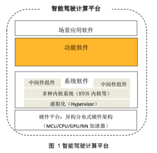
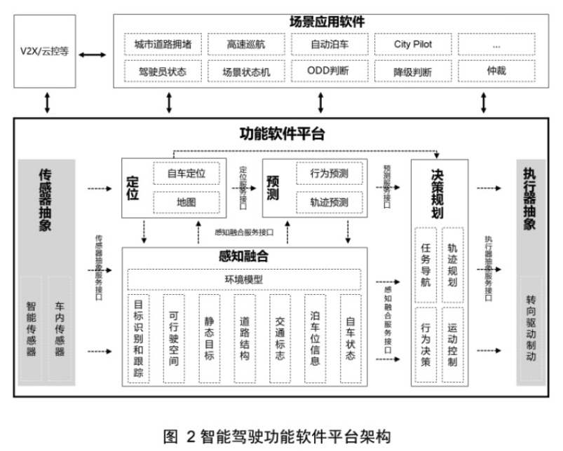
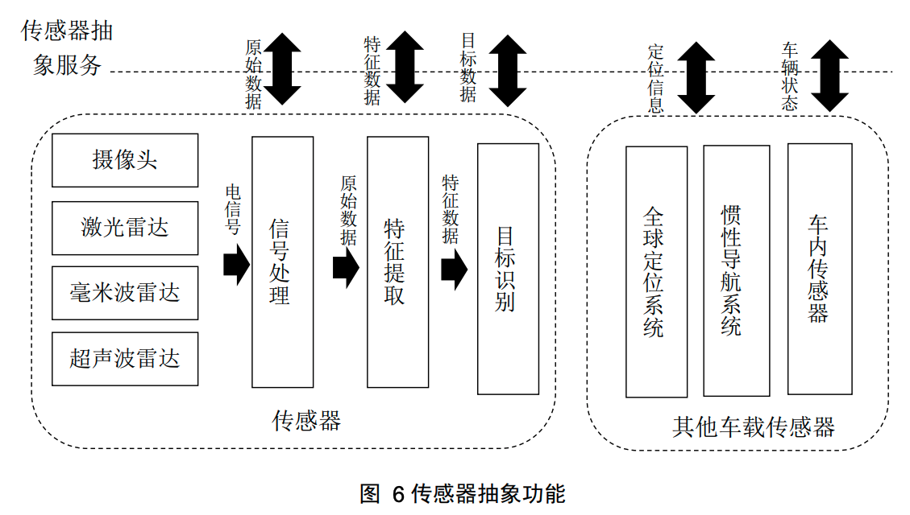
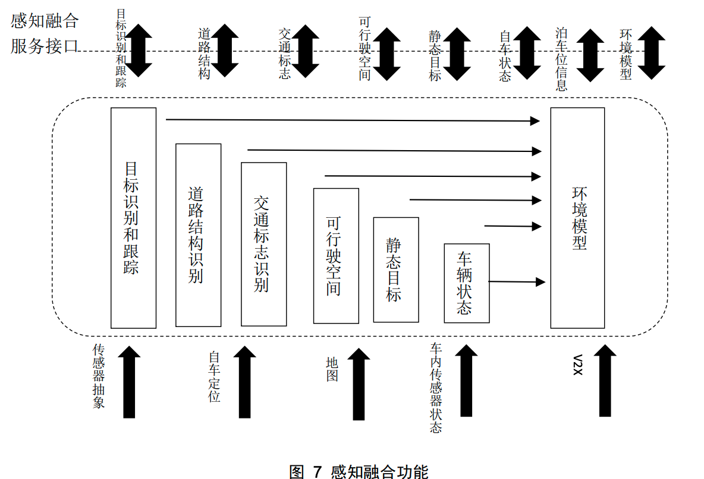

# 自动驾驶计算平台

## 术语

AD：autonomous driving，自动驾驶
ADAS：Advanced driver-assistance systems 高级辅助驾驶系统
ODD：Operational Design Domain 设计运行区域
NN：Neural Network 神经网络
IMU：Intertial Measurement Unit 惯性测量单元
LKA：Lane Keep Assistance 车道保持辅助系统
UTM：Universal Transverse Mercator 通用恒墨卡托格网系统

## 智能驾驶计算平台 概述

智能驾驶计算平台自底向上可分为：
- 硬件平台：基于易购分布式架构，提供可持续扩展的计算能力。
- 系统软件：包括OS和中间件，为上层提供调度、通信、时间同步、调试诊断等基础服务。
- 功能软件：包括感知、决策、规划和控制等智能驾驶核心功能的算法组件。
- 应用软件：场景应用软件。

### 功能软件

功能软件平台基于不同厂商的技术实现方案，进行功能抽象，分为6个功能模块：
- 传感器抽象功能：对毫米波雷达、激光雷达、摄像头、超声波雷达、GNSS、IMU和轮速计等车载传感器的环境感知情况进行数字抽象。
  
- 感知融合功能：对传感器抽象模块的输入数据进行融合，结合多种传感器的特性、工况和环境信息，完成对物理世界的数字呈现。感知融合功能支持根据不同传感器的组合从而实现不同的感知任务。感知任务包括：移动目标识别与跟踪、自由空间、交通灯和交通标志识别、道路结构识别等。

- 预测功能：依据环境信息和交通参与者历史测量信息，对其他交通参与者的未来行驶意图和估计进行预测。预测功能的输出是决策规划功能的关键输入之一，特别是在城市交叉路口等复杂场景下。
  - 其他交通参与者包括：人、机动车辆、非机动车辆等
- 决策规划功能：根据感知融合、自身定位、交通参与者预测等信息输入来完成自车行驶轨迹的决策和规划，并根据决策结果输出对车辆的控制命令或者告警信息。
- 定位功能呢：根据高精地图、传感器等信息输入提供自车位置，包括本车的绝对位置和静态、动态环境中的相对位置。
- 执行器抽象：执行决策规划模块输出的车辆控制命令，驱动汽车的转向、驱动、制动等执行部件。

主机厂可以选择不同的功能、算法组件，实现插件式组合，灵活构建智能驾驶系统级解决方案。

#### 坐标系设定

自动驾驶汽车和周边环境模型可以使用多个坐标系统来描述，例如：
- 全球地理坐标系 GNSS：对导航、高精地图及其延伸概念用到的全球地理坐标系统，主要采用WGS-84坐标系统。
- 局部地理坐标系（地图系统）：常见的采用站点坐标系（East North Up，ENU），构建地球表面上建立的3D笛卡尔坐标系（xyz）。对于地球表面局部坐标采用UTM系统作为投影的平面2D笛卡尔坐标系描述物体位置（xy）。
  - UTM 系统将地球分为60个区域，每个区域的经度为6度，1区等经度为180度至174度，W；区域编号向东增加到区域60，其覆盖东经174度E至180度。具体参考 [geokov](http://geokov.com/education/utm.aspx)。
- 车体坐标系（感知融合、决策等功能使用）：参考 ISO 8855：2011 Road vehicles-Vehicle dynamics and road-holding ability中的定义，车体坐标系以车辆后轴中心为原点，x轴指向车辆前进方向，y轴指向车辆前进方向的左侧方向，z轴指向车顶方向，构成右手直角系。

### 功能模块

#### 传感器抽象功能
传感器抽象功能主要提供两种类型的服务接口：
- 一种是智能传感器的信息服务接口，传感器类型包括摄像头、激光雷达、毫米波雷达和超声波雷达中的一种或者多种，提供的信息包括原始数据、特征数据和目标数据中的一种或者几种。这些数据主要是依赖于单个传感器的输出，同时也会提供传感器的性能和状态信息；
- 另外一种是其他车载传感器，包括汽车内常用的传感器，既有传统的轮速传感器、加速度传感器、里程计、车辆行驶状态等反应车辆本身状态的传感器，也包含全球定位系统、惯性导航系统等定位传感器，以及通过 V2X 和其他车辆、路侧基础设施、云端等进行信息交互的 V2X 通信模块。

传感器抽象服务接口不在智能驾驶功能软件平台设计规范中定义，可以参考 ISO/DIS 23150:2020[2]等规范中的定义。

#### 感知融合功能
感知融合功能基于各种传感器的输入，完成对动态交通参与者和静态交通环境信息的识别，输出可移动物体、道路结构、可行驶空间、静态目标和交通标志等信息服务，也可以综合输出完整的环境模型信息。

#### 定位功能

定位服务依赖传感器抽象功能和感知融合功能中的部分服务，提供自车的绝对位置、姿态、速度和加速度等信息。 定位功能服务接口的具体内容在《智能驾驶功能软件平台设计规范 第五部分：定位功能服务接口》[9]中定义。

#### 预测功能
预测功能依据感知融合和自动定位等信息输入，对行人，车辆，骑行者等交通参与者的行为意图和行驶轨迹做出预测。具体的信息输入包括传感器获取到的可移动目标的当前数据和历史数据，含地图信息在内的周围静态交通环境信息，自车的位置和状态信息，通过 V2X获取到的交通参与者的信息等。其中，行人的姿态和手势、车辆灯光等信息都是预测服务的重要依据。

#### 决策规划功能
决策规划功能是自车最终驾驶行为决策和轨迹规划模块，输出对于车辆姿态控制的控制命令。功能软件平台中的感知融合服务，定位服务和预测服务都是决策规划功能的输入信息来源。此外，决策规划功能中的路点导航组件还有另外的信息来源，驾驶员通过 HMI 接口将智能驾驶的目的地信息和用户要求作为信息输入。

#### 执行器抽象功能
执行器抽象功能根据决策规划模块的输出，结合车辆当前的行驶状态来完成车辆实际控
制，并反馈最终结果。执行器抽象服务接口不在智能驾驶功能软件平台规范中定义，可以参
考《线控转向及制动系统通讯协议要求及测试规范》[4]中的定义。

