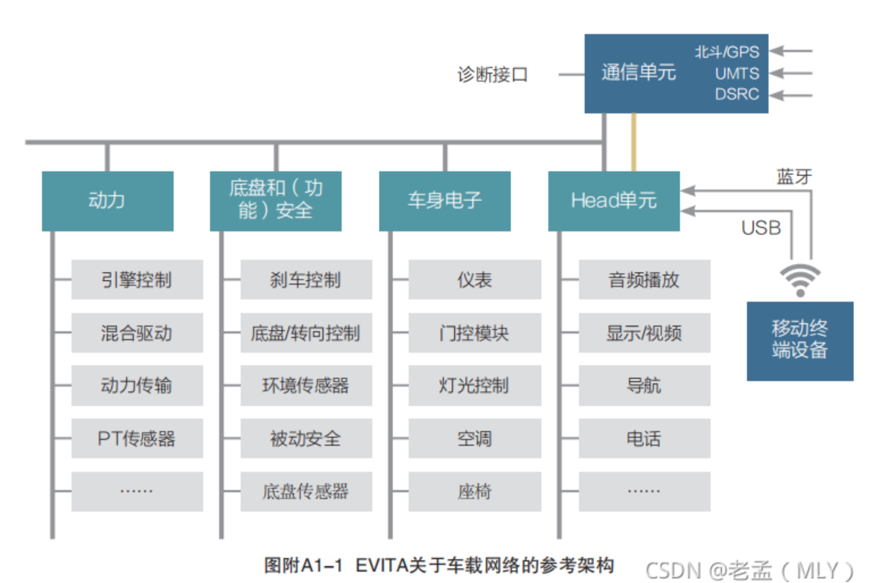
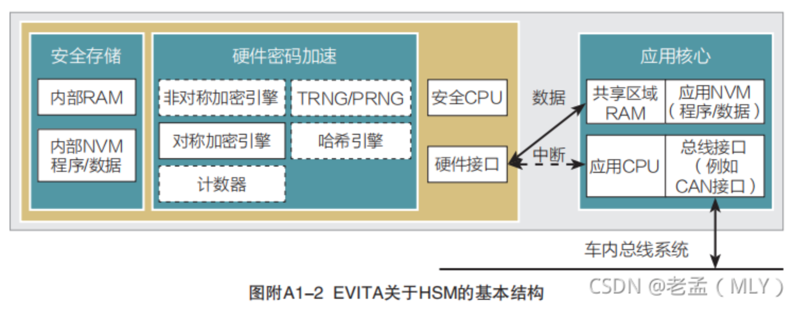
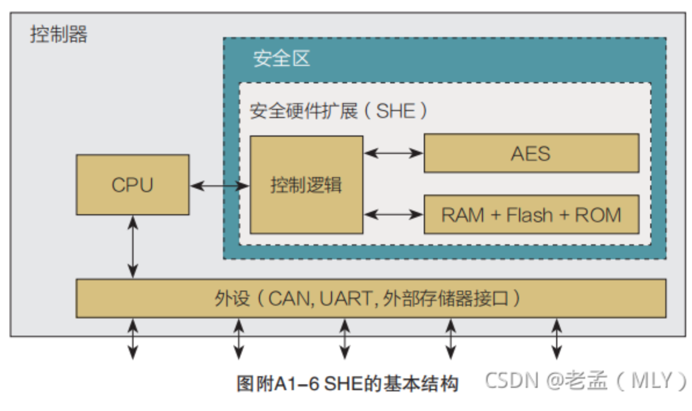
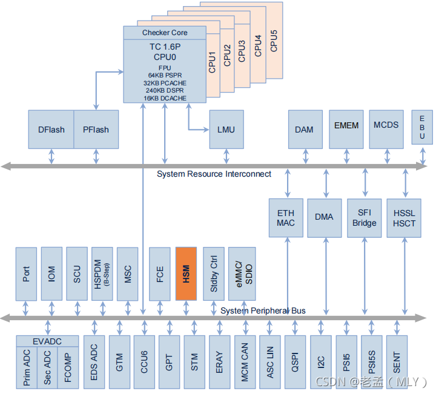
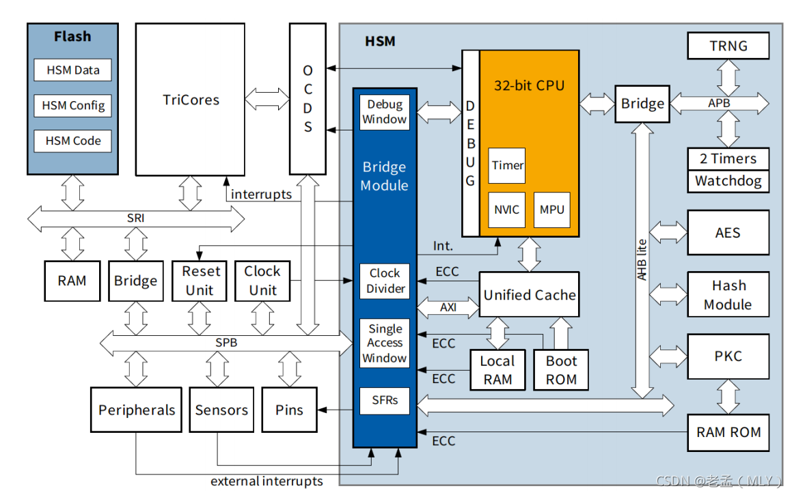
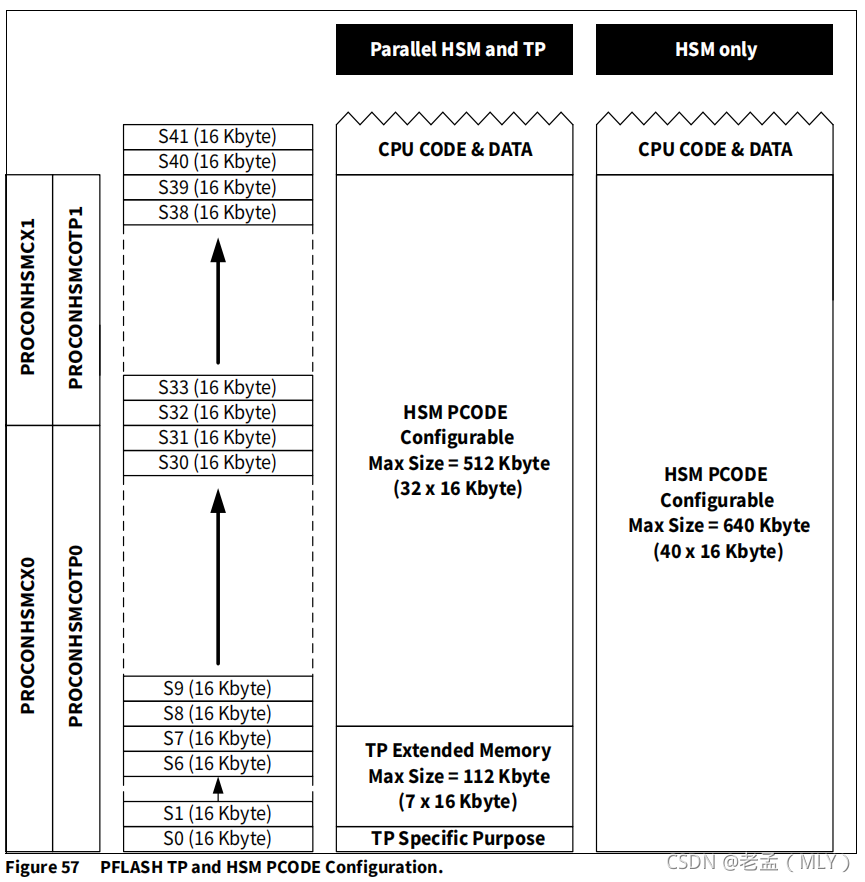
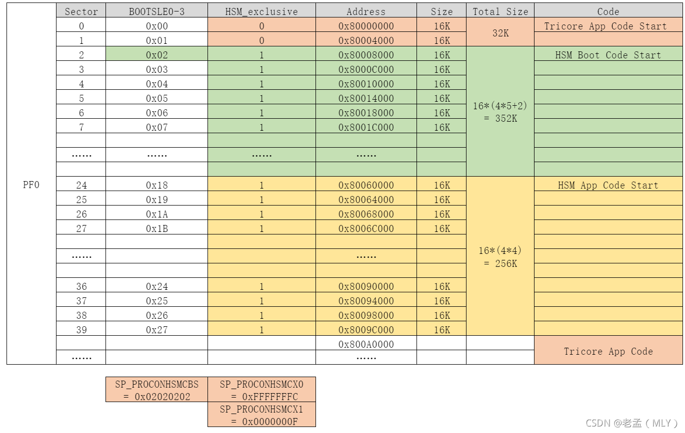

# 芯片安全

## 技术方案

### HSM 
Hardware Security Module 是MCU上专门用于实现加解密算法的一个外设。HSM通常有：
- 一个独立的CPU进行密码学相关运算
- 一些特定密码学算法硬件加速器
  - 对称算法加速
  - 非对称算法加速
  - HASH算法加速
  - 特定的真随机数生成器
  - 计数器
- 特定的密钥存储（RAM 和 NVM）
- 与MCU的接口

根据EVITA（E-safety vehicle intrusion protected applications）概念定义，车载网络参考架构和HSM的基本结构如下图所示：




EVITA的硬件安全模块分为3个等级：
- Full HSM
  - 主要用于V2X通信单元、中央网关
- Medium HSM
  - 主要应用于ECUs之间通信
- Light HSM
  - 用于传感器、执行器间通信。

### SHE
Secure Hardware Extension ，SHE 由HIS（Audi、BMW、Porsche、VolksWagen）等制定的标准，通过硬件提供基于AES-128位密钥的密码学服务：加解密、MAC、引导程序认证、唯一设备ID等、应用不可直接访问方式存储Key。



## 案例分析 
### Infineon 32-bit AURIX

整体安全架构（Holistic Security Architecture）

英飞凌 AURIX 32-bit MCU 家族，有嵌入式HSM，是需要特别安全功能的汽车应用的完美套件。典型例子是tuning protection，immobilizer，secure on-board communication等等。英飞凌不仅提供了HSM，还提供了必要的SW包和支持服务。


主要安全组件：
- On board security across all domains
- HW secuirtyModule（HSM）
- Medium EVITA compliant
- Ethernet secuirty features
- Unique chip individual keys
- Integrated HSM
- Security Software SHE+ provided by partner Network


下面TC397为例来了解一下AUTIX系列单片机的HSM。下图为TC397的架构图，HSM作为外设之一，挂载在单片机的SPB系统外设总线上：





#### HSM

高度灵活和可编程的解决方案：
- 加密和算法敏捷性，可由软件支持客户定制方案。
- AIS31-兼容的真随机数生成器（TRNG），生命周期内有高随机墒。
- 主流 AES-128 硬件加速器，匹配性能汽车协议
- 主流 PKC ECC 256 非对称加密硬件加速（仅适用2代AURIX HSM）
- 主流 HASH SHA2-256 哈希计算硬件加速（仅适用2代AURIX HSM）
- 加固的密钥存储，存放于单独的 HSM-SFLASH 分区。其他可选的安全密钥存储可以在 HSM-PFLASH节中。
- 安全文档，例如安全手册和安全分析总结报告可以由专门的 PRO-SIL产品提供。（需要NDA） 

下图为TC397的HSM展开后的架构图，HSM有一个基于ARM Cortex-M3的CPU，有随机数生成器TRNG，和AES、Hash、PKC（公钥加密整数）算法的硬件加速器，以及中断、Timer等组成部分。




TC3XX系列的HSM支持以下算法：
- 对称加密：AES-128：支持硬件实现，支持ECB、CBC两种模式；
- 摘要算法：MD5（128 bits）SHA-1(160 bits)、SHA-2(224 bits)、SHA-2(256 bits)、SHA-2(384 bits)、SHA-2(512 bits)：其中MD5（128 bits）SHA-1(160 bits)、SHA-2(224 bits)、SHA-2(256 bits)支持硬件实现，SHA-2(384 bits)、SHA-2(512 bits)可以用软件实现。
- 非对称加密：RSA、ECC等，是否支持硬件实现待验证，可用软件实现。

下面是英飞凌TC3XX的用户手册中与HSM有关的内容汇总：

##### UCBs
UCB 存储在DFlash中，每次上电时芯片自带的Boot Firmware 会读取UCB中的值，判断状态，并加载到相应寄存器中。

- UCB_HSMCFG ：由Infineon在生产设备时提供，以区别各个HSM模块
  - 地址： AF400E00～AF400FFF 512Byte UCB07 

- UCB_HSMCFG Content:如果HSM被配置，那么HSM DLT 程序已经编程HSM keys 并配置数据。
  - offset=000，在HSM ITS中定义，包含 128bit 数据hash值、128bit AES key0、128bit AES key1、TRNG 配置、versioning。
  - offset=1F0，ORIG confirmation 4bytes
  - offset=1F8，COPY confirmation 4bytes

- 读写规则：由Infineon出厂时填充。
  - 当confirmation = unlocked时，master（主核）可以写入数据，且master核与HSM核均可读取数据；
  - 当confirmation = confirmed/errored时，只有HSM核可以读取数据；

UCB_HSMCFG Confirmation State: 用于根据DMU_HF_CONFIRM0.PROINHSMCFG 指示. 如果 ORIG confirmation 码为 ERRORED ，那么原始错误标志被置位（DMU_HF_ERRSR.ORIER=1）。

UCB_HSMCFG Write Access Protection: 当下列条件均满足时，UCB_HSMCFG 可以被所有 master 核所编程和删除：UCB_HSMCFG confirmation state 为 UNLOCKED。

UCB_HSMCFG Read Access Protection: 
- 当下列条件均满足时，UCB_HSMCFG 可以被所有 master 核读取：UCB_HSMCFG confirmation state 为 UNLOCKED。
- 当下列条件均满足时，UCB_HSMCFG 仅可以被HSM master 核读取：UCB_HSMCFG confirmation state 为 CONFIRMED or ERRORED。

HSM 可以在下一个带有 DMU_SF_CONTROL.LCKHSMUCB 的应用重置前一直锁定读取访问。这个锁定作为HSM启动固件的一部分被执行。如果 HSM 调试模式enabled，那么这个Cerberus 与HSM有同样的访问权，否则 Cerberus 被作为别的芯片总线master。

UCBs涉及的寄存器：
- DMU_HF_CONFIRM0（状态指示），报告了UCB confirmation codes。

##### UCB_HSMCOTP0/1

这一部分包含了用户定义HSM保护和配置的 OTP 部分（0 表示原始orig，1表示拷贝copy）。他被传送到寄存器 DMU_SF_PROCONUSR和 DMU_SP_PROCONHSMC*。

涉及的寄存器：
- SF_PROCONUSR，启动时从UCB赋值
- SP_PROCONHSMCBS，该寄存器表示从Flash启动后存储在UCB_HSMCOTP 配置集中的所有引导扇区选择项的组合。该寄存器包含BOOTSEL0-3，BOOTSEL即Boot Sector Selection，控制哪个HSM代码扇区（HSM code sector）被查找作为启动代码。
- SP_PROCONHSMCX0/1，该寄存器用来表示PFlash的某个扇区是否被排除在HSM之外（HSM_exclusive）。
- SP_PROCONHSMCOTP0/1，该寄存器用来表示PFlash的某个扇区是否被配置为HSM永久锁定。
- SP_PROCONHSMCFG，SP_PROCONHSMCFG represents after Flash startup the or-combination of all boot sector selection entries stored in the HSMCOTP configuration sets.


##### UCB-HSM

定义了用户定义的HSM配置，它传到寄存器 DMU_SP_PROCONHSM.

##### UCB_PFLASH_ORIG and UCB_PFLASH_COPY

##### UCB_DFLASH_ORIG and UCB_DFLASH_COPY


#### HSM 开发方法

开发时分为两类工程：
- 编译Tri-Core 内核代码，用到编译器为 Tasking for Tri-core
- 编译HSM的ARM cortex-M3 内核，编译器为Tasking ARM for HSM

各个版本可以在下面Tasking的官网上找到，需要试用的话要联系[Tasking的销售](https://www.tasking.com/support/tricore-and-aurix-toolset-support#4.3)：


调试器：
- 英飞凌的 Miniwiggler 支持Tricore和HSM核的调试，可以使用Tasking内嵌的Debugger。
- 高端一点的调试器可以用 Lauterbach，配合软件Trace32，需要有Tricore和ARM的license。用Trace32软件结合Lauterbach硬件调试器可以实现HSM核和Tricore核程序的烧写和调试。此外还有 iSYSTEM 等不太常用的调试器。

PFlash地址划分：
- HSM核的程序代码可以存放于PFlash0的S0-S39这40个16K的PFlash块中，手册中对该区域的定义如下，我们暂时先考虑右侧“HSM only”的情况，先不管TP：




我们此次将该区域划分成如下三部分：



PF0的起始地址0x80000000处的S0-S1用于存放Tricore APP的部分代码，Tricore上电后从0x80000000处开始执行。

HSM代码分为BootLoader和APP两部分，此次将HSM的BootLoader起始地址放在S2 - 0x80008000处，HSM的APP起始地址放在S24 - 0x80060000处，将S2-S39共38个Sector都预留给HSM使用，其中BootLoader分配352K空间，APP分配256K空间。

预留给HSM的这38个Sector要被保护起来，是通过寄存器SP_PROCONHSMCX0/1两个寄存器设置的，HSM的BootLoader启动地址由寄存器SP_PROCONHSMCBS设置，这三个寄存器又都由UBC中的UCB_HSMCOTP0/1_ORIG和UCB_HSMCOTP0/1_COPY定义。

MCU上电时，SSW代码先判断UCB中的内容，如有效则将其复制到响应的寄存器中，然后查找SP_PROCONHSMCBS获取HSM核的启动代码地址，启动HSM核。

Flash地址分配可以用链接脚本来控制，代码共分为三个部分，Tricore的APP，HSM的BootLoader和HSM的APP，三个工程的链接脚本要相互配合好，保证编译出来的代码不会互相覆盖。


程序烧写步骤（根据上面共有3个工程，分别编译得到3个elf或hex文件）如下：
- 烧写 BMHD
  - 首先保证BMHD 区域值的正确，保证 Tri-core 可以正常启动
- 禁用 HSM
  - 烧写HSM程序前，要保证HSM处于禁用的状态，即 UCB_HSMCOTP0/1_ORIG和UCB_HSMCOTP0/1_COPY两个UCB中 PROCONHSMCFG 中的HSMBOOTEN值为0。
- 烧写程序
  - 向PFlash 中烧写 HSM 的BootLoader 程序、APP程序和Tricore 的APP程序。
- 程序校验
  - 查看PFlash相应地址处的程序，确保3个程序烧写完整，彼此没有覆盖。
- 配置HSM BootLoader 启动地址
  - 在PROCONHSMCBS寄存器中配置正确的HSM BootLoader启动地址，依据前文所述，向UCB_HSMCOTP0/1_ORIG 和UCB_HSMCOTP0/1_COPY两个UCB中的PROCONHSMCBS中的BOOTSELx填入0x02（暂定，待验证）。
- 启动 HSM
  - 以上准备工作完成后，就可以启用HSM配置了，即向UCB_HSMCOTP0/1_ORIG和UCB_HSMCOTP0/1_COPY两个UCB中 PROCONHSMCFG 中的HSMBOOTEN写入1.
- 以上配置都完成且正确后，再次给MCU上电，MCU即可启动Tricore核和HSM核。

### HSM核与业务主核的通信

主要通信方法：
- 中断
- 共享内存

#### 中断

例如Infineon的AURIX单片机，HSM核可以向主核发送中断，支持两个中断，主Tricore核中断控制寄存器地址分别为：0xF0038870u 、0xF0038874u，在iLLD中的定义如下：
```c
/** \brief  870, HSM Service Request */
#define SRC_HSM_HSM0_HSM0 /*lint --e(923)*/ (*(volatile Ifx_SRC_SRCR*)0xF0038870u)

/** Alias (User Manual Name) for SRC_HSM_HSM0_HSM0.
* To use register names with standard convension, please use SRC_HSM_HSM0_HSM0.
*/
#define	SRC_HSM0	(SRC_HSM_HSM0_HSM0)

/** \brief  874, HSM Service Request */
#define SRC_HSM_HSM0_HSM1 /*lint --e(923)*/ (*(volatile Ifx_SRC_SRCR*)0xF0038874u)

/** Alias (User Manual Name) for SRC_HSM_HSM0_HSM1.
* To use register names with standard convension, please use SRC_HSM_HSM0_HSM1.
*/
#define	SRC_HSM1	(SRC_HSM_HSM0_HSM1)

```
初始化中断后，HSM核可以软件触发该中断，使主Tricore核进入中断执行程序。

主核初始化中断示例代码：
```c
void init_interrupts(void)
{
	SRC_HSM0.U = (0 << 11) | (1 << 10) | 1;		/* 0<11 => ON CPU0, 1<<10 => Enable*/
	interruptHandlerInstall(1, (uint32) &Bridge2Host_IRQHandler);
}
sint32 Bridge2Host_IRQHandler(void)
{
	/***中断处理函数***/
}
```
#### 共享内存

TC3XX系列MCU有一块RAM空间被预留了出来，用于在主核和HSM核之间互相传递数据，被称为主核与HSM核之间的“桥梁”（Bridge）：

F0040000～F005FFFF 128Kbyte 

结构定义如下：
```c

/*------------- BRIDGE Module   ----------------------------------------------*/
typedef struct
{
       uint32_t RESERVED0[2]             ;
  __IO uint32_t HSM_ID                   ; // Module Identifier Register
       uint32_t RESERVED1[5]             ;
  __IO uint32_t HT2HSMF                  ; // Host to HSM Flag Register
  __IO uint32_t HT2HSMIE                 ; // Host to HSM Interrupt Enable
  __IO uint32_t HSM2HTF                  ; // HSM to Host Flag Register
  __IO uint32_t HSM2HTIE                 ; // HSM to Host Interrupt Enable
  __IO uint32_t HSM2HTIS                 ; // HSM to Host Interrupt Select
  __IO uint32_t HSM2HTS                  ; // HSM to Host Status
  __IO uint32_t HT2HSMS                  ; // Host to HSM Status
       uint32_t RESERVED2                ;
  __IO uint32_t CLKCTRL                  ; // Clock Control Register
       uint32_t RESERVED3[7]             ;
  __IO uint32_t DBGCTRL                  ; // Debug Control Register
  __IO uint32_t PINCTRL                  ; // Pin Control Register
       uint32_t RESERVED4[6]             ;
  __IO uint32_t ERRCTRL                  ; // Error Control Register
  __IO uint32_t ERRIE                    ; // Error Interrupt Enable Register
  __IO uint32_t ERRADDR                  ; // Error Address Register
       uint32_t RESERVED5[5]             ;
  __IO uint32_t EXTIF                    ; // External Interrupt Flag Register
  __IO uint32_t EXTIE                    ; // External Interrupt Enable
       uint32_t RESERVED6[6]             ;
  __IO uint32_t SAHBASE                  ; // Single Access to Host Base Address Register
       uint32_t RESERVED7[7]             ;
  __IO uint32_t RSTCTRL                  ; // Reset Control Register
  __IO uint32_t RSTPWD                   ; // Reset Password Register
       uint32_t RESERVED8[2]             ;
  __IO uint32_t SENSIF                   ; // Sensor Interrupt Flag Register
  __IO uint32_t SENSIE                   ; // Sensor Interrupt Enable Register
  __IO uint32_t SENSAPPRST               ; // Sensor Application Reset Enable Register
  __IO uint32_t SENSSYSRST               ; // Sensor System Reset Enable Register
       uint32_t RESERVED9[16320]         ;
  __IO uint32_t SAHMEM[16384]            ; // Single Access to Host Memory Window
} HSM_BRIDGE_TypeDef;

```

我们可以看到0xF0040000-0xF004FFFF这段地址空间内的一些地址被定义成了寄存器，可用于HSM核与主核之间相互控制、触发中断、获取状态等，详细的定义见HSM用户手册。

0xF0050000-0xF005FFFF这段地址空间没有具体的定义，但也是HSM核和主核都可以访问的区域。在使用的时候，我们可以在这个空间内定义一些大的数据块，比如用来存放待加解密的数据的buffer和加解密之后的数据的buffer，定义好之后可以将buffer的入口地址通过上面的寄存器（HSM2HTS & HT2HSMS）在HSM核与主核之间进行传递，就可以实现大块数据的传输，且传输过程中不需要进行数据的copy.

#### HSM 加速模块的使用

##### TRGN

TRGN（True Random Number Generator）是真随机数生成器的缩写，这个模块比较简单，一个寄存器TRNG_CTRL控制硬件随机数生成器的开启和关闭，一个结果寄存器TRNG_DATA32可以用来在生成器开启后读取生成的32位随机数，还有一个状态寄存器TRNG_STAT指示随机数生成结果、是否出错等状态。

寄存器的定义以及地址如下：

```c
/*------------- TRNG Module     ----------------------------------------------*/
typedef struct
{
  __I  uint32_t TRNG_DATA32              ; // True RNG Data Register
       uint32_t RESERVED0[2]             ;
  __IO uint16_t TRNG_STAT                ; // TRNG status register
       uint16_t RESERVED1                ;
  __IO uint16_t TRNG_CTRL                ; // TRNG control register
} HSM_TRNG_TypeDef;

#define HSM_TRNG_BASE                  (0xEC000200UL)

#define HSM_TRNG                       ((HSM_TRNG_TypeDef *) HSM_TRNG_BASE)

```

##### AES-128
AES加解密有两种方法：ECB和CBC，这里不着重介绍AES算法和这两种方法的区别，网上有很多资料，可以自行搜索。

AES的这两种方法都可以用硬件加速器来实现，AES模块中有4个输入寄存器：AESIN0-3，每个可以装载4字节数据，这四个寄存器可以用来向AES硬件模块装入密钥、待加解密的数据以及使用CBC方式时的初始向量。将数据装入4个输入寄存器后，可以通过控制寄存器AESCTRL来将数据装入相应的位置。

AES硬件模块可以同时记录8组密钥值和5组初始向量值，每次进行加解密的时候可以选择使用不同的密钥和初始向量。便于程序中同步运行多套AES加解密程序。

执行加解密的时候，可以通过AESCTRL寄存器来选择ECB加密、ECB解密、CBC加密和CBC解密。加解密完成后，会通过状态寄存器AESSTAT来进行指示，加解密结果存放在4个输出寄存器AESOUT0-3中。

AES硬件加速器的寄存器定义和地址如下:
```c
/*------------- AES Module      ----------------------------------------------*/
typedef struct
{

  __IO uint32_t AESIN0                   ; // AES INPUT register 0
  __IO uint32_t AESIN1                   ; // AES INPUT register 1
  __IO uint32_t AESIN2                   ; // AES INPUT register 2
  __IO uint32_t AESIN3                   ; // AES INPUT register 3
  __IO uint32_t AESCTRL                  ; // AES Control Register
  __I  uint32_t AESSTAT                  ; // AES Status Register
       uint32_t RESERVED0[2]             ;
  __I  uint32_t AESOUT0                  ; // AES OUTPUT register 0
  __I  uint32_t AESOUT1                  ; // AES OUTPUT register 1
  __I  uint32_t AESOUT2                  ; // AES OUTPUT register 2
  __I  uint32_t AESOUT3                  ; // AES OUTPUT register 3
  __I  uint32_t AESOUTSAVE0              ; // AES OUTPUT save register 0
  __I  uint32_t AESOUTSAVE1              ; // AES OUTPUT save register 1
  __I  uint32_t AESOUTSAVE2              ; // AES OUTPUT save register 2
  __I  uint32_t AESOUTSAVE3              ; // AES OUTPUT save register 3
} HSM_AES_TypeDef;

#define HSM_AES_BASE                   (0xE8000000UL)
#define HSM_AES                        ((HSM_AES_TypeDef *) HSM_AES_BASE)

```

##### 摘要算法
摘要算法也叫哈希算法（HASH），是一种单向不可逆的加密算法，即密文不能解密为明文，常用于数字签名。常用的摘要算法有CRC、MD5、SHA1、SHA2等，TC3XX系列的HSM支持硬件MD5、SHA1、SHA2(256)，其中SHA-256是目前最为安全的摘要算法，被越来越多地应用于汽车通信。

SHA-256输入数据的长度为64字节（512位）的整数倍，不足要补齐，输出的摘要结果为32字节（256位）。

在使用HSM的摘要算法硬件加速器时，先通过CFG寄存器选择使用哪一种算法，以及其他一些属性，如是否使用初始向量、输入输出数据大小端等。

然后向DATA寄存器中分批装入待加密数据，每批64字节，写进该寄存器的数据将会被装进硬件加速模块的输入数据FIFO。硬件加速器在装入数据的同时即开始计算摘要，每装完64字节应检查STAT寄存器中的DF_NF(Data FIFO Not Full)，当其不为1时才可以继续装载下一批数据。

直到所有数据都装完后，等待硬件加速模块计算摘要完成（寄存器STAT中的BSY位不为1）后，就可以从寄存器VAL中读取计算结果了，每次读取4字节，寄存器STAT中CNT的值为剩余可读计算结果的数量（4字节为单位），每读取一次CNT的值减1，直到减为0后结果读取完成。

摘要算法的寄存器和地址定义如下：
```c

ypedef struct
{
  __IO HSM_HASH_CFG_Type CFG        ; // HASH Configuration Register
  __I  HSM_HASH_STAT_Type STAT                ; // HASH Status Register
  __IO uint32_t HASH_IVIN                ; // Hash Initialization Value Register
  __I  HSM_HASH_VAL_Type VAL                 ; // Hash Output Value Register
  __IO HSM_HASH_DATA_Type DATA                ; // Hash Data Input Register
} HSM_HASH_TypeDef;

#define HSM_HASH_BASE                  (0xE8000400UL)
#define HSM_HASH                       ((HSM_HASH_TypeDef *) HSM_HASH_BASE)


```