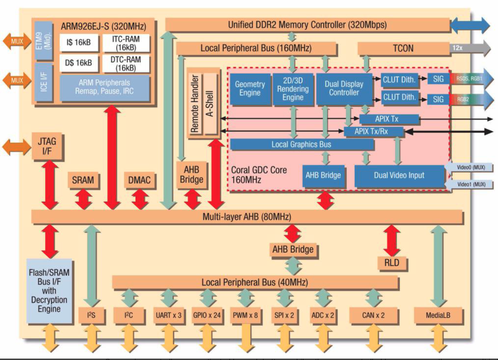
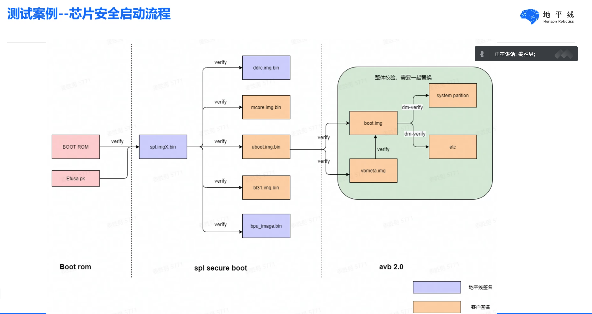
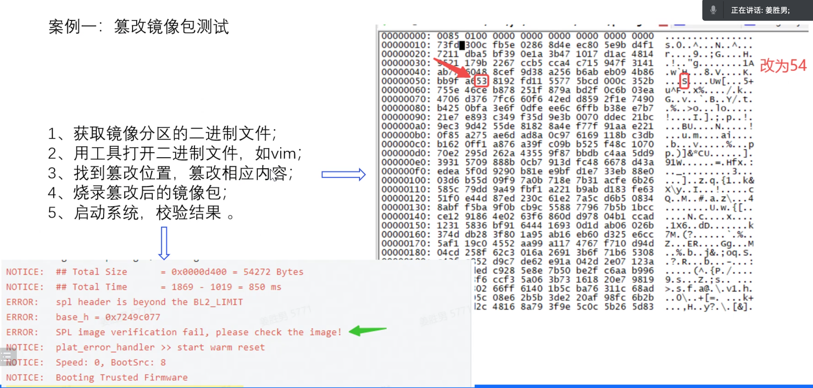
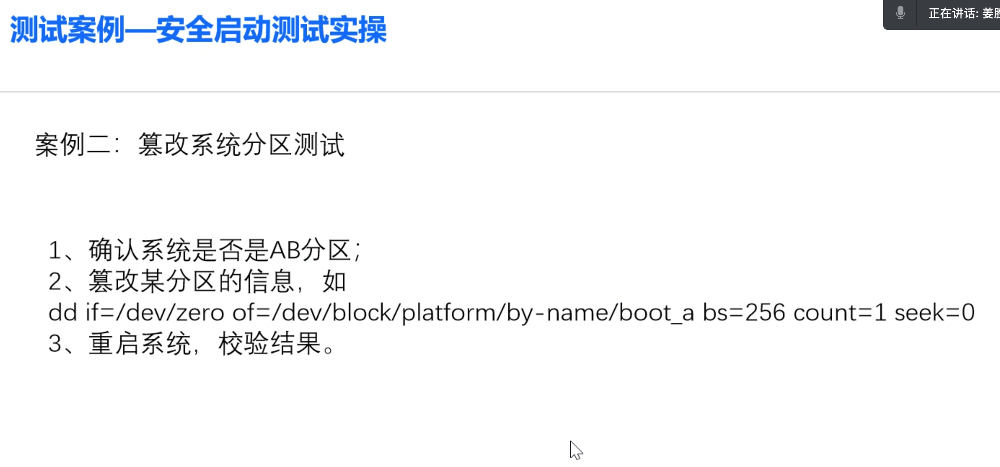

# MCU 安全测试

## 芯片测试基本知识

- 设计
- 功能测试（常用仿真验证（80%时间））
- 性能测试（仿真测试）
- 生产后测试
  - 缺陷可能由于单晶硅生长过程出现错位、离子注入问题导致的器件失效。

为了在生产后能够发现Fail或half-fail的芯片，通畅会在设计时加入专门的测试电路，比如
- 测试模拟的testmux
- 测试数字逻辑的scan chain
- 测试存储mbist
- 测试io和binding的boundry scan。

芯片复杂度很高，不可能能把每个信号都引出来测试，设计时就要做可测试实际 即DFT。

DFT：通过某种方法间接观察内部信号的情况，例如 scan chain；然后通过特定测试仪器（能产生各种测试波形并检测输出）。

DFT适合小芯片，大芯片（如cpu、soc）会使用内建自测试（Built-in self test），让芯片自己上电测试。

自测试从测试的对象上分为三个阶段：
- WAT（Wafer Acceptance Test）是封装前，晶圆厂出厂前对testkey的测试。
- CP（Circuit Probe）封装前晶原级别芯片测试
- FT（最终测试）封装完成后的测试。是工厂的重点。

FinalTest可以分成两个步骤： 自动测试设备(ATE) 系统级别测试(SLT) 2是必要项，1一般小公司用不起。 ATE的测试一般需要几秒，而SLT需要几个小时，ATE的存在大大的减少了芯片测试时间。 ATE负责的项目非常之多，而且有很强的逻辑关联性。测试必须按顺序进行，针对前列的测试结果，后列的测试项目可能会被跳过。

这些项目的内容属于公司机密，比如电源检测，管脚DC检测，测试逻辑(一般是JTAG)检测，burn-in，物理连接PHY检测，IP内部检测(包括Scan，BIST，Function等)，IP的IO检测(比如DDR，SATA，PLL，PCIE，Display等)，辅助功能检测(比如热力学特性，熔断等)。 这些测试项都会给出Pass/Fail，根据这些Pass/Fail来分析芯片的体质，是测试工程师的工作。 SLT在逻辑上则简单一些，把芯片安装到主板上，配置好内存，外设，启动一个操作系统，然后用软件烤机测试，记录结果并比较。另外还要检测BIOS相关项等。

所有的这些工作，都需要芯片设计工程师在流片之前都设计好。测试工作在芯片内是由专属电路负责的，这部分电路的搭建由DFT工程师来做，在流片后，DFT工程师还要生成配套输入矢量，一般会生成几万个。这些矢量是否能够正常的检测芯片的功能，需要产品开发工程师来保证。此外还需要测试工程师，产品工程师，和助手来一同保证每天能够完成几万片芯片的生产任务不会因为测试逻辑bug而延迟。 考虑到每一次测试版本迭代都是几十万行的代码，保证代码不能出错。需要涉及上百人的测试工程师协同工作，这还不算流水线技工，因此测试是费时费力的工作。实际上，很多大公司芯片的测试成本已经接近研发成本。 WAT与FT比较 WAT需要标注出测试未通过的裸片（die），只需要封装测试通过的die。 WAT需要探针接触测试点（pad）。测试的项目大体有： 开短路测试（Continuity Test） 漏电流测试（Stress Current Test） 数字引脚测试（输入电流电压、输出电流电压） 交流测试（scan test）功能性测试。

所以如果有什么大问题，设计阶段就解决了（或者比较惨的情况下放弃产品，重新设计）。如果生产过程有大的问题，从圆片测试开始也层层筛选掉了。所以剩下的芯片都是精英中的精英，一眼看过去都是完美的成品。 接着主要由探针测试来检验良率，具体是通过专业的探针上电，做DFT扫描链测试。这些扫描链是开始设计时就放好的，根据设计的配置，测试机简单的读取一下电信号就之后这块芯片是不是外强中干的次品。 其实好的、成熟的产品，到这一步良品率已经很高了（98%左右），所以更多时候抽检一下看看这个批次没出大篓子就行了。

具体芯片测试项目流程如下 接到客户的芯片资料，通常是正在开发的芯片，资料严格保密，有时候芯片还在design阶段就会开始联系合作的测试公司开始准备测试项目，以缩短整个开发周期； 根据芯片资料设计测试方案（test plan），这个过程经常会有芯片功能或者逻辑不明确的地方，所以需要与设计工程师反复沟通review。 根据测试方案需要设计硬件接口电路板（DIB：Device Interface Board）。 根据测试方案开发软件程序，如果项目巨大会分成多个module由多名工程师合作完成。3和4一般会同步进行。 第3和4步准备好后，就开始在tester上进行调试，一般是在测试公司的demo room进行。Bin1后release到工厂开始产线调试。 以上各步骤偶尔会出现错误，就需要不断调整返回到出现错误的地方更正。我经历的最严重的错误是发现芯片设计有问题，项目推倒重来。 

### 使用一般函数信号发生器和示波器的测试

MCU通常会通过串行数据线与其他设备通信，例如：
- I2C
- I2S
- SPI
- CAN
- UART

检查MCU是否正常工作，可以使用函数信号发生器生成测试信号查看MCU对各种刺激的响应，或者使用示波器查看MCU端口查看他发送的串行数据信号。

测试MCU时，通过示波器的混合信号示波（MSO）功能，查看从直流（DC输入）到高速时钟、串行数据信号的各种信号。

查看逻辑高压和低压的字符串，找出一系列的串行数据包中是否存在、哪里存在问题。通过对示波器进行设置，可以突出颜色显示某种触发条件。

## MCU 常见威胁

- 固件提取和反编译将暴露知识产权（IP）。芯片固件中保存了芯片公司、应用开发公司的知识产权，有可能被窃取。代码安全模块（Code Security Module） 使用户能够锁住未授权的访问或对存储中的固件的编程。
- 二次开发、测试会导致传统的运行时软件保护失效，需要在调试状态中建立保护。模拟代码安全逻辑（Emulation Code Security Logic （ECSL）使用户可以通过一个密码进入调试状态。
- 设备识别（枚举）。唯一识别码（UID），能够通过数据完整性算法、初始化认证和加密用的随机向量，保护代码克隆。

在芯片出厂时，没有启动安全协议时，芯片是一种完全未加锁状态。通过设定安全协议，锁定区仅允许通过存在于这个区中的code码来访问。

其他可以选择的安全措施：
- 内存块保护。许多时候，不是所有存储需要被锁定，特别是固件雰围不同的子系统或没有IP部分的系统。
- 区域所有权
- 仅执行保护。某个区域可以设置为仅能被执行，而不是读写。
- CPU 保护：调试访问到核心处理单元的寄存器可以被锁定和检查。
- 模拟代码安全逻辑。可以临时性通过输入password建立debug回话

- 唯一识别码
- JTAGlock，禁用和保护JTAG调试接口
- AES 加速
- 安全启动。作为固件保护的另一层，可以选择在引导时启用安全引导，然后再将执行移交给用户闪存代码。除了内置在安全逻辑中的编程保护外，这有助于确保设备上运行的代码是真实的。使用的算法是AES128 CMAC算法。可以使用工具将所需的MAC值嵌入到最终代码图像中。

## YD/T 1886-2015 移动终端芯片安全技术要求和测试方法

规定了移动终端的芯片配置安全、芯片调试安全、硬件加密安全、芯片功能安全、芯片运行安全、并提出相应的测试方法。

本标准适用于应用处理芯片、基带芯片、存储芯片等。

### 术语
- 应用处理芯片：用于支持终端操作系统、用户界面和应用软件的嵌入式处理器芯片，包含移动处理器芯片中的应用处理器功能模块。

- 基带芯片：用来处理移动终端的模拟基带和数字基带信号的嵌入式处理器芯片，包含移动处理器芯片中的基带功能模块。

- 芯片固件：用来配置或实现移动终端的应用处理器芯片或基带芯片的工作模式、协议栈、初始化状态等功能的机器指令或数据。

- DRAM：动态随机存储器。

### 概述

根据芯片安全需求，从芯片功能层面提出相应的技术要求和测试方法，保护芯片的配置端口的访问安全，保护应用处理器芯片和基带芯片的调试端口的访问安全，保护终端硬件加密运算的机密性，保护应用处理器芯片和基带芯片的功能完整性，保护移动终端硬件系统的运行安全，从而为移动终端的底层驱动、操作系统、应用软件提供安全可靠的运行环境。

主要分为芯片配置安全、芯片调试安全、硬件加密安全、芯片功能安全、芯片运行安全5个部分。

### 芯片配置安全

芯片功能重配置后应变更其型号，留有配置端口的芯片应采用安全防护措施保护配置端口的访问安全，可用的安全机制包括但不限于下列方式：
- 物理禁用方式
- 一次性编程禁用方式
- 基于令牌访问的控制方式

芯片配置端口的缺省状态应处于禁止配置模式。

### 芯片调试安全

具备调试功能的芯片在出厂后的调试生命周期中应保持自身的物理特性、功能属性、主要参数等因素与出厂时相同。留有调试端口的芯片应采用安全防护措施保护调试端口的访问安全，可用的安全机制包括但不限于下列方式：
- 物理禁用方式
- 一次性编程禁用方式
- 基于令牌访问的控制方式

### 硬件加密安全

#### 加密参数安全

加密参数安全是指硬件加密模块输入的非公开加密参数在整个硬件加密周期中应保持完整性和机密性。具体要求如下：
- 存储在DRAM中的回话密钥可附加相应的纠错码；
- 在对存储芯片进行整体硬件加密时，加密参数宜与移动终端硬件特征信息相关；
- 用户口令、用户指纹、图形密码不应直接为密钥使用。

#### 加密运算安全

具备加密功能的芯片亦采用硬件加速器方式设计

### 芯片功能安全

#### 功能完整性
#### 芯片固件存储安全

### 芯片运行安全

#### 存储芯片完整性
#### 基带芯片完整性
#### 应用处理芯片完整性

### 芯片故障检测与恢复

### 芯片安全测试

测试需要依据芯片的数据手册和相关硬件测试说明，综合运用芯片仿真器、软件集成开发环境等硬件和软件工具，采用灵活的测试手段开展安全性测试。

测试环境：
- 芯片数据手册
- 芯片仿真器、软件集成开发环境
- 芯片配置安全、芯片调试安全、硬件加密安全、芯片功能安全、芯片运行安全的规范要求和相关测试说明。

## DPX 安全测试现状

DPX horizon系列芯片在车圈有影响力。

2022.6.交流得知，他们根据iso&sae 21434 的测试活动：
- 功能测试
  - 根据安全需求设计测试用例，对安全功能进行正向测试
- 漏洞扫描
- 模糊测试
- 渗透测试

测试参数：
- T1:
  - 功能测试基于需求；
  - 漏洞扫描是对已知漏洞进行的自动化过程
  - fuzz测试是使用随机数据输入
  - 渗透测试假设有中等专业水平和知识的人和资源进行
- T2:
  - 功能测试基于需求和组件交互
  - 漏洞扫描是对已知漏洞进行的自动化过程
  - fuzz测试是使用测试轮次的递增数或适应性输入
  - 渗透测试假设有高级专业水平、知识

### 芯片安全启动测试

芯片安全启动流程：

安全启动测试思路：
- 1.从镜像包入手
  - 前提：拿到镜像包，查看结构、判断数据和签名位置
  - 操作：逐个篡改分区包的数据和签名，然后烧录镜像，验证启动
  - 校验结果：镜像包中某分区的信息被篡改，烧录后，启动系统失败，启动校验日志，查看失败原因。

- 2.从已烧录的系统入手
  - 前提：成功登录一台设备的系统，了解各分区的块设备信息
  - 操作：直接在系统中篡改分区内容，然后重启系统，验证启动
  - 校验结果：如果系统是AB双分区，当前分区篡改后，启动验签失败，则会切换到另一个分区启动成功；如果系统是单分区，分区篡改后，启动验签失败，则设备可能会变砖。

