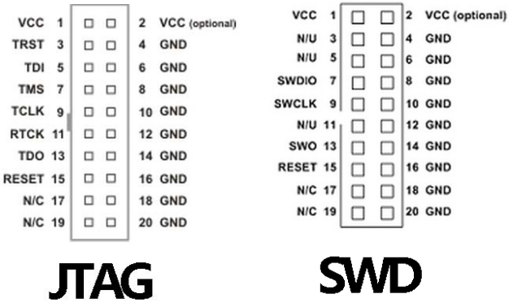
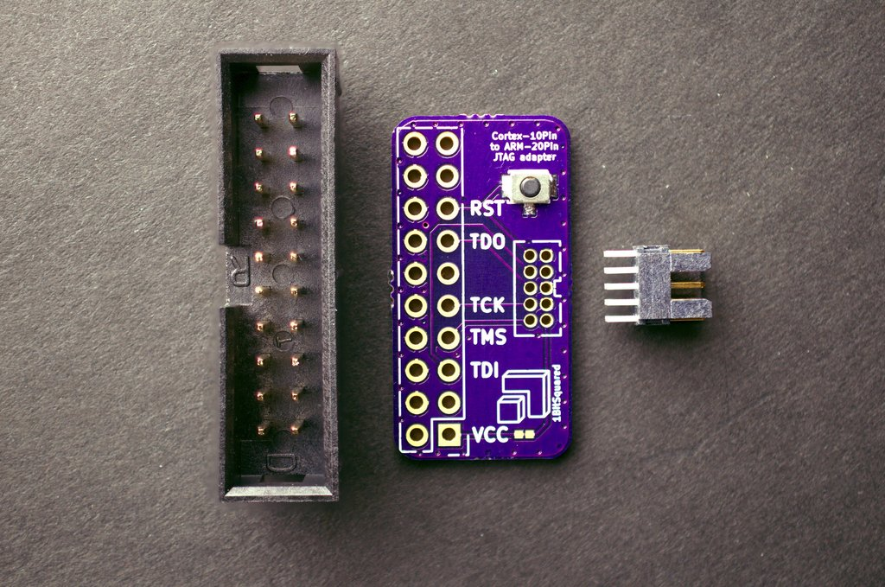
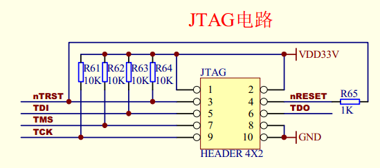
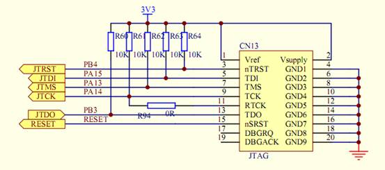

# JTAG 、SWD、RDI 等调试接口
## JTAG
JTAG （Joint Test Action Group） 联合测试工作组，是一种国际标准测试协议（IEEE 1149.1兼容），主要用于芯片内部测试。基本原理是在器件内部定义了一个TAP（Test Access Port）测试访问接口，通过专用的JTAG测试工具对内部节点进行测试。

JTAG 测试允许多个期间通过JTAG接口串联在一起，形成一个JTAG链，能实现对各个期间分别测试。目前，JTAG接口还常用于ISP（In System Programmer）在线系统编程，对FLASH等器件进行编程。

目前很多高级器件都支持JTAG协议，如DSP、FPGA等等。

标准的JTAG接口线是4线：
- TMS，模式选择
- TCK，时钟
- TDI，数据输入
- TDO，数据输出

其他引脚：
- TRST，测试复位，输入引脚，低电平有效。

10脚JTAG电路图(TQ2440开发板)：

20脚JTAG(网络)

## SWD （Serial Wire Debug）串行线调试

SWD与JTAG不是同一类调试模式，使用的协议也不同。

JTAG使用20针（古老的并行口，现已逐渐被弃用），SWD只需要4针或5针。使用范围JTAG更广泛一些。

SWD与JTAG的区别与联系：
- 高速模式下，SWD协议比JTAG更稳定可靠。
- 仿真器一般会同时支持这两种。
- 在GPIO缺少时，可以使用 SWD 仿真。
- 板子体积有限时，推荐SWD，需要的引脚少。

## RDI（Remote Debug Interface） 接口

RDI 是ARM公司提出的标准调试接口，主要用于ARM芯片的仿真。EasyJTAG使用RDI调试接口，可以在使用标准RDI接口的IDE调试环境下使用。例如：ARM公司的ADS 1.2 或 IAR 公司的 EWARM 3.30。

## JLink 仿真器

Jlink是德国SEGGER公司推出的基于JTAG的仿真器。即一个JTAG协议转换盒，实现USB到JTAG转换。

可用于 KEIL、IAR、ADS等平台，速度、效率、功能都很好。是众多仿真器里最强悍的。

## Ulink 仿真器

ULINK是ARM/KEIL公司推出的仿真器，还有升级版本 ULINK2 和 ULINK Pro。可以配置Keil软件实现仿真功能，增加了SWD支持，返回时钟支持和实时代理等功能。工程师可以结合 RealView MDK 调试器和ULINK2 ，方便在目标硬件上调试（使用on-chip JTAG，SWD和OCDS）、Flash编程。

注意ULINK仅能用于KEIL平台，ADS和IAR都不能使用。

## ST-LINK 仿真器

专门用于意法半导体STM8 、STM32系列芯片的仿真器。

ST-LINK /V2 指定的SWIM标准接口和JTAG/SWD标准接口，主要功能有：

- 编程功能：可烧写FLASH ROM、EEPROM、AFR等；
- 仿真功能：支持全速运行、单步调试、断点调试等各种调试方法，可查看IO状态，变量数据等；
- 仿真性能：采用USB2.0接口进行仿真调试，单步调试，断点调试，反应速度快；
- 编程性能：采用USB2.0接口，进行SWIM / JTAG / SWD下载，下载速度快；
