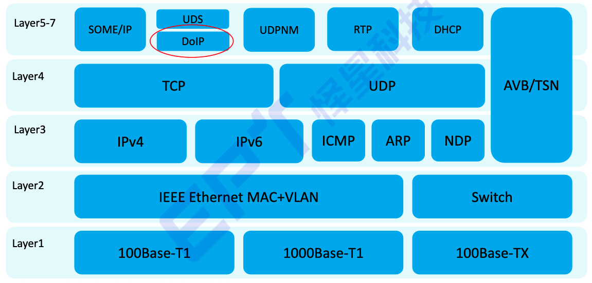
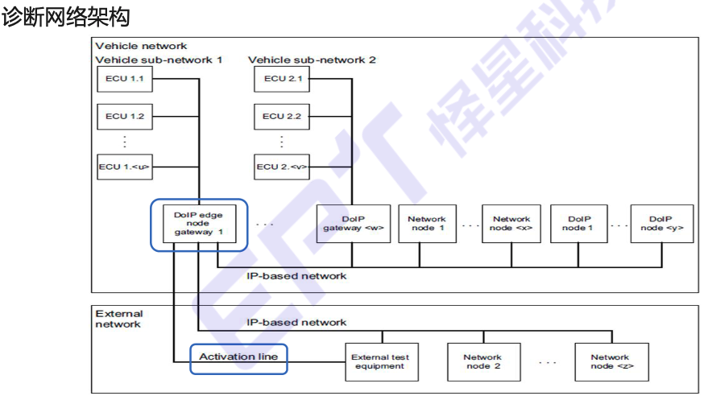

# DoIP

Diagnostic communication over Internet Protocl

参考标准：
- ISO 13400 Diagnostic communication over Internet Protocol
- Part1: General information and use case definition
- Part2: Transport protocol and network layer services
- Part3: Wired vehicle interface based on IEEE 802.3
- Part4: Ethernet-based high-speed data link connector

DoIP 优势：
- 高速传输
- 不需要专用Vechile connect interface，只需要以太网口
- DoIP技术可以匹配IT基础设施

标准：
- 100Mbps LAN/WLAN
  - Physical Layer ：IEEE 802.3/Ethernet
  - Transport Layer ：ISO 13400-2/DoIP
  - Application Layer ： ISO 14229
- CAN
  - Physical Layer ：ISO 11898/CAN
  - Transport Layer ：ISO 15765-2/DoCAN
  - Application Layer ： ISO 14229

## 术语

- DoIP Entity：实现DoIP协议的节点（ DoIP gateway或者DoIP node ）
- DoIP Edge Node：连接以太网激活线的DoIP节点
- Network Node：连在IP网络上，但不能实现DoIP的节点
- Logical Addressing(Phy/Fun)：逻辑寻址
- SA：Source Address 源逻辑地址
- TA：Target Address 目的逻辑地址
- EID：Entity Identification 实体标识符，唯一标识DoIP节点，一般是MAC地址
- GID：Group Identification组标识符，当VIN码未配置的时候替代VIN使用，车内节点同步边缘节点的GID
- VIN：Vehicle Identification Number 车辆识别码，Length：17byte

## 应用架构

诊断网络架构：

## 场景

### 直接点对点连接

使用网线连接测试电脑和车辆。

### 通过网络的点对点连接
通过以太网交换机和wlan接入点连接电脑和车辆
### 单个外部测试设备与多个车辆的网络连接
1台电脑通过以太网交换机和wlan接入点连接多台车辆
### 多个外部测试设备与单个车辆的网络连接
多台电脑通过以太网交换机和wlan接入点连接1台车辆

## 连接要求
DoIP边缘节点的接口要求：
- 100base-tx/10base-t
- activation line
- 物理层要求
  - 支持100base-Tx
  - 支持10base-T
  - 支持1分钟1500V电压隔离（IEC 60950-1）
- DoIP边缘节点数据链路层要求
  - 支持 10Mbps以太网
  - 支持 100Mbps以太网
  - 支持自动协商机制
  - 不要求支持Auto-MDI（X），即两种连接方式（直连、交叉）自动转换
- 测试设备数据链路层要求
  - 支持100Base-Tx标准
  - 支持Auto-MDI（X）
  - 