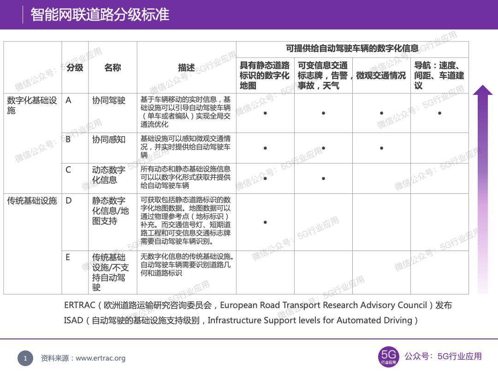
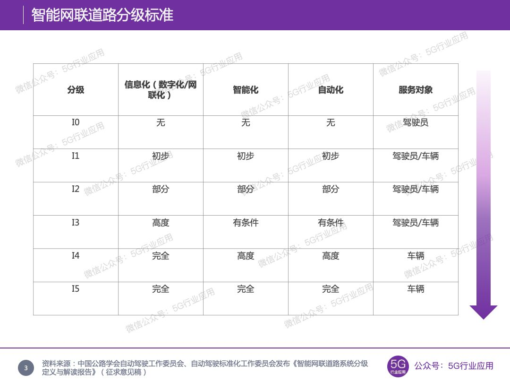
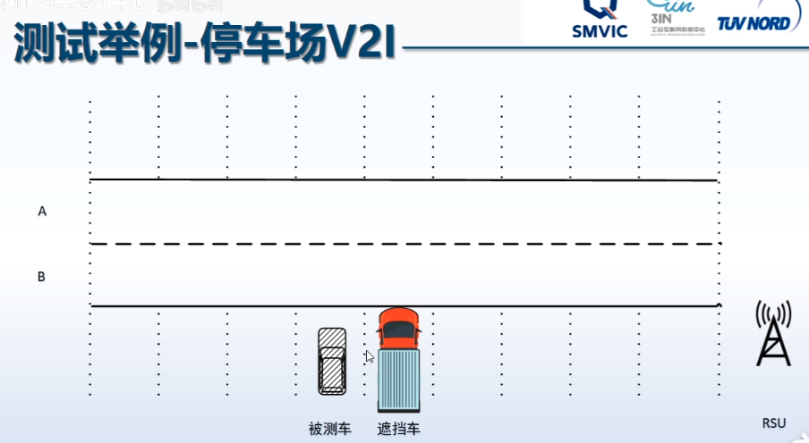

# 车路协同

自动驾驶的目的是解决两个交通问题：实现更加安全、更加便捷地人/货交通运输。

人类驾驶vs自动驾驶的特点：
- 强柔性 vs 强刚性
- 无边界 vs 有边界
- 高度不确定性 vs 高度确定性

## 车路协同为什么会出现？

单车系统：
- 前视毫米波雷达，最大探测距离 100～250m
- 8线激光雷达/前视Camera/32线旋转激光雷达，最大探测距离 50～100m
- 角毫米波雷达，最大探测距离 10～50m
- 环视Camera/超声波雷达，最大探测距离 < 10m

单车智能=眼睛+ 大脑 ，70分/2万，80分/成本5万，90分/成本20万，100分/成本100万（过高的边际成本，不利于量产）

车路协同= 眼睛+耳朵+大脑，80分由车完成，20分交给路。

## 背景意义

自动驾驶发展由单车智能向车路协同方向发展已经逐渐成为行业共识。随着技术的提升和体系的完善，高级别自动驾驶正在快速发展，但同时面临着一个重要问题，即安全问题。安全问题不仅包括自动驾驶功能安全，还涉及车与路的网络安全问题。一方面由于车端设备、路侧设备以及其通信过程暴露了大量的网络攻击面，所以面向车、路及其协同体系的网络攻击正在逐步显化；另一方面，车内ECUs、路侧设备、以及支撑车路协同云端服务系统中包含了大量的代码和数据，根据平均漏洞率计算可知其漏洞数量高达10万个。不断演进的网络黑客技术与持续增长的漏洞数量，使恶意攻击者入侵车路协同系统、盗取机密数据和用户隐私、破坏系统功能、诱发交通安全事故提供了可能和便利。车路协同系统一旦被敌对国家高水平黑客组织所控制，将对我国交通道路安全和社会稳定造成巨大负面影响。

面向车路协同系统的网络安全演练旨在对自动驾驶示范区内真实的车路协同系统，包括网联车辆、路侧设备和云控系统等，参考真实网络攻防过程，进行有组织、系统化的攻击和防守演练。通过演练，发现车路协同系统中的安全漏洞，揭示恶意攻击者的攻击目标、攻击技术和攻击过程，提升车路协同系统开发和运维单位和人员的安全意识和技能水平，提高车路协同相关网络安全体系的建设水平和运行水平。

## 车路协同等级
2019年3月，ERTRAC（欧洲道路运输研究咨询委员会，European Road Transport Research Advisory Council）发布《Connected Automated Driving Roadmap》，定义ISAD（自动驾驶的基础设施支持级别，Infrastructure Support levels for Automated Driving）[1]。

E级别最低，无数字化信息，不支持自动驾驶的传统基础设施，完全依赖于自动驾驶车辆本身；D级别支持静态道路标识在内的静态数字化信息，而交通信号灯、短期道路工程和可变信息交通标识牌需要自动驾驶车辆识别；C级别支持静态和动态基础设施信息，包括可变信息交通标识牌、告警、事故、天气等；B级别支持协同感知，即可感知微观交通情况；A级别支持协同驾驶，数字化基础设施可以引导自动驾驶车辆的速度、间距、车道。

基础设施部署的常见做法：流量控制系统通常部署在交通通行频繁达到通行能力限制的高速公路路段，而其他交通流很少中断的公路路段则不需要部署固定的交通控制系统。下图示例说明了ISAD级别是如何部署的，可用于简单描述自动驾驶车辆的期望公路网。对于容易出现交通阻塞的合流匝道位置，需要建设A级基础设施来进行交通控制（蓝色区块）；对于交通通行频繁的高速公路路段，需要建设B级基础设施来进行协同感知（绿色区块）；对于一些交通运行较为顺畅的快速路段，仅需要建设C级基础设施来提供动态信息给行驶车辆（黄色区块）；而对于二级公路网络可以建设D级基础设施；在一些乡村地区不需要建设智能化的基础设施配套。
### 国内
2019年9月21日，中国公路学会自动驾驶工作委员会、自动驾驶标准化工作委员会发布了《智能网联道路系统分级定义与解读报告(征求意见稿)》。从交通基础设施系统的信息化、智能化、自动化角度出发，结合应用场景、混合交通、主动安全系统等情况，把交通基础设施系统分为I0级到I5级。

I0级（无信息化/无智能化/无自动化），交通基础设施无检测和传感功能，由驾驶员全程控制车辆完成驾驶任务和处理特殊情况，或者完全依赖于自动驾驶车辆本身。

I1级（初步数字化/初步智能化/初步自动化），交通基础设施可以完成低精度感知及初级预测，感知设备能实时获取连续空间的车辆和环境等动态数据，自动处理非结构化数据，并结合历史数据实现车辆行驶的短时、微观预测，为单个自动驾驶车辆提供自动驾驶所需静态和动态信息。

I2级（部分网联化/部分智能化/部分自动化），交通基础设施将高精度感知及深度预测结果传递给车辆，为自动驾驶车辆提供所需信息，在有限条件下可以初步实现自动驾驶控制、基础设施系统接管和控制自动驾驶车辆。基础设施系统依托I2X通信，为车辆提供横向和纵向控制的建议或指令，同时车辆向道路反馈其最新规划决策信息。

I3级（基于交通基础设施的有条件自动驾驶和高度网联化），高度网联化的交通基础设施可以在数毫秒内为单个自动驾驶车辆（自动化等级大于1.5及以上）提供周围车辆的动态信息和控制指令，可以在包括专用车道的主要道路上实现有条件的自动化驾驶。遇到特殊情况，需要驾驶员接管车辆进行控制。基础设施系统可实现对自动驾驶车辆的横向和纵向控制，要求自动驾驶车辆的自动化等级达到1.5或以上。

I4级（基于交通基础设施的高度自动驾驶），交通基础设施为自动驾驶车辆（自动化等级大于1.5及以上）提供详细的驾驶指令，可以在特定场景/区域（如预先设定的时空域）实现高度自动化驾驶，实现对自动驾驶车辆的接管与控制，完成车辆的感知、预测、决策、控制等功能。遇到特殊情况，由交通基础设施系统进行控制，不需要驾驶员接管。

I5级（基于交通基础设施的完全自动化驾驶），交通基础设施可以满足所有单个自动驾驶车辆（自动化等级大于1.5及以上）在所有场景下完全感知、预测、决策、控制、通讯等功能，并优化部署整个交通基础设施网络，实现完全自动驾驶。完全自动驾驶所需的子系统无需在自动驾驶车辆设置备份系统。提供全主动安全功能。遇到特殊情况，由交通基础设施系统进行控制，不需要驾驶员参与。

### 智慧高速车路协同系统等级划分

2020年12月，中国智能交通产业联盟发布《智慧高速公路 车路协同系统框架及要求》，其中规范性附录给出智慧高速车路协同系统等级划分，其中每一级都是在前一级基础上的增强配置和应用服务升级[3]。

1级（基础道路），道路交通标志和标线设施完备。静态标志标线，无可识读电子标志；信息发布：情报板、红绿灯、车道通行灯等常规方式；路侧设施：道路检测感知设备（摄像机、气象传感器、雷达等）自成体系，未网联化。

2级（数字化道路），安装路侧智能感知（气象、交通流）、通信和计算设备。标志标线：具备车道级标志标线信息推送功能；信息发布：具备非视距信息推送功能，可将信号灯、限速标志、车道线、动态事件、气象、施工、预警信息等推送至车辆；路侧设施：支持蜂窝和C-V2X车路直连通信，提供本地交通流、动态事件感知及计算，能提供V2N车联网业务、高精地图及定位辅助。

3级（多源融合感知道路），具备基于云控平台的道路管控服务，支持全域交通信息采集、车路协同感知融合和交通信息处理。双向信息交互：具备 RSU-OBU 双向通信功能；路侧设施：C-V2X支持单播/组播通信、为自动驾驶车辆提供高精地图及定位辅助信息；交通控制：具备全域交通感知和交通流控制调节能力、可提供车路协同服务（如分合流预警、紧急情况预警等）。

4级（协同控制道路），支持自动驾驶车队编队行驶和在线调度。交通控制：支持自动驾驶车辆协同决策，具备快速交通调度和决策能力。

### 智慧高速公路分级

2021年3月，中国智能交通协会发布《智慧高速公路分级(征求意见稿)》。智慧高速公路等级由低到高分为简单智慧、基本智慧、网联协同智慧、自动驾驶智慧和自主可控智慧五个技术等级。

D0级智慧化：高速公路无智慧化。道路为基本的土木工程，有交通标志、标牌，具备车辆上路行驶的条件，服务和管理完全靠人工方式。

D1级智慧化：高速公路具有简单的智慧化。建设有传统的收费、通信、监控三大系统，满足高速公路使用者基本需求，提供电子不停车收费、视频监控、应急处置、信息查询等基本服务。路侧有可变情报板、视频监控、交通检测器等。服务和管理以人为主、智慧为辅的方式。

D2级智慧化：高速公路具有基本的智慧化。基础设施逐步实现数字化和信息化，为下一步的智慧化发展提供基础条件，在基础设施数字化和信息化的基础上，实现重大基础设施等全方位数字化监测和管理、恶劣气象条件下的安全引导、太阳能等新能源服务。路侧建设有高精定位、设施监测、智能感知监测等设施设备。服务和管理采用人工和智慧化相结合的共同管理方式。

D3级智慧化：高速公路具有协同式智慧化。建设有车路协同设施、云控平台，实现网联协同的智慧化管控环境，具有支持高级别自动驾驶、货车编队行驶等新技术的能力。提供车路协同安全管控、车道级、伴随式的高精准信息服务等等。路侧建设有车路协同设施设备。服务和管理采用以智慧为主、人工为辅的方式。

D4级智慧化：高速公路具有自主可控的智慧化。提供自动驾驶混合交通流的管控、“全天候”通行、基础设施自我诊断能力、新能量供给应用等服务。智慧高速公路具有可持续、低排放、资源节约、抵御恶劣气象和自然灾害的能力。路侧建设有新能源、新材料、高智慧化设施。服务和管理采用完全的智慧化方式，人工可以干预重要的服务和管理。

### 智能网联汽车技术路线图中的车路协同划分

|等级|等级名称|等级定义|控制|监视|典型信息|
|-|-|-|-|-|-|
|第1级|网联辅助信息交互|基于车-路、车-后台通信，实现导航等辅助信息的获取，以及车辆行驶数据与驾驶员操作等数据的上传。|人|人|地图、交通流量、交通标志、油耗、里程、驾驶习惯等信息，传输实时性与可靠性要求较低。|
|第2级|网联协同感知|基于车-车、车-路、车-后台通信，在共享自车感知信息的同时，实时获取车辆周边交通环境信息，作为自车决策与控制系统的输入。|人与系统|人与系统|周边车辆、行人、非机动车位置。速度、信号灯、道路预警等信息。传输实时性可靠性要求高|
|第3级|网联协同决策与控制|基于车-车、车-路、车-人、车-后台通信，在共享自车感知信息的同时，实时可靠获取自车周边交通环境感知结果，通过与他车交互决策信息的交互以及进一步的云端决策，实现车-车、车-路等交通参与者之间的协同决策与控制。|系统|系统|车-车、车-路协同决策与控制，传输实时性可靠性要求高|

单车智能：
- 2022年
  - 高速公路自动驾驶
  - 城郊公路自动驾驶
  - 协同式队列行驶
  - 交叉口通行辅助
- 2025
  - 车路协同控制
  - 市区自动驾驶
  - 无人驾驶

车路协同
- 2022
  - 高速公路自动驾驶
  - 城郊公路自动驾驶
  - 协同式卡车队列
  - 交叉口通行辅助
  - 商用车自动泊车
- 2025
  - 车路协同控制
  - 无人驾驶

## 车路协同趋势和架构

目前理想的车路协同系统组成：
- 智能路侧设备（红绿灯）
- 智能网联汽车

车端智能：
- 底盘系统/控制ECU
- 智能计算系统/DCU
- 感知计算系统ECU
- 传感器+OBU

路端的智能是更高水平的智能：
- 一体化智能云
  - 具有超强算力、数据采集分析、反向控制（不担心电量与体积）
  - 运维系统
  - 业务系统
- 数字化道路和全息路口
  - MEC、数据融合、低延迟
  - 路侧传感器、交通设施、视角高、范围广、数据真实

车路协同系统组成（自顶向下）：
- 行业云：公安系统/交通系统/工信系统
- 云：车联网网运维系统和业务系统
- 网络架构：公网/光纤
- 路侧计算：MEC/数据分析/数据融合
- 路侧传感器：全息路口-图像/毫米波雷达/激光雷达/信号灯等传感器
- 车载端：OBU、车载智能计算系统

### 车载OBU和智能计算系统
主要包括：
- 智能驾驶总成
  - 环境感知
  - 预测
  - 规划
- 底盘总成
- 座舱总成
- EE架构
- 整车及系统测试

OBU不需要大规模计算，也比较标准。

### 路端/数字化路口和全息路口设备
典型的数字化路口包括：
- 摄像头和图像计算系统
  - 通过RJ45网线与路侧网关连接
- 毫米波雷达和雷达计算系统
  - 可通过RJ45网线与路侧网关连接
- 激光雷达和点云计算系统
  - 可通过RJ45网线与路侧网关连接
- MEC（移动边缘计算）数据融合系统
- RSU
  - 专用短程通信技术DSRC设备/LTE-V设备，通过RJ45连接路侧网关
  - 信号灯机柜+信号灯。通过RJ45+双绞线连接路侧网关。
  - 其他扩展设备。
- 网络架构
  - 包括路侧网关、双绞线、光纤、光电转换器、路侧主机等
  - 路侧网关通过光纤或公网连接远端控制中心
  - 路侧网关通过网线连接路侧主机。

下面是一个典型的数字化路口设备组成图：

摄像头和图像计算过程：

毫米波雷达系统

信号灯/机系统

信号灯是不能出错的，信号机控制信号灯的程序不能从云端控制修改。是一个单向连接。

数字化全息路口的感知效果

网络架构分为两种，有线或无线，下面是有线连接：

### 运维系统和业务系统

### 车路协同数据

可参考：TCSAE 53-2017 合作式智能运输系统车用通信系统应用层及应用数据交互标准 http://www.ttbz.org.cn/Pdfs/Index/?ftype=st&pms=45916

### 车路协同难点

#### 宏观上

- 数字化道路、路口的成本太高；路侧可信度和车厂支持度不高，需要更多传感器；车路协同需要路侧和车端广播；中型的数字化路口目前要300万。
- 设计路侧建设，有很多行业壁垒
- 一体化平台的缺失。

车端到附近进需要40ms的时延。

事实上，这个图是2018年的，但目前仍然适用。比较重要的是明确谁是运营主体。

## 车路协同测试

- 路端功能测试，包括数据分析和融合，广播信息准确度
- 通信类测试，包括时延、丢包率、通信范围、互联互通
- 车端功能测试，包括信息识别和实车轨迹等

### 路端测试
功能测试及测试内容：
- 功能1 视频感知计算结果
  - 极限性能
  - 鲁棒性
  - 目标物列表
- 功能2 毫米波雷达感知计算结果
  - 极限性能
  - 鲁棒性
  - 目标物列表
- 功能3 激光雷达感知计算结果
  - 极限性能
  - 鲁棒性
  - 目标物列表
- 功能4 数据融合结果
  - 极限性能
  - 鲁棒性
  - 目标物列表
- 功能5 RSU信息推送
  - 不同信息类型可由RSU准确识别
- 功能6 RSU信息广播
  - RSU按照规定正确广播信息。

#### 测试举例

图像计算功能：
- 摄像头静止状态摄像头标定精度

雷达测试

路侧RSU

### 通信测试

V2I的频道是5905～5925MHz，信号绕射能力较差。所需选取的测试场景主要是有遮挡场景和不良天气场景测试、天线布局影响。

测试类型和测试项：
- 场景
  - 交叉口、弯道、高速、雨雾、隧道、直道等情况下的时延（V2I通信应用层时延）、丢包率（V2I信息统计丢包率）、覆盖范围（不同场景下保障最低丢包率的覆盖范围）、互联互通性能（不同厂商产品不同模组V2I通信信息可识别性）等。
- 车端天线
  - 天线布局对通信性能的影响。即不同天线位置/大小的时延、丢包率、覆盖范围、互联互通性能等。

### 车端测试

分为辅助驾驶、高级自动驾驶两类车。辅助自动驾驶车辆的测试，只需要看车辆系统能否接收到车路系统信息即可，高级自动驾驶车需要看接收、看轨迹。

目前无直接考V2I信息直接控制车辆进行的被测件，主要测试车端的信息识别。

测试项：
- 红绿灯识别
- 无信号灯交叉路口通行
- 基于路侧感知的交通状况识别
- 特种车辆/僵尸车识别

## 上海临港测试区介绍

核心测试区：

- 交叉路口通行测试
- 环形路口通行测试
- 高架乍道汇入汇出测试/并行行驶测试
- 车辆避让寻路测试
- 前方车辆变更车道检测与响应测试
- 自动泊车测试

高速测试：
- 盲区路口博弈测试
- 施工预警测试
- 行人识别及避让测试
- 非机动车识别及避让测试
- 探测及避让特种车辆测试
- 碰撞检测及自动紧急制动测试

隧道测试
- GPS信号失效，车辆依靠惯导技术行驶
- 夜间及低光环境下自动驾驶测试

降雨测试：
- 雨雾
- 小雨
- 中雨
- 大雨
- 暴雨

极端环境下
复杂环境下

闯红灯预警
道路施工预警
robot taxi测试
无人公交测试
无人清扫车测试
智能重卡测试
c