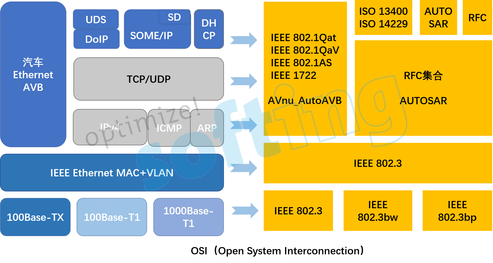
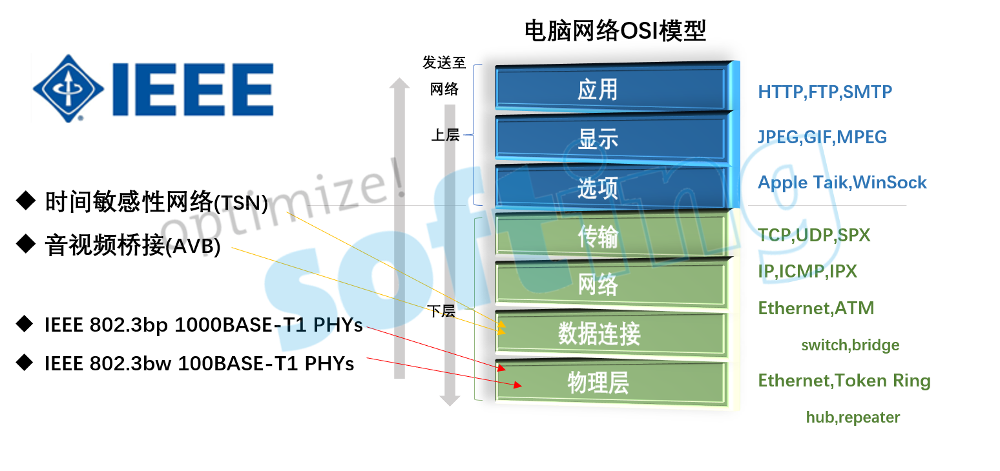

# 车载以太网

随着近年汽车电子的快速发展，车内ECU数量的持续增加，带宽需求也随之不断增长。对此，汽车制造商的电子系统、线束系统等成本也在提高。而相比于传统总线技术，车载以太网不仅可以满足汽车制造商对带宽的需求同时还能降低车内的网络成本，是未来整车网络架构设计的趋势。目前，车载以太网主要用于诊断、车载信息娱乐系统（IVI）以及驾驶辅助系统。

通过车载Ethernet,可以连接车端的下列部件:
- 车身/舒适系统(原有协议为CAN)
- 底盘、安全系统
- 信息娱乐系统
- 动力系统(CAN)
- 拍照摄像系统
- 接入网关

## OSI模型
OSI（Open System Interconnection）七层网络模型定义了网络互联的七层框架，其中每一层都运行不同的协议。只有统一通信规范时，才能实现网络互联化。而车载以太网参考OSI分层结构，规定了每一层的功能及协议。

车载以太网协议通常被认为是一个4层协议系统：应用层、传输层、网络层、数据链路层，每一层都具有不同的功能。

### 物理层(OABR)

参照OSI模型，车载以太网在物理层，即第一、二层采用了博通公司的Broad-Reach技术，BroadR-Reach的物理层（PHY）技术由OPEN（一对以太网）联盟推动，因此有时也被称为OPEN联盟BroadR-Reach（OABR）。BroadR-Reach由一对双绞线实现全双工通信，并提供100Mbit/s 及更高的宽带性能。该技术使用单对的非屏蔽双绞线进行通信，不仅可以减轻线缆重量达到30%，还可以降低80%连接成本，符合汽车要求的新型物理层技术。BroadR-Reach技术已被IEEE标准化，并命名为100BASE-T1，其中T1是指车载以太网。

- 100BASE-TX:采用两对5类非屏蔽双绞线或1类屏蔽双绞线，一对用于发送数据，另一对用于接收数据，最大长度为100米。
- 100BASE-T1:双工,双向.也叫IEEE802.3bw，它是被IEEE针对百兆车载以太网定义的标准。与传统的百兆以太网（100BASE-TX）不同，100BASE-T1使用的是一对双绞线进行全双工的信息传输。并且100BASE-T降低了电磁干扰，布线重量，成本以及占地面积。

- 1000BASE-T1: 1000BASE-T1也叫IEEE802.3bp，它是被IEEE针对千兆车载以太网定义的标准。与100BASE-T1相同，1000BASE-T1也使用的是一对双绞线进行全双工的信息传输。1000BASE-T1不仅能提高数据的传输速率，同时满足汽车行业高可靠性、低电磁辐射、低功耗以及同步实时性等方面的要求。

- 100BASE-T4: 100BASE-T4采用的是半双工传输模式，传输媒体采用3类、4类、5类非屏蔽双绞线。其中的三对线用以传输数据，一对线进行冲突检验和控制信号的发送接收。最大传送距离是100米。

### 数据链路层

定义操作通信连接的程序，封装数据包为数据帧以及监测、纠正数据包传输的错误。

#### AVB (Audio Video Bridging)

以太网音视频桥接技术旨在满足车内音视频应用的低延迟和可保证的带宽要求，对传统的以太网进行了扩展，通过增加精确时钟同步、带宽预留等协议增强传统以太网音视频传输的实时性。AVB技术提供了优先级、流预留协议（SRP）、流量整形协议（FQTSS）等核心功能。AVB在车内的应用案例有唇同步多媒体播放、在线导航地图等汽车联网应用、ADAS以及诊断功能等。

#### TSN（Time Sensitive Network ）

2012年，IEEE音视频桥接工作组正式更名为TSN，TSN定义了以太网数据传输的时间敏感机制，为标准以太网增加了确定性、可靠性，以确保以太网能够为关键数据的传输提供稳定一致的服务级别。

### 网络层

定义网络设备间如何传输数据，根据唯一的网络设备地址路由数据包，提供流和拥塞控制以防网络资源的损耗。

#### IPV4协议

IPV4是网络协议版本，是一种无连接的协议，操作在使用分组交换的链路层上。此协议不保证任何数据包均能送达目的地，也不能保证所有数据包均按照正确的顺序无重复的到达。

#### IPV6协议

IPV6是网络协议版本，由IETF(Internet Engineering Task Force)互联网工程任务组设计用于替代IPV4的下一代网络协议。相比于IPV4，IPV6具有更大的地址空间。随着互联网的快速发展，IPV6协议将会起到十分重要的作用，它不但可以解决网络地址资源数量的匮乏，也可以解决多种接入设备接入互联网的障碍。

### 传输层

传输层的功能是建立端口到端口的通信，确定主机和端口后，就可以实现程序之间的通信。

#### TCP协议

TCP/IP协议对应OSI模型的传输层，该部分是网络结构的中心部分，是下方硬件相关层和上方软件处理层的重要连接点。TCP是一种面向连接的、可靠的传输协议。它能够保证两端通信主机之间的信息可达。能够正确处理传输过程中丢包、传输顺序错乱等异常情况。

#### UDP协议

UDP协议是一种简单的、无连接的传输协议。当网络可靠，需要突发大量的数据时可以选择使用UDP，不用考虑丢包重传等情况，以提高数据传输效率。

### 应用层

应用层协议是用户与网络的交互界面，负责处理网络特定的细节信息覆盖了OSI参考模型的第5层至第7层。应用层可根据用户需求为用户提供多种应用协议，如超文本传输协议（HTTP）、通信控制（SOME/IP）、服务发现（Service Discovery）、动态主机配置协议（DHCP）、流媒体服务（Stream Media Service）、设备发现、连接管理和控制协议（IEEE 1722.1）等。

## 车载以太网发展趋势

伴随着车载以太网技术的不断成熟，它将带来更高的带宽和更低的延迟。并且，在OPEN联盟、AVnu等组织的推动下，车载以太网将会成为车载网络骨干，不专注于一个特定的应用领域，会集成动力总成、盘底、车身、多媒体、辅助驾驶等子系统，形成一个域级别的汽车网络。

## 德国Technica-车载以太网通讯专家

随着车载以太网的发展，越来越多的汽车电子产品开始应用BroadR-Reach技术。来自德国的Technica自2008年便与BMW合作共同研发BroadR-Reach技术、汽车以太网及其协议等技术开发标准测试的研究。根据对车载以太网的深入研究，设计研发了一系列测试的硬件、软件工具。