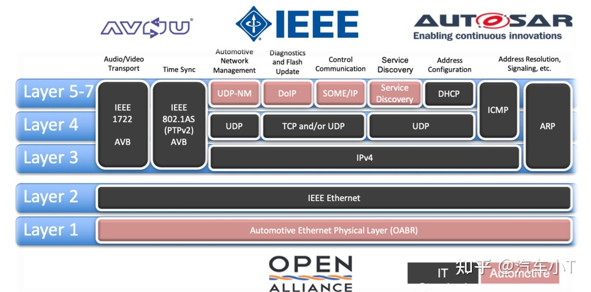

# 车载以太网

随着近年汽车电子的快速发展，车内ECU数量的持续增加，带宽需求也随之不断增长。对此，汽车制造商的电子系统、线束系统等成本也在提高。而相比于传统总线技术，车载以太网不仅可以满足汽车制造商对带宽的需求同时还能降低车内的网络成本，是未来整车网络架构设计的趋势。目前，车载以太网主要用于诊断、车载信息娱乐系统（IVI）以及驾驶辅助系统。

车载以太网的优势：
- 支持多种网络介质
- 物理介质与协议无关

通过车载Ethernet,可以连接车端的下列部件:
- 车身/舒适系统(原有协议为CAN)
- 底盘、安全系统
- 信息娱乐系统
- 动力系统(CAN)
- 拍照摄像系统
- 接入网关

## 发展历程

车载以太网发展历史
自1980年至今，IEEE组织、OPEN Aliance SIG组织、宝马、博通公司等为传统以太网到汽车领域的应用拓展发挥了十分关键的作用，重要里程碑事件记录如下：

1980年，Ethernet 1.0成功发布；
1985年，IEEE 802小组公布802.3协议，推出了基于CSMA/CD的10M以太网技术；
2004年，BMW公司考虑采用博通公司的以太网技术并于2008年在宝马7系上成功量产以太网刷写技术，其中关键点在于博通公司的单对非屏蔽以太网全双工技术，并保证EMC测试全部PASS；
2013年，BroadR-reach技术成功在宝马5系的环视系统中成功量产；
近年来由著名汽车整车厂与供应商组成的OPEN Aliance SIG相继发布了TC8（车载以太网ECU测试规范）以及TC10（车载以太网休眠唤醒规范），同时携手IEEE将车载以太网标砖转化为通用标准。

伴随着车载以太网技术的不断成熟，它将带来更高的带宽和更低的延迟。并且，在OPEN联盟、AVnu等组织的推动下，车载以太网将会成为车载网络骨干，不专注于一个特定的应用领域，会集成动力总成、盘底、车身、多媒体、辅助驾驶等子系统，形成一个域级别的汽车网络。

随着车载以太网的发展，越来越多的汽车电子产品开始应用BroadR-Reach技术。来自德国的Technica自2008年便与BMW合作共同研发BroadR-Reach技术、汽车以太网及其协议等技术开发标准测试的研究。根据对车载以太网的深入研究，设计研发了一系列测试的硬件、软件工具。

## 车载以太网总体架构
正由于上述IEEE组织，OPEN Aliance SIG组织, AVNU组织，AUTOSAR组织的共同发展与合作，进而规范了车载以太网符合OSI模型的整体架构，如下图1所示：

首先针对图1中AVNU，IEEE，AUTOSAR以及OPEN Aliance SIG组织做简要介绍，以便能够较为清晰地了解各组织在车载以太网总体架构地主要贡献及主要目标。

AVNU： 致力于推进AVB/TSN时间敏感网络在汽车领域的应用，使以太网成为一种时间确定性的实时网络；
IEEE： 电气与电子工程师协会，其中802.3工作小组致力于推进以太网相关标准的制定与完善；
AUTOSAR: 汽车开放式系统架构组织，致力于实现汽车软硬间之间解耦的标准同时也为车载以太网软件层级作出了相关规范说明；
OPEN Aliance SIG: 为非盈利性的汽车行业和技术联盟，旨在鼓励大规模使用以太网作为车联网标准；
同时，从上图中可以看出标记为“IT”则为传统以太网技术协议规范，而标记为“Automotive”则为车载以太网技术协议规范。

显而易见，**除了物理层、UDP-NM、DOIP、SOME/IP、SD这五个模块为车载以太网技术协议规范**之外，其余均为传统以太网技术。

## OSI模型
OSI（Open System Interconnection）七层网络模型定义了网络互联的七层框架，其中每一层都运行不同的协议。只有统一通信规范时，才能实现网络互联化。而车载以太网参考OSI分层结构，规定了每一层的功能及协议。

车载以太网协议通常被认为是一个4层协议系统：应用层、传输层、网络层、数据链路层，每一层都具有不同的功能。

### 物理层(OABR)

车载以太网与传统以太网相比，车载以太网仅需要使用1对双绞线，而传统以太网则需要多对，线束较多。

同时，传统以太网一般使用RJ45连接器连接，而车载以太网并未指定特定的连接器，连接方式更为灵活小巧，能够大大减轻线束重量。除此以外，车载以太网物理层需满足车载环境下更为严格的EMC要求，对于非屏蔽双绞线的传输距离可达15m（屏蔽双绞线可达40m）。

虽然车载以太网只采用单对差分电压传输的双绞线，但是100M/s以太网可以通过回音消除技术来实现全双工通信。下面就通过表格形式列举出当前主流的物理层标准：

从上表可知，当下主流的车载以太网协议主要为IEEE 100BASE-T1以及IEEE 1000BASE-T1，常规使用可采用100BASE-T1,如果需要更高带宽，可选择1000BASE-T1。

不过因为速率越高，对车载以太网物理层一致性测试就更为严格。

其中以太网所有物理层的功能全部集中在一个称为“PHY”的模块中，它将以太网控制器以及物理介质连接在一起，并且通过一个标准化接口MII连接，同时PHY模块与底层介质通过MDI接口连接，以100BSASE-T1所示，如下图2所示：

- MII: 媒体独立接口
- MDI：媒体依赖接口

参照OSI模型，车载以太网在物理层，即第一、二层采用了博通公司的Broad-Reach技术，BroadR-Reach的物理层（PHY）技术由OPEN（一对以太网）联盟推动，因此有时也被称为OPEN联盟BroadR-Reach（OABR）。BroadR-Reach由一对双绞线实现全双工通信，并提供100Mbit/s 及更高的宽带性能。该技术使用单对的非屏蔽双绞线进行通信，不仅可以减轻线缆重量达到30%，还可以降低80%连接成本，符合汽车要求的新型物理层技术。BroadR-Reach技术已被IEEE标准化，并命名为100BASE-T1，其中T1是指车载以太网。

- 100BASE-TX:采用两对5类非屏蔽双绞线或1类屏蔽双绞线，一对用于发送数据，另一对用于接收数据，最大长度为100米。
- 100BASE-T1:双工,双向.也叫IEEE802.3bw，它是被IEEE针对百兆车载以太网定义的标准。与传统的百兆以太网（100BASE-TX）不同，100BASE-T1使用的是一对双绞线进行全双工的信息传输。并且100BASE-T降低了电磁干扰，布线重量，成本以及占地面积。

- 1000BASE-T1: 1000BASE-T1也叫IEEE802.3bp，它是被IEEE针对千兆车载以太网定义的标准。与100BASE-T1相同，1000BASE-T1也使用的是一对双绞线进行全双工的信息传输。1000BASE-T1不仅能提高数据的传输速率，同时满足汽车行业高可靠性、低电磁辐射、低功耗以及同步实时性等方面的要求。

- 100BASE-T4: 100BASE-T4采用的是半双工传输模式，传输媒体采用3类、4类、5类非屏蔽双绞线。其中的三对线用以传输数据，一对线进行冲突检验和控制信号的发送接收。最大传送距离是100米。

### 数据链路层

定义操作通信连接的程序，封装数据包为数据帧以及监测、纠正数据包传输的错误。

数据链路层可以细分为 LLC（logic link control）和MAC （media access control）两个层级：
- LLC：负责向上层提供服务，管理数据链路通信、链接寻址定义等，宇所用物理介质没有关系。这一层的服务在IEEE 802.2 LAN 中定义。
- MAC：负责数据帧的封装、总线访问方式、寻址方式以及差错控制等，MAC层的存在则可以使得上层软件宇所用物理链路完全隔离，保证了MAC层的统一性。在IEEE 802.3中定义，并采用CSMA/CD访问控制方式。

#### 以太网帧格式

以太网随着历史发展总共存在5种帧格式，不同的以太帧存在不同的类型及MTU值(最大传输数据长度)，且可以在同一物理介质上同时存在。

目前广泛使用的以太网帧格式主要有2种，分别为Ethernet II帧格式与IEEE802.3帧格式。其中车载以太网主要采用Ethernet II帧格式。

完整以太网II帧格式

完整IEEE 802.3 帧格式

Ethernet II帧格式中的“类型”位置被802.3帧格式的“长度”所替代。

- 前导码：共7个字节，每字节内容为 10101010 ，仅用于收发双方同步时钟和bit流。
- 帧起始：帧开始界定符，1字节，固定位 10101011
- 类型/长度：若该字段值小于等于 0x5DC，那么帧为IEEE 802.3，大于等于 0x600 则为Ethernet II帧。
- 帧校验：CRC校验码
- 帧间隙：至少为12 字节，数据全为1.

同时需要注意Ethernet II帧格式并没有LLC子层的概念，只有MAC层来处理数据服务等内容，而IEEE 802.3则可以。

#### MAC 帧

对于MAC帧格式则是从“目标物理地址”开始至“帧校验”结束为一完整的MAC帧。如下图4所示为MAC的完整帧，包括目标物理地址，源物理地址，类型/长度，数据以及帧校验CRC组成。

特别地，如图中4所示，“VLAN Tag”字段可选，当没有VLAN Flag则为Basic MAC帧，当存在该字段时，则为VLAN MAC帧，即MAC帧可分为基本MAC帧(无VLAN)和标记MAC帧(包括VLAN)两种。

其中“类型”字段通常可以为以下几种类型，且该类型列表由IEEE组织来维护，如下表3所示列举了车载以太网领域常用的Ethernet Type：

|应用领域|以太网类型|协议|
|-|-|-|
|通用|0x8000|IPv4|
|通用|0x86DD|IPv6|
|通用|0x8100|ARP 地址解析协议|
|通用|0x9100|VLAN Single Tag|
|通用|0x88F5|VLAN Double Tag|
|AVB|0x22F0|IEEE 1722|
|AVB|0x88F7|gPTP网络|
|AVB|0x22EA| 多流Reservation协议I|
|V2X|0x88DC|Wave Short Message Protocal|
|802.3|0x0~0x05DC|IEEE 802.3长度|

MAC 地址为6个字节，前3个字节为组织唯一标识号，由IEEE分配到网卡生产厂商。最左边字节的Bit 1的 1/0 表示该标识是全球的还是本地的；Bit 0 的 1/0表示Unicast 地址还是 Multicast地址。
48位全为1表示广播。

#### MAC VLAN

VLAN 作为一种分割广播域的技术手段，有效降低网络不必要开销。VLAN有很多种方法，基于MAC 的 VLAN技术如下图所示：

如上图所示，ECU1与ECU2被划分为属于同一VLAN1，而ECU2与ECU4则被划分为属于同一VLAN2。只需要提前配置好各ECU所属的VLAN即可，基于MAC的VLAN的优点在于即使换了连接端口或者交换机都可以自动重新识别，不需要重复进行配置，主要用于DHCP或者ARP协议发送广播帧的场景。

正如前面所述MAC帧可分为基本MAC帧(无VLAN)和标记MAC帧(包括VLAN)两种，而如果为如果时标记MAC帧，那么就会使用到VLAN Tag，同时“数据”字段的最小长度为不带VLAN标记的46Byte与带VLAN标记的42Byte，因为VLAN Tag占用了4个字节，最大数据长度均为1500Byte。

如上图7所示，VLAN Tag总共可以分为以下3个部分：

PRI(3Bit)：帧优先级，就是通常所说的802.1p；
CFI(1Bit)：规范标识符，0为规范格式，用于802.3或Ethernet II以太网帧；
VLAN ID：就是VLAN的标识符ID；
### 网络层
网络层就是IP协议所在的层级，IP协议可以分为IPV4以及IPV6，常用的主要是IPV4，IP协议的主要作用就是基于IP地址转发分包数据。

同时IP也是一种分组交换协议，但是IP却不具备自动重发机制，即使数据没有达到目的地也不会进行重发，所以IP协议属于非可靠性协议。

车载以太网主要使用IPV4协议，同时由于该协议也属于传统以太网范畴，所以不会对该模块做过多细节性阐述。
IPV4是网络协议版本，是一种无连接的协议，操作在使用分组交换的链路层上。此协议不保证任何数据包均能送达目的地，也不能保证所有数据包均按照正确的顺序无重复的到达。
#### IPV4协议头

IP首部为20Byte。

该协议头的各部分解释如下图：

#### IPv 6
IPV6协议头

需要注意的是IPv6 数据报文是 IPv4 的 4 倍，IPv6 数据报文主要由两个部分组成：Header（首部）和 Payload（负载）。其中，IPv6 Header 的大小是 IPv4 的 2 倍。该协议头的各部分解释如下图：

### 传输层
传输层的协议就是TCP/UDP，这两者协议彼此独立，也可以同时存在，看具体使用场景需求。TCP/UDP作为传统以太网的标准协议，在这里同样不做过多展开，整体介绍下TCP与UDP的特点及区别。

TCP协议
TCP协议头

如下图13所示为TCP协议头的字段解释：

#### TCP协议

TCP/IP协议对应OSI模型的传输层，该部分是网络结构的中心部分，是下方硬件相关层和上方软件处理层的重要连接点。TCP是一种面向连接的、可靠的传输协议。它能够保证两端通信主机之间的信息可达。能够正确处理传输过程中丢包、传输顺序错乱等异常情况。

##### TCP建立连接过程
TCP是面向连接的可靠的网络通信，因此要通信双方建立通信连接，必须经过我们常说的“三次握手”才能够开启以太网通信，如下图14所示为TCP的“三次握手”连接过程。

TCP断开连接过程
TCP已经连接的双方如果需要断开，则需要“四次挥手“来完成此过程”

##### TCP协议特点
从上述的TCP建立连接以及断开连接的过程，不难得出TCP是一种面向连接可靠的传输层协议。具体总结有以下一些特点：
面向连接；
仅支持单播传输，点对点方式，不支持多播或者广播方式；
面向字节流；
可靠传输；
提供拥塞控制；
全双工通信；

#### UDP协议

UDP协议是一种简单的、无连接的传输协议。当网络可靠，需要突发大量的数据时可以选择使用UDP，不用考虑丢包重传等情况，以提高数据传输效率。

UDP全称为用户数据包协议，在网络中与TCP协议一样用来处理数据包，是一种无连接的协议。同时UDP有不提供数据包分组、组装和不能对数据包进行排序的缺点，也就是说，当报文发送之后，是无法得知其是否安全完整到达的。

UDP协议头
如下图所示为UDP 协议头的组成：

##### UDP协议特点
对比TCP协议，UDP具备以下一些特点：
面向无连接，即不需要建立连接便可以直接进行通信；
存在单播，多播，广播的功能；
UDP是面向报文的，UDP的报文报经过IP层不会进行任何拆分或重组；
不可靠性：由于没有像TCP的拥塞控制以及出错自动重传等机制，则会导致发送的报文五宝保证接收方是否收到，因为网络本身就存在诸多的不确定性；

### 应用层
在车载以太网领域，目前主流涉及到的应用协议主要有UDP-NM，DOIP，Some/IP，SD以及传统以太网需配合支持的ICMP，ARP，DHCP等协议。

车载应用层协议：
- 通信控制（SOME/IP）：面向服务的上层通信中间件（C/S），可用于AP、CP以及非AUTOSAR 平台之间以服务为导向的交互通信。
- DOIP：基于IP的诊断服务，类似DOCAN，用于基于以太网的UDS诊断服务。
- UDP-NM：基于UDP的网联管理，类似CAN-NM，用于实现基于UDP的NM。

- 服务发现（Service Discovery）：基于SOME/IP的服务发现协议，使SOME/IP的节点具备发现服务、寻找和停止服务等功能。
- 动态主机配置协议（DHCP）
- 流媒体服务（Stream Media Service）
- 设备发现、连接管理和控制协议（IEEE 1722.1）等。

- AVB/TSN：用于基于以太网的时间同步协议，使其有高实时性。

#### AVB (Audio Video Bridging)

以太网音视频桥接技术旨在满足车内音视频应用的低延迟和可保证的带宽要求，对传统的以太网进行了扩展，通过增加精确时钟同步、带宽预留等协议增强传统以太网音视频传输的实时性。AVB技术提供了优先级、流预留协议（SRP）、流量整形协议（FQTSS）等核心功能。AVB在车内的应用案例有唇同步多媒体播放、在线导航地图等汽车联网应用、ADAS以及诊断功能等。

#### TSN（Time Sensitive Network ）

2012年，IEEE音视频桥接工作组正式更名为TSN，TSN定义了以太网数据传输的时间敏感机制，为标准以太网增加了确定性、可靠性，以确保以太网能够为关键数据的传输提供稳定一致的服务级别。

## 车载以太网基础测试

测试类型：
- 部件级测试
  - 遵循行业测试规范的测试，例如：open/autosar（目前最常见的是OPEN Alliance 推出的TC8测试规范）、avnu avb、 ieee tsn(tbd). 
  - OEM定制需求的测试规范，例如：Review测试规范，测试规范。
- 系统级测试
- 实车级测试

定制的车载以太网测试规范可能包括：
- DoIP协议测试规范
- GW测试规范
- L2自定义测试规范-非switch节点
- someip服务发现测试规范
- uds测试规范
- 故障dtc测试规范
- 基本性能测试规范
- 刷写测试规范
- 网络管理测试规范
- 100Base-T1 Ethernet review DVM
- 1000Base-T1 Ethernet review DVM
- 以太网交换机测试规范
- 车载AVB测试规范
- DoIP从节点测试规范
- DoIP主节点测试规范
- 车载FBL（以太网）测试规范
- OTA并行刷写传输协议（主、从节点）测试规范
- 车载DLT协议测试规范
- 以太网关review DVM
- 以太网网关路由测试规范

### TC8

目前最常见的是OPEN Alliance 推出的TC8测试规范。

测试内容包括：
- PMA & L1-IOP
- Switch
- ARP & IPv4 & ICMP & TCP & UDP
- IPv4 Link -Local & DHCPv4
- SOME/IP

TC8 3.0版本2020年5月推出，变化是：
- 删除不适用车用的需求
- 修正了测试用例的存在的错误
- 调整了switch测试用例，删除了部分some/ip 测试用例

### 部件级测试

#### 职责划分

OEM：
- 制定企业测试规范
- 指定第三方测试机构（可称为 Test-House）
- 审核供应商报告，抽测

Tier1:
- 按照OEM测试规范提供测试报告
- 确认Tier2的芯片或代码测试报告

### Layer 1 物理层

#### PMA
参考标准 ： 需求规范 IEEE 802.3bw & 测试规范 OPEN-TC1 
测试实现分析：广泛采用的方法是频域分析；PHY模式设置；难以自动化。

相关参考包括：

测试实验方案：
- 示波器
- 信号发生器
- 网络分析仪
- 测试夹具
- PMA测试软件

#### L1-IOP 测试 （interoperability test）

参考标准：
- IEEE 802.3bw 
- 测试规范 OPEN-TC1 

测试内容：
- Link-up 时间（从上电/被唤醒到linkup的时间）
- Signal Quality
- Cabel diagnostics

测试实现分析：
- 需要一个对手件做linkup，这个link pattern的性能要很稳定。
- 核心：Golden Device 设备的可靠性和性能，保障测试结果的置信度和一致性。

实验方案：
- 硬件：IOP 测试golden device
- 软件：自带软件，实现半自动化测试

### L2 数据链路层

#### L2 switch 测试内容
性能参考标准：RFC2544 & RFC2889

性能测试内容：
- 吞吐量
- 转发延时
- 丢包率

测试实现分析：
- 一般由交换机芯片供应商执行，验证switch 芯片的交换性能

功能测试标准：
- OPEN-TC8 & IEEE 802.1（D/X/Q/AE/AS..）

功能测试内容：
- VLAN Testing
- General
- Address learning
- Filtering of incoming frames
- Time synchronization
- Quality of Service
- Configuration

测试实现分析：
- 依据需求范围和配置参数选择测试内容
- 行业内暂时无对TC8-L2 标准测试包
- Time synchronization 需要ns 级精度，如 TSN BOX

### L3-L4 网络层传输层测试

车载以太网最常用的TCP/IP协议：
- ARP
- ICMPv4
- IPv4
- UDP
- TCP

TC-8 3.0 测试用例分布：
- ARP 49个
  - 主要对arp报文请求，响应格式，arp entry 学习，arp entry 的更新以及arp的timeout时间进行了测试。OEM可能会禁止动态arp。
  - 单独收到arp响应时，未更新arp缓存表
- ICMPv4 19个
  - 对DUT的错误机制以及支持的ICMPv4报文类型进行测试
  - 收到IP option 错误报文后不发送ICMP error 报文或发送错误的ICMP error 报文。

- IPv4 30个
  - 主要对ipv4报文头，ipv4 checksum，ipv4 ttl，ipv4 版本号字段，DUT锁接收ipv4数据包的目的地址字段，ipv4的分片，ipv4重组进行测试。
  - 接收子网广播报文
  - 分片存在重叠时的重组机制。
- UDP 32个
  - 主要验证了报文格式、接口等内容
  - 接收子网广播报文
  - 未丢弃非法源IP地址的UDP报文
- TCP 188个
  - 主要验证报文格式、状态机、无效标志位、重传等内容
  - 初始重传时间错误
  - 重传时间最大值及重传次数错误
  - timewait 状态时间错误。

测试实现分析：
- 绝大多数测试需要依赖 uppertester

参考规范：Specification of Testability Protocol and service Primitives, autosar tc release 1.2.0

测试实现：节点测试：
- 通用设备：
  - 程控电源：DUT 供电及电压仿真器
  - IO板卡：唤醒源和信号触发源，如使用VT IO 板卡
  - 电源板卡：电源模式仿真及电流采集
- 一致性测试专用设备
  - IOP 测试： golden device
  - PMA 测试：示波器+网络分析仪
  - 协议一致性测试：相关软件及硬件

- 定制测试
  - 相关软件和硬件