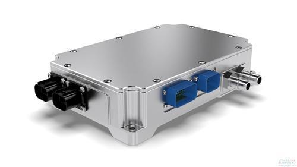
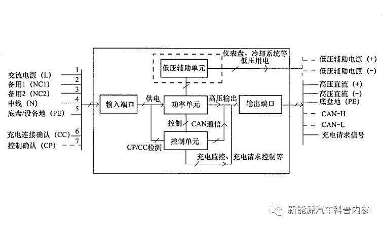
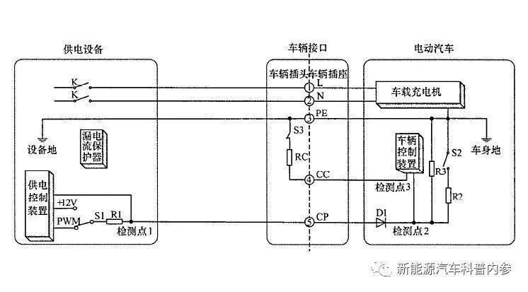
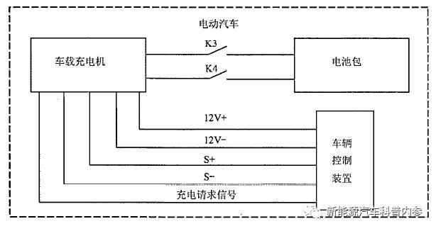
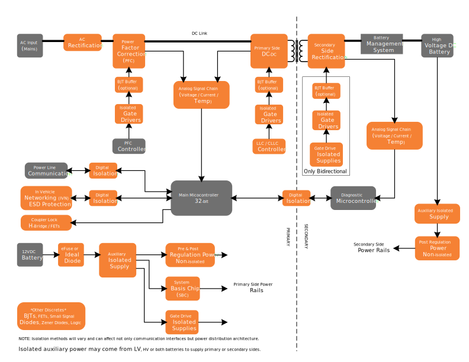

# 车载充电机 OBC 

电动汽车充电机(On Board Charger)，按照是否固定在汽车上，划分为车载充电机和非车载充电机两类。

非车载充电机又分成交流充电桩和直流充电桩两种。

车载充电机，以交流电源作为输入，输出为直流，直接给动力电池充电；非车载直流充电机，交流输入，直流输出，可以直接给动力电池充电。前者功率较小，后者较大。另外一种，交流充电桩，交流作为输入，输出也是交流，不能直接给动力电池充电，需要连接车载充电机，进行交直流转换，才能实现充电。交流充电桩内部比较简单，基本功能就是将电网交流电引出到方便电动汽车充电的位置，并提供一个标准的充电接口。受到车载充电机能力的限制，交流充电桩功率一般也不需要太大。

## 车载充电机在电动汽车上的位置

车载充电机作为电动汽车电气系统的一部分，被固定在底盘上。车载充电机的输入端，以标准充电接口的形式固定在车体上，用于连接外部电源。车载充电机的输出端，直接连接动力电池包慢充电接口。

在电动汽车CAN总线通讯拓扑结构中，车载充电机作为一个节点，挂在CAN总线上，通过CAN与整车控制器交换数据。

## 充电模式

充电模式指充电过程中，电流、电压以怎样的规定性提供给电池。充电模式，对充电效率、电池寿命都会产生显著影响。

主要的充电模式有:
- 恒流充电
- 恒压充电
- 先恒流后恒压充电
- 同向脉冲充电
- 正负脉冲充电。

在基本类型的基础上，一直有研究人员在探索更为合理高效的充电方式。比如，结合恒流恒压充电，中间采用正负脉冲充电方式。在较长时间脉冲正向充电以后，夹杂短暂的负向脉冲充电，用以消除正向充电过程中产生的极化现象，降低回路电阻，进而提高了充电效率，同时对降低充电温度也有正向作用。图示在后面的案例说明中。

当前最为常见的充电形式:恒流-恒压充电。电量较低时采用较大电流充电，提高充电速度；电量较高时，采用恒压充电，避免对电池造成伤害。

## 充电截止条件

充电模式另一个被讨论最多的点，是充电截止条件。可以被用作充电截止的判据，常见的有:
- 电池包总电压
- 电池单体最高电压
- 充电电流。

电池包总体电压作为充电截止条件：在充电过程后期，电池包总电压随着充电过程的进行而逐渐提高，达到某一个设定阈值后，充电过程结束。在这个过程中，如果充电截止总电压的设置数值比较高，而电池包中单体电芯的一致性又不是特别好，可能出现单体电压已经到了报警阈值，而总电压依然没有触及截止值的情况。

单体电池最高电压作为充电截止条件：把电池管理系统监测到的单体电芯电压中最大值作为判据，当电压达到设定的截止电压值时，充电过程结束。由于单体之间不一致性的存在，如果没有合理的均衡措施，必然存在着一批电芯，电压还没有达到满电电压。

充电电流作为充电截止条件：接近满充状态，电压恒定，电流则逐渐减小，当电流减小到设定阈值以下，充电过程结束；

## 车载充电机组成及工作原理

上图是标准《QCT 895-2011 电动汽车用传导式车载充电机》中的充电机结构示意图。可以看到，车载充电机主要的组成部分。输入端口，控制单元，功率单元，低压辅助单元和输出端口。

输入接口，7个pin口，三类连接，包括高压电源连接、高压中性线；车辆底盘地；低压信号的充电连接确认和控制确认。标准的输入接口采用工频单相输入220V电压。但如果功率需要，也可以启用两个备用pin口（pin口NC1，NC2），可以实现380V输入。

控制单元，采样输出电流和电压，经过处理后将实时值传递给PID（一种闭环自动控制技术，是比例、积分、微分控制器的简称）控制回路，由控制器比较测量值与期望值之间的差距，再将调节要求传递给PWM回路（PWM脉冲宽度调制技术），用脉冲宽度变化去控制高压回路中功率器件的开闭时间的长短，最终实现输出电流和电压尽量接近于主控系统要求的数值。

低压辅助单元，是一个标准低压电源，输出电压12V或者24V，用于充电期间，给电动汽车上的用电器供电，比如电池管理系统、热管理系统、汽车仪表等。

功率单元，一般包括输入整流，逆变电路和输出整流3个部分，将输入的工频交流电转化成适合动力电池系统能够接受的适当电压的直流电。

输出端口，包括低压辅助电源正负极两个pin口，高压充电回路正负极两个pin口，底盘地，通讯线CANH和CANL（还可以有CAN屏蔽），充电请求信号线。其中，高压连个pin口与电池包相连；充电请求信号线用于，充电机的输入端口与外部电源之间完成充电连接确认以后，通过“充电请求信号”线向车辆控制器发送充电请求信号，同时或延时一小段时间后，用低压辅助电源给整车供电。

工作过程

车载充电机的充电工作过程，在标准《QCT 895-2011 电动汽车用传导式车载充电机》中有详细叙述。

## 连接确认

上图所示，是汽车行业标准推荐的典型充电连接电路形式，图示状态为电源插头与车辆上的充电插座插合后的状态。

完成插头插座连接后，车辆处于不可行驶状态（具体实现形式没有要求，可以是互锁回路或者其他状态控制方法）；

整车控制器VCU检查检测点3的电压，用来确认插头插座是否连接完好。如果连接好，检测点3应该与系统地接通；

图中的开关S1为电源上的起动开关，闭合后，电源上的PWM发生器发出调制脉冲信号，VCU检查检测点2是否收到PWM信号，如果有信号，说明充电设备连接完成；

## 车辆就绪

车载充电机充电控制引导电路如上图所示。在完成前面的连接确认过程以后，车载充电机通过输出端口的“充电请求信号”线，向VCU发送充电请求信号，并通过低压电源口向整车控制器供电；如果VCU判断电池包状态可以充电，则向充电机发送充电报文包含对充电参数的要求（报文内容为整车通讯报文的一部分）。

电源通过PWM信号向整车控制器提供电源最大充电电流值，整车控制器综合考虑电池包，车载充电机和充电电源三者的最大电流，选择最小值作为此次充电的电流上限，避免三者中的任意一方出现过流。

充电

充电电流阈值设置完毕，闭合慢充回路继电器，开始充电过程。过程中，VCU监测检测点3的状态，周期确认连接状态是否完好；电源侧则检查检测点1，确认连接完好。

充电完成

充电完成的条件是电池充满或者前面在充电开始以前，充电连接确认过程中，任何一个连接确认条件不满足，VCU都会要求充电结束，并发送报文，要求车载充电机停止工作，并停止低压供电。

## 产品

### SHINRY

车载充电机

基本参数

技术平台：G5/G6

输入电压：90V~265V(单相)  200V~460V(三相)

输出电压：100V~1000V

充电功率：3.3kW/6.6kW/11kW/22kW

转换效率：96%~98%

封装方式：水冷、风冷、自然风冷、模块

### onsemi

