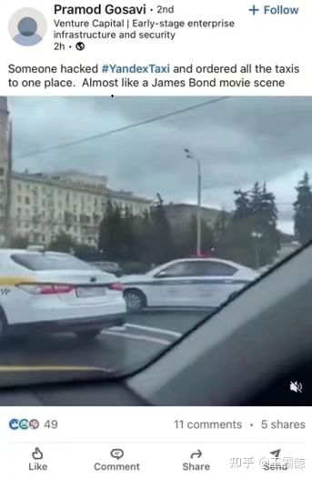

# 车辆的信息安全开发

有相关车辆产品生命周期管理（PLM）软件，例如：SystemWeaver（比较好的还原了 21434）。

## 安全事件
2022年9月5日，俄罗斯最大的打车平台Yandex Taxi遭黑客入侵，把所有出租车同时叫到莫斯科Kutuzov Prospect上同一目的地，大量出租车造成的壅塞扰乱莫斯科交通。

2022年5月16日，英国安全公司披露特斯拉model 3和model y无钥匙进入系统的漏洞，通过重定向车主的手机或密钥卡与汽车之间的通信，可以欺骗无钥匙进入系统，对车辆进行解锁和启动。

2022年10月，近期，上海的车主在使用车机自带的导航软件时，出现了匪夷所思的交通警告提示。虽然后来经过上海警方证实，事实上并没有发生。

随着车联网产业发展，“电动化、智能化、网联化”的大趋势下，车辆正在变成家庭中最复杂最精密的“电子产品”。车联网应用迅速丰富，从早期的远程启动发动机、远程开空调、车载导航等简单功能，到现在远程诊断和排除车辆故障、付费升级软件功能、监控车辆动态信息实时调整动力输出达到最佳油耗性能比、无钥匙进入车辆等等，同时新一代车联网的发展也催生出了不同的业务场景，并产生/采集了大量极具价值的敏感数据，包括车辆运营大数据、车辆故障和修复数据、车主个人生物信息/行为信息等隐私数据，及支付和车主账户信息等财务数据。

## 车辆信息安全开发啊的难点

难点一：车辆本身就是一个边界比较宽广的复杂局域网系统。包含多个子系统和子网络，资产分散度高，和边界的距离浅，因此对黑客而言，攻击面比较宽泛，风险自然更高。
当前比较主流的车联网模型，包含4个方面：
- 车内网
- 车辆边界
- 通信信道
- 云端系统

难点二：
车辆研发流程约3年，长于绝大多数IT信息系统，项目管理难度更高。车辆子系统涉及动力、底盘、新能源、智驾、网络娱乐等多个专业领域，参与车辆开发的供应商数量多，专业背景和技术能力参差不齐，对信息安全的理解和技术积累差异大。

难点三：供应商两手一摊，说：这要求我们没做过，不会啊，得加钱。

行业亟需一套车辆信息安全开发流程的管理措施，甚至一套信息安全开发流程的自动化管理工具，来支撑整车的研发流程。目前，行业中还是比较缺乏相关经验的人才和配套工具的。《ISO / SAE 21434道路车辆-信息安全工程》标准应运而生，而且在21~22短短两年，ISO 21434、欧盟的WP.29 R155法规、中国的强制标准《汽车整车信息安全技术要求》陆续推出，或即将公布。

按照ISO 21434的定义，车辆信息安全分为8个相互依赖的过程：
- 组织的信息安全管理
- 项目相关的信息安全管理
- 信息安全的分布式活动
- 信息安全的持续性活动
- 概念阶段
- 产品开发阶段
- 后开发阶段
- 威胁分析和风险评估模型。

在TARA阶段，明确的定义了整车和零部件级别TARA的基本过程，这是车辆信息安全流程早期，对工程师经验要求高，且工作量相当大的信息安全分析工作。业内目前的主流做法是依赖自身培养的信息安全专家，通过维护一张非常庞大的Excel表格，来进行TARA分析。

但是，在SystemWeaver的swExplorer工具提供了半自动化的操作过程，可以很清晰地展示TARA过程。

ISO 21434定义的TARA过程，从“资产分析”开始，经过“损害场景”、“威胁场景”、“攻击路径”一系列分析，评估出每一个“资产-威胁场景”的风险级别，生成TARA报告。然后根据风险级别定义信息安全目标，从目标得出每一条高级别的信息安全需求，然后细化需求输出指导产品进行信息安全开发。

资产识别。从系统角度出发，梳理系统内部组件以及各自的资产，并且识别系统外部和系统存在交互。在这个阶段，通常需要绘制一张系统资产模型图，标识出资产和数据流关系。

损害场景分析。针对每一个识别出的资产的完整性、可用性和保密性，以及其它信息安全属性，分析每个属性的可能被损害的场景，详细描述该损害场景的损害过程。并且对每一条梳理出的损害场景，从多个维度进行损害级别的打分，测算出该损害场景的损害级别。

这个过程涉及大量的重复文本编辑工作，听起来就很累人。SystemWeaver工具提供了复制粘贴操作，可以简化一部分工作。