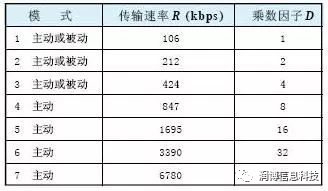

# 近场通信安全技术要求

近距离无线通信(NFC，NearFieldCommunication)技术呈现出良好的发展势头。NFC技术由Philips公司和Sony公司共同开发，于2004年4月被批准为国际标准ISO/IEC18092《信息技术系统间近距离无线通信及信息交换的接口和协议(NFCIP-1)》。

获得批准的ISO/IEC18092由物理层和数据链接层组成，属于利用13.56MHz电波的近距离无线通信规格，可使配置了该技术接口的消费类设备之间建立一种短程通信网络，从而大大改善用户以无线方式接入数据及服务的性能。2004年Philips公司首先推出两枚可应用于手机中的NFC芯片，接着Nokia公司开始销售带有NFC芯片的手机，并且与Philips和Sony现有的非接触智能卡技术Mifare、FeliCa完全兼容。

数据传输速度可以选择106kbit/s、212kbit/s或者424kbit/s，在连接NFC后还可切换其他高速通信方式。ISO/IEC18092对NFC技术标准作了详细的说明，但是由于使用13.56MHz频段进行通信的不止只有NFC，因此，2005年1月ISO/IEC21481《信息技术系统间近距离无线通信及信息交换的接口和协议(NFCIP-2)》即“NFCIP-2”正式发布，该标准对NFC通信模式选择机理作了补充说明，使标准进一步完善。因此NFC基于ISO/IEC18092、ISO/IEC21481、ECMA340、352、356以及ETSITS102、190标准，同时又兼容ISO14443A标准，具有自身的技术优势和特点，能够广泛应用到不同的场合。

## NFC国际标准简介

NFC技术支持三种不同的操作模式：
- (1)读写模式(对FeliCa或ISO14443A卡的读写);
- (2)卡模式(如同FeliCa和ISO14443A/MIFARE卡的通信);
- (3)NFC模式(NFC芯片间的通信)。NFC国际标准ISO/IEC18092、ISO/IEC21481涵盖通信模式、调制与编码、防冲突机制、帧结构等内容。

### 通信模式
NFC工作于13.56MHz频段，支持主动和被动两种工作模式和多种传输数据速率，如表1所示。在主动模式下，主呼和被呼各自发出射频场来激活通信，在被动工作模式下，如果主呼发出射频场，被呼将响应并且装载一种调制模式激活通信。也就是说在一对NFC通信设备中(主呼和被呼)，至少有一方是主动的。

NFC设备在传输有效数据前必须先通过有关协议选定一种通信模式和传输数据速率，在数据传输过程中，选定的通信模式和传输数据速率不能改变。数据传输速率R与射频fc之间的关系为：（其中D是一个乘数因子。）

### 调制技术
NFC标准中对于高速传输(>424kbps)目前还没有作出具体的规定。在低速传输时都采用了ASK调制，但对于不同的传输速率具体的调制参数是不同的。表1中的模式1，ASK调制脉冲波形如图1(a)所示，调制度为100%。对于模式2、模式3，调制脉冲波形如图1(b)所示，调制度为8%～30%。

### 编码技术
NFC的编码包括信源编码和纠错编码两部分。
- 信源编码
不同的数据传输速率对应的信源编码的规则也不一样。对于模式1，信源编码的规则类似于密勒(Miller)码。具体的编码规则包括起始位、“1”、“0”、结束位和空位。对于模式2和模式3，起始位、结束位以及空位的编码与模式1相同，只是“0”和“1”采用曼彻斯特(Manchester)码进行编码，或者可以采用反向的曼彻斯特码表示。
- 纠错编码
纠错编码采用循环冗余校验法。所有的传输比特，包括数据比特、校验比特、起始比特、结束比特以及循环冗余校验比特都要参加循环冗余校验。由于编码是按字节进行的，因此总的编码比特数应该是8的倍数。
### 防冲突机制
为了防止干扰正在工作的其他NFC设备(包括工作在此频段的其他电子设备)，NFC标准规定任何NFC设备在呼叫前都要进行系统初始化以检测周围的射频场。当周围NFC频段的射频场小于规定的门限值(0.1875A/m)时，该NFC设备才能呼叫。图2所示的是系统初始化，防冲突检测的流程图。

检测帧：检测帧是用在单用户检测过程中的，以保证点对点通信的进行。检测帧由一个7字节的标准帧一分为二而成，其中第一部分是由主呼传至被呼，第二部分是由被呼至主呼。模式2、模式3的帧结构比较简单，其中，前导符至少要有48比特的“0”信号;同步标志有两个字节，第一个字节的同步码为“B2”，第二个字节的同步码为“4D”;数据长度是一个8比特码，它表示有效传输数据的字节数。
如果在NFC射频场范围内有两台以上NFC设备同时开机的话，需要采用单用户检测来保证NFC设备点对点通信的正常进行。单用户识别主要是通过检测NFC设备识别码或信号时隙完成的。

#### 帧结构
不同的传输速率具有不同的帧结构。在模式1中，帧结构分为短帧、标准帧和检测帧三种。短帧：短帧用在系统的初始化过程中，由起始位、7位指令码、结束位组成。指令码包括阅读请求、阅读响应、唤醒请求、单用户设备检测请求、选择请求、选择响应以及休眠请求等。标准帧：标准帧用在数据的交换过程中，由起始位、n×8数据比特、n位奇校验比特、结束位组成，如表2所示。其中n是一个随机产生的整数，它决定了有效数据的长度。

#### 传输协议
NFC传输协议包括三个过程：激活协议、数据交换、协议关闭。协议的激活包含属性的申请和参数的选择，激活的流程分为主动模式和被动模式两种;

数据交换协议的帧结构中，包头包括两个字节的数据交换请求与响应指令、一个字节的传输控制信息、一个字节的设备识别码、一个字节的数据交换节点地址;

协议关闭包含信道的拆线和设备的释放。在数据交换完成后，主呼可以利用数据交换协议进行拆线。一旦拆线成功，主呼和被呼都回到了初始化状态。主呼可以再次激活，但是被呼不再响应主呼的属性请求指令，而是通过释放请求指令切换到刚开机的原始状态。

## NFC与WPAN的比较
NFC技术脱胎于无线设备间的非接触式射频识别(RFID，Radio Frequency Identification)及互联技术，属于点对点通信。无线个人区域网络(WPAN，Wireless Personal AreaNetwork)主要用于个人电子设备与PC的自动互联，其物理层和MAC层均是由IEEE802.15标准系列定义，仅网络层及安全层等上层协议不同，由各自的联盟开发。

在IEEE802.15标准中，IEEE802.15.1子协议基于蓝牙技术，频带2.4GHz，每条频宽为1MHz，将2.4GHz频段因所在区域不同划分为79个无线电频率通道，为避免此频段电子装置相互干扰，因而采用每秒1600次高难度频率跳跃率的跳频展频(FHSS)技术，以及加密保密技术，有效传输速率在432～721kbps不等，有效传输距离为10～100m，最快速率只有1Mbps。
IEEE802.15.3a子协议也被称作超宽带(UMB，UltraWideband)，使用电子脉冲作为数据传输的载波，有效范围为3～10m，传输速率将达到100Mbps。目前，UWB的物理层和MAC层的标准化工作主要在IEEE802.15.3a和IEEE802.15.4a中进行，其中IEEE802.15.3a工作组负责高速UWB，目前主要包括两大技术阵营：一个是以Intel和TI为代表的多频带OFDM(MBOFDM)，将频谱以500MHz带宽大小进行分割，在每个子频带上采用OFDM技术;另外一个是以Motorola和Freescale为代表的直接序列UWB(DS-UWB)，采用传统脉冲无线电方案。而IEEE802.15.4a负责低速UWB，在2005年3月的IEEE802全体会议WPAN标准化分会期间，达成了初步统一的技术方案。IEEE802.15.4a的目的是提供给低速率传输应用的无线个人区域网络，该标准中定义了两种不同的物理层技术：一种是超宽频物理层(UWB-PHY,Ultra Wideband-Physics)技术，其操作频段在3～5GHz、6～10GHz以及小于1GHz的频段,所支持的传输速率主要是842kbps和几个选择模式105kbps、3.37Mbps、13.48Mbps以及26.95Mbps;另一个技术是CSS(ChirpSpreadSpectrum)技术，操作在2450MHz未授权频带上，所支持的传输速率主要是1Mbps和选择模式250kbps。
IEEE802.15.4协议定义了ZigBee，主要用于近距离无线连接，采用直接序列展频(DSSS，Direct Sequence Spread Spectrum)技术，它的两个物理层标准，分别对应于2.4GHz频段和868/915MHz频段，作用距离在30～75m之间，传输速率只有250kbps，但它的优点是功耗很低，主要用于不要求传输速率的某些嵌入设备中。NFC与WPAN的比较如表3所示。

## NFC技术的优点
综合来看，作为一种近距离无线通信技术，NFC具有一些明显的优点，如功耗极小、安全性较好，同时速率一般能满足两个设备之间点对点信息交换、内容访问和服务交换的需求，对于音视频流等需要较高带宽的应用，可以配合蓝牙、无线局域网等技术，提供一个方便自动的接入功能。拥有NFC功能的电子设备通过射频信号自动识别数据，信息之间可以互换，为消费者实现使用简便、免安装设定、现场立即联机、智能化传输数据等功能，完全符合现代消费者的需求。NFC技术的应用前景十分广阔，但尚处于发展的初级阶段。
NFC技术的应用可以分为四种基本的类别：
(1)接触通过(TouchandGo)，如门禁管制、车票和门票等，使用者只需携带储存着票证或门控密码的移动设备靠近读取装置即可。
(2)接触确认(TouchandConfirm)，如移动支付，用户通过输入密码或者仅是接受交易，确认该次交易行为。
(3)接触连接(TouchandConnect)，如把两个内建NFC的装置相连接，进行点对点数据传输，例如下载音乐、图片互传和同步交换通讯簿等。
(4)接触浏览(TouchandExplore)，NFC设备可以提供一种以上有用的功能，消费者将能够通过浏览一个NFC设备，了解提供的是何种功能和服务。
五、结束语
为使NFC成为一种开发性平台技术，Philip和Sony联合Nokia等一起建立了NFC论坛，力推NFC技术应用和标准。值得关注的是我国正在制定自己的RFID标准，NFC技术是否被完全兼容并得到中国的认可对消费者相当重要。