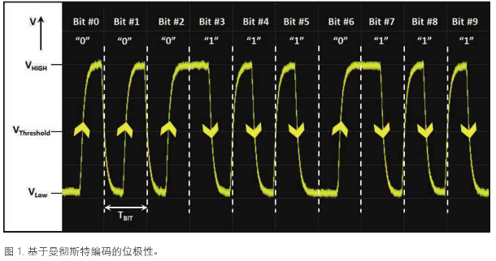

# 遥控滚动码

普通汽车遥控钥匙通常采用下列特征：
- ASK 方式进行调制
- 315MHz or 433 MHz ，使用示波器FFT功能可探测

将ASK调制信号获得后，可以按照曼彻斯特解码的设定，进行遥控钥匙的解码。

例如：按一下开锁键，遥控钥匙发送4段信号，第一段为唤醒同步数据包；第二～四发送的基本相同

每按一次，发射的信号都是不一样的，这通常是采用了滚动码技术。这是RKE（remote keyless entry）系统中作为身份验证的一种方法。

## 概念

滚动码的定义：
- 编码器检测到按键输入，把系统从省电状态中唤醒，同步记数加1；
- 与序列号一起经密匙加密后形成密文数据，并同键值等数据发送出去；
- 由于同步计数值每次发送都不同，即使是同一按键多次按下也不例外；
- 同步计数自动向前滚动，发送的码字不会再发生。因此被称为滚动码。

当按下钥匙按键时，钥匙会同时发射滚动码和按键指令；汽车里有和钥匙保持同步的滚动码，汽车收到匹配的滚动码时，就会响应相应的按键指令，反之，就不响应。当在远离汽车的地方按几次遥控钥匙，其滚动码就会和车内的不同步，为了避免这种问题，汽车允许接受当前码之后的一定数量的码（一百多次或者几百次）。但是当在远离车子的地方多次按下遥控钥匙的键位，钥匙可能就会和车子失去同步而不能正常使用。

除了汽车钥匙解码方案外，是德科技示波器针对汽车行业还有更多更全面的测试方案哦，比如最常用的 CAN、CAN-FD、LIN 总线解码，FlexRay 解码及一致性测试，最新的 CXPI 解码，针对汽车内传感器通信的 PSI5 解码，用于汽车导航和音影设备的 MOST 一致性测试方案，以及最近随着智能汽车最为火热的 BroadR-Reach（汽车以太网）一致性测试方案等。

### 曼彻斯特编码
少部分汽车钥匙采用了FSK，大部分都采用了曼彻斯特编码的ASK。

采用曼彻斯特编码时，位周期中点附近的位跳变决定了发射和接收位的极性。位周期中间的上升跳变/边沿通常对应逻辑“0”，位周期中间的下降跳变则对应逻辑“1”。

## 信号捕获
可以使用HackRF+URH

如果使用URH捕获，可以在设置好频率后，将sps 设置为8M，带宽设为4～8MHz

