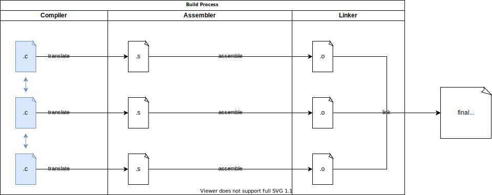

# 嵌入式系统安全与信任域

> source: https://embeddedsecurity.io/


这部文档的目的在于提供关于嵌入式系统安全的初学者资源。

主要内容包括：
- 固件二进制如何Build，包括了C基础和链接脚本如何工作
- ARM M-profile 架构概要和基于Arm M-profile的实现
- TrustZone-M
- 嵌入式协议
- 硬件Hacker工具

下面进入第一部分： Arm M-Profile 架构、TrustZone-M和固件二进制

## 嵌入式C语言

当前大部分嵌入式系统固件使用C语言编写。最近，Rust在嵌入式开发中呈现上升趋势，但主要还是用C。为了逆向工程和理解固件，有必要理解一些C的基本概念。

### 通用词汇和概念


下图显示了固件构建的基本过程：



上图显示了3个基本过程：
- compile
- assemble
- link
#### scope 作用域
在这里，用 object 表示C语言中的一个数据存储区域，它可能是 functions、enums、structs等等，他们需要使用一个标识符 identifier来引用。每个 identifier 有一个scope，他表示在源代码中的该标识符的可见范围（全局、局部）。

C有不同类型的scopes：
- block scope
- file scope
- function scope

```c
int a; // scope : file

static int b; //scope :file

void main(int argc, int argv[]){ // argv、argc ： function scjope
    int a; // scope : block
}
```
#### 链接范围、存储周期
为了影响某个object的可见性和生命期，你可能要改变它的存储类 storage class，有两类 storage class specifiers，他影响两类属性：linkage 和 storage duration：
- extern： external linkage，static duration
- static： internal linkage， static duration

静态生存期（static duration） 意味着，变量在整个程序生命期存在。所有被声明为 static 或 extern 的变量都有 static storage duration。

Likage 意味着变量可被用于别的scopes：内部 linkage 意味着变量可能被用于所有当前 translation 单元的所有 scopes。外部 linkage 以为着变量能够被别的translation 单元所使用。

例如：
```c
static int a;  // storage duration: static, linkage: internal
extern int b;  // storage duration: static, linkage: external
int c; // storage duration: static, linkage: external


void main(void){
  static int d; // storage duration: static, linkage: no linkage
  extern int e; // storage duration: static, linkage: external
  int f; // local only
}
```

C 语言中，默认文件scope标识符为外部可链接、静态存储生命期。
#### state
标识符可能有3中不同状态（State）：
- declared 声明的
- defined 定义的
- initialized 初始化的


下面，我们看一下这些属性如何被一个编译器实现？ State、storage duration、linkage都影响着某个object在内存中的存储形式。
#### Section
为了阐述这个问题，需要知道一个概念：Section，一个 section 表示内存中的一片区域。这个区域可能存放 data、instructions。 

Sections 用在可重定向目标文件和可执行文件中，来自一个翻译单元的所有机器代码和数据都以可重定位目标文件的部分结尾。 在链接阶段，
#### Symbol

在汇编器中，Symbols 作为不同类型符号的统称（an umbrella term):
- directive
- assembly instructions
- labels

仅有一部分来自sumbols的汇编器将被放到对象文件的symbol表中。


symbols的类型由特定字符决定：
- 一个在symbol前面的 “."，决定了这个symbol是一个指令（directive）
- 一个跟随着symbol的“：”，定义了一个 lable。

```s
label1:                     ; this is a label
  .word variable1           ; this is the directive .word, defining a variable
  add R1, #1                ; this is an assembly instruction
```

使用UML图表示Symbol组成：


#### Statement 语句
这里再提一个随后出现的概念：Statements，它是由一些可选的label和一个指令或一个汇编指令构成的。

#### ELF file

下面先给出一个ELF文件的概要解释图：


一个ELF文件的生命中，有2个重要任务组成：
- 在build过程中的结构数据和机器代码，这是build过程link步骤特别重要的
- 用于执行的结构数据和机器码

这些任务可以用两个views来表达：
- execution view
- linking view


除了ELF header 本身，目标文件的所有信息在一个section 中。一个section 可以是空的（无数据）。所有的sections 有一个section header。

#### Segment

一个Segment是一个或多个sections的集合，并且每个segment都有一个程序头 progaram header。 segment header 定义了执行这个ELF文件的元数据。从linking 视图看，Segments之间是无关的。

#### 三种类型的目标文件

- reloacatable object file 重定位目标文件：保存了代码和数据，适合与别的目标文件进行linking
- executable object file 可执行对象文件：链接多个重定向文件的结果
- shared object file：共享目标文件（类似于共享库）

目标文件的类型，在ELF header中标示。

#### ELF file header

ELF header 包含了对其他部分的引用，例如 section headers 和 program headers。


下面列举几个重要的组成：
- 类型（e_type):指定了上面介绍过的三种object file 类型：
  - ET_REL : 重定向
  - ET_EXEC：可执行
  - ET_DYN：共享

- 入口点（e_entry)：制定了一个目标文件的开始执行位置。仅用于 ET_EXEC 。
  - 如果地址的bit[0] 为1，表示入口点包含 Arm Thumb code；0 意味着 Arm code。
- Details for finding the section header table: offset (e_shoff) and number of entries (e_shnum).
- Details for finding the program header table: offset (e_phoff) and number of entries (e_phnum).

下面是一个重定向目标文件例子：

```s

ELF Header:
  Magic:   7f 45 4c 46 01 01 01 00 00 00 00 00 00 00 00 00 
  Class:                             ELF32
  Data:                              2's complement, little endian
  Version:                           1 (current)
  OS/ABI:                            UNIX - System V
  ABI Version:                       0
  Type:                              REL (Relocatable file)
  Machine:                           ARM
  Version:                           0x1
  Entry point address:               0x0
  Start of program headers:          0 (bytes into file)
  Start of section headers:          1008 (bytes into file)
  Flags:                             0x5000000, Version5 EABI
  Size of this header:               52 (bytes)
  Size of program headers:           0 (bytes)
  Number of program headers:         0
  Size of section headers:           40 (bytes)
  Number of section headers:         10
  Section header string table index: 9
```

下面是一个可执行目标文件例子：
```s
ELF Header:
  Magic:   7f 45 4c 46 01 01 01 00 00 00 00 00 00 00 00 00 
  Class:                             ELF32
  Data:                              2's complement, little endian
  Version:                           1 (current)
  OS/ABI:                            UNIX - System V
  ABI Version:                       0
  Type:                              EXEC (Executable file)
  Machine:                           ARM
  Version:                           0x1
  Entry point address:               0x20000001
  Start of program headers:          52 (bytes into file)
  Start of section headers:          132028 (bytes into file)
  Flags:                             0x5000200, Version5 EABI, soft-float ABI
  Size of this header:               52 (bytes)
  Size of program headers:           32 (bytes)
  Number of program headers:         2
  Size of section headers:           40 (bytes)
  Number of section headers:         10
  Section header string table index: 9
```


#### ARM 指令集

ARM 处理器有两种不同指令集：
- 大一些的叫 ARM
- 小一些的子集叫 Thumb

为了区别这两类指令集，地址的bit[0] 用于区别他们。
- 大一些的叫 ARM ，bit[0] = 0
- 小一些的子集叫 Thumb ,bit[0] = 1

上面的例子，入口点地址 Entry point address: 0x20000001，最低位为1，所以是ARM Thumb指令集。编译器通过 .thumb 指示这一点。

例如：

```s
  .thumb
    .thumb_func
    .fpu softvfp
    .type   main, %function
main:
   ...
```

ELF 文件的最前面几个字节是魔术字（e_ident）：
- Byte 5 编码决定了数据是 Little Enddian or Big
  - e_ident[5] = 1  Little
  - e_ident[5] = 2 Big


#### program headers
下面是program headers：

```s
Program Headers:
  Type           Offset   VirtAddr   PhysAddr   FileSiz MemSiz  Flg Align
  LOAD           0x010000 0x01000000 0x01000000 0x0009c 0x000a4 RWE 0x10000
  LOAD           0x020000 0x20000000 0x20000000 0x00016 0x00016 R E 0x10000
```

上面是两个头，一个被加载到地址 0x010000；另一个在 0x020000。第一个是 RWE ，即可读可写可执行；第二个是可读可执行。 如果我们深度查看linker scripts，我们将能够看到 segments和属性的制定。

#### symbols
符号是一个非常中心的概念。他们基本上是目标文件中数据和代码的 names 或 references。他们被用在build 过程的每一步中。

##### ELF 文件symbol
ELF 定义了一个 symbol table，它将所有的符号存放在一个list中。每个symbol 有一个binding，它表达了他目标文件水平上，C语言中的可见性。

列举二进制文件中symbols的linux命令有：
- nm
- arm-none-eabi-nm
- readelf -s 
- arm-none-eabi-readelf


例如使用nm命令:
- 小写的表示 local symbol，大写的表示 global symbol。
- U/u 表示未定义
- T/t 表示 text section
- D/d 表示 data section
- B/b 表示 bss section

编译指令：

`arm-none-eabi-gcc -c -mcpu=cortex-m33 -Os -nostdlib main11.c`

源文件：
```c
int global_linkage_file_scope_var = 1;
extern int extern_file_scope_var;
static int static_file_scope_defined_var = 3;

extern int extern_function(int p1);

int main(){
  return extern_function( extern_file_scope_var) + extern_function(static_file_scope_defined_var);
}
```

目标文件 arm-none-eabi-nm main11.o 的symbol tables:

```s
Symbol table '.symtab' contains 15 entries:
   Num:    Value  Size Type    Bind   Vis      Ndx Name
     0: 00000000     0 NOTYPE  LOCAL  DEFAULT  UND 
     1: 00000000     0 FILE    LOCAL  DEFAULT  ABS main11.c
     2: 00000000     0 SECTION LOCAL  DEFAULT    1 
     3: 00000000     0 SECTION LOCAL  DEFAULT    2 
     4: 00000000     0 SECTION LOCAL  DEFAULT    3 
     5: 00000000     0 SECTION LOCAL  DEFAULT    4 
     6: 00000000     0 NOTYPE  LOCAL  DEFAULT    4 $t
     7: 00000018     0 NOTYPE  LOCAL  DEFAULT    4 $d
     8: 00000000     0 NOTYPE  LOCAL  DEFAULT    2 $d
     9: 00000000     0 SECTION LOCAL  DEFAULT    6 
    10: 00000000     0 SECTION LOCAL  DEFAULT    7 
    11: 00000001    28 FUNC    GLOBAL DEFAULT    4 main
    12: 00000000     0 NOTYPE  GLOBAL DEFAULT  UND extern_function
    13: 00000000     0 NOTYPE  GLOBAL DEFAULT  UND extern_file_scope_var
    14: 00000000     4 OBJECT  GLOBAL DEFAULT    2 global_linkage_file_scope
```

readelf 可以显示更多的symbols， 例如每个 section 的debug symbols。nm 不能显示没有 flags 的符号。

- 有 external linkage的 objects，例如： global_linkage_file_scope_var 和 extern_file_scope_var 有全局绑定。
- functions 有全局绑定，包括 extern refernced (extern_function )和已定义的（main）。

extern functions 和 objects 有一个自定义的Ndx 值，他是 section index。他告诉 linker 来解析依赖并插入来自其他object 文件的符号地址，这些外来符号是以定义的符号。

symbols table 是ELF文件中的有明确结构的section，它的 sh_name:.symtab, sh_type:SHT_SYMTAB ，ELF 保存了符号表入口结构数组：Elf32_Sym 。下面列出了这个结构的成员子集：
- st_name : name of symbol
- st_value : 上下文依赖
- st_info : 定义的绑定和符号类型。 st_info 是一个bitfield， 有4个重要的为位，ELF32_ST_BIND 和 较低的符号类型 ELF32_ST_TYPE。
- STB_LOCAL : 本地符号是仅在该符号定义的 object 文件内可见。这些符号会在重定向或可执行目标文件的符号表里列出。同样的名字可能出现在多次。
- STB_GLOBAL : 全局符号可在多目标文件中可见，能够满足别的目标文件。名字必须是唯一的。
- STB_WEAK : 这类符号是全局符号，但优先级低于STB_GLOBAL.
- ELF32_ST_TYPE
  - SST_NOTYPE 	The type is not specified 	0
  - STT_OBJECT 	Data object: array, variable,… 	1
  - STT_FUNC 	A function. 	2
  - STT_SECTION 	A section. 	3
  - STT_FILE 	The source files name 	4

在重定向object文件，st_value 是距当前 section 开始位置的偏移量。可执行的或共享的对象文件，st_value 保存了符号的虚拟地址。
##### 汇编器符号
下面我们看在汇编阶段定义的符号。为了观察这些符号，我们使用上面的源代码，然后用下面编译命令。

编译命令：`arm-none-eabi-gcc -S -mcpu=cortex-m33 -Os -nostdlib main11.c`

输出如下：

```s
        .cpu cortex-m33
        .eabi_attribute 20, 1
        .eabi_attribute 21, 1
        .eabi_attribute 23, 3
        .eabi_attribute 24, 1
        .eabi_attribute 25, 1
        .eabi_attribute 26, 1
        .eabi_attribute 30, 4
        .eabi_attribute 34, 1
        .eabi_attribute 18, 4
        .file   "main11.c"
        .text
        .section        .text.startup,"ax",%progbits
        .align  1
        .global main
        .arch armv8-m.main
        .arch_extension dsp
        .syntax unified
        .thumb
        .thumb_func
        .fpu softvfp
        .type   main, %function
main:
        @ args = 0, pretend = 0, frame = 0
        @ frame_needed = 0, uses_anonymous_args = 0
        ldr     r3, .L2
        push    {r4, lr}
        ldr     r0, [r3]
        bl      extern_function
        mov     r4, r0
        movs    r0, #3
        bl      extern_function
        add     r0, r0, r4
        pop     {r4, pc}
.L3:
        .align  2
.L2:
        .word   extern_file_scope_var
        .size   main, .-main
        .global global_linkage_file_scope_var
        .data
        .align  2
        .type   global_linkage_file_scope_var, %object
        .size   global_linkage_file_scope_var, 4
global_linkage_file_scope_var:
        .word   1
        .ident  "GCC: (GNU Tools for Arm Embedded Processors 9-2019-q4-major) 9.2.1 20191025 (release) [ARM/arm-9-branch revision 277599]"
```


上面像 main： 这样的label，或 global_linkage_file_scope_var: 

# references
- [ARM GNU Toolchain](https://developer.arm.com/Tools%20and%20Software/GNU%20Toolchain)