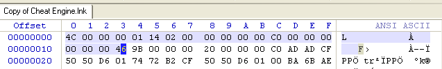
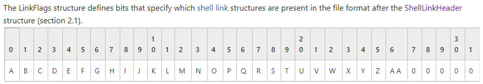
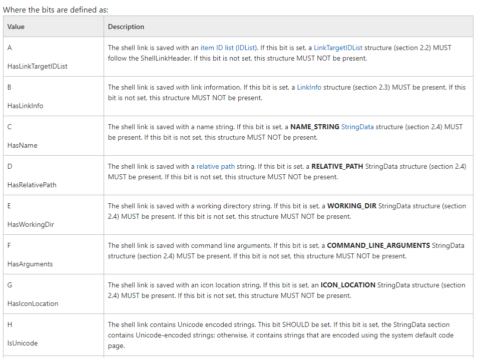
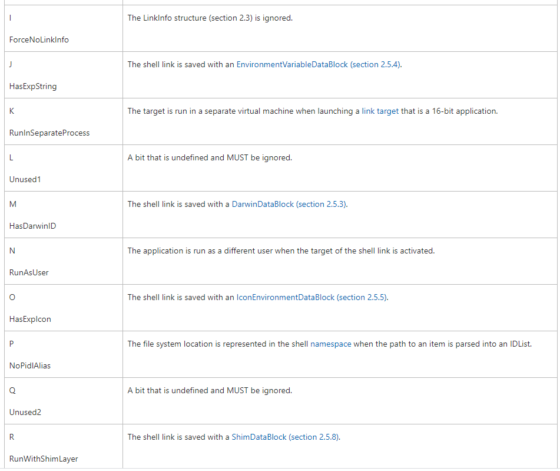
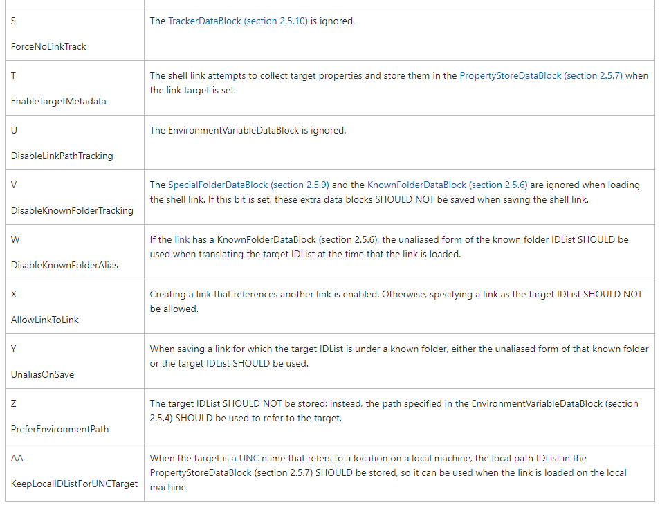

# LNK 样本载荷

在windows中，后缀名为.lnk的文件是 shell link 二进制文件。也成为 shortcut 文件。shell link文件作为一种数据对象，其中包含了用于访问另一个数据对象的信息。此类文件可用于：
- 支持文件启动
- 链接某个文件
- 引用某个目标文件

LNK文件中存放了以下类型的信息：
- 用于启动某个应用的键盘快捷键信息
- 描述性的注释
- 控制应用行为的设置
- 可存储在额外数据节中的数据。

LNK文件可以使用一个COM对象管理，编程使用 IShellLink 接口，保存成持久化格式时可以使用IPersistStream或IPersistFile 接口。
以 *.lnk 为载体的恶意样本屡见不鲜。例如：U盘蠕虫对U盘文件进行伪装、邮件中传递的lnk文件。

此类文件有自动隐藏.lnk后缀名，从而展现伪装的后缀名以欺骗目标，从而实现伪装。

## LNK 文件格式

Shell Link 文件格式由一系列遵循ABNF规则（RFC5234）的结构组成:

```SHELL_LINK = SHELL_LINK_HEADER [LINKTARGET_IDLIST] [LINKINFO] [STRING_DATA] *EXTRA_DATA```

- SHELL_LINK_HEADER，即头部结构，包含了标识信息、时间戳、用于指定可选结构的标志位。
- LINKTARGET_IDLIST，是一个可选的 ILinkTargetIDList 结构，指定了链接的目标。这个部分通过在头部标志为中设置HasLinkTargetIDList 标准位确定。
- LINKINFO，一个可选的LinkInfo结构，指定了解析链接目标的必要信息。这个选项通过 HasLinkInfo 标志位确定。
- STRING_DATA，0或多个可选的StringData结构可用于传递用户接口和路径标识信息。
- EXTRA_DATA，0或多个 ExtraData 结构

详细信息参考微软官方[MS-SHLLINK](https://docs.microsoft.com/en-us/openspecs/windows_protocols/ms-shllink/16cb4ca1-9339-4d0c-a68d-bf1d6cc0f943)文档


文件头lnk file header结构，这里记录了比较重要的文件信息，无论是恶意代码的感染还是用于检测，都需要对该结构有所了解，下面是文件头结构参考数据。

```
Offset Size/Type Description

0x00 1 dword 总是为0000004CH，相当于字符"L"，用于标识是否是个有效的.lnk文件。
0x04 16 bytes GUID，标识.lnk的唯一标识符，不排除以后MS对该字段有所修改。
0x14 1 dword *重要,Flags用来标识.lnk文件中有哪些可选属性，也就是哪些节是可选的。
0x18 1 dword 目标文件属性（是否只读、隐藏、系统文件、加密、临时...）
0x1c 1 qword 文件创建时间
0x24 1 qword 文件修改时间
0x2c 1 qword 文件最后一次访问时间
0x34 1 dword 目标文件长度
0x38 1 dword 自定义图标个数
0x3c 1 dword 目标文件执行时窗口显示方式（1-正常显示，2-最小化，3-最大化）
0x40 1 dword 热键
0x44 2 dword 该字段未知，常为0
```

偏移0x14处的值含义：

|bit| 该bit置1|
|-|-|
|0| 包含shell item id list节，通过修改文件过滤掉该节，不影响.lnk执行目标文件，但影响其它功能。|
|1 |指向文件或文件夹，如果此位为0表示指向其他。|
|2 |存在描述字符串|
|3 |存在相对路径|
|4 |存在工作路径|
|5 |存在命令行参数|
|6| 存在自定义图标 *--> 该位置一般用于病毒判断是否感染目标文件的标志.|




前20字节固定不变。

### LinkFlags
参考微软官方文档，可知shell link 文件的标准位信息如下：



各标志位的具体含义如下：





## 迷惑性SHELL link（图标修改）

- 首先生成一个正常的LNK文件
- 修改其图标为```%SystemRoot%/System32/SHELL32.dll```中的任意一个
- 然后用010 editor打开该LNK文件，找到```String_Data```部分的```ICON_LOCATION```字符串，将其修改为```./1.pdf```(unicode)，其长度为0x07.

效果是这个link将被认为是链接到一个pdf文件，根据系统默认打开pdf文件的默认应用不同，其图标也会不同。

## 修改target

假设原始目标为```%windir%\System32\calc.exe```

现在修改为 ```EnviromentVariableDataBlock```中的```TargetAnsi```及```TargetUnicode```，将其内容修改为```%windir%/system32/wait.exe```，这是一个不存在的exe文件。

这时双击此link文件会报错。

我们再修改 ```LinkTargetIDList```中第5个ItemID：由wait改为calc，那么双击后就会弹出计算器。

## 扩展

