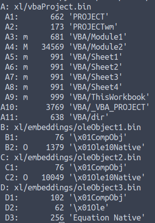
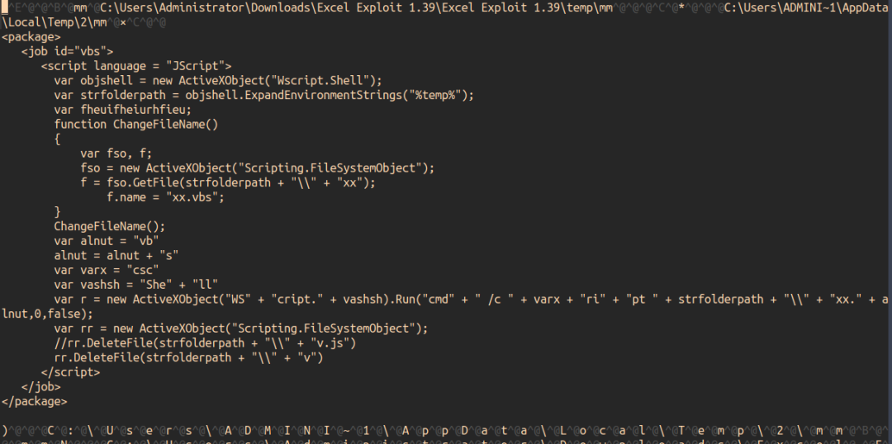

# OFFICE 恶意代码分析

## 工具篇

### RTFDUMP.PY

Didier Stevens提供，此工具可以用来分析rtf文件：
- 文件的各个组成部分
- 运行后被包含和使用的各个对象
- 提供了选择特定节的方法（-s），例如```python rtfdump.py -s 2 -H  mal1.doc```


建议从“体型”较大的对象开始调查，换句话说，从字节数较多的对象开始入手。根据个人经验，EquationEditor通常是一个危险的标志。因为攻击者经常利用CVE-2017-11882来运行特定的shellCode。

### xorsearch

可用以发现某些编码模式，例如使用XOR/ROL/SHIFT进行加密。

>XORSearch是一个在XOR、ROL、ROT或SHIFT编码的二进制文件中搜索给定字符串的程序。对于使用XOR算法编码的二进制文件来说，通常会用一个常量值（密钥）对某些（或所有）字节执行XOR运算。对于使用ROL（或ROR）编码的文件来说，其字节被循环移位一定数量的位数（密钥）。而使用ROT编码的文件中的字母字符（A-Z和a-z），被循环移位了一定数量的步数。SHIFT编码文件的字节向左移动一定数量的位数（密钥）：第一个字节的所有位向左移动，第二个字节的MSB变成第一个字节的LSB，第二个字节的所有位向左移动，......XOR和ROL/OR编码经常被恶意代码开发者用来混淆像URL这样的字符串。

例如，发现了文件中存在equantioneditor，可以将equationeditor所在节转储到一个外部文件中，然后用xorsearch进行分析。

运行xorsearch后，会提供许多偏移量，使我们有更大的机会发现控制权的变化情况。换句话说，如果我们从这些偏移量处运行shellcode的话，可以避免执行未对齐的指令。

### scDbg

ShellCode调试器。

运行该软件后(下图显示了其GUI)，你需要从xorsearch.exe给出的偏移量处运行模拟器，就本例来说，该偏移量为0x2c74c。在此，建议勾选“Unlimited steps”功能，这样的话，模拟器就能够在不停止shellcode的情况下进行跟踪；同时，我们还建议勾选“Reporting Mode”，这样你就可以在执行结束时看到一个摘要视图。


在偏移量0x2c74c处运行scDbg。

运行结果如下所示： 


有时候，攻击者会使用不同的系统调用：ExpandEnvironmentStringsW，它并非scDbg所hooked的函数。在这种情况下，您可能需要打开“刚刚转储的文件”，并通过将字符串ExpandEnvironmentStringsW替换为字符串ExpandEnvironmentStringsA来修补二进制文件。完成该操作后，将shellcode的修补版本重新加载到scDbg中并重新运行它，这样能获得更好的结果。

### oleid

为了分析已加密office文档，可以运行oleid查看状态，然后寻找密钥。


由于宏病毒要运行文件，所以必然知道密钥，所以有可能在二进制内容中找到密钥。

>原文：这种保护措施乍一看似乎比较可靠，但详细分析后发现，用于加密文档的密钥，并不是用户输入的密码（或其哈希值），而是存储在MS Excel程序代码中的一个固定密钥。这个密钥是由密码“VelvetSweatshop”生成的。这真是太搞笑了！大家可以尝试用该密码来保护一个MS Excel文档(或者用这个密码打开一个文档)。最令人惊讶的是，打开文档根本就不需要密码。


### msoffcrypto-crack.py
该工具可用于寻找密钥。


一旦找到了“加密密钥”，你可以直接解密文件内容了（使用同样的工具，即msoff-crypto-crack.py），以明文方式保存，然后，运行oledump.py处理该文件。这时，你应该可以看到正常的对象内容了。就本例来说，多用了一个Equation Editor。让我们转储它（oledump.py）。

### oledump.py

该工具用于转储ole二进制内容。

下图是“没有VBA宏的Equation Editor”：


运行命令：```python3 oledump.py -s B2 -d cracked.xlsx > out_b2.bin```

现在，让我们看看xorsearch.exe是否找到了常见的控制流模式！如果找到了的话，请使用scDBG.exe进一步分析。


分析恶意Office文档时，经常会文档中遇到VBA宏。这时，我们可以通过运行Oledump.py，检查各种VBA内容（宏所在的M标签），并将重点放在最“胖”的内容上。换句话说，强烈建议从内容较多的地方开始着手（因此，就下图来说，我们可以从A11处着手调查，因为它的字节数最多），因为这些地方最有可能找到我们感兴趣的IoC。


### olevba

该工具可以模拟VBA引擎，从而运行宏脚本。


这个仿真引擎会一直运行，直到一个已知函数到达终点为止。


有时你会打开一个恶意的MS Excel电子表格，但是里面并没有包含MACRO代码。这种技术为攻击者提供了一种简单可靠的方法，使他们能够在目标网络上站稳脚跟，因为它只是滥用了Excel的合法功能，并不依赖于任何漏洞或exploit。它只是一个“古董级”的功能特性（几乎有30年历史），只是近几年才开始被攻击者所利用。关于这种类型的攻击的缓解措施，可以访问这篇文档。  


通过运行OLEVBA，你就可以检查它是否发现了我们感兴趣的东西。就上图来说，它指出该文档应用了XLM Excel 4。当然，用于去混淆并进行分析的工具有许多，有的功能很简单，有的则非常复杂。XLMDeobfuscator用起来非常顺手，所以，下文中我们将以它为例进行介绍。


在未启用宏的情况下打开恶意文件，打开宏编辑器，复制以下脚本并保存，然后，在启用宏的情况下重新打开该文件。

```vb
Sub ShowAllSheets()
    Dim sh As Worksheet
    For Each sh In ActiveWorkbook.Sheets
    sh.Visible = True
    Next
    End Sub
```

如果由于宏被执行而无法打开恶意文件，并且也无法控制执行流程的话，则可以打开另一个工作表，打开VBA编辑器，并按以下方式直接用VBA“导入”恶意文档：

```vb
Public Sub Convert_XML_To_Excel_From_Local_Path()
    Dim xml_File_Path As String
    Dim wb As Workbook
   
    'Load XML Data into a New Workbook - Code from Officetricks.com
    Application.DisplayAlerts = False
     xml_File_Path = "c:/FileToOpen.xlm"
     Set wb = Workbooks.OpenXML(Filename:=xml_File_Path)

    'Copy Content from New workbook to current active Worksheet
     wb.Sheets(1).UsedRange.Copy ThisWorkbook.Sheets(Sheet2).Range(A1)
    
     'Close New Workbook & Enable Alerts
     wb.Close False
     Application.DisplayAlerts = True
End Sub
```

这样，您就可以看到隐藏的工作表或隐藏的单元格了。这里还有一个小技巧，为了快速找到有内容的单元格，可以搜索=，具体如下图所示。

现在，通过选中左上角的方框（即下图中BG35344），就可以看到哪里是起点。在这个文件中，Auto_Open是第一个被调用的函数，你可以在那里找到它的引用。然后，您可能会看到使用了两种主要格式：FORMULA和GOTO。 


这时，您能够以受控的方式执行MACRO 4，从而为XLM去混淆。为此，您可以删除最后一个GOTO，这样就不会把控制流交给去混淆的MACRO，而是停止它们（用HALT代替最后一个GOTO），这样，就可以看到用于该工作表的、经过去混淆处理的代码了。


有时你可能会发现许多.csv文件。这时，可以将其导入到Microsoft Excel中，使其变成“真正的”的Ole文件。事实上，通过OleDump处理攻击者精心制作的csv文件时，有可能会发现一些有趣的事情，比如CSV文件中包含VBA代码或Object。例如，对于sha-256为d5db2034631e56d58dffd797d25d286469f56690a1b00d4e6a0a80c31dbf119e的样本来说，你可能会发现下面的东西（如果用普通的编辑器打开该样本的话，它看上去就是一个正常的文本，并且以逗号为分隔符）。但是，如果通过OleDump打开它的话，则会找到一些可疑的东西。



接下来，您既可以转储代码并进行手动分析，也可以通过代码仿真器进行分析。通过对CSV运行OleVBA，你会发现许多有趣的指标（请看下图）。例如，该工具指出，一旦用Microsoft excel打开该文档，它就会调用AutoExec。此外，还有许多可疑的调用会被执行，如exec、run；此外，一些hex-base64字符串还应用了混淆技术。在这次运行中，它甚至能够解码这些的字符串，并识别IoC，如URLs和文件名。


如果代码仿真器行不通的话，你还可以使用OleDump转储整个代码。一旦转储了代码，就可以通过调试器来分析代码；如果代码未经混淆处理的话，则可以直接读取。



### XLMDeobfuscator

XLMDeobfuscator是@DissectMalware开发的一款优秀工具。它可以用来解码经过混淆的XLM宏（也就是Excel 4.0宏）。它利用内部的XLM模拟器来解释宏，而不需要完全执行代码。它同时支持xls、xlsm和xlsb格式。

此外，OleDump插件_biffis能够忽略每一个Excel单元格，并找到函数和公式。通过插件选项-x，它能够显示隐藏的宏XLM；而使用了插件选项-f，该插件将通过解释编码(如十六进制和base64)并打印相关字符串来找出外部链接。