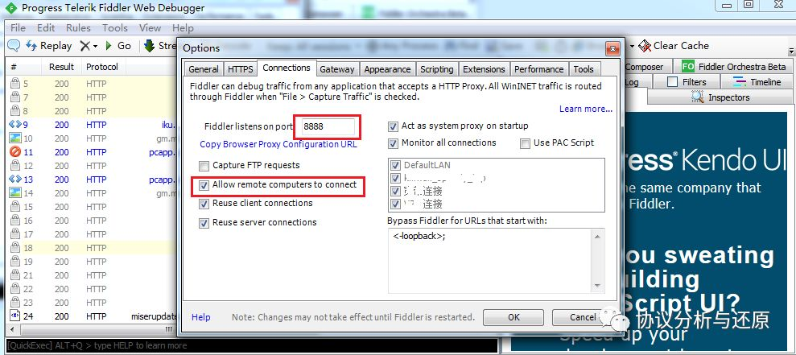
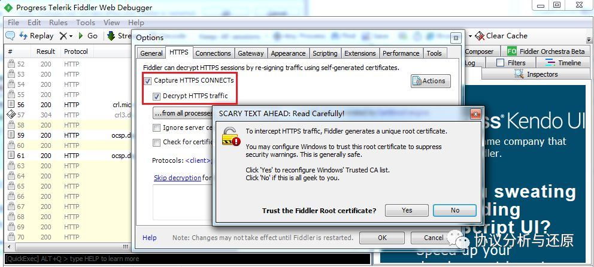
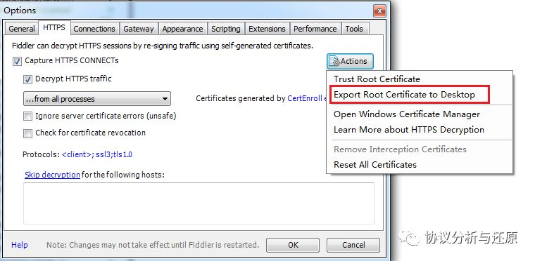
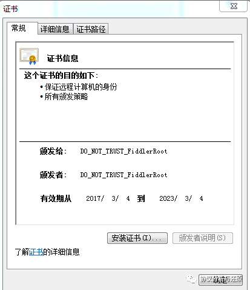
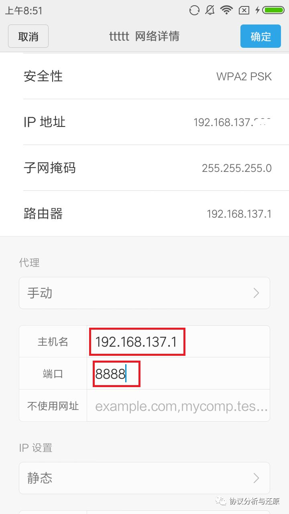
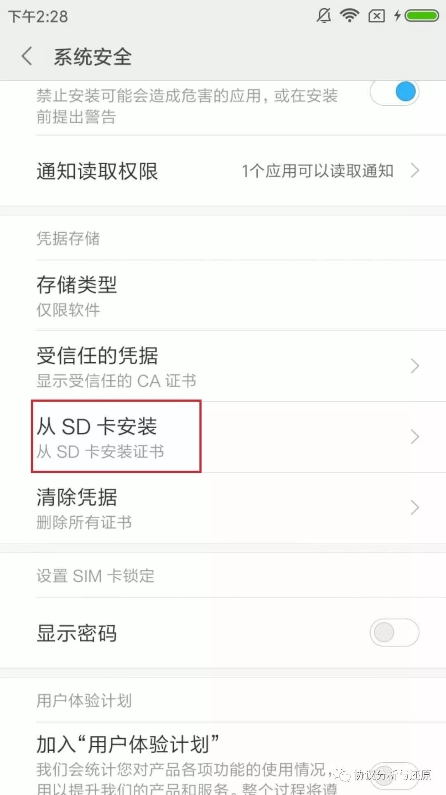
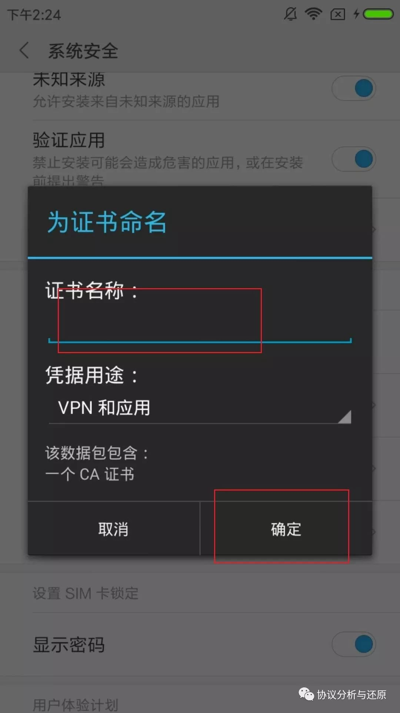
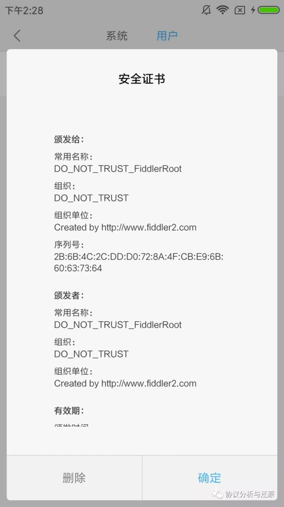
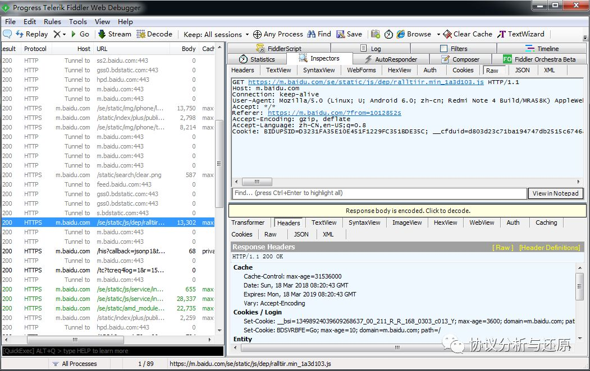

# 使用Fiddler抓取手机流量

Fiddler作为一个PC端的HTTP/HTTPS协议分析工具，不仅能够抓取PC上的流量，还能作为代理，抓取手机流量。

## 安装fiddler

## PC端配置

### 设置允许远程连接。

在fiddler界面中找Tools->Options菜单下，点击Connections页，设置监听端口号（默认8888，一般不用修改），并勾选“Allowremote computers to connect”。



### 设置监听协议

如果不需要抓取HTTPS报文，则此项设置可以忽略。Tools->Options菜单下，点击HTTPS页，可根据需要确定是否勾选“Decrypt HTTPS traffic”，会弹出对话框，点Yes即可。


### 导出Fiddler根证书

如果需要解手机端的HTTPS流量，则需要给手机端安装Fiddler的CA证书，这个证书可从Fiddler导出。



证书信息如下：



### PC端共享上网

需要在PC上进行手机抓包，必须使手机流量经过PC。

在windows操作系统下，确定电脑带无线网卡并且能正常上网。打开记事本，输入下面两行：

```bat
netsh wlan set hostednetwork mode=allow ssid=testwifi key=test12345678 keyUsage=temporary

netsh wlan start hostednetwork
```

然后另存为“启动免费wifi.bat”或者其它名字.bat。

注意：脚本中ssid= 和 key=后面分别是WiFi名称和密码。

保存后运行该脚本。现在，在、电脑右下角点网络图标，就会发现和上面ssid相同名称的无线网络了，你就可以用手机或其它无线设备连它上网了。

当然也可使用各种共享WiFi工具进行WiFi共享设置，或者使用路由进行共享上网，只需要手机报文经过开了Fiddler的PC即可，此处不作介绍。

## 手机端配置

### WiFi设置

手机端连接PC端共享出的WiFi，并设置代理，代理服务器为Fiddler所在PC的共享网卡的IP，一般wei代理服务器端口即为Fiddler内设置的8888端口。



### 安装CA证书

如果需要抓取HTTPS报文，则需要在手机上安装第一节中导出的Fiddler根证书。将证书传到手机，然后安装即可。

对Android而言，常用的CA证书安装方式，可从设置-->系统安全-->从SD卡安装证书进行导入。



导入证书会需要给证书命名，按要求输入即可：





在安装证书过程中如果需要设置锁屏密码等，设置即可。

安装之后，在设置-->系统安全-->信任的凭据中，用户子页面下，可以看到安装的证书信息：


点击可查看证书详细信息，当然，删除证书也是在这里进行：


到这里，在手机上的所有设置就全部完成了。


## 抓包分析

一切准备完毕，开启Fiddler抓包，使用手机上浏览器上网，看看是否有手机流量被抓到。




是不是很简单？流量中有很多信息有待你去挖掘。再打开你手机上安装的一些APP，是不是发现有很多APP其实都是走的HTTP或者HTTPS？如果在这些APP流量中发现了异常信息，欢迎联系本公众号进行分享。