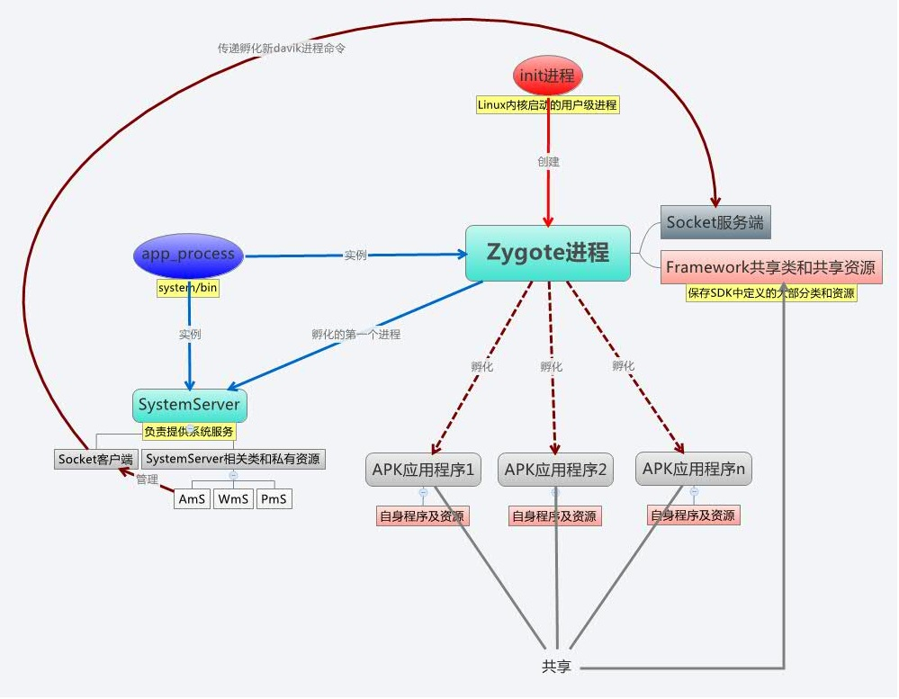
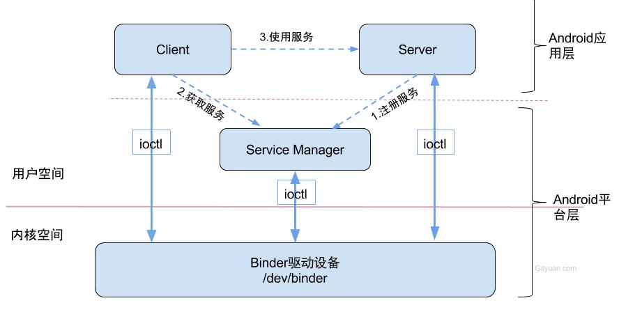
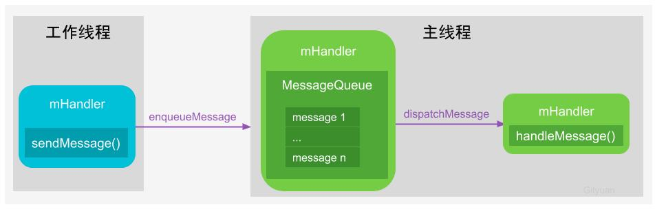
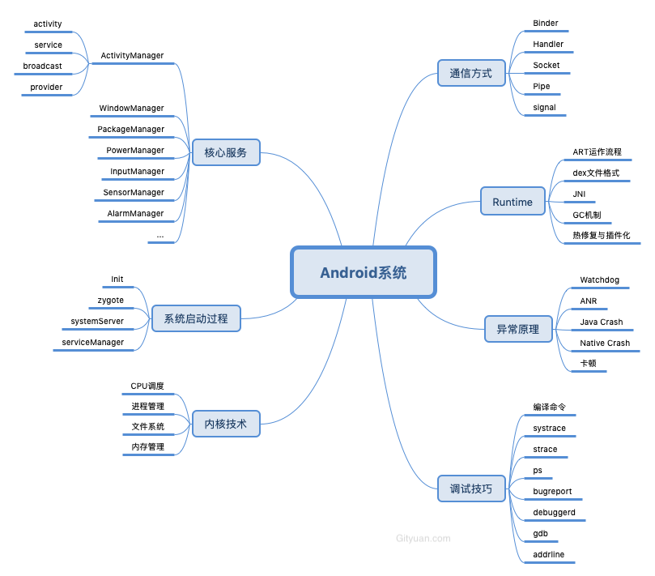
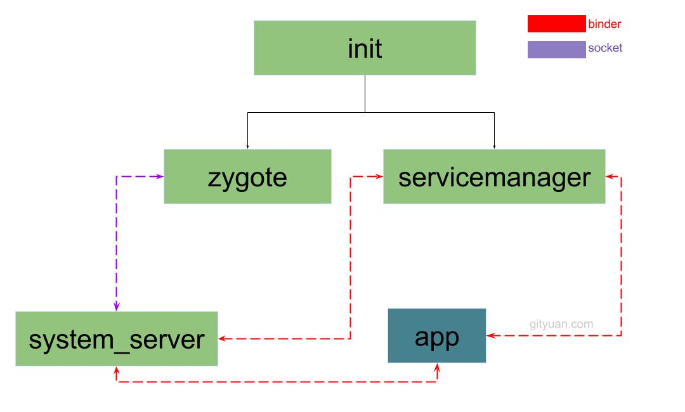
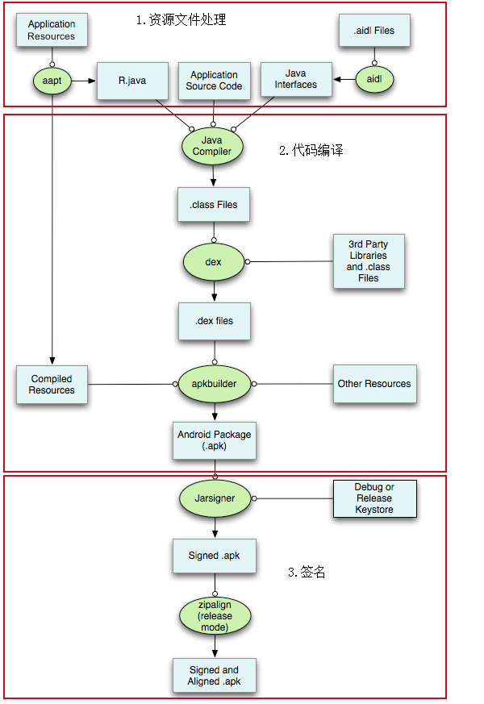
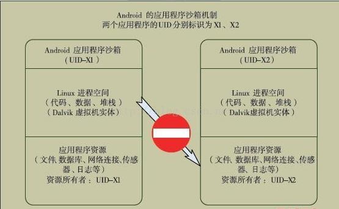
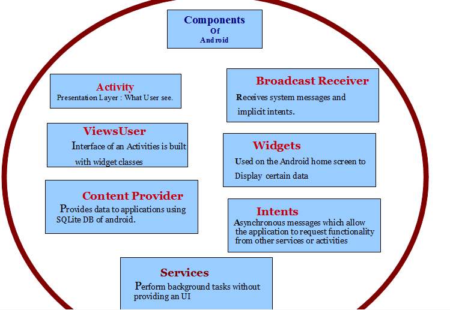
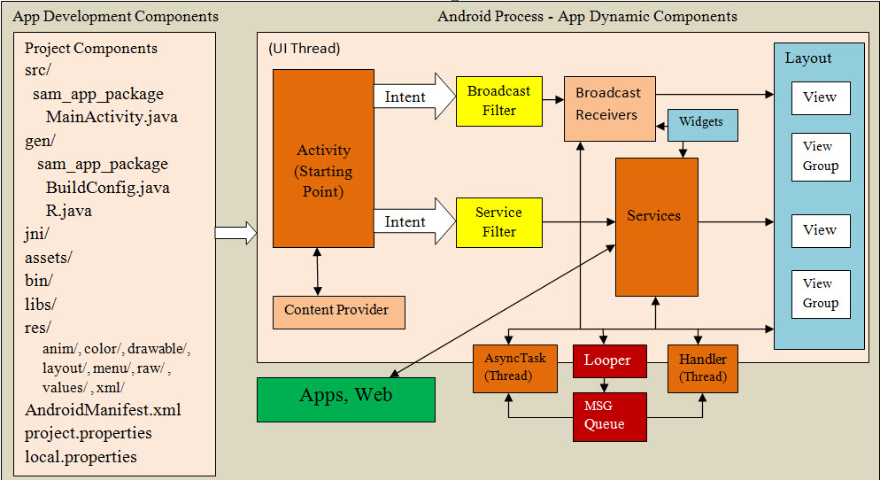

# Android 系统

## Android 概述

虽然Android系统非常庞大且错综复杂，需要具备全面的技术栈，但整体架构设计清晰。Android底层内核空间以Linux Kernel作为基石，上层用户空间由Native系统库、虚拟机运行环境、框架层组成，通过系统调用(Syscall)连通系统的内核空间与用户空间。对于用户空间主要采用C++和Java代码编写，通过JNI技术打通用户空间的Java层和Native层(C++/C)，从而连通整个系统。

为了能让大家整体上大致了解Android系统涉及的知识层面，先来看一张Google官方提供的经典分层架构图，从下往上依次分为Linux内核、HAL、系统Native库和Android运行时环境、Java框架层以及应用层这5层架构，其中每一层都包含大量的子模块或子系统。


上图采用静态分层方式的架构划分，众所周知，程序代码是死的，系统运转是活的，各模块代码运行在不同的进程(线程)中，相互之间进行着各种错终复杂的信息传递与交互流，从这个角度来说此图并没能体现Android整个系统的内部架构、运行机理，以及各个模块之间是如何衔接与配合工作的。

为了更深入地掌握Android整个架构思想以及各个模块在Android系统所处的地位与价值，计划以Android系统启动过程为主线，以进程的视角来诠释Android M系统全貌，全方位的深度剖析各个模块功能，争取各个击破。这样才能犹如庖丁解牛，解决、分析问题则能游刃有余。

早期android 4.0之前，android是基于linux 2.6.x，后来的4.0及更高基于的是linux 3.x
- android 1.5 —— linux kernel 2.6.27
- android 1.6 —— linux kernel 2.6.29
- android 2.0/2.1 —— linux kernel 2.6.29
- android 2.2 —— linux kernel 2.6.32
- android 2.3 —— linux kernel 2.6.35
- android 3.* —— linux kernel 2.6.36
- android 4.* —— linux kernel 3.0.1
- android 4.1/2 —— linux kernel 3.0.31

android的所有应用都在虚拟环境（Dalvik）下运行，简称DVM。从android 4.4版本后，另一个运行时称为 Android Runtime（ART）出现了，用户可以在DVM和ART之间进行自由切换。

DVM类似于JVM，主要是基于寄存器的特性。Dalvik 虚拟机执行一个 .dex 或可执行文件格式，使用adb可以进行交互。


## Android架构

Google提供的5层架构图很经典，但为了更进一步透视Android系统架构，本文更多的是以进程的视角，以分层的架构来诠释Android系统的全貌，阐述Android内部的环环相扣的内在联系。

系统启动架构图


图解： Android系统启动过程由上图从下往上的一个过程是由Boot Loader引导开机，然后依次进入 -> Kernel -> Native -> Framework -> App，接来下简要说说每个过程。

### Loader层

Boot ROM: 当手机处于关机状态时，长按Power键开机，引导芯片开始从固化在ROM里的预设代码开始执行，然后加载引导程序到RAM；

Boot Loader：这是启动Android系统之前的引导程序，主要是检查RAM，初始化硬件参数等功能。

### Linux内核层
Android平台的基础是Linux内核，比如ART虚拟机最终调用底层Linux内核来执行功能。Linux内核的安全机制为Android提供相应的保障，也允许设备制造商为内核开发硬件驱动程序。

#### 启动Kernel的swapper进程(pid=0)

该进程又称为idle进程, 系统初始化过程Kernel由无到有开创的第一个进程, 用于初始化进程管理、内存管理，加载Display,Camera Driver，Binder Driver等相关工作。

#### 启动kthreadd进程（pid=2）
这是Linux系统的内核进程，会创建内核工作线程kworkder，软中断线程ksoftirqd，thermal等内核守护进程。kthreadd进程是所有内核进程的鼻祖。

### 硬件抽象层 (HAL)
硬件抽象层 (HAL) 提供标准接口，HAL包含多个库模块，其中每个模块都为特定类型的硬件组件实现一组接口，比如WIFI/蓝牙模块，当框架API请求访问设备硬件时，Android系统将为该硬件加载相应的库模块。

### Native层（ Android Runtime & 系统库）
每个应用都在其自己的进程中运行，都有自己的虚拟机实例。ART通过执行DEX文件可在设备运行多个虚拟机，DEX文件是一种专为Android设计的字节码格式文件，经过优化，使用内存很少。ART主要功能包括：预先(AOT)和即时(JIT)编译，优化的垃圾回收(GC)，以及调试相关的支持。

这里的Native系统库主要包括init孵化来的用户空间的守护进程、HAL层以及开机动画等。启动init进程(pid=1),是Linux系统的用户进程，init进程是所有用户进程的鼻祖。

#### init 进程

init进程是一个由内核启动的用户级进程。内核自行启动（载入内存，开始运行，初始化设备驱动和数据结构）后，系统就通过启动一个用户级程序 init 方式来完成引导。

init进程的pid=1，大部分的服务都由它来启动，主要有3方面工作：
- 解析 init.rc 初始化脚本文件
- 初始化属性服务（property service）。
- 进入无限 for 循环，建立子进程，对关键服务的异常进行重启和异常处理。
  - init进程会孵化出ueventd、logd、healthd、installd、adbd、lmkd等用户守护进程；
  - init进程还启动servicemanager(binder服务管家)、bootanim(开机动画)等重要服务
  - init进程孵化出Zygote进程，Zygote进程是Android系统的第一个Java进程(即虚拟机进程)，Zygote是所有Java进程的父进程，Zygote进程本身是由init进程孵化而来的。


##### 初始化脚本init.rc 

init.rc 是一个系统自定义的脚本，其中操作包括：
- 启动一些系统开启需要启动的service的deamons（承载service的程序）
- 指定不同service在不同的用户或用户组下运行
- 修改设置全局的属性服务
- 注册一些动作和命令在特定的时间执行

##### 属性服务

类似于windows上的注册表，通过键值方式存储信息。例如：
- 内存映射
- 关键配置
- 网络接口配置
- 系统服务开关
- 安全配置
- 。。。

```shell
(base) PS C:\Users\leo\Downloads\root_tools\ADB> .\adb.exe shell
HWNXT:/ $ getprop |grep dns
[hw.wifi.dns_stat]: [15,5,27,1,113]
[hw.wifipro.dns_err_count]: [4,0,0,0,0,0]
[hw.wifipro.dns_fail_count]: [18]

HWNXT:/ $ getprop |grep service
[bastet.service.enable]: [true]
[drm.service.enabled]: [true]
[hwservicemanager.ready]: [true]
[init.svc.dpeservice]: [running]
[init.svc.gnss_service]: [running]
[init.svc.hal_gnss_service_1]: [running]
[init.svc.hisupl_service]: [running]
[init.svc.hwservicemanager]: [running]
[init.svc.logcat_service]: [stopped]
[init.svc.logctl_service]: [stopped]
[init.svc.mediacomm@2.0-service]: [running]
[init.svc.nfc_hal_ext_service]: [running]
[init.svc.restart_logcat_service]: [stopped]
[init.svc.servicemanager]: [running]
[init.svc.vndservicemanager]: [running]
[persist.service.hdb.enable]: [true]
[persist.service.tm2.tofile]: [false]
[ro.config.hw_smartcardservice]: [true]
[ro.hdmi.service]: [false]
[ro.property_service.version]: [2]
[ro.tui.service]: [true]
[ro.vr_display.service]: [true]
[service.bootanim.exit]: [1]
[service.sf.present_timestamp]: [1]
[system_init.hwextdeviceservice]: [1]

HWNXT:/ $ getprop |grep network
[gsm.network.type]: [Unknown,Unknown]
[ro.check.modem_network]: [true]
[ro.config.full_network_support]: [true]
[ro.config.networkmode_hide_dyn]: [true]
[ro.telephony.default_network]: [8]
HWNXT:/ $

```

#### 服务管理进程 ServiceManager

ServiceManager 在init进程启动后启动，用来管理系统中的Service，例如 Input Method Service，Activity Manager Service...

ServiceManager 有两个重要的方法：
- add_service
- check_service

系统服务通过add_service方法注册到 ServiceManager中，使用时通过check_service检查是否存在。

ServiceManager 主要做3件事：
- 打开 /dev/binder 设备，并在内存中映射一定的空间，例如128KB
- 通知binder设备，把自己变成context_manager
- 进入循环，不停读取binder设备，查看是否有对service的请求，若有就调用svcmgr_handler 回调处理请求

#### 系统库
这其中包含了一些重要的库：
- Surface Manager 管理窗口和屏幕
- Media Framework：允许各类型的编解码器来播放和记录不同的媒体
- WebKit：浏览器渲染引擎
- OpenGL：在屏幕上正确显示2D或3D内容。

这些库很多是C/C++写的，从Linux移植而来。主要区别是：android 里没有libc库（用于linux大多数任务），而是有bionic库，可以认为他是改造过的Android里的libc。


#### 运行时

Android运行时，也称为Dalvik 虚拟机和组件。
### Framework层


#### Zygote进程
Zygote 是在设备开启的时候initi东的一个进程。因为其行为很像受精卵的复制自身分裂行为，故取名zygote。



zygote是由init进程通过解析init.rc文件后fork生成的，主要功能：
- 在系统Framework层添加附加的服务和加载库工作
- Zygote是Dalvik虚拟机的构造器
- 在android应用执行时，它负责fork一个自身来执行该程序。
  - 这样的优势是，zygote是系统启动时生成的，会完成虚拟机的初始化、库加载、预置库类的加载等操作。复制自身可以快速的构建执行环境。此外对于只读系统库，所有dalvik虚拟机实例都和zygote共享一块内存区域，大幅减少内存开销。
- zygote的二级任务是启动一些系统服务进程，这些进程包括所有的系统中所有的AID核心服务。Zygote进程主要包含：
  - 加载ZygoteInit类，注册Zygote Socket服务端套接字加载虚拟机
  - 提前加载类preloadClasses
  - 提前加载资源preloadResouces


##### Android Fork
Fork函数继承于linux内核，一个进程，包括代码、数据、资源等都可以通过fork创建一个与原进程完全相同的进程，两个进程可以做相同的事，也可以赋予不同的数据或资源做不同的事。
#### System Server进程

是由Zygote进程fork而来，System Server是Zygote孵化的第一个进程，System Server负责启动和管理整个Java framework，包含:
- ActivityManager
- WindowManager
- PackageManager
- PowerManager等服务。

#### Media Server进程

是由init进程fork而来，负责启动和管理整个C++ framework，包含AudioFlinger，Camera Service等服务。

#### ADB进程

ADB是Android Debugging Bridge的简称，是google提供在pc端管理android设备的工具，采用c/s模式，分为3个部分：
- ADB client，运行在pc上，是各种操作命令。
- ADB server，运行在PC上的后台
- ADB daemon，运行在手机或模拟器后台。


#### 存储类守护进程 Vold

Vold是Volume Daemon，即存储类守护进程。它负责系统的CDROM, usb, MMC卡等扩展存储的挂载任务。支持热插拔。

Vold处理过程大致分为3个部分：
- 创建链接
  - 接收驱动信息，把信息传给应用层；接收应用层命令完成相应功能
  - vold socket，负责vold与应用层的信息传递
  - 访问udev的socket层，负责vold与底层的信息传递
- 引导
- 事件处理

#### 匿名共享内存机制Ashmem
Anonymous Shared Memory，通过这一内核机制，可以为用户空间程序提供分配内存的机制。这类似malloc。

Ashmem 驱动程序在内核中的头文件和代码路径为：
- ```kernel/include/linux/asmem.h```
- ```kernel/mm/ashmem.c```

在用户空间C libutil库对Ashmem进行封装并提供接口。

#### 日志服务 Logger 

Android 操作系统保存在Linux的日志机制之外，他也使用了另一套日志系统，我们称为Logger。

该驱动程序主要为了支持Logcat命令，用于查看日志缓冲区。它提供了4个独立的缓冲区：
- main，通常调用的android.util.Log方法类就会写道主缓冲区。
- radio
- event
- system


### App层

开发人员开发的应用程序是与android应用曾在打交道。

Zygote进程孵化出的第一个App进程是Launcher，这是用户看到的桌面App；

Zygote进程还会创建Browser，Phone，Email等App进程，每个App至少运行在一个进程上。

所有的App进程都是由Zygote进程fork生成的。

### Syscall && JNI
Native与Kernel之间有一层系统调用(SysCall)层，见[Linux系统调用(Syscall)原理](http://gityuan.com/2016/05/21/syscall/);

Java层与Native(C/C++)层之间的纽带JNI，见[Android JNI原理分析](http://gityuan.com/2016/05/28/android-jni/)。

## 通信方式

无论是Android系统，还是各种Linux衍生系统，各个组件、模块往往运行在各种不同的进程和线程内，这里就必然涉及进程/线程之间的通信。

对于IPC(Inter-Process Communication, 进程间通信)，Linux现有：
- 管道
- 消息队列
- 共享内存
- 套接字（通用，但效率不高，开销较大）
- 信号量
- 信号等这些IPC机制
- Android 的 Binder IPC机制

- Android OS中的Zygote进程的IPC采用的是Socket机制
- 在上层system server、media server以及上层App之间更多的是采用Binder IPC方式来完成跨进程间的通信。
- 对于Android上层架构中，很多时候是在同一个进程的线程之间需要相互通信，例如同一个进程的主线程与工作线程之间的通信，往往采用的Handler消息机制。

想深入理解Android内核层架构，必须先深入理解Linux现有的IPC机制；对于Android上层架构，则最常用的通信方式是Binder、Socket、Handler，当然也有少量其他的IPC方式，比如杀进程Process.killProcess()采用的是signal方式。下面说说Binder、Socket、Handler：

### Binder
Binder作为Android系统提供的一种IPC机制，无论从系统开发还是应用开发，都是Android系统中最重要的组成，也是最难理解的一块知识点，想了解为什么Android要采用Binder作为IPC机制？ 可查看我在知乎上的回答。深入了解Binder机制，最好的方法便是阅读源码，借用Linux鼻祖Linus Torvalds曾说过的一句话：Read The Fucking Source Code。下面简要说说Binder IPC原理。

#### Binder IPC原理

Binder通信采用c/s架构，从组件视角来说，包含Client、Server、ServiceManager以及binder驱动，其中ServiceManager用于管理系统中的各种服务。



想进一步了解Binder，可查看[Binder系列—开篇](http://gityuan.com/2015/10/31/binder-prepare/)，Binder系列花费了13篇文章的篇幅，从源码角度出发来讲述Driver、Native、Framework、App四个层面的整个完整流程。根据有些读者反馈这个系列还是不好理解，这个binder涉及的层次跨度比较大，知识量比较广，建议大家先知道binder是用于进程间通信，有个大致概念就可以先去学习系统基本知识，等后面有一定功力再进一步深入研究Binder机制。

### Socket
Socket通信方式也是C/S架构，比Binder简单很多。在Android系统中采用Socket通信方式的主要有：

- zygote：用于孵化进程，system_server创建进程是通过socket向zygote进程发起请求；
- installd：用于安装App的守护进程，上层PackageManagerService很多实现最终都是交给它来完成；
- lmkd：lowmemorykiller的守护进程，Java层的LowMemoryKiller最终都是由lmkd来完成；
- adbd：这个也不用说，用于服务adb；
- logcatd:这个不用说，用于服务logcat；
- vold：即volume Daemon，是存储类的守护进程，用于负责如USB、Sdcard等存储设备的事件处理。

还有很多，这里不一一列举，Socket方式更多的用于Android framework层与native层之间的通信。Socket通信方式相对于binder比较简单，这里省略。

### Handler
Binder/Socket用于进程间通信，而Handler消息机制用于同进程的线程间通信，Handler消息机制是由一组MessageQueue、Message、Looper、Handler共同组成的，为了方便且称之为Handler消息机制。

有人可能会疑惑，为何Binder/Socket用于进程间通信，能否用于线程间通信呢？

答案是肯定的，对于两个具有独立地址空间的进程通信都可以，当然也能用于共享内存空间的两个线程间通信，这就好比杀鸡用牛刀。

接着可能还有人会疑惑，那handler消息机制能否用于进程间通信？

答案是不能，Handler只能用于共享内存地址空间的两个线程间通信，即同进程的两个线程间通信。很多时候，Handler是工作线程向UI主线程发送消息，即App应用中只有主线程能更新UI，其他工作线程往往是完成相应工作后，通过Handler告知主线程需要做出相应地UI更新操作，Handler分发相应的消息给UI主线程去完成，如下图：




由于工作线程与主线程共享地址空间，即Handler实例对象mHandler位于线程间共享的内存堆上，工作线程与主线程都能直接使用该对象，只需要注意多线程的同步问题。工作线程通过mHandler向其成员变量MessageQueue中添加新Message，主线程一直处于loop()方法内，当收到新的Message时按照一定规则分发给相应的handleMessage()方法来处理。所以说，Handler消息机制用于同进程的线程间通信，其核心是线程间共享内存空间，而不同进程拥有不同的地址空间，也就不能用handler来实现进程间通信。

上图只是Handler消息机制的一种处理流程，是不是只能工作线程向UI主线程发消息呢? 其实不然，可以是UI线程向工作线程发送消息，也可以是多个工作线程之间通过handler发送消息。更多关于Handler消息机制文章：

- [Android消息机制-Handler(framework篇)](http://gityuan.com/2015/12/26/handler-message-framework/)
- [Android消息机制-Handler(native篇)](http://gityuan.com/2015/12/27/handler-message-native/)
- [Android消息机制3-Handler(实战)](http://gityuan.com/2016/01/01/handler-message-usage/)


要理解framework层源码，掌握这3种基本的进程/线程间通信方式是非常有必要，当然Linux还有不少其他的IPC机制，比如共享内存、信号、信号量，在源码中也有体现，如果想全面彻底地掌握Android系统，还是需要对每一种IPC机制都有所了解。

列举一下Android系统的核心知识点概览：




## 系统启动



### Android系统启动-概述

Android系统中极其重要进程：init, zygote, system_server, servicemanager 进程.

- init进程	Linux系统中用户空间的第一个进程, Init.main
- zygote进程	所有Ａpp进程的父进程, ZygoteInit.main
- system_server进程(上篇)	系统各大服务的载体, forkSystemServer过程
- system_server进程(下篇)	系统各大服务的载体, SystemServer.main
- servicemanager进程	binder服务的大管家, 守护进程循环运行在binder_loop
- app进程	通过Process.start启动App进程, ActivityThread.main

再来看看守护进程(也就是进程名一般以d为后缀，比如logd，此处d是指daemon的简称), 下面介绍部分守护进程：

- debuggerd
- installd
- lmkd
- logd


## android 分区

分区是逻辑层存储单元用来区分设备内部的永久性存储结构。

不同厂商、不同版本所用的分区布局可能不同。

### Android系统分区介绍

hboot——系统开机引导类似电脑BIOS，这块刷错手机就会变成砖
radio——通讯模块、基带、WIFI、Bluetooth等衔接硬件的驱动软件
recovery——系统故障时负责恢复
boot——Linux嵌入式系统内核
system——系统文件、应用
cache——系统运行时产生的缓存
userdata——用户使用APP产生的缓存数据

### Android 版本

- Android 5（Lollipop，棒棒糖）
- Android 6（Marshmallow，棉花糖）
- Android 7（Nougat，牛轧糖）
- Android 8（Oreo，奥利奥）

## APK生成

APK生成工程，即一个应用程序的APK文件，从开发者编写代码到编译生成的工程。了解一个APK文件的生成工程有利于我们理解整个应用的架构与安全性，也能够清楚如何保护自己的应用APK不被篡改、重打包。

APK生成主要分为3个步骤：
- 编译
- 打包
- 签名优化





### 编译过程

包括:
- 使用AAPT工具对资源文件打包，生成R.java文件
  - 资源文件包括：res目录下的布局、动画、图片、声音等，以及manifest.xml；
  - asset目录下的资源不会被编译生成R处理，只是简单压缩。
- 使用aidl工具处理AIDL文件（AIDL是android interface definition language），生成对应的Java文件。
- 使用Javac命令编译Java文件，生成对应的.class文件；
- 把.class 文件转化成Davik VM（或 ART VM）支持的.dex文件

### 打包过程
将编译后文件，按照一定的格式压缩到一个文件。

使用APK Builder 打包生成外签名的APK文件。

### 签名优化过程

打包后的APK文件是不能够直接安装使用的，还需要签名。

步骤包括：
- 使用jarsigner对未签名的APK文件进行签名
- 使用zipalign工具对签名后的apk文件进行对齐。

## Android 系统安全执行边界

Android 采用了内核和用户空间两个大的安全边界，这与linux类似，使用不同的用户和组的权限模型。执行边界通常被成为Android的Sandbox。

### 沙箱隔离机制


Sandbox是一种基于系统重定向技术的安全技术。

Android系统给每一个用户都分配一个唯一的UID，同时也会为该程序下所有的文件与所有的操作都配置相同的权限，只有相同的UID应用程序才能对这些文件进行读写操作。

Android采用了Linux 的UID/GID隔离机制，但是Android在控制上也有一套规则。所以在Android上的UID机制也称AID。

当然也可以使用 Android:sharedUserId 共享一个UID，让两个应用存在同一个进程中。在```\system\core\include\private\android_firesystem_config.h```中定义了系统中不同作用的服务所使用的AID。

### 权限授予机制

Android 权限很多，主要分为3类：
- API权限
- 文件权限
- IPC权限

#### API权限

包括哪些在调用AndroidAPI，Framework 和第三方框架中使用的权限。

低级别的权限在用户安装应用时会直接赋予，如READ_PHONE_STATE, ACCESS_NETWORK_STATE等。

高级别的权限，如CHANGE_NETWORK_STATE, RECORD_AUDIO, SEND_SMS等，在使用时系统会弹出提示框。

此外还包括自定义的权限，在```<permission android:description="xxx" .../>```中

#### 文件权限

Android 继承了Linux中的文件权限机制，系统中的每个文件和目录都访问许可权限，用它来确定谁可以通过何种方式和目录进行访问和操作。

权限包括：
- 只读
- 只写
- 执行

### 数字签名机制

#### 签名的意义

- 程序升级。只有相同签名且相同包名才认为是同一个程序，才允许程序覆盖安装。
- 模块化设计和开发。同一个数字签名的程序运行在一个进程之中，所以开发者可以将自己的程序分模块开发。
- 共享数据和代码。Android提供了基于数字证书的权限赋予机制，应用程序可以和其他的程序共享此功能或将数据给那些与自己拥有相同数字证书的程序。如果应用在manifest.xml中声明了permision为android:protectionLevel="signature",则这个权限就只能授予哪些跟该权限所在的包拥有同一个数字签名的程序。


#### 如何签名

Android 系统签名主要有ROM签名和应用程序APK签名两种形式。
- ROM签名是针对已经生成的Android系统ROM包进行签名。这是对整个Android系统的签名。
- 应用程序APK签名是针对开发者开发的应用程序安装包APK进行签名。这是对单一APK的签名。

Android应用程序APK是jar包，签名采用的工具是signapk.jar包，对应用程序安装包进行签名的命令如下：

```java -jar signapk.jar publickkey privatekey input.apk output.apk```

上述命令实现了对应用程序安装包 input.apk 签名的功能。后续为参数，第一个参数是公钥，第二个是私钥，第三个为输入的包名，第四个为签名后文件名。

sign.jar 源码位于```build/tools/signapk/SignApk.Java```。

完成签名后的APK包中多了一个META-INF文件夹，其中有名为MANIFEST.MF、CERT.SF和CERT.RSA3个文件。
- MANIFEST.MF，包含很多APK包信息，如manifest文件版本、签名版本、应用程序相关属性、签名相关属性等。
- CERT.SF是铭文的签名证书，通过采用私钥签名得到。
- CERT.RSA是密文的签名证书，通过公钥生成的。

上面签名所使用的公钥、私钥可以通过```development/tools/make_key```得到.

##### MANIFEST.MF文件的生成方法

基本思路是：对非文件夹、非签名文件的文件，逐个生成SHA1的数字签名信息，然后转BASE64编码存储。

如果恶意代码改变了APK包中文件，那么进行APK安装校验时，改变后的摘要信息与MANIFEST.MF文件中存放的不同，则该程序不能安装。

##### CERT.SF的生成

基本思路：使用SHA1-RSA算法，用私钥进行签名。


##### CERT.RSA的生成

CERT.RSA文件中保存了公钥，采用的加密算法等信息。

#### 如何验证签名

安装APP的APK文件时，通过CERT.RSA查找公钥和算法，并对CERT.SF进行解密和签名验证，确认MANIFEST.MF，最终对每个文件进行签名校验。

升级时，也会对签名进行验证。

遇到下列情形之一都不能完成安装和更新：
- 两个应用，名字相同，签名不同；
- 升级时前一版本签名，后一版本未签名；
- 升级时前一版本为DEBUG签名，后一个为自定义签名；
- 升级时前一版本为android源码中的签名，后一个为debug签名或自定义签名
- 安装未签名的文件
- 安装升级已过有效期的程序。

### 系统的安全结构

Android 系统分为4层的层级结构，每一层都有不同的安全措施。
- 应用层，有介入权限、代码包护
- 框架层，数字证书
- Dalvik，沙箱机制
- 内核层，Linux文件权限

#### Android 应用程序安全

应程序分为两类：
- 系统预安装应用
- 用户自己安装的应用

预安装的应用包括：谷歌、原始设备制造商(OEM)或移动运营商提供的应用程序。这些都安装在```/system/app```目录下。其中的一些可能有提升权限或能力，因此，可能是特别感兴趣的。

用户安装的应用程序以及预装应用的更新包都在```/data/app```目录下。

#### 主要的应用组件

几乎所有的Andorid系统都会包含：AndroidManifest.xml,Intent,Activity,Broadcast,Receivers,Service和Content Providers。

##### Manifest.xml中包含的功能

- 声明应用的包名、版本号，包名是应用的唯一标识
- 描述应用的component（Activity，Service，Broadcast Reciever，Content Provider）。
- 说明应用的component运行在那个process下。
- 声明应用所必须具备的权限，用以访问受保护的部分API，以及与其他application的交互。
- 声明应用其他的必备权限，用以component之间的交互
- 声明自定义权限，用来限制应用中特殊组件特性与应用内部或者和其他应用之间访问。
- 列举应用所需的环境配置信息，这些只存在于开发和测试期间，发布前将被删除。
- 声明应用所需的Andorid API的最低版本
- 列举应用所需链接的库
- 声明共享进程ID，shareUserId

##### Intents
Intent是一种运行时绑定机制，它能够在程序运行的过程中连接两个不同的组件。通过Intent，你的程序可以向Android表达某种请求或者意愿，Android会根据意愿的内容选择适当的组件来处理请求。

如：startActivity(intent)，startService(intent)等。掉起一个组件或传递一些数据的时候我们都会使用intent。

可以注册一些intent-filter，过滤接收一些特定的intent。Intent的传递机制，类似于IPC或远程过程调用RPC, 应用组件可以使用数据共享的方式与另一个应用组件交互。

显示注册是开发者在代码中使用具体的类或包名的方式进行新建与注册的。其传递方式是通过ActivityManager来完成的。

##### 四大组件模型

Android四大基本组件是：
- Activity，负责界面
- Service，负责服务
- contentProvider，负责数据存储
- BroadcastReceiver，负责广播






#### Android Framework层

Android Framework层是Application层和Runtime层的粘合剂，Android Framework层提供了软件包和开发商执行常见任务的类。这些任务可能包括用户界面元素，共享数据存储，并通过应用程序组件传递消息。

Framework层包含一些android开发中常用的库：
- android.*命名的库
- Java.*库
- Javax.*库
- 第三方库，如apache http库...
- 用于管理的一些服务，如Activity Manager。

##### Dalvik虚拟机

2007年google的Dan Bornstein开发，特点有：
- 体积小
- 专用的DEX可执行文件格式体积更小，执行速度更快
- 常量池采用32位索引，寻址类方法名、字段名、常量更快
- 基于寄存器架构，并拥有一套完整的指令系统。
- 提供了对象生命周期管理、堆栈管理、线程管理、安全和异常管理、垃圾收集等功能
- 所有的android程序都运行在android系统进程中，每个进程对应着一个dalvik虚拟机实例

Dalvik与JVM并不兼容，最大的区别在于：
- JVM运行的是java字节码，Dalvik运行的是Dalvik字节码
- Dalvik体积更小
- JVM是基于栈架构，Dalvik是基于寄存器架构。

## Android Root

Root Android设备事实上是将一项原本Android中拥有但被OEM商删去的功能恢复起来。

在原生的Android中有一个文件名为 su，它普通用户切换为root的权限获取工具。

### system root 与 systemless root

自从Android 4.3版本出现后，我们就不能简单的通过增加su文件的方式切换到root了。Android 4.3 中申请成为root必须在你启动手机时执行。而且su的daemon必须以特殊权限运行。为达到这两个条件，手机中的系统文件夹需要被改动。

到了Android5.0，之前的情况被改变了，而且 boot image（负责启动android的软件部分）需要被修改才能使 su daemon 启动起来。由于不修改 system 分区，所以这类root称为 systemless root。Systemless root就是通过为手机构建和安装 Android系统实现的root。

Systemless root可以对某些应用隐藏root状态，即这些 app 不知道当前手机已经被root，它将被限制运行在无root状态。这意味着类似 Google's SafetyNet, 银行app，游戏app等不知道当前设备已经被root了。

目前，除了较老的手机或不想自己构建Android系统的机器，最好都进行systemless root。

### 准备工作

大多数root方法都需要安装Android SDK 或 解锁你的 bootloader。

解锁 bootloader 在不同的手机上大不相同。标准做法是通过OEM解锁命令。如果你使用Motorola, Sony, or LG等，可以使用官方的密码令牌来解锁你的bootloader。

### 如何root
如何root取决于你的手机类型，有些手机设计成很难root的情况。

#### Samsung

Root 三星手机通常可借助工具 Odin，这是一款底层固件刷机工具，可以将image文件存入存储，覆盖已存的images。

Odin需要设置USB驱动，正确连接手机和PC机。如果在Mac 电脑上刷机，需要使用 Heimdall。

Flashing的风险是错误的image会使手机无法启动。大多数无法启动可以被回复，但有些会损坏硬件。

有些三星电话带有Knox Security。Knox使一种三星特定的 "Samsung Approved For Enterprise" 功能，这个功能会监视固件修改情况，一旦改动固件就会丧失保修。

#### huawei

首先要解锁bootloader。

