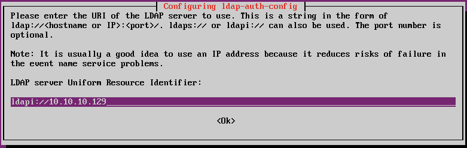

# 实验 12 Linux 网络认证实验

##  1 实验目的

- 掌握 Linux 中配置Kerberos认证服务器的方法，理解基于Kerberos的网络认证过程。
- 掌握 Linux中配置LDAP服务器的方法，理解基于LDAP的网络认证过程。
- 掌握 Linux中配置SAMBA+LDAP服务器的方法，理解基于SAMBA+LDAP的网络认证过程。

##  2 实验内容

- Linux中 Kerberos 认证服务器安装、配置、应用。
- Linux中 LDAP 认证服务器安装、配置、应用。
- Linux中 SAMBA+LDAP 认证服务器安装、配置、应用。
##  3 实验前提

- 准备好 ubuntu server 1604 虚拟机的克隆版本
- 编辑系统文件可以使用nano或vi工具

##  4 实验步骤

##  5 一.Linux中 Kerberos 认证服务器安装、配置、应用。

1.使用ubuntu linux 1604虚拟机的原版快照，建立一个链接型克隆，使用该克隆虚拟机完成下列实验步骤。

2.在虚拟机控制台中运行```ifconfig```，获知该虚拟机的ip地址。下面以10.10.10.129为例。

3.更新apt安装源，执行命令```sudo apt update```。

4.接下来，我们将生成一个含有以下组件的MIT kerberos 域：
- Realm: KBR_EXAMPLE.COM
- Primary KDC: kdc01.kbr_example.com (10.10.10.129)
- Secondary KDC: kdc02.kbr_example.com (10.10.10.130)
- User principal: leo
- Admin principal: leo/admin

4.安装Kerberos服务器。在主机mykerberos.com中运行以下命令：
```sudo  apt  install  krb5-admin-server  krb5-kdc```
	命令执行过程如下：
 
1. 安装过程中需要根据提示键入一些细节信息。
	对于问题“默认Kerberos域（Default Kerberos version 5 realm）”，在本例中键入“MYKERBEROS.COM” （如下图所示）。
 
3. 对于问题“你的Kerberos服务器（Kerberos servers for your realm）”，在本例中我们键入“mykerberos.com”。
 
4. 之后安装程序还会要求设置“管理服务器（Administrative server for your realm）”，同样键入“mykerberos.com”（译者注：在大型网络中，Kerberos服务器与管理服务器通常是不同的，但在本例中我们设置为同一台服务器）。
 
5. 当我们输入上述必要信息后，这一阶段的安装过程将完成。接下来要在当前主机mykerberos.com中生成新的Kerberos域（Realm），我们可以运行下列命令：
    sudo  krb5_newrealm
运行命令的输出结果如下图所示：
 
6. 在生成新域的过程中，需要为新建的Kerberos数据库（KDC database）的设置访问密码，这可以根据自己的偏好进行设定。
7. 接下来我们需要编辑/etc/krb5.confand文件（译者注：新版本的krb5配置文件为/etc/krb5.conf），并参考下图对文件中的“libdefaults”配置项进行修改。如果文件中没有这一行，就自己添加进去。
 
8. 参考下图，对/etc/krb5.confand文件中的“realms”配置项进行修改：
 
9. 接着修改/etc/krb5.confand文件中的“domain_realm”配置项，键入下列语句：
mykerberos.com = MYKERBEROS.COM
.mykerberos.com = MYKERBEROS.COM
修改后，文件内容如下图所示：
 
10. 对/etc/krb5.confand文件完成编辑后，我们需要向Kerberos数据库中增加规则，用来描述网络中的服务和用户。每个用户都需要在数据库中设置规则后才能使用Kerberos认证，这一步骤可以使用kadmin.local工具来实现。运行下列命令启动kadmin.local：
sudo  kadmin.local
命令执行后会进入kadmin.local命令环境，如下图所示：
 
11. 如果想查看已经存在的规则，可以运行下列命令：
    listprincs
12. 现在试着为某个用户增加规则，可以使用“addprinc”命令。本例中将以增加tajinder用户为例。运行下图所示命令：
 
13. 为了赋予root账户管理员（admin）权限，使用下图所示命令：
 
14. 如果我们将管理员权限赋予每个用户，那么取消文件/etc/krb5kdc/kadm5.acl中“* / admin”这一行前面的注释标记即可。
15. 要检查上面设置的规则是否被正确应用时，可以使用下列命令：
kinit
16. 在主机mykerberos.com中完成以上Kerberos系统的安装配置工作后，我们将打开客户端主机sshclient.com，安装Kerberos的客户端程序，可以使用下图所示命令：

 
17. 客户端安装过程中会要求回答一些与安装kerberos服务器程序时相同的问题，这时我们键入前面介绍过的相同内容即可。
18. 完成客户端安装后，需要使用ping命令检查否能从sshclient.com主机连通mykerberos. com服务器。
19. 现在，我们可以根据之前在mykerberos.com服务器上设置的规则获得客户端票据，使用下列命令查看：
 
如果上述命令运行无错误，那么意味着Kerberos工作正常。
完成上面步骤之后，我们切换到第三个Linux主机上，即SSH服务器sshserver.com。我们需要在这台机器上安装SSH服务器端程序和krb5-config程序。需要执行的命令如下图所示：
 
这里也会被询问一些与上面相同的问题，按照之前的回答键入即可。
20. 命令执行完后，需要编辑/etc/ssh/sshd_config文件，并使下列几行有效：
 
    21. 去掉上述几行前的“#”号并改变其值为“yes”，保持文件并退出（译者注：即设置“GSSAPIAuthentication yes”和“GSSAPICleanupCredentials yes”）。之后需要重新启动SSH服务，运行下列命令：
sudo service ssh restart
22. 接下来回到Kerberos服务器（主机mykerberos.com），我们将配置Kerberos服务器使其能与SSH服务器配合工作。在Kerberos服务器上运行“sudo kadmin.local”命令，启动kadmin.local工具，然后执行下列命令：
 
23. 上述命令为SSH服务器增加了规则，接下来，我们运行下图中的命令，生成密钥文件：
 
24. 将密钥文件从Kerberos服务器拷贝到SSH服务器，可以使用下列命令：
 
25. 密钥文件拷贝完成后，需要将它从SSH服务器sshserver.com的/tmp/目录下移动到/etc/directory（译者注：登录SSH服务器sshserver.com完成此操作）。
26. 再次登录客户端（主机sshclient.com），编辑/etc/ssh/ssh_config文件，使其包含下列内容：
GSSAPIAuthentication  yes
GSSAPIDelegateCredentials  yes
27. 为了在客户端上获取Kerberos认证票据，运行下列程序：
kinit  tajinder
28. 上述命令运行后，尝试使用命令ssh从客户端（主机sshclient.com）登录SSH服务器（主机sshserver.com）：
 
如上图所示结果，我们没有要求键入密码但通过了认证。


###  5.1 二.Linux中 LDAP 认证服务器安装、配置、应用。

1.使用ubuntu linux 1604虚拟机的原版快照，建立一个链接型克隆，使用该克隆虚拟机完成下列实验步骤。


1.安装LDAP及相关操作工具
```sudo apt install slapd ldap-utils```

在要求键入密码时，可以选择简单的“123456”.

后续配置过程执行```sudo  dpkg-reconfigure slapd```，可以参考实验10中步骤。

2.查看SLAP-CONFIG 目录信息树（ Directory Information Tree，DIT）.

目录树存放在/etc/ldap/slapd.d下。

使用下列命令查看slapd-config的目录信息树：
```sudo ldapsearch -Q -LLL -Y EXTERNAL -H ldapi:/// -b cn=config dn```

命令说明：
- -Q表示安静模式
- -LLL表示不带注释，以LDIF格式打印结果
- -Y EXTERNAL 表示使用 EXTERNAL SASL 模式
- -H ldapi:/// 表示LDAP URI
- -b cn=config dn 表示查询的基本dn

结果大致为：
```
dn: cn=config

dn: cn=module{0},cn=config

dn: cn=schema,cn=config

dn: cn={0}core,cn=schema,cn=config

dn: cn={1}cosine,cn=schema,cn=config

dn: cn={2}nis,cn=schema,cn=config

dn: cn={3}inetorgperson,cn=schema,cn=config

dn: olcBackend={0}mdb,cn=config

dn: olcDatabase={-1}frontend,cn=config

dn: olcDatabase={0}config,cn=config

dn: olcDatabase={1}mdb,cn=config

```

说明：
- cn=config: 全局设置（global settings）
- cn=module{0},cn=config: 一个动态的调用模块（a dynamically loaded module）
- cn=schema,cn=config: 包含硬编码的系统级模式（contains hard-coded system-level schema）
- cn={0}core,cn=schema,cn=config: 硬编码的核心模式（the hard-coded core schema）
- cn={1}cosine,cn=schema,cn=config: the cosine schema
- cn={2}nis,cn=schema,cn=config: the nis schema
- cn={3}inetorgperson,cn=schema,cn=config: the inetorgperson schema
- olcBackend={0}mdb,cn=config: the 'mdb' backend storage type
- olcDatabase={-1}frontend,cn=config: frontend database, default settings for other databases
- olcDatabase={0}config,cn=config: slapd 配置数据库 (cn=config)
- olcDatabase={1}mdb,cn=config: 你的数据库实例 (dc=example,dc=com)

使用下列命令查看我们配置的example.org中的信息：
```ldapsearch -x -LLL -H ldap:/// -b dc=example,dc=com dn```

结果大致为：
```
dn: dc=example,dc=com
dn: cn=admin,dc=example,dc=com
```

3.修改我们的LDAP数据库

为了使用LDAP进行认证，需要向这个数据库中加入一些信息，例如用户信息等。

我们下面尝试向库中增加：
- 一个名叫 Users 的节点，来存放用户
- 一个名叫 Groups 的节点，来存放工作组
- 一个名叫 ldap_group01 的组
- 一个名叫 ldap_user01 的用户

在ubuntu linux下执行下列操作：
```
cd ~
nano add_content.ldif
```
然后在打开的文本编辑器中键入如下内容（可以使用xshell 复制粘贴），然后保存 add_content.ldif文件。

```
dn: ou=Users,dc=example,dc=com
objectClass: organizationalUnit
ou: Users

dn: ou=Groups,dc=example,dc=com
objectClass: organizationalUnit
ou: Groups

dn: cn=ldapgroup01,ou=Groups,dc=example,dc=com
objectClass: posixGroup
cn: ldap_group01
gidNumber: 5000

dn: uid=ldapuser01,ou=Users,dc=example,dc=com
objectClass: inetOrgPerson
objectClass: posixAccount
objectClass: shadowAccount
uid: ldapuser01
sn: ldapuser01
givenName: ldapuser01
cn: ldapuser01
displayName: ldapuser01
uidNumber: 10000
gidNumber: 5000
userPassword: ldapuser01
gecos: ldapuser01
loginShell: /bin/bash
homeDirectory: /home/users/ldapuser01
```

> 注意：uid和gid的值不能与本地uid和gid冲突（即不能与/etc/passwd中的uid和/etc/group中的gid发生冲突。）我们这里使用了比较大的数字，就是为了和系统本身的uid和gid进行区分。

保存上述文件后，执行下列增加数据命令：

```ldapadd -x -D cn=admin,dc=example,dc=com -W -f add_content.ldif```

结果大致为：

```
Enter LDAP Password: 
adding new entry "ou=Users,dc=example,dc=com"

adding new entry "ou=Groups,dc=example,dc=com"

adding new entry "cn=miners,ou=Groups,dc=example,dc=com"

adding new entry "uid=john,ou=Users,dc=example,dc=com"
```

为了检查结果，可以键入下列命令：
```ldapsearch -x -LLL -b dc=example,dc=com 'uid=ldapuser01'```

结果如下：
```
dn: uid=ldapuser01,ou=Users,dc=example,dc=com
cn: ldapuser01
gidNumber: 5000
```

4.尝试修改slapd配置数据

执行下列命令：
```
cd ~
nano uid_index.ldif
```
在打开的文本编辑器中键入如下内容：
```
dn: olcDatabase={1}mdb,cn=config
add: olcDbIndex
olcDbIndex: mail eq,sub
```

> 说明：上述内容是要在配置数据库中加入检索属性（DbIndex）。

保存 uid_index.ldif文件后，执行下列命令：
```sudo ldapmodify -Q -Y EXTERNAL -H ldapi:/// -f uid_index.ldif```

然后，自行下列命令进行验证。
```sudo ldapsearch -Q -LLL -Y EXTERNAL -H ldapi:/// -b cn=config '(olcDatabase={1}mdb)' olcDbIndex```

可以看到如下结果：
```
dn: olcDatabase={1}mdb,cn=config
olcDbIndex: objectClass eq
olcDbIndex: cn,uid eq
olcDbIndex: uidNumber,gidNumber eq
olcDbIndex: member,memberUid eq
olcDbIndex: mail eq,sub
```

LDAP Authentication

在LDAP server启动后，可以在客户端上安装一些支持库来连接服务器。

在ubuntu中，客户端通常安装libnss-ldap包。执行下列命令安装：
```sudo apt install libnss-ldap```

###  5.2 二. LDAP client 安装与配置

1.使用ubuntu linux的原版快照（未安装ldap server即可），克隆一份ubuntu linux server。

2.运行下列命令安装客户端工具。
```
sudo apt install libnss-ldap
```
安装过程中，会提示输入一些配置。
- 要输入ldap server的ip地址，假设ldap server的ip地址为10.10.10.129，则设置为如下图所示情况：



- 设置搜索base项为：```dc=example,dc=com```
- LDAP version to use :3 这项及接下来的几项设置按默认。
- 设置LDAP account for root为：cn=manager,dc=example,dc=com,如下图所示：


- 设置根管理员密码，可简单设为123456.

之后等待安装完成。

3.如果上述过程出现问题，可以运行下列命令进行重新配置。
```sudo dpkg-reconfigure ldap-auth-config```

结果存放在```/etc/ldap.conf```中，如果你设置的ldap服务器要求一些配置选项没有列在这个文件中，那么你可以编辑这个文件。

4.为NSS配置LDAP特性文件。
```sudo auth-client-config -t nss -p lac_ldap```

5.令当前系统启用LDAP认证。可以执行下列操作：
```sudo pam-auth-update```

在弹出的对话框中，选择LDAP和其它别的你需要的认证方式（可以按默认）。

6.如果LDAP的 replication 已经在用，LDAP客户端需要参考多个服务器。在/etc/ldap.conf中，可能会看到下列信息：

```uri ldap://10.10.10.129 ldap://10.10.10.130```

>注：如果没有启动replication，则只有```uri ldap://10.10.10.129```

###  5.3 用户和组管理

1.在ldap服务器端，使用下列命令安装ldapscripts，它用于管理ldap目录，支持长字符串。
```sudo apt install ldapscripts```

安装完成后，在/etc/ldapscripts/ldapscripts.conf 编辑下列内容：
```
SERVER=localhost
BINDDN='cn=admin,dc=example,dc=com'
BINDPWDFILE="/etc/ldapscripts/ldapscripts.passwd"
SUFFIX='dc=example,dc=com'
GSUFFIX='ou=Groups'
USUFFIX='ou=Users'
MSUFFIX='ou=Machines'
GIDSTART=10000
UIDSTART=10000
MIDSTART=20000
```

2.现在生成ldapscripts.passwd文件来允许rootDN访问目录。
```
sudo sh -c "echo" -n '123456' > /etc/ldapscripts/ldapscripts.passwd"

sudo chmod 400 /etc/ldapscripts/ldapscripts.passwd
```

>上述命令中的123456是ldap数据库rootDN用户的密码，可以替换为自己希望的密码。

这个脚本可以帮助管理目录。下面是使用的例子：

3.生成一个新用户
```sudo ldapadduser  luser01```

这将生成一个uid为“luser01”的用户，并会生成用户主目录luser01

4.改变一个ldap目录的密码。
```sudo ldapsetpasswd luser01```
在出现的提示中键入密码。可以设为123456。

5.删除一个用户可以采用下列命令：
```sudo ldapdeleteuser luser01```

6.增加一个组可以使用下列命令：
```sudo ldapaddgroup lgroup01```

7.删除一个组可以使用下列命令：
```sudo ldapdeletegroup lgroup01```

8.向用户组添加用户，使用下列命令：
```sudo ldapaddusertogroup luser01 lgroup01```

9.从用户组移除用户，使用下列命令：
```sudo ldapdeleteusertogroup luser01 lgroup01```

10.增加、删除、修改用户属性可以使用ldapmodify命令：
```sudo ldapmodifyuser luser01```

11.ldapscripts有模板功能，要启用用户模板，请更改 /etc/ldapscripts/ldapscripts.conf：
```UTEMPLATE =“ / etc / ldapscripts / ldapadduser.template”```

/usr/share/doc/ldapscripts/examples目录中有示例模板。将ldapadduser.template.sample文件复制或重命名为 /etc/ldapscripts/ldapadduser.template：

```cp /usr/share/doc/ldapscripts/examples/ldapadduser.template.sample /etc/ldapscripts/ldapadduser.template```