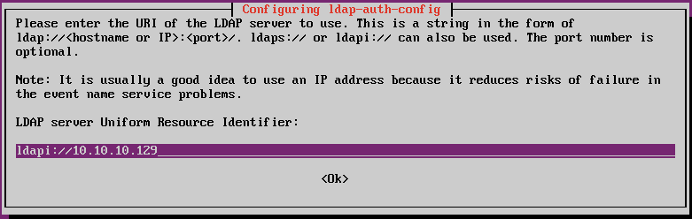

# 实验 12 Linux 网络认证实验

##  1 实验目的

- 掌握 Linux 中配置Kerberos认证服务器的方法，理解基于Kerberos的网络认证过程。
- 掌握 Linux中配置LDAP服务器的方法，理解基于LDAP的网络认证过程。
- 掌握 Linux中配置SAMBA+LDAP服务器的方法，理解基于SAMBA+LDAP的网络认证过程。

##  2 实验内容

- Linux中 Kerberos 认证服务器安装、配置、应用。
- Linux中 LDAP 认证服务器安装、配置、应用。
- Linux中 SAMBA+LDAP 认证服务器安装、配置、应用。

##  3 实验前提

- 准备好 ubuntu server 1604 虚拟机的克隆版本
- 编辑系统文件可以使用nano或vi工具

##  4 实验步骤

###  4.1 Linux中 Kerberos 认证服务器安装、配置、应用。

####  4.1.1 安装、配置 Kerberos 服务器

##### 安装 Kerberos 服务器
1.使用ubuntu linux 1604虚拟机的原版快照，建立一个链接型克隆，使用该克隆虚拟机完成下列实验步骤。

2.在虚拟机控制台中运行```ifconfig```，获知该虚拟机的ip地址。下面以10.10.10.129为例。

3.更新apt安装源，执行命令```sudo apt update```。

4.接下来，我们将生成一个含有以下组件的MIT kerberos 域：

- 域（Realm）: MYKRB.COM
- 主KDC（Primary KDC）: kdcsrv01.mykdc.com (10.10.10.129)
- 用户主体（User principal）: leo
- 管理主体（Admin principal）: leo/admin

5.安装Kerberos服务器。在主机mykerberos.com中运行以下命令：
```sudo  apt  install  krb5-admin-server  krb5-kdc```

6.安装过程中根据提示键入一些细节信息。

- 对于问题“默认Kerberos域（Default Kerberos version 5 realm）”，在本例中键入```mykrb.com```。
- 对于问题“你的Kerberos服务器（Kerberos servers for your realm）”，在本例中我们键入```krbsrv01.mykrb.com```
- 之后安装程序还会要求设置“管理服务器（Administrative server for your realm）”，同样键入```krbsrv01.mykrb.com```（在大型网络中，Kerberos服务器与管理服务器通常是不同的，但在本例中我们设置为同一台服务器）。
 
当我们输入上述必要信息后，这一阶段的安装过程将完成。

7.接下来要在当前krb realm：MYKERBEROS01.COM中生成新的Kerberos域（Realm）管理工具，我们可以运行下列命令：```sudo  krb5_newrealm``` 运行命令的输出结果如下图所示：

- 在生成新域的过程中，需要为新建的Kerberos数据库（KDC database）的设置访问密码，例如：123456。


8.如果在安装中有任何问题，可以在完成上述步骤后，通过编辑```/etc/krb5.conf```文件进行修补或重新定义。

建议在[domain_realm]内容块中键入如下内容：
```
.mykrb.com = mykrb.com
mykrb.com = mykrb.com
```
修改保存```/etc/krb5.conf```文件后，该文件的内容大致如下：

```
[libdefaults]
        default_realm = mykrb01.com
...

[realms]
        mykrb01.com = {
                kdc = krbsrv01.mykrb.com
                admin_server = krbsrv01.mykrb.com
        }

        ATHENA.MIT.EDU = {
                kdc = kerberos.mit.edu:88
                kdc = kerberos-1.mit.edu:88
...
[domain_realm]
        .mit.edu = ATHENA.MIT.EDU
        mit.edu = ATHENA.MIT.EDU
        ...
        ...
        .utoronto.ca = UTORONTO.CA
        .mykrb.com = mykrb.com
        mykrb.com = mykrb.com
...
```
> 重新配置过程也可以使用```sudo dpkg-reconfigure krb5-config```命令。

8.编辑本地服务器域名。运行命令```sudo nano /etc/hosts```，在打开的hosts文件中，增加下列内容：
```127.0.0.1       krbsrv01.mykrb.com   krbsrv01```


##### 配置 Kerberos 服务器的密钥分发中心KDC

1.配置密钥分发中心可以使用```sudo dpkg-reconfigure krb5-kdc```命令。这个命令其实在生成或修改```/etc/krb5kdc```文件。

在弹出的对话框中，选择“yes”，等待生成配置。

2.为使KDC能够正常运行，需要一个admin用户。建议不要使用日常用户进行管理。下面运行```sudo kadmin.local```进行设置。

运行上述命令后会出现如下内容，请根据情况填入信息：
```
leo@ubuntu:~$ sudo kadmin.local 
[sudo] password for leo: <"这里键入密码123456">

# 结果
Authenticating as principal root/admin@mykrb.com with password.
kadmin.local:  addprinc leo/admin
WARNING: no policy specified for leo/admin@mykrb.com; defaulting to no policy
Enter password for principal "leo/admin@mykrb.com": 
Re-enter password for principal "leo/admin@mykrb.com": 
Principal "leo/admin@mykrb.com" created.
kadmin.local:  quit
```

这样，leo成为用户主体，而leo/admin是一个管理实例，@mykrb.com代表了这个域。


3.接下来，新管理用户leo/admin需要有适当的访问权限（ACL），这个权限的配置需要执行命令```sudo nano /etc/krb5kdc/kadm5.acl```，编辑该文件。在文件末尾追加一行```leo/admin@mykrb.com```。

例如：
```
# This file Is the access control list for krb5 administration.
# When this file is edited run /etc/init.d/krb5-admin-server restart to activate
# One common way to set up Kerberos administration is to allow any principal
# ending in /admin  is given full administrative rights.
# To enable this, uncomment the following line:
# */admin *
leo/admin@mykrb.com

```

这将授予leo/admin 对 mykrb.com的任意权限。可以使用配置语句设置更为详细严格的权限，这里暂略。

4.运行命令```sudo systemctl restart krb5-admin-server.service```重启krb5-admin-server。

5.新用户主体可以使用下列kinit工具进行测试。

```
leo@ubuntu:~$ kinit leo/admin
Password for leo/admin@mykrb.com:<这里输入密码123456> 
```

键入密码之后，我们可以使用下列命令查看票据Ticket Granting Ticket(TGT)：
```klist```


结果如下：
```
Ticket cache: FILE:/tmp/krb5cc_1000
Default principal: leo/admin@mykrb.com

Valid starting       Expires              Service principal
11/10/2019 19:36:25  11/11/2019 05:36:25  krbtgt/mykrb.com@mykrb.com
	renew until 11/11/2019 19:36:20

```

看到上面结果中，票据存放在/tmp/krb5cc_1000中，这个文件名由前缀krb5cc_和用户uid构成。


####  4.1.2 安装、配置 Kerberos 客户端

##### 安装

1.使用ubuntu linux 1604虚拟机的原版快照，建立一个链接型克隆，使用该克隆虚拟机完成下列实验步骤。

2.在虚拟机控制台中运行```ifconfig```，获知该虚拟机的ip地址。下面以10.10.10.134为例。

3.更新apt安装源，执行命令```sudo apt update```。

4.安装Kerberos客户端的命令如下：```sudo apt install krb5-user libpam-krb5 libpam-ccreds auth-client-config```。

在执行命令过程中，要键入以下内容：
- Default Kerberos version 5 realm 后键入：mykrb.com
- Default Kerberos version 5 realm 后键入：krbsrv01.mykrb.com
- krbsrv01.mykrb.com 后键入：krbsrv01.mykrb.com


> 这个命令中，auth-client-config 包允许对多源认证的PAM进行简单配置，libpam-ccreds可以缓存认证凭据，以便你在KDC不可用时能够登录。这个包也有助于移动办公设备联网或断网环境下进行认证。


##### 配置

1.使用下列命令配置客户端。
```leo@ubuntu:~$ sudo dpkg-reconfigure krb5-config ```

2.允许命令```sudo nano /etc/hosts```，打开dns设置文件hosts，在新的一行中键入以下内容后退出：
```10.10.10.129    krbsrv01.mykrb.com      krbsrv01```

配置完成后，重新启动该客户端系统。

3.如果要测试配置后是否可以请求一份票据，可以使用```kinit```命令，例如：
```
leo@ubuntu:~$ kinit leo/admin@mykrb.com
Password for leo/admin@mykrb.com: <在此输入密码123456>

# 结果如下：
leo@ubuntu:~$ klist
Ticket cache: FILE:/tmp/krb5cc_1000
Default principal: leo/admin@mykrb.com

Valid starting       Expires              Service principal
11/10/2019 21:24:12  11/11/2019 07:24:12  krbtgt/mykrb.com@mykrb.com
	renew until 11/11/2019 21:24:09
```

4.接下来，使用auth-client-config来配置 libpam-krb5模块来请求一份票据。
```
leo@ubuntu:~$ sudo auth-client-config -a -p kerberos_example
[sudo] password for leo: 

# 结果如下：
leo@ubuntu:~$ klist
Ticket cache: FILE:/tmp/krb5cc_1000
Default principal: leo/admin@mykrb.com

Valid starting       Expires              Service principal
11/10/2019 21:24:12  11/11/2019 07:24:12  krbtgt/mykrb.com@mykrb.com
	renew until 11/11/2019 21:24:09
```


至此，客户端可以通过Kerberos服务器 krbsrv01.mykrb.com 进行认证了。

###  4.2 Linux中 LDAP 认证服务

####  4.2.1 Linux中 LDAP 认证服务器安装、配置、应用。

##### 安装

1.使用ubuntu linux 1604虚拟机的原版快照，建立一个链接型克隆，使用该克隆虚拟机完成下列实验步骤。

2.在虚拟机控制台中运行```ifconfig```，获知该虚拟机的ip地址。下面以10.10.10.129为例。

3.安装LDAP及相关操作工具
```sudo apt install slapd ldap-utils```

在要求键入密码时，本实验中可以选择简单的“123456”.

4.执行```sudo  dpkg-reconfigure slapd```，进行配置：
-  Omit OpenLDAP server configuration? 选择 no
- 在要求输入DNS domain name时，键入：```myldap.mycorp.com```。
  - 说明：这个DNS域名被用于构建LDAP目录的基本DN，上述域名将构建一个目录，其DN为“dc=myldap，dc=mycorp，dc=com”。
- 要求输入Organization name时，键入：mycorp.com
- 要求输入Administrator password时，键入：123456
- 其他选项全部按默认选择。

5.查看已经安装的DITs
允许下列命令：```sudo ls /etc/ldap/slapd.d```

结果如下：
```
leo@ubuntu:~$ sudo ls /etc/ldap/slapd.d/
cn=config  cn=config.ldif
```
上面有两个结果，一个是slapd-config，另一个是我们生成的myldap.mycorp.com目录。

运行LDAP协议查询语句查看slapd-config 目录信息树（DIT):
```sudo ldapsearch -Q -LLL -Y EXTERNAL -H ldapi:/// -b cn=config dn```


命令说明：
- -Q表示安静模式
- -LLL表示不带注释，以LDIF格式打印结果
- -Y EXTERNAL 表示使用 EXTERNAL SASL 模式
- -H ldapi:/// 表示LDAP URI
- -b cn=config dn 表示查询的基本dn

结果如下：
```
leo@ubuntu:~$ sudo ldapsearch -Q -LLL -Y EXTERNAL -H ldapi:/// -b cn=config dn
dn: cn=config

dn: cn=module{0},cn=config

dn: cn=schema,cn=config

dn: cn={0}core,cn=schema,cn=config

dn: cn={1}cosine,cn=schema,cn=config

dn: cn={2}nis,cn=schema,cn=config

dn: cn={3}inetorgperson,cn=schema,cn=config

dn: olcBackend={0}mdb,cn=config

dn: olcDatabase={-1}frontend,cn=config

dn: olcDatabase={0}config,cn=config

dn: olcDatabase={1}mdb,cn=config

```


说明：
- cn=config: 全局设置（global settings）
- cn=module{0},cn=config: 一个动态的调用模块（a dynamically loaded module）
- cn=schema,cn=config: 包含硬编码的系统级模式（contains hard-coded system-level schema）
- cn={0}core,cn=schema,cn=config: 硬编码的核心模式（the hard-coded core schema）
- cn={1}cosine,cn=schema,cn=config: the cosine schema
- cn={2}nis,cn=schema,cn=config: the nis schema
- cn={3}inetorgperson,cn=schema,cn=config: the inetorgperson schema
- olcBackend={0}mdb,cn=config: the 'mdb' backend storage type
- olcDatabase={-1}frontend,cn=config: frontend database, default settings for other databases
- olcDatabase={0}config,cn=config: slapd 配置数据库 (cn=config)
- olcDatabase={1}mdb,cn=config: 你的数据库实例 (dc=example,dc=com)

使用下列命令查看我们配置的 myldap.mycorp.com 中的信息：
```ldapsearch -x -LLL -H ldap:/// -b dc=myldap,dc=mycorp,dc=com dn```

结果大致为：
```
leo@ubuntu:~$ ldapsearch -x -LLL -H ldap:/// -b dc=myldap,dc=mycorp,dc=com dn
dn: dc=myldap,dc=mycorp,dc=com

dn: cn=admin,dc=myldap,dc=mycorp,dc=com
```
##### 配置

1.修改我们的LDAP数据库

为了使用LDAP进行认证，需要向这个数据库中加入一些信息，例如用户信息等。

我们下面尝试向库中增加：
- 一个名叫 Users 的节点，来存放用户
- 一个名叫 Groups 的节点，来存放工作组
- 一个名叫 ldap_group01 的组
- 一个名叫 ldap_user01 的用户

在ubuntu linux下执行下列操作：
```
cd ~
nano add_content.ldif
```
然后在打开的文本编辑器中键入如下内容（可以使用xshell 复制粘贴），然后保存 add_content.ldif文件。

```
dn: ou=Users,dc=myldap,dc=mycorp,dc=com
objectClass: organizationalUnit
ou: Users

dn: ou=Groups,dc=myldap,dc=mycorp,dc=com
objectClass: organizationalUnit
ou: Groups

dn: cn=ldapgroup01,ou=Groups,dc=myldap,dc=mycorp,dc=com
objectClass: posixGroup
cn: ldap_group01
gidNumber: 5000

dn: uid=ldapuser01,ou=Users,dc=myldap,dc=mycorp,dc=com
objectClass: inetOrgPerson
objectClass: posixAccount
objectClass: shadowAccount
uid: ldapuser01
sn: ldapuser01
givenName: ldapuser01
cn: ldapuser01
displayName: ldapuser01
uidNumber: 10000
gidNumber: 5000
userPassword: ldapuser01
gecos: ldapuser01
loginShell: /bin/bash
homeDirectory: /home/users/ldapuser01
```

> 注意：uid和gid的值不能与本地uid和gid冲突（即不能与/etc/passwd中的uid和/etc/group中的gid发生冲突。）我们这里使用了比较大的数字，就是为了和系统本身的uid和gid进行区分。

保存上述文件后，执行下列增加数据命令：

```ldapadd -x -D cn=admin,dc=myldap,dc=mycorp,dc=com -W -f add_content.ldif```

结果大致为：

```
adding new entry "ou=Users,dc=myldap,dc=mycorp,dc=com"

adding new entry "ou=Groups,dc=myldap,dc=mycorp,dc=com"

adding new entry "cn=ldapgroup01,ou=Groups,dc=myldap,dc=mycorp,dc=com"

adding new entry "uid=ldapuser01,ou=Users,dc=myldap,dc=mycorp,dc=com"

```

为了检查结果，可以键入下列命令：
```ldapsearch -x -LLL -b dc=myldap,dc=mycorp,dc=com 'uid=ldapuser01'```

结果如下：
```
dn: uid=ldapuser01,ou=Users,dc=myldap,dc=mycorp,dc=com
objectClass: inetOrgPerson
objectClass: posixAccount
objectClass: shadowAccount
uid: ldapuser01
sn: ldapuser01
givenName: ldapuser01
cn: ldapuser01
displayName: ldapuser01
uidNumber: 10000
gidNumber: 5000
gecos: ldapuser01
loginShell: /bin/bash
homeDirectory: /home/users/ldapuser01

```

如果要过滤出部分内容，例如仅查看cn和gidNumber，可以运行下列命令：
```ldapsearch -x -LLL -b dc=myldap,dc=mycorp,dc=com 'uid=ldapuser01' cn  gidNumber```

命令说明：
- -x表示简单绑定，不使用默认的SASL方法
- -LLL表示禁用打印额外信息
- uid=xxx，表示过滤用户uid
- cn，表示过滤显示内容

2.修改slapd配置数据库

slapd-config 目录信息树可以被查询和修改。

运行命令
```
cd ~
sudo nano uid_index.ldif
```
生成一个文件，键入如下内容：

```
dn: olcDatabase={1}mdb,cn=config
add: olcDbIndex
olcDbIndex: mail eq,sub
```
这个内容是要在目录中生成一个按mail进行检索属性"Index" (DbIndex attribute)。

然后运行下列命令将文件增加到slapd配置中：
```sudo ldapmodify -Q -Y EXTERNAL -H ldapi:/// -f uid_index.ldif```

结果为：
```
leo@ubuntu:~$ sudo nano uid_index.ldif
[sudo] password for leo: 
leo@ubuntu:~$ sudo ldapmodify -Q -Y EXTERNAL -H ldapi:/// -f uid_index.ldif
modifying entry "olcDatabase={1}mdb,cn=config"
```

可以通过命令查看效果
```
sudo ldapsearch -Q -LLL -Y EXTERNAL -H ldapi:/// -b cn=config '(olcDatabase={1}mdb)' olcDbIndex
```
结果如下：
```
leo@ubuntu:~$ sudo ldapsearch -Q -LLL -Y EXTERNAL -H ldapi:/// -b cn=config '(olcDatabase={1}mdb)' olcDbIndex
dn: olcDatabase={1}mdb,cn=config
olcDbIndex: objectClass eq
olcDbIndex: cn,uid eq
olcDbIndex: uidNumber,gidNumber eq
olcDbIndex: member,memberUid eq
olcDbIndex: mail eq,sub
```

> 说明：上述内容是要在配置数据库中加入检索属性（DbIndex）。


3.增加一个schema。

可以先通过命令查看slapd中已有的schema
```
sudo ldapsearch -Q -LLL -Y EXTERNAL -H ldapi:/// -b cn=schema,cn=config dn
```

结果如下：
```
leo@ubuntu:~$ sudo ldapsearch -Q -LLL -Y EXTERNAL -H ldapi:/// -b cn=schema,cn=config dn
dn: cn=schema,cn=config

dn: cn={0}core,cn=schema,cn=config

dn: cn={1}cosine,cn=schema,cn=config

dn: cn={2}nis,cn=schema,cn=config

dn: cn={3}inetorgperson,cn=schema,cn=config
```

下面我们尝试增加一个CORBA模式。

（1）首先生成一个转换配置文件：```nano schema_convert.conf```，在该文件中键入以下内容：
```
include /etc/ldap/schema/core.schema
include /etc/ldap/schema/collective.schema
include /etc/ldap/schema/corba.schema
include /etc/ldap/schema/cosine.schema
include /etc/ldap/schema/duaconf.schema
include /etc/ldap/schema/dyngroup.schema
include /etc/ldap/schema/inetorgperson.schema
include /etc/ldap/schema/java.schema
include /etc/ldap/schema/misc.schema
include /etc/ldap/schema/nis.schema
include /etc/ldap/schema/openldap.schema
include /etc/ldap/schema/ppolicy.schema
include /etc/ldap/schema/ldapns.schema
include /etc/ldap/schema/pmi.schema
```

（2）生成输出目录```sudo mkdir ~/ldif_output```。

（3）输入下列命令，确定这个模式的index：
```
sudo slapcat -f schema_convert.conf -F ldif_output -n 0 | grep corba,cn=schema
```
结果：
```
dn: cn={2}corba,cn=schema,cn=config
```
（4）执行转变
```sudo slapcat -f schema_convert.conf -F ldif_output -n0 -H ldap:///cn={2}corba,cn=schema,cn=config -l cn=corba.ldif```

现在转变后的模式是cn=corba.ldif。

（5）可以运行命令```nano cn=corba.ldif```，查看内容，
修改前3行内容为：
```
dn: cn=corba,cn=schema,cn=config
objectClass: olcSchemaConfig
cn: corba
```

删除文件尾部的以下内容：
```
structuralObjectClass: olcSchemaConfig
entryUUID: 676df666-98a1-1039-90a3-7729baa37c15
creatorsName: cn=config
createTimestamp: 20191111073413Z
entryCSN: 20191111073413.990536Z#000000#000#000000
modifiersName: cn=config
modifyTimestamp: 20191111073413Z
```
之后保存退出。

（6）最后，使用下列命令增加新的模式到slapd-config DIT:
```
sudo ldapadd -Q -Y EXTERNAL -H ldapi:/// -f cn\=corba.ldif
```
结果如下：
```
adding new entry "cn=corba,cn=schema,cn=config"
```
(7)确认已经加载了上述模式

```
#键入下列命令：
leo@ubuntu:~$ sudo ldapsearch -Q -LLL -Y EXTERNAL -H ldapi:/// -b cn=schema,cn=config dn

# 以下为结果：
dn: cn=schema,cn=config

dn: cn={0}core,cn=schema,cn=config

dn: cn={1}cosine,cn=schema,cn=config

dn: cn={2}nis,cn=schema,cn=config

dn: cn={3}inetorgperson,cn=schema,cn=config

dn: cn={4}corba,cn=schema,cn=config

```
结果中可见corba schema已经生成。

##### 用户和组管理（选做）

1.在ldap服务器端，使用下列命令安装ldapscripts，它用于管理ldap目录，支持长字符串。
```sudo apt install ldapscripts```

安装完成后，在/etc/ldapscripts/ldapscripts.conf 编辑下列内容：
```
SERVER=localhost
BINDDN='cn=admin,dc=example,dc=com'
BINDPWDFILE="/etc/ldapscripts/ldapscripts.passwd"
SUFFIX='dc=example,dc=com'
GSUFFIX='ou=Groups'
USUFFIX='ou=Users'
MSUFFIX='ou=Machines'
GIDSTART=10000
UIDSTART=10000
MIDSTART=20000
```

2.现在生成ldapscripts.passwd文件来允许rootDN访问目录。
```
sudo sh -c "echo" -n '123456' > /etc/ldapscripts/ldapscripts.passwd"

sudo chmod 400 /etc/ldapscripts/ldapscripts.passwd
```

>上述命令中的123456是ldap数据库rootDN用户的密码，可以替换为自己希望的密码。

这个脚本可以帮助管理目录。下面是使用的例子：

3.生成一个新用户
```sudo ldapadduser  luser01```

这将生成一个uid为“luser01”的用户，并会生成用户主目录luser01

4.改变一个ldap目录的密码。
```sudo ldapsetpasswd luser01```
在出现的提示中键入密码。可以设为123456。

5.删除一个用户可以采用下列命令：
```sudo ldapdeleteuser luser01```

6.增加一个组可以使用下列命令：
```sudo ldapaddgroup lgroup01```

7.删除一个组可以使用下列命令：
```sudo ldapdeletegroup lgroup01```

8.向用户组添加用户，使用下列命令：
```sudo ldapaddusertogroup luser01 lgroup01```

9.从用户组移除用户，使用下列命令：
```sudo ldapdeleteusertogroup luser01 lgroup01```

10.增加、删除、修改用户属性可以使用ldapmodify命令：
```sudo ldapmodifyuser luser01```

11.ldapscripts有模板功能，要启用用户模板，请更改 /etc/ldapscripts/ldapscripts.conf：
```UTEMPLATE =“ / etc / ldapscripts / ldapadduser.template”```

/usr/share/doc/ldapscripts/examples目录中有示例模板。将ldapadduser.template.sample文件复制或重命名为 /etc/ldapscripts/ldapadduser.template：

```cp /usr/share/doc/ldapscripts/examples/ldapadduser.template.sample /etc/ldapscripts/ldapadduser.template```

##### 日志功能设置（选做）

slapd的活动日志是在实现基于OpenLDAP的解决方案时不可获取的。

在安装openLDAP后，日志必须手动启动。

OpenLDAP有多个日志子系统（各个级别），例如：stats。

1.编辑日志格式文件。

运行命令：
```
cd ~ 
nano logging.ldif
```
在打开的新文件中键入如下内容：
```
dn: cn=config
changetype: modify
replace: olcLogLevel
olcLogLevel: stats
```

2.运行下列命令执行
```sudo ldapmodify -Q -Y EXTERNAL -H ldapi:/// -f logging.ldif```

之后，使用LDAP过程中会有大量的日志记录产生，希望在系统投入生产后将其限制在较低的详细级别。在这种冗长模式下，主机的syslog引擎（rsyslog）可能很难跟上并可能丢弃消息，例如会报告错误信息：
```
rsyslogd-2177: imuxsock lost 228 messages from pid 2547 due to rate-limiting
```
为了加大系统日志记录细节，可以修改文件```/etc/rsyslog.conf```。使用命令```sudo nano /etc/rsyslog.conf```，键入内容：
```
# Disable rate limiting
# (default is 200 messages in 5 seconds; below we make the 5 become 0)
$SystemLogRateLimitInterval 0
```
上述内容取消了每5秒200条消息的限制。

保存文件后，执行下列命令启用配置：
```sudo systemctl restart syslog.service```

##### 复制功能设置(选做)

LDAP服务在网络系统中变得越来越重要。

在网络环境中，LDAP复制过程已经成为一个标准，用来构建冗余、高可用性的LDAP认证和服务，以防止灾难发生。

复制工作可以由Syncrepl引擎实现，它可以使用消费者-生产者模型实现同步。下面我们将实现这种复制过程。

我们不仅使用了Consumer - Provider 模型，还将使用 refreshAndPersist以及delta-syncrepl模型。

1.生成一个LDIF文件，运行下列命令：
```
cd ~
nano provider_sync.ldif
```

在新生成的文件中键入以下内容：
```
# Add indexes to the frontend db.
dn: olcDatabase={1}mdb,cn=config
changetype: modify
add: olcDbIndex
olcDbIndex: entryCSN eq
-
add: olcDbIndex
olcDbIndex: entryUUID eq

#Load the syncprov and accesslog modules.
dn: cn=module{0},cn=config
changetype: modify
add: olcModuleLoad
olcModuleLoad: syncprovdc
-
add: olcModuleLoad
olcModuleLoad: accesslog

# Accesslog database definitions
dn: olcDatabase={2}mdb,cn=config
objectClass: olcDatabaseConfig
objectClass: olcMdbConfig
olcDatabase: {2}mdb
olcDbDirectory: /var/lib/ldap/accesslog
olcSuffix: cn=accesslog
olcRootDN: cn=admin,dc=myldap,dc=mycorp,dc=com
olcDbIndex: default eq
olcDbIndex: entryCSN,objectClass,reqEnd,reqResult,reqStart

# Accesslog db syncprov.
dn: olcOverlay=syncprov,olcDatabase={2}mdb,cn=config
changetype: add
objectClass: olcOverlayConfig
objectClass: olcSyncProvConfig
olcOverlay: syncprov
olcSpNoPresent: TRUE
olcSpReloadHint: TRUE

# syncrepl Provider for primary db
dn: olcOverlay=syncprov,olcDatabase={1}mdb,cn=config
changetype: add
objectClass: olcOverlayConfig
objectClass: olcSyncProvConfig
olcOverlay: syncprov
olcSpNoPresent: TRUE

# accesslog overlay definitions for primary db
dn: olcOverlay=accesslog,olcDatabase={1}mdb,cn=config
objectClass: olcOverlayConfig
objectClass: olcAccessLogConfig
olcOverlay: accesslog
olcAccessLogDB: cn=accesslog
olcAccessLogOps: writes
olcAccessLogSuccess: TRUE
# scan the accesslog DB every day, and purge entries older than 7 days
olcAccessLogPurge: 07+00:00 01+00:00
```

保存后关闭。

2.生成一个目录.
```sudo -u openldap mkdir /var/lib/ldap/accesslog```

3.增加新的内容。
```sudo ldapadd -Q -Y EXTERNAL -H ldapi:/// -f provider_sync.ldif```

结果如下：
```
leo@ubuntu:~$ sudo ldapadd -Q -Y EXTERNAL -H ldapi:/// -f provider_sync.ldif
modifying entry "olcDatabase={1}mdb,cn=config"

modifying entry "cn=module{0},cn=config"

adding new entry "olcDatabase={2}mdb,cn=config"

adding new entry "olcOverlay=syncprov,olcDatabase={2}mdb,cn=config"

adding new entry "olcOverlay=syncprov,olcDatabase={1}mdb,cn=config"

adding new entry "olcOverlay=accesslog,olcDatabase={1}mdb,cn=config"

```

以上生成了消费者（Provider） 配置。下面生成了消费者（Consumer）配置

4.运行命令，生成新文件。
```
cd ~
nano consumer_sync.ldif
```

在新文件中键入如下内容：

```
dn: cn=module{0},cn=config
changetype: modify
add: olcModuleLoad
olcModuleLoad: syncprov

dn: olcDatabase={1}mdb,cn=config
changetype: modify
add: olcDbIndex
olcDbIndex: entryUUID eq
-
add: olcSyncRepl
olcSyncRepl: rid=0 provider=ldap://ldap01.example.com bindmethod=simple binddn="cn=admin,dc=myldap,dc=mycorp,dc=com"
  credentials=secret searchbase="dc=myldap,dc=mycorp,dc=com" logbase="cn=accesslog"
  logfilter="(&(objectClass=auditWriteObject)(reqResult=0))" schemachecking=on
  type=refreshAndPersist retry="60 +" syncdata=accesslog
-
add: olcUpdateRef
olcUpdateRef: ldap://ldap01.myldap.mycorp.com

```

5.运行下列命令，将上述配置增加至ldap服务器配置。
```sudo ldapadd -Q -Y EXTERNAL -H ldapi:/// -f consumer_sync.ldif```

6.测试
```sudo ldapsearch -z1 -LLLQY EXTERNAL -H ldapi:/// -s base -b dc=myldap,dc=mycorp,dc=com contextCSN```

结果大致如下：
```
dn: dc=myldap,dc=mycorp,dc=com
contextCSN: contextCSN: 20191111112246.666849Z#000000#000#000000
```

##### 访问控制（选作）

LDAP的访问控制由其ACL实现。

1.首先要查询一下可用的mdb数据库。
```sudo ldapsearch -Q -LLL -Y EXTERNAL -H ldapi:/// -b cn=config olcDatabase={1}mdb  olcAccess ```

结果如下：
```
dn: olcDatabase={1}mdb,cn=config
olcAccess: {0}to attrs=userPassword by self write by anonymous auth by * none
olcAccess: {1}to attrs=shadowLastChange by self write by * read
olcAccess: {2}to * by * read

```
> 注：rootDN始终具有数据库的完全权限，不包含在任何ACL中


2.然后查询前端配置
```sudo ldapsearch -Q -LLL -Y EXTERNAL -H ldapi:/// -b cn=config  olcDatabase={-1}frontend  olcAccess```

结果如下：
```
dn: olcDatabase={-1}frontend,cn=config
olcAccess: {0}to * by dn.exact=gidNumber=0+uidNumber=0,cn=peercred,cn=external
 ,cn=auth manage by * break
olcAccess: {1}to dn.exact="" by * read
olcAccess: {2}to dn.base="cn=Subschema" by * read

```
上面内容中，前两行是很关键的,即：
```
olcAccess: {0}to attrs=userPassword by self write by anonymous auth by * none
olcAccess: {1}to attrs=shadowLastChange by self write by * read
```
表达的ACL规则是：
- 匿名用户的 ‘auth’ 访问由userPassword 属性提供，保证了用户可认证或绑定。
- by self表示用户可以更新自己条目的userPassword属性。
- 使用passwd或其他工具（文件），用户可以改变自己的密码。用户自己的shadowLastChange属性需要是可写的。所有其他目录用户仅可读。

####  4.2.2 LDAP认证的客户端安装、配置

在LDAP server启动后，可以在客户端上安装一些支持库来连接服务器。

1.使用ubuntu linux 1604虚拟机的原版快照，建立一个链接型克隆，使用该克隆虚拟机完成下列实验步骤。

2.在虚拟机控制台中运行```ifconfig```，获知该虚拟机的ip地址。下面以10.10.10.134为例。

3.在当前用作ldap 客户端的 ubuntu中安装libnss-ldap包。

执行下列命令安装：
```sudo apt install libnss-ldap```

安装过程中，会提示输入一些配置。
- 要输入ldap server的ip地址，假设ldap server的ip地址为10.10.10.129，则设置为如下图所示情况：



- 设置搜索base项为：```dc=myldap,dc=mycorp,dc=com```
- LDAP version to use :3 这项及接下来的几项设置按默认。
- 设置LDAP account for root为：cn=manager,dc=myldap,dc=mycorp,dc=com
- 其他选项按默认。
- 设置根管理员密码，可简单设为123456。

之后等待安装完成。

如果上述过程出现问题，可以运行下列命令进行重新配置。
```sudo dpkg-reconfigure ldap-auth-config```

结果存放在```/etc/ldap.conf```中，如果你设置的ldap服务器要求一些配置选项没有列在这个文件中，那么你可以编辑这个文件。

4.现在为NSS配置LDAP特性文件。
```sudo auth-client-config -t nss -p lac_ldap```

5.设置当前系统开启LDAP认证。

执行下列操作：
```sudo pam-auth-update```

在弹出的对话框中，选择LDAP和其它别的你需要的认证方式（可以按默认），然后在ok处按回车。

6.查看当前LDAP服务器配置。

使用命令：```sudo less /etc/ldap.conf ```

如果LDAP的 replication 已经在用，LDAP客户端需要参考多个服务器。在/etc/ldap.conf中，可能会看到下列信息：

```uri ldap://10.10.10.129 ldap://10.10.10.130```

如果没有启动replication，则只有```uri ldap://10.10.10.129```

###  4.3 SAMBA+LDAP 认证(选做)

在这个实验中，我们将结合samba和LDAP。
- samba服务器的角色是独立服务器，提供资源
- LDAP 目录用于提供认证，包含用户、组和机器账户信息。

这个实验要求预先安装openldap 服务器，且配置一个允许接受认证请求的目录。

1.使用ubuntu linux 1604虚拟机的原版快照，建立一个链接型克隆，使用该克隆虚拟机完成下列实验步骤。

2.在虚拟机控制台中运行```ifconfig```，获知该虚拟机的ip地址。下面以10.10.10.129为例。

3.运行下列命令更新安装源。
```sudo apt update```

4.运行下列命令安装SMABA和工具。
```sudo apt install samba smbldap-tools```


5.使用ubuntu linux 1604虚拟机的原版快照，建立一个链接型克隆，建立LDAP服务器，具体过程如实验内容二中所描述。

6.引入一个samba ldap schema。

为了将OpenLDAA用作Samba的后台服务，逻辑上，DIT需要用可以正确描述Samba数据的属性。这些属性可以通过引入一个samba ldap模式生成。

samba ldap模式可以从```/usr/share/doc/samba/examples/LDAP/samba.ldif.gz```中获取。

运行命令：```zcat /usr/share/doc/samba/examples/LDAP/samba.ldif.gz | sudo ldapadd -Q -Y EXTERNAL -H ldapi:///```


7.查询和浏览新的模式，运行下列命令。
```sudo ldapsearch -Q -LLL -Y EXTERNAL -H ldapi:/// -b cn=schema,cn=config 'cn=*samba*'```


8.建立一些基于上面模式的检索，加速客户端执行过滤检索时的速度。

运行下列命令，生成一个新的文件：
```
cd ~
nano  samba_indices.ldif 
```

然后键入下列内容：
```
dn: olcDatabase={1}mdb,cn=config
changetype: modify
replace: olcDbIndex
olcDbIndex: objectClass eq
olcDbIndex: uidNumber,gidNumber eq
olcDbIndex: loginShell eq
olcDbIndex: uid,cn eq,sub
olcDbIndex: memberUid eq,sub
olcDbIndex: member,uniqueMember eq
olcDbIndex: sambaSID eq
olcDbIndex: sambaPrimaryGroupSID eq
olcDbIndex: sambaGroupType eq
olcDbIndex: sambaSIDList eq
olcDbIndex: sambaDomainName eq
olcDbIndex: default sub,eq
```

运行下列命令加载这个配置。
```sudo ldapmodify -Q -Y EXTERNAL -H ldapi:/// -f samba_indices.ldif```

运行下列命令进行查询验证。
```sudo ldapsearch -Q -LLL -Y EXTERNAL -H ldapi:/// -b cn=config olcDatabase={1}mdb olcDbIndex```
