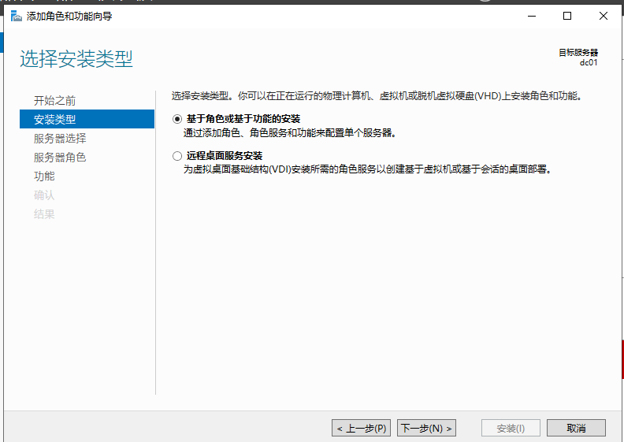
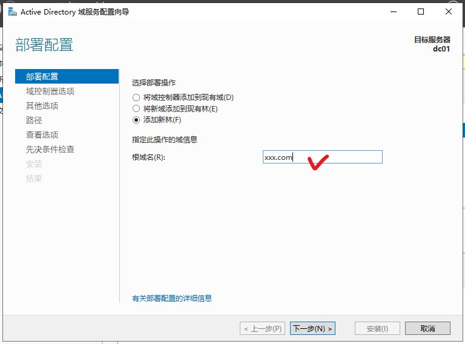

# 实验 3 创建一个Windows server 域的控制器

## 实验目的
1.掌握在windows server  中构建域控制器的方法。
2.掌握DNS服务的配置和使用

## 实验内容

1.在 windows server  2019中构建域控制器
2.设置DNS服务，并测试连通性 

## 实验步骤

1.打开windows server 2019 虚拟机。最好使用快照。

2.改变其虚拟机设置中的“网络适配器”为“vmnet 8”。

3.打开命令行，运行命令```ipconfig```，查看ip地址。假设为10.10.10.131. 打开网络适配器配置，配置IPv4为静态IP地址：10.10.10.230/24.


4.运行命令```sysdm.cpl```，找到计算机名称属性页，修改计算机名称为: dc01


5.单击“服务器管理器”——“添加角色和功能”。


6.选择安装类型为“基于角色或基于功能的安装”。



7.点“下一步”，选择“从服务器器池中选择服务器”，选择“dc01”。


8.点“下一步”，选择“服务器角色”为“Active Directory 域服务”，并添加所需功能。


9.点下一步，在AD域服务界面中，确认安装。


10.在服务器管理器中点击"AD DS",然后选“将此服务器提升为域控制器”


11.在“部署配置”中，选择“添加新林”，设置林根域名为“xxx.com”。

> 此林的名称，不能和对外服务的DNS域名相同。我们设服务器林的域名为：xxx.com，外部用户访问公司主机所用的域名为：abc.com。



12.设置域控制器选项，密码设为“Xxxx000”。


13.暂时不安装DNS。


14.点下一步，等待出现默认的BIOS名称，沿用之。


15.点下一步，等待AD默认数据库路径生成，不改变默认路径。


> 如果有多个硬盘，则建议将数据库与日志分别存放到不同的设备上。
> 如果使用了磁盘RAID，则不需要分开存储数据了，但数据不要放在windows系统分区上。


16.点下一步，检查先决条件是否满足。


17.点击“安装”。等待安装完成，期间会有系统重启。

18.检查DNS服务器内的记录是否完整。

> 域控制器会将自己扮演的角色注册到DNS服务器内，以便让其他计算机能够通过DNS服务器找到域控制器。所以检查DNS服务器内是否存在这些记录。

先点击“服务器管理器”左侧的“DNS".


然后，点击右键，选择“DNS管理器”


应该包含了_tcp、_udp等文件夹，其中还有_ldap记录。这表明dc01.xxx.com已经正确地注册为域控制器。


如果没有以上内容，则需要重启计算机管理-服务中的Netlogon服务，已完成注册。