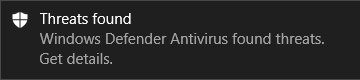

# 实验 4 Windows Defender 安全中心配置

## 实验目的

1.理解 Windows Defender 安全中心中的可设置项目；
2.掌握相关配置方法；
3.能够根据实际情况选配Windows本地安全策略。


## 实验内容

1.备份本地组策略

2.查看 Windows Defender 安全中心可用内容。 

3.使用组策略启用和配置防病毒保护和监视。

4.使用组策略启动云保护。

5.启用首次看到时阻止

## 实验步骤

一.备份本地组策略

1.打开系统盘下 Windows\System32，找到名称为GroupPolicy 和GroupPolicyUsers 文件夹。

2.将这两个文件夹备份（建立副本）。

二.查看 Windows Defender 安全中心可用内容。 

1.在Windows 10 的搜索框中，键入“ Windows Defender ”，选择 “Windows Defender 安全中心”点击打开。


2.查看上图中7个子内容，完成下列表格。

|模块名称|模块功能|列举其中的1~3个子功能|
|-|-|-|
|病毒和威胁防护|
|账户保护|
|防火墙和网络防护|
|应用和浏览器控制|
|设备安全性|
|设备性能和运行状况|
|家庭选项|

三、使用组策略启用和配置防病毒保护和监视

1.在windows 10 中运行命令```gpedit.msc```。

2.在组策略管理编辑器中, 转到 "计算机配置", 然后单击 "管理模板"。

3.将树展开到 Windows 组件 > Windows Defender 防病毒。

4.找到“实时保护-监视计算机上的文件和程序活动”，设置为“启动”。

Windows Defender 防病毒引擎会记录任何文件更改 (文件写入, 如移动、复制或修改) 和常规程序活动 (打开或运行的程序以及导致其他程序运行的程序)	启用。

5.将“实时保护-扫描所有下载的文件和附件”设置为“启动”

这个设置将自动扫描下载的文件和附件。 此操作不仅适用于 SmartScreen 筛选器, 它还会在下载之前和下载过程中扫描文件。

6.将“实时保护-打开进程扫描”，设置为“启动”

这个功能在“实时保护”停止时仍有效。可以独立启用 Windows Defender 防病毒引擎以扫描正在运行的进程以查找可疑的修改或行为。 

如果暂时禁用了实时保护, 并且希望自动扫描在禁用时启动的进程, 这将非常有用。

7.将“实时保护-开启行为监视”设置为“启动”。

AV 引擎将监视你终端结点上的文件过程、文件和注册表更改以及其他活动，查看是否存在可疑及已知恶意活动。

8.将“实时保护-开启原始卷写入通知”设置为“启用”。

关于原始卷写入的信息将由行为监视进行分析。

9.将“实时保护-定义下载的文件和要扫描的附件的最大大小”设置为“启用”

可以以千字节为单位定义大小。

10.将“实时保护-配置对传入和传出文件及程序活动的监视”设置为“已启用（两个方向）”。

指定是否应对传入和传出（或者除这两个方向之外的）文件进行监视。

这与 Windows Server 安装相关，其中你定义了仅在一个方向看到大量文件更改的特定服务器或服务器角色，并希望改进网络性能。 注意，网络上完全更新的终结点（和服务器）将几乎看不到性能影响，无论文件更改的数量或方向如何。

11.将“扫描-开启启发式保护”设置为“启用”。

启发式保护将在 Windows Defender 防病毒引擎要求检测活动之前禁用或阻止可疑活动。

12.将“根-允许反恶意软件服务以正常优先级启动”设置为“启用”。

可以降低 Windows Defender 防病毒引擎的优先级, 这在你希望以尽可能精益启动过程的轻型部署中可能很有用。 这可能会影响终结点上的保护。

13.将“根-允许反恶意软件服务始终保持运行”设置为“已禁用”。

如果已禁用保护更新, 你可以将 Windows Defender 防病毒设置为 "仍运行"。 这会降低终结点上的保护。


四.使用组策略启用云保护

1.在组策略管理计算机上, 打开组策略管理控制台，例如在本地Windows 10中运行命令```gpedit.msc```。

2.在组策略管理编辑器中，找到“计算机配置”，单击 "管理模板"。

3.将树展开到 “Windows 组件 > Windows Defender 防病毒 > MAPS”。

4.双击 "加入 MICROSOFT MAPS " 并确保已启用该选项, 并将其设置为 "基本地图" 或 "高级地图"。 单击确定。

5.如果需要进一步分析, 请双击 "发送文件示例", 确保该选项设置为 "已启用"。

6.测试是否能够连接到云。点击 https://aka.ms/ioavtest ，下载一个虚假的恶意程序并运行。


如果您已正确连接，您将看到 Windows Defender 防病毒程序（需要启动这个程序）发出的一条警告 Windows Defender 防病毒程序通知：



五.启用首次看到时阻止

首次看到时阻止是一项windows defender功能。


1.只要启用了基于云的保护和自动示例提交, 就会自动启用 "在首次看到时阻止"。

2.确认“首次看到时阻止”已在个别客户端上启用。通过单击任务栏中的盾牌图标打开 Windows 安全应用。

3.单击 "病毒 & 威胁防护" 图块 (或左侧菜单栏上的盾牌图标), 然后单击 "在病毒 & 威胁防护设置" 下的 "管理设置":确认基于云的保护和自动提交示例已切换为开。
