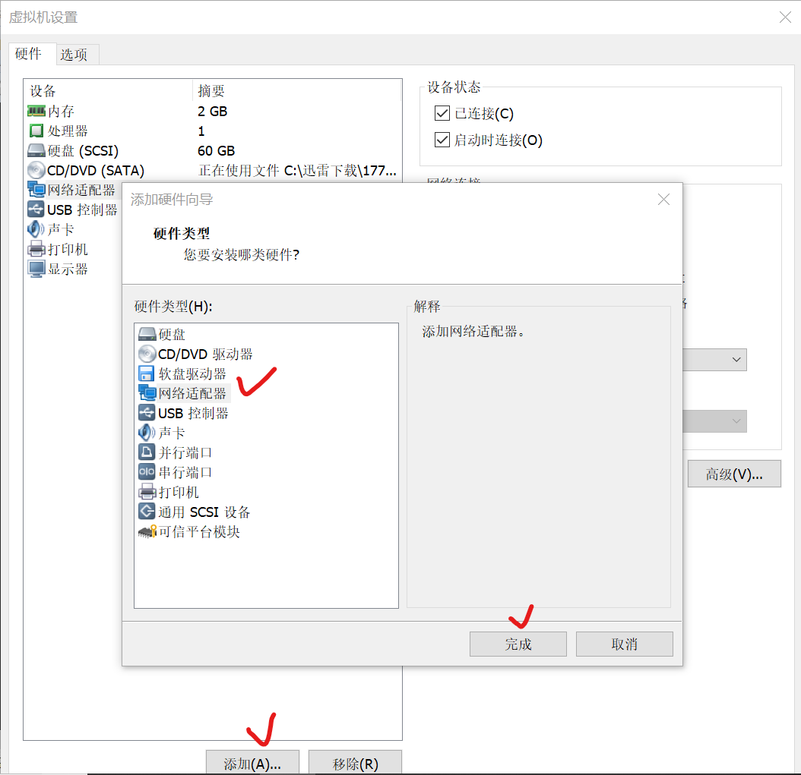
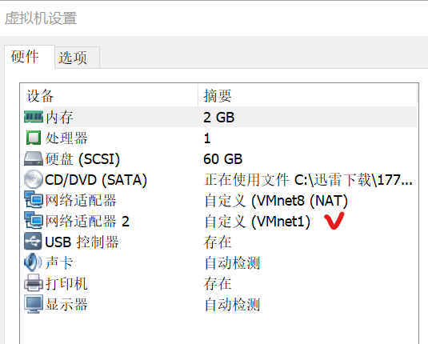
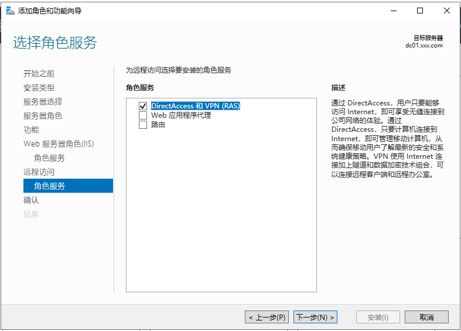
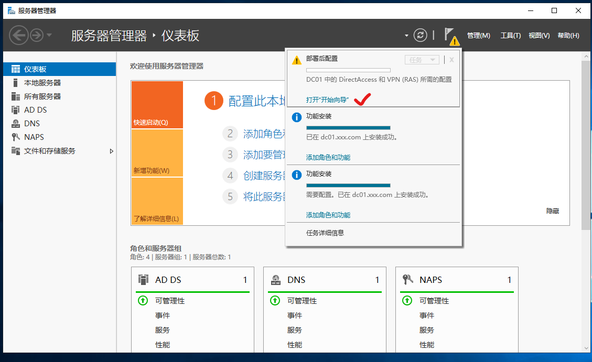
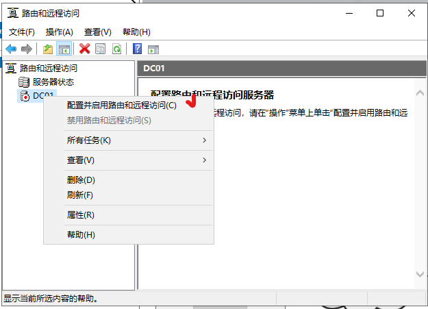
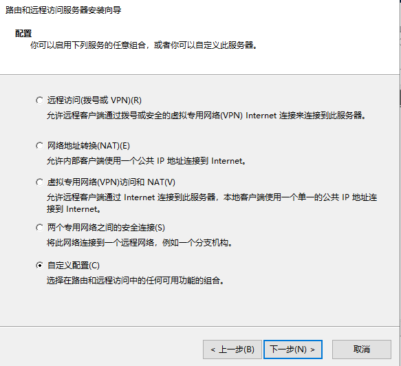
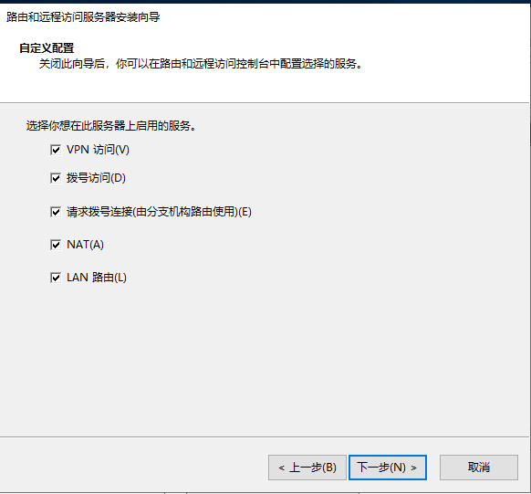
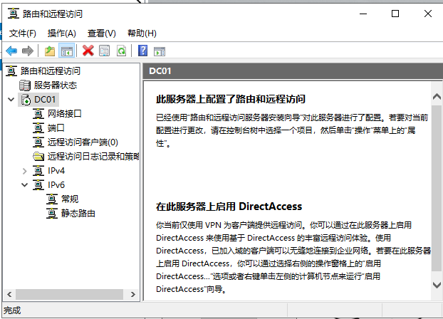
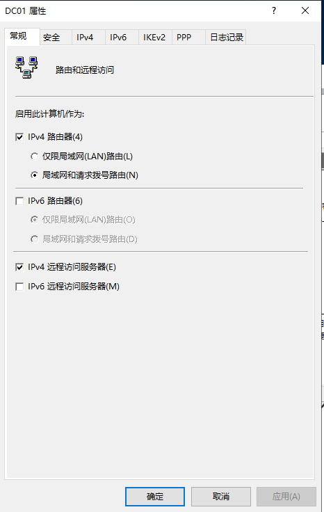
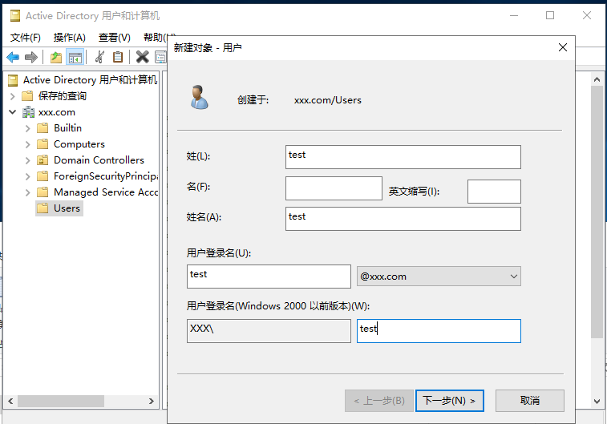

# 实验 5 搭建 Windows server 2019中的VPN 服务

## 实验目的

1.掌握虚拟专用网的概念和创建流程。

2.掌握路由和远程访问服务的配置操作。

3.掌握配置VPN访问账户。

## 实验内容

1.为 windows server  2019建立双网卡。

2.为该服务器添加Web IIS 服务。

3.配置路由和远程访问服务。

4.配置VPN访问用户

## 实验步骤

一.为windows server 2019 虚拟机增加网络适配器

1.打开vmware workstation，并尝试启动windows server 2019虚拟机。

2.打开该虚拟机的“虚拟机-设置”，然后点击“增加”按钮，选择“网络适配器”。然后点击“完成”。

3.将该虚拟机新建的“网络适配器2”的网络设置为“vmnet 1”，然后确定。

二.为该服务器添加Web IIS 服务

1.打开服务器管理器，添加角色和功能。

2.打开“添加角色和功能向导”对话框，点击“下一步”，选中“基于角色或基于功能的安装”按钮。

3.单击“下一步”按钮，选中“从服务器池中选择服务器”单选框，选择下方列出的服务器。

4.在“选择服务器角色”界面中，勾选“网络策略和访问服务”复选框。

5.此时会自动打开“添加网络策略和访问服务所需的功能”对话框，单击“添加功能”按钮。

6.点击“下一步”继续，其他设置按默认。

7.单击“下一步”按钮继续，显示网络策略和访问服务相关注意事项。一般地，默认即可。

8.点击下一步，注意勾选“网络策略服务器”。

9.单击“安装”，完成安装。

10.安装完成后，再次执行“添加角色和功能向导”对话框，点击“下一步”，选中“基于角色或基于功能的安装”按钮。

11.单击“下一步”按钮，选中“从服务器池中选择服务器”单选框，选择下方列出的服务器。

12.在“选择服务器角色”界面中，勾选“web服务器（IIS）”和“远程访问”。

13.后续过程一律按默认，直到出现下图所示选项时，选择“DirectAccess和VPN（RAS）".

14.点击“下一步”继续，然后点“安装”。

四.配置路由和远程访问服务

VPN的核心服务是路由和远程访问服务，并实现“数据的安全传输”。

1.重启服务器后，服务器管理器中会有告警提示（如下图），单击提示，点击“打开‘开始向导’”超链接。

2.选择“仅部署VPN”选项。然后在打开的路由和远程访问控制台，由于还未配置，所以服务器为红色状态。右键点击服务器名称，选择“配置并启用路由和远程访问”选项。如下图所示：

3.点击“下一步”继续，然后在“配置”页选择“自定义配置”。

4.勾选所有复选框。

5.点下一步，其他按默认，然后完成配置，然后“启用”服务。

四.配置VPN访问用户

1.右键点击路由和远程访问服务器，打开“属性”对话框，勾选“IPv4路由器”和“IPv4远程访问服务器”复选框。

2.选择“IPv4”选项卡，选择选择DHCP方式。然后点“确定”。

3.添加VPN访问用户。如果没有建立AD域，则在Windows server 2019中打开“管理工具”-“计算机管理”-“用户”处，右键单击增加用户，用户名设为“test”；如果建立了AD域，则在Windows server 2019中打开“管理工具”-“Active Directory 用户和计算机”中增加用户，用户名也为“test”。

4.打开test用户的用户属性页中，设置“拨入”选项卡，勾选网络访问权限中的“允许访问”。

5.勾选“分配静态IP地址”，设置为“192.168.10.150".

6.“确定”，关闭用户属性页。

7.检查VPN服务运行状况。在“服务”中，查看“Workstation”和“routing and remote access”两项服务是否开启。后者如要开启，则需要开启“remote process call”和“NETBIOSGroup”两项服务。

五.客户端访问VPN测试

1.在Windows 10中，打开控制面板-“网络和共享中心”，单击vpn。

2.在VPN设置页，“添加VPN",用户名为“test”，密码为你之前设置的密码，其他选项默认，VPN服务器IP地址为windows server 2019的IP地址，例如为：192.168.10.130.

3.进行连接测试。