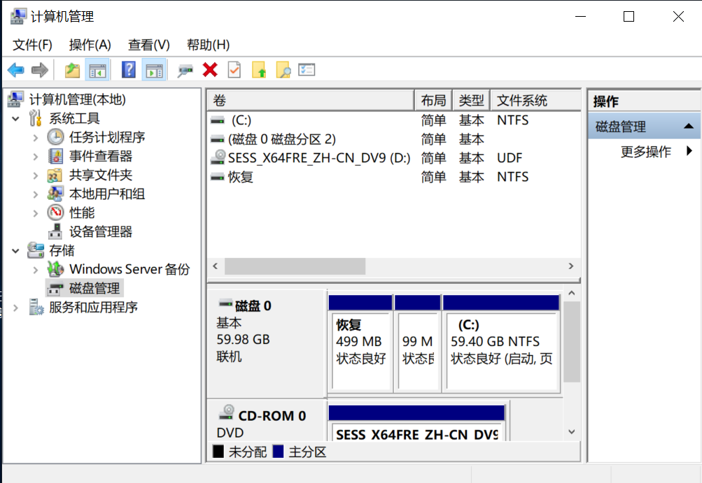
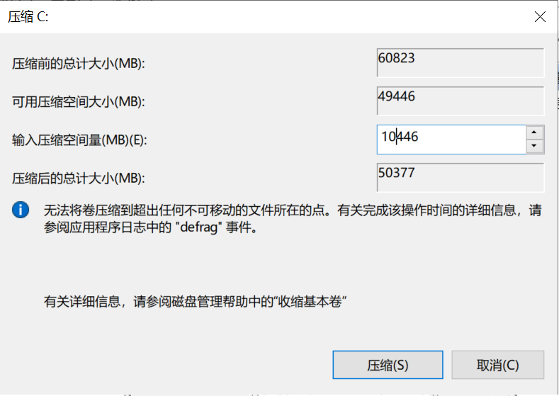
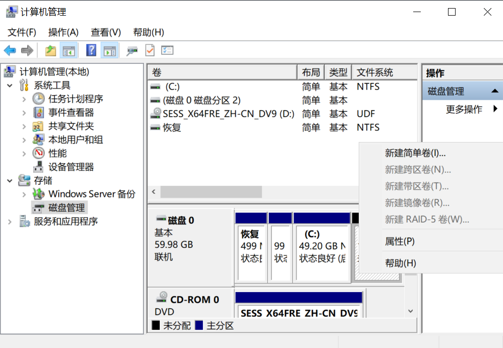
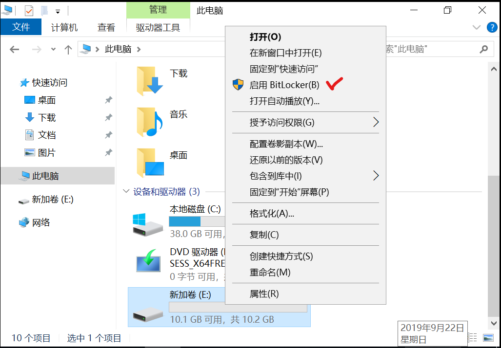
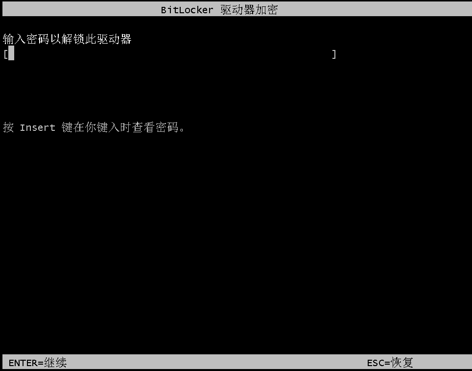

# 实验 6 使用BitLocker加密磁盘

## 实验目的

掌握Windows内置磁盘加密工具，保护数据机密性。

## 实验内容

1.在Windows server 2019中安装BitLocker功能。
2.将Windows server 2019虚拟机中原C盘划分为两个磁盘分区。
3.使用Bitlocker加密数据盘（卷）。
4.使用Bitlocker加密启动盘（卷）。

## 前置要求

请先使用虚拟机对原Windows server 2019虚拟机进行克隆，然后使用克隆版进行下列实验。

## 实验步骤

一.在Windows server 2019中安装BitLocker功能。

1.打开Windows Server 2019中的“服务器管理器”。

2.点击“添加角色和功能”，点击下一步继续，直到出现“添加功能”界面。

3.勾选“BitLocker 驱动器加密”复选框，然后开始安装。

4.安装完成后重启虚拟机Windows Server 2019。


二.将Windows server 2019虚拟机中原C盘划分为两个磁盘分区。

1.启动虚拟机后，打开“Windows 管理工具”-“计算机管理”-“磁盘管理”。



2.使用鼠标右键点击中间区域的“（C：）”，在弹出的快捷方式中选择“压缩卷”。

3.在弹出的设置对话框中，更改“输入压缩空间量（MB)”为10000，然后点“压缩”。



4.使用鼠标右键点击新产生的卷（无卷名），在弹出的选项中选择“新建简单卷”。



5.根据提示，各类选项均可使用默认选项，点击“下一步”，直至完成。

6.此时，新的卷（盘符可能为D或E）就生成了。之后可关闭“计算机管理”工具界面。

三.使用Bitlocker加密数据盘（卷）。

1.在“Windows资源管理器”中打开“此电脑”，使用鼠标右键点击新生成的卷，此处为E。可以在弹出的选项中找到“启用BitLocker”，点击它。



2.在新弹出的“bitlocker驱动器加密”对话框中，选择“使用密码解锁驱动器”，并输入一个符合复杂度要求的密码，然后点下一步。

3.选择“保存到文件”的方式来备份恢复密钥，然后将文件保存到Windows Server 2019的桌面上。

4.之后点“下一步”，选择“仅加密已用磁盘空间”，点击下一步。

5.选择“新加密模式”，点击下一步后，点“开始加密”。

6.之后，每次重启后，访问E盘都需要输入密钥或使用恢复密钥才能访问磁盘内容。请自行尝试。

四.使用Bitlocker加密启动盘（卷）。

1.在Windows Server 2019虚拟机中，按“win+R”，然后使用命令```gpedit.msc```打开组策略编辑器。

2.打开组策略编辑器中的“计算机配置”-“管理模板”-“Windows组件”-“BitLocker驱动器加密”。点击其中的“操作系统驱动盘”-“启动时需要附加身份验证”选项，选择其中的“已启用”，然后点“确定”。

3.在Windows Server 2019虚拟机中打开“Windows资源管理器”,然后点“此电脑”，使用鼠标右键点击存放操作系统的卷，此处为C。在弹出的选项中点击“启用BitLocker”。

4.点击“下一步”，直到“选择启动时解锁你的驱动器的方式”，选择“输入密码”。然后点输入一个符合复杂度要求的密码。

5.选择“打印恢复密钥”。然后将打印文件设为PDF方式，存放在桌面上，然后拷贝到非本虚拟机的位置上，例如USB盘。

6.然后点击多个“下一步”，按默认选项接受所有设置，完成加密。

7.系统重启后，可见下图：

