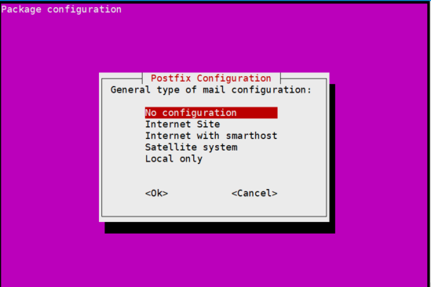
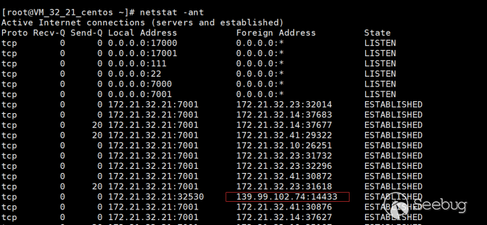
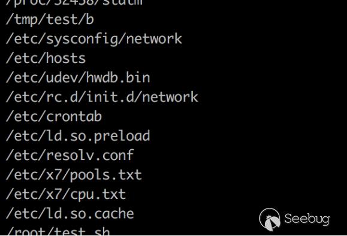

# 第11讲 Linux安全检测工具

本讲主要内容：
- Linux 后门检测工具
- Linux server 被攻击后的处理流程
- Linux server 入侵分析

## Linux 后门检测工具


在Linux系统中，可能存在着不止一种后门或木马，通常人们将它们分为：普通木马、rookit木马等。rookit木马更难被发现。

### rookit后门分类

这里我们主要分为两类：
- 文件系统级的rookit
- 内核级别的rookit

#### 文件系统级的rookit

这里rookit后门主要通过修改文件系统来隐藏自己。它会代替或修改合法文件，将合法文件作为外壳，内部隐藏着后门程序。

常被这类rookit利用的系统程序有：
- login（最易被替换，因为可以收集合法用户身份信息）
- ls
- ps
- ifconfig
- du
- find
- netstat等

如果以上文件都被替换，那么我们还能发现恶意代码么？显然就很困难了。

文件系统级的rookit，对系统维护威胁很大，**目前比较有效的方法是定期对重要文件的完整性进行检查。**

能够检查文件完整性的工具有很多，例如：
- Tripwire
- aide等

在服务器投入生产之处要建立检查基线，之后定期进行完整性检查与确认。

#### 内核级别的rookit

内核级别的rookit是更高级的入侵方式，它会使攻击者获得完整的控制权。


内核级别的rookit，依附在Linux内核上，不对文件进行任何修改，因此很难检查。

**目前对内核级的rookit没有很好的检查工具，只能在系统建设之处就做好防护规划，应用多层防护体系（P2DR 等模型的实现）来保护。**


---

这里介绍两个工具,帮助我们检测系统安全状态，发现后门：
- chkrootkit
- RKHunter

### Linux 后门检测工具 chkrootkit


Chkrootkit 是 Linux 下查找rookit后门的一个工具。http://www.chkrootkit.org/

#### 安装

- 对于 CentOS
```
sudo yum update
sudo yum -y install chkrookit
```

- 对于 Ubuntu
- 
```
sudo apt update
sudo apt install chkrookit
```

#### 基本命令

Chkrookit的使用比较简单，直接执行```sudo chkrookit```命令即可开始检测系统。


Usage: 
```/usr/sbin/chkrootkit [options] [test ...```

Options:
- -h , 显示帮助
- -V , 显示版本
- -l , 显示可用的测试
- -d , 调试（debug）
- -q , 安静模式
- -x , 专家模式
- -e , 排除已知的假正例样本文件或目录, quoted, space separated.
- -r dir , 以 dir 为根目录
- -p dir1:dir2:dirN 指定用于chkrootkit的额外命令目录
- -n ，跳过 NFS mounted 目录

#### 常见用例

##### chkrootkit如何检测一个中了木马的系统命令？

以检查login命令为例，运行命令```sudo chkrookit login```。


chkrootkit会在在中了木马的系统二进制文件中查找已知的“签名”。例如，某些中了木马的```ps```命令，可能会包含```/dev/ptyp```

当然，攻击者可以修改rootkit源代码，来更改其签名以避免chkrootkit检测。那么我们可以参考下一个问题。

##### chkrootkit可以检测修改过的（或新的）rootkit版本吗？

如果chkrootkit在文件中找不到已知签名，则它不能自动确定这个文件是否已被rookit修改过。

可以尝试以专家模式（-x 选项）运行chkrootkit。在这种模式下，用户可以检查二进制程序中可疑字符串，这些字符串可能帮助我们确定是否存在入侵行为。

例如，可以通过以下方式看到很多字符串数据：

```sudo chkrootkit -x | more```

系统命令中的路径名：

```sudo chkrootkit -x | grep '^/'```

##### chkrootkit可以使用的命令

chkrootkit脚本 使用以下命令：

awk，cut，echo，egrep，find，head，id，ls，netstat，ps，strings，sed，uname

##### 受感染的计算机上如何执行受信任的命令？

建议采用以下替代方法之一：

1.使用```-p path```选项为您信任的二进制文件提供备用路径：

```chkrootkit -p /cdrom/ bin```

2.将受感染机器的磁盘挂载到您信任的机器上，并使用```-r rootdir```选项指定新的rootdir ：

```chkrootkit -r /mnt```


##### 为了避免被入侵，要系统开放前对系统进行备份

可以运行以下步骤：

1.首先建立一个.commands隐藏文件。
```sudo mkdir /usr/share/.commands```

2.将chkrootkit使用的系统命令备份到这个目录
```sudo cp  `which  awk cut echo find grep id head ls netstat ps strings sed uname `  /usr/share/.commands``` 

```/usr/local/chkrootkit/chkrootkit -p /usr/share/.commands```

3.打包这个备份目录，并把它传到安全的介质中。
```cd /usr/share/```

```tar zcvf commands.tar.gz  .commands```

```rm -rf commands.tar.gz```

### Linux 后门检测工具 RKHunter

RKHunter是一个检查系统是否感染rootkit的专业工具之一，它通过一系列的脚本执行来确认系统。


RKHunter的主要功能有：
- 使用MD5校验测试，检查文件是否有改动
- 检测rookit使用的二进制和系统工具文件
- 检测特洛伊木马程序的特征码
- 检测常用程序的文件属性是否异常
- 检测系统相关的测试
- 检测隐藏文件
- 检测可疑的核心模块LKM
- 检测系统以启动的监听端口

#### 安装

对于 Ubuntu，使用下列命令可以安装rkhunter，目前版本是1.4.2。
```
sudo apt update
sudo apt install rkhunter
```

在配置邮件时，可以选择无配置或local only。


#### 使用

rkhunter命令后的参数很多，使用起来比较简单。

运行命令```rkhunter```，可以看到其参数。主要的有：
- ```-c，--check``` 必选参数，表示检查当前系统
- ```--configfile <file> ```,表示使用特定的配置文件
- ```--cronjob```，表示作为cron任务定期运行
- ```--sk, --skip-keypress```，表示自动完成所有检测，跳过键盘输入。
- ```--summary```，表示显示检测结果的统计信息。
- ```--update```，检测更新内容。
- ```-V, --version```，显示版本信息。

下面举例：运行命令```sudo rkhunter -c```

结果大致如下：


通常结果会分为几个部分：
- 第一部分，主要是进行系统命令的检查（主要是系统的二进制文件，这些文件最容易被rootkit攻击。）
  - 显示为“Checking system commands...”
- 第二部分，主要检测常见的rootkit程序。
  - 显示为“Checking system commands...”
- 第三部分，主要是一些特殊或附加的检测。例如：对rootkit文件或目录检测、对恶意软件检测以及对指定的内核模块检测。
- 第四部分，主要对网络、系统端口、系统启动文件、系统用户和组配置、SSH配置、文件系统等进行检查。
  - 显示为“Checking system commands...”
- 第五部分，主要是对应用程序版本进行检测
  - 显示为“Checking system commands...“
- 第六部分，主要是对上面结果的总结。


在Linux中使用rthunter来检查，每项的检查结果都使用不同颜色显示：
- 绿色表示没有问题
- 红色表示需要注意

如果需要每天运行，且不希望中间反复键入回车键，可以使用下列命令：
```sudo rkhunter --ckeck --cronjob```


## Linux server 被攻击后的处理流程

安全是相对的，防护再严格的服务器也有隐患，也可能被攻击。

**作为安全运维人员，需要把握的原则是：受到攻击之前，尽可能地做好防护、修复漏洞、减少攻击面；受到攻击之后，能够迅速阻断攻击，恢复系统，完善后续工作，最大限度降低攻击影响。**

### 系统被攻击后的一般处理过程（思路）

遭遇攻击不可怕，怕的是没有应对措施。

常见的应对策略或步骤有：
- 1.切断网络
  - 如果攻击来自于外部，断开服务器与外网的连接；
  - 如果攻击来自于内部，断开服务器与外网和内网的连接；

- 2.查找攻击源
  - 分析系统日志、登录日志，查看可疑信息
  - 查看系统开放端口、连接了哪些可疑程序

- 3.分析入侵原因和途径
  - 系统是否有漏洞？
  - 应用程序是否有漏洞？
  - 用户身份是否被滥用？

- 4.备份用户数据
  - 受到攻击后，要立刻备份服务器上的所有用户数据；
  - 同时查看这些数据是否存在着攻击源，若存在，必须彻底清除。
  - 将用户数据离线保存

- 5.重新安装系统
  - 不要高估自己的能力，最好重新安装系统，防止原系统嵌入rootkit。

- 6.修复程序或系统漏洞
  - 发现系统或软件漏洞后，首先要修复漏洞。
  - 没有修复前，系统不要上线。
  
- 7.恢复数据和连接网络
  - 将备份进行恢复(到新机器、新系统)
  - 以最小特权、最小供给面原则开启系统服务。
  - 连接网络，不断进行监测。

### 检查并锁定可疑账户

如果受攻击后，由于一些原因无法马上切断网络，那么只能先排查可疑账户了。

#### 1.列出所有登录过的系统用户。

通过root登录系统，执行```w```命令，可以显示登录过所有用户。

通过检查输出结果，发现可疑用户、陌生用户等。此外，还可根据用户名以及用户登录的源地址和它们正在运行的进程来判断它们是否为非法用户。

#### 2.锁定可疑用户

一旦发现可疑用户，就要马上将他们锁定。

假设有个用户叫nobody，被认为是可疑用户，他登录了系统（不应有此权限）。可疑执行下列命令锁定他。

```sudo passwd -l nobody```

锁定后，并不能阻断用户登录状态，所以需要执行下列命令强制其退出下线。根据```w```命令查看得到的用户登录进程pid值，例如为1221，进行如下操作：

```sudo ps -ef|grep @pts/3```

```kill -9 1221```

此后该用户就无法登录了。

#### 3.通过last命令查看用户登录事件

运行```last```命令可疑查找非授权用户的登录，但有经验的黑客会删掉last命令的信息来源```/var/log/wtmp```，来隐匿行踪。

即便如此，我们有时还是可以发现些有用信息。

### 检查系统日志

分析日志，是查找攻击最佳方法之一。

可以查看的系统日志包括：
- /var/log/messages
- /var/log/secure等
- 每个用户目录下的.bash_history


它们记录了软件的运行状态、远程用户的登录状态。

每个用户目录下的.bash_history，特别是root用户下的.bash_history中，记录着该用户执行的所有历史命令。

### 检查并关闭系统可疑进程

检查进程的命令，如```ps```， ```top```等不能显示进程的路径。

为查看进程路径可以下列方式进行：

- 首先，使用```pidof```命令，查看正在运行的进程PID.
  - 例如：```sudo pidof sshd```
- 然后，进入内存目录，查看对于PID目录下的exe文件信息(假设某个pid=18779)。
  - 例如：```sudo ls -al /proc/18779/exe```
- 此外，还可以句柄信息。
  - 例如：```sudo ls -al /proc/18779/fd```
  


这能看到任何进程的完整执行信息。

此外，还有一些命令可以用于检查分析，例如：```fuser ```，这个命令可以使用文件或sockets识别进程。

```fuser -n tcp 22```意味着检查tcp端口111 所连接的进程。


## Linux server 入侵分析

### 案例1

下面通过一个案例来介绍一个服务器被rootkit入侵后的处理思路和处理过程。rootkit攻击是Linux系统下最常见的攻击手段和攻击方式。

#### 受攻击现象

一台客户的门户网站服务器，托管在电信机房。客户接到电信的通知：由于此服务器持续对外发送数据包，导致100MB带宽耗尽，于是电信切断了此服务器的网络。

此服务器安装了CentOS 5.5版本的系统，对外开放了80, 22端口。

从客户那里了解到，网站的访问量并不大，所以带宽占用不会太高，而耗尽100MB的带宽是绝对不可能的。

那么极有可能是服务器遭受了流量攻击，于是登录服务器做详细的检测。

#### 初步分析

- 1.在电信人员的配合下通过交换机对该服务器的网络流量进行了检测，发现该主机确实存在对外80端口的扫描流量。

- 2.登录系统通过```netstat -an```命令对系统开启的端口进行检查。
  - 奇怪的是，没有发现任何与80端口相关的网络连接。

- 3.接着使用```ps -ef```, ```top```等命令。
  - 仍然没有发现任何可疑的进程，于是怀疑系统可能被植入了rootkit。
- 4.验证系统是否被植入了rootkit。
  - 我们将网站服务器下的```ps , top```等命令与之前备份的同版本可信操作系统命令进行md5sum校验；
  - 结果发现网站服务器下的这两个命令确实被修改过。

由此断定，此服务器已经被入侵、且安装了rootkit级别的后门程序。

#### 断网分析系统

1.由于服务器不停向外发包，因此，首先要做的就是将此服务器断开网络，然后分析系统日志。

这一步主要是寻找攻击源。但是由于系统命令已经被替换，如果继续在该系统上执行操作将变得不可信。

可以通过两种方法来避免这种情况：

- 第一种方法是将此服务器的硬盘取下来挂载到另外一台安全的主机上进行分析；
- 另一种方法是从一个同版本可信操作系统下复制所有命令到这台入侵服务器下某个路径，然后在执行命令的时候指定此命令的完整路径即可。

这里采用第二种方法。

2.查看系统的登录日志，查看是否有可疑登录信息，执行如下命令:

```more /var/log/secure | grey Accepted```

通过查看命令输出，有一条日志引起了我们的怀疑:
```Oct 3 03:10:25 webserver sshd[20701]:Accepted password for mail from 62.17.163.186 port 53399 ssh2```

这条日志显示在10月3日凌晨3点10分，有个mail账号从62.17.163.186这个IP成功登录了系统，mail是系统的内置账号，默认无法执行登录操作的，而经过查证62.17.163.186这个IP，是来自爱尔兰的一个地址从mail账号登录的时间来看，早于此网站服务器遭受攻击的时间。

3.接着查看系统密码文件```/etc/shadow```，又发现可疑信息:

```mail:$1$kCEd3yD6$WlevaYSBMPQIqfTwTVJiX1:15400:0:99999:7:::```

很明显，mail账号已经被设置了密码，并且被修改为可远程登录。之所以使用mail账号，猜想可能是因为入侵者想留下一个隐蔽的账号，以方便日后再次登录系统。

然后继续查看其他系统日志，如：
- /var/log/messages ，为空文件
- /var/log/wtmp，为空文件

均为空文件可见入侵者已经清理了系统日志文件，至于为何没有清空/var/log/secure文件，就不得而知了。

#### 寻找攻击源

到目前为止，我们所知道的情况是，有个mail账号曾经登录过系统，但是为何会导致此网站服务器持续对外发送数据包呢?

1.找到对应的攻击源

必须找到对应的攻击源，通过替换到此服务器上的```ps```命令，查看系统目前运行的进程，又发现了新的可疑:
```nobody   22765 1 6 Sep29 ? 4-00:11:58 .t```


这个.t程序是什么呢?

2.继续执行```top```命令，结果如下:

```
PID   USER   PR   NI   VIRT  RES   SHR  S   %CPU  %MEM  TIME+  COMMAND
22765 nobody 150 1790m 1362m 1228  S    98.3  91.5  2892:19  .t
```

从输出可知，这个t程序已经运行了4天左右，运行这个程序的是nobody用户，并且这个t程序消耗了大量的内存和CPU，这也是之前客户反映的网站服务器异常缓慢的原因根据这个输出，我们得到了t程序的进程PID为22765。接下来根据PID查找下执行程序的路径。

进入内存目录，杳看对应PID目录下exe文件的信息。
```
[root@webserver]#/mnt/bin/ls -al /proc/22765/exe
lrwxrwxrwx 1 root root 0 Sep2922:09 /proc/22765/exe -> /var/tmp/.../apa/t
```    

这样就找到了进程对应的完整程序执行路径，这个路径很隐蔽，由于/var/tmp目录在默认情况下任何用户可读，而入侵者就是利用这个漏洞在/var/tmp目录下创建了一个“…”的目录，而在这个目录下隐藏着攻击的程序源。进人/var/tmp/}/目录，发现了入侵者放置的一系列rootkit文件，列表如下:


通过分析这些文件，基本断定这就是我们要找的程序攻击源，其中:

- z程序是用来清除系统日志等相关信息的。
  - 例如执行:```./z 62.17.163.186```。
  - 在执行这条命令后，系统中所有与62.17.163.186有关的日志将全部被清除。   
- 在apa目录下有个后门程序t，这就是之前在系统中看到的程序在运行此程序后，此程序会自动读apa目录下的ip这个文件，而ip这个文件记录了各种ip地址信息。
  - 猜想这个t程序应该是去扫描ip文件中记录的所有ip信息，进而获取远程主机的权限。
  - 可见这个网站服务器已经是入侵者的一个肉鸡了。
- haha目录下放置的就是用来替换系统相关命令的程序，也就是说这个目录下的程序使我们无法看到操作系统的异常情况。
- login程序就是用来替换系统登录程序的木马程序，此程序还可以记录登录账号和密码。

#### 查找攻击原因
    
到这里为止，服务器上遭受的攻击已经基本清晰了，但是入侵者是如何侵入这台服务器的呢?

这个问题很重要，一定要找到入浸的根源，才能从根本上封堵漏洞。为了弄清楚入侵者是如何进入服务器的，需要了解下此服务器的软件环境。

- 此服务器是一台基于Java的Web服务器
- 安装的软件有Apache2.0.63
- Tomcat5.5
- Apache和Tomcat之间通过mod_jk模块进行继承
- Apache对外开放80端口

由于Tomcat没有对外开放端口，因此将问题集中到Apache上面。

通过查看Apache的配置发现：
- Apache仅仅处理些静态资源请求
- 而网页也以静态页面居多

所以通过网页方式入侵系统可能性不大。

既然漏洞可能来自于Apache，那么尝试查看Apache日志，也许能发现一些可疑的访问痕迹通过查看access.log文件，发现了如下信息:


至此.发现了漏洞的根源，原来是awstats.pl脚本中configdir的一个漏洞，通过了解此服务器的应用，客户确实是通过一个Awstats的开源插件来做网页访问统计，通过这个漏洞，攻击者可以直接在浏览器上操作服务器，例如：查看进程、创建目录等。

通过上面第二条日志，可以看出攻击者将正常浏览器执行切换到/var/tmp/.../haha目录的操作。

这个脚本漏洞很严重，不过在Awstats官方网站上已经给出了修补方法。修补方法较为简单，打开awstats.pl文件，找到如下信息：
```
if($QueryString = ~/configdir=([^&]+)/i)
{
    $DirConfig=&DecodeEncodedStrinq("$1");
}
```
修改为以下内容即可：
```
if($QueryString = ~/configdir=([^&]+)/i)
{
    $DirConfig=&DecodeEncodedStrinq("$1");
    $DirConfig=~tr/a-z0-9_\-|/\./a-z0-9_\-\?|./cd;
}
```
}

#### 揭开谜团

通过前而的逐步分析和介绍.对此服务器遭受入侵的原因和过程已经非常清楚了，大致过程如下:

- 1.攻击者通过Awstats脚本awstats.pl文件的漏洞进入系统，在/var/tmp目录下创建了隐藏目录，然后将rootkit后门文件传到这个路径下。

- 2.攻击者通过植入后门程序，获取了系统超级用户权限，进而控制了这台服务器，通过这台服务器向外发包。

- 3.攻击者的IP地址62.17.163.186可能是通过代理过来的，也可能是攻击者控制的其他肉鸡服务器。

- 4.攻击者为了永久控制这台机器，修改了系统默认账号mail的信息，将mail账号变为可登录，并且设置了mail账号的密码。
  
- 5.攻击者在完成攻击后，通过后门程序自动清理了系统访问日志，毁灭了证据。

通过对这个入侵过程的分析，发现入侵者的手段还是非常常见的，虽然入侵者删除了系统的一些日志，但还是留下了很多可查的踪迹其实还可以查看用户下的.bash_history文件，这个文件是用户操作命令的历史记录。

#### 恢复网站

由于系统已经文件被更改和替换，此系统已经变得完全不可信，因此建议备份网站数据，重新安装系统，基本步骤如下:
- 1.安装稳定版本的操作系统，删除系统默认且不需要的用户；
- 2.系统登录方式改为公钥认证方式，避开密码认证的缺陷；
- 3.安装更高版本的Apache和最新稳定版本的Awstats程序；
- 4.使用Linux下的tcp_ wrappers或iptables防火墙，限制SSH登录的源地址。

rootkit后门入侵攻击是Linux系统下比较常见的一种攻击手段，虽然此类攻击比较难以防范，但是目前已经有很多可以检测rootkit的工具，例如前面介绍过的RKHunter , chkrootkit等都可以用于检测系统是否感染rootkit。

### 案例2

#### 背景

云鼎实验室曾分析不少入侵挖矿案例，研究发现入侵挖矿行为都比较粗暴简单，通过 top 等命令可以直接看到恶意进程，挖矿进程不会被刻意隐藏；而现在，我们发现黑客开始不断使用一些隐藏手段去隐藏挖矿进程而使它获得更久存活，今天分析的内容是我们过去一个月内捕获的一起入侵挖矿事件。


#### 入侵分析

本次捕获案例的入侵流程与以往相比，没有特殊的地方，也是利用通用漏洞入侵服务器并获得相关权限，从而植入挖矿程序再进行隐藏。

通过对几个案例的分析，我们发现黑客主要是利用 Redis 未授权访问问题进行入侵，对于该问题的说明可以参考我们过去做的一些分析。

在服务器被入侵后，首先可以明显感觉到服务器的资源被占用而导致的操作迟缓等问题，通过一些常规手段可以发现一些异常信息，但又看不到进程信息：


通过 ```top``` 命令，可以看到显示的 CPU 使用率较低，但 ni 值为 100 ；同时通过 /proc/stat 计算 CPU 使用率又基本是 100% 。



通过 netstat 查看端口监听情况，也可以看到异常的连接。


通过在 Virustotal 查询 IP，可以看到 DNS 指向为矿池域名。

通过 find 命令查找入侵时间范围内变更的文件，对变更文件的排查，同时对相关文件进行分析，基本可以确认黑客使用的进程隐藏手法。




在变更文件里可以看到一些挖矿程序，同时 /etc/ld.so.preload 文件的变更需要引起注意，这里涉及到 Linux 动态链接库预加载机制，是一种常用的进程隐藏方法，而 top 等命令都是受这个机制影响的。

>在 Linux 操作系统的动态链接库加载过程中，动态链接器会读取 LD_PRELOAD 环境变量的值和默认配置文件 /etc/ld.so.preload 的文件内容，并将读取到的动态链接库进行预加载，即使程序不依赖这些动态链接库，LD_PRELOAD 环境变量和 /etc/ld.so.preload 配置文件中指定的动态链接库依然会被装载，它们的优先级比 LD_LIBRARY_PATH 环境变量所定义的链接库查找路径的文件优先级要高，所以能够提前于用户调用的动态库载入。——引自《警惕利用 Linux 预加载型恶意动态链接库的后门》

通过查看文件内容，可以看到加载一个 .so 文件：```/usr/local/lib/libjdk.so```