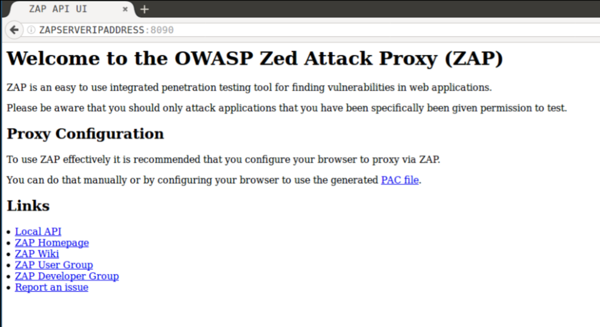
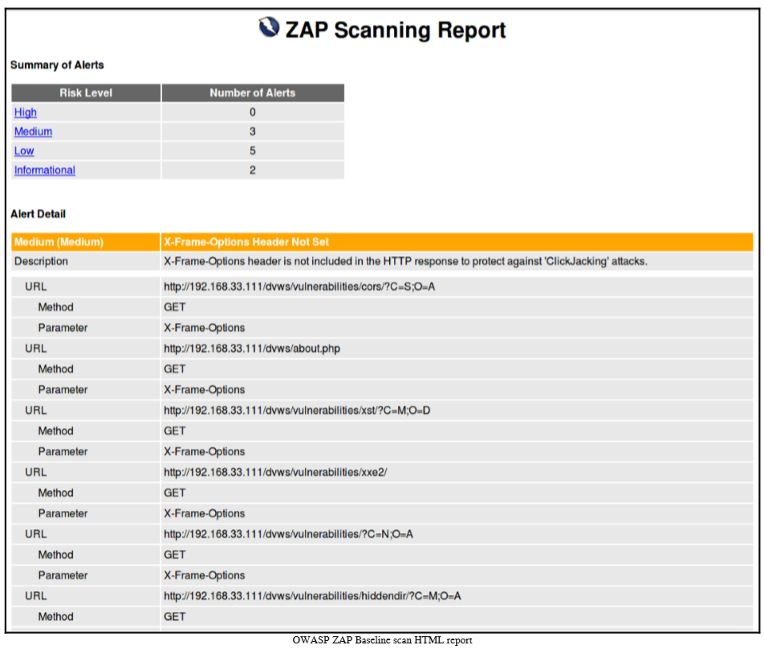

# 第 13 讲 系统自动化运维 1 

本讲主要内容：
- 构建集中式的病毒扫描机制

## 1 构建集中式的病毒扫描机制

安全是系统运维的根本要求。

目前运维工作中比较常见的作法有：
- 引入安全设备
- 提供人员安全意识
- 实施系统平台加固
- 讲安全规范融合到ITIL体系
- 关注最新漏洞
- 关注最新更新

我们这一节介绍使用Python等技术，自主构建集中式的病毒扫描机制。我们将借助的工具有：

- Clam AntiVirus 免费杀毒软件
- pyClamd 模块

### 1.1 pyClamd 模块介绍


#### 1.1.1 安装

可以使用下列命令：

```sudo apt install python3 python3-pip```

```sudo apt install python3```

```pip3 install pyclamd```

#### 1.1.2 模块介绍

pyClamd提供了两个关键类：
- ClamdNetworkSocket 类
  - 实现使用网络套接字操作clamd
- ClamdUnixSocket 类
  - 实现使用Unix套接字操作clamd

下面介绍 ClamdNetworkSocket 类中的方法：
- ```__init__(self,host='127.0.0.1',port=3310,timeout=None)```
  - 初始化方法
  - 用于建立与主机的连接
  - 配置应用/etc/clamd.conf文件中内容一致
- ```contscan_file(self,file)```
  - 实现扫描指定的文件或目录
  - file指明了文件、目录的路径

- ```multiscan_file(self,file)```
  - 实现多线程扫描
  - file为目录或文件路径
- ```scan_file(self,file)```
  - 实现扫描指定的文件或目录
  - file指明了文件、目录的路径
- shutdown()
  - 关闭clamd进程
- stats()
  - 获取当前状态
- reload()
  - 强制重载clamd病毒库
- EICAR()
  - 返回EICAR测试字符串，即生成具有病毒特征的字符串。


### 1.2 ClamAv


#### 1.2.1 安装

- Debian  

```apt-get update```

```sudo apt install clamav clamav-daemon``

- RHEL/CentOS  

```yum install -y epel-release```

```yum install -y clamav```

安装后可能需要重启系统。

#### 1.2.2 配置

打开配置文件：
```leo@ubuntu:~$ sudo nano /etc/clamav/clamd.conf ```

在文件中添加下列内容：

```
# Add some conf
TCPSocket 3310
TCPAddr localhost
```
保存退出后，重启系统。

可以测试是否3310端口打开了：
```
leo@ubuntu:~$ sudo netstat -an|grep 3310
[sudo] password for leo: 
tcp        0      0 127.0.0.1:3310          0.0.0.0:*               LISTEN     
tcp6       0      0 ::1:3310                :::*                    LISTEN
```

#### 1.2.3 ClamAv 应用

安装 ClamAv后，有3个可用的命令：
- clamscan
- clambc
- clamreport

##### clamscan

可以使用 ```clamscan```命令扫描某个文件或目录，以查杀病毒。

例如,扫描某个下载目录：
```clamscan -r --bell -i /home/leo/Downloads```

例如，扫描整个系统，当发现病毒时则删除病毒：
```clamscan -r --remove /```

例如，递归扫描某个目录，删除和报告感染病毒的文件
```clamscan --infected --remove --recursive /home```


#####  clambc

字节码测试工具。

### 1.3 简单试用

```python
>>> import pyclamd
>>> cd = pyclamd.ClamdAgnostic()
>>> cd.ping()
True
>>> print(cd.version().split()[0])
ClamAV
>>> print(cd.reload())
RELOADING
>>> print(cd.stats().split()[0])
POOLS:
>>> void = open('/tmp/EICAR','w').write(cd.EICAR())
>>> void = open('/tmp/NO_EICAR','w').write('no virus in this file')
>>> cd.scan_file('/tmp/EICAR')
{'/tmp/EICAR': ('FOUND', 'Eicar-Test-Signature')}
>>> cd.scan_file('/tmp/NO_EICAR') is None
True
>>> cd.scan_stream(cd.EICAR())
{'stream': ('FOUND', 'Eicar-Test-Signature')}
```

### 1.4 实现集中式病毒扫描

下面我们将编写 Python 代码，实现集中式病毒扫描管理，针对不同业务环境定制扫描策略，例如：
- 扫描对象
- 描述模式
- 扫描路径
- 调度频率等。

在用户目录下建立文件sample1.py:
```nano ~/sample1.py```

实践代码如下：
```python
#!/usr/bin/env python
# -*- coding: utf-8 -*-

import time
import pyclamd
from threading import Thread

class Scan(Thread):

    def __init__ (self,IP,scan_type,file):
        """构造方法"""
        Thread.__init__(self)
        self.IP = IP
        self.scan_type=scan_type
        self.file = file
        self.connstr=""
        self.scanresult=""


    def run(self):
        """多进程run方法"""

        try:
            cd = pyclamd.ClamdNetworkSocket(self.IP,3310)
            if cd.ping():
                self.connstr=self.IP+" connection [OK]"
                cd.reload()
                if self.scan_type=="contscan_file":
                    self.scanresult="{0}\n".format(cd.contscan_file(self.file))
                elif self.scan_type=="multiscan_file":
                    self.scanresult="{0}\n".format(cd.multiscan_file(self.file))
                elif self.scan_type=="scan_file":
                    self.scanresult="{0}\n".format(cd.scan_file(self.file))
                time.sleep(1)
            else:
                self.connstr=self.IP+" ping error,exit"
                return
        except Exception as e:
            self.connstr=self.IP+" "+str(e)


IPs=['10.10.10.1','10.10.10.129']
scantype="multiscan_file"
scanfile="~/Downloads"
i=1
threadnum=2
scanlist = []

for ip in IPs:

    currp = Scan(ip,scantype,scanfile)
    scanlist.append(currp)

    if i%threadnum==0 or i==len(IPs):
        for task in scanlist:
            task.start()

        for task in scanlist:
            task.join()
            print(task.connstr)
            print(task.scanresult)
        scanlist = []   
    i+=1
```


编写完成后保存。


进入python3，运行下列python脚本：

```python3```

```python

>>> import pyclamd
>>> cd = pyclamd.ClamdAgnostic()

>>> void = open('/tmp/EICAR','w').write(cd.EICAR().decode('utf-8'))

>>> quit()

```

运行下列命令插线生成的特征码文件内容：
```less /tmp/EICAR```

结果可能为：
```X5O!P%@AP[4\PZX54(P^)7CC)7}$EICAR-STANDARD-ANTIVIRUS-TEST-FILE!$H+H*```


运行下列命令执行：
```python3 sample1.py```

## 2 使用 Ansible 实现自动化运维与安全管理


参考资料：https://docs.ansible.com/ansible/latest/index.html

长久以来，IT 运维在企业内部一直是个耗人耗力的事情。随着虚拟化的大量应用、私有云、容器的不断普及，数据中心内部的压力愈发增加。传统的自动化工具，往往是面向于数据中心特定的一类对象，例如操作系统、虚拟化、网络设备的自动化运维工具往往是不同的。那么，有没有一种数据中心级别的统一的自动化运维工具呢？

答案就是 Ansible。

### 2.1 Ansible基本概念

Ansible是一款自动化运维工具，基于Python开发，集合了众多运维工具（puppet、cfengine、chef、func、fabric）的优点，实现了批量系统配置、批量程序部署、批量运行命令等功能。

Ansible 基于 Python 语言实现，由 Paramiko 和 PyYAML 两个关键模块构建。

### 2.2 Ansible 特点

- 部署简单，只需在主控端部署 Ansible 环境，被控端无需做任何操作。
- 默认使用 SSH（Secure Shell）协议对设备进行管理。
- 主从集中化管理。
- 配置简单、功能强大、扩展性强。
- 支持 API 及自定义模块，可通过 Python 轻松扩展。
- 通过 Playbooks 来定制强大的配置、状态管理。
- 对云计算平台、大数据都有很好的支持。
- 提供一个功能强大、操作性强的 Web 管理界面和 REST API 接口 —- AWX 平台。

### 2.3 Ansible 与 SaltStack：

最大的区别是 Ansible 无需在被监控主机部署任何客户端代理，默认通过 SSH 通道进行远程命令执行或下发配置。

相同点是都具备功能强大、灵活的系统管理、状态配置，都使用 YAML 格式来描述配置，两者都提供丰富的模板及 API，对云计算平台、大数据都有很好的支持。


### 2.4 基本功能

Ansible 能够管理哪些数据中心对象呢？通过查看 Ansible 的模块可知，它几乎支持数据中心的一切自动化，包括（不限于）：

- 操作系统层面：从 Linux（物理机、虚拟机、云环境）, Unix,到 Windows。
- 虚拟化平台：VMware、Docker、Cloudstack、LXC、Openstack 等。
- 商业化硬件：F5、ASA、Citrix、Eos 以及各种服务器设备的管理。
- 系统应用层：Apache、Zabbix、RabbitMQ、SVN、GIT 等。
- 红帽解决方案：Openshift、Ceph、GlusterFS 等，支持几乎所有红帽解决方案的一键部署和配置。
- 云平台：IBM Cloud、AWS、Azure、Cloudflare、Red Hat CloudForms、Google、Linode、Digital Ocean 、阿里云、华为云等。

### 2.5 Ansible 的组件
Ansible 的核心组件包括：
- Modules
- Inventory
- Playbook
- Roles 
- Plugins。

#### 2.5.1 Modules

Modules 就是使用 Ansible 进行自动化任务时调用的模块。在工作方时，Ansible 首先连接（默认通过 SSH）被管理节点（可能是服务器、公有云或、网络设备等），然后向这些节点推送 Modules、执行这些 Modules，并在完成后删除 Modules。Modules 是 Ansible 的核心。

举个例子：selinux - Change policy and state of SELinux。这个 Module 对的作用是配置配置 SELinux 模式和策略。

使用下列命令可以查看ansible在当前主机上的模块列表：
```ansible-doc -l```

使用下列命令可以查看模块使用帮助：
```ansible-doc 模块名称```

#### 2.5.2 Inventory

Inventory 是 Ansible 要管理对象的清单。在清单中，可以配置分组信息等，例如：

```
#Inventory 示例
[webservers]
www1.example.com
www2.example.com
 
[dbservers]
db0.example.com
db1.example.com
```

#### 2.5.3 Playbook

参考资料：https://docs.ansible.com/ansible/latest/user_guide/playbooks.html

Playbook 是Ansible的配置、部署和编排脚本（即自动化任务的脚本）。Playbook 通过YAML的格式描述您希望远程系统执行的一套运维实施策略或一般IT流程中的一系列步骤。

##### YAML
YAML的语法和其他高阶语言类似并且可以简单表达清单、散列表、标量等数据结构。

###### YAML对象

对象键值对使用冒号结构表示 key: value，冒号后面要加一个空格。也可以使用 key:{key1: value1, key2: value2, ...}。

还可以使用缩进表示层级关系；

###### YAML 数组
以 - 开头的行表示构成一个数组：

```yaml
- A
- B
- C
```

```yaml
companies:
    -
        id: 1
        name: company1
        price: 200W
    -
        id: 2
        name: company2
        price: 500W
```
意思是 companies 属性是一个数组，每一个数组元素又是由 id、name、price 三个属性构成。

数组也可以使用流式(flow)的方式表示：
```yaml
companies: [{id: 1,name: company1,price: 200W},{id: 2,name: company2,price: 500W}]
```

###### 示例
```yaml
name: tom
age: 21
gender: male
spourse:
    name: lily
    gender: female
children:
    - name: susan
      age: 2
      gender: feamle
    - name: sunny
      age: 10
      gender: male
```
###### 复合结构
数组和对象可以构成复合结构，例：
```yaml
languages:
  - Ruby
  - Perl
  - Python 
websites:
  YAML: yaml.org 
  Ruby: ruby-lang.org 
  Python: python.org 
  Perl: use.perl.org
```
转换为 json 为：
```json
{ 
  languages: [ 'Ruby', 'Perl', 'Python'],
  websites: {
    YAML: 'yaml.org',
    Ruby: 'ruby-lang.org',
    Python: 'python.org',
    Perl: 'use.perl.org' 
  } 
}
```

###### 纯量
纯量是最基本的，不可再分的值，包括：

- 字符串
- 布尔值
- 整数
- 浮点数
- Null
- 时间
- 日期

使用一个例子来快速了解纯量的基本使用：
```yaml
boolean: 
    - TRUE  #true,True都可以
    - FALSE  #false，False都可以
float:
    - 3.14
    - 6.8523015e+5  #可以使用科学计数法
int:
    - 123
    - 0b1010_0111_0100_1010_1110    #二进制表示
null:
    nodeName: 'node'
    parent: ~  #使用~表示null
string:
    - 哈哈
    - 'Hello world'  #可以使用双引号或者单引号包裹特殊字符
    - newline
      newline2    #字符串可以拆成多行，每一行会被转化成一个空格
date:
    - 2018-02-17    #日期必须使用ISO 8601格式，即yyyy-MM-dd
datetime: 
    -  2018-02-17T15:02:31+08:00    #时间使用ISO 8601格式，时间和日期之间使用T连接，最后使用+代表时区
```

###### 引用
& 锚点和< span class="marked">* 别名，可以用来引用:

```yaml
defaults: &defaults
  adapter:  postgres
  host:     localhost

development:
  database: myapp_development
  <<: *defaults

test:
  database: myapp_test
  <<: *defaults
```
相当于:

```yaml
defaults:
  adapter:  postgres
  host:     localhost

development:
  database: myapp_development
  adapter:  postgres
  host:     localhost

test:
  database: myapp_test
  adapter:  postgres
  host:     localhost
```
& 用来建立锚点（defaults），<< 表示合并到当前数据，* 用来引用锚点。

下面是另一个例子:
```yaml
- &showell Steve 
- Clark 
- Brian 
- Oren 
- *showell 
```
转为 JavaScript 代码如下:
```Json
[ 'Steve', 'Clark', 'Brian', 'Oren', 'Steve' ]

```

###### 其他

- 在YAML中，字符串不一定要用双引号标示。
- 在缩进中空白字符的数目并不是非常重要，只要相同层次结构的元素左侧对齐就可以（不过不能使用TAB字符）。
- 在文件中加入选择性的空行，以增加可读性。
- 在一个文件中，可同时包含多个文件，并用"---"分隔。
- 选择性的符号"..."可以用来表示文件结尾（在利用流的通信中，这非常有用，可以在不关闭流的情况下，发送结束信号）。

参考文献：https://yaml.org/

##### playbook核心组件

- tasks：任务
- variables：变量
- templates：模板
- handlers：处理器
- roles：角色

##### playbook示例

```yaml
#/root/first.yml
---
- hosts: webservers
  vars:
    http_port: 80
    max_clients: 200
  remote_user: leo
  tasks:
  - name: ensure apache is at the latest version
    yum:
      name: httpd
      state: latest
  - name: write the apache config file
    template:
      src: /srv/httpd.j2
      dest: /etc/httpd.conf
    notify:
    - restart apache
  - name: ensure apache is running
    service:
      name: httpd
      state: started
  handlers:
    - name: restart apache
      service:
        name: httpd
        state: restarted
```
说明：
- hosts 定义单个主机或组
- vars定义变量
- remote_user定义执行命令的远程用户
- tasks定义执行哪些命令
- handlers定义调用哪些处理器


一个playbooks文件中，可以包含多个playbook。
```yaml
---
- hosts: webservers
  remote_user: root

  tasks:
  - name: ensure apache is at the latest version
    yum:
      name: httpd
      state: latest
  - name: write the apache config file
    template:
      src: /srv/httpd.j2
      dest: /etc/httpd.conf

- hosts: databases
  remote_user: root

  tasks:
  - name: ensure postgresql is at the latest version
    yum:
      name: postgresql
      state: latest
  - name: ensure that postgresql is started
    service:
      name: postgresql
      state: started
```

##### 运行playbook

可以使用下列命令运行指定 playbook:
```shell
leo@ubuntu:~$ ansible-playbook playbook.yml
```

或者将playbook集成在自己的python代码中运行。

#### 2.5.4 Roles 

Roles 是将 Playbook 分成多个文件的主要机制。这简化了编写复杂的 Playbook，并使其更易于重用。通过 Roles 可以将 Playbook 分解为可重用的组件。

#### 2.5.5 Plugins。

Plugins 用于增强 Ansible 功能。Ansible 附带了许多方便的插件，如果这些插件不够，我们可以编写自己的插件。YAML文件扩展名通常为.yaml或者.yml

### 2.6 安装Ansible

执行以下命令安装Ansible。
```sudo yum install ansible```

或

```sudo apt install ansible```

执行以下命令查看安装的Ansible版本。

```ansible --version```

#### 2.6.1 aliyun 配置（可选）
如果有aliyun ecs，可以执行以下命令安装Ansible阿里云模块。

```sudo pip install ansible_alicloud```

当Ansible阿里云模块版本过低时，执行以下命令升级阿里云模块的版本。
```
sudo pip install footmark 
sudo pip install ansible_alicloud
```

执行以下命令配置访问密钥来访问阿里云资源。
```
export ALICLOUD_ACCESS_KEY="your_accesskey"
export ALICLOUD_SECRET_KEY="your_accesskey_secret"
```

关于如何生成访问密钥，请参见创建AccessKey。


### 2.7 Ansible 应用场景

下面介绍一个示例，展示如何通过调用 Ansible Modules 执安装 HTTP 并启动 HTTP 服务。此外，我们还会介绍如何调用 Ansible Roles 来执行自动化任务。

为了完成上述这个实验，我们最好额外创建3个虚拟机：
- webserver
  - Ubuntu server 1604 
  - apache2
- dbserver
  - Ubuntu server 1604 
  - mysql
- ansiblehost
  - ubuntu server 1604
  - ansible

#### 2.7.1 在Ansible主机上配置Inventory

我们将配置两个Group，一个是webserver，一个是databse。

可以通过下列命令查看文件，里面有很多Inventory示例：
```less /etc/ansible/hosts```

内容如下：
```
# This is the default ansible 'hosts' file.
#
# It should live in /etc/ansible/hosts
#
#   - Comments begin with the '#' character
#   - Blank lines are ignored
#   - Groups of hosts are delimited by [header] elements
#   - You can enter hostnames or ip addresses
#   - A hostname/ip can be a member of multiple groups

# Ex 1: Ungrouped hosts, specify before any group headers.

#green.example.com
#blue.example.com
#192.168.100.1
#192.168.100.10

# Ex 2: A collection of hosts belonging to the 'webservers' group

#[webservers]
#alpha.example.org
#beta.example.org
#192.168.1.100

# Ex 1: Ungrouped hosts, specify before any group headers.

#green.example.com
#blue.example.com
#192.168.100.1
#192.168.100.10

# Ex 2: A collection of hosts belonging to the 'webservers' group

#[webservers]
#alpha.example.org
#beta.example.org
#192.168.1.100
#192.168.1.110

# If you have multiple hosts following a pattern you can specify
# them like this:

#www[001:006].example.com

# Ex 3: A collection of database servers in the 'dbservers' group

#[dbservers]
#
#db01.intranet.mydomain.net
#db02.intranet.mydomain.net
#10.25.1.56
#10.25.1.57

# Here's another example of host ranges, this time there are no
# leading 0s:

#db-[99:101]-node.example.com
```

我们可以在其中设置如下内容：
```sudo nano /etc/ansible/hosts```

```
[webservers]
10.10.10.128

[dbservers]
10.10.10.130
```

下面配置 Ansible 主机到两台被管主机之间的无密码 SSH 互信。

- 在ansible host上运行下列命令:
  生成密钥对：
  ```ssh-keygen -t rsa -P '' -f ~/.ssh/id_rsa```
  将公钥传送到webserver和dbserver:
  ```ssh-copy-id -i ~/.ssh/id_rsa.pub  leo@10.10.10.128```
  ```ssh-copy-id -i ~/.ssh/id_rsa.pub  leo@10.10.10.130```


- 在webserver上运行下列命令：
  ```ssh-keygen -t rsa -P '' -f ~/.ssh/id_rsa```
  ```ssh-copy-id -i ~/.ssh/id_rsa.pub  leo@10.10.10.129```

- 在dbserver上运行下列命令：
  ```ssh-keygen -t rsa -P '' -f ~/.ssh/id_rsa```
  ```ssh-copy-id -i ~/.ssh/id_rsa.pub  leo@10.10.10.129```

之后，Ansible 可以与两台被管主机正常通讯。运行下列命令进行测试：

```leo@ubuntu:~$ ansible -m ping all```

正常时结果如下：
```
10.10.10.128 | SUCCESS => {
    "changed": false, 
    "ping": "pong"
}
10.10.10.130 | SUCCESS => {
    "changed": false, 
    "ping": "pong"
}
```

#### 2.7.2 调用 Ansible apt module 安装 httpd
为了在被管理的系统中执行操作，需要先建立sudo用户。

在ansible主机上，编辑ansible.cfg文件：
```sudo nano /etc/ansible/ansible.cfg ```

在文件中添加以下内容：
```
sudo_user = leo
```

在ansible主机上，编辑hosts文件：
```sudo nano /etc/ansible/hosts```

添加如下内容：
```
[test]
10.10.10.128 ansible_ssh_user=leo ansible_sudo_pass='123456'
10.10.10.130 ansible_ssh_user=leo ansible_sudo_pass='123456'
```

运行下列命令，执行Ansible模块：
```ansible webservers -b -m apt -a "name=apache2 state=present"```

说明：
- -b 表示无密码执行操作
- -m 表示指定运行的模块
- -a 后面追加着模块运行所需要的参数，上例表示安装apache2的最新版本。

运行命令后，结果大致如下：
```
"
10.10.10.128 | SUCCESS => {
    "cache_update_time": 0, 
    "cache_updated": false, 
    "changed": true, 
    "stderr": "", 
    "stdout": "Reading package lists...\nBuilding dependency tree...\nReading state information...\nThe following packages were  ...",
    ... 
        "Unpacking apache2 (2.4.18-2ubuntu3.14) ...", 
        "Processing triggers for ufw (0.35-0ubuntu2) ...", 
        "Processing triggers for systemd (229-4ubuntu21.1) ...", 
        "Processing triggers for ureadahead (0.100.0-19) ...", 
        "Processing triggers for man-db (2.7.5-1) ...", 
        "Setting up apache2 (2.4.18-2ubuntu3.14) ..."
    ]
}
```

上面的结果说明在远程web服务器中安装apache2成功了。下面安装dbservers。

运行下列命令，执行Ansible模块：
```ansible dbservers -b -m apt -a "name=mysql-server state=present"```

结果大致为：
```
10.10.10.130 | SUCCESS => {
    "cache_update_time": 0, 
    "cache_updated": false, 
    "changed": true, 
    "stderr": "", 
...
```

## 3 使用Ansible的自动化安全测试

在Ansible的支持下，我们可以将OWASP ZAP引入自动化运维，完成安全测试。

### 3.1 OWASP ZAP介绍

OWASP ZAP 全称 OWASP Zed Attack Proxy，是世界上最受欢迎的免费安全工具之一。ZAP可以帮助我们在开发和测试应用程序过程中，自动发现 Web应用程序中的安全漏洞。

#### 3.1.1 ZAP的工作原理

在安全性测试领域，安全性测试主要可以由以下几种测试策略来覆盖：
- 漏洞分析
  - 对系统进行扫描来发现其安全性隐患
- 渗透测试
  - 对系统进行模拟攻击和分析来确定其安全性漏洞
- 运行时测试
  - 终端用户对系统进行分析和安全性测试（手工安全性测试分析）
- 代码审计
  - 通过代码审计分析评估安全性风险（静态测试，评审）

ZAP主要是用于应用上述的第二种测试，即渗透性测试。

ZAP以架设代理的形式来实现渗透性测试。他将自己置于用户浏览器和服务器中间，充当一个中间人的角色，浏览器所有与服务器的交互都要经过ZAP，这样ZAP就可以获得所有这些交互的信息，并且可以对他们进行分析、扫描，甚至是改包再发送。

### 3.2 安装OWASP ZAP

#### 3.2.1 使用ansible playbook 安装 docker

下面的playbook用于在ubuntu中安装docker：

```yaml
- name: installing docker on ubuntu
  hosts: zap
  remote_user: "{{ remote_user_name }}"
  gather_facts: no
  become: yes
  vars:
  remote_user_name: ubuntu
  apt_repo_data: "deb [arch=amd64] https://download.docker.com/linux/ubuntu xenial stable"
  apt_gpg_key: https://download.docker.com/linux/ubuntu/gpg
  tasks:
    - name: adding docker gpg key
	  apt_key:
	  url: "{{ apt_gpg_key }}"
      state: present
    - name: add docker repository
      apt_repository:
      repo: "{{ apt_repo_data }}"
      state: present
    - name: installing docker-ce
      apt:
      name: docker-ce
      state: present
      update_cache: yes
    - name: install python-pip
      apt:
      name: python-pip
      state: present
    - name: install docker-py
      pip:
      name: "{{ item }}"
      state: present
      with_items:
        - docker-py
```

#### 3.2.2 OWASP ZAP Docker 容器安装

Ansible中有两个模块处理docker 容器：
- docker_image
- docker_container

下面这段playbook用于完成下载和安装 owasp zap 容器（大约1GB）。
```yaml

- name: setting up owasp zap container  
  hosts: zap  
  remote_user: "{{ remote_user_name }}"  
  gather_facts: no  
  become: yes  
  vars:    
    remote_user_name: leo    
	owasp_zap_image_name: owasp/zap2docker-weekly
  tasks:    
    - name: pulling {{ owasp_zap_image_name }} container        
	  docker_image:        
	    name: "{{ owasp_zap_image_name }}"
	- name: running owasp zap container      
	  docker_container:        
	    name: owasp-zap        
		image: "{{ owasp_zap_image_name }}"        
		interactive: yes        
		state: started        
		user: zap        
		command: zap.sh -daemon -host 0.0.0.0 -port 8090 -config api.disablekey=true -config api.addrs.addr.name=.* -config api.addrs.addr.regex=true
		ports:
          - "8090:8090" 
```

说明：
- ```api.disablekey=true``` , 意味着我们不使用任何 API key。这将覆盖指定API key。 

- ```api.addrs.addr.name=.*``` 和 ```api.addrs.addr.regex=true``` 意思是运行所有IP地址连接到 ZAP api。
- 更多的ZAP API KEY配置可以参考： https:/​/​github.​com/​zaproxy/​zaproxy/​wiki/​FAQapikey.

安装成功后，你可以登录zap 所在服务器的web页面：http://zapserver地址:8090



#### 3.2.3 Ansible 容器

之前我们使用docker 容器执行容器操作。ansible-container 提供了一套Ansible中心化工作流，用于构建、运行、测试和部署容器。

这个模块能够使用已有的playbooks构建、推送、运行容器，此外还能使用playbooks编写Dockerfiles、构建容器。

ansible-container 支持各种的编排工具，例如 Kubernetes 和 Openshift。它也可以推送构建好的镜像到私有注册地址（例如 google 容器注册器）或Docker Hub。

参考：https:/​/​docs.​ansible.​com/ ansible-​container.

#### 3.2.4 配置ZAP 基线扫描

ZAP 基线扫描时一个脚本，它包含在ZAP Docker容器中。https:/​/github.​com/​zaproxy/​zaproxy/​wiki/​ZAP-​Baseline-​Scan。

这个脚本包括：
- 对指定目标爬取1分钟，然后进行被动扫描。
- 默认情况下，报告所有的警告。
- 适合运行在CI（Continuous Integration，持续集成）/CD(Continuous Deployment，持续部署)环境下，也可以用在产品网站上。

##### 安装 DVWA Docker 容器

```yaml
- name: setting up DVWA container
  hosts: dvwa
  remote_user: "{{ remote_user_name }}"
  gather_facts: no
  become: yes
  vars:
    remote_user_name: leo
    dvwa_image_name: citizenstig/dvwa

  tasks:
    - name: pulling {{ dvwa_image_name }} container
      docker_image:
        name: "{{ dvwa_image_name }}"

    - name: running dvwa container
      docker_container:
        name: dvwa
        image: "{{ dvwa_image_name }}"
        interactive: yes
        state: started
        ports:
          - "80:80"
```

如果上面的playbook运行成功了，我们可以通过浏览器看到DVWA的界面。

##### 运行ZAP基线检查

下面我们将对DVWA网站进行基线检查。

可以运行下列playbook：

```yaml
- name: Running OWASP ZAP Baseline Scan  
  hosts: zap  
  remote_user: "{{ remote_user_name }}"  
  gather_facts: no  
  become: yes  
  vars:    
    remote_user_name: ubuntu    
	owasp_zap_image_name: owasp/zap2docker-weekly    
	website_url: {{ website_url }}    
	reports_location: /zapdata/    
	scan_name: owasp-zap-base-line-scan-dvws
  tasks:    
    - name: adding write permissions to reports directory      
	  file:        
	  path: "{{ reports_location }}"        
	  state: directory        
	  owner: root        
	  group: root        
	  recurse: yes        
	  mode: 0770
    - name: running owasp zap baseline scan container against "{{ website_url }}"      
	  docker_container:        
	    name: "{{ scan_name }}"        
		image: "{{ owasp_zap_image_name }}"        
		interactive: yes        
		auto_remove: yes        
		state: started        
		volumes: "{{ reports_location }}:/zap/wrk:rw"        
		command: "zap-baseline.py -t {{ website_url }} -r {{ scan_name }}_report.html"
    - name: getting raw output of the scan      
	  command: "docker logs -f {{ scan_name }}"      
	  register: scan_output
	- debug:        
	    msg: "{{ scan_output }}
```

扫描结果如下：


更多扫描应用参考：Security-Automation-with-Ansible-2.pdf


## 4 参考资料：
https://www.ibm.com/developerworks/cn/opensource/os-using-ansible-for-data-center-it-automation/index.html
