# 第2讲 Windows 中的访问控制

Windows 的安全机制中主要内容有：


本章节主要介绍第一部分，主要内容有：
- 身份标识SID
- 安全主体（security principals）
  - Windows 本地账户
  - Active Directory 账户
  - Microsoft 账户
  - Service 账户
  - Active Directory 安全组 
  - 特殊标识
- Windows基础概念：工作组、域和信任关系
- 用户访问控制UAC
- VPN
- Windows 身份验证

---

## 身份标识SID 


标识（identification，ID）是某个体系中相对唯一的编码，相当于是一种“身份证”。一般具有不变性、唯一性（排他性）。

例如：一对用户名和密码就是最为常见的身份标识方式。

### SID 的概念

Windows 中，安全标识符 (SID) 用于唯一标识安全主体或安全组。 SID是 Windows 安全模型的基础构建基块。 

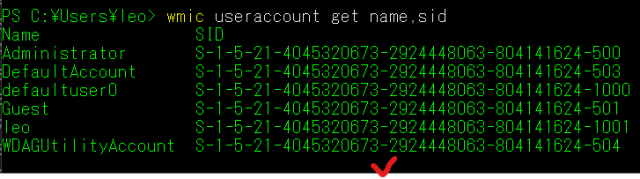

用户每次登录时, 系统都会为该用户创建访问令牌。 访问令牌包含：
- 用户的 SID
- 用户权限
- 用户所属的任何组的 Sid

### SID 标识的对象

Windows中的SID用于标识以下对象：
- 安全主体，即可以表示可由操作系统进行身份验证的任何实体。
  - 用户帐户
  - 计算机
  - 在用户或计算机帐户的安全上下文中运行的线程或进程。
- 安全组


### 安全标识符的工作原理

SID由 Windows 域控制器 或 本地 颁发，有唯一性，一旦发出则不可更改，它被存储在域安全数据库或本地SAM中。 

SID的生成机制：

1.操作系统在创建帐户或组时生成标识特定帐户或组的 SID。 

2.本地帐户或组的 SID 由计算机上的本地安全机构 (LSA) 生成, 并与其他帐户信息一起存储在注册表安全区域中。 

3.域帐户或组的 SID 由域安全机构生成, 并以用户或组对象的属性的形式存储在 Active Directory 域服务中。

4.任何两个帐户或组都不共享相同的 SID。

5.每个用户和组的SID都是唯一的，永远不会有两个相同的SID。


### 安全标识符体系结构

安全标识符是包含可变数目值的二进制格式的数据结构。 结构中的第一个值包含有关 SID 结构的信息。 剩余值按层次结构排列 (类似于电话号码), 并且它们标识 SID 颁发机构 (例如, "NT 机关")、SID 签发域以及特定安全主体或组。 下图说明了 SID 的结构。


下面为一个SID的例子：

```S-R-X-Y1-Y2-Yn-1-Yn```

|符号|含义|
|-|-|
|S	|指示字符串为 SID|
|R|	指示修订级别|
|X|	指示标识符授权机构值|
|Y|	表示一系列的 subauthority 值, 其中n是值的个数|    


说明： 
- SID 的最重要信息包含在 subauthority 值系列中。 
- 序列的第一部分 (-Y1-Y2-Yn-1) 是域标识符。 
- 企业中的任何两个域都不共享相同的域标识符，因此不同的安全主体有不同的SID。
- Subauthority 值系列中的最后一个项 (-Yn) 是相对标识符，它将一个帐户或组与域中的所有其他帐户和组区分开。
- 相对标识符在不同域中是共享的。

---

又例如：内置管理员组的 SID 以标准化的 SID 表示法表示, 如下字符串所示:

```S-1-5-32-544```.

此 SID 具有四个组件:
- S，表示这是一个SID
- 1，表示修订级别 (1)
- 5，表示符授权机构值 (5, NT 机构)
- 32，表示域标识符 (32, Windows本地内置)
- 544，表示相对标识符 (544、管理员)。

又例如：表示 Contoso域 (Contoso\Domain 管理员) 中的域管理员组的 SID:
```S-1-5-21-1004336348-1177238915-682003330-512```

说明:
- S，表示这是一个SID
- 1，表示修订级别为1
- 5，表示符授权机构 (NT 机构)
- 21-1004336348-1177238915-682003330, 表示Contoso域标识符
- 512，表示相对标识符 (域管理员)

---

### 本节实验操作

参考实验手册中实验：实验1 理解Windows的安全标识符（SID)

---
---

## 安全主体（security principals）

安全主体是可以通过操作系统进行身份验证的任何实体。每个安全主体在操作系统中由唯一的安全标识符 (SID) 表示。

例如：
- 用户帐户
- 计算机帐户
- 在用户或计算机帐户的安全上下文中运行的线程或进程
- 某些帐户的安全组。 

下面，我们具体介绍3个方面内容：
- 安全主体分类
- 安全主体工作原理
- 账户和安全组

---

### 安全主体分类

在 Windows 中, 可以启动操作的任何用户、服务、组或计算机都是安全主体。 

安全主体具有帐户, 该帐户可以是本地计算机或基于域的帐户。从作用范围上来看，可分为2类：

- 本地安全主体
- 域安全主体

#### 本地安全主体（本地用户帐户和安全组）

- 在本地计算机上创建, 用于实现本地资源的访问控制。
- 由本地计算机上的安全帐户管理器 (SAM) 管理。

#### 域中创建的安全主体（ActiveDirectory 对象）
- 由 Active Directory 域控制器创建
- 用于实现对域内资源的访问控制。 

---

### 安全主体的工作原理

下面，我们从几个方面来介绍安全主体的工作原理，其中包括：
- 授权与访问控制组件（Authorization and access control components）

#### 授权与访问控制组件

下图显示了 Windows authorization 和访问控制过程。


图中主要显示了以下信息：
- 图中的主体 Subject(由用户发起的进程) 尝试访问某个对象
- 客体/对象 Object, 例如共享文件夹。
- 用户的访问令牌。
- 访问控制项（ACE)，对象的安全描述符中的访问控制细节。

每一次访问，Windows都会将用户的访问令牌中的具体信息与具体ACE进行比较, 并做出访问决定。 安全主体的 Sid 在用户的访问令牌和对象的安全描述符中的 ACE 中使用。

总的来看，与安全主体（security principals）与下列组件共同构成windows 访问控制的机制：
- 安全标识SID
- 访问令牌（Access tokens）
- 安全描述和访问控制列表（Security descriptors and access control lists）
- 许可/权限（Permissions）

之前，我们已经介绍了SID，下面依次介绍：Access token，SDs，ACL，Permission。

---

#### 访问令牌（Access tokens）

访问令牌是包含SID、用户特权的对象。

用户令牌生成机制：

- 1.用户以交互方式登录或通过网络连接登录时，登录过程会对用户的凭据进行身份验证;
- 2.如果验证成功，则返回用户SID、用户安全组的SID列表，之后执行4；
- 3.如果验证失败，则要求重新登录或禁止访问；
- 4.本地安全机构(LSA)使用第2步的返回信息，创建访问令牌，令牌中包含：用户SID、用户权限列表（由本地安全策略规定）
- 5.在LSA创建主访问令牌后，令牌副本将附加到用户执行的每个线程和进程，它们在执行任何操作时都会被检查权限。
  - 主令牌：每个进程都有一个主令牌，描述与进程关联的用户账户上下文。
  - 令牌副本：存放于客户端、服务器，使线程能在安全上下文中运行。

---

#### 安全描述符和 访问控制列表（ Access Control Lists，ACL）

安全描述符是与每个安全对象相关联的数据结构。Windows根据安全描述符实现对安全对象的访问控制。

Active Directory中的所有对象以及本地计算机或网络上的所有安全对象都具有安全描述符。

具体某个安全对象的安全描述符，可用鼠标右键打开“属性”-“安全”-


也可以使用命令```get-acl```，在命令行查看：

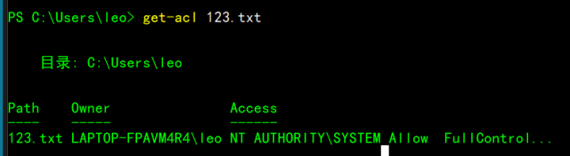


安全描述符包括内容有：
- 对象的所有者
- 谁可以访问它
- 可以何种方式访问
- 审核的访问类型

以上信息，构成了对象的访问控制列表（ACL），包含了应用于该对象的所有安全权限。

对象的安全描述符可以包含两种类型的ACL：
- 随机访问控制列表（DACL），用于标识允许或拒绝访问的用户和组。用于最基本的访问权限审查。
- 系统访问控制列表（SACL），用于控制如何审核访问。

---

#### 权限

Windows权限是允许每个安全对象的所有者允许谁可以对对象或对象属性执行操作的列表。

权限在安全体系结构中表示为访问控制条目（ACE）。

由于对象的所有者可以自行决定是否访问对象，因此Windows中使用的访问控制类型称为自主访问控制。

注意：权限与用户权限不同，权限附加到对象，用户权限适用于用户帐户。

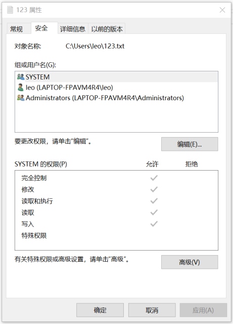


---

#### 身份验证中的安全上下文（Security context in authentication）

安全上下文，定义了用户或服务在某台计算机或某个网络上的标识和功能。 

例如：
- 可以访问的资源 (如文件共享或打印机)
- 可由用户、服务或该资源上的计算机执行的操作 (如读取、写入或修改)。

同一各账户，它的安全上下文在不同的计算机或网络里是不同的。

---

### 账户和安全组（Accounts and security groups)

前面提到2类安全主体，本地安全主体和域安全主体。
- 本地安全主体，即本地用户帐户和安全组
  - 在本地计算机上创建。
  - 可用于管理对该计算机上的资源的访问权限。 
  - 由本地安全帐户管理器 (SAM) 存储和管理。
- AD 帐户和安全组
  - 存储在 ActiveDirectory 数据库中
  - 使用 ActiveDirectory 工具进行管理
  - 这些安全主体是目录对象, 可用于管理对域资源的访问。

---

#### 用户账户（User Accounts）

用户账户唯一标识了使用计算机资源的人（或程序）。

访问系统资源，必须以某个用户登录，并受系统访问控制。

常见用户账户的管理有：

- 表示、识别和验证用户的身份。
- 授权（赋予或拒绝）资源访问
- 审计用户活动 

Windows 和 Windows Server 操作系统具有内置的用户帐户, 还可以创建用户帐户以满足组织的要求。

---

#### 安全组（Security groups)

安全组是用户帐户、计算机帐户和其他帐户组的集合, 这些帐户可以从安全角度作为单个单元进行管理。 

Windows预置的安全组，配置了权限，便于使用，还可以根据需要自定义安全组。

使用安全组管理访问控制的优势是:
- 简化管理
  - 可以同时向多个帐户分配一组常用的权限, 而不是单独分配给每个帐户。 
  - 当用户转移作业或离开组织时, 权限不会与用户帐户相关联, 从而使权限重新分配或删除更容易。
- 实现基于角色的访问控制模型。
  - 通过使用具有不同作用域的组来授予权限, 以便所需。 
  - Windows 中可用的范围包括本地、全局、域本地和通用。
- 最大限度地减少访问控制列表 (Acl) 的大小并加快安全性检查。
  - 安全组有自己的 SID，组 SID 可用于指定资源的权限。 
  - 在超过一千个用户的环境中, 使用单个用户帐户的 Sid 指定对某个资源的访问权限, 则该资源的 ACL 可能会变得难以管理。系统需要很长时间才能使完成检查权限。


以上是有关安全主体的全部内容。

---

接下来，我们学习Windows安全主体的具体构成：Windows本地账户、AD账户。

## Windows 本地账户

本地用户帐户存储在服务器本地。 

**本地用户帐户是用于保护和管理对独立服务器或成员服务器上的资源的访问权限的安全主体, 用于服务或用户。**

本地账户有以下几种：
- 默认本地用户账户
  - 管理员账户
  - 来宾账户
  - HelpAssistant账户
  - 默认账户
- 默认本地系统账户

---

### 默认本地用户账户（Default local user accounts）

默认本地用户帐户是内置帐户, 这些帐户是在安装 Windows 时自动创建的。

安装 Windows 后, 不能删除或删除默认本地用户帐户。

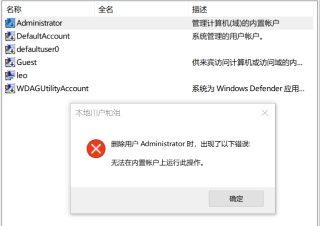

 此外, 默认本地用户帐户不提供对网络资源的访问权限。

有以下几类默认本地用户账户：
- 管理员账户
- 来宾账户
- HelpAssistant 帐户 (随远程协助会话一起安装)

---

#### 管理员账户（Administrator）

管理员账户，SID为``` S-1-5-域-500```，是在 Windows 安装期间创建的第一个帐户。

管理员帐户拥有本地计算机上的文件、目录、服务和其他资源的完全控制权限。 管理员帐户可以创建其他本地用户、分配用户权限和分配权限。 管理员帐户只需通过更改用户权利和权限即可随时控制本地资源。

默认管理员帐户不能删除或锁定, 但可以重命名或禁用。

在 Windows 10 和 Windows Server 20016 中, Windows 安装程序禁用内置管理员帐户, 并创建另一个属于管理员组成员的本地帐户。管理员组的成员可以使用提升的权限运行应用, 而无需使用 "以管理员身份运行" 选项。 

---

##### 安全注意事项

- 最好禁用管理员帐户, 以使恶意用户更难获得访问权限。
- 可以重命名管理员帐户。 但重命名的管理员帐户将继续使用同一个自动分配的安全标识符 (SID), 这些标识符可以由恶意用户发现。 
- 作为安全最佳做法, 请使用本地 (非管理员) 帐户登录, 然后使用 "以管理员身份运行" 来完成更高的权限级别的任务。 
- 不要使用管理员帐户登录到重要的计算机。
- 在 Windows 客户端操作系统上, 当多个用户作为本地管理员运行时, IT 人员无法控制这些用户或其客户端计算机。在这种情况下, 需要使用组策略来启用一些安全设置，自动控制本地管理员组权限。

---

#### 来宾账户(Guest)

默认情况下, 来宾帐户在安装时处于禁用状态。 

来宾帐户允许偶尔或一次性用户 (这些用户在计算机上没有帐户) 使用受限的用户权限暂时登录到本地服务器或客户端计算机。 

默认情况下, 来宾帐户具有空白密码。 

由于来宾帐户可以提供匿名访问, 因此存在安全风险。 

出于此原因, 将来宾帐户保留为禁用状态是最佳做法。

---

##### Guest组成员身份

默认情况下, 来宾帐户是默认来宾组 (SID S-1-5-32-546) 中的唯一成员, 允许用户登录到服务器。 

##### 安全注意事项

- 启用Guest时，仅授予有限的权力和权限。
- Guest用户不应在网络上使用，且不允许其他计算机访问。
- Guest用户不应能查看事件日志。
- 启用来宾帐户后, 最佳做法是经常监视来宾帐户, 以确保其他用户无法使用服务和其他资源。

---

#### HelpAssistant 账户

HelpAssistant 帐户是在运行远程协助会话时启用的默认本地帐户。 如果没有等待远程协助请求, 此帐户将自动禁用。

对于 "请求的远程协助", 用户通过电子邮件或文件向可提供帮助的人员发送来自其计算机 (通过电子邮件或文件) 的邀请。 接受用户的远程协助会话邀请后, 系统会自动创建默认的 HelpAssistant 帐户, 以使提供帮助的人员对计算机的访问权限有限。 HelpAssistant 帐户由远程桌面帮助会话管理器服务管理。

##### 安全注意事项

- 与默认HelpAssistant账户相关的SID包括：
  - SID: S-1-5 —<域>13, 显示名称终端服务器用户。 此组包括登录到启用了远程桌面服务的服务器的所有用户。
  - SID: S-1-5-<域>-，显示名称远程交互式登录。 此组包括使用远程桌面连接连接到计算机的所有用户。 该组是交互式组的子集。 包含远程交互式登录 SID 的访问令牌也包含交互式 SID。

对于 Windows Server 操作系统, "远程协助" 是默认情况下未安装的可选组件。 必须先安装 "远程协助", 然后才能使用它。

---

#### DefaultAccount

DefaultAccount,也称为默认系统托管帐户 (DSMA), 是 Windows 10 版本1607和 Windows Server 2016 中引入的内置帐户。 

DSMA 是Windows之前版本就有的用户帐户类型。 由于它可用于运行多用户感知或用户不可知的进程，所以可以把它视为它一种中立的用户帐户。

DSMA 具有周知的 503 RID。 因此, DSMA 的安全标识符 (SID) 将具有以下格式的SID: ```S-1-5-21-<ComputerIdentifier>-503```

DSMA是系统管理账户组（System Managed Accounts Group）的成员，这个组的SID为```S-1-5-32-581```。


DSMA账户和System Managed Accounts Group组是在计算机第一次启动Windows系统时，由安全账户管理器（SAM）自动创建的。

---

##### Windows如果使用DefaultAccount？

从权限角度来看, DefaultAccount 是标准用户帐户。 

- DefaultAccount 是运行多用户相关应用 (MUMA 应用) 所必需的；
- 这些MUMA程序不随某个用户登录而启动，也不随某个用户退出而停止；
- MUMA 应用始终运行，但会对登录设备和注销设备的用户做出响应。 
- MUMA 应用通过使用 DSMA 运行（以默认用户的权限执行操作）。

---

##### 域控制器上的DefaultAccount

如果域是通过运行 Windows Server 2016 的域控制器创建的, 则 DefaultAccount 将存在于域中的所有域控制器上。

##### 安全注意事项

Microsoft 不建议更改默认配置, 即使DefaultAccount处于禁用状态。 让帐户处于禁用状态不会产生安全风险。 


### 默认本地系统帐户（Default local system accounts）

可以这样理解：本地系统账户**作为Windows内核的代理人**（与user accounts不同）执行各种操作，受SAM的访问控制管理。

主要有下列几种SYSTEM Accounts：
- SYSTEM Accounts
- Network Service Accounts
- Local Service Accounts

---

#### SYSTEM 账户

SYSTEM 帐户由OS（Windows自己）和 Windows 中运行的服务（Services）使用。 

Windows中有许多服务和进程需要访问内核（或称在OS内部登录 ),例如在 Windows 安装期间。 

SYSTEM 帐户是一个内部帐户, 它不会显示在用户管理器中,也不能被添加到任何组。

但 SYSTEM 帐户在某个资源（如文件）属性的 "安全" 菜单部分可以看到。它拥有所有权限。

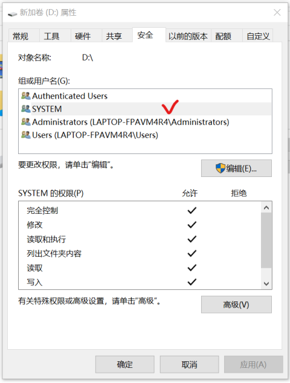

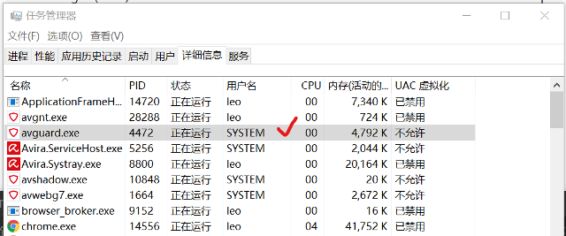

注意：Administor与SYSTEM不是一种用户。

---

#### NETWORK SERVICE 账户

NETWORK SERVICE 账户是个Windows 预定义本地系统账户，它由服务控制管理器 (SCM) 使用。

使用NETWORK SERVICE 账户运行的某个服务，可向远程服务器展示当前计算机的凭据。 

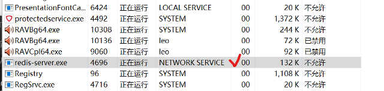

---

#### LOCAL SERVICE 账户

LOCAL SERVICE 账户也是一个预定义的本地账户，它用于服务控制管理器。

LOCAL SERVICE 账户具有访问呢本地计算机（windows）的最低权限, 在网络上显示为匿名凭据。 

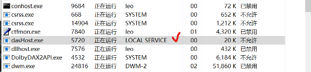

---

### 管理本地用户账户

Windows通过SAM实现对两类本地用户账户的管理：
- 默认本地用户帐户
- 本地用户账户（用户创建的，非默认的）

他们都存放在 "用户" 文件夹中。

常见的管理内容包括：
- 通过管理权限限制和保护本地帐户
- 强制执行远程访问的本地帐户限制
- 强制实施对远程访问的本地帐户限制
- 拒绝所有本地管理员帐户的网络登录
- 拒绝所有本地管理员帐户的网络登录
- 为具有管理权限的本地帐户创建唯一密码

下面详细说明。

---

#### 通过管理权限限制和保护本地帐户

管理员可以使用多种方法来防止恶意用户使用已盗用的凭据 (如盗用密码或密码哈希), 以便用于在另一台计算机上使用管理权限进行身份验证的计算机上的本地帐户。

可用于限制和保护具有管理权限的用户帐户的方法包括:
- 最简单的方法是尽量使用标准用户帐户登录到您的计算机, 而不是使用管理员帐户执行任务。
- 对远程访问强制执行本地帐户限制。
- 拒绝所有本地管理员帐户的网络登录。
- 为具有管理权限的本地帐户创建唯一密码。

后续讲义中，包含了上述内容的具体方法。如果已经禁用了本地所有管理员用户，则不适合使用下面的方法。

---

#### 强制执行远程访问的本地帐户限制

UAC 在程序需要执行管理员权限的操作时通知用户。可以使用命令```uac```，查看。


用户帐户控制 (UAC) 是 Windows 中已在 Windows Server2008 和 WindowsVista 中使用的安全功能。

UAC 使具有管理权限的帐户可以被视为标准用户非管理员帐户, 直到请求和批准完全权限 (也称为提升)。这样，用户在需要执行管理权限时才提升权限，而无需切换用户、注销或使用 "运行方式" 命令。

默认情况下, UAC 在应用程序尝试对计算机进行更改时，显示通知你, 但可以更改通知频率（见上图）。

---

### 本节实验操作

见实验手册：实验 2 Windows用户组查看与安全策略设置.md

---

## Active Directory 账户

当某个Windows server域控制器被建立且此域生成时，默认本地账户（Default local accounts）将被自动生成。同时，这些默认本地账户也将出现在Active Directory的用户容器中（user container）。

默认本地账户（Default local accounts）拥有访问域内资源的权限，这与仅能访问某个服务器的默认本地用户账户（Default local user accounts）是完全不同的。

AD中的默认本地账户（Default local accounts）包括：
- Administrator
- Guest
- KRBTGT，用于运行KDC(Key Distribution Center)
- HelpAssistant（如果运行远程协助会话时会建立）

> 有关域的知识，稍后介绍。

## Microsoft 账户

Microsoft 网站、服务和属性以及运行 Windows 10 的计算机可以使用 Microsoft 帐户作为标识用户的一种方法。

Microsoft 帐户以前称为 Windows Live ID。 它具有用户定义的密钥，由唯一的email地址和密码组成。

当某个用户以一个Microsoft账户登录时，当前设备将被连接到云服务，这样用户的设置、偏好、应用软件就可以通过云进行共享。

## Service 账户

服务帐户是显式创建的用户帐户, 用于为在 Windows Server 操作系统上运行的服务提供安全上下文。 安全上下文确定服务访问本地和网络资源的能力。

Windows 服务器上包括三种Service 账户：
- 独立托管服务帐户（Standalone managed service accounts）
- 组托管服务帐户（Group managed service accounts）
- 虚拟帐户（Virtual accounts）

### 独立托管服务帐户

托管服务帐户旨在隔离关键应用 (如 Internet 信息服务 (IIS)) 中的域帐户, 并消除管理员手动管理服务主体名称 (SPN) 和凭据的需要。

若要使用独立托管服务帐户, 安装了应用程序或服务的服务器必须至少运行 Windows Server 2008R2。

一个托管服务帐户可用于一台计算机上的服务。

托管服务帐户不能在多台计算机之间共享, 也不能用于在多个群集节点上复制服务的服务器群集中。

除了使特定服务拥有单个帐户，从而提高安全性外，设立独立托管服务帐户还有4个优势:

- 可以创建一类域账户，用于管理和维护多台本地计算机上的服务。
- 独立托管服务账户的密码使自动重设的，而不像域账户需要手工重设。
- 不需要完成复杂的SPN管理。
- 托管服务帐户的管理任务可以委派给非管理员。

### 组托管服务账户

组托管服务帐户是 Windows Server 2008R2 中引入的独立托管服务帐户的扩展。 

这些是托管域帐户, 可提供自动密码管理和简化的服务主体名称 (SPN) 管理, 包括向其他管理员委派管理。

组托管服务帐户提供与域中的独立托管服务帐户相同的功能, 但它将该功能扩展到多台服务器。 当连接到服务器场中托管的服务 (如网络负载平衡) 时, 支持相互身份验证的身份验证协议要求所有服务实例使用同一主体。 当组托管服务帐户用作服务主体时, Windows Server 操作系统管理帐户的密码, 而不是依赖于管理员管理密码。

Microsoft 密钥分发服务 (kdssvc) 提供了使用 Active Directory 帐户的密钥标识符安全地获取最新键或特定密钥的机制。 此服务是在 Windows Server 2012 中引入的, 它不会在以前版本的 Windows Server 操作系统上运行。 密钥分发服务共享用于为帐户创建密钥的机密。 这些密钥会定期更改。 对于组托管服务帐户, 除了组托管服务帐户的其他属性之外, 域控制器还会计算密钥分发服务提供的密钥上的密码。

### 虚拟账户

虚拟帐户是在 Windows Server 2008R2 和 Windows 7 中引入的, 并且是托管的本地帐户, 可提供以下功能来简化服务管理:
- 虚拟帐户是自动管理的。
- 虚拟帐户可以在域环境中访问网络。
- 无需密码管理。 

以虚拟帐户身份运行的服务使用```<domain_name>\<computer_name>$```格式的计算机帐户凭据访问网络资源。

## Active Directory 安全组 

> Active Directory 安全组常见于Windows Server 2016之中。

之前，我们已经介绍了这些在Windows server中的多个内建（自带）账户。下面我们介绍Windows server中的内建安全组。

安全组（Security groups）用于用户账户、计算机账户等的集中管理。Windows server内建安全组预设了权限，实现了有效的访问控制。

为了理解AD上的安全组，有两方面基础概念，我们需要知道：

1.Windows server 的AD中，有两种形式的常见安全主体：
- 用户账户（user accounts），表示物理实体“人”。
  - 用户账户也可以作为服务账户（Service account），表示物理实体“程序”
- 计算机账户（computer accounts），表示物理实体“计算机”。

2.对于AD，有两类管理职责：
- 服务管理员（Service administrators），负责维护和提供AD域服务（AD DS），包括管理域控制器和配置AD DS。
- 数据管理员（Data administrators），负责维护存储在AD DS中的数据，以及在域成员服务器或工作站上的数据。

### 两类 AD 安全组 

为了实现集中用户管理、分配工作职责、设立一致的安全准则，Windows server预设了2类AD安全组：
- 通信组（Distribution groups），用于生成 email 通信列表（distribution lists）。
  - 仅使用 email 应用（如 Exchange server）发送邮件给各组用户。
  - 通信组不考虑安全性
  - 不能被列在随机访问控制列表中（DACL)。
- 安全组（Security groups），用于给共享资源分配权限（assign permissions）。在安全组中可以有两类操作：
  - 1.分配用户权力（Assign user rights）
    - 在AD中，为安全组分配用户权限，即指明哪个组中用户可以在某个域或森林中访问资源。
    - 安装 ActiveDirectory 时, 系统会自动为某些安全组分配用户权限, 以帮助管理员在域中定义人员的管理角色。
    - 例如, 在 ActiveDirectory 中添加到 "备份操作员" 组的用户可以备份和还原位于域中每个域控制器上的文件和目录。
  - 2.分配资源访问权限（Assign permissions）。
    - 权限不同于用户权力。
    - 用户权力是指用户的作用域或访问范围（某个域、某个林、某个服务器...)
    - 权限指：（1）谁可以访问资源（2）访问级别。
    - 设置在域对象上的权限，有些可以自动分配给一定级别的安全组。这些权限在DACL中列出。

### AD 组（Groups）的作用域（scope）

组的作用域：指某个组能在什么范围内被授予权限（permission）。

有3类作用域：
- Universal
- Global
- Domain Local

### 默认安全组

默认组 (如 "域管理员" 组) 是创建 ActiveDirectory 域时自动创建的安全组。 你可以使用这些预定义组来帮助控制对共享资源的访问, 并委派特定域范围的管理角色。

默认安全组一般位于 AD用户和计算机的两个文件夹内：
- buildin，用于存放那些在域本地域（domain local scope）中的组。
- usesrs，用于存放定义在全局域（global scope）中的组和定义在域本地域（domain local scope）中的组。

某些管理组和这些组的所有成员都受后台进程的保护, 该进程定期检查并应用特定的安全描述符。 安全描述符存放在AdminSDHolder对象中，它包含与受保护对象关联的安全信息的数据结构。

常见的AD默认安全组有：

- Access Control Assistance Operators
- Account Operators
- Administrators
- Allowed RODC Password Replication Group
- Backup Operators
- Certificate Service DCOM Access
- Cert Publishers
- Cloneable Domain Controllers
- Cryptographic Operators
- Denied RODC Password Replication Group
- Device Owners
- Distributed COM Users
- DnsUpdateProxy
- DnsAdmins
- Domain Admins
- Domain Computers
- Domain Controllers
- Domain Guests
- Domain Users
- Enterprise Admins
- Enterprise Key Admins
- Enterprise Read-only Domain Controllers
- Event Log Readers
- Group Policy Creator Owners
- Guests
- Hyper-V Administrators
- IIS_IUSRS
- Incoming Forest Trust Builders
- Key Admins
- Network Configuration Operators
- Performance Log Users
- Performance Monitor Users
- Print Operators
- Protected Users
- RAS and IAS Servers
- RDS Endpoint Servers
- RDS Management Servers
- RDS Remote Access Servers
- Read-only Domain Controllers
- Remote Desktop Users
- Remote Management Users
- Replicator
- Schema Admins
- Server Operators
- Storage Replica Administrators
- System Managed Accounts Group
- Terminal Server License Servers
- Users
- Windows Authorization Access Group
- WinRMRemoteWMIUsers_

具体的 ，可以参考https://docs.microsoft.com/en-us/windows/security/identity-protection/access-control/active-directory-security-groups。

## 特殊标识（Special Identities）

特殊标识组与 "Users" 和 "buildin" 中列出的 AD 安全组类似。

特殊标识用来分配对网络中资源的访问权限。 通过使用特殊标识组可以：
- 分派用户权力(user rights) 给AD中的安全组。
- 分派权限（permissions）给某个安全组。

常见的特殊标识（特殊的SID)有：

- 匿名登录
- 已验证用户
- 批处理
- 创建者组
- 创建者所有者
- 拨号
- 摘要式身份验证
- 企业域控制器
- 所有人
- 交互式
- 本地服务
- 系统
- 网络
- 网络服务
- NTLM 身份验证
- 其他组织
- Principal Self
- 远程交互式登录
- 限制
- SChannel 身份验证
- 服务
- 终端服务器用户
- 此组织
- Window Manager\Window 管理器组

## 用户账户控制（User Account Control, UAC)

用户帐户控制 (UAC) 是 Microsoft 的总体安全构想的基本组件。

用户帐户控制 (UAC) 有助于防止恶意软件损坏电脑，并且有助于组织部署易于管理的桌面。

UAC控制下，应用和任务将始终在非管理员帐户的安全上下文中运行，除非管理员专门授予管理员级别的访问系统权限。 UAC 可阻止自动安装未经授权的应用并防止意外更改系统设置。

### UAC 工作原理

#### UAC 进程和交互

每个需要执行管理员权限操作（需要administrator access token ）的程序都必须显示确认（弹出对话框）。但子程序可以继承父程序的访问令牌。

UAC控制着下列过程：
- 登录过程
- 用户权力审查
- 权限审查

登录过程简介：


默认情况下, 标准用户和管理员访问资源并在标准用户的安全上下文中运行应用。 当用户登录到计算机时, 系统会为该用户创建访问令牌。 访问令牌包含有关用户授予的访问权限级别的信息, 包括特定的安全标识符 (Sid) 和 Windows 权限。

当管理员登录时, 将为用户创建两个单独的访问令牌: 
- 标准用户访问令牌
  - 标准用户访问令牌包含与管理员访问令牌相同的特定于用户的信息, 但会删除管理 Windows 权限和 Sid。
  - 标准用户访问令牌用于启动不执行管理任务 (标准用户应用) 的应用。 
  - 使用标准用户访问令牌显示桌面 (explorer .exe)。 Explorer 是父进程, 所有其他用户启动的进程都将继承其访问令牌。
  - 所有应用都作为标准用户运行, 除非用户提供同意或凭据来批准应用以使用完整的管理访问令牌。
- 管理员访问令牌。  


使用标准用户访问令牌时, 作为管理员组成员的用户可以登录、浏览 Web 和阅读电子邮件。 当管理员需要执行需要管理员访问令牌的任务时, Windows10 会自动提示用户进行审批。 此提示称为提升提示, 其行为可通过使用本地安全策略管理单元 (Secpol) 或组策略进行配置。 有关详细信息, 请参阅用户帐户控制安全策略设置。

同意和凭据提示

启用 UAC 后, 在启动需要完全管理员访问令牌的程序或任务之前, Windows10 会提示同意或提示输入有效的本地管理员帐户的凭据。 此提示可确保不会自动安装恶意软件。

许可提示

当用户尝试执行需要用户的管理访问令牌的任务时, 将显示 "同意" 提示。 下面是 UAC 同意提示的示例。


当标准用户的操作，需要用户的管理访问令牌时，windows会弹出下列提示：
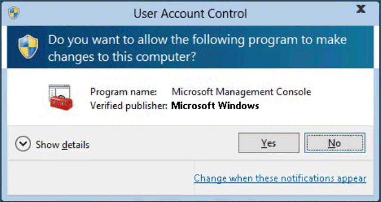

凭据提示

当标准用户尝试执行需要用户的管理访问令牌的任务时, 将显示凭据提示。 管理员还可以通过设置用户帐户控制来提供其凭据 : 管理员批准模式策略设置值中管理员的提升提示行为, 以提示输入凭据。

下面是 UAC 凭据提示的示例。


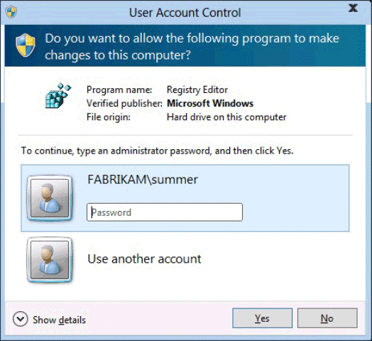

UAC 提升提示

UAC 提升提示具有特定于应用的颜色编码, 从而能够立即识别应用程序的潜在安全风险。 当应用尝试使用管理员的完整访问令牌运行时, Windows10 首先分析可执行文件以确定其发布者。 根据文件的发布者: Windows10、publisher 已验证 (已签名) 和 publisher 未验证 (无符号), 应用首先分为三个类别。 下图演示了 Windows10 如何确定向用户显示哪种颜色提升提示。

提升提示的颜色编码如下所示:

- 红色背景, 红色盾牌图标: 应用被组策略阻止或来自被阻止的发布者。
- 蓝色背景, 带有蓝色和金色盾牌图标: 应用程序是 Windows10 管理应用程序, 如 "控制面板" 项目。
- 蓝色背景, 带有蓝色盾牌图标: 应用程序使用 Authenticode 签名, 并且受本地计算机信任。
- 黄色背景, 黄色盾牌图标: 应用程序未经签名或已签名, 但尚未被本地计算机信任。

### UAC体系结构

下图详细介绍了 UAC 体系结构。


对于Users：
- 用户执行需要权限的操作，如果操作更改了文件系统或注册表, 则会调用虚拟化。 所有其他操作都调用 ShellExecute。
- ShellExecute，ShellExecute 调用 CreateProcess。 ShellExecute 查找 CreateProcess 中的 ERROR_ELEVATION_REQUIRED 错误。 如果它收到错误, ShellExecute 将调用应用程序信息服务, 以尝试用提升的提示执行所请求的任务。
- CreateProcess，如果应用程序需要提升, 则 CreateProcess 通过 ERROR_ELEVATION_REQUIRED 拒绝呼叫。

对于SYSTEM:
可参考：https://docs.microsoft.com/zh-cn/windows/security/identity-protection/user-account-control/how-user-account-control-works

### 用户帐户控制安全策略设置

可以使用本地安全策略管理单元 (Secpol.msc) 对用户帐户进行安全配置


有以下用户帐户控制:：
- 用于内置管理员帐户的管理员批准模式
- 允许 UIAccess 应用程序在不使用安全桌面的情况下提示提升
- 管理员批准模式中管理员的提升权限提示行为
- 标准用户的提升权限提示行为
- 检测应用程序安装并提示提升权限
- 仅提升已签名和已验证的可执行文件
- 仅提升安装在安全位置的 UIAccess 应用程序
- 打开管理员批准模式
- 提示提升权限时切换到安全桌面
- 将文件和注册表写入错误虚拟化到每用户位置

这些策略设置位于 "本地安全策略" 管理单元的 "安全 Settings\Local Policies\Security 选项" 中。

注册表项位于HKEY_LOCAL_MACHINE\SOFTWARE\Microsoft\Windows\CurrentVersion\Policies\System中。 有关每个注册表项的信息, 请参阅关联的组策略描述。这些设置与上面的策略是一一对应的。

## Windows基础概念：工作组、域和信任关系

### 工作组

工作组（WorkGroup）为小型办公系统提供了资源共享功能，使用户可共享其他计算机上的本地资源。

不共享任何用户账户信息和组账户信息，每个系统使用独立的SAM数据库独立验证。

适用于小型环境，不进行集中控制，用户数量增多时，难以管理。

---

### Domain

域是一个计算机集合，包含“
- 一或多个集中安全授权机构（AAA服务器）
- 若干台工作站（PC)
- 若干服务器(Web、文件、数据库)

域的特点：
- 域为用户，组合计算机账户定义了管理边界范围；
- 一个域中的所有用户共享域用户账户数据库和普通的安全策略。
- 每台计算机不需要提供自己的验证服务。
- 一旦用户用域验证服务通过验证，就可以在域内访问权限内资源。

---

#### 实验：创建一个域控制器

参考实验手册中的实验: 创建一个Windows server 域的控制器

---

### 信任关系

信任关系是域之间的关系。

当域之间建立信任关系后，一个域就可以信任另一个域中的用户访问自己的资源，而又不必在本域拥有这个用户的账户和口令。

信任关系的好处：
- 实现跨域的集中安全验证
- 支持用户的单一登录

信任关系的种类:
- 单向信任
- 双向信任

NT的信任关系是单向且不具有传递性，windows server 2000之后默认信任关系是双向且可传递。

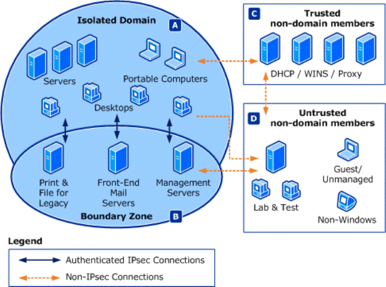

---

### 域和工作组的对比

- 域可定义安全管理边界，工作组无集中管理，相互独立。
- 域中所有用户共享普通的用户账户数据库和安全策略。
- 域在验证用户身份时，使用安全账户数据库；
- 域验证时，每台计算机不需要提供自己的验证服务；
- 域在整个受信任域中访问许可的资源。

- 工作组中计算机使用本地账户和本地策略。
- 工作组中计算机上的用户登录本机时，验证需要使用账户SAM文件；而当登录到域时用的是域上的用户账户数据库。
- 工作组中登录验证用的是本机的验证服务；
- 工作组为本机资源。

---

## 活动目录（Active Directory）

### AD概念（是什么？）

目录是将对象的信息存储在网络的层次结构。 

目录服务，如 Active Directory 域服务 (AD DS) 提供了存储目录数据，并使网络用户和管理员能方便使用的方法。

 Active Directory 将对象的信息存储在网络上，通常，这些对象包括共享的资源，如服务器、 卷、 打印机和网络用户和计算机帐户。


**AD是一个以层次结构存储网络资源信息的目录（数据库）。通过它，组织机构（或者说管理员、又或者说是Windows域控制器）可以有效地对分布式网络对象进行共享和管理。它扮演着中心授权机构的角色。**

Windows Server Active Directory 域服务：
目的是提供一套完整的用户身份验证系统，实现用户在windows域中的单点登录，同时实现对共享资源和服务的管理及访问。

### 功能机制

活动目录提供了一个完全集成于windows的、安全的、分布式的、可扩展的、可重复的、分层目录服务。主要目的是提供管理的方便性、一致性、扩展性。

Active Directory 包括：
- 一个层次化网络资源信息库，包含每个对象的信息；
- 一组规则架构，定义了如何描述对象和访问对象的格式；
- 一个查询和索引机制，以便可以发布和发现的网络用户或应用程序对象和其属性。 
- 一个复制服务。

简单而言，利用AD能够实现：
- 单点登录
- 全局目录
- 智能信息复制
- 一致的组策略

### Active Directory的结构和存储技术

AD以树型结构存储网络上的所有对象（所有用户、所有物理设备、所有软件、进程等）信息。Windows 域（domain）、森林（forest）是这棵树的基础。为了保存来自各种设备上收集来的各类数据，AD必须采用一定的存储结构。

#### AD存储结构

AD结构和存储架构由4个部分构成：

- AD 域和森林。
  - AD的域，森林、管理单元（OU)是AD逻辑结构的核心成员。
  - 森林定义了一个单独的目录，表示了一个安全边界。
  - 森林通常包含一到多个域。
- 域名服务（DNS)。
  - DNS为域控制器提供了名字解析服务。
  - 在执行授权、更新、查找等操作时，DNS用于根据某个字符串定位资源的物理位置。
- 模式（schema）
  - 模式用于定义object；
  - 对象（objects）用于存储各种信息，但需要先被schema定义；
- 数据存储（Data store）
  - 即每个域控制器上的数据存储和检索。


#### AD 数据存储

AD的数据存储由以下几个部分构成：

- 4个访问接口
  - LDAP(Lightweight Directory Access Protocol)
  - 复制（Replication，REPL）和域控制器管理接口
  - 消息API(MAPI，Messaging API)
  - 安全账户管理（SAM，Security accouts manager）

- 3个服务组件
  - 目录系统代理（DSA），即运行在每个域控制器上的Ntdsa.dll，它负责管理目录语义、维护模式、保证对象标识和对象属性的数据类型。
  - 数据库层
  - 扩展的存储引擎（ESE），即域中运行的Esent.dll，用于直接与目录数据库中的单一记录通信，记录之间以name属性进行区分。

- 目录数据库（数据真实存储位置），支持日志、事务处理。

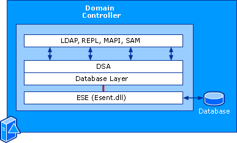

#### AD结构与存储组件

AD中已有的结构和存储组件是Windows自身设置生成的，不可修改，但用户可以自定义一些存储结构，用于存储自定义数据。

- 在AD安装（初始化）时，可以定义森林、域、管理单元。
- 森林中的每个域都需要遵循DNS命名方案。
- 模式是AD中的单一组件，包括classSchema和attributeSchema两类。
- 数据存储由3层组件构成：
  - 第一层，提供访问目录的接口
  - 第二层，提供执行操作的服务
  - 第三层，提供数据存储（文件系统、磁盘）


## Windows 虚拟专用网 （VPN）

这一部分，我们了解以下Windows 10中的VPN技术。

我们可以运行```vpn```命令，或打开windows 的“网络和Internet 设置”，可以看到VPN设置。


> Windows 10 中的vpn技术可以参考：https://docs.microsoft.com/en-us/windows/client-management/mdm/vpnv2-csp

### VPN 连接类型

虚拟专用网 (VPN) 是专用或公用网络上的点对点连接。 

VPN 客户端使用特殊 TCP/IP 或基于 UDP 的协议（称为隧道协议），在 VPN 服务器上对虚拟端口进行虚拟调用。 

在 Windows 10 中，可用多种VPN客户端：
- 内置插件
- 通用 Windows 平台 (UWP) VPN 插件
- 第三方 windows app

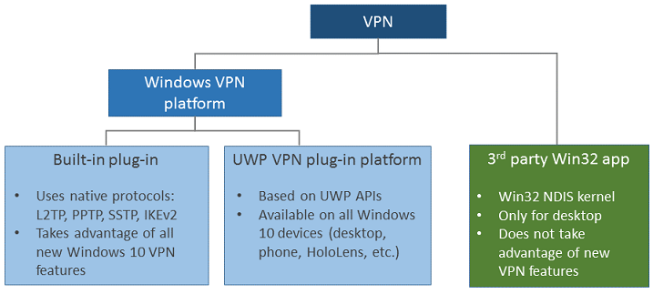


#### 内置 VPN 客户端

可以使用的VPN类型（隧道协议）有：

- Internet 密钥交换版本 2 (IKEv2)
  - 在 VPNv2 配置服务提供程序 (CSP) 中使用加密套件设置配置 IPsec/IKE 隧道加密属性。
- L2TP协议
  - 可以在 VPNv2 CSP 中使用 L2tpPsk 设置配置具有预共享密钥 (PSK) 身份验证的 L2TP。
- PPTP
- SSTP
  - SSTP 仅受 Windows 桌面版支持。 不能使用移动设备管理 (MDM) 配置 SSTP，但它是在自动选项中尝试的协议之一。

SSTP 仅受 Windows 桌面版支持。 不能使用移动设备管理 (MDM) 配置 SSTP，但它是在自动选项中尝试的协议之一。

如果使用内置 VPN 客户端，在配置时可以选择自动。自动选项意味着设备将尝试每个内置隧道协议，直到某个协议成功为止。 按安全性从高到低的顺序尝试。


#### UWP VPN 插件

这个可能需要安装软件才可用。

最初用于 Windows 8.1 移动版和 Windows 8.1 电脑版平台的单独版本，Windows 10 中还引入了通用 Windows 平台 (UWP) VPN 插件。 使用 WUP 平台，第三方 VPN 提供商可以使用 WinRT API 创建应用容器化的插件，从而消除通常与写入系统级驱动程序关联的复杂性和问题。

存在大量通用 Windows 平台 VPN 应用程序，例如：
- Pulse Secure
- Cisco AnyConnect
- F5 Access
- Sonicwall Mobile Connect 
- Check Point Capsule。

### VPN 路由决策

路由决策设置了接口的出入站策略。

VPN 配置的一个最重要决策点是：
- 通过 VPN 发送所有数据（强制隧道）
- 或者，通过 VPN 发送部分数据（拆分隧道）。 

此决策会影响配置和容量规划以及连接的安全要求。

如果使用windows提供的VPNv2配置服务提供程序CSP，那么配置过程可参考：https://docs.microsoft.com/zh-cn/windows/security/identity-protection/vpn/vpn-routing


## Windows 身份验证

身份验证是验证对象、 服务或人员身份的过程。

通常情况下，身份验证会使用公钥加密或对称加密方法，验证用户拥有唯一的密钥。认证服务器端则使用服务器留存的加密密钥与用户提交的签名数据进行对比，以此验证身份。

认证技术有多种：
- 验证用户所知，例如用户名+密码，这是最简单的方法
- 验证用户所有，例如令牌设备
- 

将加密密钥存放在安全的中心位置，可以确保身份验证过程的伸缩性和可维护性。Active Directory 域服务建议使用Windows 默认的技术来实现密钥存放和身份验证，包括：
- NTLM
- Kerberos
- 公钥证书
- Transport Layer Security/Secure Sockets Layer (TLS/SSL)
- Digest
- 其它安全协议，如 Negotiate 和 the Credential Security Support Provider 等等


Windows 的身份验证配置通常在服务器管理器的组策略中，一些服务器角色配置被设置在特定的服务器软件中，例如IIS、AD Domain Services.

### Windows 登录方案

Windows设计了多种登录方法：
- 交互式登录
- 网络登录
- 智能卡登录
- 生物识别登录

#### 交互式登录

下图显示了交互式登录元素和登录过程。


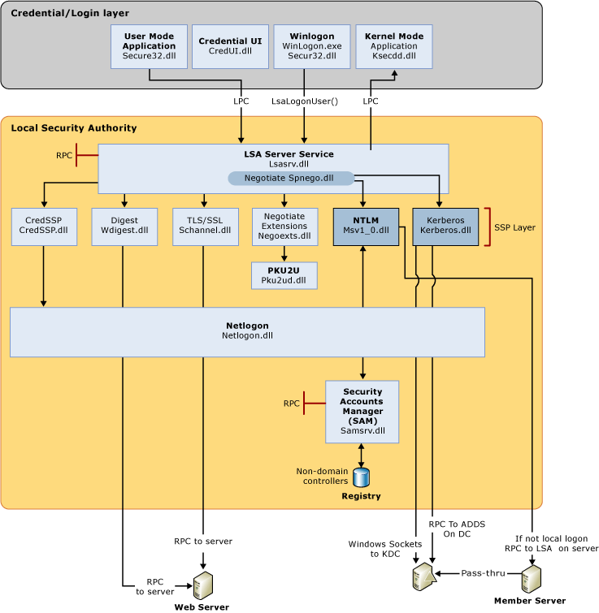

本地登录和网络登录要求用户有注册的帐户，本地计算机中的安全帐户管理器 (SAM)保护并管理用户和组信息。通过终端服务或远程桌面服务 (RDS)可以实现远程登录。在 Windows 中，通过远程登录访问另一台计算机依赖于远程桌面协议 (RDP)。 

登录域，需要在域Active Directory 中注册账户。

#### 智能卡登录

使用智能卡仅能以域帐户登录，本地帐户不可以用智能卡登录。

智能卡身份验证要求使用 Kerberos 身份验证协议。


智能卡代替了密码，其上存储了一个PK/SK密钥对。

#### 生物学认证登录

略。

### Windows 身份验证体系结构

Windows Server 操作系统可实现一组默认的身份验证安全支持提供者，包括协商、 Kerberos 协议、 NTLM、 Schannel （安全通道） 和摘要。

最主要的部件包括：
- 本地安全机构LSA
- 安全支持提供程序结构SSPI，是获取身份验证、 消息完整性、 消息隐私性和安全的服务质量任何分布式应用程序协议的集成的安全服务的 API。

#### Microsoft 安全支持提供程序接口 (SSPI) 

SSPI 是 Windows 身份验证的基础。 SSPI 实现了通用安全服务 API (GSSAPI)(可以参考RFC 2743和RFC 2744)。

Windows中默认的安全支持提供者（SSPs）调用特定认证协议DLLs。


#### SSPs

Windows中的SSPs有许多：
- Kerberos Security Support Provider
- NTLM Security Support Provider
- Digest Security Support Provider
- Schannel Security Support Provider
- Negotiate Security Support Provider
- Credential Security Support Provider
- Negotiate Extensions Security Support Provider
- PKU2U Security Support Provider

##### Kerberos Security Support Provider

微软仅提供了kerberos v5 协议作为一种ssp。这个协议基于Network Working Group's RFC 4120 and draft revisions。这是一个工业标准协议，使用password 或 smart card完成交互登录。

Kerberos是自Windows server 2000后的默认SSP，包含的服务有：
- 基于LDAP的 Active Directory 查询
- 使用远程过程调用服务的远程服务器或工作站管理
- 打印服务
- 客户端-服务器身份验证
- 使用服务器消息块 (SMB) 协议 （也称为通用 Internet 文件系统或 CIFS） 的远程文件访问
- 分布式的文件系统管理和引用
- Intranet 身份验证到 Internet 信息服务 (IIS)
- 有关 Internet 协议安全性 (IPsec) 安全机构身份验证
- 为域用户和计算机的 Active Directory 证书服务的证书申请

该SSP的位置在：%windir%\Windows\System32\kerberos.dll

##### NTLM Security Support Provider

NTLM SSP是一个二进制消息传送协议，采用质询-响应进行身份验证，并且协商了通信过程中为实现完整性和保密性所需的参数。

NTLM SSP包含 NTLM and NTLM version 2 (NTLMv2) .

Windows上的NTLM可以支持下列功能：
- Client/server authentication
- Print services
- File access by using CIFS (SMB)
- Secure Remote Procedure Call service or DCOM service

NTLM SSP程序位置： %windir%\Windows\System32\msv1_0.dll

##### Digest Security Support Provider

Digest SSP是一个用于LDAP和Web认证的工业标准。Digest 认证通过网络传递MD5 HASH码或消息摘要码形式的凭证（Credentials）。

Digest SSP (Wdigest.dll) 可以实现:
- Internet Explorer
- Internet Information Services (IIS) access
- LDAP queries

##### Schannel Security Support Provider

这个SSP用于基于web的认证，例如用户访问一个安全的web server时。

Schannel SSP 基于公钥加密技术支持：
- TLS protocol 1.0，1.1，1.2
- SSL protocol 2.0，3.0
- the Private Communications Technology (PCT) protocol（PCT is disabled by default.）
- the Datagram Transport Layer (DTLS) protocol。

所有Schannel 协议都采用了C/S模型。程序位置在：%windir%\Windows\System32\Schannel.dll。

##### Negotiate Security Support Provider

The Simple and Protected GSS-API Negotiation Mechanism (SPNEGO) 构成了Negotiate SSP的基础，这个SSP用于双方协商合适的双方的特定认证协议。支持的选择为：Kerberos protocol 和 NTLM。

SPNEGO is specified in RFC 2478.

Negotiate SSP的位置：%windir%\Windows\System32\lsasrv.dll

##### Credential Security Support Provider

当用户使用Terminal Services and Remote Desktop Services sessions时，CredSSP 提供了单一登录服务single sign-on (SSO) .

CredSSP policies are configured by using Group Policy, and the delegation of credentials is turned off by default.

位置: %windir%\Windows\System32\credssp.dll

##### Negotiate Extensions Security Support Provider

协商扩展 (NegoExts) 允许以下方案：
- Rich client availability within a federated system. 具体参考 SharePoint sites, 它们可以通过使用全功能的 Microsoft Office 应用程序进行编辑。
- Rich client support for Microsoft Office services. 
- Hosted Microsoft Exchange Server and Outlook. There is no domain trust established because Exchange Server is hosted on the web. Outlook uses the Windows Live service to authenticate users.
- Rich client availability between client computers and servers. The operating system's networking and authentication components are used.

位置： %windir%\Windows\System32\negoexts.dll

##### PKU2U Security Support Provider

此 SSP 启用对等身份验证，特别是通过媒体和文件共享名为 Windows 7 中引入的家庭组功能。 

位置： %windir%\Windows\System32\pku2u.dll

#### Windows 认证中的凭据处理过程（ Credentials Processes）

身份验证中使用的凭据是证明用户真实性的证据，它以某种形式存在，如证书、 密码或 PIN 的用户的标识的数字文档。

下图显示了所需的组件和路径：


通常凭据Credentials的验证由SAM 或 AD 完成。

用户登录时，Winlogon.exe 是执行用户登录的程序，管理用户交互安全。它将初始化一个登录过程，调用Secur32.dll程序收集用户凭据给LSA。

应用程序登录时，不要求交互模式登录。Most processes initiated by the user run in user mode by using Secur32.dll whereas processes initiated at startup, such as services, run in kernel mode by using Ksecdd.sys.

本地安全信息存储在注册表中HKEY_LOCAL_MACHINE\SECURITY。 存储的信息包括策略设置、 默认安全值和帐户信息，如缓存的登录凭据。 SAM 数据库的副本是也存储在此处，尽管它被写保护。

Secur32.dll，有多个身份验证提供程序，形成了身份验证过程的基础。

Lsasrv.dll，是LSA Server service，既有安全策略，也扮演这安全包管理器，LSA中有协商功能，可选择NTLM或Kerberos协议。

Netlogon.dll提供了网络登录服务，执行下列任务：
- 向domain controller维护计算机安全信道。
- 通过安全信道向DC传递用户凭据，返回域SIDs和user rights。
- 在域DNS中发布服务资源记录，使用DNS解析地址名.
- 基于RPC实现复制协议，实现主DC和备份DC的同步.

Samsrv.dll，即The Security Accounts Manager (SAM), 存储了本地安全账户，执行本地存储的策略和支持的APIs。

Registry，包含了SAM数据，本地安全策略设置，默认安全值和账户信息等的拷贝。

##### 用户登录中的凭证输入

有两类凭证输入方式：

- Graphical Identification and Authentication architecture（GINA）
- Credential provider architecture

###### GINA

windows 2003，2000，xp等使用。

每个交互式登录会话创建 Winlogon 服务的单独实例。 GINA 体系结构加载到使用 Winlogon 的进程空间、 接收和处理凭据，并使对通过 LSALogonUser 的身份验证接口的调用。
在会话 0 中运行交互式登录 Winlogon 的实例。 会话 0 主机系统服务和其他关键进程，包括本地安全机构 (LSA) 进程。
下图显示了 Windows Server 2003、 Microsoft Windows 2000 Server、 Windows XP 和 Microsoft Windows 2000 Professional 的凭据过程。

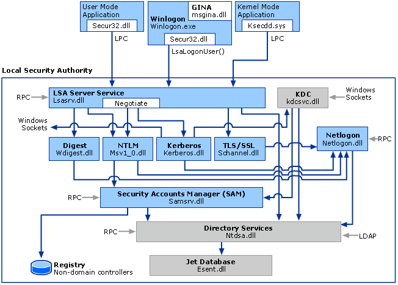

###### 凭据提供程序体系结构

使用凭据提供程序体系结构，Winlogon 始终启动登录 UI 之后接收到它安全注意序列事件。 登录 UI 查询不同的凭据类型提供程序配置为枚举数每个凭据提供程序。


上面的架构可能随 credential providers 而改变，不同的providers会以不同的logon tiles（界面或对话框类的东西）许可任意数量的登录场景。

在  Winlogon 接收到一个安全注意序列事件时， Winlogon 将启动一个 Logon UI。Logon UI 查询凭据提供者获得凭据。不同的凭据提供者会有不同的tiles, UI则将它们显示给用户。

Credential providers 不是强制机制，它用于收集和序列化凭证。LSA的授权验证包强制实现安全性。 

Credential providers 参与以下工作：
- 描述凭据信息
- 控制外部认证机制的通信和逻辑
- 为交互登录和网络登录打包凭证


##### 应用程序和服务登录的凭据输入

在用户模式下，应用程序可访问该用户可访问的各种资源；

在服务和内核模型下，以服务形式存在可无限制访问系统内存和外部设备。

#### Local Security Authority

LSA是一个保护系统，处理认证和记录本地计算机上的用户。此外，LSA 维护了所有本地安全相关的数据，它提供了名字和SIDs的转换。

安全系统过程，也称为Local Security Authority Server Service (LSASS)，跟踪了安全策略和系统中的账户行为。

LSA验证用户身份，基于下面两种记录在用户账户的实体：

- Local Security Authority.LSA可以使用SAM信息验证用户。
- Security authority for the local domain or for a trusted domain. 

LSASS会把凭据存在内存里，这利于用户与windows 会话的交互。凭据存储形式可以有：
- Reversibly encrypted plaintext
- Kerberos tickets (ticket-granting tickets (TGTs), service tickets)
- NT hash
- LAN Manager (LM) hash

### 用于Windows 验证的组策略

主要包括：

| Policy group | Location | 描述|
|-|-|-|
|Password Policy|Local Computer Policy\Computer Configuration\Windows Settings\Security Settings\Account Policies|
|Account Lockout Policy |	Local Computer Policy\Computer Configuration\Windows Settings\Security Settings\Account Policies|
|Kerberos Policy|	Local Computer Policy\Computer Configuration\Windows Settings\Security Settings\Account Policies|
|Audit Policy	|Local Computer Policy\Computer Configuration\Windows Settings\Security Settings\Local Policies\Audit Policy	|
|User Rights Assignment	| Local Computer Policy\Computer Configuration\Windows Settings\Security Settings\Local Policies\User Rights Assignment|
|Security Options|	Local Computer Policy\Computer Configuration\Windows Settings\Security Settings\Local Policies\Security Options	|
|Credentials Delegation	|Computer Configuration\Administrative Templates\System\Credentials Delegation|
|KDC	|Computer Configuration\Administrative Templates\System\KDC|
|Kerberos|	Computer Configuration\Administrative Templates\System\Kerberos|
|Logon|	Computer Configuration\Administrative Templates\System\Logon|
|Net Logon|	Computer Configuration\Administrative Templates\System\Net Logon|
|Biometrics|	Computer Configuration\Administrative Templates\Windows Components\Biometrics|
|Credential User Interface	|Computer Configuration\Administrative Templates\Windows Components\Credential User Interface|
|Password Synchronization|	Computer Configuration\Administrative Templates\Windows Components\Password Synchronization	|
|Smart Card	|Computer Configuration\Administrative Templates\Windows Components\Smart Card	|
|Windows Logon Options|	Computer Configuration\Administrative Templates\Windows Components\Windows Logon Options|
|Ctrl+Alt+Del Options	|Computer Configuration\Administrative Templates\Windows Components\Ctrl+Alt+Del Options	|
|Logon|	Computer Configuration\Administrative Templates\Windows Components\Logon	|

### Kerberos 

Kerberos 是一个用于验证用户或主机身份的身份验证协议。

参考：http://web.mit.edu/kerberos/krb5-latest/doc/

Windows Server 操作系统可实现 Kerberos 版本 5 身份验证协议和对公钥身份验证的扩展，用于传输授权数据和委派。

Kerberos 密钥分发中心(KDC)与其他域控制器运行的 Windows Server 安全服务集成。 KDC 使用域的 Active Directory 域服务数据库作为其安全帐户数据库。 Active Directory 域服务是域或林中的默认 Kerberos 实现所必需的。

作为安全支持提供程序实现 Kerberos 身份验证客户端(SSP).

Windows 域中使用Kerberos 的优势：
- Delegated authentication，即模拟本地客户端进行认证，它连接了后台服务和别的计算机。
- Single sign on
- 互操作。有助于实现与使用 Kerberos 协议进行身份验证的其他网络之间的互操作性。 
- 服务器身份验证更高效
- 双向身份验证。这是本地NTLM无法实现的，NTLM假定主机服务是可信的，而用户是需要验证的。
- 防止网络嗅探泄密

#### Kerberos 工作原理

Kerberos中有3方主体：
- Client
  - 需要验证身份，获得数据服务器服务。
- Authentication Server (AS) 
  - 接收认证申请，分发访问票据
- KDC
  - KDC 发出一个 ticket-granting ticket (TGT),TGT是一个时间戳，并使用 ticket-granting service's (TGS) secret key 加密，发送给客户端。
  - KDC与AS可以是一台服务器。
- Service Server(SS)
  - 提供数据服务


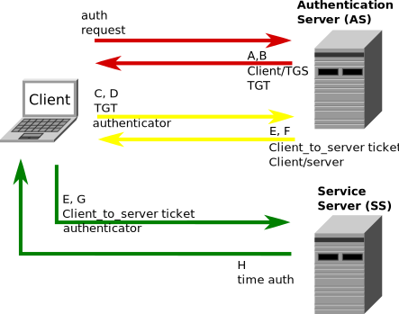

When the client needs to communicate with a service on another node (a "principal", in Kerberos parlance), the client sends the TGT to the TGS, which usually shares the same host as the KDC. Service must be registered at TGT with a Service Principal Name (SPN). The client uses the SPN to request access to this service. After verifying that the TGT is valid and that the user is permitted to access the requested service, the TGS issues ticket and session keys to the client. The client then sends the ticket to the service server (SS) along with its service request.

##### User Client-based Login
A user enters a username and password on the client machine(s). Other credential mechanisms like pkinit (RFC 4556) allow for the use of public keys in place of a password.
The client transforms the password into the key of a symmetric cipher. This either uses the built-in key scheduling, or a one-way hash, depending on the cipher-suite used.
##### Client Authentication
The client sends a cleartext message of the user ID to the AS (Authentication Server) requesting services on behalf of the user. (Note: Neither the secret key nor the password is sent to the AS.)
The AS checks to see if the client is in its database. If it is, the AS generates the secret key by hashing the password of the user found at the database (e.g., Active Directory in Windows Server) and sends back the following two messages to the client:
Message A: Client/TGS Session Key encrypted using the secret key of the client/user.
Message B: Ticket-Granting-Ticket (TGT, which includes the client ID, client network address, ticket validity period, and the client/TGS session key) encrypted using the secret key of the TGS.
Once the client receives messages A and B, it attempts to decrypt message A with the secret key generated from the password entered by the user. If the user entered password does not match the password in the AS database, the client's secret key will be different and thus unable to decrypt message A. With a valid password and secret key the client decrypts message A to obtain the Client/TGS Session Key. This session key is used for further communications with the TGS. (Note: The client cannot decrypt Message B, as it is encrypted using TGS's secret key.) At this point, the client has enough information to authenticate itself to the TGS.
##### Client Service Authorization
When requesting services, the client sends the following messages to the TGS:
Message C: Composed of the TGT from message B and the ID of the requested service.
Message D: Authenticator (which is composed of the client ID and the timestamp), encrypted using the Client/TGS Session Key.
Upon receiving messages C and D, the TGS retrieves message B out of message C. It decrypts message B using the TGS secret key. This gives it the "client/TGS session key". Using this key, the TGS decrypts message D (Authenticator) and compare client ID from message C and D, if they match server sends the following two messages to the client:
Message E: Client-to-server ticket (which includes the client ID, client network address, validity period and Client/Server Session Key) encrypted using the service's secret key.
Message F: Client/Server Session Key encrypted with the Client/TGS Session Key.
##### Client Service Request
Upon receiving messages E and F from TGS, the client has enough information to authenticate itself to the Service Server (SS). The client connects to the SS and sends the following two messages:
Message E: from the previous step (the client-to-server ticket, encrypted using service's secret key).
Message G: a new Authenticator, which includes the client ID, timestamp and is encrypted using Client/Server Session Key.
The SS decrypts the ticket (message E) using its own secret key to retrieve the Client/Server Session Key. Using the sessions key, SS decrypts the Authenticator and compares client ID from messages E and G, if they match server sends the following message to the client to confirm its true identity and willingness to serve the client:
Message H: the timestamp found in client's Authenticator (plus 1 in version 4, but not necessary in version 5[6][7]), encrypted using the Client/Server Session Key.
The client decrypts the confirmation (message H) using the Client/Server Session Key and checks whether the timestamp is correct. If so, then the client can trust the server and can start issuing service requests to the server.
The server provides the requested services to the client.


### 令牌绑定

Windows 10, version 1703 supports Token Binding Protocol version 0.10 – On by default。

https://datatracker.ietf.org/doc/draft-ietf-tokbind-protocol/10/

### TLS/SSL 

用于：
- 电子商务网站受 SSL 保护的交易
- 对受 SSL 保护的网站的经身份验证的客户端访问
- 远程访问
- SQL 访问
- 电子邮件

#### TLS Handshake Protocol

TLS Handshake Protocol用于认证和密钥交换，实现安全会话。完成下列任务：
- 加密套件协商
- 服务器和可选客户端的认证
- 会话密钥信息交换

##### 使用TLS建立安全会话

步骤如下：

- 1.客户端发送一个Client hello 消息给服务器，同时送出一个随机数和支持的加密套件（代码）。
- 2.服务器发送一个 Server hello 响应消息给客户端, 同时送出一个服务器随机数。
- 3.服务器发送它的证书给要认证的客户端，并且可能向客户端请求一个证书（用于双向验证）。服务器发送 Server hello done消息。
- 4.如果服务器已经请求了客户端证书，那么客户端发送自己的证书给服务器。
- 5.客户端生成一个随机的 Pre-Master Secret 并且使用服务器证书中的公钥加密这个Pre-Master Secret ，然后发送给服务器。
- 6.服务器接收到 Pre-Master Secret。根据Pre-Master Secret，服务器和客户端各自生成 Master Secret 和 Session keys 。
- 7.客户端发送 Change cipher spec 通知给服务器，声明客户端将开始使用新的 session keys，用它来哈希和加密消息。客户端也会发送 Client finished 消息。
- 8.服务器接收 Chage cipher spec 并切换它的记录层安全状态（ its record layer security state）到使用session keys 的 symmetric encryption 。服务器之后会发送“ Server finished”消息给客户端。
- 9.客户端和服务器现在可以在安全的信道中交换应用数据了。所有的消息都将被加密。

##### 使用TLS恢复安全会话

- 1.客户端使用想恢复的会话 ID 发送 Client hello 消息给服务器;
- 2.服务器检查它的会话缓存，寻找这个会话ID，如果有那么服务器能够恢复会话，并送出带会话ID的 Server hello 消息
- 3.客户端和服务器必须交换 Change cipher spec 消息并发送 client finished 和 server finished 消息。
- 4.之后就可以在安全信道中使用恢复的会话通信了。

##### TLS Record Protocol

TLS Record Protocol使用握手生成的密钥来加密数据。

The Record Protocol负责：
- 加密数据
- 验证完整性
- 数字签名

具体工作包括：
- 将传出的消息划分为可管理的块，然后重新组装传入的消息。
- 压缩输出块和解压缩输入块（可选）。
- 将消息验证码（MAC）应用于传出消息，并使用MAC验证传入消息。
- 加密传出消息和解密传入消息。

记录协议完成后，传出的加密数据将向下传递到传输控制协议（TCP）层进行传输。

##### TLS密码套件

Schannel在Windows Server 2003和Windows XP中为TLS 1.0支持以下密码套件。套件以选择它们的默认顺序列出。

- TLS_RSA_WITH_RC4_128_MD5
- TLS_RSA_WITH_RC4_128_SHA
- TLS_RSA_WITH_3DES_EDE_CBC_SHA
- TLS_DHE_DSS_WITH_3DES_EDE_CBC_SHA
- TLS_RSA_WITH_DES_CBC_SHA
- TLS_DHE_DSS_WITH_DES_CBC_SHA
- TLS_RSA_EXPORT1024_WITH_RC4_56_SHA
- TLS_RSA_EXPORT1024_WITH_DES_CBC_SHA
- TLS_DHE_DSS_EXPORT1024_WITH_DES_CBC_SHA
- TLS_RSA_EXPORT_WITH_RC4_40_MD5
- TLS_RSA_EXPORT_WITH_RC2_CBC_40_MD5
- TLS_RSA_WITH_NULL_MD5
- TLS_RSA_WITH_NULL_SHA

#### TLS与SSL
TLS是与SSL 3.0紧密相关的标准，有时也称为“ SSL 3.1”。TLS取代SSL 2.0，应在新开发中使用。从Windows 10版本1607和Windows Server 2016开始，SSL 2.0已被删除并且不再受支持。

需要高度互操作性的应用程序应支持SSL 3.0和TLS。由于这两个协议之间的相似性，因此SSL文档未包含在本文档中，除非它们与TLS不同。