# 第3讲 Windows威胁防护

Windows 10 、Windows Server 2016等产品中的威胁防护主要使用Microsoft Defender。

Microsoft Defender 高级威胁防护（Microsoft DEFENDER ATP）是一个统一的平台，用于实现：
- 预防性保护服务器和终端结点
- 入侵检测、检测高级威胁和数据泄露
- 自动调查和响应、自动执行安全操作

我们下面将依次介绍Microsoft Defender的：

- 威胁与漏洞管理
- 减少攻击面
- 安防新技术
- 端点检测与防护

--- 

## 威胁与漏洞管理（Threat & Vulnerability Management）

TVM是Microsoft Defender的内置功能。它使用颠覆性（game-changing）的基于风险的方法来发现（discovery）、优化（prioritization）、补救（remediation）终端的漏洞和错误配置。

它有效整合了3方面内容：
- 微软终端安全栈（Microsoft endpoint security stack）
- 微软智能安全图（Microsoft Intelligent Security Graph）
- 应用分析知识库（Application analytics knowledgebase）

微软终端安全栈：

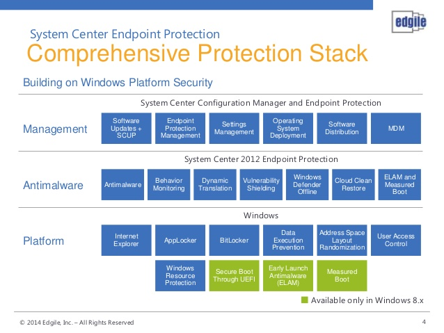

微软智能安全图:

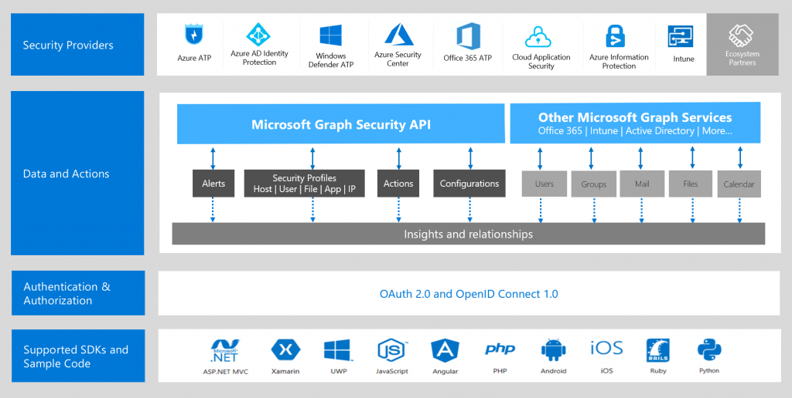

应用分析知识库:

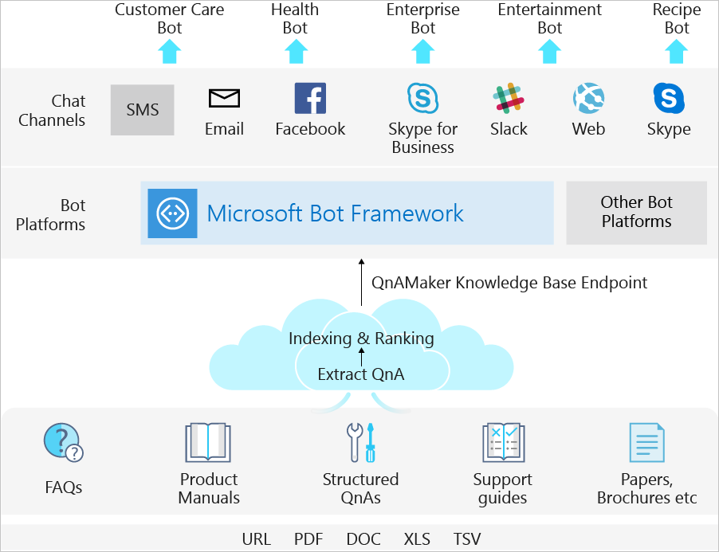

Windows的威胁与漏洞管理是业界首个将安全管理与IT管理结合起来的解决方案。通过整合下列2个工具来生成安全任务(task)或票据(ticket)：
- 微软精灵（Microsoft Intune）
- 微软系统中心配置管理器（Microsoft System Center Configuration Manager, SCCM）

--- 

### Microsoft Intune 

Microsoft Intune 是企业移动管理 (EMM) 领域中基于云的服务，可帮助员工提高工作效率，同时保护企业数据。 

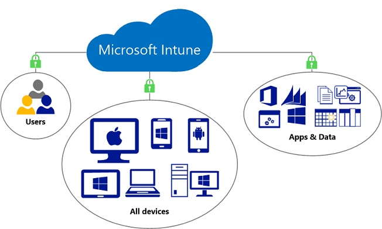

与其他 Azure 服务一样，Microsoft Intune 也可在 Azure 门户中使用。 通过 Intune，还可以：
- 管理工作人员用来访问公司数据的移动设备和 PC。
- 管理员工使用的移动应用。
- 通过帮助控制员工访问和共享公司信息的方式来保护公司信息。
- 确保设备和应用符合公司安全要求。

#### Intune 可帮助解决的常见业务问题

- 保护本地电子邮件和数据以供移动设备访问
- 保护 Office 365 电子邮件和数据以供移动设备安全访问
- 向员工发放公司拥有的手机
- 为所有员工提供一个“自带设备办公”(BYOD) 或个人设备计划
- 允许员工从不受管理的公用网亭安全访问 Office 365
- 向任务工作者发放使用受限的共享平板电脑

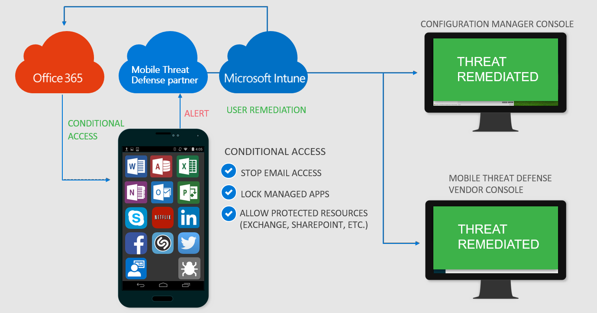

#### Intune 如何工作？

Intune 是 Microsoft 企业移动性 + 安全性 (EMS) 套件的组件，可用于管理移动设备和应用。 它与 Azure Active Directory (Azure AD) 等其他 EMS 组件紧密集成以实现标识和访问控制，并与 Azure 信息保护集成以实现数据保护。 将它与 Office 365 结合使用时，员工可以在其设备上高效工作，同时保护组织的信息。

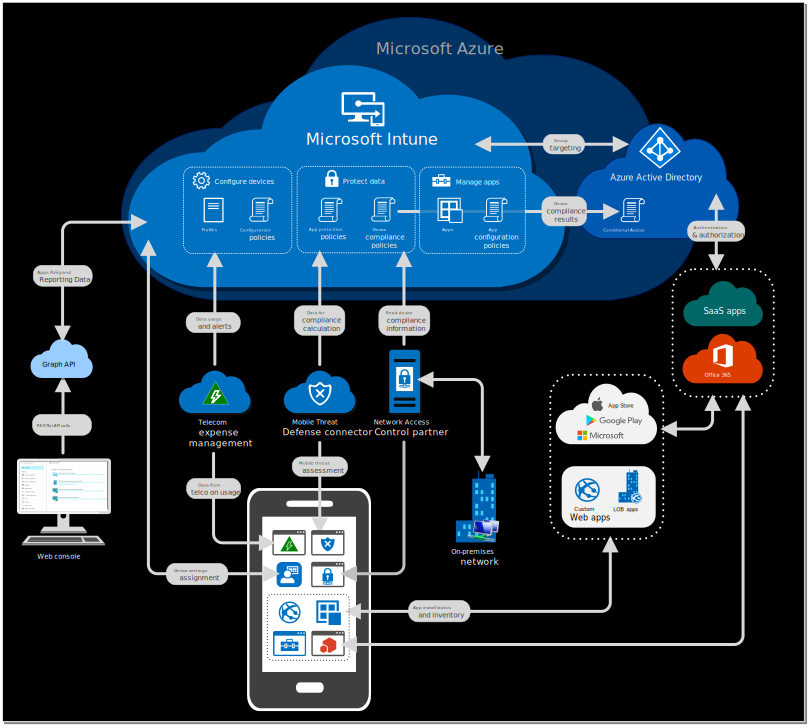

--- 

### 微软系统中心配置管理器（Microsoft System Center Configuration Manager, SCCM）

System Center Configuration Manager 作为 Microsoft System Center 管理解决方案套件中的一种产品，有助于在本地和云中管理设备和用户。

Configuration Manager 扩展现有的 Microsoft 技术和解决方案并与之协同工作，主要功能：
- 安全和可伸缩的软件部署。
- 符合性设置管理。
- 服务器、台式计算机、笔记本电脑和移动设备的全面资产管理。
- 
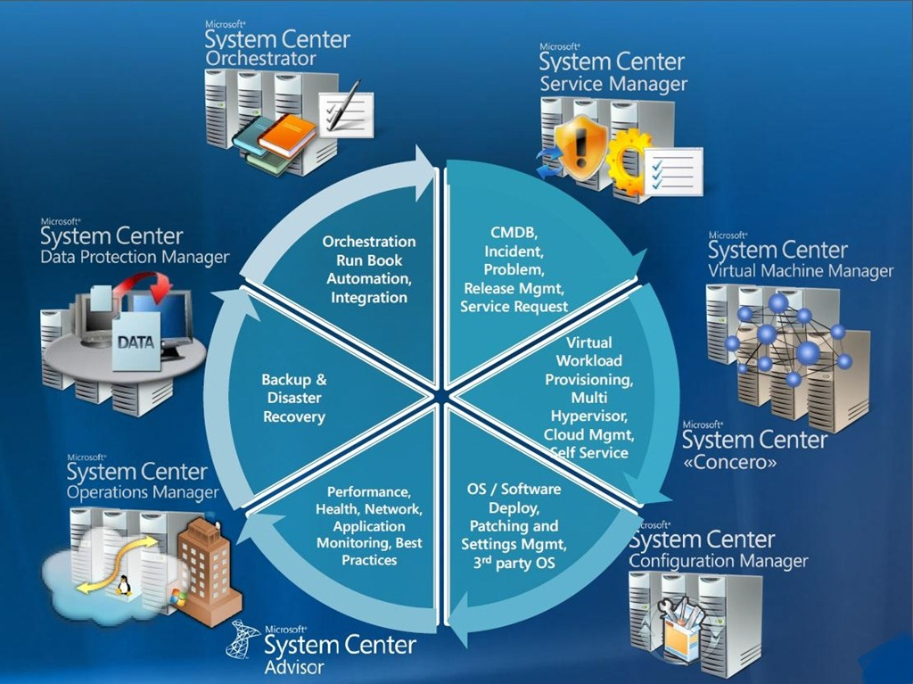

说明:
- CMDB：配置管理数据库
- Virtual Workload Provisioning：虚拟工作载荷配置
- Orchestration ：编排治理，配置集中化与动态化。可支持数据源、表与分片及读写分离策略的动态切换；数据治理。提供熔断数据库访问程序对数据库的访问和禁用从库的访问的能力；

Configuration Manager 可与以下各项集成：
- Microsoft Intune，管理各种移动设备平台。
- Windows Server 更新服务 (WSUS)，管理软件更新。
- 证书服务。
- Exchange Server 和 Exchange Online。
- Windows 组策略。
- DNS。
- Windows 自动部署工具包 (Windows ADK) 和用户状态迁移工具 (USMT)。
- Windows 部署服务 (WDS)。
- 远程桌面和远程协助。
- Active Directory 域服务来获得安全性、服务定位和配置，并使用它来发现要管理的用户和设备。
- Microsoft SQL Server 作为分布式变更管理数据库，并与 SQL Server Reporting Services (SSRS) 集成以生成报表来监视和跟踪管理活动。
- 站点系统角色，可扩展管理功能并使用 Internet Information Services (IIS) 的 Web 服务。
- 后台智能传输服务 (BITS) 和 BranchCache 来帮助管理可用的网络带宽。

具体可以参考微软安全中心：https://securitycenter.windows.com/

---

## 减少Windows系统的攻击面

攻击面减少功能组在堆栈中提供了第一道防线。 

Windows在减少攻击面方面做了很多功能、程序，能够抵御攻击和漏洞。

主要内容包括：
- 基于硬件的隔离
- 应用程序控制
- 渗透保护
- 网络保护
- 受控文件夹访问权限
- 网络防火墙
- 攻击面减少规则

### 基于硬件的隔离

windows 提供独特的硬件隔离方法，保护系统。主要使用了：
- Windows Defender 应用程序防护
- Windows Defender System Guard等工具，

#### Windows Defender 应用程序防护

Windows Defender 应用程序防护专为 Windows 10 和 Microsoft Edge 设计，可以隔离企业定义的不受信任的站点，从而在员工浏览 Internet 时为公司提供防护。 

企业管理员需要定义哪些是受信任的网站、云资源和内部网络。 

如果用户通过 Microsoft Edge 或 Internet Explorer 访问不受信任的网站，则 Microsoft Edge 将在启用 Hyper-V 的隔离容器中打开这些网站，这将与主机操作系统隔离开来。 这一方法可让隔离容器成为匿名容器，而攻击者无法获得员工的企业凭据。

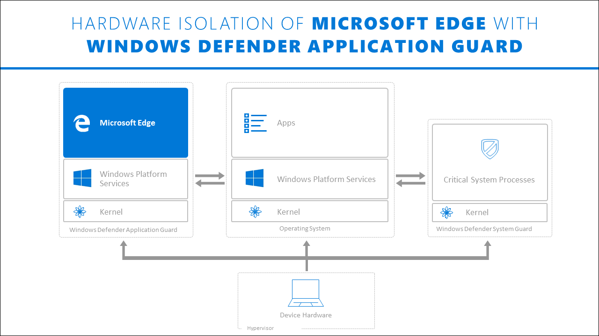

---

#### Windows Defender System Guard（系统防护）

Windows Defender 系统防护可以在启动Windows时、运行Windows中保护系统。防止在windows启动前运行未经确认的固件或软件（bootkit）。

Windows Defender 系统防护在2个阶段起作用：
- Windows 启动时
- Windows 运行中

下面依次说明。

---

##### Windows 启动前的防护

Windows Defender 系统防护主要使用的技术有：
- 静态信任根（SRTM)，用于在开启启动前，评估UEFI的信任状态。具体方法就是采集受信任的安全硬件厂商提供的UEFI BIOS驱动程序的哈希等信息。
- 动态信任根（DRTM），用于在开启启动时测量受信任状态。具体方法是：通过CPU计算可能加载的UEFI驱动的受信任状态。

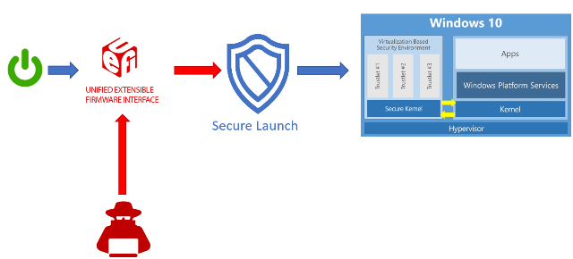

- 系统管理模式(SMM)保护，用于保护电源管理、硬件配置、热量监控等CPU管理模式。Windows使用两种方法保护SMM。
  - 分页保护，防止恶意代码访问SMM使用内存和缓存
  - SMM硬件监督和验证。

说明：

SMM模式是CPU执行的操作，它运行时调用不可屏蔽中断（SMI），该中断将执行BIOS中的SMM代码。SMM程序在最高特权级别运行，OS不可见，这使得它成为高级黑客关注焦点之一。

SMM 保护构建在安全启动技术的基础之上, 并且需要它才能正常工作。 将来, Windows 10 还将测量此 SMI 处理程序的行为, 并证明操作系统所拥有的内存没有被篡改。

##### Windows 运行中的防护

当 Windows 10 启动时, 将使用设备的受信任的平台模块 2.0 (TPM 2.0) 执行一系列完整性测量。

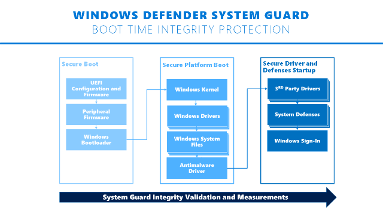

系统启动后, Windows Defender 系统保护使用 TPM 对这些测量进行签名和签署。 请求后, 诸如 Intune 或 System Center Configuration Manager 之类的管理系统可以获取它们以进行远程分析。 如果 Windows Defender System Guard 指示设备缺少完整性, 管理系统可以执行一系列操作, 例如拒绝设备对资源的访问。

---

### 应用程序控制（WDAC）

应用程序控件是一项至关重要的防线, 可保护企业环境免受不断变化的恶意软件影响。

只能在从 Windows 10 企业版或专业版或 Windows Server 2016 开始的计算机上创建 WDAC 策略。 可将其应用于运行任何版本的 Windows 10 或 Windows Server 2016 的计算机, 也可通过移动设备管理 (MDM) (如 Microsoft Intune) 进行管理。 可以使用组策略或 Intune 分发 WDAC 策略。

---

## 新安全防护技术

为了进一步巩固网络的安全外围，Microsoft Defender ATP 使用下一代保护功能，用于捕获所有类型的新兴威胁。主要内容包括：

- 行为监视
- 基于云的保护
- 机器学习
- URL 保护
- 自动沙盒服务

---

### 行为监视

在Windows中，可以配置组策略，启用和配置防病毒始终保护和监视。

具体操作可参考：实验4Windows Defender 安全中心配置中的实验内容：使用组策略启用和配置防病毒保护和监视。

### 基于云的保护

可以启用或禁用 Windows Defender 防病毒云通过 Microsoft Intune、System Center Configuration Manager、组策略、PowerShell cmdlet 或 Windows 安全应用中的单个客户端提供的保护。

### 机器学习

微软目前构建的ML机器学习模型包括：

- 本地ML模型、基于行为的检测、算法、基因和假设检测（generics and heuristics)
- 基于元数据的ML模型
- 基于样本分析的ML模型
- 基于爆破的（detonation-based）的ML模型
- 大数据分析

具体信息可以参考：https://docs.microsoft.com/zh-cn/windows/security/threat-protection/windows-defender-antivirus/utilize-microsoft-cloud-protection-windows-defender-antivirus

---

### URL 保护

微软提供的基于云和基于网络的安全防护，需要使用正确的URL去访问，下列URL不应被任何程序阻止、过滤、拒绝或更改。

#### Windows Defender 防病毒云保护服务

也称为 Microsoft Active Protection Service (MAPS)，由 Windows Defender 防病毒使用以提供云保护	。相关URL为：
- \ *. wdcp.microsoft.com 
- \ * wdcpalt.microsoft.com 
- \ * wd.microsoft.com

#### Microsoft 更新服务 (MU)	

安全智能和产品更新，相关URL:

- \ *. update.microsoft.com

#### 安全智能更新备用下载位置（ADL）

Windows Defender 防病毒安全智能更新的备用位置（如果已安装的安全智能已过期）（7天或更多天）。相关URL为：
- \ *. download.microsoft.com

#### 恶意软件提交存储	

通过提交表单或自动提交示例上传已提交到 Microsoft 的文件位置	。
相关URL有：

- ussus1eastprod.blob.core.windows.net 
- ussus1westprod.blob.core.windows.net 
- usseu1northprod.blob.core.windows.net 
- usseu1westprod.blob.core.windows.net 
- ussuk1southprod.blob.core.windows.net 
- ussuk1westprod.blob.core.windows.net 
- ussas1eastprod.blob.core.windows.net 
- ussas1southeastprod.blob.core.windows.net
- ussau1eastprod.blob.core.windows.net 
- ussau1southeastprod.blob.core.windows.net

#### 证书吊销列表 (CRL)

创建 SSL 与 MAPS 的连接以更新 CRL 时由 Windows 使用。

相关URL：

- http://www.microsoft.com/pkiops/crl/ 
- http://www.microsoft.com/pkiops/certs 
- http://crl.microsoft.com/pki/crl/products 
- http://www.microsoft.com/pki/certs

#### 符号存储区	

在修正流程中由 Windows Defender 防病毒使用以还原某些关键文件。

- https://msdl.microsoft.com/download/symbols

#### 通用遥测客户端	

由 Windows 用于发送客户端诊断数据;Windows Defender 防病毒软件将其用于产品质量监视用途	

此更新使用 SSL （TCP 端口443）下载清单并将诊断数据上载到使用以下 DNS 终结点的 Microsoft： 
- vortex-win.data.microsoft.com 
- settings-win.data.microsoft.com

---

###  首次看到时阻止

当 Windows Defender 防病毒软件遇到可疑但未检测到的文件时, 它会查询云保护后端。 云后端应用对文件的启发、机器学习和自动分析, 以确定文件是否是恶意的或干净的。

---

## 终结点检测和响应

终结点检测和响应功能可用于检测、调查和响应高级威胁。

主要功能有：
- 警报
- 历史终结点数据
- 响应协调
- 取证集合
- 威胁情报
- 高级渗透和分析服务
- 高级搜索
- 自定义检测
- 实时和历史搜索

Microsoft 安全响应中心: https://www.microsoft.com/en-us/msrc?rtc=1

---

## 自动调查和修正

与能够快速响应高级攻击相结合，Microsoft Defender ATP 提供自动调查和补救功能，可帮助在数分钟内减少警报数量。

自动调查和修正
威胁修正
管理自动调查
分析自动调查

---

## 安全功能分数

使用Azure云，可以通过安全功能分数查看自己系统安全情况。

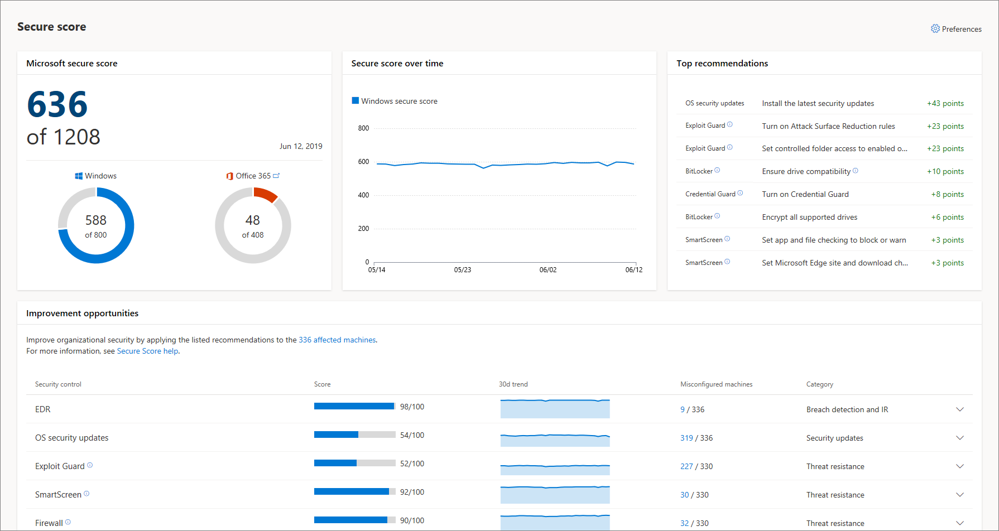

Microsoft Defender ATP 包括一个安全分数，可帮助你动态评估企业网络的安全状态、识别未受保护的系统，并采取建议的措施来提高组织的整体安全。

- 资产清单
- 建议的改进操作
- 安全功能分数
- 威胁分析

---

## Microsoft 威胁专家

Microsoft Defender ATP 新增的托管威胁搜寻服务提供主动的搜寻、优先级和其他上下文和见解，进一步使安全操作中心（SOCs）能够快速准确地识别和响应威胁。

---

## 管理 和 API
将 Microsoft Defender 高级威胁防护集成到现有工作流中。

- 载入
- API 和 SIEM 集成
- 公开 API
- 基于角色的访问控制 (RBAC)
- 报告和趋势