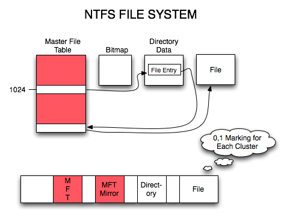
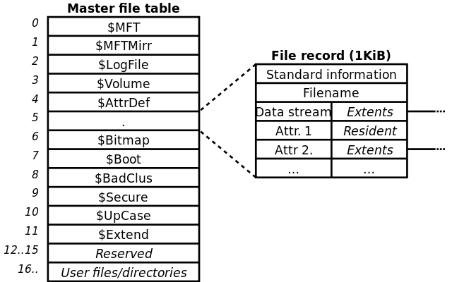

# 第4讲 Windows中的信息保护

本讲主要介绍Windows如何保护文档和其他数据。

主要内容有：
- NTFS系统的安全特性
- BitLocker加密
- 使用WIP（Windows Information Protection）保护企业数据
- Windows 10 启动过程安全加固
- 可信的平台模块

## NTFS文件系统

### 文件系统

文件系统是OS用于明确磁盘或分区上的文件的方法和数据结构，即在磁盘上组织文件的方法。

文件系统由三部分组成：
- 相关管理软件
- 被管理的文件
- 管理文件所需的数据结构

文件系统是对文件存储器空间进行组织和分配，负责文件存储并对存入的文件进行保护和检索的系统。它负责为用户：
- 建立文件
- 写入文件
- 读取文件
- 修改文件
- 转储文件
- 控制文件访问

在Windows的文件系统中，NTFS磁盘提供了相当多的安全功能。

### NTFS

NTFS文件系统提供一组完整的功能，包括：
- 安全描述符SID
- 加密
- 磁盘配额
- 丰富的元数据
- 可以与群集共享卷（CSV）一起使用

NTFS是一种较FAT文件系统更优秀的文件系统.

FAT文件系统在磁盘中存储信息的结构:

NTFS文件系统在磁盘中存储信息的结构:

### NTFS 故障恢复

- 可连续地从多个故障转移群集的多个节点同时访问的可用卷。
- 当计算机在发生系统故障后重新启动时，NTFS 将使用其日志文件和检查点信息来还原文件系统的一致性。
- 出现错误扇区错误后，NTFS 会动态重新映射包含坏扇区的群集，为数据分配一个新的群集，将原始群集标记为 "错误"，而不再使用旧的群集。
- NTFS 持续监视和纠正后台的暂时性损坏问题，而无需使卷脱机（连续工作）。
- 对于更大的损坏问题，在 Windows Server 2012 及更高版本中，Chkdsk 实用程序在卷处于联机状态时扫描并分析驱动器，将时间离线时间限制为恢复卷上数据一致性所需的时间。 将 NTFS 与群集共享卷一起使用时，不需要停机。

### 安全性

- NTFS 允许设置对文件或文件夹的权限，指定要限制或允许其访问权限的组和用户，然后选择 "访问类型"。
- 支持 BitLocker 驱动器加密。
- NTFS 可以支持大到 256 tb 的卷。

---

## BitLocker

BitLocker 是Windows提供的一种数据保护程序，可以保证数据的机密性。

Bitlocker不仅可以加密数据盘，还可以加密系统盘。

被BitLocker加密的磁盘卷，不担心磁盘丢失被窃，因为非法访问无法阅读其中内容。

### 加密系统盘

对于操作系统磁盘而言，BitLocker有3种方式提供保护：
- 使用可信任平台模块（TPM）。TPM是一个芯片，受Windows信任，如果计算机中安装了此芯片，BitLocker可以将解密所需的密钥存在其中，计算机启动时会自动加载、解密。这个操作需要查看BIOS设置。

- USB设备。不适用TPM的机器，可以使用USB设备，将解密密钥存在USB设备中。每次启动时，必须将USB设备插到计算机上。这个功能也要确认BIOS设置已经启用了对USB的支持。

- 密码。用户在计算机启动时必须输入设置的密码才可以进行解锁。

### 加密数据盘或移动数据盘

对存放数据的磁盘或移动硬盘，Bitlocker可以通过下列方式加密：
- 密码
- 智能卡
- 自动解锁（本机）

### 实验

参考实验报告：使用BitLocker加密磁盘

## 使用WIP（Windows Information Protection）保护企业数据

随着企业中员工拥有的设备增加，游离于企业控制之外的应用和服务（例如电子邮件、社交媒体和公共云）意外泄露数据的风险也随之增加。 

例如，员工使用个人电子邮件发送最新的工程图片、复制产品信息并粘贴到公开网络上，或者将正在进行的销售报告保存到其公共云存储时。

Windows 信息保护 (WIP)（以前称为企业数据保护 (EDP)）有助于防范此潜在的数据泄露，以免在企业拥有的设备和员工自带的个人设备上发生意外的数据泄露，而且不需要对你的环境或其他应用进行更改。

### 企业数据控制

有效协作意味着企业内人员共享数据。 这种共享通常会从完全共享的极端走向另一个极端，即无法共享任何内容。大多数企业介于这两种极端情况之间，成功的关键在于平衡:
- 提供必要访问权限
- 规避不当的数据泄露。

作为管理员，可以通过使用访问控制（例如，员工凭据）解决谁可以访问你的数据的问题， 但并不能保证这些数据将保留在企业的安全位置。 这意味着，尽管访问控制是一个良好的开端，但还有不足。

合理的安全措施，是员工在寻找绕过这些安全限制之前，还能忍受它带来的不便。 

### 数据丢失防护系统（DLP）

数据丢失防护系统是：
- 一组有关系统如何可以识别和分类需要保护数据的规则。
- 一种用于扫描公司数据以查看它是否与已定义的任何规则匹配的方法。 
  - Microsoft Exchange Server 和 Exchange Online 针对电子邮件传输过程提供此服务.
  - Microsoft SharePoint 和 SharePoint Online 针对文档库中存储的内容提供此服务。
- 可以指定数据匹配规则时将执行的操作，包括员工是否可以绕过强制执行。 
  - 例如，在 Microsoft SharePoint 和 SharePoint Online 中，Microsoft 数据丢失防护系统让你可以就以下情况向员工发出警告：共享数据包含敏感信息以及随意共享它（带有可选的审核日志项）。

数据丢失防护系统的缺点：
- 规则集越详细，创建的误报也越多
  - 降低了其工作效率、需要绕过，以便保持生产效率；
  - 可能错误阻止数据或不正确地释放数据。 
- 数据丢失防护系统必须广泛实现方才有效。
  - 不仅用于电子邮件，也要用于文件共享或文档存储等其他所有的系统。
  - 会根据员工看不到、无法理解的微妙规则而中止某些操作，从而中断了员工的自然工作流。

### 信息权限管理系统

为帮助解决数据丢失防护系统潜在的问题，一些公司开发了信息权限管理（也称为 IRM）系统。 

信息权限管理系统直接将保护嵌入文档中，以便当员工创建文档时，该员工可以确定要应用哪种类型的保护。 例如，员工可以选择在组织之外停止对文档进行转发、打印、共享等。

保护类型设置完成后，创建应用会加密该文档，以便只有授权用户可以打开它，甚至只可以在兼容应用中才可以打开它。 

员工打开该文档后，应用负责强制执行指定的保护。 因为保护跟随文档，如果授权人员将文档发送给未授权人员，该未授权人员将无法对它进行读取或更改。 

为使此方法有效工作，信息权限管理系统需要你同时在服务器和客户端环境中进行部署和设置。 因为只有兼容客户端可以处理受保护文档，因此如果员工尝试使用不兼容的应用，可能会意外中断其工作。

### WIP

WIP 提供：

- 个人和公司数据之间的明显分离，而不要求员工切换环境或应用。

- 对于现有业务线应用的其他数据保护，而无需更新应用。

- 可从注册了 Intune MDM 的设备中擦除公司数据，但不影响个人数据。

- 将审核报告用于跟踪问题和补救措施。

- 与你的现有管理系统（Microsoft Intune、System Center Configuration Manager 或你的当前移动设备管理 (MDM) 系统）的集成，用于为公司配置、部署和管理 WIP。

---

## Windows启动过程保护

### 威胁：Rootkit

Rootkit 是一种复杂且危险的恶意软件，它们以内核模式运行，并且与操作系统使用相同的权限。 因为 rootkit 与操作系统具有相同的权限并且在操作系统之前启动，所以它们可以完全隐藏自己和其他应用程序。 通常，rootkit 是整套恶意软件的一部分，可以绕过本地登录、记录密码和按键、传输私有文件以及捕获加密数据。

不同类型的 rootkit 在启动过程的不同阶段中进行加载：

- 固件 rootkit。 这些套件会覆盖电脑的基本输入/输出系统或其他硬件的固件，以便 rootkit 可以在 Windows 之前启动。
- Bootkit。 这些套件将替换操作系统的启动加载程序（启动操作系统的软件的一小部分），以便电脑在加载操作系统之前加载 bootkit。
- 内核 rootkit。 这些套件将替换一部分操作系统内核，以便在加载操作系统时，rootkit 可以自动启动。
- 驱动程序 rootkit。 这些套件假装成 Windows 与电脑硬件进行通信所使用的其中一款受信任的驱动程序。

### 基本对策

Windows10 支持四种功能来帮助防止在启动过程中发生 rootkit 和 bootkits 加载：

- 安全启动。 具有 UEFI （统一可扩展固件接口）固件和受信任的平台模块 (TPM) 的电脑可以配置为仅加载受信任的操作系统启动加载程序。
- 受信任启动。 Windows 先检查启动过程的每个组件的完整性，然后再加载组件。
- 开机初期启动的反恶意软件 (ELAM)。 ELAM 先测试所有驱动程序然后再进行加载，并且会阻止加载未经批准的驱动程序。
- 测量的启动。 电脑的固件记录启动过程，Windows 可以将记录发送到受信任的服务器，此服务器能够客观地评估电脑的运行状况。

下图显示了Windows10 的启动过程。安全启动、受信任启动和测量的启动功能可在每个阶段阻止恶意软件.

只有在使用 UEFI 2.3.1 和 TPM 芯片的电脑上，才可以安全启动和测量启动。满足 Windows 硬件兼容性计划要求的所有 Windows 10 电脑都具有这些组件，并且许多为早期版本的 Windows 设计的电脑也具有这些组件。

### 第一步：安全启动

当电脑启动时，它首先查找操作系统启动加载程序。 无安全启动功能的电脑只是运行电脑硬盘上的任何启动加载程序。 电脑无法判断它是受信任的操作系统还是 rootkit。

配备有 UEFI 的电脑启动时，电脑首先验证固件是否经过了数字签名，从而减少了固件 rootkit 风险。 如果启用了安全启动，则固件会检查启动加载程序的数字签名以验证它是否未被修改。 如果启动加载程序未被改动，则只有满足以下条件之一时，固件才会启动此启动加载程序：
- 使用受信任证书对启动加载程序进行了签名。 在电脑认证 Windows10 的情况下，Microsoft®证书受信任。
- 用户手动批准了启动加载程序的数字签名。 这样，用户可以加载非 Microsoft 操作系统。

所有基于 x86 的 Windows10 电脑认证均须满足几项与安全启动相关的要求：
- 默认情况下，它们必须启用安全启动。
- 它们必须信任 Microsoft 的证书（因此信任经过 Microsoft 签名的任何启动加载程序）。
- 它们必须允许用户将安全启动配置为信任其他启动加载程序。
- 它们必须允许用户彻底禁用安全启动。

### 第二步：受信任启动

受信任启动将接管安全启动留下来的工作。 

加载项在加载 Windows10 内核之前验证其数字签名。 反过来，Windows10 内核将验证 Windows 启动过程的每个其他组件，包括启动驱动程序、启动文件和 ELAM。 

如果文件已被修改，则启动加载程序会检测到问题并拒绝加载损坏的组件。 通常，Windows10 可以自动修复损坏的组件、还原 Windows 的完整性并允许电脑正常启动。

### 开机初期启动的反恶意软件

在受信任启动最后要启动反恶意软件。

因为安全启动已经保护了启动加载程序，受信任启动已经保护了 Windows 内核，所以恶意软件启动的下一个机会就是感染非 Microsoft 启动驱动程序。

传统的反恶意软件应用直到加载启动驱动程序之后才会启动，因此使伪装成驱动程序的 rootkit 有机会发挥作用。

开机初期启动的反恶意软件 (ELAM) 可以在所有非 Microsoft 启动驱动程序和应用程序之前，加载 Microsoft 或非 Microsoft 反恶意软件驱动程序，因此可以继续形成安全启动和受信任启动所建立的任信链。

因为操作系统尚未启动，并且 Windows 需要尽快启动，所以 ELAM 具有一个简单的任务：检查每个启动驱动程序，并确定它是否在受信任的驱动程序的列表中。 如果它不受信任，则 Windows 将无法加载它。

ELAM 驱动程序不是一个稍后在启动过程中加载的功能齐全的反恶意软件解决方案。 Windows Defender （包括在 Windows10 中）支持 ELAM，

### 评估启动安全状况

评估 Windows10 启动过程完整性使用以下过程：
- 电脑的 UEFI 固件在 TPM 中存储固件、启动加载程序、启动驱动程序以及将在反恶意软件应用之前加载的所有内容的哈希值。
- 在启动过程结束时，Windows 将启动非 Microsoft 远程证明客户端。 受信任的证明服务器会向客户端发送一个唯一密钥。
- TPM 使用此唯一密钥对 UEFI 记录的日志进行数字签名。
- 客户端会向服务器发送日志，其中可能包含其他安全信息。

根据实现和配置，服务器现在可以确定客户端是否正常运行，并授予客户端有限隔离网络或整个网络的访问权限。

下图显示了衡量的启动和远程认证过程。

Windows10 包括支持测量引导的应用程序编程接口，使用非微软工具时才可以使用。

关于这部分， Microsoft Research 提供了 TPM 平台加密提供程序工具包（TPM Platform Crypto-Provider Toolkit）：https://www.microsoft.com/en-us/download/details.aspx?id=52487&from=https%3A%2F%2Fresearch.microsoft.com%2Fen-us%2Fdownloads%2F74c45746-24ad-4cb7-ba4b-0c6df2f92d5d%2F

或下载 Microsoft 企业安全 MVP Dan Griffin 的测量的启动工具：https://archive.codeplex.com/?p=mbt

## Windows 内存保护

- 使用 GS 编译技术，在函数返回地址之前加入了 Security Cookie，在函数返回前首先检测 Security Cookie 是否被覆盖，从而把针对操作系统的栈溢出变得非常困难。
- 增加了对 S.E.H 的安全校验机制，能够有效地挫败绝大多数通过改写 S.E.H 而劫持进程的攻击。
- 堆中加入了 Heap Cookie、Safe Unlinking 等一系列的安全机制，为原本就困难重重的堆溢出增加了更多的限制。
- DEP（Data Execution Protection，数据执行保护）将数据部分标示为不可执行，阻止了栈、堆和数据节中攻击代码的执行。
- ASLR（Address space layout randomization，加载地址随机）技术通过对系统关键地址的随机化，使得经典堆栈溢出手段失效。
- SEHOP（Structured Exception Handler Overwrite Protection，S.E.H 覆盖保护）作为对安全 S.E.H 机制的补充，SEHOP 将 S.E.H 的保护提升到系统级别，使得 S.E.H 的保护机制更为
有效。

- 核心隔离。Windows 10中新增功能。启用这些功能后，Windows将使用硬件虚拟化功能创建与正常操作系统隔离的系统内存安全区域。 Windows可以在此安全区域中运行系统进程和安全软件。 这可以保护重要的操作系统进程免受安全区域外运行的任何操作的影响。

- 内存完整性。启用“内存完整性”后，Windows中的“代码完整性服务”将在Core Isolation创建的受管理程序保护的容器内运行。 这应该使恶意软件几乎不可能篡改代码完整性检查并获得对Windows内核的访问权限。此功能是Core Isolation的子集。 Windows通常需要设备驱动程序的数字签名以及在低级Windows内核模式下运行的其他代码。
