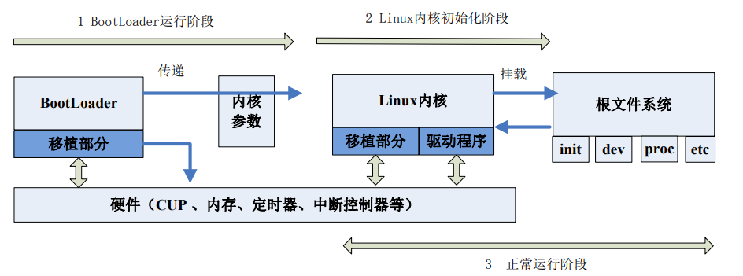
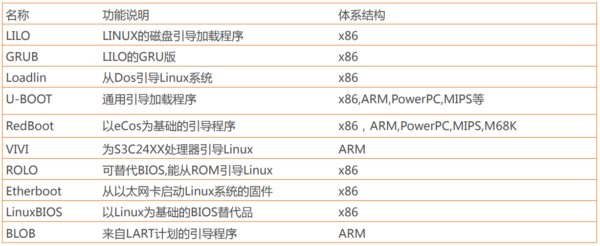
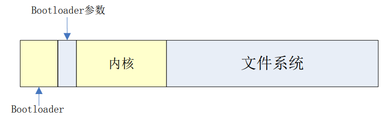
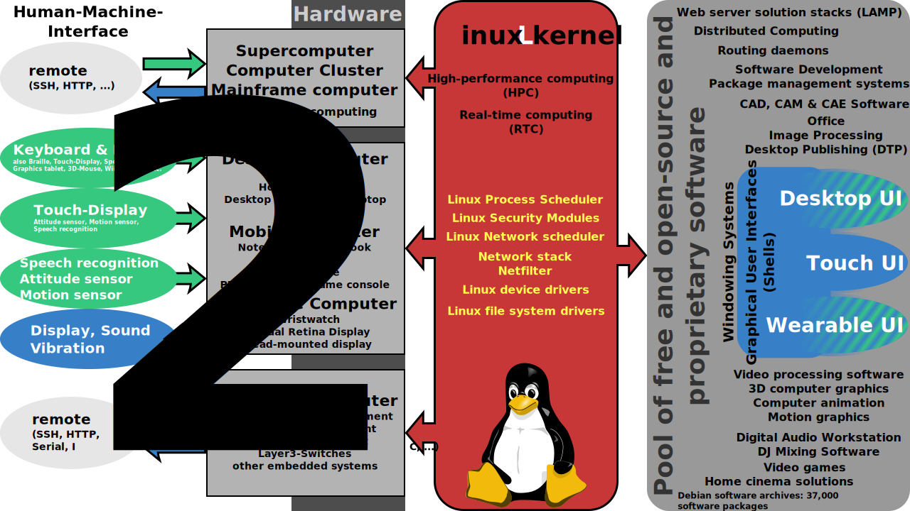
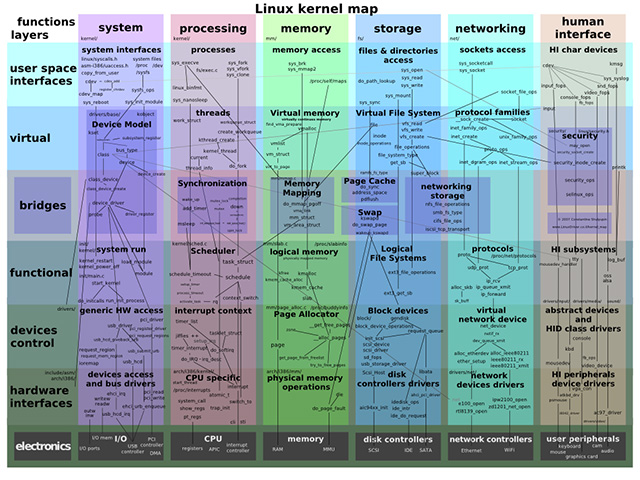
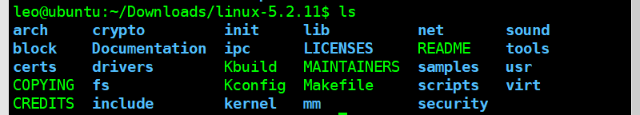
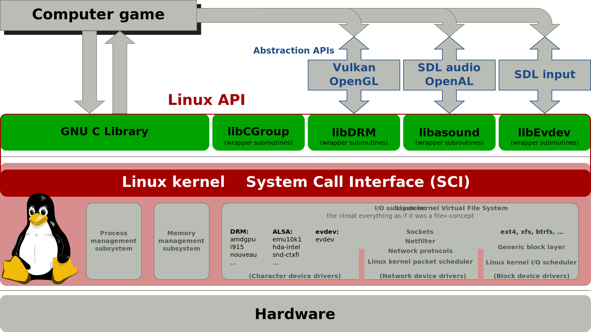

# 第6讲 Linux 账户和登录安全运维、启动过程、内核配置

##  1 本讲主要内容

涉及3个部分：
- 账户和登录安全运维
- 启动过程
- 内核配置

##  2 账户和登录安全运维

账户安全是系统安全的第一道屏障，也是一项核心安全工作。

下面介绍一些在Linux server上常用到的加强账户安全的做法，主要包括：
- 删除特殊的用户和用户组
- 关闭系统不需要的服务
- 密码安全策略
- 合理使用su，sudo命令
- 删减系统登录欢迎信息
- 禁止 Control-Alt-Delete 键盘关闭命令

###  2.1 删除特殊的用户和用户组

Linux 系统安装完毕后，默认有很多不必要的用户和用户组。

如果不需要某些用户或用户组，应立即删除它们，以免被利用。

Linux系统中可以删除的默认用户和用户组大致如下：

####  2.1.1 可删除的用户：
- adm，管理用户
- lp，打印用户
- sync，同步
- shutdown，关机
- halt，悬挂
- news
- uucp，unix间拷贝
- operator
- games
- gopher

删除命令格式：```sudo userdel  <某个用户名>```

####  2.1.2 可删除的用户组

- adm
- lp
- news
- uucp
- games
- dip
- pppusers
- popusers
- slipusers

删除命令格式：```sudo groupdel <某个用户组名>```

有时，某些用户仅仅作为进程调用或用户组调用，并不需要登录功能，此时可以禁止其登录功能。执行下列命令：

```usermod -s /sbin/nologin <某个用户名（例如nagios）>```

###  2.2 关闭不必要的服务

Linux Server 默认安装后会有一些不必要的服务，这些服务是自启动的。

从安全角度讲，开放的服务越多就越不安全，所以除非必要服务都应将其关闭。

具体关闭哪些服务，这需要考虑服务器的用途。

**下面列出的服务往往是服务器运行所必须的，建议启动他们，保证系统正常运行。**
- acpid
  - 电源管理服务
- apmd
  - 高级电源管理服务，监控电池性能
- kudzu
  - 检查硬件变更服务
- crond
  - linux 进程服务
- atd
  - 类似crond，类似windows计划任务
- keytables
  - 用于装载镜像键盘，视需而定
- iptables
  - 内置防火墙
- xinetd
  - 支持多种网络服务的核心守候进程
- xfs
  - x window桌面系统必要服务
- network
  - 启动网络服务
- sshd
  - 远程加密访问
- syslog
  - 系统日志服务


**而下面举出一些常见的无用服务，可以考虑关闭。**
- anacron
  - 用来保证在系统关机时错过的定时任务可以在系统开机之后在执行
- auditd
  - 审计工具 ，常用来对文件修改进行监听
- autofs
  - 实现光驱，软盘等的动态自动挂载
- avahi-daemon
  - 运行在客户机上实施查找基于网络的Zeroconf service的服务守护进程。 
  - 该服务可以为Zeroconf网络实现DNS服务发现及DNS组播规范。 
- avahi-dnsconfd
  - 在没有 DNS 服务的局域网里发现基于 zeroconf 协议的设备和服务，与Bonjour类似
- bluetooth
- cpuspeed
- firstboot
  - Fedora系统的特有的调度任务
  - Fedora系统第一次启动时，执行一次特定任务
- gpm
  - 终端鼠标指针支持（无图形界面）
- haldaemon
  - 维护连接到系统的设备的数据库
- hidd
  - 管理所有可见的蓝牙设备
  - 维护键盘/鼠标等蓝牙输入设备
- ip6tables
  - IPv6软件防火墙
- ipsec
  - IPSec虚拟专用网络
- isdn
  - 专用数字线路，一种互联网的接入方式
- lpd
  - 打印机管理程序
- mcstrans
  - SELinux内核安全套件
- messagebus
  - 进程间通讯服务，与 DBUS 交互
- netfs
  - 自动挂载网络中的共享文件空间
- nfs
  - 标准文件共享方式
- nfslock
- nscd
  - 用户/用户组/DNS解析缓存服务
- pcscd portmap
  - 提供智能卡读卡器支持
- readahead_early
  - 预先加载特定的应用到内存中以提供性能
- restorecond
  - 给 SELinux 监测和重新加载正确的文件上下文
- rpcgssd
  - NFS v4
- rpcidmapd
  - NFS v4
- rstatd
  - 系统内核性能统计
- sendmail
  - IMAP/POP3邮件工具
- setroubleshoot
  - 服务器安全审计工具，从CentOS 6.x开始合并入auditd
- yppasswdd ypserv
  - 用于NIS用户修改服务器端的密码

关闭服务的操作命令为：
```chkconfig --level 345 <服务名> off ```

执行完成后重启服务器。

####  2.2.1 chkconfig 命令说明

chkconfig命令检查、设置系统的各种服务。这是Red Hat公司遵循GPL规则所开发的程序，它可查询操作系统在每一个执行等级中会执行哪些系统服务，其中包括各类常驻服务。

注意：chkconfig不是立即自动禁止或激活一个服务，它只是简单的改变了符号连接。

选项：
- --add：增加所指定的系统服务，让chkconfig指令得以管理它，并同时在系统启动的叙述文件内增加相关数据；
- --del：删除所指定的系统服务，不再由chkconfig指令管理，并同时在系统启动的叙述文件内删除相关数据；
- --level<等级代号>：指定读系统服务要在哪一个执行等级中开启或关毕。
  - level选项可以指定要查看的运行级而不一定是当前运行级。对于每个运行级，只能有一个启动脚本或者停止脚本。
  - 当切换运行级时，init不会重新启动已经启动的服务，也不会再次去停止已经停止的服务。

level等级代号列表：
- 等级0表示：表示关机
- 等级1表示：单用户模式
- 等级2表示：无网络连接的多用户命令行模式
- 等级3表示：有网络连接的多用户命令行模式
- 等级4表示：不可用
- 等级5表示：带图形界面的多用户模式
- 等级6表示：重新启动

####  2.2.2 如何增加一个服务？t

- 1.服务脚本必须存放在/etc/init.d/目录下；
- 2.```chkconfig --add servicename```在chkconfig工具服务列表中增加此服务，此时服务会被在/etc/rc.d/rcN.d中赋予K/S入口了；
- 3.```chkconfig --level 35 mysqld on```修改服务的默认启动等级。


###  2.3 Linux 口令保护

在任何系统中，口令对安全性都起着非常重要的作用。不好的口令可能会导致组织的资源受到损害。为此，组织中的每个人，无论是普通用户还是管理员，都应该遵守口令保护策略。

Linux的口令策略存放在/etc/login.defs文件中。
密码策略存放在：/etc/pam.d/中 

下面给出一些在选择口令或加固口令时必须遵循的规则：


####  2.3.1 口令的创建策略

应遵循如下规则：
- 一个用户在组织中的所有账号不能使用相同的口令。
- 所有与访问相关的口令都应该互不相同。
- 当同一个用户既有系统级账号又有普通账号时，系统级账号的口令一定与其他账号的口令不同。


####  2.3.2 口令的保护策略

应遵循如下规则：
- 口令应该被看做敏感的和机密的信息，因此不能与任何人分享。
- 不应该通过任何电子通讯工具，如电子邮件，来共享口令。
- 永远不要在手机上或者调查问卷中透露口令。
- 不要使用能向攻击者提供线索的口令提示。
- 不要与任何人分享公司的口令，包括行政人员、管理者、同事、甚至家庭成员。
- 不要将口令以书面形式存储在办公室的任何地方。如果将口令存储在移动设备上，那么一定要进行加密。
- 不要使用应用程序的记忆口令功能。
- 如果怀疑口令可能被泄露，那么要尽早上报安全事件并更改口令。


####  2.3.3 口令的更改策略

应遵循以下规则：
- 所有用户和管理员必须定期更改其口令，至少每季度修改一次。
- 组织的安全审计人员必须进行随机检查，检查任何用户的口令是否能够被猜出或者被破解。


###  2.4 合理使用su、sudo命令

su命令是一个用户切换命令，完成普通用户与超级用户之间的切换。

为了保证服务器安全，几乎所有的服务器都**禁止**了超级用户直接登录系统。而是使用普通用户登录，需要提权时使用su命令。

但如果有多个普通用户均使用su，也存在安全隐患，这将泄露root口令。

替代方法就是使用sudo命令，可以行使一定的特权，但又不需要知道root口令。**所以sudo比su命令安全，我们推荐使用sudo。**

普通用户如果想运行sudo命令，必须在/etc/sudoers中进行配置以下内容：

```
# 运行某个用户账户以特权身份访问 /bin/more /etc/shadow
用户账户名  ALL = /bin/more /etc/shadow

# 设置某个用户可以不输入密码执行特权程序（有利于自动执行某些进程）
用户账户名  ALL = NOPASSWORD : /etc/init.d/nagios restart 

# 如果不限制user账户的访问范围，可以使用下面语句
用户账户名  ALL = (ALL)

# 不需要输入密码的特权设置
用户账户名  ALL =  (ALL) NOPASSWD : ALL
```

###  2.5 删减系统登录欢迎信息

为了防止系统欢迎信息不泄露信息给别有用心的人，通常要修改欢迎信息。

这些信息存放在4个文件中：
- /etc/issue
  - 记录了OS名称和版本号
  - 本地终端登录、本地虚拟控制台登录时会显示信息
- /etc/issue.net
  - 记录了OS名称和版本号
  - 通过ssh、telnet登录时会显示信息。
  - 默认情况下不显示，需要显示可以修改/etc/ssh/sshd_config，添加```Banner /etc/issue.net```
- /etc/redhat-release
- /etc/motd
  - 系统公告信息，用户登录时显示。
  - 管理员可用于发布一些软硬件更新信息、警告信息。黑客常用此发表震慑信息。


issue 内各代码意义：
- \d 本地端时间日期； 
- \l 显示第几个终端机接口； 
- \m 显示硬件等级 (i386/i486/i586/i686...)； 
- \n 显示主机网络名称； 
- \o 显示 domain name； 
- \r 操作系统版本 (相当于 uname -r) 
- \t 显示本地端时间； 
- \s 操作系统名称； 
- \v 操作系统版本。

注：ubuntu与别的linux不同，直接修改/etc/motd文件重登录后无效。因为这里/etc/motd是一个符号链接，指向/var/run/motd，应该是一个启动后在生成的文件。在版本10.04中，找到生成的脚本在目录/etc/update-motd.d/中。修改后用：sudo run-parts /etc/update-motd.d  去执行就会立即见到效果，而不用反复注销登录。

###  2.6 禁止 Control-Alt-Delete 键盘关闭命令

Linux默认配置下，同时按下 Control-Alt-Delete 系统将自动重启，这个策略很不安全。

在 Centos 5.x以下禁止的方法是：
```
vi /etc/inittab

# 找到如下内容，在前面加上#，注释掉。
ca::ctrlaltdel:/sbin/shutdown -t3 -r now

# 然后执行
telinit -q
```

在 Centos 6 以下禁止的方法是：修改/etc/init/control-alt-delete.conf文件，找到以下内容，然后注释掉：
```
exec /sbin/shutdown -r now "Control-Alt-Delete pressed"
```

###  2.7 动手实践

参考：实验9Linux账户和登录安全运维实验

##  3 Linux 系统启动过程

###  3.1 x86下Linux启动过程


Linux系统的启动过程，可分为6个阶段：
- BIOS运行阶段
  - BIOS代表主板基本输入/输出系统
  - 执行一些系统完整性检查，搜索，加载并执行引导加载程序。
- MBR运行阶段
  - MBR代表主引导记录。
  - 它位于可引导磁盘的第一个扇区中。通常是/dev/hda或/dev/sda
  - 它包含有关GRUB（或旧系统中的LILO）的信息。
- GRUB运行阶段
  - GRUB代表Grand Unified Bootloader。
  - 如果您的系统上安装了多个内核映像，则可以选择要执行的一个。
  - Grub的配置文件是/boot/grub/grub.conf（/etc/grub.conf是此文件的链接）。
- Kernel运行阶段
  - 按照grub.conf中“ root =”中的指定挂载根文件系统；
  - 内核执行/ sbin / init程序；
  - 由于init是Linux内核执行的第一个程序，因此它的进程ID（PID）为1。
  - 内核将initrd用作临时根文件系统，直到启动内核并装入实际的根文件系统为止。
- Init运行阶段
  - 查看/ etc / inittab文件以确定Linux的运行级别。
  - 以下是可用的运行级别：0 –停止；1 –单用户模式；2 –多用户，无NFS；3 –完全多用户模式；4 –未使用；5 – X11；6 –重新启动
  - 初始化从/ etc / inittab识别默认的初始化级别，并使用它来加载所有适当的程序。默认运行级别设置为3或5

- Runlevel运行阶段
  - 根据您的默认初始化级别设置，系统将从以下目录之一执行程序。
  - 运行级别0 – /etc/rc.d/rc0.d/
  - 运行级别1 – /etc/rc.d/rc1.d/
  - 运行级别2 – /etc/rc.d/rc2.d/
  - 运行级别3 – /etc/rc.d/rc3.d/
  - 运行级别4 – /etc/rc.d/rc4.d/
  - 运行级别5 – /etc/rc.d/rc5.d/
  - 运行级别6 – /etc/rc.d/rc6.d/
  - 在/etc/rc.d/rc*.d/目录下，您会看到以S和K开头的程序。
  - 在启动过程中使用以S开头的程序。S用于启动。
  - 在关机期间使用以K开头的程序。K为杀戮。


###  3.2 嵌入式Linux启动过程

- BootLoader运行阶段 
- Linux初始化阶段 
- 系统的正常运行阶段



###  3.3 Linux Bootloader

引导加载程序（Bootloader）是系统加电后运行的第一段软件代码。

Bootloader是与系统硬件环境高度相关的初始化软件，它担负着初始化硬件和引导
操作系统的双重责任。

Bootloader分为：
- Boot：启动、上电 
- Loader：加载系统

了解Bootloader，对了解系统底层运行机制、优化和快速启动的研究都有重要的意义。

####  3.3.1 Bootloader特点

- 功能上
  - 初始化硬件设备
  - 建立内存空间的映射图
  - 调整系统的软硬件环境，以便操作系统内核启动
  
- 平台上
  - 不通用
  - 依赖于硬件CPU
  - 依赖于主板board
  - 不同的CPU有不同的BootLoader

####  3.3.2 BootLoader支持的体系结构 



####  3.3.3 BootLoader的安装

系统加电或复位后，所有的CPU通常都从某个由CPU制造商预先安排的地址上取指令。比如，基于ARM7TDMI的CPU在复位时通常都从地址 0x00000000取它的第一条指令。

基于CPU 构建的系统通常都有某种类型的固态存储设备被映射到这个预先安排的地址上。比如：ROM、EEPROM 或 FLASH 等。

因此在系统加电后，CPU将首先执行Bootloader 程序。



####  3.3.4 BootLoader的启动过程 

Boot Loader的启动过程可以是：
- 单阶段（Single Stage）
  - 一些只需完成很简单功能的boot loader可能是单阶段的

- 多阶段（Multi-Stage）
  - 通常多阶段的 Boot Loader 能提供更为复杂的功能，以及更好的可移植性。从固态存储设备上启动的 Boot Loader 大多都是 2 阶段的启动过程，也即启动过程可以分为 stage1 和 stage2 两部分。

##  4 Linux 内核

Linux是一个用C语言写成、符合POSIX标准的类Unix操作系统, 是最受欢迎的免费操作系统内核。“内核”指的是一个提供硬件抽象层、磁盘及文件系统控制、多任务等功能的系统软件。



---




一个套内核源文件包括以下内容:

 

###  4.1 linux 内核API

 

###  4.2 动手实践

参考：实验8Linux内核配置编译安装实验