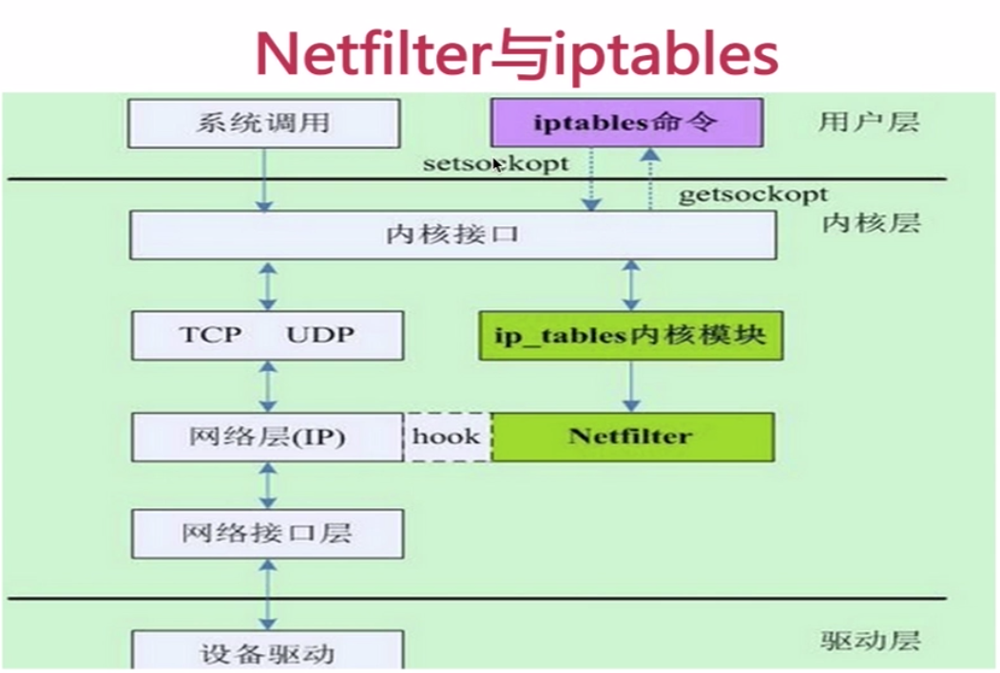
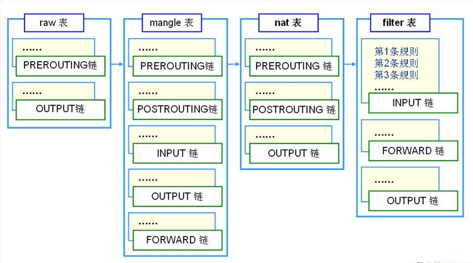

# 第9讲 Linux 网络安全

在本讲讨论以下问题：
- 管理TCP/IP网络
- ssh远程登陆认证
- 使用iptables配置防火墙

- 阻止地址伪装
- 拦截入站流量
- 配置使用TCP Wrapper

## 管理TCP/IP网络

当计算机之间彼此连接、形成网络，开始相互交换信息与资源时，管理网络信息就成为系统管理员的一项重要任务。

本小节主要涉及以下内容：
- 以太网卡配置
- DNS配置
- 网关配置

### 以太网卡（Ethernet Interface）配置

在Ubuntu Linux中，以太网卡的命名使用 eno1、ens33等命名。

为了快速识别所有以太网卡，可以使用命令```ip a``` 或命令```sudo lshw -class network```。后面这个命令用于查看物理网卡。

为了配置网卡，可以编辑/etc/network/interfaces 文件。例如：```sudo nano /etc/network/interfaces```。

> 注意，修改配置前请进行备份，例如执行```cp /etc/network/interfaces{,.bak}```

打开后内容如下：
```
source /etc/network/interfaces.d/*

# The loopback network interface
auto lo
iface lo inet loopback

# The primary network interface
auto ens33
iface ens33 inet dhcp

```

当前配置是动态获取IP地址；如果要设置静态IP地址，可以修改其中语句，改为如下情形：

```
source /etc/network/interfaces.d/*

# The loopback network interface
auto lo
iface lo inet loopback

# The primary network interface
auto ens33
iface ens33 inet static
address 10.10.10.199
netmask 255.255.255.0
gateway 10.10.10.2
```
保存后，重启Linux服务器，然后运行下列命令：```sudo ifup ens33 ```，之后可以发现ip地址已经改变为静态的。

### DNS配置

Ubuntu Linux server的DNS配置可以设定在网卡配置文件中。执行命令，打开文件。

```sudo nano /etc/network/interfaces```

然后在尾部添加如下内容：
```
dns-nameserver 8.8.8.8
dns-nameserver 9.9.9.9
dns-nameserver 114.114.114.114
```

dns地址可以在/etc/network/interfaces文件中配置，也可以在/etc/resolvconf/resolv.conf.d/base文件中。

配置完成执行```/etc/init.d/networking restart```。

然后```cat /etc/resolv.conf```文件可以看到你配置的dns地址。

>注意不要直接修改/etc/resolv.conf这个文件，因为重启网络后，这里面的内容会重新生成。

### 网关配置

首选需要检查路由信息。
```netstat -rn```

网关信息也在/etc/network/interfaces中配置。

## SSH 远程登陆认证

这一部分介绍以下几方面知识：
- 使用SSH远程访问服务器/主机
- 启用/取消SSH的root登录
- 限制SSH基于密码登录的远程访问
- 远程复制文件

### 使用SSH远程访问服务器/主机

SSH，即Secure Shell，是用于安全登录远程系统的协议，是访问远程Linux系统最常用的方法。

SSH是一种协议，实现该协议的软件工具不止一个，我们可以使用免费的一款名叫OpenSSH的软件。在Linux系统中安装好OpenSSH后，就可以使用命令“ssh”启动它。

如果系统中还没有安装SSH软件，那么必须安装SSH的客户端和服务器端软件。

在作为SSH服务器的Ubuntu上安装OpenSSH服务器端程序的命令如下：
```sudo  apt  install  openssh-server```

在作为SSH客户端的Ubuntu上安装OpenSSH的客户端程序，命令如下：
```sudo  apt  install  openssh-client```

新版本的OpenSSH会在安装完毕后自行启动SSH服务，如果它未能正常启动，我们可以执行下列命令手动启动：
```sudo  service  ssh  start```

现在我们试着使用SSH从客户端登录服务器，在客户端主机的终端上执行下列命令：
```ssh  服务器的ip地址```

如果我们想使用不同的用户名远程登录服务器，则可以运行命名：
```ssh  用户名@服务器的ip地址```

### SSH配置

配置openssh通过配置文件实现的。有两个配置文件：
- ssh_config，针对客户端的配置文件
- sshd_config，针对服务端的配置文件

为满足ssh远程访问的认证需求，需要配置ssh，其主配置文件是/etc/ssh/sshd_config。

在进行任何修改之前，请先备份原始配置文件，命令如下：
```sudo cp /etc/ssh/ssh_config{,.bak}```

或

```sudo cp /etc/ssh/sshd_config{,.bak}```

先使用vi或nano等文本编辑器打开配置文件/etc/ssh_config，基本内容如下：
```
Host *
#   ForwardAgent no 
#   ForwardX11 no
#   ForwardX11Trusted yes
#   RhostsRSAAuthentication no
#   RSAAuthentication yes
#   PasswordAuthentication yes
#   HostbasedAuthentication no
#   GSSAPIAuthentication no
#   GSSAPIDelegateCredentials no
#   GSSAPIKeyExchange no
#   GSSAPITrustDNS no
#   BatchMode no
#   CheckHostIP yes
#   AddressFamily any
#   ConnectTimeout 0
#   StrictHostKeyChecking ask
#   IdentityFile ~/.ssh/identity
#   IdentityFile ~/.ssh/id_rsa
#   IdentityFile ~/.ssh/id_dsa
#   IdentityFile ~/.ssh/id_ecdsa
#   IdentityFile ~/.ssh/id_ed25519
#   Port 22 #连接端口地址，建议修改为不常用地址，例如43415
#   Protocol 2
#   Cipher 3des
#   Ciphers aes128-ctr,aes192-ctr,aes256-ctr,arcfour256,arcfour128,aes128-cbc,3des-cbc
#   MACs hmac-md5,hmac-sha1,umac-64@openssh.com,hmac-ripemd160
#   EscapeChar ~
#   Tunnel no
#   TunnelDevice any:any
#   PermitLocalCommand no
#   VisualHostKey no
#   ProxyCommand ssh -q -W %h:%p gateway.example.com
#   RekeyLimit 1G 1h
    SendEnv LANG LC_*
    HashKnownHosts yes
    GSSAPIAuthentication yes
    GSSAPIDelegateCredentials no

```
说明：
- "Host"只对匹配后面字串的计算机有效，“*”表示所有的计算机。
  - Host下面缩进的选项都适用于该设置，可以指定某计算机替换*号使下面选项只针对该算机器生效。
- “ForwardAgent” 设置连接是否经过验证代理（如果存在）转发给远程计算机。
- "ForwardX11"设置X11连接是否被自动重定向到安全的通道和显示集（DISPLAY set）。
- "RhostsAuthentication"设置是否使用基于rhosts的安全验证。
- "RhostsRSAAuthentication"设置是否使用用RSA算法的基于rhosts的安全验证。
- "RSAAuthentication"设置是否使用RSA算法进行安全验证。
- "PasswordAuthentication"设置是否使用口令验证。
- "FallBackToRsh"设置如果用ssh连接出现错误是否自动使用rsh，由于rsh并不安全，所以此选项应当设置为"no"。
- "UseRsh"设置是否在这台计算机上使用"rlogin/rsh"，原因同上，设为"no"。
- "BatchMode"：批处理模式，一般设为"no"；如果设为"yes"，交互式输入口令的提示将被禁止，这个选项对脚本文件和批处理任务十分有用。
- "CheckHostIP"设置ssh是否查看连接到服务器的主机的IP地址以防止DNS欺骗。建议设置为"yes"。
- "StrictHostKeyChecking"如果设为"yes"，ssh将不会自动把计算机的密匙加入"$HOME/.ssh/known_hosts"文件，且一旦计算机的密匙发生了变化，就拒绝连接。
- "IdentityFile"设置读取用户的RSA安全验证标识。
- "Port"设置连接到远程主机的端口，ssh默认端口为22。
- “Cipher”设置加密用的密钥，blowfish可以自己随意设置。
- “EscapeChar”设置escape字符。
- 注意：带“#”表示该句为注释，也表示系统默认设置。

接着，我们分析配置文件/etc/sshd_config。

```
# What ports, IPs and protocols we listen for
Port 22
# Use these options to restrict which interfaces/protocols sshd will bind to
#ListenAddress ::
#ListenAddress 0.0.0.0
Protocol 2
# HostKeys for protocol version 2
HostKey /etc/ssh/ssh_host_rsa_key
HostKey /etc/ssh/ssh_host_dsa_key
HostKey /etc/ssh/ssh_host_ecdsa_key
HostKey /etc/ssh/ssh_host_ed25519_key
#Privilege Separation is turned on for security
UsePrivilegeSeparation yes

# Lifetime and size of ephemeral version 1 server key
KeyRegenerationInterval 3600
ServerKeyBits 1024

# Logging
SyslogFacility AUTH
LogLevel INFO

# Authentication:
LoginGraceTime 120
PermitRootLogin prohibit-password
StrictModes yes

RSAAuthentication yes
PubkeyAuthentication yes
#AuthorizedKeysFile     %h/.ssh/authorized_keys

# Don't read the user's ~/.rhosts and ~/.shosts files
IgnoreRhosts yes
# For this to work you will also need host keys in /etc/ssh_known_hosts
RhostsRSAAuthentication no
# similar for protocol version 2
HostbasedAuthentication no
# Uncomment if you don't trust ~/.ssh/known_hosts for RhostsRSAAuthentication
#IgnoreUserKnownHosts yes

# To enable empty passwords, change to yes (NOT RECOMMENDED)
PermitEmptyPasswords no

# Change to yes to enable challenge-response passwords (beware issues with
# some PAM modules and threads)
ChallengeResponseAuthentication no

# Change to no to disable tunnelled clear text passwords
#PasswordAuthentication yes

# Kerberos options
#KerberosAuthentication no
#KerberosGetAFSToken no
#KerberosOrLocalPasswd yes
#KerberosTicketCleanup yes

# GSSAPI options
#GSSAPIAuthentication no
#GSSAPICleanupCredentials yes

X11Forwarding yes
X11DisplayOffset 10
PrintMotd no
PrintLastLog yes
TCPKeepAlive yes
#UseLogin no

#MaxStartups 10:30:60
#Banner /etc/issue.net

# Allow client to pass locale environment variables
AcceptEnv LANG LC_*

Subsystem sftp /usr/lib/openssh/sftp-server

UsePAM yes

```

说明：
- "ListenAddress”设置sshd服务器绑定的IP地址。
- "HostKey”设置包含计算机私人密匙的文件。
- "ServerKeyBits”定义服务器密匙的位数。
- "LoginGraceTime”设置如果用户不能成功登录，在切断连接之前服务器需要等待的时间（以秒为单位）。
- "KeyRegenerationInterval”设置在多少秒之后自动重新生成服务器的密匙（如果使用密匙）。重新生成密匙是为了防止用盗用的密匙解密被截获的信息。
- "PermitRootLogin”设置是否允许root通过ssh登录。这个选项从安全角度来讲应设成"no"。
- "IgnoreRhosts”设置验证的时候是否使用“rhosts”和“shosts”文件。
- "IgnoreUserKnownHosts”设置ssh daemon是否在进行RhostsRSAAuthentication安全验证的时候忽略用户的"$HOME/.ssh/known_hosts”
- "StrictModes”设置ssh在接收登录请求之前是否检查用户家目录和rhosts文件的权限和所有权。这通常是必要的，因为新手经常会把自己的目录和文件设成任何人都有写权限。
- "X11Forwarding”设置是否允许X11转发。
- "PrintMotd”设置sshd是否在用户登录的时候显示“/etc/motd”中的信息。
- "SyslogFacility”设置在记录来自sshd的消息的时候，是否给出“facility code”。
- "LogLevel”设置记录sshd日志消息的层次。INFO是一个好的选择。查看sshd的man帮助页，已获取更多的信息。
- "RhostsAuthentication”设置只用rhosts或“/etc/hosts.equiv”进行安全验证是否已经足够了。
- "RhostsRSA”设置是否允许用rhosts或“/etc/hosts.equiv”加上RSA进行安全验证。
- "RSAAuthentication”设置是否允许只有RSA安全验证。
- "PasswordAuthentication”设置是否允许口令验证。
- "PermitEmptyPasswords”设置是否允许用口令为空的帐号登录。
- "AllowUsers”的后面可以跟任意的数量的用户名的匹配串，这些字符串用空格隔开。主机名可以是域名或IP地址。

 
#### 改变默认端口

可以看到sshd服务默认的入站连接监听端口为22。

为了加强安全性，防止端口扫描工具对sshd服务的扫描，我们可以将/etc/sshd_config文件中端口号设置为某个非标准的端口号，例如：43415。

修改后要重启sshd服务，配置才能生效。

之后用户在客户端连接该SSH服务器时，需要运行下列带端口参数的命令：
```ssh  -p  端口号  服务器的ip地址```


#### 禁止root账户的SSH 登录

Linux系统默认存在root账户，并且默认是启用的。

如果未授权用户能够以root身份经SSH访问Linux系统，那整个系统将暴露在攻击者面前。

使用文本编辑器打开SSH服务器的主配置文件/etc/ssh/sshd_config，命令如下：
```sudo  nano  /etc/ssh/sshd_config```

在配置文件中找到含有“PermitRootLogin  yes”的一行。将“yes”改写为“no”，即“PermitRootLogin  no”。

完成上述步骤后，使用下列命令重新启动SSH服务：
```sudo  service  ssh  restart```

现在让我们尝试以root身份登录SSH服务器。由于之前的设置，访问会被拒绝，而SSH客户端将报告一个“Permission denied”错误。

如果我们仍想以root身份登录SSH服务器时，那么我们必须首先以普通用户登录，然后使用“su”命令切换为root身份，如下图所示。如果登录时使用的用户未被写在/etc/sudoers文件中，那么该用户就不能切换为root，这样能够防止用户越权，使系统更加安全。

#### 标准用户访问设置

假设系统中有许多用户，而我们需要编辑/etc/ssh/sshd_config文件仅允许一部分用户使用SSH服务。

使用下列命令打开配置文件：
```sudo nano /etc/ssh/sshd_config```

在配置文件中增加如下配置，允许user1和user2使用SSH服务：
```AllowUsers  user1 user2```

之后重启SSH服务，使配置生效。
```sudo service ssh restart```

现在，当我们尝试以user1、user2登录SSH服务器时，登录是成功的。其他用户登录时，由于没有被增加到配置文件中，所以登录失败，客户端返回“Permission denied”的错误消息。

#### 基于密钥加强SSH远程访问的安全性

基于密钥的认证方法能够加强SSH远程访问的安全性。

在使用基于密钥的认证方法之前，需要先创建一对密钥：一个私钥和一个公钥。

1.在客户端或本地系统中，我们执行下列命令生成SSH密钥对：
```ssh-keygen  -t  rsa```

2.在生成密钥时，可以采用默认值或根据自己需要进行改变。生成密钥程序还会要求键入一个密码，你可以键入任何字符，或者什么都不输入，该密码用于保护私钥文件。

3.密钥对生成后将保存在本地目录“~./ssh/”中，进入该目录并使用“ls -l”命令可以查看密钥文件的细节。

4.现在，我们需要将公钥文件拷贝到远程SSH服务器上，可以运行下列命令完成这一操作（假设远程SSH服务器的ip地址为192.168.1.101）：
```ssh-copy-id 192.168.1.101```

5.上述命令的执行会在SSH服务器与客户端间建立一个SSH会话，并且提示你键入用户账户密码。键入正确的密码后，公钥文件将被拷贝到远程服务器上。

6.当公钥文件成功拷贝到服务器上后，再次使用命令“ssh  192.168.1.101”尝试登录SSH服务器

我们发现，登录时要求输入私钥文件的密码，这是由于我们在创建SSH密钥对时配置了密码字段。如果在创建密钥对时没有输入密钥，那么这里就不会提示输入密码而直接登录到远程SSH服务器。

---

##  使用 IPTABLES 配置防火墙

IPTABLES 是Linux中设置的一款常见软件防火墙工具。

IPTABLES 其实不是真正的防火墙，我们可以把它理解成一个客户端代理，用户通过 iptables 这个代理，将用户的安全设定执行到对应的"安全框架"中，这个"安全框架"才是真正的防火墙，这个框架的名字叫 netfilter。



### iptables的规则（rules）

IPTABLES 按“规则”办事。

**这里的“规则”是指：如果数据包头符合这样的条件，则按设定动作处理这个数据包。**

规则存储在信息包过滤表中，这些规则指定了：
- 源地址
- 目的地址
- 传输协议（TCP、UDP、ICMP)
- 服务协议（HTTP、FTP、SMTP等）

IPTABLES（防火墙）的设置工作就是对规则的增加、修改、删除。

常见的设定动作（目标值）有：
- ACCEPT – 允许防火墙接收数据包
- DROP – 防火墙丢弃包
- QUEUE – 防火墙将数据包移交到用户空间
- RETURN – 防火墙停止执行当前链中的后续Rules，并返回到调用链(the calling chain)中。

### IPTABLES 的规则链（rule chains）

规则是单独的处理策略，但有时单一的规则无法应对复制的情况，所以考虑将规则们串成链。此时，一个数据包将顺序被规则链中的所有规则检查和执行动作。

常见的链有：
- INPUT链 – 处理来自外部的数据。
- OUTPUT链 – 处理向外发送的数据。
- FORWARD链 – 将数据转发到本机的其他网卡设备上。

### IPTABLES 的表

由于IPTABLES可以作为包过滤器、NAT转发器、数据操作工具等，所以iptables为完成不同的工作而设立了表（tables）。常见的表有：
- Filter table
- NAT table
- Mangle table
- Raw table

#### Filter表

Filter表示iptables的默认表。如果没有自定义表，那么就默认使用filter表。

它具有以下三种内建链：
- INPUT链 – 处理来自外部的数据。
- OUTPUT链 – 处理向外发送的数据。
- FORWARD链 – 将数据转发到本机的其他网卡设备上。

#### NAT表

NAT表有三种内建链：
- PREROUTING链
  - 处理刚到达本机并在路由转发前的数据包。
  - 它会转换数据包中的目标IP地址（destination ip address）。
  - 通常用于DNAT(destination NAT)。
- POSTROUTING链
  - 处理即将离开本机的数据包。
  - 它会转换数据包中的源IP地址（source ip address）。
  - 通常用于SNAT（source NAT）。
- OUTPUT链
  - 处理本机产生的数据包。

#### Mangle表

Mangle表用于指定如何处理数据包。

它能改变TCP头中的QoS位。Mangle表具有5个内建链：
- PREROUTING
- OUTPUT
- FORWARD
- INPUT
- POSTROUTING

#### Raw表

Raw表用于处理异常，它具有2个内建链：
- PREROUTING 
- OUTPUT 



---

### IPTABLES命令

#### 查看当前系统默认启动的IPTABLES模块

为了了解当前iptables的功能，可以使用“lsmod”命令查看当前系统默认启动的iptables模块有哪些。
```sudo lsmod | grep ip_tables```

#### IPTABLES命令格式

IPTABLES命令格式为```iptables [-ACDIRD...] [-t 表] <chain> <规则说明> [选项]```。

选项：
- -A chain，向某个规则链(由chain指定)增加一条规则。
- -C chain，检查某条链中是否有某个规则。
- -D chain，从某个链中删除一条规则。
- -D chain rulenum，从某个链中删除第n号规则（第一号为1）。
- -I chain [rulenum]，在链中插入一条规则，默认位置是最前面，即rulenum=1。
- -R chain rulenum，表示在链中替换第rulenum条规则。
- -L [chain [rulenum]]，显示当前某链、某过滤规则。
- -S [chain [rulenum]]，打印当前某链、某过滤规则。
- -F [chain] ,删除某链或所有链的所有规则。
- -Z [chain [rulenum]]，将某个链或所有链的计数器归零。
- -N chain，生成一个用户定义的新链。
- -X [chain]，删除一个用户定义的链。
- -P chain target，在某个链上对某个动作目标，改变策略。
- -E old-chain new-chain，表示改变链名。

选项部分：
- --ipv4 或 -4，表示Nothing (line is ignored by ip6tables-restore)
- --ipv6 或 -6，表示Error (line is ignored by iptables-restore)
- --protocol 或	-p proto，表示设定协议 by number or name, eg. `tcp'
- --source	或 -s address [/mask][...] ，表示设定source specification
- --destination 或 -d address[/mask][...]，表示设定destination specification
- --in-interface 或 -i input name[+]，表示设定网卡接口名 ([+] for wildcard)
- --jump 或 -j target，表示执行规则目标动作(may load target extension)
- --goto 或 -g chain，表示跳到某个链，没有返回。
- --match 或 -m match，表示匹配某个扩展 (may load extension)
- --numeric	-n，表示地址或端口按数字形式输出。
- --out-interface 或 -o output name[+]，表示输出到网卡接口名。
- --table 或 -t table，表示要操作的表，默认是filter。
- --wait 或	-w [seconds]，表示等待xtables锁。
- --line-numbers，打印监听时的行数.
- --exact 或 -x，表示expand numbers (display exact values)
- --fragment 或 -f，表示match second or further  fragments only
- --modprobe=<command> ，表示尝试插入模块
- --set-counters PKTS BYTES	，表示在插入或增加规则时设置计数器
- --version 或	-V，表示显示iptables的版本。

#### 显示IPTABLES当前过滤规则

执行命令```sudo iptables -L```，可以查看当前iptables中的规则。

内容大致如下：
```
Chain INPUT (policy ACCEPT)
target     prot opt source               destination         

Chain FORWARD (policy DROP)
target     prot opt source               destination                  
ACCEPT     all  --  anywhere             anywhere             ctstate RELATED,ESTABLISHED
DOCKER     all  --  anywhere             anywhere            
ACCEPT     all  --  anywhere             anywhere            
ACCEPT     all  --  anywhere             anywhere            

Chain OUTPUT (policy ACCEPT)
target     prot opt source               destination              
```
上述内容中，大多数都是允许（ACCEPT)，或内容为空。

通常服务器初始建立时，iptables防火墙设置即为空。意味着允许所有流量流入、流出。

#### 查看IPTABLES每条链的策略

可以使用 ```sudo iptables -S``` 显示每条链的策略，策略规定了iptables每条链对数据包的默认处理方式。
```
-P INPUT ACCEPT
-P FORWARD DROP
-P OUTPUT ACCEPT
-N DOCKER
-N DOCKER-ISOLATION-STAGE-1
-N DOCKER-ISOLATION-STAGE-2
-N DOCKER-USER
-A FORWARD -j DOCKER-USER
-A FORWARD -j DOCKER-ISOLATION-STAGE-1
-A FORWARD -o docker0 -m conntrack --ctstate RELATED,ESTABLISHED -j ACCEPT
-A FORWARD -o docker0 -j DOCKER
-A FORWARD -i docker0 ! -o docker0 -j ACCEPT
-A FORWARD -i docker0 -o docker0 -j ACCEPT
-A DOCKER-ISOLATION-STAGE-1 -i docker0 ! -o docker0 -j DOCKER-ISOLATION-STAGE-2
-A DOCKER-ISOLATION-STAGE-1 -j RETURN
-A DOCKER-ISOLATION-STAGE-2 -o docker0 -j DROP
-A DOCKER-ISOLATION-STAGE-2 -j RETURN
-A DOCKER-USER -j RETURN

```

#### 允许已建立的连接或会话

下面我们尝试增加一条规则，以保证当前所有在线的网络连接仍保持工作（这种操作常见于正在运行的服务器中，这使这些连接不会因当前设置而被阻塞）：
```sudo iptables  -A  INPUT  -m  conntrack  --ctstate  ESTABLISHED,RELATED  -j  ACCEPT```

说明：
- -A，表示在已有表中增加一条规则
- INPUT，表示这条规则是默认工作表filter表的INPUT链。
- -m conntrack，表示显示调用conntrack模块，跟踪记录每个连接的状态；
- --ctstate  ESTABLISHED,RELATED，表示检测在线数据包的状态，对于当前状态为ESTABLISHED 或 RELATED的数据包则根据参数“-j”的设置进行处理；
- -j  ACCEPT，表示接收且允许满足前面条件的数据包通过防火墙。

执行成功后，运行```iptables -L```能够发现规则已被增加。结果如下：
```
Chain INPUT (policy ACCEPT)
target     prot opt source               destination         
ACCEPT     all  --  anywhere             anywhere             ctstate RELATED,ESTABLISHED

```
#### 禁止或允许数据包经特定端口入站

假设当前我们不允许SSH连接通过iptables防火墙，那么我们可以增加下列规则：
```
sudo iptables -A INPUT -p tcp --dport 22 -j DROP

iptables -L
```

> 这里假设当前SSH连接使用了22号端口。

此时，新的SSH请求将无法连接。

如果要撤销这条规则(假设它是INPUT链中第2条规则)，可以使用下列命令：
```sudo iptables -D INPUT 2```

通常情况下，我们会在iptables中添加如下允许通过的规则：
```
# 允许ssh
sudo iptables -A INPUT -p tcp --dport ssh -j ACCEPT
# 若为web server，则允许web
sudo iptables -A INPUT -p tcp --dport 80 -j ACCEPT
```

#### 保证LOOPBACK服务进程相互通信

为使当前服务器（本机）的功能保持正常，需要保证本机上的服务进程之间能够相互通信，不被iptable规则所阻塞。

可以增加下列规则，允许所有被送到loopback接口的数据包通过。
```sudo iptables  -I  INPUT  1  -i  lo  -j  ACCEPT```

说明：
- 通常情况下某个规则链中都存在多条规则，规则的执行顺序将严格按照排队的先后依次执行。
- 选项“-l”表示向iptables规则中插入一条新规则，它会把这条规则插在规则链的最前端，会使这条规则优先于其他规则被首先执行。
- 若使用选项“-A”将规则追加到规则链的尾部，那么这条规则将最后被执行。

执行后，可运行下列命令查看详情：
```sudo iptables -L -v```

#### 阻塞其他INPUT的数据包通过

假定我们已经根据需要，允许INPUT的各种特定数据包通过防火墙；接下来我们还要阻塞其他的进入INPUT链的数据包。

为实现这一点，可以追加下列规则：
```iptables  -A  INPUT  -j  DROP```

#### 日志功能

可以使用下列命令查看按规则处理的流量：
```sudo iptables -I INPUT 5 -m limit --limit 5/min -j LOG --log-prefix "iptables denied: " --log-level 7```

#### 保存iptables现有设置

到目前为止我们增加到iptables中的规则都是临时性的，一旦系统重启动，这些规则将被清空。

可以使用下列命令保存设置：
```iptables-save```
或
```iptables-restore```

也可以将规则保存到文件：
```sudo sh -c "iptables-save > /etc/iptables.rules"```

