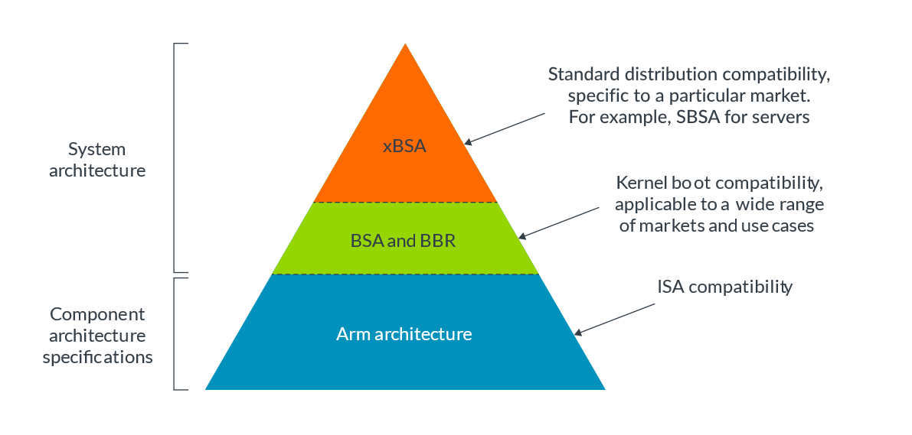
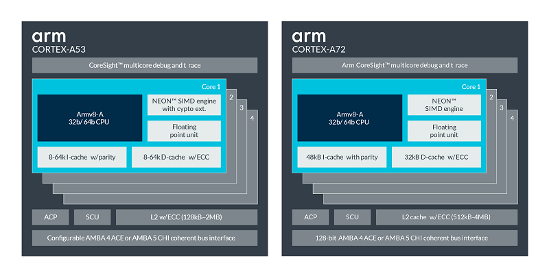
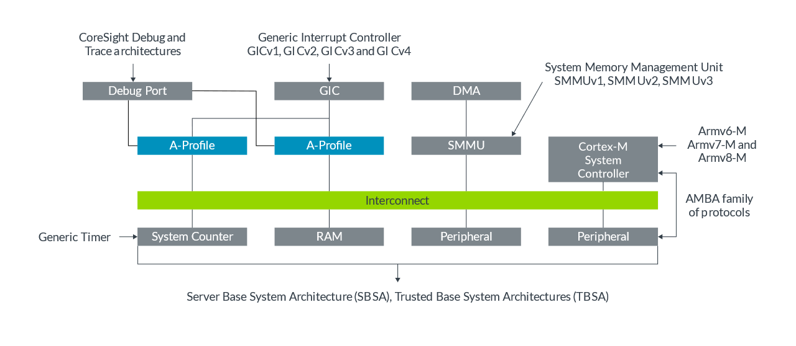
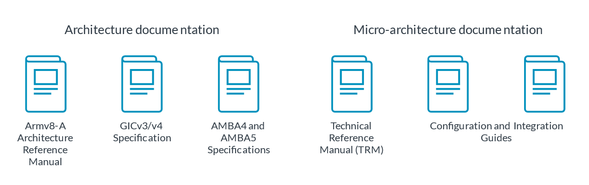
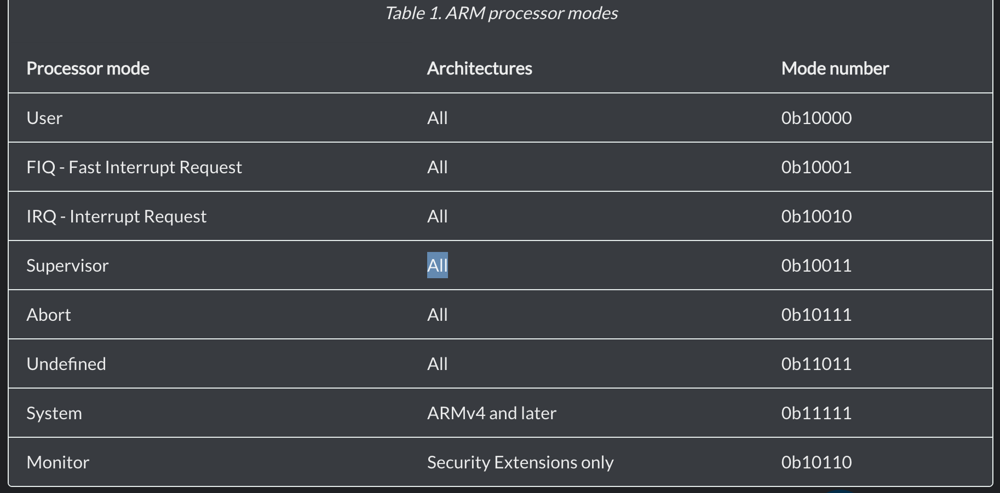
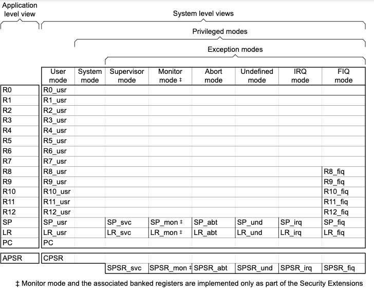

# ARM Basic

来源：《ARM Architecture Reference Manual》

## 引言
ARM 与 Intel 的指令集不同，Intel 使用了 CISC 复杂指令，ARM 采用了 RISC 精简指令集。精简指令集通过减少每条指令的时钟周期来缩短执行时间，形成更快的指令执行，但是由于指令较少，所以指令序列会比较长。


## 术语
- Thumb ：ARM指令集中高代码密度的指令子集。


## ARM 架构CPU的结构

ARM 架构师一种使用RISC（精简指令集）的CPU架构。它是应用最广的一种处理器架构。过去30年间，有着超过 2150亿基于ARM的芯片应用在各种产品中，从sesors、wearables、smartphones 到超级计算机。ARM CPU架构的优势在于：
- 集成了安全
- 高性能且节能
- 庞大的生态
- 各类市场上的广泛应用

ARM CPU Arch 定义了基本指令集、异常和内存模型，这些是OS、hypervisor等软件所需要了解的。

ARM CPU 微架构决定了如何实现处理器设计要求，如电源、性能、面积、管道长度、缓存级别等问题。

下面的图显示了基于ARM系统的示例：


上图的手机包含了下列处理器类型：
- 一个A-profile 处理器作为主CPU，运行OS，例如Android。这类处理器例如 Armv8-A或Armv9-A。
- 一个基于R-profile 的蜂窝modem，提供连接性
- 几个M-profile 的处理器控制运行，例如系统电源管理
- SIM 卡使用SecurCore，是一个M-profile处理器，带有额外的安全特性。SecurCore通常用在smart cards中。

下面仅讨论 A-Profile。

### 架构的含义

架构这个词意味着一组功能规范。在Arm arch中，我们指用于处理器的功能规范。一个架构规定了一个处理器将如何表现？例如他有什么指令、指令可以做什么？

架构指定了下列内容：
- 指令集
- 寄存器集
- 异常模式
- 内存模式
- Debug、trace和profiling


### 系统架构

系统包含了比处理器更复杂的内容。Arm 也提供了描述系统需求的说明规范。从下图中可以看出系统与处理器的关系：



这个规范是软件兼容性的基础。根据这一规范构建硬件，意味着可以编写软件与之匹配。根据这个规范写的软件可以在相兼容的硬件上运行。ARM 架构是第一层，通过ISA（Instruction Set Architecture）为软件提供了通用的编程模型。


基本系统架构（BSA）规范描述了一个系统软件所依赖的硬件系统架构。BSA覆盖了处理器和系统架构的各方面，例如：中断控制、时钟、其他OS所需的通用设备。他提供了一个可靠的用于标准OS、hypervisors和firmware的平台。

BSA 可用于很多不同的市场和用例，其他标准可以建在 BSA之上，提供专用市场的标准。例如，服务器BSA是面向服务器的BSA。SBSA 描述了一个服务器OS硬件和功能需求。

基本启动需求（Base Boot Requirements，BBR）规范包含了基于ARM 架构和OS、Hypervisor可依赖的系统的需求。这个规范建立了固件接口需求，例如 PSCI、SMCCC、UEFI、ACPI 和 SMBIOS。

BBR 还提供了为目标特定用例的菜单，例如：
- SBBR：规定了UEFI、ACPI和SMBIOS需求，来启动通用的、off-the-shelf的操作系统和虚拟机，例如windows、vmware、rhel、oracle linux、amazon linux。SBBR 也支持别的OS，例如Debian、fedora、centos、sles、ubuntu、opensuse、freebsd、netbsd。
- EBBR：根据EBBR规范规定了UEFI需求来启动通用的os
- LBBR：规定了为LinuxBoot固件的特定的潜在需求。

### 架构和微架构

架构不能告诉你一个处理器如何被构建，或者如何工作。构建和处理器设计由微架构给出。

微架构告诉我们一个特定处理器如何工作，包括以下内容：
- 排线长度和层次
- 缓存的数量和大小
- 独立指令的时钟周期数
- 其他可选的功能

例如：cortex-a53 和 cortex-a72 都由 armv8-A架构实现，这意味着他们使用了同样的架构，但他们有不同的微架构。如下表所示：



|Architecture |Cortex-A53|Cortex-A72|
|-|-|-|
|Target|Optimized for power efficiency|Optimized for performance|
|Pipeline|8 stages, In-order|15+ stages ,Out-of-order|
|Caches|L1 I cache: 8KB - 64KB,L1 D cache: 8KB - 64KB,L2 cache: optional, up to 2MB|L1 I cache: 48KB fixed,L1 D cache: 32KB fixed,L2 cache: mandatory, up to 2MB|

软件可以无修改运行在A53和A72上，因为他们架构相同。

### arm架构的开发

Arm体系结构随着时间的推移而发展，每个版本都建立在之前的基础上。通常，我们可见的架构如下：`Armv8-A` ，意思是架构的版本8，用于 A-profile。

- ARMv8-A，发布于2011，第一款64bit版本arm arch，常见于mobile phones。
- ARMv9-A，最新版arm arch。在v8-A上增加了：Scalable vector extension v2（SVE2）、Transactional Memory Extension（TME）、Branch Record Buffer Extention(BRBE)、Embedded Trace Extention(ETE)、Trace Buffer Extention（TRBE）等等

Arm 会发布架构的每年更新，增加一些新的指令和功能。

### 其他ARM 架构

Arm架构是最熟知的ARM标准，但是不是唯一的。ARM 有类似的用于构建SoC的多种组建标准。下图提供了一些例子：




- 通用终端控制器GIC Generic Interrupt Controller (GIC)
- 系统内存管理单元SMMU 
- System Memory Management Unit (SMMU or sometimes IOMMU)
- 通用计时器GT
- 服务器基本系统架构和可信基系统架构SBSA Server Base System Architecture (SBSA) 
- Trusted Base System Architecture (TBSA)TBSA
- 高级微处理器总线架构AMBA

### 理解ARM文档
Arm提供了许多开发文档。

位置：[Arm developer website](https://developer.arm.com/)

提问：[Arm community](https://community.arm.com/)

- 每个 Arm Architecture Reference Mannual 描述了架构规范。一部手册对应一种架构实现。
- 每个 Arm Cortex 处理器有一个技参考术手册（TRM）。TRM描述了功能特性。通常TRMs提供了与ARM中不同的信息。
- 每个 Arm Cortex 处理器还有一个配置和集成手册（CIM），描述了如何集成该处理器到一个系统中。通常这类信息仅与SoC设计者相关。

如果你想查找某个特定处理器的信息，你可能需要参考不同的文档。以Cortex-A75 processor为例说明一下：



Cortex-A75 实现了 ARMv8.2-A，一个 GICv4 CPU接口和AMBA总线接口，所以你需要参考这些文档。

此外，用户手册Guide 型文档告诉用户基本概念和基本使用。

### 术语

- PE （processing element）：是用在某个arm架构实现的一个通用词汇，可理解为任何有自己程序计数器且能执行程序的任何东西，例如 Cortex-A8是一个单核单线程处理器，该完整处理器是一个PE，cortex-a53是个多核处理器，每个核是一个PE。

- Implementation Defined（IMP DEF）
- UNPREDICTABLE AND CONSTRAINED UNPREDICTABLE
- DEPRECATED
- RES0/RES1 Reserved

### 处理器状态

- ARM state：处理器在运行ARM指令的时候所处的状态
- Thumb state：处理器执行Thumb指令的时候所处的状态
- ThumbEE state：处理器执行ThumbEE指令时所处的状态
- Jazelle state：处理器也可以执行在与上面不同的状态，称为Jazele state，这种情况下不能直接写汇编代码。

要在ARM和Thumb状态之间切换，需要切换汇编器mode，来产生正确的指令码使用 ARM 或 THUMB 指令。为了产生 ThumbEE 代码，使用THUMBX。汇编器代码使用 CODE32 和CODE16也还可以使用，但是推荐ARM和THUMB。

处理器在一个state 不能执行别state的指令集。
### 处理器模式

ARM 处理器支持不同的处理器mode，这取决于架构版本。

注：ARMv6-M 和 ARMv7-M 不支持与其他ARM处理器的同样modes。 

ARM 处理器模式：

处理器模式 ：


### 指令集

ARM 架构可以支持3种指令集架构（ISAs）：
- A64
- A32
- T32

参考：
- [Arm架构支持的不同指令集](https://developer.arm.com/architectures/instruction-sets)

- [ISA 搜索工具](https://developer.arm.com/architectures/cpu-architecture/a-profile/exploration-tools) 可用于查找A64、A32、T32指令
- Arm架构参考手册
  - [A-profile](https://developer.arm.com/architectures/cpu-architecture/a-profile/docs)
  - [R-profile](https://developer.arm.com/architectures/cpu-architecture/r-profile/docs)
  - [M-profile](https://developer.arm.com/architectures/cpu-architecture/m-profile/docs)


##### 调用约定

- 调用一个超过8个参数的函数，会将参数放入x0～x7，剩余的放入堆栈（逆向）
- 调用者保存x9～x15和x30寄存器
- 被调用者保存 x19～x29 寄存器
- 返回值存放在x0，而额外的返回值由x8作为指针指向。


## ARM 架构CPU中的寄存器

所有的ARM处理器中，下列寄存器在任何处理器mode下都是可获得且可访问的：
- 13个 通用寄存器 R0～R12
- 1个  堆栈指针 SP，在arm state 中也可作为通用寄存器
- 1个  链接寄存器 LR，也可作为通用寄存器。
- 1个  程序计数器 PC
- 1个  应用程序状态寄存器 APSR


还有一些寄存器在特权软件执行下可获得。ARM 处理器有37～40个寄存器，具体数量和用途取决于Security Extensions的实现。



## ARM RISC 计算架构汇编语言
### 参考文献
ARM提供了一些帮助：
- [Cortex-A Series Programmers' Guide](https://developer.arm.com/documentation/den0013/latest) 解释了架构基础和汇编代码及其他有用信息。
- 《Arm Assembly Language: Fundamentals and Techniques》 by William Hohl，这本书是比较流行的一本教学课本
- 《Embedded Systems Fundamentals with Arm Cortex-M based Microcontrollers: A Practical Approach》 by Dr Alexande G. Dean 包含了一个对应于C编程特性的汇编代码。

### Compiler tools

常见工具包括：
- armasm
- armclang
- GNU gcc

armasm 与 GNU syntax assembly 代码之间的区别可以参考[这里](https://developer.arm.com/documentation/100068/latest/Migrating-from-armasm-to-the-armclang-Integrated-Assembler/Overview-of-differences-between-armasm-and-GNU-syntax-assembly-code)


### Guide

汇编语言是面向特定处理器的且是编译器设计的基础。

Hello World 示例：
```c
#include<stdio.h>

int main(int argsc, char *argv[]){
    printf("hello %s\n", "world);
    return 0;
}
```

编译：
```
gcc -S helloworld.c -o helloworld.s

#view the compiled assembly code
cat helloworld.s

└─$ less helloworld.s

        .cfi_startproc
        pushq   %rbp
        .cfi_def_cfa_offset 16
        .cfi_offset 6, -16
        movq    %rsp, %rbp
        .cfi_def_cfa_register 6
        subq    $16, %rsp
        movl    %edi, -4(%rbp)
        movq    %rsi, -16(%rbp)
        leaq    .LC0(%rip), %rax
        movq    %rax, %rsi
        leaq    .LC1(%rip), %rax
        movq    %rax, %rdi
        movl    $0, %eax
        call    printf@PLT
        movl    $0, %eax
        leave
        .cfi_def_cfa 7, 8
        ret
        .cfi_endproc
.LFE0:
        .size   main, .-main
        .ident  "GCC: (Debian 11.2.0-13) 11.2.0"
        .section        .note.GNU-stack,"",@progbits
```
### 汇编代码元素
无关CPU架构，汇编代码有下列元素：
#### 指令（Directives）

他们开始于一个点 `.` 并且使用 `t` 知识结构化信息，用于汇编器、链接器或调试器。

- .data 表示了 data segment 开始
- .text 表示 program segment开始
- .string 表示一个在 data section 中的一个静态量 （constant）
- .globl 主要表示标签 main ，这是一个全局的符号，可以被别的代码模块访问。

#### Labels 标签

标签以一个冒号开始，通过他的位置来指示名字和位置的关系。例如：
- 标签 .LCO：表示下面的字符串可能被称为 .LCO
- 标签 main：表示指令 PHUSQ %rbp 是main函数的第一条指令
- 以一个点开头的标签：是临时局部变量，有编译器生成，并且没有成为机器代码的一部分但在用于链接的目标代码中出现，同时还在用调试目的的可执行文件中出现。

#### 指令 Instructions

类似 PUSHQ %rbp 的符号是指令，为了与标签相互区分，一般存在缩进。

注意，GNU汇编中的指令不区分大小写，但为了一致性，这里用大些。我们可以用汇编后代码 helloworld.s 生产可执行代码。

编译汇编代码为可执行代码：
```sh
gcc helloworld.s -o helloworld

#run
./helloworld

#查看符号 nm是用于导出可执行文件中的segment符号和section符号
$ nm ./helloworld
0000000100000000 T __mh_execute_header
0000000100000f40 T _main
                 U _printf
                 U dyld_stub_binder
```

- printf 和 dyld_stub_binder 由于未在源代码中定义，所以使用 U 类型来标示。
- .LCO 如果没有作为 .global 生命，则可能出现
- main 在程序节 text（T）section 中

### ARM 汇编语言

ARM 是一类基于RISC架构的CPUs家族。RISC 处理器是为执行更少计算指令数量而设计的，因此通过减少不需要的指令和优化路线等方法，可以更高速度执行多指令每秒（MIPS）。

相对于CISC架构，在同样的电量消耗下RISC显示出杰出的性能。

#### 寄存器和数据类型

ARM-32 有16 个通用寄存器：R0～R15。使用惯例如下：
- R0～R10 通用目的（General purpose）
- R11 帧指针（Frame pointer）
- R12 内部过程调用即时寄存器 Intra-Procedure-Call Scratch Register(ip)
- R13 堆栈指针 Stack Pointer （SP）
- R14 链接寄存器（Link Register （return address））
- R15 程序计数器（Program Counter （pc））

ARM 还有2个额外的寄存器，不能直接访问。他们保存了对应过程状态的比较运算结果和特权数据
- 当前程序状态寄存器（Current Program Status Register CPSR）
- 保存程序状态寄存器（Saved Program Status Register SPRS）

上面两个寄存器，可能被某些运算影响而设置。


参考表：
REGISTER	PURPOSE	SAVER
r0	argument 0/ result	not saved
r1	argument 1	caller saves
r2	argument 2	caller saves
r3	argument 3	caller saves
r4	argument 4	caller saves
r5	scratch	callee saves
r6	base pointer	callee saves
r7	stack pointer	callee saves
r8	argument 5	callee saves
r9	argument 6	callee saves
r10	scratch	caller saves
r11	frame pointer	callee saves
r12	intraprocedure	caller saves
r13	stack pointer	callee saves
r14	link register	caller saves
r15	program counter	saved in linke register


ARM 数据大小前缀：

|DATA Type |Suffix |Size|
|-|-|-|
|Byte|	B|	8 bits|
|HalfWord|	H|	|16 bits|
|Word	|W	|32 bits||
|Double Word|	-|	64 bits|
|Signed Byte	|SB	|8 bits|
|Signed HalfWord|	SH|	16 bits|
|Signed Word|	SW|	32 bits|
|Double Word|	-|	64 bits|

There is no register naming structure for anything below a word.

有符号（signed）类型，当调取一个小数据到一个大寄存器时，可用于提供正确的符号扩展。

如果没有给出前缀，那么汇编器可以假定为一个无符号字操作数。

在寄存器和存储间移动数据，包含两类指令：
- MOV：拷贝数据和常量
  - 可以使用MOV移动一个已知的立即数值到给定寄存器，或寄存器值到另一个寄存器
  - 立即数值通过前面加 `#` 号的方式显示，而且必须是16位或更小；否则的话需要使用LDR。
- LDR 和 STR，在寄存器和存储器间移动数据。LDR表示Load，STR表示Store。
  - 这两个指令主要用于存储器操作。
  

在ARM 指令中，目的寄存器在左面，源寄存器在右面，例如：立即数传送 `MOV r0,#3`，寄存器传数 `MOV r1,r0`。（这一点和Intel架构语法类似）。但是在 STR 指令下是一个例外,例如：`LDR Rd,[Ra]`，`STR Rs, [Ra]`

Rd 表示目的寄存器；Rs表示源操作数；Ra表示包含地址的寄存器。

#### ARM 寻址方式

寻址模式| 例子

- 文字寻址 `LDR Rd, =0xABCD1234`
  - LDR将读取一个32位的文本到一个寄存器中，这一点不像X86架构中没有一个单一指令可以将数据直接存放到存储器里（立即数只能经过寄存器才能放入存储器）。
- 绝对地址寻址 `LDR Rd, =label`
- 寄存器间接寻址 `LDR Rd, [Ra]`
- 前索引-立即数寻址 `LDR Rd, [Ra,#4]` 类似 LDR Rd， Ra+4
- 前索引-寄存器寻址 `LDR Rd, [Ra,Ro]`
- 前索引-立即数&回写寻址 `LDR Rd, [Ra,#4]!` ，类似 LDR Rd， Ra+4；Ra+=4
- 前索引-寄存器&回写寻址 `LDR Rd, [Ra,Ro]!`
- 后索引-立即数 `LDR Rd, [Ra],#4` 类似 LDR Rd， Ra；Ra += 4
- 后索引-寄存器 


前索引模式，增加了一个常量/寄存器到一个基址寄存器（即Ra）并从已计算的地址处读取他们。例如 `LDR r1,[r2,#4]` 意思是从地址 r2+4 （的内存中）读取数据；又如`LDR r1,[r2,r3]` 意思是从地址 r2+3处读取数据。


回写模式表示已计算的地址需要在地址被读取后，保存到指定的基址寄存器（即Ra）。例如：`LDR r1, [r2,#4]!`表示从r2+4读取数据，之后令 r2+=4。`LDR r1,[r2,r3]!`，表示从r2+r3读取，之后r2+=r3.

后索引和前索引的操作方式正好相反。首先从基址寄存器（即Ra）读取数据，然后再改变基址寄存器值。例如:`LDR r1,[r2],#4` 从r2读取数据然后r2 += 4。`LDR r1,[r2],r3` 从r2读取数据然后r2 += r3。

前索引和后索引模式使单一指令可以执行例如 b = a++这样的操作。

大文本存储在文本池中（Literal pool）中，文本池指的是一个程序的代码段中的小片数据，这是因为每一个ARM指令必须小于32为字。文本从池中读取时，使用PC+/-相对位移实现，位移量为读取指令的 +/-4096 字节。

`=` 标记 了一个大的文本或指示给汇编器，这个值应当放置在文本池中并且一个对应的 PC-相对位移指令将替代这个大文本替代。例如`LDR r1 , =x`.


#### 基本算术指令

ARM 提供了寄存器上的三地址算数指令。

ADD 和 SUB 指令将结果寄存器作为第一个参数，然后计算第2和第3个参数。三操作数可能是一个 8位常量或一个带有可选移位的寄存器。

进位（Carry-in）变量加 CPSR的 C 位到结果。全部使用后缀，在完成时设置条件标志。

- 加法，`ADD Rd, Rm,Rn`，即Rd=Rm+rn
- 带进位加法 ADD with carry-in, `ADC Rd,Rm,Rn` 即Rd = Rm +Rn+C位
- 减法, `SUB Rd,Rm,Rn` 即Rd=Rm-rn
- 带借位减法 Sub with carry-in, `SBC Rd,Rm,Rn` 即Rd = Rm - Rn-C位

对于乘法，32位数*32位数会产生64位数。MUL 指令将废弃结果的高位；UMULL 指令将替换 64位结果为两个32位寄存器中。有符号变量 SMULL 符号扩展到高位寄存器。

- 乘法，`MUL Rd, Rm, Rn`
- 无符号长乘法 ， `UMULL RdHi,RdLo,Rm,Rn`
- 有符号长乘法， `SMULL RdHi, RdLo,Rm,Rn`


除法指令不存在，因为他不能执行一个单个流水线周期（pipeline cycle）中执行，因此它时通过重复减法或是更有效的调用运行时库中计算除法的外部函数来完成的。这个函数被称为 __aeabi_idiv.例如：14除3

```
MOV r0,14
MOV r1,3
bl __aeabi_idiv
```
执行后，寄存器r0存放结果商，即4.

#### 逻辑指令

- 按位与（bitwise-and）：`AND Rd,Rm,Rn` 表示 Rd = Rm and Rn
- 按位或（bitwise-or）：`ORR Rd,Rm,Rn`表示 Rd = Rm or Rn
- 按位异或（bitwise-exclusive-or）：`EOR Rd,Rm,Rn` 表示 Rd = Rm xor Rn
- 按位清除（bitwise-bit-clear），即按位和第一个值以及第二个值的反转：`BIC Rd,Rm,Rn` 表示 Rd = Rm 与Rn的反码按位与
- MVN指令，用于执行从寄存器到寄存器的复制过程的同时，执行按位非。：`MVN Rd,Rn` 将Rn取反后存入Rd。

#### 比较指令

CMP 指令用于比较两个值，并设置CPSR寄存器中的N标志位（Negative）和Z标志（Zero），为下一条指令做准备。

要比较一个寄存器和立即数，立即数值作为第二个操作数。

`CMP Rd,Rn`

`CMP Rd,#imm`

#### 分支指令

INSTRUCTION	MEANING
B	Branch always
BX	Branch and exchange；跳转到寄存器制定的地址，跳转到链接寄存器。目标地址处的指令即可以是ARM指令也可以是Thumb指令。
BEQ	Equal
BNE	Not equal
BGT	greater than
BGE	greater than or equal
BLT	less than
BLE	Less than or equal
BMI	Negative
BL	Branch and Link ; 跳转前在链接寄存器（R14）中保存PC当前内容，然后执行跳转，之后的程序可以直接跳转到R14指向的位置。
BLX	Branch-Link-Exchange；将PC当前值保存到R14，然后跳转并切换状态到Thumb状态。这条指令即实现了跳转还实现了工作状态切换。
BVS	Overflow Set
BVC	Overflow Clear
BHI	Higher (unsigned >)
BHS	Higher or same (unsigned >=)
BLO	Lower (unsigned <)
BLS	Lower or same (unsigned <=)
BBPL	Positive or zero

字符 S 被追加到一个算术指令上，会更新CPSR，例如：SUBS 表示了减法病保存结果，然后更新CPSR。而一些分支指令依靠CPSR的状态进行跳转。无条件跳转指令使用B。

例子：
```s
        MOV r0,#0
loop:   ADD r0,r0,1
        CMP r0,#5
        BLT loop
```

指定全局变量y，y=10 if x>0 else y =20

```s
        LDR r0, =x
        LDR r0, [r0]
        CMP r0, #0
        BGT .L1
.L0:
        MOV r0, #20
        B   .L2
.L1:
        MOV r0, #10
.L2:
        LDR r1, =y
        STR r0, [r1]
```

ARM的条件执行指令，可以将算术指令与条件相结合，例如：
```
if(a<b){
    a++;
}else{
    b++;
}
```

假设a和b被保存在r0，r1中。
```s
CMP r0,r1
ADDLT r0,r0,#1
ADDEG r1,r1,#1
```

#### 堆栈
堆栈存储了函数调用历史和不适合用寄存器存放的局部变量。

堆栈内存的地址是地址高位存放高位字节，地址低位存放低位字节。

sp指针（ARM中即R13）寄存器保存了堆栈最底部的位置。为了将 r0 寄存器内容放入堆栈，我们要将sp值减去寄存器大小，然后把r0内容存放到sp指向位置。

```
SUB sp,sp,#4s
STR r0,[sp]
```

使用单一指令代替上面的两条指令：`STR r0,[sp,#-04]!`。

压入堆栈：PUSH 指令可以完成上述相同的功能，甚至可以将任意数量的寄存器存入堆栈。使用 { } 表示寄存器列表。例如: `PUSH {r0,r1,r2}`

弹出堆栈：与上面压入堆栈的意思相反。先从堆栈取出数据，然后对sp指针做sp=sp+4.

例如：
```s
LDR r0,[sp]
ADD sp,sp,#4
```
或者使用单一指令：`LDR r0, [sp],#4`

或者使用POP指令：`POP {r0,r1,r2}`

#### 调用函数

**ARM 函数调用约定**：

- 前4个参数被分别放入： r0，r1，r2，r3 寄存器。
- 其他的参数被逆向（右侧的先入栈）放入堆栈中。
- 调用者，在需要时可以保存 r0～r3 和 r12
- 调用者必须总是保存链接寄存器 r14
- 被调用者，需要时，必须保存 r4～r14
- 函数返回结果保存在 r0.

为了调用一个函数，我们需要把参数放到寄存器 r0～r3中，保存当前link 寄存器（r14）的值并且使用`BL`指令跳转到函数。当函数返回时，我们将link寄存器中值恢复到PC（r15），并将结果存放到r0.

例子：
```
int x = 0;
int y = 10;
int main(){
        x = printf("value:%d\n",y);
}
```

然后会被编译为：
```s
.data
    x:  .word 0
    y:  .word 10
    S0: .ascii "value: %d\012\000"
.text
    main:
        LDR r0, =S0  @ Load address of S0
        LDR r1, =y   @ Load address of y
        LDR r1, [r1] @ Load value of y
        PUSH {ip,lr} @ Save registers
        BL  printf   @ Call printf
        POP  {ip,lr} @ Restore registers
        LDR r1, =x   @ Load address of x
        STR r0, [r1] @ Store return value in x.
end

Defining a leaf function.
n.
A leaf function is a function that computes a value without calling other functions.
They are easy to write since function arguments are passed in as registers.
```

再来一个例子：
```
square:function integer(x:integer) = {

        return x*x;
}
```

被编译为：
```
.global square
square:
    MUL  r0, r0, r0   @ multiply argument by itself
    BX   lr           @ return to caller

```

在一般情况下，上面的代码不能执行，需要更复杂的方法，因为堆栈没有正确设置。所以上述函数不适用于想要调用其他函数的函数，

#### 定义一个复杂函数

复杂函数是能够调用其他函数，并计算任意复杂度表达式，并以原始状态完整返回到调用者的函数。

下面的例子接受3个参数，并使用2个局部变量。

```s
func:
    PUSH {fp}        @ save the frame pointer
    MOV  fp, sp      @ set the new frame pointer
    PUSH {r0,r1,r2}  @ save the arguments on the stack
    SUB  sp, sp, #8  @ allocate two more local variables
    PUSH {r4-r10}    @ save callee-saved registers
    
    @@@ body of function goes here @@@
    
    POP  {r4-r10}     @ restore callee saved registers
    MOV  sp, fp       @ reset stack pointer
    POP  {fp}         @ recover previous frame pointer
    BX   lr           @ return to the caller
```

又一个例子：

```
compute: function integer( a: integer, b: integer, c: integer ) ={
    x:integer = a + b + c;
    y:integer = x * 5;
    return y;
}
```

编译后指令清单：

```s
.global compute
compute:
@@@@@@@@@@@@@@@@@@ preamble of function sets up stack
PUSH {fp}        @ save the frame pointer
MOV  fp, sp      @ set the new frame pointer
PUSH {r0,r1,r2}  @ save the arguments on the stack
SUB  sp, sp, #8  @ allocate two more local variables
PUSH {r4-r10}    @ save callee-saved registers

@@@@@@@@@@@@@@@@@@@@@@@@ body of function starts here

LDR  r0, [fp,#-12]     @ load argument 0 (a) into r0
LDR  r1, [fp,#-8]      @ load argument 1 (b) into r1
LDR  r2, [fp,#-4]      @ load argument 2 (c) into r2
ADD  r1, r1, r2        @ add the args together
ADD  r0, r0, r1
STR  r0, [fp,#-20]     @ store the result into local 0 (x)
LDR  r0, [fp,#-20]     @ load local 0 (x) into a register
MOV  r1, #5            @ move 5 into a register
MUL  r2, r0, r1        @ multiply both into r2
STR  r2, [fp,#-16]     @ store the result in local 1 (y)
LDR  r0, [fp,#-16]     @ move local 1 (y) into the result

@@@@@@@@@@@@@@@@@@@ epilogue of function restores the stack

POP  {r4-r10}     @ restore callee saved registers
MOV  sp, fp       @ reset stack pointer
POP  {fp}         @ recover previous frame pointer
BX   lr           @ return to the caller
```

fp（R11）相当于x86中的ebp，sp（R13）相当于esp


ARM 栈帧结构

CONTENTS	ADDRESS
Saved r12	[fp, #8]
Old lr	        [fp, #4]
Old frame pointer	[fp] (fp points here)
Argument 2	[fp, #-4]
Argument 1	[fp, #-8]
Argument 0	[fp, #-12]
Local variable 1	[fp, #-16]
Local variable 0	[fp, #-20]
Saved r10	[fp, #-24]
Saved r9	[fp, #-28]
Saved r8	[fp, #-32]
Saved r7	[fp, #-36]
Saved r6	[fp, #-40]
Saved r5	[fp, #-44]
Saved r4	[fp, #-48] (sp points here)

另外一种可以使用的方法是，被调用者首先压入所有参数和寄存器到堆栈，然后再给局部变量分配空间。可以在压入参数和局部变量前使用`PUSH {fp,ip,lr,pc}`到堆栈。

为了优化函数，我们可以避免使用寄存器 r4 和 r5，也就不需要保存他们。也可以保存参数到寄存器里，而不是把他们保存到堆栈，这样计算结果会直接放到 r0 而不是作为局部变量。

#### 64位芯片的不同

64位 ARM 架构提供了2种执行模式：A32 支持32位指令、A64模式支持新的64位执行模式，因此64位CPU可以执行 32bit 和 64bit 指令。


#### A32和A64的区别

##### 字长
A64 指令长度固定为32bits。

A64 寄存器和地址计算为 64位。

##### 寄存器

- A64有32个 64位的寄存器： x0～x31
- x0，专门的0寄存器
- x1～x15，通用寄存器
- x16，x17 用于进程间通信
- x29，帧指针
- x30，link 指针
- x31，stack 指针

### 参考
- [ARM assembly language baisc](https://iq.opengenus.org/arm-assembly-language/)
- [RISC and CISC computer architectures](https://iq.opengenus.org/risc-vs-cisc-architecture/)
- [Writing ARM Assembly Document](https://developer.arm.com/documentation/dui0473/j/writing-arm-assembly-language)
- [Learn the architecture - Introducing the Arm architecture Version 2.0](https://developer.arm.com/documentation/102404/0200/?lang=en)