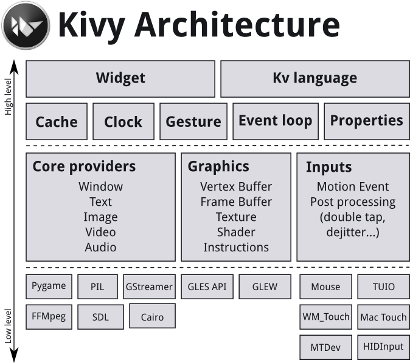

# Linux 界面开发

在Linux下开发GUI程序的方法有很多，比如Gnome桌面使用GTK+作为默认的图形界面库，KDE桌面使用Qt作为默认的图形界面库，wxWidgets则是另一个使用广泛的图形库，此外使用Java中的Swing/AWT组件也可以用于开发Linux下的GUI应用。

## 各种方案对比

### GTK+
- 虽然GTK+最初是为X Window系统开发的，但是目前已经发展成为一个跨平台的图形界面API，其支持的平台包括：
Linux
Unix
Windows
Mac OS X
许可协议

- GTK+基于LGPL协议发布，因此可以将GTK+的二进制动态链接库文件整合到私有软件中而无需额外授权。

- 语言支持

GTK+本身是用C语言编写的，但是可以很方便地通过语言绑定(language binding)和其它语言协同工作，GTK+不同版本的语言绑定支持情况如下图所示。

其它特性

与wxWidgets和Qt不同，GTK+支持使用纯C语言进行开发，此外还有一个基于C++的封装项目叫GTKMM。

GTK+是基于GLib构建的，其中GLib是一个通用的C语言库，类似于C++中的STL，提供了对动态数组、链表、队列、散列表、平衡二叉树、线程操作和XML解析等功能。

在所有的平台上，基于GTK+的应用都看起来完全一样，除非应用了主题。GTK+总是通过主题来模拟原生控件。在Windows平台下，可以通过使用Wimp主题来获得Windows的原生外观。

### QT
Qt是目前使用最广泛的跨平台应用程序框架(Application Framework)，其支持的平台包括：

Windows
Mac OS X
Linux / Embedded Linux / VxWorks
Solaris
Android
iOS
BlackBerry
许可协议

Qt支持LGPL 2.1协议和一个商业协议，因此可以将Qt的二进制动态链接库文件整合到私有软件中而无需额外授权。如果需要使用静态链接将所有代码打包为单个的可执行文件，则需要公开源代码。如果既要生成单个可执行文件，又不想公开代码，则需要向Digia购买商业使用授权。

语言支持

Qt是一个基于C++的应用程序框架，但是同GTK+一样，可以通过语言绑定支持更多的语言，包括：

Python
Java
Ruby
BASIC
Ada
Perl
C#
D
Pascal
Lua
Haskell
需要注意的是，使用其它语言封装Qt的原生接口会带来一定程度上的性能损失。

其它特性

除了与图形界面相关的部分之外，Qt还包括许多其它的类，比如：

容器（数组、队列、链表、集合、映射等）
网络操作（基本Socket、DNS操作、HTTP操作、SSL等）
多媒体操作（音乐、视频回放、摄像头控制等）
SQL数据库操作
OpenGL绘图
XML操作
串口操作
基于Webkit的浏览器引擎
值得一提的是，Qt SQL模块提供了对嵌入式数据库SQLite的支持，无需引入外部的数据库源码。内容丰富的各种类库极大地方便了开发，整个Qt开发工具包就组成了一个独立的一站式开发平台。

和GTK+一样，Qt并不使用系统提供的控件，而是通过主题模拟这些控件。但是在一些特定的平台，比如Mac OS X和Windows上对于一些最基本的控件通过本地系统调用实现。

Qt通过MOC系统对C++语言进行了扩展，提供了所谓的“信号-槽”(signal-slot)机制。基于信号-槽的事件处理非常优雅，缺点则是是编译系统失去了通用性。

Qt的原生IDE是Qt Creater，同时兼容Qt的其它IDE也非常多，包括Visual Studio、Eclipse、XCode、Edyuk。

### wxWidgets

平台支持

wxWidgets是另一个非常流行的跨平台图形界面库。而GTK+ / Qt不同，wxWidgets并不是通过绘图来模拟控件，而是通过系统本地调用构建完全原生的图形界面。

wxWidgets支持的平台包括：

wxGTK: 使用Linux下的GTK+构建图形界面
wxMSW: 使用Win32 API构建图形界面
wxMac: 使用Mac OS下的Carbon构建图形界面
wxOSX/Carbon: 使用Mac OS下的Carbon构建图形界面
wxOSX/Cocoa: 使用Mac OS下的Cocoa构建图形界面
wxX11: 使用Linux下的X11的通用显示接口构建图形界面
wxMotif: 使用Linux下的OpenMotif和Lesstif构建图形界面
注意到这里的描述方式有所不同，因为wxWidgets是基于本地接口构建UI的。

许可协议

wxWidgets使用wxWindows License作为许可协议，这个协议是基于LGPL的，但是有一点不一样：允许用户在使用静态链接的情况下不公开应用代码，因此实际上比LGPL协议更宽松。

语言支持

wxWidgets是基于C++编写的的，同时还支持以下的语言绑定：

Ada
BASIC
D
Delphi
Erlang
Go
Haskell
Java
Lua
Perl
PHP
Python
Ruby
其它特性

在API和编程风格上，wxWidgets和MFC非常相似，但是封装的很多类比MFC更高级。很多知名的MFC程序都会选择用wxWidgets来改写，来快速移植到其它平台，如eMule用wxWidgets移植出aMule和xMule。

除了基本的图形界面、布局、事件系统外，wxWidgets还提供了很多其它的模块，包括：

wxHTML: 进行HTML渲染
wxMedia: 对各种多媒体操作提供支持
wxNet: Socket支持
wxXML: XML文件读写支持
wxWidgets集成的功能相对于Qt而言较少，但是足够完成绝大多数的常见任务。

4. Java / Swing / AWT

平台支持

Swing和AWT是Java中最常用的两种图形组件。理论上所有支持Java虚拟机的平台都可以使用Swing和AWT，包括：

Windows
Mac OS X
Linux
Solaris
当然还有大多数的移动、嵌入式平台，这里就不一一列举了。

许可协议

Java的许可协议情况有些复杂，网上有不少相关的讨论，如这里、这里和这里。目前Oracle和Android之间就存在着一些纠纷，但是目前似乎没有桌面Java应用由于授权问题被起诉，作为开发应用的工具，Java目前应该还是比较安全的。

其它特性

AWT是Abstract Window Toolkit（抽象窗口工具包）的缩写，这个工具包提供了一套与本地图形界面进行交互的接口，与wxWidgets类似，因此具有相对比较高的运行效率。

而在JDK 1.2之后，出现了一组新的图形API，叫Swing。Swing是基于AWT构建的，并且采用与Qt类似的方式通过绘图模拟各个控件，因此灵活性大大增加。通常我们看到的Java应用程序独特的外观大多都是基于Swing构建的。由于Java本来运行效率就较低，搭配Swing后就更慢了，因此在嵌入式平台AWT始终是构建图形界面的首选方案。桌面应用则通常使用Swing搭建。


## 开发框架

### kivy

#### 安装

```
# 安装virtualenv
pip3 install setuptools virtualenv
或
python3 -m pip install --upgrade pip setuptools virtualenv

# 构建虚拟环境
python3 -m virtualenv kivy_venv
# 激活虚拟环境
source kivy_venv/bin/activate

# 安装稳定版 kivy
python3 -m pip install kivy[base] kivy_examples

# 检查demo，The 3d monkey demo under kivy-examples/3Drendering/main.py is also fun to see.
python3 kivy_venv/share/kivy-examples/demo/showcase/main.py

# 安装kivy的依赖，base是最小安装，media仅包含video和audio依赖，full包含所有，[其他参考](https://kivy.org/doc/stable/gettingstarted/installation.html)
pip install kivy[base,media,tuio]
```

## First APP
### 生成一个应用

生成一个kivy应用比较简单：
- 生成一个App类的子类
- 实现他的build（）方法，使其能够返回一个widget实例（即你的widget tree的root）
- 实例化这个类，并调用他的run（）方法。

最小例子：
```python
#main.py

import kivy
kivy.require('1.0.6') # replace with your current kivy version !

from kivy.app import App
from kivy.uix.label import Label


class MyApp(App):

    def build(self):
        return Label(text='Hello world')


if __name__ == '__main__':
    MyApp().run()

```

#### kivy app life cycle


As you can see above, for all intents and purposes, our entry point into our App is the run() method, and in our case that is “MyApp().run()”. We will get back to this, but let’s start from the third line:

kivy程序要求开发者的app 必须继承 App 类。这个表示 kivy_installation_dir/kivy/app.py.建议读此源代码，理解其含义。kivy基于python，使用 sphinx 文档，所以每个类的文档都在源文件中。


`from kivy.app import App`

`from kivy.uix.label import Label` 这里反应了另一个重要的事情是包/类的方式。uix模块是控制用户接口元素（如layouts 和 widgets）的节（section）。

### 再来一个例子

我们扩展上面的例子，显示一个简单的用户名和密码页。

```python
from kivy.app import App
# import a Gridlayout ,这个类作为我们根widget的基类。

from kivy.uix.gridlayout import GridLayout
from kivy.uix.label import Label
from kivy.uix.textinput import TextInput


class LoginScreen(GridLayout):

    def __init__(self, **kwargs):
    
        super(LoginScreen, self).__init__(**kwargs)
        self.cols = 2
        self.add_widget(Label(text='User Name'))
        self.username = TextInput(multiline=False)
        self.add_widget(self.username)
        self.add_widget(Label(text='password'))
        self.password = TextInput(password=True, multiline=False)
        self.add_widget(self.password)


class MyApp(App):

    def build(self):
        return LoginScreen()


if __name__ == '__main__':
    MyApp().run()
```


### 环境控制(使用环境变量)
使用环境变量可以控制kivy的初始化和行为。

例如为了限制 text 渲染为 PIL 实现（一种python 图形方式）,可以使用：`$ KIVY_TEXT=pil python main.py`

环境变量应在import kivy前被设置。例如：
```python
import os
os.environ['KIVY_TEXT'] = 'pil'
import kivy
```

You can control the default directories where config files, modules and kivy data are located.

- `KIVY_DATA_DIR`
Location of the Kivy data, defaults to <kivy path>/data

- `KIVY_MODULES_DIR`
Location of the Kivy modules, defaults to <kivy path>/modules

- `KIVY_HOME`
Location of the Kivy home. This directory is used for local configuration, and must be in a writable location.

Defaults to:
Desktop: `<user home>/.kivy`

Android: `<android app path>/.kivy`

iOS: `<user home>/Documents/.kivy`


- `KIVY_SDL2_PATH`
If set, the SDL2 libraries and headers from this path are used when compiling kivy instead of the ones installed system-wide. To use the same libraries while running a kivy app, this path must be added at the start of the PATH environment variable.


Warning

This path is required for the compilation of Kivy. It is not required for program execution.

Configuration¶
`KIVY_USE_DEFAULTCONFIG`
If this name is found in environ, Kivy will not read the user config file.

`KIVY_NO_CONFIG`
If set, no configuration file will be read or written to. This also applies to the user configuration directory.

`KIVY_NO_FILELOG`
If set, logs will be not print to a file

`KIVY_NO_CONSOLELOG`
If set, logs will be not print to the console

`KIVY_NO_ARGS`
If set, the argument passed in command line will not be parsed and used by Kivy. Ie, you can safely make a script or an app with your own arguments without requiring the – delimiter:
```
import os
os.environ["KIVY_NO_ARGS"] = "1"
import kivy
```


`KCFG_section_key`
If a such format environment name is detected, it will be mapped to the Config object. They are loaded only once when kivy is imported. The behavior can be disabled using KIVY_NO_ENV_CONFIG.
```
import os
os.environ["KCFG_KIVY_LOG_LEVEL"] = "warning"
import kivy
# during import it will map it to:
# Config.set("kivy", "log_level", "warning")
```

- `KIVY_NO_ENV_CONFIG`
If set, no environment key will be mapped to configuration object. If unset, any KCFG_section_key=value will be mapped to Config.


Restrict core to specific implementation¶
kivy.core try to select the best implementation available for your platform. For testing or custom installation, you might want to restrict the selector to a specific implementation.

`KIVY_WINDOW`
Implementation to use for creating the Window

`KIVY_TEXT`
Implementation to use for rendering text

Values: sdl2, pil, pygame, sdlttf

`KIVY_VIDEO`
Implementation to use for rendering video

Values: gstplayer, ffpyplayer, ffmpeg, null

`KIVY_AUDIO`
Implementation to use for playing audio

Values: sdl2, gstplayer, ffpyplayer, pygame, avplayer

`KIVY_IMAGE`
Implementation to use for reading image

Values: sdl2, pil, pygame, imageio, tex, dds, gif

`KIVY_CAMERA`
Implementation to use for reading camera

Values: avfoundation, android, opencv

`KIVY_SPELLING`
Implementation to use for spelling

Values: enchant, osxappkit

`KIVY_CLIPBOARD`
Implementation to use for clipboard management

Values: sdl2, pygame, dummy, android

##### Metrics¶
`KIVY_DPI`
If set, the value will be used for Metrics.dpi.

New in version 1.4.0.

`KIVY_METRICS_DENSITY`
If set, the value will be used for Metrics.density.

New in version 1.5.0.

`KIVY_METRICS_FONTSCALE`

If set, the value will be used for Metrics.fontscale.

New in version 1.5.0.

##### Graphics¶
`KIVY_GL_BACKEND`
The OpenGL backend to use. See cgl.

`KIVY_GL_DEBUG`
Whether to log OpenGL calls. See cgl.

`KIVY_GRAPHICS`
Whether to use OpenGL ES2. See cgl.

`KIVY_GLES_LIMITS`
Whether the GLES2 restrictions are enforced (the default, or if set to 1). If set to false, Kivy will not be truly GLES2 compatible.

Following is a list of the potential incompatibilities that result when set to true.

Mesh indices

If true, the number of indices in a mesh is limited to 65535

Texture blit

When blitting to a texture, the data (color and buffer) format must be the same format as the one used at the texture creation. On desktop, the conversion of different color is correctly handled by the driver, while on Android, most of devices fail to do it. Ref: https://github.com/kivy/kivy/issues/1600

New in version 1.8.1.

`KIVY_BCM_DISPMANX_ID`
Change the default Raspberry Pi display to use. The list of available value is accessible in vc_dispmanx_types.h. Default value is 0:

0: DISPMANX_ID_MAIN_LCD

1: DISPMANX_ID_AUX_LCD

2: DISPMANX_ID_HDMI

3: DISPMANX_ID_SDTV

4: DISPMANX_ID_FORCE_LCD

5: DISPMANX_ID_FORCE_TV

6: DISPMANX_ID_FORCE_OTHER

`KIVY_BCM_DISPMANX_LAYER`
Change the default Raspberry Pi dispmanx layer. Default value is 0.

New in version 1.10.1.

##### Event Loop¶
`KIVY_EVENTLOOP`
Which async library should be used when the app is run in an asynchronous manner. See kivy.app for example usage.

'asyncio': When the app is run in an asynchronous manner and the standard
library asyncio package should be used. The default if not set.

'trio': When the app is run in an asynchronous manner and the trio
package should be used.

New in version 2.0.0.

### 配置 kivy
Configure Kivy¶
The configuration file for kivy is named config.ini, and adheres to the standard INI format.

Locating the configuration file¶
The location of the configuration file is controlled by the environment variable KIVY_HOME:

<KIVY_HOME>/config.ini
On desktop, this defaults to:

<HOME_DIRECTORY>/.kivy/config.ini
Therefore, if your user is named “tito”, the file will be here:

Windows: C:\Users\tito\.kivy\config.ini

OS X: /Users/tito/.kivy/config.ini

Linux: /home/tito/.kivy/config.ini

On Android, this defaults to:

<ANDROID_APP_PATH>/.kivy/config.ini
If your app is named “org.kivy.launcher”, the file will be here:

/data/data/org.kivy.launcher/files/.kivy/config.ini
On iOS, this defaults to:

<HOME_DIRECTORY>/Documents/.kivy/config.ini
Local configuration¶
Sometimes it’s desired to change configuration only for certain applications or during testing of a separate part of Kivy for example input providers. To create a separate configuration file you can simply use these commands:

from kivy.config import Config

Config.read(<file>)
# set config
Config.write()
When a local configuration of single .ini file isn’t enough, e.g. when you want to have separate environment for garden, kivy logs and other things, you’ll need to change the KIVY_HOME environment variable in your application to get desired result:

import os
os.environ['KIVY_HOME'] = <folder>
or before each run of the application change it manually in the console:

Windows:

set KIVY_HOME=<folder>
Linux & OSX:

export KIVY_HOME=<folder>
After the change of KIVY_HOME, the folder will behave exactly the same as the default .kivy/ folder mentioned above.

Understanding config tokens¶
All the configuration tokens are explained in the kivy.config module.

### kivy 架构概览

Architectural Overview¶
We would like to take a moment to explain how we designed Kivy from a software engineering point of view. This is key to understanding how everything works together. If you just look at the code, chances are you will get a rough idea already, but since this approach certainly is daunting for most users, this section explains the basic ideas of the implementation in more detail. You can skip this section and refer to it later, but we suggest at least skimming it for a rough overview.

Kivy consists of several building blocks that we will explain shortly. Here is a graphical summary of the architecture:



Core Providers and Input Providers¶
One idea that is key to understanding Kivy’s internals is that of modularity and abstraction. We try to abstract basic tasks such as opening a window, displaying images and text, playing audio, getting images from a camera, spelling correction and so on. We call these core tasks. This makes the API both easy to use and easy to extend. Most importantly, it allows us to use – what we call – specific providers for the respective scenarios in which your app is being run. For example, on OSX, Linux and Windows, there are different native APIs for the different core tasks. A piece of code that uses one of these specific APIs to talk to the operating system on one side and to Kivy on the other (acting as an intermediate communication layer) is what we call a core provider. The advantage of using specialized core providers for each platform is that we can fully leverage the functionality exposed by the operating system and act as efficiently as possible. It also gives users a choice. Furthermore, by using libraries that are shipped with any one platform, we effectively reduce the size of the Kivy distribution and make packaging easier. This also makes it easier to port Kivy to other platforms. The Android port benefited greatly from this.

We follow the same concept with input handling. An input provider is a piece of code that adds support for a specific input device, such as Apple’s trackpads, TUIO or a mouse emulator. If you need to add support for a new input device, you can simply provide a new class that reads your input data from your device and transforms them into Kivy basic events.

Graphics¶
Kivy’s graphics API is our abstraction of OpenGL. On the lowest level, Kivy issues hardware-accelerated drawing commands using OpenGL. Writing OpenGL code however can be a bit confusing, especially to newcomers. That’s why we provide the graphics API that lets you draw things using simple metaphors that do not exist as such in OpenGL (e.g. Canvas, Rectangle, etc.).

All of our widgets themselves use this graphics API, which is implemented on the C level for performance reasons.

Another advantage of the graphics API is its ability to automatically optimize the drawing commands that your code issues. This is especially helpful if you’re not an expert at tuning OpenGL. This makes your drawing code more efficient in many cases.

You can, of course, still use raw OpenGL commands if you prefer. The version we target is OpenGL 2.0 ES (GLES2) on all devices, so if you want to stay cross-platform compatible, we advise you to only use the GLES2 functions.

Core¶
The code in the core package provides commonly used features, such as:

Clock
You can use the clock to schedule timer events. Both one-shot timers and periodic timers are supported.

Cache
If you need to cache something that you use often, you can use our class for that instead of writing your own.

Gesture Detection
We ship a simple gesture recognizer that you can use to detect various kinds of strokes, such as circles or rectangles. You can train it to detect your own strokes.

Kivy Language
The kivy language is used to easily and efficiently describe user interfaces.

Properties
These are not the normal properties that you may know from python. They are our own property classes that link your widget code with the user interface description.

UIX (Widgets & Layouts)¶
The UIX module contains commonly used widgets and layouts that you can reuse to quickly create a user interface.

Widgets
Widgets are user interface elements that you add to your program to provide some kind of functionality. They may or may not be visible. Examples would be a file browser, buttons, sliders, lists and so on. Widgets receive MotionEvents.

Layouts
You use layouts to arrange widgets. It is of course possible to calculate your widgets’ positions yourself, but often it is more convenient to use one of our ready made layouts. Examples would be Grid Layouts or Box Layouts. You can also nest layouts.

Modules¶
If you’ve ever used a modern web browser and customized it with some add-ons then you already know the basic idea behind our module classes. Modules can be used to inject functionality into Kivy programs, even if the original author did not include it.

An example would be a module that always shows the FPS of the current application and some graph depicting the FPS over time.

You can also write your own modules.

Input Events (Touches)¶
Kivy abstracts different input types and sources such as touches, mice, TUIO or similar. What all of these input types have in common is that you can associate a 2D onscreen-position with any individual input event. (There are other input devices such as accelerometers where you cannot easily find a 2D position for e.g. a tilt of your device. This kind of input is handled separately. In the following we describe the former types.)

All of these input types are represented by instances of the Touch() class. (Note that this does not only refer to finger touches, but all the other input types as well. We just called it Touch for the sake of simplicity. Think of it of something that touches the user interface or your screen.) A touch instance, or object, can be in one of three states. When a touch enters one of these states, your program is informed that the event occurred. The three states a touch can be in are:

Down
A touch is down only once, at the very moment where it first appears.

Move
A touch can be in this state for a potentially unlimited time. A touch does not have to be in this state during its lifetime. A ‘Move’ happens whenever the 2D position of a touch changes.

Up
A touch goes up at most once, or never. In practice you will almost always receive an up event because nobody is going to hold a finger on the screen for all eternity, but it is not guaranteed. If you know the input sources your users will be using, you will know whether or not you can rely on this state being entered.

Widgets and Event Dispatching¶
The term widget is often used in GUI programming contexts to describe some part of the program that the user interacts with. In Kivy, a widget is an object that receives input events. It does not necessarily have to have a visible representation on the screen. All widgets are arranged in a widget tree (which is a tree data structure as known from computer science classes): One widget can have any number of child widgets or none. There is exactly one root widget at the top of the tree that has no parent widget, and all other widgets are directly or indirectly children of this widget (which is why it’s called the root).

When new input data is available, Kivy sends out one event per touch. The root widget of the widget tree first receives the event. Depending on the state of the touch, the on_touch_down, on_touch_move or on_touch_up event is dispatched (with the touch as the argument) to the root widget, which results in the root widget’s corresponding on_touch_down, on_touch_move or on_touch_up event handler being called.

Each widget (this includes the root widget) in the tree can choose to either digest or pass the event on. If an event handler returns True, it means that the event has been digested and handled properly. No further processing will happen with that event. Otherwise, the event handler passes the widget on to its own children by calling its superclass’s implementation of the respective event handler. This goes all the way up to the base Widget class, which – in its touch event handlers – does nothing but pass the touches to its children:
```python
# This is analogous for move/up:
def on_touch_down(self, touch):
    for child in self.children[:]:
        if child.dispatch('on_touch_down', touch):
            return True
```
This really is much easier than it first seems. An example of how this can be used to create nice applications quickly will be given in the following section.

Often times you will want to restrict the area on the screen that a widget watches for touches. You can use a widget’s collide_point() method to achieve this. You simply pass it the touch’s position and it returns True if the touch is within the ‘watched area’ or False otherwise. By default, this checks the rectangular region on the screen that’s described by the widget’s pos (for position; x & y) and size (width & height), but you can override this behaviour in your own class.

### Events and Properties¶
Events are an important part of Kivy programming. That may not be surprising to those with GUI development experience, but it’s an important concept for newcomers. Once you understand how events work and how to bind to them, you will see them everywhere in Kivy. They make it easy to build whatever behavior you want into Kivy.

The following illustration shows how events are handled in the Kivy framework.

### [Pong Game Tutorial](https://kivy.org/doc/stable/tutorials/pong.html)

## 参考

[基本教程](https://kivy.org/doc/stable/guide/basic.html#quickstart)
- 