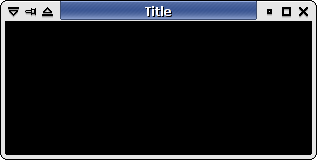
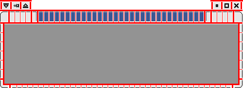

# XFCE Theme
## 介绍
### 概要
Xfwm4，Xfce 的原生窗口管理器，使用简单而灵活的基于像素图的主题引擎，使用 .xpm 格式的图像。



Xfwm4 使用文本文件设置其他配置选项（参见 themerc 部分）。除此之外，您还可以制作一个主题选择 gtk 主题颜色，这将在文档的 gtk 颜色选择部分中介绍。

### theme location

在 Xfwm4 4.0 版本中，主题在以下目录中搜索：

用户的主目录`/.themes/xfwm4/theme_name（如：/home/joe/.themes/xfwm4/b5）`

系统的共享数据目录`/ xfwm4 / THEME_NAME（如：/usr/share/xfwm4/themes/b5）`

在Xfwm 4.2版本中，主题位置符合标准，在以下目录中搜索：

用户的home目录 `/.themes/theme_name/xfwm4`（例如：“`/home/joe/.themes/b5/xfwm4`”）

系统的共享数据目录 `/themes/theme_name/xfwm4 ` 由包管理器控制（例如：`“/usr/share/themes/b5/xfwm4”`）

本地管理员控制的系统共享数据目录`/local/themes/theme_name/xfwm4`（例如：`“/usr/local/share/themes/b5/xfwm4”`）

### 标题栏装饰（Title decorations）
由于窗口可以处于活动或非活动状态，因此 xfwm4 使用相应命名的像素图，例如 title-1-active.xpm 和 title-1-inactive.xpm。

对于标题栏装饰，xfwm4 使用了 5 个名为 title-1-active.xpm 到 title-5-active.xpm 的像素图，其中 top-left-active.xpm 和 top-right-active.xpm 组成了每一端的角。下图2。



相同的命名约定适用于带有 inactive 替换词的非聚焦窗口。例如 title-1-inactive.xpm

标题文本颜色和阴影选项、对齐方式等在 themerc 文件中设置（在 themerc 部分中有详细说明）。

### 窗口侧边栏和底部
窗口的每一侧由两个像素图组成。左侧的像素图命名为 `left-active.xpm` 和 `bottom-left-active.xpm`。右侧（当然）由 `right-active.xpm` 和 `bottom-right-active.xpm` 组成。

窗口底部抓取栏由`bottom-active.xpm` 和`bottom-inactive.xpm` 像素图组成，它们将随着窗口大小调整而重复以适应。

注意这些像素图也构成了鼠标抓取手柄，因此在决定它们应该有多少像素宽时请记住这一点（特别是构成窗口上主要调整大小手柄的左下角和右下角像素图）。

### Xfwm4 按钮
Xfwm4 最多可以使用六个动作按钮——stick（粘滞窗口）、菜单、阴影、隐藏、最大化和关闭。

按钮具有活动、非活动、预点亮和按下状态。如下图3： AbiWord Image menu-active.gif AbiWord Image menu-inactive.gif AbiWord Image image_2.gif

图见 https://wiki.xfce.org/howto/xfwm4_theme 图3 xfwm4

Xfwm4 还可以使用“切换”按钮来指示按钮是打开还是关闭 - 图 4. AbiWord Image stick-active.gif AbiWord Image stick-inactive.gif AbiWord Image stick-pressed.gif AbiWord Image stick-toggled-active。 gif AbiWord 图片 image_3.gif AbiWord 图片stick-toggled-pressed.gif

### 主题文件

要设置标题文本颜色、“button_spacing”和“button_offset”等功能，xfwm4 使用保存在包含像素图的主题文件夹中的名为“themerc”的文本文件。

#### 按钮布局
还可以为使用特定按钮布局的主题“修复”按钮布局。- 尽管应该提到在主题中强制特殊按钮布局或标题对齐，从而减少用户的选择，但应该避免（除非主题确实需要，例如下面提到的 b5 主题）

```
# button_layout : 
# O = 选项菜单
# T = 棒
# H = 隐藏
# S = 阴影
# M = 最大化
# C = 关闭
# | = 标题
button_layout=OTS|HMC
```

这方面的一个工作示例是仅使用关闭按钮的“B5”主题。即条目“button_layout=C|” 在 themerc 文件中。

#### 标题宽度
另一个需要从“themerc”文件设置的设置是“title_full_width”参数。这个布尔值决定了像素图在标题栏中的排列方式。

当设置为“true”时，中心像素图被重复以填充整个窗口宽度：


当设置为“false”时，中心像素图被重复到足以使标题适合:


#### 文字阴影
通过为聚焦窗口设置布尔值“title_shadow_active”和为其他未聚焦窗口设置布尔值“title_shadow_inactive”，可以将阴影添加到标题文本。

可能的值为“false”、“true”和“frame”。

#### 标题偏移
可以使用偏移值调整标题文本位置以适应主题设计。可以使用以下设置调整水平和垂直值：

- title_horizo​​ntal_offset
- title_vertical_offset_active
- title_vertical_offset_inactive
#### 按钮偏移和间距
同样，可以使用“按钮偏移”设置来水平移动按钮。值得注意的是，该值是相对于相应的应用程序窗口边框而言的，而不是框架边框。

“button_spacing”值给出了每个按钮之间的像素数。

“maximized_offset”值在最大化时在右边缘（右上-活动）和按钮（关闭、隐藏...）之间放置一个空间。

#### 应用程序图标
使用show_app_icon选项，您可以用应用程序图标替换菜单按钮。应用程序图标将受到菜单按钮宽度的限制。敬请关注！

- show_app_icon=true #显示应用图标
- show_app_icon=false #显示菜单按钮
如果您没有菜单按钮，则可以使用空白方块。或者您不能使用此选项。

#### 框架边框顶部
XFWM 4.14.1 及以上版本可以利用此功能裁剪最大化应用程序窗口的顶部边框。

- frame_border_top = 0 ＃默认


- frame_border_top=2 #将前2个


### GTK 拾色器

毫无疑问，您在使用 Xfwm4 的默认主题时会注意到，该主题使用当前 Gtk 主题的颜色。XFWM 主题的颜色可以在主题的 themrc 文件中定义。如果它们没有在那里定义，它们将从当前的 Gtk 主题中提取。使用了以下颜色：

姓名	Gtk 值	描述
active_text_color	fg[已选择]	活动窗口标题上的文本颜色
inactive_text_color	fg[不敏感]	非活动窗口标题上的文本颜色
active_text_shadow_color	暗[已选择]	活动窗口标题的阴影颜色
inactive_text_shadow_color	黑暗[麻木不仁]	非活动窗口标题的阴影颜色
active_border_color	fg[正常]	很少使用通常设置为黑色
inactive_border_color	fg[正常]	同上
active_color_1	背景[已选择]	活动标题的背景颜色
active_color_2	背景[正常]	活动窗口的背景颜色
active_hilight_1	光[已选择]	3D 外观的活动标题颜色较浅
active_hilight_2	光[正常]	活动窗口的颜色较浅
active_mid_1	中[已选择]	活动标题的颜色略深
active_mid_2	中[正常]	活动窗口的颜色稍深
active_shadow_1	暗选择[]	3D 外观的活动标题颜色较深
active_shadow_2	黑暗[正常]	活动窗口的颜色较深
inactive_color_1	bg[不敏感]	非活动标题的背景颜色
inactive_color_2	背景[正常]	非活动窗口的背景颜色
inactive_hilight_1	光[不敏感]	用于 3D 外观的非活动标题的较浅颜色
inactive_hilight_2	光[正常]	非活动窗口的颜色较浅
inactive_mid_1	中[不敏感]	非活动标题的颜色略深
inactive_mid_2	中[正常]	非活动窗口的颜色稍深
inactive_shadow_1	黑暗[麻木不仁]	3D 外观的非活动标题颜色较深
inactive_shadow_2	黑暗[正常]	非活动窗口的颜色较深


Gtk 值“fg”和“bg”在当前 Gtk 主题的 gtkrc 文件中定义。请注意，值“dark”、“light”和“mid”不能在 gtkrc 中定义，而是计算出来的（dark = 0.7 * bg，light = 1.3 * bg，mid = 0.5 * (dark + light)）。符号在运行时被实际颜色值替换，以便窗口边框可以自动继承 Gtk 主题颜色，除非它们在 themerc.xml 文件中定义。

要在 XFWM 主题中使用定义的颜色，必须编辑 XPM 文件。由于 XPM 文件是纯文本，因此可以使用您喜欢的文本编辑器进行编辑。

### 参考
- https://wiki.xfce.org/howto/xfwm4_theme

## 

### 参考
- https://docs.xfce.org/xfce/xfwm4/4.16/start

## 如何安装新主题

有5种不同的主题可以在xfce中调整：
- window decorations
- the GTK+ interfaces
- the cursors
- the notifications
- the icons

### window decorations

用户级主题，在`~/.local/share/themes` 或`~/.themes`提取此类主题。

系统级安装在 `${sysprefix}/local/share/themes`，例如`/usr/share/themes`.

确定该主题目录看起来像：

`~/.local/share/themes/〈主题名〉/xfwm4`

如果该主题包含了可伸缩图片（`<theme_name>/xfwm4/*.svg`），那最好安装 librsvg 库。

然后在 Window Manager Settings 中选择这个主题。


### GTK+ interface
GTK+ 主题是工具包的主题（按钮、文本字段等）。大多数 GTK+ 主题都需要自己的主题引擎，请确保您安装的主题引擎与 GTK+ 工具包的前缀相同。要安装和使用主题，请按照下列步骤操作：

提取主题 `~/.local/share/themes`
系统范围内的安装 `${sysprefix}/local/share/themes` 或 `/usr/share/themes`
确保主题包含以下文件： `~/.local/share/themes/<theme_name>/gtk-2.0/gtkrc`

在用户界面设置 (Xfce 4.4.x) 或外观设置 (Xfce 4.6.x) 中选择主题.

### cursor

提取主题 `~/.icons`
系统范围内的安装 `${sysprefix}/local/share/icons`
确保目录布局如下所示： `./icons/<theme_name>/cursors`
在鼠标设置中选择主题。如果没有带有光标主题的选项卡，请确保使用 Xcursor 支持编译 xfce-mcs-plugins (Xfce 4.4.x)

### icons

提取主题 `~/.icons`
系统范围内的安装 `${sysprefix}/local/share/icons` 

可选：运行 `gtk-update-icon-cache -f -t ~/.icons/<theme_name>` 以创建图标缓存1)

如果主题包含可缩放图标 ( `~/.icons/<theme_name>/scalable`)，请确保已安装librsvg

在用户界面设置（第二个选项卡，Xfce 4.4.x）或外观设置（第二个选项卡，Xfce 4.6.x）中选择主题

当您遇到图标主题问题时，也建议安装该`hicolor-icon-theme`软件包。

## 自己制作

### [如何制作 xfwm4 主题（对于使用窗口管理器的窗口）](https://wiki.xfce.org/howto/xfwm4_theme)

### [如何制作 Gtk 主题（对于使用客户端窗口的窗口（如计算器））](https://wiki.xfce.org/howto/gtk_theme)