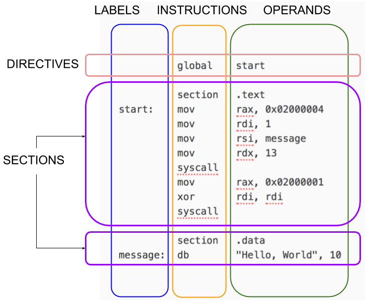
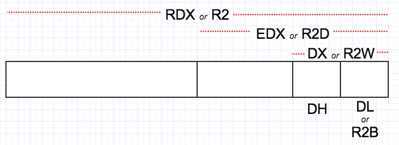

# NASM Tutorial

## First Program

Before learning about nasm, let’s make sure you can type in and run programs.

Make sure both nasm and gcc are installed. Save one of the following programs as hello.asm, depending on your machine platform. Then run the program according to the given instructions.

If you are on a Linux-based OS:

hello.asm
```s
; ----------------------------------------------------------------------------------------
; Writes "Hello, World" to the console using only system calls. Runs on 64-bit Linux only.
; To assemble and run:
;
;     nasm -felf64 hello.asm && ld hello.o && ./a.out
; ----------------------------------------------------------------------------------------

          global    _start

          section   .text
_start:   mov       rax, 1                  ; system call for write
          mov       rdi, 1                  ; file handle 1 is stdout
          mov       rsi, message            ; address of string to output
          mov       rdx, 13                 ; number of bytes
          syscall                           ; invoke operating system to do the write
          mov       rax, 60                 ; system call for exit
          xor       rdi, rdi                ; exit code 0
          syscall                           ; invoke operating system to exit

          section   .data
message:  db        "Hello, World", 10      ; note the newline at the end
```

```sh
$ nasm -felf64 hello.asm && ld hello.o && ./a.out
Hello, World

```

If you are on macOS:

hello.asm:
```s
; ----------------------------------------------------------------------------------------
; Writes "Hello, World" to the console using only system calls. Runs on 64-bit macOS only.
; To assemble and run:
;
;     nasm -fmacho64 hello.asm && ld hello.o && ./a.out
; ----------------------------------------------------------------------------------------

          global    start

          section   .text
start:    mov       rax, 0x02000004         ; system call for write
          mov       rdi, 1                  ; file handle 1 is stdout
          mov       rsi, message            ; address of string to output
          mov       rdx, 13                 ; number of bytes
          syscall                           ; invoke operating system to do the write
          mov       rax, 0x02000001         ; system call for exit
          xor       rdi, rdi                ; exit code 0
          syscall                           ; invoke operating system to exit

          section   .data
message:  db        "Hello, World", 10      ; note the newline at the end
```

```
$ nasm -fmacho64 hello.asm && ld hello.o && ./a.out
Hello, World
```

Exercise: Identify the differences between the two programs.

## Structure of a NASM Program

NASM is line-based. Most programs consist of directives followed by one or more sections. Lines can have an optional label. Most lines have an instruction followed by zero or more operands.



Generally, you put code in a section called .text and your constant data in a section called .data.

## Details
NASM is an awesome assembler, but assembly language is complex. You need more than a tutorial. You need details. Lots of details. Be ready to consult:

The [NASM Manual](http://www.nasm.us/doc/), which is pretty good!
The [Intel Processor Manuals](http://www.intel.com/content/www/us/en/processors/architectures-software-developer-manuals.html)

## Your First Few Instructions
There are hundreds of instructions. You can’t learn them all at once. Just start with these:

mov x, y      	x ← y
and x, y	x ← x and y
or x, y	x ← x or y
xor x, y	x ← x xor y
add x, y	x ← x + y
sub x, y	x ← x – y
inc x	x ← x + 1
dec x	x ← x – 1
syscall	Invoke an operating system routine
db	A pseudo-instruction that declares bytes that will be in memory when the program runs


## The Three Kinds of Operands
### Register Operands
In this tutorial we only care about the integer registers and the xmm registers. You should already know what the registers are, but here is a quick review. The 16 integer registers are 64 bits wide and are called:

R0  R1  R2  R3  R4  R5  R6  R7  R8  R9  R10  R11  R12  R13  R14  R15
RAX RCX RDX RBX RSP RBP RSI RDI


(Note that 8 of the registers have alternate names.) You can treat the lowest 32-bits of each register as a register itself but using these names:

R0D R1D R2D R3D R4D R5D R6D R7D R8D R9D R10D R11D R12D R13D R14D R15D
EAX ECX EDX EBX ESP EBP ESI EDI


You can treat the lowest 16-bits of each register as a register itself but using these names:

R0W R1W R2W R3W R4W R5W R6W R7W R8W R9W R10W R11W R12W R13W R14W R15W
AX  CX  DX  BX  SP  BP  SI  DI
You can treat the lowest 8-bits of each register as a register itself but using these names:

R0B R1B R2B R3B R4B R5B R6B R7B R8B R9B R10B R11B R12B R13B R14B R15B
AL  CL  DL  BL  SPL BPL SIL DIL
For historical reasons, bits 15 through 8 of R0..R3 are named:

AH  CH  DH  BH
And finally, there are 16 XMM registers, each 128 bits wide, named:

XMM0 ... XMM15
Study this picture; hopefully it helps:




### Memory Operands
These are the basic forms of addressing:

[ number ]
[ reg ]
[ reg + reg*scale ]      scale is 1, 2, 4, or 8 only
[ reg + number ]
[ reg + reg*scale + number ]

The number is called the displacement; the plain register is called the base; the register with the scale is called the index.

Examples:
```s
[750]                  ; displacement only
[rbp]                  ; base register only
[rcx + rsi*4]          ; base + index * scale
[rbp + rdx]            ; scale is 1
[rbx - 8]              ; displacement is -8
[rax + rdi*8 + 500]    ; all four components
[rbx + counter]        ; uses the address of the variable 'counter' as the displacement
```

### Immediate Operands
These can be written in many ways. Here are some examples from the official docs.

200          ; decimal
0200         ; still decimal - the leading 0 does not make it octal
0200d        ; explicitly decimal - d suffix
0d200        ; also decimal - 0d prefex
0c8h         ; hex - h suffix, but leading 0 is required because c8h looks like a var
0xc8         ; hex - the classic 0x prefix
0hc8         ; hex - for some reason NASM likes 0h
310q         ; octal - q suffix
0q310        ; octal - 0q prefix
11001000b    ; binary - b suffix
0b1100_1000  ; binary - 0b prefix, and by the way, underscores are allowed

## Instructions with two memory operands are extremely rare

In fact, we’ll not see any such instruction in this tutorial. Most of the basic instructions have only the following forms:

add reg, reg
add reg, mem
add reg, imm
add mem, reg
add mem, imm

## Defining Data and Reserving Space
These examples come from Chapter 3 of the docs. To place data in memory:
```
      db    0x55                ; just the byte 0x55
      db    0x55,0x56,0x57      ; three bytes in succession
      db    'a',0x55            ; character constants are OK
      db    'hello',13,10,'$'   ; so are string constants
      dw    0x1234              ; 0x34 0x12
      dw    'a'                 ; 0x61 0x00 (it's just a number)
      dw    'ab'                ; 0x61 0x62 (character constant)
      dw    'abc'               ; 0x61 0x62 0x63 0x00 (string)
      dd    0x12345678          ; 0x78 0x56 0x34 0x12
      dd    1.234567e20         ; floating-point constant
      dq    0x123456789abcdef0  ; eight byte constant
      dq    1.234567e20         ; double-precision float
      dt    1.234567e20         ; extended-precision float
```

There are other forms; check the NASM docs. Later.

To reserve space (without initializing), you can use the following pseudo instructions. They should go in a section called .bss (you'll get an error if you try to use them in a .text section):


buffer:         resb    64              ; reserve 64 bytes
wordvar:        resw    1               ; reserve a word
realarray:      resq    10              ; array of ten reals

## Another Example
Here’s a macOS program to study:

triangle.asm
```s
; ----------------------------------------------------------------------------------------
; This is an OSX console program that writes a little triangle of asterisks to standard
; output. Runs on macOS only.
;
;     nasm -fmacho64 triangle.asm && gcc hola.o && ./a.out
; ----------------------------------------------------------------------------------------

          global    start
          section   .text
start:
          mov       rdx, output             ; rdx holds address of next byte to write
          mov       r8, 1                   ; initial line length
          mov       r9, 0                   ; number of stars written on line so far
line:
          mov       byte [rdx], '*'         ; write single star
          inc       rdx                     ; advance pointer to next cell to write
          inc       r9                      ; "count" number so far on line
          cmp       r9, r8                  ; did we reach the number of stars for this line?
          jne       line                    ; not yet, keep writing on this line
lineDone:
          mov       byte [rdx], 10          ; write a new line char
          inc       rdx                     ; and move pointer to where next char goes
          inc       r8                      ; next line will be one char longer
          mov       r9, 0                   ; reset count of stars written on this line
          cmp       r8, maxlines            ; wait, did we already finish the last line?
          jng       line                    ; if not, begin writing this line
done:
          mov       rax, 0x02000004         ; system call for write
          mov       rdi, 1                  ; file handle 1 is stdout
          mov       rsi, output             ; address of string to output
          mov       rdx, dataSize           ; number of bytes
          syscall                           ; invoke operating system to do the write
          mov       rax, 0x02000001         ; system call for exit
          xor       rdi, rdi                ; exit code 0
          syscall                           ; invoke operating system to exit

          section   .bss
maxlines  equ       8
dataSize  equ       44
output:   resb      dataSize
```
```sh
$ nasm -fmacho64 triangle.asm && ld triangle.o && ./a.out
*
**
***
****
*****
******
*******
********
```

New things in this example:

- cmp does a comparison
- je jumps to a label if the previous comparison was equal. We also have jne (jump if not equal), jl (jump if less), jnl (jump if not less), jg (jump if greater), jng (jump if not greater), jle (jump if less or equal), jnle (jump if not less or equal), jge (jump if greater or equal), jnge (jump if not greater or equal), and many more.
- equ is actually not a real instruction. It simply defines an abbreviation for the assembler itself to use. (This is a profound idea.)
- The .bss section is for writable data.

## Using a C Library
Writing standalone programs with just system calls is cool, but rare. We would like to use the good stuff in the C library.

Remember how in C execution “starts” at the function main? That’s because the C library actually has the _start label inside itself! The code at _start does some initialization, then it calls main, then it does some clean up, then it issues the system call for exit. So you just have to implement main. We can do that in assembly!

If you have Linux, try this:

hola.asm
```s
; ----------------------------------------------------------------------------------------
; Writes "Hola, mundo" to the console using a C library. Runs on Linux.
;
;     nasm -felf64 hola.asm && gcc hola.o && ./a.out
; ----------------------------------------------------------------------------------------

          global    main
          extern    puts

          section   .text
main:                                       ; This is called by the C library startup code
          mov       rdi, message            ; First integer (or pointer) argument in rdi
          call      puts                    ; puts(message)
          ret                               ; Return from main back into C library wrapper
message:
          db        "Hola, mundo", 0        ; Note strings must be terminated with 0 in C
```

```sh
$ nasm -felf64 hola.asm && gcc hola.o && ./a.out
Hola, mundo
```

Under macOS, it will look a little different:

hola.asm
```s
; ----------------------------------------------------------------------------------------
; This is an macOS console program that writes "Hola, mundo" on one line and then exits.
; It uses puts from the C library.  To assemble and run:
;
;     nasm -fmacho64 hola.asm && gcc hola.o && ./a.out
; ----------------------------------------------------------------------------------------

          global    _main
          extern    _puts

          section   .text
_main:    push      rbx                     ; Call stack must be aligned
          lea       rdi, [rel message]      ; First argument is address of message
          call      _puts                   ; puts(message)
          pop       rbx                     ; Fix up stack before returning
          ret

          section   .data
message:  db        "Hola, mundo", 0        ; C strings need a zero byte at the end
```

```
$ nasm -fmacho64 hola.asm && gcc hola.o && ./a.out
Hola, mundo

```

In macOS land, C functions (or any function that is exported from one module to another, really) must be prefixed with underscores. The call stack must be aligned on a 16-byte boundary (more on this later). And when accessing named variables, a rel prefix is required.

## Understanding Calling Conventions
How did we know the argument to puts was supposed to go in RDI? Answer: there are a number of conventions that are followed regarding calls.

When writing code for 64-bit Linux that integrates with a C library, you must follow the calling conventions explained in the [AMD64 ABI Reference](http://www.x86-64.org/documentation/abi.pdf). You can also get this information from [Wikipedia](http://en.wikipedia.org/wiki/X86_calling_conventions#x86-64_Calling_Conventions). The most important points are:

- From left to right, pass as many parameters as will fit in registers. The order in which registers are allocated, are:
  - For integers and pointers, rdi, rsi, rdx, rcx, r8, r9.
  - For floating-point (float, double), xmm0, xmm1, xmm2, xmm3, xmm4, xmm5, xmm6, xmm7.
- Additional parameters are pushed on the stack, right to left, and are to be removed by the caller after the call.
- After the parameters are pushed, the call instruction is made, so when the called function gets control, the return address is at [rsp], the first memory parameter is at [rsp+8], etc.
- The stack pointer rsp must be aligned to a 16-byte boundary before making a call. Fine, but the process of making a call pushes the return address (8 bytes) on the stack, so when a function gets control, rsp is not aligned. You have to make that extra space yourself, by pushing something or subtracting 8 from rsp.
- The only registers that the called function is required to preserve (the calle-save registers) are: rbp, rbx, r12, r13, r14, r15. All others are free to be changed by the called function.
- The callee is also supposed to save the control bits of the XMCSR and the x87 control word, but x87 instructions are rare in 64-bit code so you probably don’t have to worry about this.
Integers are returned in rax or rdx:rax, and floating point values are returned in xmm0 or xmm1:xmm0.

Got that? No? What’s need is more examples, and practice.

Here is a program that illustrates how registers have to be saved and restored:

fib.asm
```s
; -----------------------------------------------------------------------------
; A 64-bit Linux application that writes the first 90 Fibonacci numbers. To
; assemble and run:
;
;     nasm -felf64 fib.asm && gcc fib.o && ./a.out
; -----------------------------------------------------------------------------

        global  main
        extern  printf

        section .text
main:
        push    rbx                     ; we have to save this since we use it

        mov     ecx, 90                 ; ecx will countdown to 0
        xor     rax, rax                ; rax will hold the current number
        xor     rbx, rbx                ; rbx will hold the next number
        inc     rbx                     ; rbx is originally 1
print:
        ; We need to call printf, but we are using rax, rbx, and rcx.  printf
        ; may destroy rax and rcx so we will save these before the call and
        ; restore them afterwards.

        push    rax                     ; caller-save register
        push    rcx                     ; caller-save register

        mov     rdi, format             ; set 1st parameter (format)
        mov     rsi, rax                ; set 2nd parameter (current_number)
        xor     rax, rax                ; because printf is varargs

        ; Stack is already aligned because we pushed three 8 byte registers
        call    printf                  ; printf(format, current_number)

        pop     rcx                     ; restore caller-save register
        pop     rax                     ; restore caller-save register

        mov     rdx, rax                ; save the current number
        mov     rax, rbx                ; next number is now current
        add     rbx, rdx                ; get the new next number
        dec     ecx                     ; count down
        jnz     print                   ; if not done counting, do some more

        pop     rbx                     ; restore rbx before returning
        ret
format:
        db  "%20ld", 10, 0
```

```sh
$ nasm -felf64 fib.asm && gcc fib.o && ./a.out
                   0
                   1
                   1
                   2
                   .
                   .
                   .
  679891637638612258
 1100087778366101931
 1779979416004714189
```

We just saw some new instructions:

push x	Decrement rsp by the size of the operand, then store x in [rsp]
pop x	Move [rsp] into x, then increment rsp by the size of the operand
jnz label      	If the processor’s Z (zero) flag, is set, jump to the given label
call label	Push the address of the next instruction, then jump to the label
ret	Pop into the instruction pointer

## Mixing C and Assembly Language
This program is just a simple function that takes in three integer parameters and returns the maximum value.

maxofthree.asm
```s
; -----------------------------------------------------------------------------
; A 64-bit function that returns the maximum value of its three 64-bit integer
; arguments.  The function has signature:
;
;   int64_t maxofthree(int64_t x, int64_t y, int64_t z)
;
; Note that the parameters have already been passed in rdi, rsi, and rdx.  We
; just have to return the value in rax.
; -----------------------------------------------------------------------------

        global  maxofthree
        section .text
maxofthree:
        mov     rax, rdi                ; result (rax) initially holds x
        cmp     rax, rsi                ; is x less than y?
        cmovl   rax, rsi                ; if so, set result to y
        cmp     rax, rdx                ; is max(x,y) less than z?
        cmovl   rax, rdx                ; if so, set result to z
        ret                             ; the max will be in rax

```

Here is a C program that calls the assembly language function.

callmaxofthree.c
```c
/*
 * A small program that illustrates how to call the maxofthree function we wrote in
 * assembly language.
 */

#include <stdio.h>
#include <inttypes.h>

int64_t maxofthree(int64_t, int64_t, int64_t);

int main() {
    printf("%ld\n", maxofthree(1, -4, -7));
    printf("%ld\n", maxofthree(2, -6, 1));
    printf("%ld\n", maxofthree(2, 3, 1));
    printf("%ld\n", maxofthree(-2, 4, 3));
    printf("%ld\n", maxofthree(2, -6, 5));
    printf("%ld\n", maxofthree(2, 4, 6));
    return 0;
}
```

```
$ nasm -felf64 maxofthree.asm && gcc callmaxofthree.c maxofthree.o && ./a.out
1
2
3
4
5
6
```

## Conditional Instructions
After an arithmetic or logic instruction, or the compare instruction, cmp, the processor sets or clears bits in its rflags. The most interesting flags are:

- s (sign)
- z (zero)
- c (carry)
- o (overflow)

So after doing, say, an addition instruction, we can perform a jump, move, or set, based on the new flag settings. For example:

jz label         	Jump to label L if the result of the operation was zero
cmovno x, y	x ← y if the last operation did not overflow
setc x	x ← 1 if the last operation had a carry, but x ← 0 otherwise (x must be a byte-size register or memory location)


The conditional instructions have three base forms: j for conditional jump, cmov for conditional move, and set for conditional set. The suffix of the instruction has one of the 30 forms: s ns z nz c nc o no p np pe po e ne l nl le nle g ng ge nge a na ae nae b nb be nbe.

## Command Line Arguments
You know that in C, main is just a plain old function, and it has a couple parameters of its own:

int main(int argc, char** argv)
So, you guessed it, argc will end up in rdi, and argv (a pointer) will end up in rsi. Here is a program that uses this fact to simply echo the commandline arguments to a program, one per line:

echo.asm
```s
; -----------------------------------------------------------------------------
; A 64-bit program that displays its command line arguments, one per line.
;
; On entry, rdi will contain argc and rsi will contain argv.
; -----------------------------------------------------------------------------

        global  main
        extern  puts
        section .text
main:
        push    rdi                     ; save registers that puts uses
        push    rsi
        sub     rsp, 8                  ; must align stack before call

        mov     rdi, [rsi]              ; the argument string to display
        call    puts                    ; print it

        add     rsp, 8                  ; restore %rsp to pre-aligned value
        pop     rsi                     ; restore registers puts used
        pop     rdi

        add     rsi, 8                  ; point to next argument
        dec     rdi                     ; count down
        jnz     main                    ; if not done counting keep going

        ret
```

```
$ nasm -felf64 echo.asm && gcc echo.o && ./a.out dog 22 -zzz "hi there"
./a.out
dog
22
-zzz
hi there

```


## A Longer Example
Note that as far as the C Library is concerned, command line arguments are always strings. If you want to treat them as integers, call atoi. Here’s a neat program to compute xy.

power.asm
```s
; -----------------------------------------------------------------------------
; A 64-bit command line application to compute x^y.
;
; Syntax: power x y
; x and y are (32-bit) integers
; -----------------------------------------------------------------------------

        global  main
        extern  printf
        extern  puts
        extern  atoi

        section .text
main:
        push    r12                     ; save callee-save registers
        push    r13
        push    r14
        ; By pushing 3 registers our stack is already aligned for calls

        cmp     rdi, 3                  ; must have exactly two arguments
        jne     error1

        mov     r12, rsi                ; argv

; We will use ecx to count down form the exponent to zero, esi to hold the
; value of the base, and eax to hold the running product.

        mov     rdi, [r12+16]           ; argv[2]
        call    atoi                    ; y in eax
        cmp     eax, 0                  ; disallow negative exponents
        jl      error2
        mov     r13d, eax               ; y in r13d

        mov     rdi, [r12+8]            ; argv
        call    atoi                    ; x in eax
        mov     r14d, eax               ; x in r14d

        mov     eax, 1                  ; start with answer = 1
check:
        test    r13d, r13d              ; we are counting y downto 0
        jz      gotit                   ; done
        imul    eax, r14d               ; multiply in another x
        dec     r13d
        jmp     check
gotit:                                  ; print report on success
        mov     rdi, answer
        movsxd  rsi, eax
        xor     rax, rax
        call    printf
        jmp     done
error1:                                 ; print error message
        mov     edi, badArgumentCount
        call    puts
        jmp     done
error2:                                 ; print error message
        mov     edi, negativeExponent
        call    puts
done:                                   ; restore saved registers
        pop     r14
        pop     r13
        pop     r12
        ret

answer:
        db      "%d", 10, 0
badArgumentCount:
        db      "Requires exactly two arguments", 10, 0
negativeExponent:
        db      "The exponent may not be negative", 10, 0
```

```sh
$ nasm -felf64 power.asm && gcc -o power power.o
$ ./power 2 19
524288
$ ./power 3 -8
The exponent may not be negative
$ ./power 1 500
1
$ ./power 1
Requires exactly two arguments
```


## Floating Point Instructions
Floating-point arguments go int the xmm registers. Here is a simple function for summing the values in a double array:

sum.asm
```s
; -----------------------------------------------------------------------------
; A 64-bit function that returns the sum of the elements in a floating-point
; array. The function has prototype:
;
;   double sum(double[] array, uint64_t length)
; -----------------------------------------------------------------------------

        global  sum
        section .text
sum:
        xorpd   xmm0, xmm0              ; initialize the sum to 0
        cmp     rsi, 0                  ; special case for length = 0
        je      done
next:
        addsd   xmm0, [rdi]             ; add in the current array element
        add     rdi, 8                  ; move to next array element
        dec     rsi                     ; count down
        jnz     next                    ; if not done counting, continue
done:
        ret                             ; return value already in xmm0
```

Note the floating point instructions have an sd suffix; that’s the most common one, but we’ll see some other ones later. Here is a C program that calls it:

callsum.c
```c
/*
 * Illustrates how to call the sum function we wrote in assembly language.
 */

#include <stdio.h>
#include <inttypes.h>

double sum(double[], uint64_t);

int main() {
    double test[] = {
        40.5, 26.7, 21.9, 1.5, -40.5, -23.4
    };
    printf("%20.7f\n", sum(test, 6));
    printf("%20.7f\n", sum(test, 2));
    printf("%20.7f\n", sum(test, 0));
    printf("%20.7f\n", sum(test, 3));
    return 0;
}
```

```sh
$ nasm -felf64 sum.asm && gcc sum.o callsum.c && ./a.out
          26.7000000
          67.2000000
           0.0000000
          89.1000000
```

## Data Sections
The text section is read-only on most operating systems, so you might find the need for a data section. On most operating systems, the data section is only for initialized data, and you have a special .bss section for uninitialized data. Here is a program that averages the command line arguments, expected to be integers, and displays the result as a floating point number.

average.asm
```s
; -----------------------------------------------------------------------------
; 64-bit program that treats all its command line arguments as integers and
; displays their average as a floating point number.  This program uses a data
; section to store intermediate results, not that it has to, but only to
; illustrate how data sections are used.
; -----------------------------------------------------------------------------

        global   main
        extern   atoi
        extern   printf
        default  rel

        section  .text
main:
        dec      rdi                    ; argc-1, since we don't count program name
        jz       nothingToAverage
        mov      [count], rdi           ; save number of real arguments
accumulate:
        push     rdi                    ; save register across call to atoi
        push     rsi
        mov      rdi, [rsi+rdi*8]       ; argv[rdi]
        call     atoi                   ; now rax has the int value of arg
        pop      rsi                    ; restore registers after atoi call
        pop      rdi
        add      [sum], rax             ; accumulate sum as we go
        dec      rdi                    ; count down
        jnz      accumulate             ; more arguments?
average:
        cvtsi2sd xmm0, [sum]
        cvtsi2sd xmm1, [count]
        divsd    xmm0, xmm1             ; xmm0 is sum/count
        mov      rdi, format            ; 1st arg to printf
        mov      rax, 1                 ; printf is varargs, there is 1 non-int argument

        sub      rsp, 8                 ; align stack pointer
        call     printf                 ; printf(format, sum/count)
        add      rsp, 8                 ; restore stack pointer

        ret

nothingToAverage:
        mov      rdi, error
        xor      rax, rax
        call     printf
        ret

        section  .data
count:  dq       0
sum:    dq       0
format: db       "%g", 10, 0
error:  db       "There are no command line arguments to average", 10, 0
```

```sh
$ nasm -felf64 average.asm && gcc average.o && ./a.out 19 8 21 -33
3.75
$ nasm -felf64 average.asm && gcc average.o && ./a.out

There are no command line arguments to average
```

This program highlighted some processor instructions that convert between integers and floating point values. A few of the most common are:

cvtsi2sd xmmreg, r/m32      	xmmreg[63..0] ← intToDouble(r/m32)
cvtsi2ss xmmreg, r/m32	xmmreg[31..0] ← intToFloat(r/m32)
cvtsd2si reg32, xmmr/m64	reg32 ← doubleToInt(xmmr/m64)
cvtss2si reg32, xmmr/m32	reg32 ← floatToInt(xmmr/m32)

## Recursion
Perhaps surprisingly, there’s nothing out of the ordinary required to implement recursive functions. You just have to be careful to save registers, as usual. Pushing and popping around the recursive call is a typical strategy.

factorial.asm
```s
; ----------------------------------------------------------------------------
; An implementation of the recursive function:
;
;   uint64_t factorial(uint64_t n) {
;       return (n <= 1) ? 1 : n * factorial(n-1);
;   }
; ----------------------------------------------------------------------------

        global  factorial

        section .text
factorial:
        cmp     rdi, 1                  ; n <= 1?
        jnbe    L1                      ; if not, go do a recursive call
        mov     rax, 1                  ; otherwise return 1
        ret
L1:
        push    rdi                     ; save n on stack (also aligns %rsp!)
        dec     rdi                     ; n-1
        call    factorial               ; factorial(n-1), result goes in %rax
        pop     rdi                     ; restore n
        imul    rax, rdi                ; n * factorial(n-1), stored in %rax
        ret
```

An example caller:

callfactorial.c
```c
/*
 * An application that illustrates calling the factorial function defined elsewhere.
 */

#include <stdio.h>
#include <inttypes.h>

uint64_t factorial(uint64_t n);

int main() {
    for (uint64_t i = 0; i < 20; i++) {
        printf("factorial(%2lu) = %lu\n", i, factorial(i));
    }
    return 0;
}
```

```sh
$ nasm -felf64 factorial.asm && gcc -std=c99 factorial.o callfactorial.c && ./a.out
factorial( 0) = 1
factorial( 1) = 1
factorial( 2) = 2
factorial( 3) = 6
factorial( 4) = 24
factorial( 5) = 120
factorial( 6) = 720
factorial( 7) = 5040
factorial( 8) = 40320
factorial( 9) = 362880
factorial(10) = 3628800
factorial(11) = 39916800
factorial(12) = 479001600
factorial(13) = 6227020800
factorial(14) = 87178291200
factorial(15) = 1307674368000
factorial(16) = 20922789888000
factorial(17) = 355687428096000
factorial(18) = 6402373705728000
factorial(19) = 121645100408832000
```

## SIMD Parallelism
The XMM registers can do arithmetic on floating point values one operation at a time (scalar) or multiple operations at a time (packed). The operations have the form:

op xmmreg_or_memory, xmmreg
For floating point addition, the instructions are:

addpd     	do 2 double-precision additions in parallel (add packed double)
addsd	do just one double-precision addition, using the low 64-bits of the register (add scalar double)
addps	do 4 single-precision additions in parallel (add packed single)
addss	do just one single-precision addition, using the low 32-bits of the register (add scalar single)
Here’s a function that adds four floats at once:

add_four_floats.asm

```s
; void add_four_floats(float x[4], float y[4])
; x[i] += y[i] for i in range(0..4)

        global   add_four_floats
        section  .text

add_four_floats:
        movdqa   xmm0, [rdi]            ; all four values of x
        movdqa   xmm1, [rsi]            ; all four values of y
        addps    xmm0, xmm1             ; do all four sums in one shot
        movdqa   [rdi], xmm0
        ret
```

and a caller:

test_add_four_floats.c
```c
#include <stdio.h>
void add_four_floats(float[], float[]);

int main() {
    float x[] = {-29.750, 244.333, 887.29, 48.1E22};
    float y[] = {29.750,  199.333, -8.29,  22.1E23};
    add_four_floats(x, y);
    printf("%f\n%f\n%f\n%f\n", x[0], x[1], x[2], x[3]);
    return 0;
}
```

Also see this [nice little x86 floating-point slide deck from Ray Seyfarth](http://rayseyfarth.com/asm/pdf/ch11-floating-point.pdf).

## Saturated Arithmetic
The XMM registers can also do arithmetic on integers. The instructions have the form:

op xmmreg_or_memory, xmmreg
For integer addition, the instructions are:

paddb	do 16 byte-additions
paddw	do 8 word-additions
paddd	do 4 dword-additions
paddq	do 2 qword-additions
paddsb	do 16 byte-additions with signed saturation (80..7F)
paddsw	do 8 word-additions with signed saturation (8000..7F)
paddusb	do 16 byte-additions with unsigned saturation (00..FF)
paddusw     	do 8 word-additions with unsigned saturation (00..FFFF)
Here’s an example. It also illustrates how you load the XMM registers. You can’t load immediate values; you have to use movaps to move from memory. There are other ways, but we’re not covering everything in this tutorial.

satexample.asm
```s
; ----------------------------------------------------------------------------------------
; Example of signed saturated arithmetic.
; ----------------------------------------------------------------------------------------

        global  main
        extern  printf

        section .text
main:
        push    rbp
        movaps  xmm0, [arg1]
        movaps  xmm1, [arg2]
        paddsw  xmm0, xmm1
        movaps  [result], xmm0

        lea     rdi, [format]
        mov     esi, dword [result]
        mov     edx, dword [result+4]
        mov     ecx, dword [result+8]
        mov     r8d, dword [result+12]
        xor     rax, rax
        call    printf
        pop     rbp
        ret
        section .data
        align   16
arg1:   dw      0x3544,0x24FF,0x7654,0x9A77,0xF677,0x9000,0xFFFF,0x0000
arg2:   dw      0x7000,0x1000,0xC000,0x1000,0xB000,0xA000,0x1000,0x0000
result: dd      0, 0, 0, 0
format: db      '%x%x%x%x',10,0
```

## Graphics
TODO

## Local Variables and Stack Frames
First, please read [Eli Bendersky’s article](http://eli.thegreenplace.net/2011/09/06/stack-frame-layout-on-x86-64/) That overview is more complete than my brief notes.

When a function is called the caller will first put the parameters in the correct registers then issue the call instruction. Additional parameters beyond those covered by the registers will be pushed on the stack prior to the call. The call instruction puts the return address on the top of stack. So if you have the function

```c
int64_t example(int64_t x, int64_t y) {
    int64_t a, b, c;
    b = 7;
    return x * b + y;
}
```

Then on entry to the function, x will be in edi, y will be in esi, and the return address will be on the top of the stack. Where can we put the local variables? An easy choice is on the stack itself, though if you have enough regsters, use those.

If you are running on a machine that respect the standard ABI, you can leave rsp where it is and access the "extra parameters" and the local variables directly from rsp for example:

                +----------+
         rsp-24 |    a     |
                +----------+
         rsp-16 |    b     |
                +----------+
         rsp-8  |    c     |
                +----------+
         rsp    | retaddr  |
                +----------+
         rsp+8  | caller's |
                | stack    |
                | frame    |
                | ...     |
                +----------+
So our function looks like this:

```s
        global  example
        section .text
example:
        mov     qword [rsp-16], 7
        mov     rax, rdi
        imul    rax, [rsp+8]
        add     rax, rsi
        ret
```

If our function were to make another call, you would have to adjust rsp to get out of the way at that time.

On Windows you can’t use this scheme because if an interrupt were to occur, everything above the stack pointer gets plastered. This doesn’t happen on most other operating systems because there is a "red zone" of 128 bytes past the stack pointer which is safe from these things. In this case, you can make room on the stack immediately:

```
example:
        sub rsp, 24
```

so our stack looks like this:

                +----------+
         rsp    |    a     |
                +----------+
         rsp+8  |    b     |
                +----------+
         rsp+16 |    c     |
                +----------+
         rsp+24 | retaddr  |
                +----------+
         rsp+32 | caller's |
                | stack    |
                | frame    |
                | ...     |
                +----------+
Here’s the function now. Note that we have to remember to replace the stack pointer before returning!
```s
        global  example
        section .text
example:
        sub     rsp, 24
        mov     qword [rsp+8], 7
        mov     rax, rdi
        imul    rax, [rsp+8]
        add     rax, rsi
        add     rsp, 24
        ret
```

## Using NASM on macOS
Hopefully you’ve gone through the whole tutorial above using a Linux-based operating system (or perhaps more correctly, and ELF64 system). There are pretty much only five thing to know to get these examples working under a 64-bit macOS system:

This object file format is macho64, not elf64.
The system call numbers are totally different.
Symbols shared between modules will be prefixed by underscores.
It seems that the gcc linker in macOS doesn’t allow absolute addressing unless you tweak some settings. So add default rel when you are referencing labeled memory locations, and always use lea to get your addresses.
Also, it appears that sometimes under Linux, the 16-bit stack alignment requirement is not enforced, but it appears to be always enforced under macOS.
So here’s the average program from above, written for macOS.

average.asm
```s
; -----------------------------------------------------------------------------
; 64-bit program that treats all its command line arguments as integers and
; displays their average as a floating point number.  This program uses a data
; section to store intermediate results, not that it has to, but only to
; illustrate how data sections are used.
;
; Designed for OS X.  To assemble and run:
;
;     nasm -fmacho64 average.asm && gcc average.o && ./a.out
; -----------------------------------------------------------------------------

        global   _main
        extern   _atoi
        extern   _printf
        default  rel

        section  .text
_main:
        push     rbx                    ; we don't ever use this, but it is necesary
                                        ; to align the stack so we can call stuff
        dec      rdi                    ; argc-1, since we don't count program name
        jz       nothingToAverage
        mov      [count], rdi           ; save number of real arguments
accumulate:
        push     rdi                    ; save register across call to atoi
        push     rsi
        mov      rdi, [rsi+rdi*8]       ; argv[rdi]
        call     _atoi                  ; now rax has the int value of arg
        pop      rsi                    ; restore registers after atoi call
        pop      rdi
        add      [sum], rax             ; accumulate sum as we go
        dec      rdi                    ; count down
        jnz      accumulate             ; more arguments?
average:
        cvtsi2sd xmm0, [sum]
        cvtsi2sd xmm1, [count]
        divsd    xmm0, xmm1             ; xmm0 is sum/count
        lea      rdi, [format]          ; 1st arg to printf
        mov      rax, 1                 ; printf is varargs, there is 1 non-int argument
        call     _printf                ; printf(format, sum/count)
        jmp      done

nothingToAverage:
        lea      rdi, [error]
        xor      rax, rax
        call     _printf

done:
        pop      rbx                    ; undoes the stupid push at the beginning
        ret

        section  .data
count:  dq       0
sum:    dq       0
format: db       "%g", 10, 0
error:  db       "There are no command line arguments to average", 10, 0
```

```
$ nasm -fmacho64 average.asm && gcc average.o && ./a.out
There are no command line arguments to average
$ nasm -fmacho64 average.asm && gcc average.o && ./a.out 54.3
54
$ nasm -fmacho64 average.asm && gcc average.o && ./a.out 54.3 -4 -3 -25 455.1111
95.4
```

## Using NASM on Windows
I’m not sure what the system calls are on Windows, but I do know that if you want to assemble and link with the C library, you have to understand the x64 conventions. Read them. You will learn such things as:

The first four integer parameters are passed in RCX, RDX, R8, and R9. The rest are to be pushed on the stack.
The callee must preserve RBX, RBP, RDI, RSI, RSP, R12, R13, R14, and R15.
The first four floating point parameters are passed in, you guessed it, XMM0, XMM1, XMM2, and XMM3.
Return values go in RAX or XMM0.
IMPORTANT: There’s one thing that’s really hard to find in any documentation: the x64 calling convention requires you to allocate 32 bytes of [shadow space](http://stackoverflow.com/a/30191127/831878) before each call, and remove it after your call. This means your “hello world” program looks like this:

hello.asm
```s
; ----------------------------------------------------------------------------------------
; This is a Win64 console program that writes "Hello" on one line and then exits.  It
; uses puts from the C library.  To assemble and run:
;
;     nasm -fwin64 hello.asm && gcc hello.obj && a
; ----------------------------------------------------------------------------------------

        global  main
        extern  puts
        section .text
main:
        sub     rsp, 28h                        ; Reserve the shadow space
        mov     rcx, message                    ; First argument is address of message
        call    puts                            ; puts(message)
        add     rsp, 28h                        ; Remove shadow space
        ret
message:
        db      'Hello', 0                      ; C strings need a zero byte at the end
```

Did you notice we actually reserved 40 bytes? Thirty-two bytes of shadow space is a minimum requirement. In our main function, we are calling another function, so our stack [must be aligned on a 16-byte boundary](https://docs.microsoft.com/en-us/cpp/build/stack-usage). When main is called, the return address (8 bytes) was pushed, so we have to “add” an extra 8 bytes to the shadow space.