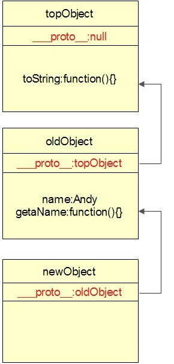
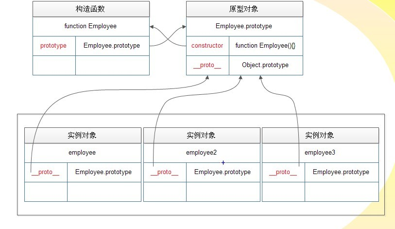
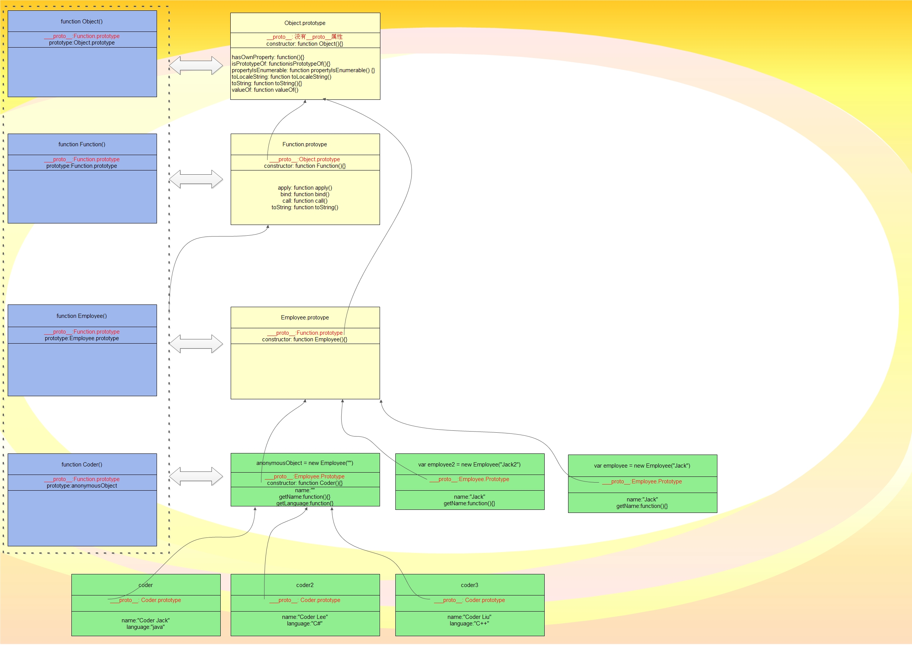

# 基于原型的语言

## 基于原型的语言的特点
 
1 只有对象,没有类;对象继承对象,而不是类继承类。
 
2  “原型对象”是基于原型语言的核心概念。原型对象是新对象的模板，它将自身的属性共享给新对象。一个对象不但可以享有自己创建时和运行时定义的属性，而且可以享有原型对象的属性。
 
3 除了语言原生的顶级对象，每一个对象都有自己的原型对象，所有对象构成一个树状的层级系统。root节点的顶层对象是一个语言原生的对象，其他所有对象都直接或间接继承它的属性。
 
显然，基于原型的语言比基于类的语言简单得多，我们只需要知道"用对象去创建对象"，就可以在原型的世界里大行其道了！
 
## 基于原型的语言中对象的创建
 
创建有两个步骤
1. 使用"原型对象"作为"模板"生成新对象
这个步骤是必要的，这是每个对象出生的唯一方式。以原型为模板创建对象，这也是"原型"(prototype)的原意。
2. 初始化内部属性
这一步骤不是必要的。通俗点说，就是，对"复制品"不满意，我们可以"再加工"，使之获得不同于"模板"的"个性"。

这两个步骤很自然，也很好理解，比使用类构造对象从概念上简单得多了。对于习惯了java基于类的面向对象的语言的程序员, 这种"新颖"的生成对象的方式一定会让他们感到好奇。

## 原型，为复用代码而生
 
使用原型，能复用代码，节省内存空间 
 
举个例子，存在旧对象oldObject，它有一个属性name，值是’Andy’, 和一个名为getName()的方法，如果以该对象为原型创建一个新对象，
```js
newObject = create(oldObject);  
```

那么新对象newObject同样具有属性name，值也是’Andy’，也有一个方法getName()。值得注意的是，newObject并不是在内存中克隆了oldObject，它只是引用了oldObject的属性, 导致实际的效果好像"复制"了newObject一样。

`newObject = create(oldObject);` 创建的对象newObject只有一个属性，这个属性的值是原型对象的地址(或者引用) ,如图：



当对象访问属性的时候，如果在内部找不到，那么会在原型对象中查找到属性；如果原型对象中仍然找不到属性，原型对象会查找自身的原型对象，如此循环下去，直至找到属性或者到达顶级对象。对象查找属性的过程所经过的对象构成一条链条，称之为原型链。newObject,oldObject和topObject就构成一条原型链。
 
对象会通过原型链动态地查找属性，对象的所拥有的属性并不是静态的。如果原型链上的一个对象发生的改变，那么这个改变也会马上会反应到在原型链中处于该对象下方的所有对象。

## 继承
如果以oldObject为原型创建了newObject，那么可以说newObject继承了oldObject。

在java中 通过语句class Cat extends Animal定义Cat类继承Animal类，Cat类产生的实例对象便拥有了Animal类中定义的属性。类似地，在基于原型的语言中， 通过cat = create(animal)创建以animal对象为模板的cat对象，cat对象便拥有了animal对象中的属性，因此可以说cat对象继承了anmial对象。 
 
## 深刻理解JavaScript基于原型的面向对象
 
### 一、饱受争议的javascript
 
javascript本质上是基于原型的语言，但是却引入了基于类的语言的new关键字和constructor模式，导致javascript饱受争议。
 
javascript的作者Brendan Eich 1994年研发这门语言的时候，C++语言是最流行的语言，java1.0即将发布，面向对象编程势不可挡，于是他认为，引入new关键字可以使习惯C++/java程序员更容易接受和使用javascript。
 
实际上，事实证明引入new是个错误的决定。
 
C++/java程序员看到new一个 function的时候，他们会认为js通过function创建对象，function相当于类，接着他们会尝试在js挖掘类似java/C++面向类的编程特性，结果他们发现function没有extends，反而有个很奇怪的prototype对象，于是他们开始咒骂，js的面向对象太糟糕了。确实，new的引入让他们以为js的面向对象与java/C++类似，实际上并不是，如果不是以原型本质去理解js的面向对象，注定要遭受挫折，new，prototype，__proto__才是javascript实现原型的具体手段。
 
另一方面，理解原型的程序员，也表示不高兴，因为居然要使用new function的语法来间接实现原型继承，三行代码才做到最基本的原型继承,下面是实现对象newObject继承对象oldObject的代码，

```
function F(){};  
F.prototype = oldObject;  
var newObject = new F();  
```

这太繁琐了。基于原型语言理论上应该存在一个函数create(prototypeObject)，功能是基于原型对象产生新对象，例如，
`var newObject = create(oldObject);`

看到这样的代码，人们就会自然很清晰地联想到，newObject是以oldObject模板构造出来的。

js是世界上最容易被误解的语言，原因主要有两个:
 
- 1) 作为基于原型的语言中，却连最基本的一个通过原型产生对象的函数create(prototypeObject)也没有，让人不知道js根本上是以对象创建对象。应该添加该函数，现在Chrome和IE9的Object对象就有这个create函数。
 
- 2) **使用new func形式创建对象**，让人误会js是以类似java类的构造函数创建对象，实际上，构造函数根本上在创建对象上起到次要的作用，甚至不需要，重要的只有函数的属性prototype引用的原型对象，新对象以此为模板生成，生成之后才调用函数做初始化的操作，而初始化操作不是必要的。当初应该废弃new 操作符，把new func分解为两步操作，

```js
var newObject = create(func.prototype); 
func.call(newObject);
```

这样程序员才好理解。如果想把这两个步骤合二为一，应该使用new以外的关键字。
 
到这里，**我们务必要牢牢印入脑海的是，js的面向对象是基于原型的面向对象，对象创建的方式根本上只有一种，就是以原型对象为模板创建对象，newObject = create(oldObject)。new function不是通过函数创建对象，只是刻意模仿java的表象。**
 
js在面向对象上遭遇的争议，完全是因为商业因素导致作者失去了自己的立场。就像现在什么产品都加个云一样，如果那时候不加个new关键字来标榜自己面向对象，产生"js其实类似c++/java"的烟幕，可能根本没有人去关注javascript。更令人啼笑皆非的是，原本称作LiveScript的javascript，因为后期和SUN合作，并且为了沾上当时被SUN炒得火热的Java的光，发布的时候居然改名成Javascript。
 
### 从原型本质，站在语言设计者角度，理解constructor模式
假想我们是当时设计javascript继承机制的Brendan Eich，我们会怎么设计js的面向对象呢？
现在javascript开发到这样的阶段
1) 拥有基本类型，分支和循环，基本的数学运算,
2) 所有数据都是对象
3) 拥有类似C语言的function
4) 可以用var obj = {}语句生成一个空对象，然后使用obj.xxx或obj[xxx]设置对象属性
5) 没有继承，没有this关键字，没有new
 
我们任务是，实现javascript的面向对象，最好能达到类似java的创建对象和继承效果。更具体一点，我们要扩充js语言，实现类似下面的java代码。

```java
class Empolyee{  
    String name;  
    public Employee(String name){  
        this.name = name;  
    }  
    public getName(){  
        return this.name;  
    }  
}  
class Coder extends Employee {  
    String language;  
    public Coder(name,language){  
        super(name);  
        this.language = language;  
    }  
    public getLanguage(){  
        return this.language;  
    }  
} 
```

#### 实现创建对象
 
现有的对象都是基本类型，怎么创建用户自定义的对象呢？

(解释：
var i = 1;
这里的i是解释器帮忙封装的Number对象，虽然看起来跟C的int没区别，但实际上可以i.toString()。
)

java使用构造函数来产生对象，我们尝试把java的Empolyee的构造函数代码拷贝下来，看看可不可以模仿
```js
function Empolyee(name){  
    this.name = name;  
}  
```
 
我们只要生成一个空对象obj，再把函数里面的this换成obj，执行函数，就可以生成自定义对象啦！**我们把Employee这样用来创建对象的函数称作构造函数。**
 
 
1)首先我们用原生的方式为function添加方法call和apply，实现把把函数里面的this替换成obj。call,apply在Lisp语言中已经有实现，很好参考和实现。
 
2)然后实现生成实例 
   
```js
function Empolyee(name){  
    this.name = name;  
}  
var employee = {};  
Employee.call(employee,'Jack');  
```
3)到这里，以类似java方式产生对象基本完成了，但是这个employee对象没有方法

我们的function是第一类对象，可以运行时创建，可以当做变量赋值，所以没有问题
```js
function Empolyee(name){  
    this.name = name;  
    this.getName = function(){return this.name};  
}  
```
#### 实现继承
创建对象成功了，接着考虑实现继承。现在我们所有数据都是对象，没有类，有两种方案摆在我们的面前
a.类继承
b.原型继承
 
##### 实现类继承
 
a方案是首选方案，因为跟java相似的话，JS更容易被接受
先粘贴Java构造函数的代码
```java
function Coder extends Employee(name,language){  
    super(name);  
    this.language = language;  
}  
```

1) 把extends后面的函数自动记录下来,放到function对象的parentFunc变量
2) 如果第一行是super()，替换成var parent = newInstance(Coder.parentFunc,XXX),这样内部保留一个名为parent父对象;
3) 把this替换为obj,super替换换成parent
4) "."和"[]"重新定义，需要支持在对象内部parent对象查找属性。
 
这四步都属于比较大的改动，只要认真想一想都觉得不是太容易。

更重要的是，即使把这4步实现了，不但语言变得太复杂了，而且产生的对象根本享受不了继承带来的好处————内存中的代码复用，因为这样产生的每个对象都有"父类(函数)"的代码而不是仅有一份。这时候**该注意到java中使用类的意义了，java类的代码在内存只有一份，然后每个对象执行方法都是引用类的代码，所有子类对象调用父类方法的时候，执行的代码都是同一份父类的方法代码**。但是**JS没有类，属性和方法都是存在对象之中，根本没有办法做到java那样通过类把代码共享给所有对象！**
 
a方案宣告失败
 
#### 实现原型继承
看b方案。我们现在的js语言，一切都是对象，显然非常适合使用基于原型的继承方式，就看具体如何实现了。
 
- 我们新建一个topObject来代表顶层对象,那么创建employee对象的时候，应该在employee对象内部设置一个属性引用topObject;
- 同理,创建coder对象的时候,应该在coder对象内部设置一个属性引用employee对象,我们把这个引用原型对象的属性命名约定为"__proto__"。
- 更进一步，为了构建一个对象的过程更自然，构建时候应该先在新对象中设置引用原型对象的属性，以表示先用模板制作出一个和模板一致的对象；
- 然后再才执行构造函数初始化这个新对象自身的属性，以添加个性化的东西。

具体实现代码如下：
 
```js
var topObject = {  
    __version__ : 1.0;  
};  
  
function Empolyee(name){  
    this.name = name;  
    this.getName = function(){return this.name};  
}  
var employee = {};  
employee.__proto__ = topObject;  
Employee.call(employee,'Jack');  
  
function Coder(name,language){  
    this.name = name;  
    this.language = this.language;  
    this.getLanguage = function(){return this.language};  
}  
  
var coder = {};  
coder.__proto__ = employee;  
Coder.call(coder,'Coder Jack','Java');  
```

当然我们还要做的工作就是在javascript解释器中增加对__proto__的支持，当一个对象访问一个自身没有的属性的时候，就通过__proto__属性查找原型链上是否存在该属性。
 
#### 优化1. 函数封装
 
这一切看起来并不是那么美好，我们创建一个employee对象需要3行代码，我们需要这么一个函数封装这3行代码
`function newInstance(prototype,constructor,arg1,arg2,....);`

//第一个参数是原型对象，第二个是构造函数，后面的是构造函数的参数
可以这么实现
```js
function sliceArguments(argumentsObj,n){  
    var args = [];  
    for(var i=0;i<argumentsObj.length;i++){  
        if(i>=n){  
            args.push(argumentsObj[i]);  
        }  
    }  
}  
function newInstance(prototype,constructor){  
    var obj = {};  
    obj.__proto__ = prototype;  
    constructor.apply(obj,sliceArguments(arguments,2));  
}  
var employee = newInstance(topObject,Employee,'Jack');  
var coder = newInstance(employee,Coder,'Coder Jack','Java');  
```

#### 优化2. 缩减参数
 
仔细一看，function newInstance的参数可以更少,我们可以把原型对象prototype作为属性放在constructor，那样我们的函数就可以只有一个参数了。属性名就约定为prototype吧。
2.1 我们修改解释器，把topObject写入语言作为原生的顶级对象；再修改function的源代码，让每一个新建的function都默认具有属性prototype = topObject
2.2 优化后的代码如下

```js
function newInstance(constructor){  
    var obj = {};  
    obj.__proto__ = constructor.prototype;  
    constructor.apply(obj,sliceArguments(arguments,1));  
    return obj;  
}  
function Employee(name){  
    this.name = name;  
    this.getName = function(){return this.name};  
}  
var employee = newInstance(Empolyee,'Jack');  
var employee2 = newInstance(Empolyee,'Jack2');  
var employee3 = newInstance(Empolyee,'Jack3');  
function Coder(name,language){  
    this.name = name;  
    this.language = language;  
    this.getLanguage = function(){return this.language};  
}  
Coder.prototype = newInstance(Empolyee,'');  
  
var coder = newInstance(Coder,'Coder Jack','Java');  
var coder2 = newInstance(Coder,'Coder Lee','C#');  
var coder3 = newInstance(Coder,'Coder Liu','C++');  
var coder4 = newInstance(Coder,'Coder Liu','JavaScript');  
```
 
到达这一步，可以发现,我们的最终实现和Breandan Eich非常类似，在期待尽量模仿java创建对象的前提下，Brendan Eich 当时的设计是合乎情理的，是良好的。他相对于我们方案的唯一不同就是他使用了new关键字，而我们使用了newInstance函数。
尽管new关键字容易让人误解，但是背后优美的原型思想，决定了时至今日，javascript依然是浏览器编程语言的龙头大哥，甚至发展到node.js服务端编程。
 
### 从javascript的原型本质，理解javascript的构造器模式
在"从原型本质，站在语言设计者角度，理解constructor模式"一节中我们站在设计者角度粗略重现了js的设计过程。现在我们换个角色，不是语言设计者，而是熟悉原型概念并且知道js是基于原型的语言的程序员，去理解js的使用(new关键字+函数)的创建对象方式。
#### 理解new func()
```
function Employee(name){  
    this.name = name;  
    this.getName = function(){return this.name};  
}  
var employee = new Employee('Jack');  
```

分析上面代码。
javascript引入new关键字是为了模仿java创建对象的方式，通过语句var employee = new Employee('Jack') 就生成了一个employee对象。
我们知道，基于原型的语言生成一个步骤有两步，第一步是使用"原型对象"作为"模板"生成新对象，第二步是初始化新对象的内部属性。
我们敢肯定地推断，javascript中的new Employee('Jack');必然做了这两件事情，那么
1 "原型对象"在哪里?
2 怎么做到"初始化新对象的内部属性"?
 
答案是，Employee.prototype就是我们要找的"原型对象"，通过"以新对象代替this,执行Employee函数"做到了"初始化新对象的内部属性"。
 
使用new+function的方式创建对象，其实就是应用我们设计的函数newInstance时的思想
function newInstance(constructor){  
        var obj = {};  
        obj.__proto__ = constructor.prototype;  
        constructor.call(obj,sliceArguments(arguments,1));  
        return obj;  
}  
javascript把生成一个对象所需的两个元素——"原型对象"和"初始化"都集中在构造函数，以简化创建对象的过程，其实是个良好的设计。唯一的缺点是new关键字容易让人误会。
 
#### 简单罗列javascript构造器模式的特点
1) javascript的顶层对象是Object.prototype
2) 所有对象有一个__proto__属性。__proto__指向自己的"原型对象"，搜索属性的原型链以__proto__为基础。
3) 每个函数都会默认关联一个原型对象。javascript每创建一个函数的时候，都同时创建一个原型对象，赋值到函数的prototype属性，用作使用new  生成实例对象的默认原型对象。该默认原型对象的内容是
{  
    __proto__:Object.prototype,  
    constructor: 指向函数本身  
}  
 
__proto__指向Object.prototype的目的是为了使生成的实例对象继承顶层对象Object.prototype;
而constructor指向函数本身的目的是为了使生成的实例对象newObject可以直接通过newObject.constructor访问到构造函数，同时构造函数和原型对象可以互相访问也是个良好的设计。但是，实际上，constructor并没有什么用，所以大家可以不理会这个属性，这仅仅是一个优化的设计。

构造函数，原型对象，实例对象的三角关系图如下:



4) 可以修改或替换构造函数都会默认关联的原型对象。需要注意的的是，不少资料说，如果是使用自定义的对象替换了构造函数f默认关联的原型对象，最好添加一行代码

f.prototype.constructor=f  
 以确保维护正确的三角关系。
   例如 
function Employee(){};  
function Coder(){};  
Coder.prototype = new Employee();  
Coder.prototype.constructor = Coder;  
var coder = new Coder();  
   但是经过我的测试，即使不写上一行Coder.prototype.constructor = Coder;，以下测试都表现正确

coder instanceOf Coder//true  
Coder.prototype.isPrototypeOf(coder)//true  
 

                   也就是说原型对象的construtctor属性根本不影响继承，它只是普通的一个附加属性，没有任何特殊作用，我们可以完全无视这个属性。
   不写上一行Coder.prototype.constructor = Coder;，唯一会引起的错误只有，coder.constructor的结果是Employee,而不是Coder。实
   际上我们并不会关心coder.constructor，我们关心的只是是继承，所以即使不写上一行Coder.prototype.constructor = Coder;也没有关系。
5) 以下代码几乎涵盖了上面所讨论的特点，建议读者在chrome中运行该代码以加深对构造器模式的理解
   5.a.代码
复制代码
```
<script>  
    function Employee(name){  
        this.name = name;  
        //this.getName = function(){return this.name};方法代码应该放到原型对象之中，而不是初始化函数中，这样每个employee对象都共享同一个方法代码  
    }  
    Employee.prototype.getName = function(){return this.name};  
    var employee = new Employee('Jack');  
    console.log("employee.getName(): " + employee.getName());//Jack  
    var employee2 = new Employee('Jack2');  
    console.log("employee2.getName(): " + employee2.getName());//Jack2    
    function Coder(name,language){  
        this.name = name;  
        this.language = language;  
        //this.getLanguage = function(){return this.language}; 方法代码应该放到原型对象之中，而不是初始化函数中，这样才能实现代码共享  
    }  
    Coder.prototype = new Employee('');  
    Coder.prototype.constructor = Coder;//这一句话其实也可以不写，不影响继承  
    Coder.prototype.getLanguage = function(){return this.language};  
  
    var coder = new Coder('Coder Jack','Java');  
    console.log("coder.getName(): " + coder.getName());//Coder Jack  
    console.log("coder.getLanguage(): "+coder.getLanguage());//Java  
    var coder2 = new Coder('Coder Lee','C#');  
    console.log("coder2.getName(): " + coder2.getName());//Coder Lee  
    console.log("coder2.getLanguage(): " + coder2.getLanguage());//C#  
    var coder3 = new Coder('Coder Liu','C++');  
    console.log("coder3.getLanguage(): " + coder3.getName());//Coder Liu  
    console.log("coder3.getLanguage()" + coder3.getLanguage());//C++  
      
    console.log("employee.constructor: " + employee.constructor);  
    console.log("employee.constructor.prototype === Employee.prototype: " + (employee.constructor.prototype === Employee.prototype));  
    console.log("employee.constructor.prototype.constructor === Employee: " + (employee.constructor.prototype.constructor === Employee));  
    console.log("employee instanceof Object: "  + (employee instanceof Object));  
    console.log("employee instanceof Function: "  + (employee instanceof Function));  
    console.log("employee instanceof Employee: "  + (employee instanceof Employee ));  
    console.log("Employee.prototype.isPrototypeOf(employee): "  + (Employee.prototype.isPrototypeOf(employee)));  
    console.log("Function.prototype.isPrototypeOf(employee): "  + (Function.prototype.isPrototypeOf(employee)));  
    console.log("Object.prototype.isPrototypeOf(employee): "  + (Object.prototype.isPrototypeOf(employee)));  
    console.log("coder.constructor: " + coder.constructor);  
    console.log("coder instanceof Object: "  + (coder instanceof Object));  
    console.log("coder instanceof Function: "  + (coder instanceof Function));  
    console.log("coder instanceof Employee: "  + (coder instanceof Employee ));  
    console.log("coder instanceof Coder: "  + (coder instanceof Coder ));  
    console.log("Employee.prototype.isPrototypeOf(coder): "  + (Employee.prototype.isPrototypeOf(coder)));  
    console.log("Coder.prototype.isPrototypeOf(coder): "  + (Coder.prototype.isPrototypeOf(coder)));  
    console.log("Function.prototype.isPrototypeOf(coder): "  + (Function.prototype.isPrototypeOf(coder)));  
    console.log("Object.prototype.isPrototypeOf(coder): "  + (Object.prototype.isPrototypeOf(coder)));  
  </script>
```  
复制代码
  
  5.b.对象继承体系结构图
  
  下图是上面5.a代码的对象整体结构图(图片较大,可以下载到本地缩小来看)
 
  从整体上看，这像极了java的类继承体系结构，实际上这就是js的对象继承体系结构。
 
  里面的对象有三种角色，紫色的是构造函数，黄色的是原型对象，绿色的是实例对象，当然不能严格区分这些角色，例如匿名的Employee实例对象充当了Coder的原型对象。
  紫色的构造函数和原型对象之间有一个双向箭头，这个双向箭头的意思，构造函数有一个prototype属性指向原型对象，而原型队形也有一个constructor属性指向构造函数，它们之间有着互相引用的关系。
  
  单线箭头，表示的是对象继承关系。

  

  从这个图，我们可以直观地看到
  1) 所有对象都有自己的原型对象。所有构造函数的原型对象都是Function.prototype,Object.prototype是最顶层的对象。我们可以在Function.prototype上增加方法，那么在原型链下方的函数，就可获得这些方法，同理我们可以在Object.prototype上增加方法,那么js所有对象都拥有了这个方法。
  2) 通过原型继承，所有对象构成了一个完整的系统
  3) 我相信你能够发现更多有趣的的东西.如果你觉得这篇文章不值得一看，那么请至少看看这张图片，结合这张图片重新思考下js原型的理念，应该能给你一些有益的回报。
 
6. 构造器模式的best practice  
  1) 方法最好放在原型对象中，让每个实例对象都共享同一个方法。如果方法放在构造函数中，那么每个对象都有自己独立的一份方法代码，浪费内存。
  2) 字段变量(fields,variables)最好放在构造函数中，让每个实例对象都具有一份自己的字段。除非要在所有子类中共享，实现类似静态变量的效果，才把字段放在原型中。
  3) 继承层次不宜过深，原型链查找会耗费时间。
  例如，
  上面第5)点中的代码片段中，
  1)Employee和Coder的方法都放在了原型中
  2)Coder产生的实例对象虽然继承自匿名employee对象(new Employee(''))，拥有name属性，但是为了每个Coder产生的实例对象都拥有属于自己的一份name属性，我们选择在构造函数中重复定义name属性，覆盖匿名employee对象的name属性。
  
四、模拟基于类的面向对象
 
1. 该不该模拟类
javascript是基于原型的语言，具有强大的表达能力，足可以模拟基于类的面向对象。相信大家也看过不少模拟类的js代码，这里不打算罗列。
 
但是，js毕竟是原型继承的语言，应该要按照原型继承的思维去表达面向对象，而不是用类的思维，这样才能表现出js的真正的威力。
如果要模拟的话，模拟一些最基本的操作就可以，不要尝试深入模拟基于类的语言的复杂特性，否则会犯下跟Brendan Eich同样的错误。模拟的出发点是方便程序员能够更容易地使用js面向对象，但是理解了构造器模式和原型链的前提下，没有模拟的必要，只需要封装一些常用的操作就OK了。
js的对象没有类型，根本不需要像java的对象那样需要关心自己的类继承体系以检查类型转换是否正确，所以模仿类继承没有意义。在js中只需要关心对象的内容，关心对象能否继承其他对象的属性就足够了。
 
我就曾经是一个被误导的程序员。看别人写的面向对象教程，以为js需要我们开发一些函数，才能使用面向对象。我用过prototype.js 的Class.create，那时候我的感觉很不爽，我抱怨js为什么连最基本的class都没有。
 
如果让我写一篇文章，介绍js的面向对象，我会先教会读者领会这个函数，
复制代码
if (typeof Object.create !== 'function') {  
    Object.create = function (o) {  
        function F() {}  
        F.prototype = o;  
        return new F();  
    };  
}  
var newObject = Object.create(oldObject);  
复制代码
我要让读者知道，js是基于原型的语言，它用只能以对象为模板创建对象，它用对象继承对象。它没有类，也不需要类，一切都是对象。在这之后再介绍如何模拟class就无所谓了，因为理解了javascript的原型本质之后，就会知道模拟类的实质是还是调用原型的特性，也就不会过分期待js能够像java一样操作类和对象，而且能够发现原型的面向对象能够带来传统面向对象语言无法比拟强大特性。
 
2. 欣赏Crockford对类的模拟
拜读了Crockford的一些文章和他写的JavaScript:The Good Parts，觉得他写的一些对js的简单封装很有意思，也很实用。
下面是我对他封装js面向对象的理解和总结,希望对读者有用。
 
创建对象的方法根本上只有一种方式：以原型对象为模板创建对象，但是在形式上可以多种多样。
在JS中，从形式上，除去字面量方式创建对象之外，有三种常单创建对象的形式(or you can call it a "pattern",anyway)
 
1) 使用构造函数创建对象(constructor pattern)
Crockford通过函数Function.prototype.method和Function.prototype.inherits方法"美化"了传统构造模式创建对象的代码。
值得注意的是，method方法和inherits方法的封装把prototype从代码中除去，掩盖了原型本质，需要程序理解构造器模式的前提下才可使用。
复制代码
<!DOCTYPE HTML>  
<HTML>  
<HEAD>  
<TITLE>使用构造器模式(new + prototype)实现继承</TITLE>  
</HEAD>  
  
<BODY>  
<script>  
    /** 
     * 以原型对象为模板创建出新对象 
     * 这个函数已经被Chrome和IE9采用，所以需要有个判断这个函数是否已经存在，Crockford的影响力可见一斑 
     */  
    if (!Object.create) {  
        Object.create = function(oldObject) {  
            function F() {  
            }  
            ;  
            F.prototype = oldObject;  
            return new F();  
        }  
    }  
    /** 
     * 在构造函数的原型对象上添加方法 
     * 非常推荐这个函数，因为这个函数能够培养出在原型对象中定义方法的良好习惯 
     */  
    Function.prototype.method = function(name, func) {  
        if (!this.prototype[name]) {  
            this.prototype[name] = func;  
            return this;  
        }  
    };  
    /** 
     * 使构造函数“继承”其他构造函数 
     * 实际上是将构造函数的原型对象替换为另外构造函数产生的对象 
     *  
     */  
    Function.method('inherits', function(F) {  
        this.prototype = new F();  
        return this;  
    });  
  
    /***************************************** 
     *使用链式代码清晰紧凑地定义构造函数 
     *****************************************/  
    var Employee = function(name) {  
        this.name = name;  
    }.method('getName', function() {  
        return this.name;  
    });  
  
    //由于method和inherits函数都返回this，所以可以非常舒服地将构造函数写成链式代码  
    var employee = new Employee("jack");  
    alert(employee.getName());  
  
    //由于method和inherits函数都返回this，所以可以非常舒服地将构造函数写成链式代码  
    var Coder = function(name, language) {  
        this.name = name;  
        this.language = language;  
    }.inherits(Employee).method('getLanguage', function() {  
        return this.language;  
    }).method('getIntroduction', function() {  
        return this.name + " is skilled in " + this.language;  
    });  
  
    var coder = new Coder('Jack', 'Java');  
    alert(coder.getIntroduction());  
    alert(coder.getName());  
</script>  
</BODY>  
</HTML>  
复制代码
  增强1.模拟私有变量。
上面构造函数所产生的对象只有public成员，没有private成员，可以通过闭包实现私有成员
 
复制代码
/***************************************** 
 * 模拟私有变量 
 *****************************************/  
var Employee = function(name) {  
    //私有变量  
    var name = name;  
    this.getName = function() {  
        return name  
    };  
};  
var employee = new Employee('Jack');  
alert(employee.name);//undefined  
alert(employee.getName());//Jack  
复制代码
 
私有成员带来的代价是，访问私有变量的方法不能放置在原型对象中被共享，导致每个生成的对象在内存都独立拥有一份访问私有变量方法的代码。
 
  增前2. 模拟super.method.
 
构造函数coder能不能模仿出java中类似super.method的效果呢？答案是可以的，最简单的实现是在对象内部创建一个副对象的副本。缺点是增加了内存的消耗。
 
复制代码
/****************** 
 *模拟super.method() 
 ******************/  
var Coder = function(name, language) {  
    var _super = new Employee('');  
    this.name = name;  
    this.language = language;  
    this.getName = function() {  
        return "my name is :" + _super.getName.call(this, name);  
    };  
}.inherits(Employee).method('getLanguage', function() {  
    return this.language;  
}).method('getIntroduction', function() {  
    return this.name + " is skilled in " + this.language;  
});  
  
var coder = new Coder('Jack', 'Java');  
alert(coder.getIntroduction());  
alert(coder.getName());//my name is Jack  
复制代码
2) 使用原型创建对象(prototypal pattern)
 
这种创建方式直白地显示了原型语言创建对象的特点
复制代码
<!DOCTYPE HTML>  
<HTML>  
<HEAD>  
<TITLE>使用Object.create实现继承</TITLE>  
</HEAD>  
  
<BODY>  
<script>  
    /** 
     * 以原型对象为模板创建出新对象 
     */  
    if (!Object.create) {  
        Object.create = function(oldObject) {  
            function F() {  
            }  
            ;  
            F.prototype = oldObject;  
            return new F();  
        }  
    }  
  
    /***************************************** 
     * 使用原型对象创建对象，创建之后再对象初始化， 
     * 这种创建方式直白地显示了原型语言创建对象的特点 
     *****************************************/  
  
    var employee = {  
        name : 'Jack',  
        getName : function() {  
            return this.name;  
        }  
    };  
  
    var coder = Object.create(employee);  
    coder.name = 'Jackson';  
    coder.language = 'Java';  
    coder.getIntroduction = function() {  
        return this.name + " is skilled in " + this.language;  
    }  
    alert(coder.getName());  
    alert(coder.getIntroduction());  
</script>  
</BODY>  
</HTML>  
复制代码
 
3) 使用函数创建对象并返回(functional pattern)
这种方式很简单，在函数内部先新建一个对象 var object = ｛｝,然后为这个对象设置属性，最后返回这个对象
优点：a.最简单最容易理解，甚至不需要理解js的原型特性，应该作为最优先考虑的对象创建方式; 
  b.生成对象可以有私有属性
  c.具有类似java中super.method()的访问"父对象"方法的能力
缺点：同一函数生成的多个对象不能在内存中共享代码。
复制代码
<!DOCTYPE HTML>  
<HTML>  
<HEAD>  
<TITLE>使用function实现继承</TITLE>  
</HEAD>  
  
<BODY>  
<script>  
    /** 
     * 以原型对象为模板创建出新对象 
     * 这个函数已经被Chrome和IE9采用，所以需要有个判断这个函数是否已经存在，Crockford的影响力可见一斑 
     */  
    if (!Object.create) {  
        Object.create = function(oldObject) {  
            function F() {  
            }  
            ;  
            F.prototype = oldObject;  
            return new F();  
        }  
    }  
    /** 
     * 在构造函数的原型对象上添加方法 
     * 非常推荐这个函数，因为这个函数能够培养出在原型对象中定义方法的良好习惯 
     */  
    Function.prototype.method = function(name, func) {  
        if (!this.prototype[name]) {  
            this.prototype[name] = func;  
            return this;  
        }  
    };  
    /** 
     * 使构造函数“继承”其他构造函数 
     * 实际上是将构造函数的原型对象替换为另外构造函数产生的对象 
     *  
     */  
    Function.method('inherits', function(F) {  
        this.prototype = new F();  
        return this;  
    });  
  
    /***************************************** 
     * 使用函数创建对象 
     * 1 使用函数的闭包实现私有属性 
     * 2 子对象可以调用父对象的方法 
     *****************************************/  
    function employee(name) {  
        var object = {};  
        //name属性是私有变量  
        var name = name;  
  
        var getName = function() {  
            return name;  
        }  
        //getName对外公开  
        object.getName = getName;  
        return object;  
    }  
  
    function coder(name, language) {  
        var object = employee(name);  
        var superGetName = object.getName;  
        var language = language;  
        var getLanguage = function() {  
            return language;  
        };  
        //调用父对象的方法  
        var getName = function() {  
            return "my name is " + superGetName();  
        };  
  
        object.getName = getName;  
        return object;  
    }  
    var e1 = employee('Jack');  
    alert(e1.name);//undefined  
    alert(e1.getName());//Jack  
  
    var c1 = coder('Jackson', 'Java');  
    alert(c1.getName());//My name is Jackson  
</script>  
</BODY>  
</HTML>  
复制代码
推荐一些极好的关于JS面向对象的文章（每一篇都严重推荐，尤其是crockford和他的《JavaScript: The Good Parts》)
 
crockford大师
http://javascript.crockford.com/javascript.html
http://javascript.crockford.com/prototypal.html
http://javascript.crockford.com/inheritance.html
http://www.crockford.com/javascript/private.html
 
MDN
https://developer.mozilla.org/en-US/docs/JavaScript/Guide/Details_of_the_Object_Model
 
微软杂志
http://msdn.microsoft.com/zh-cn/magazine/cc163419.aspx#S4
 
MSDN
http://msdn.microsoft.com/en-us/library/dd282900(v=vs.85).aspx
http://msdn.microsoft.com/en-us/library/dd229916(v=vs.85)
 
阮一峰
http://www.ruanyifeng.com/blog/2010/05/object-oriented_javascript_encapsulation.html
http://www.ruanyifeng.com/blog/2012/07/three_ways_to_define_a_javascript_class.html?20120830102326#comment-last
http://www.ruanyifeng.com/blog/2010/05/object-oriented_javascript_inheritance.html

http://www.ruanyifeng.com/blog/2010/05/object-oriented_javascript_inheritance_continued.html

 

others

http://bonsaiden.github.com/JavaScript-Garden/zh/

 

怕丢了所以全复制个来

原文在http://lazy2009.iteye.com/blog/1675059