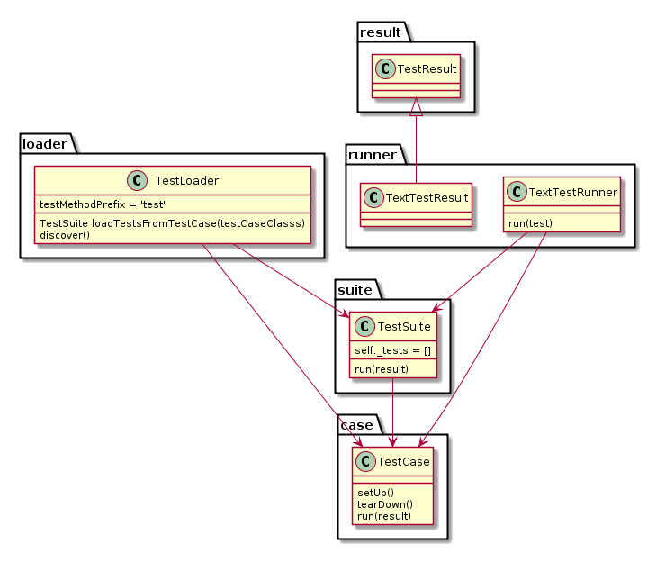

# PYTHON UNITTEST 

笔记参考：https://docs.python.org/3/library/unittest.html

这是一个类似JUnit的测试框架，用于测试Python代码。

特性：
- 与其它语言的主流单元测试框架类似
- 支持自动化
- 配置共享
- 关机代码测试
- 支持将测试样例聚合到测试集
- 测试与报告框架独立

## 基本概念

To achieve the above, unittest supports some important concepts in an object-oriented way: 
- test fixture：测试所需的必要准备。
- test case：测试的独立单元。
- test suite：test case、test suites的集合。
- test runner：测试执行的组件并提供输出。



### TEST FIXTURE

A test fixture represents the preparation needed to perform one or more tests, and any associated cleanup actions. This may involve, for example, creating temporay or proxy databases, directories, or starting a server process.

### TEST CASE

It checks for a specific response to a particular set of inputs. The unittest provides a base class, TestCase, which may be used to create new test cases.

### TEST SUITE

It is used to aggregate tests that should be executed together.

### TEST RUNNER

A test runner is a component which orchestrates the execution of tests and provides the outcome to the user. The runner may use a graphical interface, a textual interface, or return a special value to indicate the results of executing the tests.

## BASIC EXAMPLE

The unittest module provides a rich set of tools for constructing and running tests. 

Here is a short script to test three strings methods.
```python
import unittest

class TestStringMethods(unittest.TestCase):
    def test_upper(self):
        self.assertEqual('foo'.upper(),'FOO')
    def test_isupper(self):
        self.assertTrue('FOO'.isupper())
        self.assertFalse('Foo'.isupper())

    def test_split(self):
        s = 'hello world'
        self.assertEqual(s.split(), ['hello', 'world'])
        # check that s.split fails when the separator is not a string
        with self.assertRaises(TypeError):
            s.split(2)

if __name__ == '__main__':
    unittest.main()
```
上例说明：
- 一个test case是一个自定义类，它要继承unittest.TestCase类。
- 类中的测试方法，命名前缀为test，这个命名约定（naming convention) 告诉test runner 这些方法表达了测试项。
- 关键在于调用断言方法。

### 断言方法

- assertEqual() to check for an expected result;
- assertTrue() or assertFalse() to verify a condition; 
- assertRaises() to verify that a specific exception gets raised.

These methods are used instead of the assert statement so the test runner can accumulate all test results and produce a report.

### setUp和tearDown

这两个方法用于定义在执行测试前、后的指令。

## 命令行接口

The unittest module can be used from the command line to run tests from modules, classes or even individual test methods:

```shell
python -m unittest test_module1 test_module2
python -m unittest test_module.TestClass
python -m unittest test_module.TestClass.test_method
```
You can pass in a list with any combination of module names, and fully qualified class or method names.

Test modules can be specified by file path as well:

```python -m unittest tests/test_something.py```


This allows you to use the shell filename completion to specify the test module. The file specified must still be importable as a module. The path is converted to a module name by removing the ‘.py’ and converting path separators into ‘.’. If you want to execute a test file that isn’t importable as a module you should execute the file directly instead.

You can run tests with more detail (higher verbosity) by passing in the -v flag:
```python -m unittest -v test_module```

When executed without arguments Test Discovery is started: ```python -m unittest```

For a list of all the command-line options:```python -m unittest -h```

命令行参数：
- -b，缓存测试运行的标准输出和标准错误流。
- -c，在测试运行中，按ctl-c一次，则当前测试结束后就报告结果；按两次ctl-c则结束运行，并报告KeyboardInterrupt异常。
- -f，在第一个error或failure时就停止测试运行。
- -k，仅运行匹配了模式或子字符串的测试。例如：```-k foo```，进运行包含字符串foo的测试，大小写敏感。
- --locals，显示本地跟踪回测变量。

## Test Discovery
测试发现功能。

为了兼容测试发现，所有的测试文件必须是modules or packages。

In order to be compatible with test discovery, all of the test files must be modules or packages (including namespace packages) importable from the top-level directory of the project (this means that their filenames must be valid identifiers).

Test discovery is implemented in TestLoader.discover(), but can also be used from the command line. The basic command-line usage is:

```
cd project_directory
python -m unittest discover
```
## 组织测试代码

单元测试的基本构建模块是test cases——必须被设置且检查正确性的单一场景。

使用 unittest 进行单元测试，需要继承 TestCase 构建子类或使用FunctionTestCase。

一个TestCase实例的测试代码必须完整地自包含，以便能够独立地运行或与其它任意数量的test cases进行随机组合运行。

一个TestCase实例通常包含：
- 若干个以test开头的测试方法，每个方法用于测试某单一函数或单一功能；
- 测试方法中，包含一个或多个断言方法：assert*()
- 如果一个测试失败，异常会以消息形式被爆出（raised），而且unittest会标识这个测试失败。
- 除测试失败（test failure）外的其它异常，被称为errors。
- 测试可能很多，但它们的运行前处理可能是一样的，即 setUp方法可能是重复的。测试框架会自动为每个测试方法调用这个setUp方法。
- 如果setUp方法发生异常，则被认为是有error发生，而当前测试方法不会被执行。
- 与setUp方法类似，后置操作tearDown方法是每个测试方法执行后的重复操作。

包含以上部分的工作环境被称为test fixture。

### test fixture

一个新的测试用例实例被生成，作为执行每个单独测试方法的唯一的test fixture，其中包含的setUp()，tearDown()，和__init__()将被每个测试方法所调用。

### test suite
推荐使用TestCase的实现，根据测试目标或内容将测试组织在一起，unittest提供了这样的机制，被称为test suite。test suite表达为TestSuite类。最为常见的情况是调用unittest.main()方法，将执行和收集模块的测试用例。

如果想自定义test suite，可以如下操作：
```python
def suite():
    suite = unittest.TestSuite()
    suite.addTest(WidgetTestCase('test_default_widget_size'))
    suite.addTest(WidgetTestCase('test_widget_resize'))
    return suite

if __name__ == '__main__':
    runner = unittest.TextTestRunner()
    runner.run(suite())
```

可以把test suite函数的定义放在某个测试用例文件中，但更好的是放在独立的模块中。

### 老测试代码的重用

为了简便实用，unittest可以将没有继承TestCase的老测试代码进行转换。

unittest 提供了一个 FunctionTestCase 类，TestCase的子类可以用于包装一个已存在的测试函数。

Given the following test function:
```python
def testSomething():
    something = makeSomething()
    assert something.name is not None
    # ...
```

one can create an equivalent test case instance as follows, with optional set-up and tear-down methods:
```python
testcase = unittest.FunctionTestCase(testSomething,
                                     setUp=makeSomethingDB,
                                     tearDown=deleteSomethingDB)
```

Note Even though FunctionTestCase can be used to quickly convert an existing test base over to a unittest-based system, this approach is not recommended. Taking the time to set up proper TestCase subclasses will make future test refactorings infinitely easier.

## 跳过测试 与 期望错误 （Skipping tests and expected failures）

支持跳过某个测试方法，甚至整个测试类。此外，还支持标记某个测试方法为“expected failure”。这种被标记的测试方法是有问题的并将执行失败，但不会作为测试结果（TestResult）中的失败。

Skipping a test is simply a matter of using the skip() decorator or one of its conditional variants, calling TestCase.skipTest() within a setUp() or test method, or raising SkipTest directly.
Basic skipping looks like this:

```python


class MyTestCase(unittest.TestCase):

    @unittest.skip("demonstrating skipping")
    def test_nothing(self):
        self.fail("shouldn't happen")

    @unittest.skipIf(mylib.__version__ < (1, 3),
                     "not supported in this library version")
    def test_format(self):
        # Tests that work for only a certain version of the library.
        pass

    @unittest.skipUnless(sys.platform.startswith("win"), "requires Windows")
    def test_windows_support(self):
        # windows specific testing code
        pass

    def test_maybe_skipped(self):
        if not external_resource_available():
            self.skipTest("external resource not available")
        # test code that depends on the external resource
        pass
```

This is the output of running the example above in verbose mode:

```shell
test_format (__main__.MyTestCase) ... skipped 'not supported in this library version'
test_nothing (__main__.MyTestCase) ... skipped 'demonstrating skipping'
test_maybe_skipped (__main__.MyTestCase) ... skipped 'external resource not available'
test_windows_support (__main__.MyTestCase) ... skipped 'requires Windows'

----------------------------------------------------------------------
Ran 4 tests in 0.005s

OK (skipped=4)
```
Classes can be skipped just like methods:
```python
@unittest.skip("showing class skipping")
class MySkippedTestCase(unittest.TestCase):
    def test_not_run(self):
        pass
```
TestCase.setUp() can also skip the test. This is useful when a resource that needs to be set up is not available.

Expected failures use the expectedFailure() decorator.

```python
class ExpectedFailureTestCase(unittest.TestCase):
    @unittest.expectedFailure
    def test_fail(self):
        self.assertEqual(1, 0, "broken")
```
It’s easy to roll your own skipping decorators by making a decorator that calls skip() on the test when it wants it to be skipped. This decorator skips the test unless the passed object has a certain attribute:

```python
def skipUnlessHasattr(obj, attr):
    if hasattr(obj, attr):
        return lambda func: func
    return unittest.skip("{!r} doesn't have {!r}".format(obj, attr))
```

## Distinguishing test iterations using subtests

When there are very small differences among your tests, for instance some parameters, unittest allows you to distinguish them inside the body of a test method using the subTest() context manager.

使用上下文管理器（subTest())来分离只有些许差异的测试方法。

For example, the following test:

```python
class NumbersTest(unittest.TestCase):

    def test_even(self):
        """
        Test that numbers between 0 and 5 are all even.
        """
        for i in range(0, 6):
            with self.subTest(i=i):
                self.assertEqual(i % 2, 0)
```               
will produce the following output:

```shell
======================================================================
FAIL: test_even (__main__.NumbersTest) (i=1)
----------------------------------------------------------------------
Traceback (most recent call last):
  File "subtests.py", line 32, in test_even
    self.assertEqual(i % 2, 0)
AssertionError: 1 != 0

======================================================================
FAIL: test_even (__main__.NumbersTest) (i=3)
----------------------------------------------------------------------
Traceback (most recent call last):
  File "subtests.py", line 32, in test_even
    self.assertEqual(i % 2, 0)
AssertionError: 1 != 0

======================================================================
FAIL: test_even (__main__.NumbersTest) (i=5)
----------------------------------------------------------------------
Traceback (most recent call last):
  File "subtests.py", line 32, in test_even
    self.assertEqual(i % 2, 0)
AssertionError: 1 != 0
```
如果不是用subTest方法，上述测试将会在第一个failure发生后停止，且错误将不容易诊断，因为i的值不会被显示出来。例如：

```
======================================================================
FAIL: test_even (__main__.NumbersTest)
----------------------------------------------------------------------
Traceback (most recent call last):
  File "subtests.py", line 32, in test_even
    self.assertEqual(i % 2, 0)
AssertionError: 1 != 0
```

## 类与函数

### TestCase 类

TestCase 类的实例，表达了逻辑上的测试单元。TestCase是一个基类（base class）。

Each instance of TestCase will run a single base method: the method named methodName. In most uses of TestCase, you will neither change the methodName nor reimplement the default runTest() method.

TestCase instances provide three groups of methods:
- 运行测试的方法 即one group used to run the test, 
- 测试方法 即 another used by the test implementation to check conditions and report failures, 
- and some inquiry methods allowing information about the test itself to be gathered.

#### 运行测试的方法
- setUp()
- tearDown()
- setUpClass()
- tearDownClass()
- run()
- skipTest()
- subTest()
- debug()

```python
@classmethod
def setUpClass(cls):
    ...
@classmethod
def tearDownClass(cls):
    ...
```

#### 断言方法

The TestCase class provides several assert methods to check for and report failures. The following table lists the most commonly used methods (see the tables below for more assert methods):

- assertEqual(a,b)
- assertNotEqual(a,b)
- assertTrue(x)
- assertFalse(x)
- assertIs(a,b)
- assertIsNot(a,b)
- assertIsNotNone(x):x is not None
- assertIn(a,b): a in b
- assertNotIn(a,b)
- assertIsInstance(a,b)
- assertNotIsInstance(a,b)

还有些断言方法，用于检查过程中的异常、警告、日志消息：
- assertRaise(exc,fun,*args,**kwdsMethod): fun(*args, **kwds) raises exc
- assertRaisesRegex(exc, r, fun, *args, **kwds): fun(*args, **kwds) raises exc and the message matches regex r
- assertWarns(warn, fun, *args, **kwds): fun(*args, **kwds) raises warn
- assertWarnsRegex(warn, r, fun, *args, **kwds), fun(*args, **kwds) raises warn and the message matches regex r
- assertLogs(logger, level), The with block logs on logger with minimum level)

```python
with self.assertRaises(SomeException) as cm:
    do_something()

the_exception = cm.exception
self.assertEqual(the_exception.error_code, 3)

with self.assertWarns(SomeWarning) as cm:
    do_something()

self.assertIn('myfile.py', cm.filename)
self.assertEqual(320, cm.lineno)

self.assertWarnsRegex(DeprecationWarning,
                      r'legacy_function\(\) is deprecated',
                      legacy_function, 'XYZ')
```

还有的断言方法用于更为专用的检查，例如：
- assertAlmostEqual(a, b)： round(a-b, 7) == 0

- assertNotAlmostEqual(a, b)： round(a-b, 7) != 0

- assertGreater(a, b)： a > b
- assertGreaterEqual(a, b)： a >= b
- assertLess(a, b)： a < b
- assertLessEqual(a, b)：a <= b
- assertRegex(s, r)：r.search(s)
- assertNotRegex(s, r)：not r.search(s)
- assertCountEqual(a, b)：a and b have the same elements in the same number, regardless of their order.

#### 其它方法
- fail(msg=None), 无条件发送测试失败信号
- failureException
- longMessage
- maxDiff
- countTestCases
- ...

### class unittest.IsolatedAsyncioTestCase(methodName='runTest')

This class provides an API similar to TestCase and also accepts coroutines as test functions.

### Grouping tests 的类

#### class unittest.TestSuite(tests=())
This class represents an aggregation of individual test cases and test suites. The class presents the interface needed by the test runner to allow it to be run as any other test case. Running a TestSuite instance is the same as iterating over the suite, running each test individually.

If tests is given, it must be an iterable of individual test cases or other test suites that will be used to build the suite initially. Additional methods are provided to add test cases and suites to the collection later on.

TestSuite objects behave much like TestCase objects, except they do not actually implement a test. Instead, they are used to aggregate tests into groups of tests that should be run together. Some additional methods are available to add tests to TestSuite instances:
- addTest(test): Add a TestCase or TestSuite to the suite.

- addTests(tests): Add all the tests from an iterable of TestCase and TestSuite instances to this test suite.

This is equivalent to iterating over tests, calling addTest() for each element.

TestSuite shares the following methods with TestCase:

- run(result)
- debug()
- countTestCases()
- ```__iter__```

### Loading and running tests 的类

#### class unittest.TestLoader

The TestLoader class is used to create test suites from classes and modules. Normally, there is no need to create an instance of this class; the unittest module provides an instance that can be shared as unittest.defaultTestLoader. Using a subclass or instance, however, allows customization of some configurable properties.

#### class unittest.TestResult
This class is used to compile information about which tests have succeeded and which have failed.
#### class unittest.TextTestResult(stream, descriptions, verbosity)

## Class and Module Fixtures

## Signal Handling
New in version 3.2.

The -c/--catch command-line option to unittest, along with the catchbreak parameter to unittest.main(), provide more friendly handling of control-C during a test run. With catch break behavior enabled control-C will allow the currently running test to complete, and the test run will then end and report all the results so far. A second control-c will raise a KeyboardInterrupt in the usual way.

# Getting Started With Testing in Python

https://realpython.com/python-testing/

## How to Structure a Simple Test
Before you dive into writing tests, you’ll want to first make a couple of decisions:
- What do you want to test?
- Are you writing a unit test or an integration test?

Then the structure of a test should loosely follow this workflow:
- Create your inputs
- Execute the code being tested, capturing the output
- Compare the output with an expected result

For this application, you’re testing sum(). There are many behaviors in sum() you could check, such as:
- Can it sum a list of whole numbers (integers)?
- Can it sum a tuple or set?
- Can it sum a list of floats?
- What happens when you provide it with a bad value, such as a single integer or a string?
- What happens when one of the values is negative?

The most simple test would be a list of integers. Create a file, test.py with the following Python code:
```python
import unittest

from my_sum import sum


class TestSum(unittest.TestCase):
    def test_list_int(self):
        """
        Test that it can sum a list of integers
        """
        data = [1, 2, 3]
        result = sum(data)
        self.assertEqual(result, 6)

if __name__ == '__main__':
    unittest.main()
```