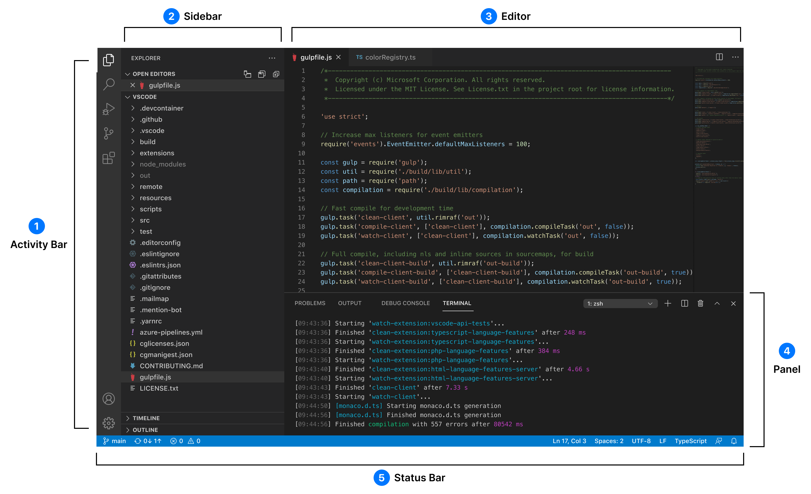
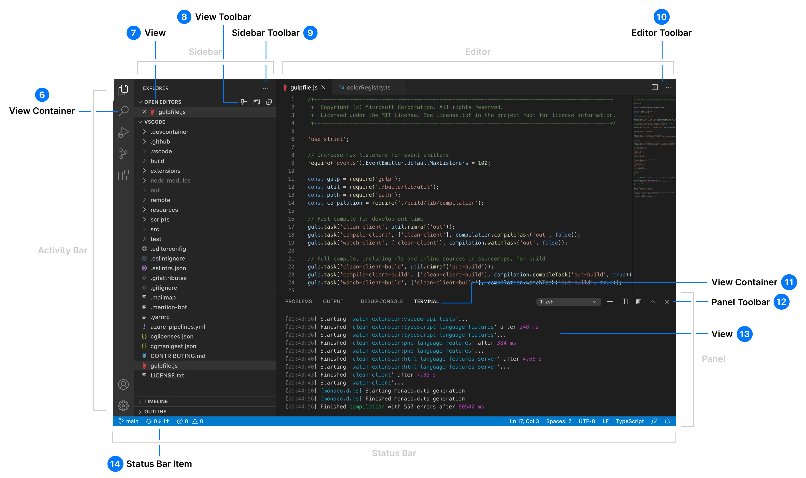
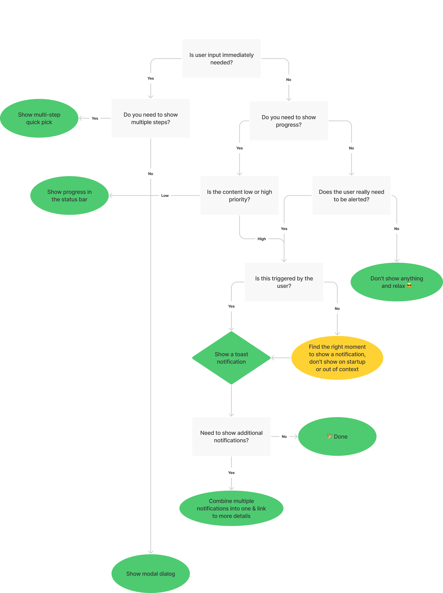
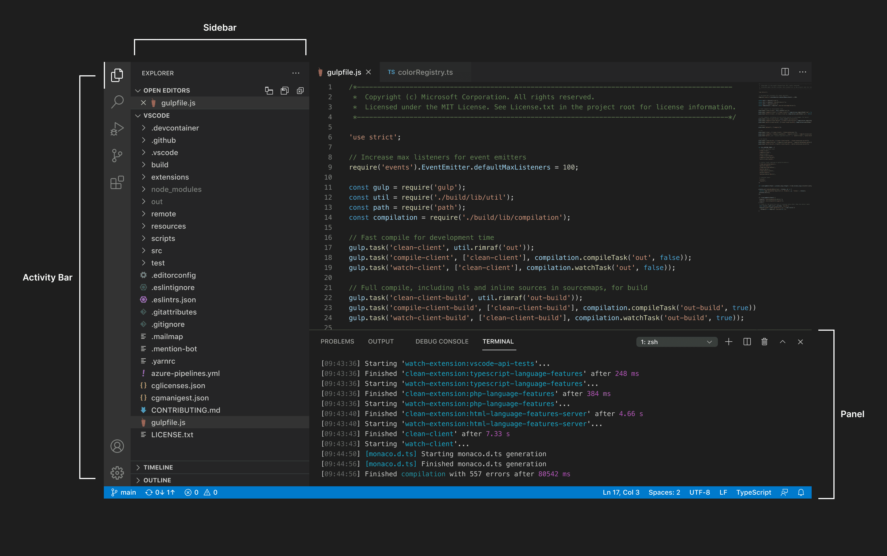
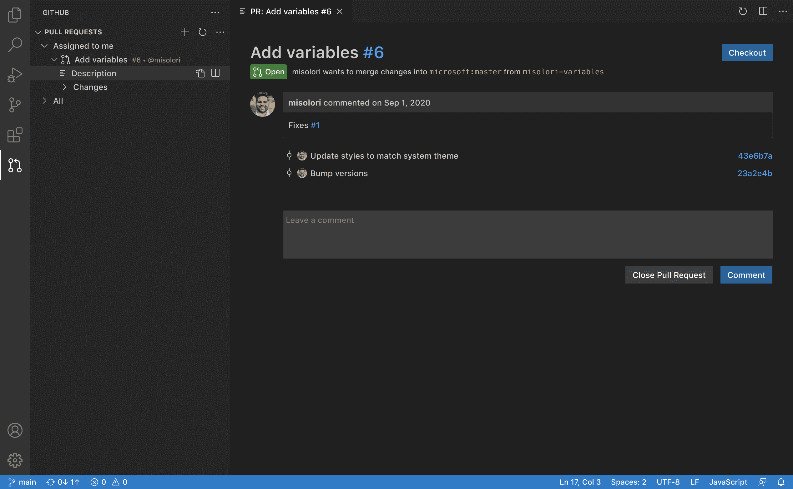
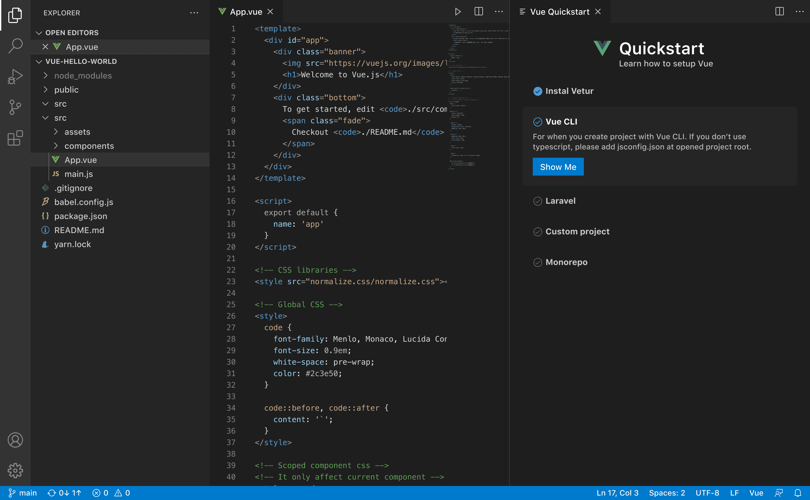
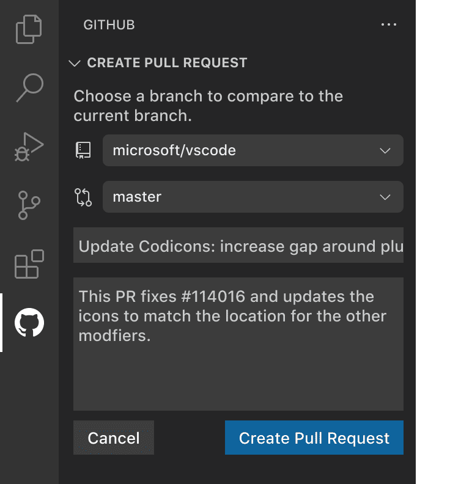

# Extension Guidelines
These guidelines cover the best practices for creating Visual Studio Code extensions.

> https://code.visualstudio.com/api/references/extension-guidelines

## Architecture
The VS Code UI has two types of elements: containers and items. 

Containers refer to the outer layers, which include:
- Activity Bar
- Sidebar
- Editor
- Panel
- Status Bar

Items are placed inside of various containers and include:
- View Container
- View
- View Toolbar
- Sidebar Toolbar
- Editor Toolbar
- View Container
- Panel Toolbar
- View
- Status Bar Item:

## Notifications#

Notifications display brief information that is surfaced from the bottom right of VS Code. You can send three types of notifications:
- Information
- Warning
- Error

It's important to limit the number of notifications sent in order to respect the user's attention. To help guide your decision on whether or not you should show a notification, please follow our notification decision tree:

### Progress notification

When needing to display progress for an undetermined timeframe (for example, setting up an environment), you can use the progress notification. This type of global progress notification should be used as a last resort as progress is best kept within context (within a view or editor).

✔️ Do

Show a link to see more details (like logs)
Show information as setup progresses (initializing, building, etc.)
Provide an action to cancel the operation (if applicable)
Add timers for timed out scenarios
❌ Don't

Leave a notification running in progress

## Views

Views are containers of content that can appear in the sidebar or panel. Views can contain tree views or custom views and can also display view actions. Views can also be rearranged by the user into other views, Activity Bar items, and panels. Limit the number of views created as other extensions can contribute in the same view.

✔️ Do

Use existing icons when possible
Use file icons for language files
Use a tree view for displaying data
Add an Activity Bar icon to every view
Keep the number of views to a minimum
Keep the length of names to a minimum
Limit the use of custom webview views

❌ Don't

Repeat existing functionality
Use tree items as single action items (for example, search bar)
Use custom webview views if not necessary
Use a view container to launch a webview in the editor

### View locations

Views can be placed in existing view containers, such as the File Explorer and Source Control (SCM) and Debug view containers. They can also be added to a custom view container via the Activity Bar. In addition, views can be added to any view container in the panel or in their own custom view container.

### View Containers#
View Containers are part of the Activity Bar. Each container has a unique icon that matches the rest of the iconography (outline) style.

### Views with progress#
You can also show progress in the Source Control view if your view is inside of the SCM view container.

### Welcome views#
When a view is empty, you can add content to guide users on how to use your extension or get started. Links and icons are supported in Welcome views.

✔️ Do

Use Welcome views only when necessary
Use links instead of buttons when possible
Use buttons only for primary actions
Use clear link text to indicate the link destination
Limit the length of the content
Limit the number of Welcome views
Limit the number of buttons in views
❌ Don't

Use buttons if not necessary
Use Welcome views for promotions
Use generic "read more" as link text

## Webviews

If you need to display custom functionality that is beyond what the VS Code API supports, you can use webviews, which are fully customizable.

It's importable to understand that webviews should only be used if you absolutely need them.

✔️ Do

Only use webviews when absolutely necessary
Activate your extension only when contextually appropriate
Open webviews only for the active window
Ensure all elements in the view are themeable (see the webview-view-sample and color tokens documentation)
Ensure your views follow accessibility guidance (color contrast, ARIA labels, keyboard navigation)
Use command actions in the toolbar and in the view

❌ Don't

Use for promotions (upgrades, sponsors, etc.)
Use for wizards
Open on every window
Open on extension updates (ask via a Notification instead)
Add functionality that is unrelated to the editor or workspace
Repeat existing functionality (Welcome page, Settings, configuration, etc.)

### Webview examples#
#### Browser preview

This extension opens a browser preview for the editor to the side.

#### Pull request

This extension shows pull requests for the repository of the workspace in a custom tree view and then uses a webview for a detail view of the pull request.

#### Onboarding

This extension opens a quickstart webview with helpful actions and links for more information. The webview only appears the first time a user opens a certain file and checks if certain steps have already been completed (for example, install or create a file).

### Webview views
You can also place webviews into any view container (sidebar or panel) and these elements are called webview views. The same webview guidance applies to webview views.

## Status Bar

The Status Bar sits at the bottom of the VS Code workbench and displays information and actions that relate to your workspace.

Items are placed into two groups:
- Primary(left)
- Secondary(right)

Items that relate to the entire workspace(status,problems/warnings,sync) go on the left and items that are secondary or contextual (language,sapcing ,feedback ) go on the right.

Limit the number of items added, as other extension contribute to the same area.

✔️ Do

Use short text labels
Use icons only when necessary
Use icons only for clear metaphors
Place primary (global) items on the left
Place secondary (contextual) items on the right
❌ Don't

Add custom colors
Add more than one icon (unless necessary)
Add more than one item (unless necessary)