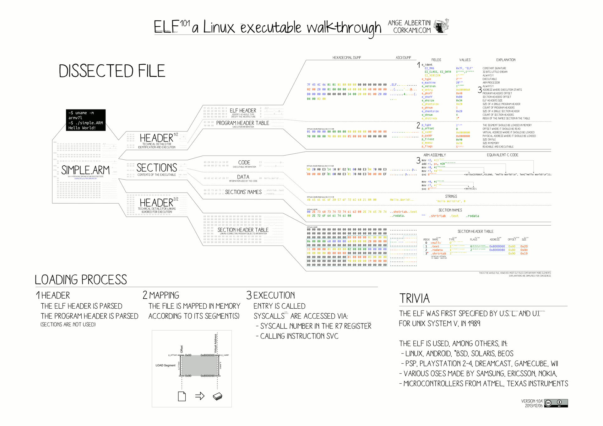

# ELF (Executable and Linkable Format)

ELF 是一种面向可执行文件（executable files）、共享库（shared libraries）、内核映像（core dumps）的通用标准。

ELF首次出现在Unix OS 版本 System V R4（SVR4）的应用二进制接口（ABI）标准中，后来出现在 工具接口标准（TIS），后来被广泛接收，成为x86处理器上Unix-like系统的标准。

ELF 灵活、可扩展、跨平台，支持不同的 endiannesses 和不同的地址大小，所以它可用于不同的CPU或指令集架构下，可以被不同的OS或其他硬件平台所使用。

## ELF格式文件的常用扩展名

none, .axf, .bin, .elf, .o, .out, .prx, .puff, .ko, .mod and .so

## File Layout

每个ELF由下列部分组成：
- ELF header
- File data
  - Program header table，描述了0或多个内存segments
  - Section header table，描述了0或多个sections
  - Data referred to by entries in the program header table or section header table.

Segments 包含了文件运行时所需要的信息；而 sections 包含了用于链接和内存映射（relocation）的重要数据。整个文件中的任一个字节只能术语某一个section，而有些孤立的字节可能出现在任何section 之外。

### file header

ELF header 定义了使用32- 或 64- 来寻址。这个头部包含了 3 个字段，他们影响着其他后续字节的设置和offset。

ELF header 在32-bit 系统中长 52 bytes；在 64-bit 系统中长 64 bytes。

https://en.wikipedia.org/wiki/Executable_and_Linkable_Format

Offset	Size (bytes)	Field	Purpose
32-bit	64-bit	32-bit	64-bit
0x00	4	e_ident[EI_MAG0] through e_ident[EI_MAG3]	0x7F followed by ELF(45 4c 46) in ASCII; these four bytes constitute the magic number.
0x04	1	e_ident[EI_CLASS]	This byte is set to either 1 or 2 to signify 32- or 64-bit format, respectively.
0x05	1	e_ident[EI_DATA]	This byte is set to either 1 or 2 to signify little or big endianness, respectively. This affects interpretation of multi-byte fields starting with offset 0x10.
0x06	1	e_ident[EI_VERSION]	Set to 1 for the original and current version of ELF.
0x07	1	e_ident[EI_OSABI]	
            Identifies the target operating system ABI.
            Value	ABI
            0x00	System V
            0x01	HP-UX
            0x02	NetBSD
            0x03	Linux
            0x04	GNU Hurd
            0x06	Solaris
            0x07	AIX
            0x08	IRIX
            0x09	FreeBSD
            0x0A	Tru64
            0x0B	Novell Modesto
            0x0C	OpenBSD
            0x0D	OpenVMS
            0x0E	NonStop Kernel
            0x0F	AROS
            0x10	Fenix OS
            0x11	CloudABI
            0x12	Stratus Technologies OpenVOS
0x08	1	e_ident[EI_ABIVERSION]	Further specifies the ABI version. Its interpretation depends on the target ABI. Linux kernel (after at least 2.6) has no definition of it,[6] so it is ignored for statically-linked executables. In that case, offset and size of EI_PAD are 8.
glibc 2.12+ in case e_ident[EI_OSABI] == 3 treats this field as ABI version of the dynamic linker:[7] it defines a list of dynamic linker's features,[8] treats e_ident[EI_ABIVERSION] as a feature level requested by the shared object (executable or dynamic library) and refuses to load it if an unknown feature is requested, i.e. e_ident[EI_ABIVERSION] is greater than the largest known feature.[9]

0x09	7	e_ident[EI_PAD]	currently unused, should be filled with zeros.
0x10	2	e_type	Identifies object file type.
        Value	Type	Meaning
        0x00	ET_NONE	Unknown
        0x01	ET_REL	Relocatable file
        0x02	ET_EXEC	Executable file
        0x03	ET_DYN	Shared object
        0x04	ET_CORE	Core file
        0xFE00	ET_LOOS
        0xFEFF	ET_HIOS
        0xFF00	ET_LOPROC
        0xFFFF	ET_HIPROC
0x12	2	e_machine	Specifies target instruction set architecture. Some examples are:
        Value	ISA
        0x00	No specific instruction set
        0x01	AT&T WE 32100
        0x02	SPARC
        0x03	x86
        0x04	Motorola 68000 (M68k)
        0x05	Motorola 88000 (M88k)
        0x06	Intel MCU
        0x07	Intel 80860
        0x08	MIPS
        0x09	IBM System/370
        0x0A	MIPS RS3000 Little-endian
        0x0B - 0x0D	Reserved for future use
        0x0E	Hewlett-Packard PA-RISC
        0x0F	Reserved for future use
        0x13	Intel 80960
        0x14	PowerPC
        0x15	PowerPC (64-bit)
        0x16	S390, including S390x
        0x17	IBM SPU/SPC
        0x18 - 0x23	Reserved for future use
        0x24	NEC V800
        0x25	Fujitsu FR20
        0x26	TRW RH-32
        0x27	Motorola RCE
        0x28	ARM (up to ARMv7/Aarch32)
        0x29	Digital Alpha
        0x2A	SuperH
        0x2B	SPARC Version 9
        0x2C	Siemens TriCore embedded processor
        0x2D	Argonaut RISC Core
        0x2E	Hitachi H8/300
        0x2F	Hitachi H8/300H
        0x30	Hitachi H8S
        0x31	Hitachi H8/500
        0x32	IA-64
        0x33	Stanford MIPS-X
        0x34	Motorola ColdFire
        0x35	Motorola M68HC12
        0x36	Fujitsu MMA Multimedia Accelerator
        0x37	Siemens PCP
        0x38	Sony nCPU embedded RISC processor
        0x39	Denso NDR1 microprocessor
        0x3A	Motorola Star*Core processor
        0x3B	Toyota ME16 processor
        0x3C	STMicroelectronics ST100 processor
        0x3D	Advanced Logic Corp. TinyJ embedded processor family
        0x3E	AMD x86-64
        0x8C	TMS320C6000 Family
        0xAF	MCST Elbrus e2k
        0xB7	ARM 64-bits (ARMv8/Aarch64)
        0xF3	RISC-V
        0xF7	Berkeley Packet Filter
        0x101	WDC 65C816
0x14	4	e_version	Set to 1 for the original version of ELF.
0x18	4	8	e_entry	This is the memory address of the entry point from where the process starts executing. This field is either 32 or 64 bits long, depending on the format defined earlier (byte 0x04).
0x1C	0x20	4	8	e_phoff	Points to the start of the program header table. It usually follows the file header immediately following this one, making the offset 0x34 or 0x40 for 32- and 64-bit ELF executables, respectively.
0x20	0x28	4	8	e_shoff	Points to the start of the section header table.
0x24	0x30	4	e_flags	Interpretation of this field depends on the target architecture.
0x28	0x34	2	e_ehsize	Contains the size of this header, normally 64 Bytes for 64-bit and 52 Bytes for 32-bit format.
0x2A	0x36	2	e_phentsize	Contains the size of a program header table entry.
0x2C	0x38	2	e_phnum	Contains the number of entries in the program header table.
0x2E	0x3A	2	e_shentsize	Contains the size of a section header table entry.
0x30	0x3C	2	e_shnum	Contains the number of entries in the section header table.
0x32	0x3E	2	e_shstrndx	Contains index of the section header table entry that contains the section names.
0x34	0x40		End of ELF Header (size).

### Program header

程序头表告诉了系统应该如何生成进程映像。Program header 在 offset e_phoff 处开始，由 e_phnum 个条目，每个条目的大小为 e_phentsize.

32-bit ELF 和 64—bit ELF 的程序头布局不同，因为不同结构中 p_flags 有不同的对齐要求。

每个条目（entry）的结构如下：

Offset	        Size (bytes)	Field	Purpose
32-bit	64-bit	32-bit	64-bit
0x00	4	p_type	Identifies the type of the segment.
        Value	Name	Meaning
        0x00000000	PT_NULL	Program header table entry unused.
        0x00000001	PT_LOAD	Loadable segment.
        0x00000002	PT_DYNAMIC	Dynamic linking information.
        0x00000003	PT_INTERP	Interpreter information.
        0x00000004	PT_NOTE	Auxiliary information.
        0x00000005	PT_SHLIB	Reserved.
        0x00000006	PT_PHDR	Segment containing program header table itself.
        0x00000007	PT_TLS	Thread-Local Storage template.
        0x60000000	PT_LOOS	Reserved inclusive range. Operating system specific.
        0x6FFFFFFF	PT_HIOS
        0x70000000	PT_LOPROC	Reserved inclusive range. Processor specific.
        0x7FFFFFFF	PT_HIPROC
0x04		4	p_flags	Segment-dependent flags (position for 64-bit structure).
0x04	0x08	4	8	p_offset	Offset of the segment in the file image.
0x08	0x10	4	8	p_vaddr	Virtual address of the segment in memory.
0x0C	0x18	4	8	p_paddr	On systems where physical address is relevant, reserved for segment's physical address.
0x10	0x20	4	8	p_filesz	Size in bytes of the segment in the file image. May be 0.
0x14	0x28	4	8	p_memsz	Size in bytes of the segment in memory. May be 0.
0x18		4		p_flags	Segment-dependent flags (position for 32-bit structure).
0x1C	0x30	4	8	p_align	0 and 1 specify no alignment. Otherwise should be a positive, integral power of 2, with p_vaddr equating p_offset modulus p_align.
0x20	0x38		End of Program Header (size).

## section header

Offset	Size (bytes)	Field	Purpose
32-bit	64-bit	32-bit	64-bit
0x00	4	sh_name	An offset to a string in the .shstrtab section that represents the name of this section.
0x04	4	sh_type	Identifies the type of this header.
        Value	Name	Meaning
        0x0	SHT_NULL	Section header table entry unused
        0x1	SHT_PROGBITS	Program data
        0x2	SHT_SYMTAB	Symbol table
        0x3	SHT_STRTAB	String table
        0x4	SHT_RELA	Relocation entries with addends
        0x5	SHT_HASH	Symbol hash table
        0x6	SHT_DYNAMIC	Dynamic linking information
        0x7	SHT_NOTE	Notes
        0x8	SHT_NOBITS	Program space with no data (bss)
        0x9	SHT_REL	Relocation entries, no addends
        0x0A	SHT_SHLIB	Reserved
        0x0B	SHT_DYNSYM	Dynamic linker symbol table
        0x0E	SHT_INIT_ARRAY	Array of constructors
        0x0F	SHT_FINI_ARRAY	Array of destructors
        0x10	SHT_PREINIT_ARRAY	Array of pre-constructors
        0x11	SHT_GROUP	Section group
        0x12	SHT_SYMTAB_SHNDX	Extended section indices
        0x13	SHT_NUM	Number of defined types.
        0x60000000	SHT_LOOS	Start OS-specific.
        ...	...	...
0x08	4	8	sh_flags	Identifies the attributes of the section.
        Value	Name	Meaning
        0x1	SHF_WRITE	Writable
        0x2	SHF_ALLOC	Occupies memory during execution
        0x4	SHF_EXECINSTR	Executable
        0x10	SHF_MERGE	Might be merged
        0x20	SHF_STRINGS	Contains null-terminated strings
        0x40	SHF_INFO_LINK	'sh_info' contains SHT index
        0x80	SHF_LINK_ORDER	Preserve order after combining
        0x100	SHF_OS_NONCONFORMING	Non-standard OS specific handling required
        0x200	SHF_GROUP	Section is member of a group
        0x400	SHF_TLS	Section hold thread-local data
        0x0ff00000	SHF_MASKOS	OS-specific
        0xf0000000	SHF_MASKPROC	Processor-specific
        0x4000000	SHF_ORDERED	Special ordering requirement (Solaris)
        0x8000000	SHF_EXCLUDE	Section is excluded unless referenced or allocated (Solaris)
0x0C	0x10	4	8	sh_addr	Virtual address of the section in memory, for sections that are loaded.
0x10	0x18	4	8	sh_offset	Offset of the section in the file image.
0x14	0x20	4	8	sh_size	Size in bytes of the section in the file image. May be 0.
0x18	0x28	4	sh_link	Contains the section index of an associated section. This field is used for several purposes, depending on the type of section.
0x1C	0x2C	4	sh_info	Contains extra information about the section. This field is used for several purposes, depending on the type of section.
0x20	0x30	4	8	sh_addralign	Contains the required alignment of the section. This field must be a power of two.
0x24	0x38	4	8	sh_entsize	Contains the size, in bytes, of each entry, for sections that contain fixed-size entries. Otherwise, this field contains zero.
0x28	0x40		End of Section Header (size).

## 访问工具

- readelf is a Unix binary utility that displays information about one or more ELF files. A free software implementation is provided by GNU Binutils.
- elfutils provides alternative tools to GNU Binutils purely for Linux.[11]
- elfdump is a command for viewing ELF information in an ELF file, available under Solaris and FreeBSD.
- objdump provides a wide range of information about ELF files and other object formats. objdump uses the Binary File Descriptor library as a back-end to structure the ELF data.
- The Unix file utility can display some information about ELF files, including the instruction set architecture for which the code in a relocatable, executable, or shared object file is intended, or on which an ELF core dump was produced.

## references

- [System V Application Binary Interface - DRAFT - 10 June 2013](http://www.sco.com/developers/gabi/latest/contents.html)

- https://en.wikipedia.org/wiki/Executable_and_Linkable_Format
Generic:
System V Application Binary Interface Edition 4.1 (1997-03-18)
System V ABI Update (October 2009)
AMD64:
System V ABI, AMD64 Supplement
ARM:
ELF for the ARM Architecture
IA-32:
System V ABI, Intel386 Architecture Processor Supplement
IA-64:
Itanium Software Conventions and Runtime Guide (September 2000)
M32R:
M32R ELF ABI Supplement Version 1.2 (2004-08-26)
MIPS:
System V ABI, MIPS RISC Processor Supplement
MIPS EABI documentation (2003-06-11)
Motorola 6800:
Motorola 8- and 16- bit Embedded ABI
PA-RISC:
ELF Supplement for PA-RISC Version 1.43 (October 6, 1997)
PowerPC:
System V ABI, PPC Supplement
PowerPC Embedded Application Binary Interface 32-Bit Implementation (1995-10-01)
64-bit PowerPC ELF Application Binary Interface Supplement Version 1.9 (2004)
SPARC:
System V ABI, SPARC Supplement
S/390:
S/390 32bit ELF ABI Supplement
zSeries:
zSeries 64bit ELF ABI Supplement
Symbian OS 9:
E32Image file format on Symbian OS 9
The Linux Standard Base (LSB) supplements some of the above specifications for architectures in which it is specified.[23] For example, that is the case for the System V ABI, AMD64 Supplement.[24][25]