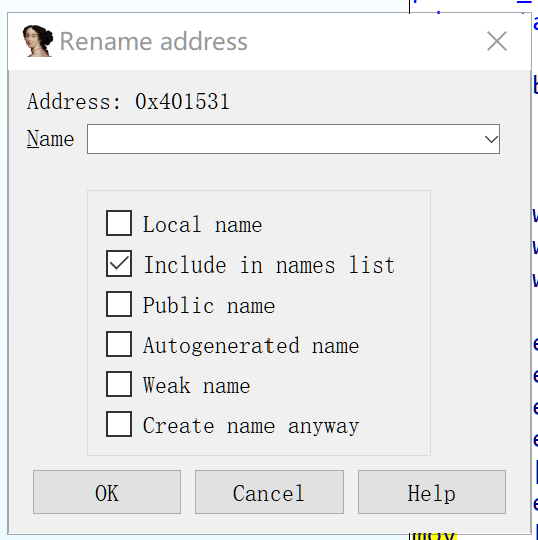
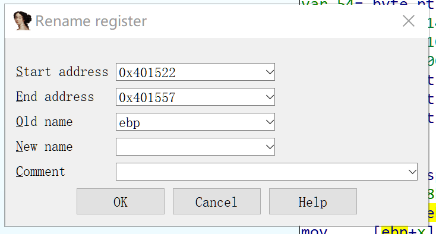
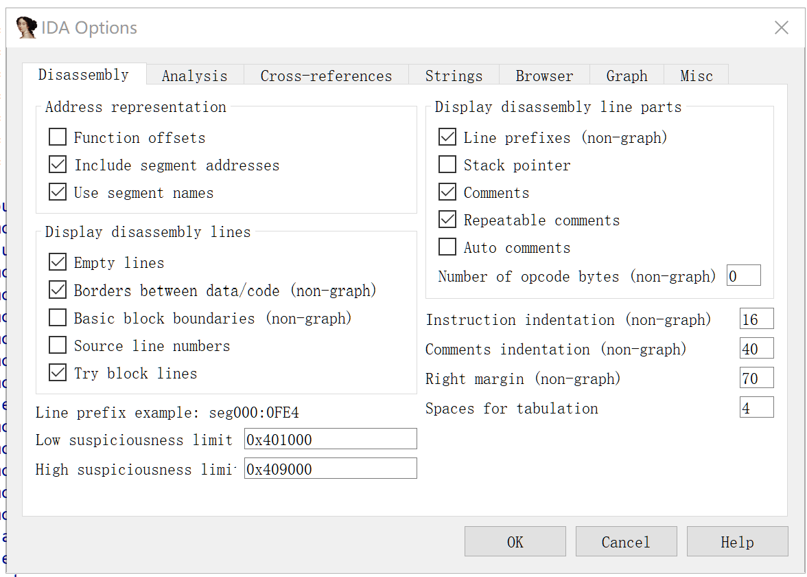
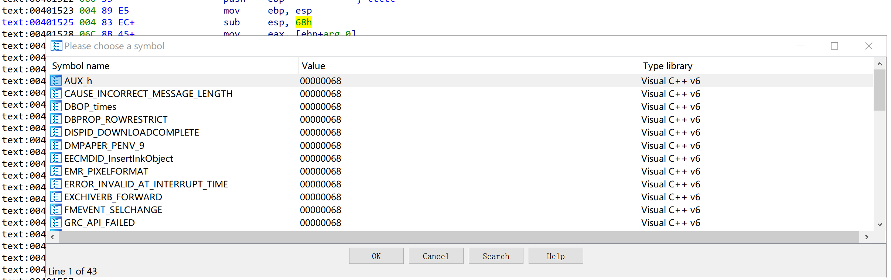
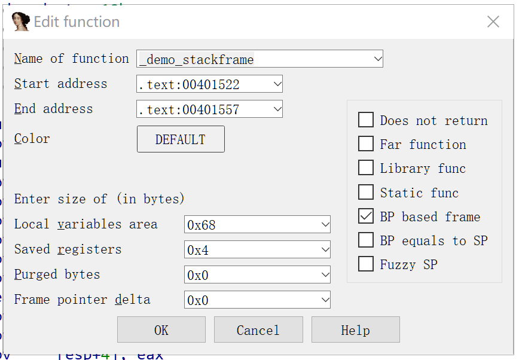

# IDA Pro 基本使用02

IDA Pro在读取一次原文件并建立好数据库后，不会再读取原文件。为了更好的理解反汇编代码，我们需要对这个数据库做一些编辑。IDA Pro会帮助我们将改变扩展的数据库各个角落，保持各方面的一致性。

注意：IDA Pro 不提供撤销功能，所以修改数据库之后要保存一定的副本。

## 反汇编操作

### Names
分析程序时，最常用的方法是将反汇编工具提供的默认命名改为更有意义的命名。IDA pro 中使用 “N” 键或右键rename 即可。如果需要复原，则删掉自定义名称后会复原。

IDA pro 有几类Names：
- 与虚拟地址相关的名称
- 与栈变量相关的名称
- 寄存器名称

IDA pro 会自动给已经识别出的上两类进行命名（称为哑名）。名称的最大程度在配置文件 cfg/ida.cfg 中定义。

在给虚拟地址命名时，按下N会弹出重命名对话框，里面有几个选项.



下面说明一下：
- local name 表示该命名仅限于当前函数，名称的唯一性在给定函数内有效。在函数边界以外（不属于任何函数）的位置不能选这个选项，例如函数及全部变量。最常用于为函数中的跳转目标提供符号名称，例如分支控制结构。
- include in names list：讲一个名称添加到 Names 窗口（shift + F4），一般自动生成的哑名不在Names window中。
- Public name：公共名称指由二进制文件输出的名称。使用这个选项，会强制某个name为公共名称。名称窗口中有一列属性即为Public。
- Autogeneated name：自动生成名称属性不会产生明显影响。
- weak name：这是公共名称/符号的一种特殊形式，只有没有找到相同名称的公共符号来充血时才使用弱符号。
- create name anyway ： 表示若遇到重名情况，则在名字后追加一个数字。

IDA pro 运行修改寄存器名称。



### 注释

在数据库中嵌入注释，也是分析反汇编清单时常用的操作。

IDA pro有下列几种注释：
- 常规注释 ： 使用冒号（：）可打开对话框。可以跨多行，以蓝色显示。
- 可重复注释 ： 使用分号（；）可打开输入框。这种注释常用于被调用的函数或语句，被引用的位置的注释是蓝色的，引用它的地方显示灰色。
- 前注释和后注释：是指在某个指定反汇编行前/后的全行注释，它们是不加分号为前缀的。
- 函数注释：在函数前面以分号开头的注释（自动生成）是函数注释。要添加函数注释，先要选中/高亮函数名称，然后键入“ ：或；”后输入注释。

### 基本代码转换

如果分析的文件类型与常见编译器生成的二进制文件相差较大（IDA pro不能很好地分析），那么反汇编输出的代码你可能不满意，需要对反汇编分析和显示过程进行调整。

IDA 提供的转换可有下列类型：
- 将数据转换为代码
- 将代码转换为数据
- 制定一个指令序列为常数
- 更改现有函数的起始或结束地址
- 更改指令操作数的显示格式

在IDA pro Options-General-Disassembly中可以看到反汇编的各种选项：



说明：
- line prefixes：指反汇编行 section：address 部分
- stack pointer：勾选后，与堆栈指针相关的语句行前会出现堆栈指针偏移量。
- Bad instructions <BAD> marks: 表示处理器认为合法但一些汇编器可能无法识别的指令（未计入文档的CPU指令），IDA 会将这类指令作为数据字节序列进行反汇编。高版本的IDApro里似乎去掉了这个选项。
- number of opcode bytes ：操作码字节数。对于指令字节数大小不固定的指令（如x86指令），其指令大小会从1bytes到十几bytes不等，这个选项指的是为每个指令的显示预留的行内空间，过长的指令超过这个限度就无法完整显示。会使用+表示。0表示不限制都显示。

上面这些选项的全局设置中配置文件 cfg/ida.cfg中。
#### 格式化指令操作数

IDA pro可以改变默认的指令中整型常量的表现格式。这些常量可能是：
- 相对偏移量
- 全局变量的绝对地址
- 算术运算值
- 程序员定义的常量

为了使其更可读，可能要用符号来代替它们，又或者使用10进制而不是16进制表示。

IDA pro维护了大量的C标准库、windows API中定义的枚举常量（例如头文件中使用#define定义的那些常量），可以使用常量值上下文菜单的 Use standard symbolic constant（使用标准符号常量）选项来访问这些常量。例如下面例子



通过这种方法，会使我们后续分析免去查找标准库手册，非常方便。

#### 操作函数

一些函数无法被idap定位，例如没有直接的调用/引用，就没法识别它们或者无法识别函数结束部分：编译器将函数分割到了几个地址范围；或者优化代码的编译器将几个函数的共同结束序列放在一起，这些情况都使idapro这样的反汇编工具无法确定函数结尾。

可以使用手动方式执行下列函数操作：
- 新建函数：在某个不属于其他函数的现有指令或未被IDA以其他方式定义的原始数据字节处创建。Edit-Functions-Create Function即可创建新函数。idapro会向前扫描，分析结构，搜索返回语句。如果能够识别函数结束部分就生成一个新的函数名、分析栈帧、以函数形式重组代码，如果没有发现函数结束部分，则此新建操作失败。
- 删除函数：dit-Functions-Delete Function命令。
- 函数块：微软VC++编译器生成的代码中，经常可找到函数块。如果idapro无法自动发现每个函数块，可以使用 dit-Functions-Append Function Tail 命令，从已定义的函数列表中选择该函数的父函数。IDApro将函数块（Chrunk）叫（Tail）。
- 编辑函数：在函数名或内部可以使用 Alt+P可以打开编辑函数窗口。


**函数块**：编译器移动不常执行的代码段，用以将经常执行的代码段“挤入”不大可能被患处的内存页，由此产生了函数块。如果一个函数以这种方式被分割，IDA通常会跟踪指向每个块的跳转，尝试定位所有相关块。多数情况下，IDA能找到所有这些块，并在函数的头部列出每一个块。例如：

```s
.text:004037AE ChunkedFunc proc near
.text:004037AE 
.text:004037AE var_420 = dword ptr -420h
...
.text:004037AE ; FUNCTION CHUNK AT .text:004040D7 SIZE 00000011 BYTES
.text:004037AE ; FUNCTION CHUNK AT .text:004129ED SIZE 0000000A BYTES
```

**编辑函数窗口中的选项/参数**：


- local variables area：表示局部变量专用的栈字节数。idapro会自动根据栈指针行为，自动计算这个值。
- saved registers：为调用方保存寄存器所使用的字节数。即放在栈帧里返回地址顶部的若干字节的字节数。
- purged bytes：已删除字节表示当函数返回调用方时，IDA从栈中删除的参数的字节数。对于 cdecl 调用约定的函数，这个值始终为0（因为被调用者不负责这部分）；对于stdcall函数，这个值表示传递到栈上的所有参数所占的空间。在x86中，如果ida观察到了 ret n，则自动确定这个值。
- frame pointer delta：编译器有时会对栈指针进行调整，使其指向局部变量区域的中间，而不是底部。这个调整距离称为增量（delta）。这样做的目的是使用一个字节（-128～+127）代替2个字节（0～+255）做偏移量，计算速度更快。
- Does not return：函数不返回到它的调用方。这样的函数，在调用后，函数不会再继续执行。
- far function：用于在分段体系结构（CPU内存管理概念）上将一个函数标记为远函数。调用它时需要一个段基地址+一个段内偏移量。
- library func：这个属性将一个函数标记为库函数。库函数可能包括静态链接库中的编译器或函数所包含的支持例程。标记后会以库函数颜色显示（青色）。
- static func：会使函数特性列表中以static标示。
  - 函数窗口的属性列表有：RFLBT，其中的S表示Static；B表示使用堆栈指针；R表示有返回语句；L表示库函数。F表示远函数。
- BP based frame：基于BP指针进行栈帧操作，这一点是通过分析函数序言部分判断的。如果手动选中这个选项，那么一定要手动修改local variables area（根据保存的栈指针的大小减小）和saved registers（根据保存的栈指针大小增大）的大小，这两项根据分析函数内部过程确定。
- BP equals to SP：如果一个函数将栈指针配置为在进入一个函数时，执向栈帧的顶端，此时应设置该选项。它等同于将 frame pointer delta 设置为local variables area 大小。
- Fuzzy SP：