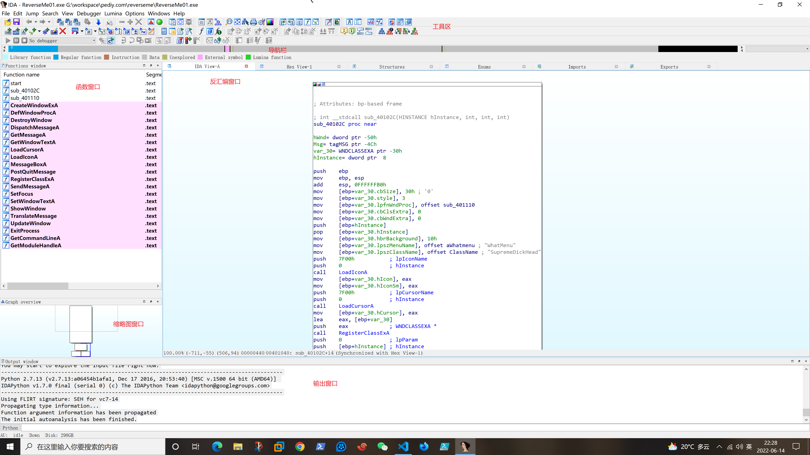
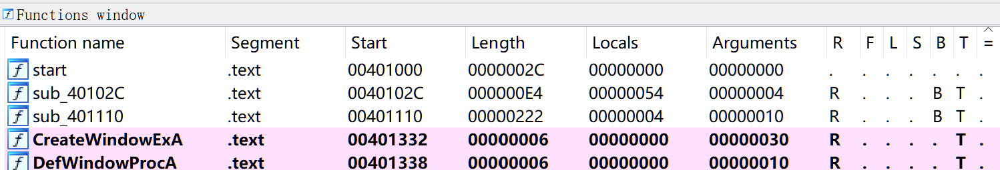
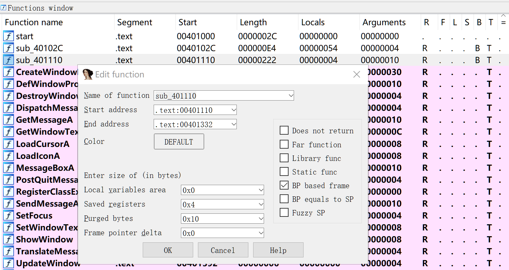
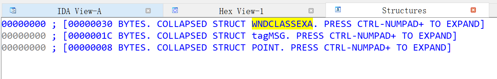
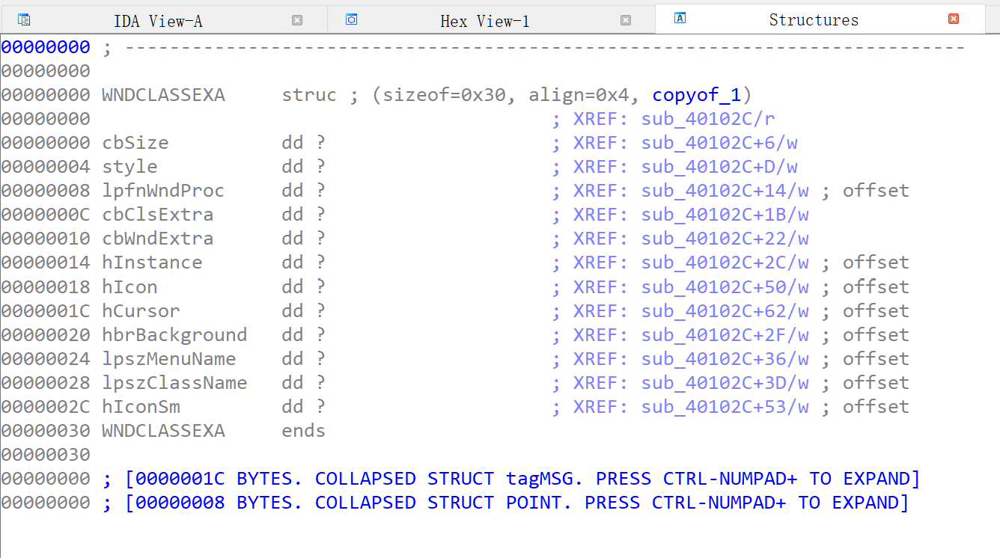
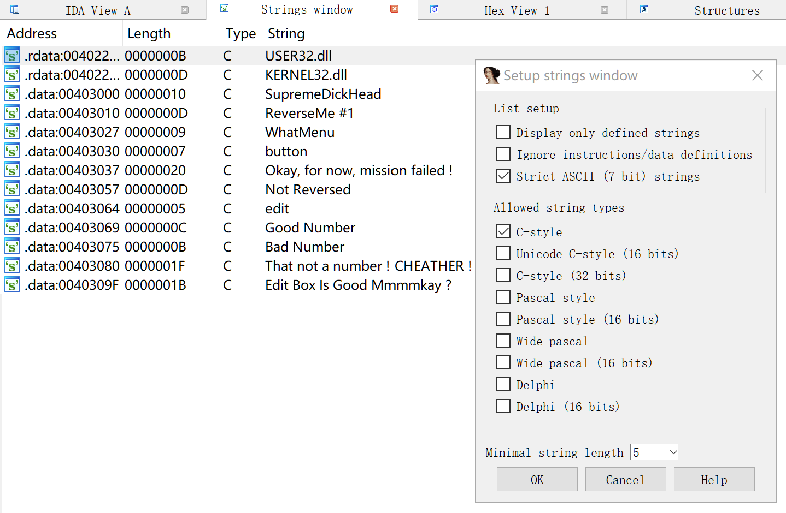
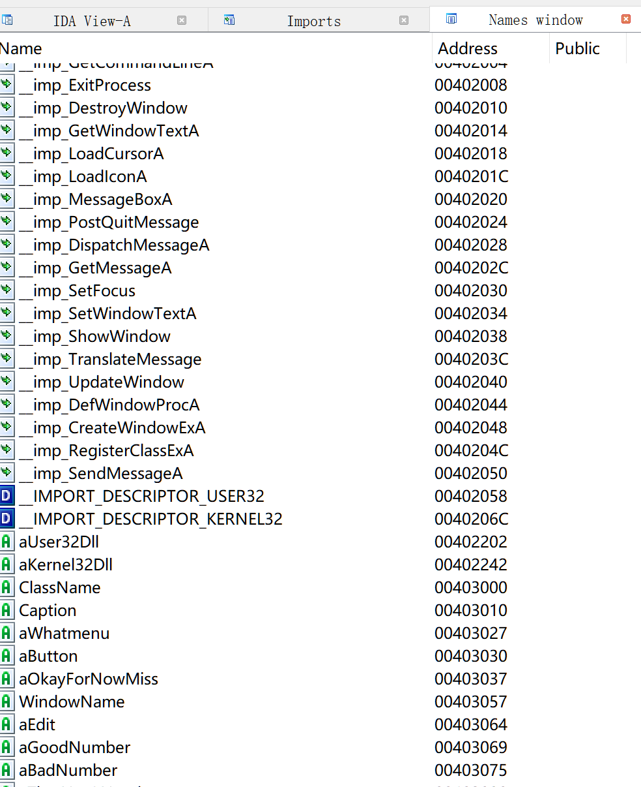
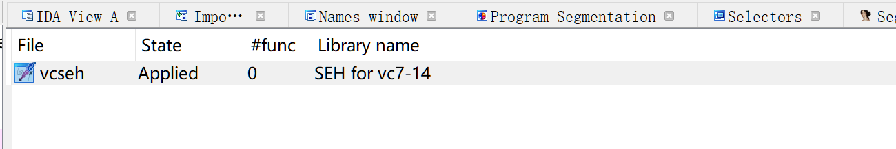
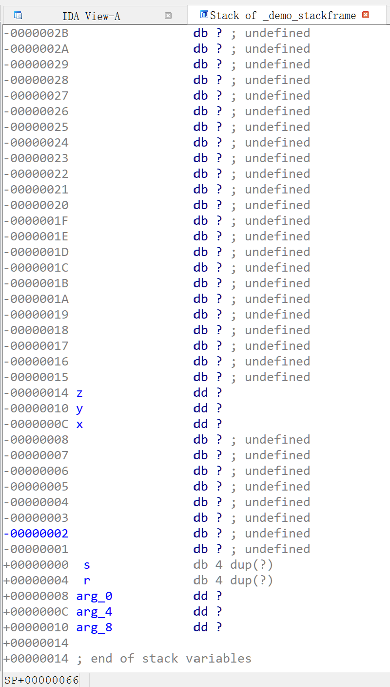

# IDA Pro
梯度下降算法为基础的交互式反汇编工具。


## 目录结构

为了升级IDA pro的高级功能，需要理解它的目录结构。

- cfg 目录，包含了各种配置文件。
  - ida基本配置文件 ida.cfg
  - GUI 配置文件 idagui.cfg
  - 文本模式用户界面配置文件 idatui.cfg

- idc 目录，包含了IDA 的内置脚本语言 IDC 所需的核心文件。
- ids 目录，包含了一些符号文件（ida语法中的ids文件）。
  - 这些文件用于描述可被加载到ida的二进制文件引用的共享库的内容。
  - 包含摘要信息，列出由一个指定库到处的所有项目，包含了描述某个函数所需的参数类型和数量的心、函数的返回地址与该函数调用约定有关的心。
- loaders 目录，包含了文件加载过程中用于识别和解析 PE 或 ELF 等已知文件格式的IDA扩展。
- plugins 目录，包含专门的插件。
- procs 目录，包含已经安装的支持的处理器模块。
  - 处理器模块为ida提供机器语言-汇编语言转换功能，并生成显示。
- sig 目录，包含IDA在各种模式匹配操作中利用的现有代码的签名。
  - 通过模式匹配，ida能够将代码序列确定为已知的库代码，从而节省大量分析时间。
  - 这些签名由ida的快速的库识别和鉴定技术（FLIRT）生成。
- til 目录，包含一些类型库信息。
  - IDA 通过这些信息记录特定于各种编译器库的数据结构的布局。

## 文件加载

IDA 加载文件是比较重要的步骤，涉及下列几个问题：
- 使用何种加载器（ldw）分析文件
- 处理器类型
- 处理器选项
- 加载段、加载偏移
- kernel analysis option1、2、3
- 其他选项
  - 加载选项
  - fill segment gaps
  - load resources
  - manual load
  - rename DLL entries

IDA 会对即将打开的文件生成一个可能的文件类型列表，列表中显示了最适合处理的加载器，例如：
- protable execute for 80386 PE （PE.dll)
- protable execute for  PE64
- MS-DOS executable
- Binary file，这种加载方式下，ida无法提取任何内存布局结构信息。
- ELF
- ELF64


处理器类型由诸多选择，默认是一个ida的metapc（反汇编所有的操作码）。通常IDA会分析合适的处理器，但是嵌入式系统分析则不一定能够识别，需要手动。

### 主要的芯片类型包括：
- ALPHA
- AMD
- AnalogAngstre
- Argonaut
- Atmel
- Cavium
- DEC
- Dalvik
- DSP group
- EFI
- Freescale
- Fujitsu
- Gameboy
- Hitachi
- Infineon
- Intel
- Java
- MIPS
- MOS
- Microchip
- Mitsubishi
- Motorola
- NEC
- Renesas
- PA-RISC
- PICxx
- SGS
- SPARC
- Samsung
- Siemens
- Sony
- TI
- Zilog

### Loading segment 和 Loading offset
Loading segment 和 Loading offset 这两个选项在选择加载器为 “Binary file” 且 Process type 为“MetaPC” 时激活，用于手动设定将要导入的段（或认为是文件结构块）基址和段内偏移量。打开文件后，还可以在 edit-segments-rebase program中查看基址。
### kernel options
反汇编过程是一个复杂的过程，其中的一些设置可以通过 kernel options 设定，改进递归下降过程。绝大多数情况，不需要改动。

#### Kernel options 1

- 

### Process options
Process options 可以选择适用于选中Process Type的一些配置信息。只能为反汇编过程提供有限帮助，非常依赖用户选定的处理器模块，以及模块创建者的编程能力。

### Options
Options 用于帮助用户更好地控制文件加载过程。

### 加载过程
点击OK关闭对话框后，才真正开始加载文件。用户可能还要输入一些额外的信息，以完成加载过程。例如：
- 使用 PDB 调试信息创建的 PE 文件。如果 ida 发现一个 pdb 文件（Program Database），她会显示下列消息：“IDA pro 已经确认输入文件链接有调试信息，你希望在本地符号存储去及microsoft symbol server 中寻找相应的pdb 文件么？”
- 分析恶意代码等模糊程序（被加壳或混淆）时候，加载器也会生成一些信息。模糊技术并不严格遵循文件格式规范，如果加载器希望处理结构完整的文件，这是就会造成问题。为此，PE 加载器会对导入表进行某种形式的验证，如果发现导入表没有根据约定进行格式化，ida 将显示下列消息：“导入的文件似乎遭到破坏。这说明该文件可能被压缩或巾帼修改，以阻止人们对其分析，如果你希望看到原始的导入文件，请取消选择 make imports section复选框，重新加载文件”

### IDA 数据库

IDA加载文件后，会形成一些分析记录文件，称为IDA数据库文件，主要有4个：
- .id0：二叉树数据库；
- .id1：包含描述每个程序字节的标记；
- .nam：包含与IDA 的 Names 窗口中显示的给定程序位置有关系的索引信息；
- .til：用于存储与一个给定数据库的本地类型定义有关的信息。

这些文件在IDA之外很难编辑。关闭项目时，可以将他们压缩为一个 idb 文件。人们常说的 ida 数据库其实是 idb 文件。

IDA 一旦创建了某个已加载文件的数据库，它就不再需要访问这个可执行文件了。除非想用ida集成的调试器调试这个可执行文件本身。这是一种安全特性，目前还没有见到利用 ida 数据库作为恶意软件的攻击向量。

本质上看，IDA 是一个数据库应用程序。分析可执行文件时，它自动创建和填充新的数据库，它提供的各种显示不过是数据库视图。IDA 强大之处在于，它包含各种可用于分析和操作数据库数据的工具。

### 创建 ida 数据库
这里涉及的模块有：
- 加载器
- 反汇编引擎
- 处理器模块

选定一个可执行文件并指定选项后，IDA 将开始创建数据库。IDA 的控制权将交给选定的加载器模块，主要工作包括：
- 从磁盘加载文件
- 解析它能够识别的任何文件头信息
- 选定一种合适的虚拟内存布局
- 对数据库进行配置
- 创建各种包含代码或数据的程序块
- 确定特定代码入口点
- 将控制权返还ida

这样看，IDA 加载器类似 OS 加载器。

加载完成后，IDA 的反汇编引擎接管控制权，一次穿一个地址给选定的处理器模块。

处理器模块的工作包括：
- 确定位于改地址的指令的类型、长度
- 从这个地址继续执行指令的位置（顺序、分支）
- 是否已经找到所有指令，若是则第二遍遍历指令列表
- 将每个指令转换为汇编语言并显示

之后，IDA 还会做额外的分析，以提取其他可能对人们有用的信息。在ida完成初步分析后，人可能会在数据库中发现下列信息：
- 编译器识别。
  - 这可以帮助我们了解二进制文件使用的函数调用约定；以及确定该二进制链接到哪些库。
  - 如果 IDA 能确定编译器，那么可以在输入文件中扫描该编译器使用的样本代码序列，然后将这些代码以彩色显示，以减少需要分析的代码数量。
- 函数参数和局部变量识别。
  - 对于每个已识别函数（其地址是某个指令的调用目标），IDA 会详细分析栈指针寄存器的行为，用于确定栈内的变量，并了解函数栈帧的布局。
  - 之后，IDA 会根据这些变量的用途（或为局部变量、或为参数）为他们自动命名；
- 数据类型信息
  - 利用对公共库函数及所需参数的了解，IDA 会在数据库中添加注释，指明这些函数提交参数的位置；
  - 这需要查阅各种api文档，大幅减少了人员时间。

### 关闭数据库
在关闭IDA 或打开新文件时，都会显示一个save database 对话框。

如果是第一次，ida 会用扩展名idb替换输入文件的扩展名。
- don't pack database 这个选项仅刷新4个数据库文件的更改，关闭桌面前部创建idb。不建议使用
- pack database（store） 打包数据库，但不压缩。创建idb后，4个数据库文件就会被删除。
- pack database（deflate）打包数据库，压缩。
- collect garbage 收集垃圾。这时会在关闭数据库前从数据库中删除无用的内存页面。

### 重新打开数据库
注意，IDA 经常会崩溃。为了防止这个问题，建议及时保存数据库。

IDA 所提供的数据库修复，不一定好用。

### FLIRT Signature File Database

Fast Library Identification and Recognition Technology , FLIRT 是IDA的内部符号识别器，可以搜索反汇编代码以定位、重命名和高亮显示已知的库程序。

参考：https://www.hex-rays.com/products/ida/tech/flirt/index.shtml

### 小结

整个文件的加载过程，可以从ida pro的界面下方的“output window”的每行记录中得到，下面就是一个例子：

```
The database has been successfully repaired.

  bytes   pages size description
--------- ----- ---- --------------------------------------------
   262144    32 8192 allocating memory for b-tree...
$ F40102C.var_4C: incorrect back reference '$ F40102C.Msg'
$ F401110.arg_0: incorrect back reference '$ F401110.hWndParent'
$ F401110.arg_4: incorrect back reference '$ F401110.Msg'
$ F401110.arg_8: incorrect back reference '$ F401110.wParam'
$ F401110.arg_C: incorrect back reference '$ F401110.lParam'
Caption: incorrect back reference 'aReverseme1'
ClassName: incorrect back reference 'aSupremedickhea'
GetWindowTextA: no back reference
MessageBoxA: no back reference
String: incorrect back reference 'aEditBoxIsGoodM'
Text: no back reference
WindowName: incorrect back reference 'aNotReversed'
__imp_GetWindowTextA: incorrect back reference 'GetWindowTextA'
__imp_MessageBoxA: incorrect back reference 'MessageBoxA'
aGoodNumber: no back reference
aOkayForNowMiss: no back reference
aThatNotANumber: no back reference
hInstance: no back reference
hWnd: no back reference
found nodes in the privrange above the maxnode...fixed
    65536     8 8192 allocating memory for virtual array...
   262144    32 8192 allocating memory for name pointers...
-----------------------------------------------------------------
   589824            total memory allocated

402250: sparse storage: incorrect flag value: 100 - fixed
Loading processor module F:\IDA 7.2\procs\pc.dll for metapc...OK
Loading type libraries...
Autoanalysis subsystem has been initialized.
Database for file 'ReverseMe01.exe' has been loaded.
-----------------------------------------------------------------------------------------
Python 2.7.13 (v2.7.13:a06454b1afa1, Dec 17 2016, 20:53:40) [MSC v.1500 64 bit (AMD64)] 
IDAPython v1.7.0 final (serial 0) (c) The IDAPython Team <idapython@googlegroups.com>
-----------------------------------------------------------------------------------------
Using FLIRT signature: SEH for vc7-14
Propagating type information...
Function argument information has been propagated
The initial autoanalysis has been finished.
Caching 'Functions window'... ok
Flushing buffers, please wait...ok
Unloading IDP module F:\IDA 7.2\procs\pc.dll...
Possible file format: MS-DOS executable (EXE) (F:\IDA 7.2\loaders\dos.dll)
Possible file format: Portable executable for 80386 (PE) (F:\IDA 7.2\loaders\pe.dll)

  bytes   pages size description
--------- ----- ---- --------------------------------------------
   262144    32 8192 allocating memory for b-tree...
    65536     8 8192 allocating memory for virtual array...
   262144    32 8192 allocating memory for name pointers...
-----------------------------------------------------------------
   589824            total memory allocated

Loading file 'G:\workspace\pediy.com\reverseme\ReverseMe01.exe' into database...
Detected file format: Portable executable for 80386 (PE)
Loading processor module F:\IDA 7.2\procs\pc.dll for metapc...OK
Autoanalysis subsystem has been initialized.
Assuming __cdecl calling convention by default
  0. Creating a new segment  (00401000-00402000) ... ... OK
  1. Creating a new segment  (00402000-00403000) ... ... OK
  2. Creating a new segment  (00403000-00404000) ... ... OK
Reading imports directory...
  3. Creating a new segment  (00402058-00403000) ... ... OK
Assuming __cdecl calling convention by default
Type library 'mssdk' loaded. Applying types...
Types applied to 20 names.
Plan  FLIRT signature: SEH for vc7-14
Marking typical code sequences...
Flushing buffers, please wait...ok
File 'G:\workspace\pediy.com\reverseme\ReverseMe01.exe' has been successfully loaded into the database.
IDA is analysing the input file...
You may start to explore the input file right now.
-----------------------------------------------------------------------------------------
Python 2.7.13 (v2.7.13:a06454b1afa1, Dec 17 2016, 20:53:40) [MSC v.1500 64 bit (AMD64)] 
IDAPython v1.7.0 final (serial 0) (c) The IDAPython Team <idapython@googlegroups.com>
-----------------------------------------------------------------------------------------
Using FLIRT signature: SEH for vc7-14
Propagating type information...
Function argument information has been propagated
The initial autoanalysis has been finished.
```
## IDA Pro 界面



简要介绍几个窗口
### 导航栏

被加载文件地址空间的线性视图。默认情况下，会呈现二进制文件的整个地址范围。不同颜色表示不同的内容分布。

### 反汇编窗

可以图形或文本方式显示某个函数的指令构成。
- 图形方式显示时，显示了函数块之间的各种流。Yes边的箭头默认为绿色；No边的箭头默认为红色；顺序流默认为蓝色。注意，图形方式时，可以设置平移、重新调整块位置、分组和堆叠块（选中几个块，右键选group node）
- 可以创建新的反汇编窗口，以便观察。

### 函数窗口

列举了每一个ida pro识别出的函数，并给以命名。
- 下图所示的函数窗口，segment表示函数所在的节
- 后面的start，length表示起始虚拟地址值和字节长度
- locals表示本地变量
- arguments 表示参数
- R表示返回调用方
- B表示用EBP引用它的局部变量






### Hex View-1 

多种进制、多种编码、多种字节长度的原始内容显示窗口

### Structures 窗口

用于显示IDA发现、判断出的复杂数据结构，为标准数据结果的布局提供参考；也为用户提供一种方法，在发现自定义结构时，建立自己的分析结构。

在分析阶段，IDA会查询它的函数类型签名库，设法将函数的参数类型与程序使用的内存匹配起来。

下图显示出，ida pro 判断出程序中使用了 WNDCLASSEXA、tagMSG、POINT 3个结构。


IDA Pro 为什么会得到上述结论？
原因之一：ida 发现程序使用了相关函数调用。双击这个结构体，ida会展开该结构，可以看到详细内存布局，包括每个字段的名称和大小，以及交叉引用。



### Enums 枚举窗口

与结构体类似，如果ida检测到了枚举数据类型（C enum），它将枚举内容列在枚举窗口中。

可以使用枚举类型替换整量常数，提供可读性。

### Imports 窗口
列出了被分析二进制文件导入的所有函数。

- 只有在二进制文件用了共享库时，IDA才需要用到imports 窗口。
- 静态链接的二进制文件不存在外部依赖关系，因此不需要导入内容。
- 导入窗口仅显示动态加载器自动处理的符号，二进制文件使用 dlopen、dlsym 或 LoadLibrary 、GetProcAddress 等机制自行加载的符号将不会在导入窗口中显示。
- 导入窗口的每一行，列出一个导入项目（函数或数据）的名称，以及包含该项目的库名称。
- 每一行还列出了导入表条目的虚拟地址

这个功能与下列功能类似：
- objdump -T
- readelf -s
- dumpbin /imports

### Exports 窗口
列出了文件的入口点，以及由当前文件导出给其他文件使用的函数和变量。

- 导出的项目按照名称、虚拟地址、序数排列
- 可执行文件中至少包含一个内容：程序的执行入口点，ida pro 称其为 start


这个功能与下列功能类似：
- objdump -T
- readelf -s
- dumpbin /exports

### Strings 窗口

功能相当于 strings 工具，用于从二进制文件中显示一些字符串、所在虚拟地址。

IDA 每次打开strings都会重新扫描整个二进制文件，提取字符串。

ida 默认扫描的字符串类型为至少包括5个字符的C风格、以null结尾的7位ASCII 字符串。




在右键点击后选择setup，会弹出上面的窗口。

- Display only defined strings 仅显示已定义的字符串（ida pro 自动创建或用户手工创建的字符串）。如果点了这个选项，并禁用其他选项，那么idapro就不会扫描其他类型的字符串。
- ignore instructions/data definitions 忽略指令、数据定义。这个选项会使ida 扫描指令和现有数据定义中的字符串。可能会错误的把指令转换为字符串，会导致很多垃圾字符串。
- 其他选项，可以适配不同的字符格式。
### Names 窗口

简要列举了二进制文件中的所有全局名称。名称是一个程序虚拟地址的符号描述。




最前面的颜色编码表示：
- F，表示常规函数
- L，表示库函数，有代码。
- I，导入的名称，有的也用箭头表示。与库的区别在于，这类函数没有代码。
- C，命名代码。ida认为他们不属于任何函数，但已经命名
- D，数据，已命名数据位置通常是全局变量
- A，字符串数据


ida 中有些约定命名前缀
- sub_xxx: 地址在xxx的子程序、函数
- loc_xxx: 地址xxx处的一个指令
- byte_xxx: 地址xxx处的一个8位数据
- word_xxx: 地址xxx处的一个16位数据
- dword_xxx: 地址xxx处的一个32位数据
- unk_xxx: 地址xxx处的一个大小未知位数据

- __imp_xxx: 一个导入名


### segment window

显示二进制文件中出现的段（segment）的简要列表。segment 也称为节（section），不要将这个段和内存分段中的段混淆。

右键一个条目，可以显示一个上下文菜单，可以选择添加、删除、编辑现有段，对于非标准格式的代码，这些功能比较有用。

例如被混淆过的代码。

### Signature 窗口

IDA 使用庞大的签名库来识别已加载代码块。签名用于：
- 识别由编译器生成的常用启动项顺序
- 确定可能已被用来构建二进制文件的编译器
- 将函数划归为由编译器插入的已知库函数
- 或因为静态链接而添加到二级制代码中的函数




上面的例子，显示程序被vcseh签名，可以查看 IDADIR/sigs 目录，里面存放的是二进制的签名文件。上面的0 表示已经将0 个函数识别为库函数。有时这个数字不是0，那么表示不需要对这n个函数进行逆向分析。

至少两种情况下，需要知道对二进制文件应用其他签名：
- 1.IDA pro 无法识别用于构建二进制文件的编译器，因而无法选择所需的相应签名。这时要自己分析，确认应当让ida尝试的签名，并迫使ida使用一个或多个签名。
- 2.ida中没有某些库的现成的签名，那么你要自己建立签名。DataRescue工具提供了一个工具包，可以用于生成ida签名匹配引擎使用的签名。

### Types Library 窗口

与签名窗口类似，它保存了ida积累的一些信息，即ida从最常用的编译器头文件中收集到的有关预定义数据类型和函数原型信息。

通过处理头文件：
- IDA可以确定常用库函数所需的数据类型；
- 并为反汇编代码提供注释。
- 还可以从头文件中理解复杂的数据结构大小和布局

这些信息都放在 IDADIR/til 目录中。

### 问题窗口

显示了ida在反汇编过程中遇到的困难，以及它如何处理这些困难。

DECISION 类型的问题，通常表示ida决定将一个地址上的字节作为指令而不是数据进行反汇编，即使这个地址在递归下降指令遍历过程中从未被引用。

BOUNDS 类型问题，无法确定调用或跳转的目标（动态寄存器值），或者该目标明显不在程序的虚拟地址范围内。

## IDA pro 对反汇编内容的导航

IDA pro将二进制文件导入后，建立的反汇编列表文件是没有结构的，也称为死列表文件，通常对这类文件的导航需要借助 grep 等查找工具。

IDA pro 为了简化用户对反汇编内容的查找，设立了几种导航方式：
- 双击导航（利用名称导航）：根据二进制文件的符号表生成符号名称，或根据二进制引用位置（虚地址）自动生成名称，双击这些名称，可使反汇编窗口当前显示快速跳转到名称指代处。

- 跳转到地址（已知虚拟地址时可用）：使用快捷键 G 或 点击菜单Jump-Jump to Address，跳转到输入的名称或16进制地址值处。
- 导航历史记录。Ida pro 菜单Jump 下方有两个快捷箭头，表示的意思是 Jump to Previous 和 Jump to Next position ，这是历史记录的遍历快捷键。

## IDA pro 的栈视图

设有一段反汇编清单：

```s

.text:00401522 ; =============== S U B R O U T I N E =======================================
.text:00401522
.text:00401522 ; Attributes: bp-based frame
.text:00401522
.text:00401522                 public _demo_stackframe
.text:00401522 _demo_stackframe proc near              ; CODE XREF: _main+25↓p
.text:00401522
.text:00401522 var_54          = byte ptr -54h
.text:00401522 var_14          = dword ptr -14h
.text:00401522 var_10          = dword ptr -10h
.text:00401522 var_C           = dword ptr -0Ch
.text:00401522 arg_0           = dword ptr  8
.text:00401522 arg_4           = dword ptr  0Ch
.text:00401522 arg_8           = dword ptr  10h
.text:00401522
.text:00401522                 push    ebp
.text:00401523                 mov     ebp, esp
.text:00401525                 sub     esp, 68h
.text:00401528                 mov     eax, [ebp+arg_0]
.text:0040152B                 mov     [ebp+var_C], eax
.text:0040152E                 mov     eax, [ebp+arg_4]
.text:00401531                 mov     [ebp+var_10], eax
.text:00401534                 mov     eax, [ebp+arg_8]
.text:00401537                 mov     [ebp+var_14], eax
.text:0040153A                 lea     eax, [ebp+var_54]
.text:0040153D                 mov     dword ptr [eax], 636261h
.text:00401543                 mov     eax, [ebp+var_10]
.text:00401546                 mov     [esp+4], eax
.text:0040154A                 mov     eax, [ebp+var_14]
.text:0040154D                 mov     [esp], eax
.text:00401550                 call    _bar
.text:00401555                 leave
.text:00401556                 retn
.text:00401556 _demo_stackframe endp
.text:00401556
.text:00401557
.text:00401557 ; =============== S U B R O U T I N E =======================================
.text:00401557
.text:00401557 ; Attributes: bp-based frame fuzzy-sp
.text:00401557
.text:00401557 ; int __cdecl main(int argc, const char **argv, const char **envp)
.text:00401557                 public _main
.text:00401557 _main           proc near               ; CODE XREF: ___tmainCRTStartup+25D↑p
.text:00401557
.text:00401557 argc            = dword ptr  8
.text:00401557 argv            = dword ptr  0Ch
.text:00401557 envp            = dword ptr  10h
.text:00401557
.text:00401557                 push    ebp
.text:00401558                 mov     ebp, esp
.text:0040155A                 and     esp, 0FFFFFFF0h
.text:0040155D                 sub     esp, 10h
.text:00401560                 call    ___main
.text:00401565                 mov     dword ptr [esp+8], 3
.text:0040156D                 mov     dword ptr [esp+4], 2
.text:00401575                 mov     dword ptr [esp], 1
.text:0040157C                 call    _demo_stackframe
.text:00401581                 leave
.text:00401582                 retn
.text:00401582 _main           endp
```

函数_demo_stackframe内的简要的栈视图为：


.text:00401522 var_54          = byte ptr -54h
.text:00401522 var_14          = dword ptr -14h
.text:00401522 var_10          = dword ptr -10h
.text:00401522 var_C           = dword ptr -0Ch
.text:00401522 arg_0           = dword ptr  8
.text:00401522 arg_4           = dword ptr  0Ch
.text:00401522 arg_8           = dword ptr  10h
.text:00401522

双击上面任一一个地址会进入ida pro的栈视图详情页，如图所示

