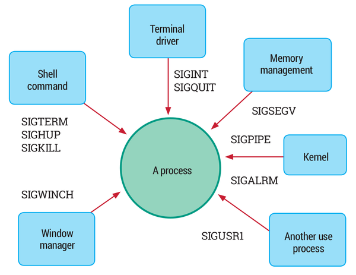
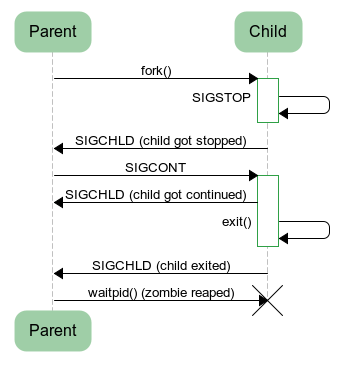
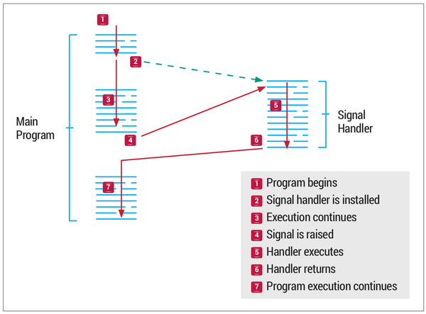
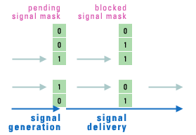

# Linux Signal

source: https://devopedia.org/linux-signals#:~:text=A%20signal%20is%20basically%20a%20one-way%20notification.%20A,In%20later%20Linux%20versions%2C%20real-time%20signals%20were%20added.



Linux 系统中有许多进程处在不同的状态，它们可能属于用户应用或OS，我们需要一种机制来协调它们的活动。实现这个目标的一种方式是当某些重要事情发生时，通知对方。一种简单轻量的通知方式就是我们说的 signals。

简单而言，一个 signal 是一个单向通知，它可以由 kernel 发给 process，或进程发给进程，或者进程发给自己。

查看 signal 的方法：

```sh
$ kill -l
 1) SIGHUP	 2) SIGINT	 3) SIGQUIT	 4) SIGILL
 5) SIGTRAP	 6) SIGABRT	 7) SIGEMT	 8) SIGFPE
 9) SIGKILL	10) SIGBUS	11) SIGSEGV	12) SIGSYS
13) SIGPIPE	14) SIGALRM	15) SIGTERM	16) SIGURG
17) SIGSTOP	18) SIGTSTP	19) SIGCONT	20) SIGCHLD
21) SIGTTIN	22) SIGTTOU	23) SIGIO	24) SIGXCPU
25) SIGXFSZ	26) SIGVTALRM	27) SIGPROF	28) SIGWINCH
29) SIGINFO	30) SIGUSR1	31) SIGUSR2
```

## Linux signal 

Linux 中有31个标准信号，编号为1～31.每个信号都命名为 SIG+后缀。

Linux 2.2之后，支持33种不同的实时信号，编号为 32～64，命名为 SIGRTMIN+后缀。

标准信号有特定含义，但SIGUSR1 和 SIGUSR2 的使用可以由应用程序定义，实时信号也由应用程序定义。

- Signal 0 ， POSIX.1 称为 null 信号，不常用，但 kill 函数将其用作特殊情况，没有信号发送，但它可用来检查进程是否存在（不可靠）
- SIGINT ，意味着 ctrl+c
- SIGSTOP ，意味着 ctrl+z
- SIGQUIT ，意味着 ctrl+\

使用信号的Linux 完全符合 POSIX，较新的应用使用 sigaction ，而不是传统的 signal 接口。

**正如硬件子系统可以中断 CPU（硬件中断），Signal 可以中断进程执行，所以信号也被视为一种软件中断。**

## 信号如何影响 linux 进程？



有些信号，用于终止接收信号的进程，例如：
- SIGHUP
- SIGINT
- SIGTERM
- SIGKILL

有些信号可zhong zhizhongzhi

## 信号不是类似于异常吗？
一些编程语言能够使用诸如try-throw-catch. 信号与异常不同。相反，失败的系统或库调用返回非零退出代码。当一个进程终止时，它的退出代码将是 128 加上信号号。例如，被 SIGKILL 杀死的进程将返回 137 (128+9)

## Linux 信号是同步的还是异步的？
当信号产生时，它们可以被认为是同步的或异步的。

同步信号是由于指令导致不可恢复的错误（例如非法地址访问）而出现的。这些信号被发送到导致它的线程。这些也称为陷阱，因为它们也会导致进入内核陷阱处理程序的陷阱。

异步信号在当前执行上下文之外。从另一个进程发送 SIGKILL 就是一个例子。这些也称为软件中断。



一个信号经过三个阶段：

- 1.Generation 生成：信号可以由内核或任何进程生成。无论谁生成信号，都将其发送给特定的进程。
  - 信号由其编号表示，没有额外的数据或参数。因此，信号是轻量级的。
  - 但是可以为 POSIX 实时信号传递额外的数据。
  - 可以生成信号的系统调用和函数包括raise、kill、killpg、pthread_kill、tgkill和sigqueue。
- 2.Delivery 投递: 一个信号被认为是待处理的，直到它被传递。
  - 通常，内核会尽快将信号传递给进程。但是，如果进程阻塞了信号，它将保持挂起直到解除阻塞。
- 3.Processing 处理：一旦信号被传递，它就会以多种方式之一进行处理。
  - 每个信号都有一个关联的默认操作：忽略信号；或终止进程，有时使用核心转储；或停止/继续该过程。
  - 对于非默认行为，可以调用 handler function 函数。具体功能是通过sigaction函数指定的。


## 如何理解阻塞和非阻塞信号这个概念？



信号会中断正常的程序执行流程，这可能是执行某些关键代码或更新数据时不希望见到的。Block（阻塞）解决了这个问题，这一降级（tradeoff）使得信号处理被延迟。

每个进程都可以指定它希望阻塞的某个信号，如果阻塞发生，OS将挂起该信号，知道进程不阻塞（关闭阻塞）后再投递这一信号。

当前被阻塞的信号集，被称为 signal mask。

某个信号被某个进程阻塞，不影响它被其他进程所接受。

Signal Mask 可以使用 sigprocmask 进行设置，或者 pthread_sigmask（多线程）进行设置。当一个进程有多个线程时，一个信号可能被每个线程所阻塞。

**信号 handler 是每线程不同的；信号 mask 是每线程不同的。**

## 每个进程可以挂起多个信号么？

一个进程可以挂起多个不同类型的信号，但同类信号只能挂起一次。因为 mask是按signal 按类型号设置的位掩码，每个类型的signal只有1位。

例如：可以同时挂起 SIGALRM 和 SIGTERM，但不能挂起两个 SIGALRM 信号。即使多次触发，该进程也只会收到一个 SIGALRM。

POSIX 没有指定标准信号的交付顺序，或者如果标准信号和实时信号都处于未决状态会发生什么。Linux 优先考虑标准信号。对于实时信号，编号较低的信号首先传送，如果有许多信号排队等待信号类型，则最早的信号首先传送。

## 示例代码

```c
// 改编自源代码：http ://www.firmcodes.com/signals-in-linux/ // 访问时间：2019-07-09 
 
// 示例显示了 SIGINT 的自定义处理程序
// 但处理程序恢复为默认操作未来的信号。
// 因此，第一个 ctrl+c 将允许程序继续
// 第二个 ctrl+c 将终止程序。

#include <unistd.h>
#include <stdio.h>
#include <signal.h>
 
void sig_handler1(int num)
{
	printf("You are here becoz of signal: %d\n", num);
	signal(SIGINT, SIG_DFL);
}
 
int main()
{
	signal(SIGINT, sig_handler1);
	while(1)
	{
		printf("Hello\n");
		sleep(2);
	}
}
```

## Further Reading

Kerrisk, Michael. 2008. "signal(7) - overview of signals." Linux Programmer's Manual, Linux Foundation. Accessed 2019-07-09.
Stevens, W. Richard and Stephen A. Rago. 2013. "Chapter 10: Signals." Advanced Programming in the UNIX® Environment, Third Edition, Addison-Wesley, Pearson Education, Inc. Accessed 2019-07-09.
Brown, Chris. 2015. "Core Technology: Signals." Linux Voice, November 18. Accessed 2019-07-09.