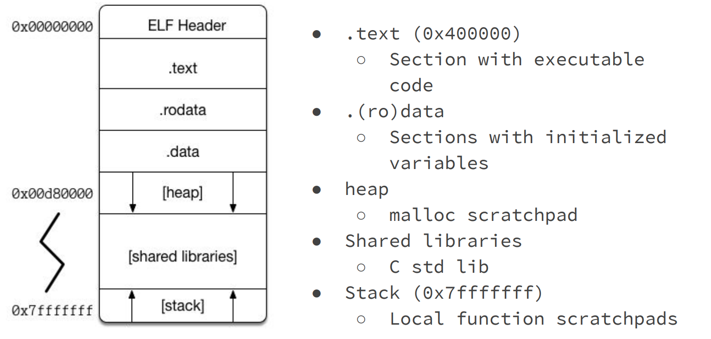
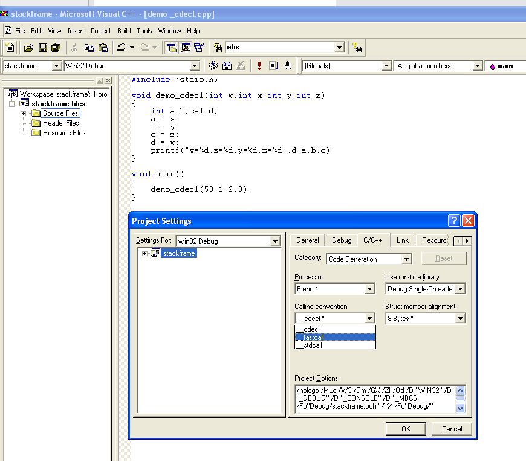

# 逆向分析 01

逆向分析在这里指的是对源文件进行编译链接后的结果——可执行文件进行分析。

例如有以下源文件 hello.c

```c
$ cat hello.c
#include <stdio.h>
#include <stdlib.h>

int main()
{
    printf("Hello, world!\n");
    exit(0);
}
```
通过 gcc 进行编译：`gcc hello.c -o hello`，得到 hello 这个可以执行文件。

```sh
$ gcc -o hello hello.c
$ ./hello
Hello, world!
```

逆向一个 binary 文件，首先要知道这个文件是什么结构的？例如：
- elf file for linux
- pe file for windows

在linux下，常用的文件信息分析工具有不少，例如：
- file
- strings
- xxd
- objdump
- readelf

在windows 下，也有一些分析工具：
- PE explorer
- dependecy walker
- fileinfo
## 指令集

对于嵌入式系统、PMDs等，通常使用精简指令集（ Reduced Instruction Set Computing，RISC），而x86集群、桌面系统等通常使用复杂指令集（ Complex Instruction Set Computing ，CISC）

### 两类汇编指令格式

有两种指令格式类型：Intel 和 AT&T
- Intel指令格式：`opcode dst, src`
- AT&T指令格式：`opcode src, dst`

例如：`objdump -Mintel -D ./hello |grep "main>:" -A 8`

每条指令执行后，会影响的内容（side effects）：
- CPU flags，例如 cmp、test、jump指令都会影响标准寄存器
- 内村 stack，例如 push、pop、call、leave、ret

指令执行顺序控制：
- call
- jump

## 内存和寄存器

### 内存
内存是存储程序运行时代码和数据的载体，没有内存，CPU无法独立工作。

内存存储数据或指令以字节为单位，而在大内存中寻找这些指令或数据需要某种依据，这个依据就是内存地址（address）。每个内粗字节都有一个地址。
- 对于 32 位系统，系统寻址空间为 $2^{32}$ 
  - 即 4,294,967,296 Bytes (4 Gibibytes) (approx. 4 Gigabytes)
  - 地址范围：0x00000000 - 0xffffffff
- 对于 64 位系统，系统寻址空间为 $2^{64}$ 
  - 即 18,446,744,073,709,551,616 Bytes (16 Exbibytes) (approx. 16 Exabytes)
  - 地址范围：0x0000000000000000 -0xffffffffffffffff

系统会为每个进程授予全地址空间（$2^{32}$ 或 $2^{64}$ 的虚拟地址空间），但实际上进程很少能用这么大的空间。



上图显示的是一个64位系统中可寻址内存的大致情况。

说明：
- .text 表示存放可执行代码的section/节
- .rodata/.data 表示存放初始化变量的section
- 所有的代码（.text）和数据都在 0x0 和 0xd80000 之间，大约14MB
- heap 表示 malloc（动态分配）的缓存内存区
- shared libraries 表示 C 的标准库所在的位置
- stack 表示本地/局部函数缓冲区。堆栈起食欲 0x7ffffffff，大约有2GB的空间用于 heap 和 stack 的增长。


### 寄存器

寄存器是CPU内部的高速存储单元，常见的寄存器有：
- rip 指令指针
- 通用寄存器
  - rax 累加寄存器
  - rbx 基数寄存器
  - rcx 计数寄存器
  - rdx 扩展寄存器
- 堆栈寄存器
  - rsp 堆栈指针
  - rbp 基址寄存器
- 数据/变址寄存器
  - rsi 原变址
  - rdi 目的变址
- 其他
  - r8～r15
- flags（标志寄存器）


寄存器的位数：
- rax 64bits
- eax 32b
- ax 16b
- ah 高8b
- al 低8b

系统调用（常见情况）：
- rax 系统调用数
- rdi arg0
- rsi arg1
- rdx arg2
- r10-r8-r9 ：arg3～arg5

## 汇编中函数的 prologue （前沿）和 epilogue（后记）


#### Syscalls（系统调用）：
- rax ：常用于存放系统调用数
- rdi ：常用于存放arg0
- rsi ：常用于存放arg1
- rdx ：常用于存放arg2
- r10-r9-r8 常用于存放 arg3，arg4，arg5 

#### 函数调用

- rax： 用于存放返回结果（ret value）
- rdi：用于存放arg0
- rsi：用于存放arg1
- rdx ：常用于存放arg2
- rcx-r9-r8 常用于存放 arg3，arg4，arg5 

#### call指令

`call <address>` 等同于依次执行下列两条指令:
-  `push rip+len(instruc)`
-  `jmp <address>`

#### 函数prologue
函数开头惯例指令序列(用于建立该函数的工作栈帧)：
- push rbp
- mov rbp，rsp
- sub rsp，0x20 


#### 函数epilogue
函数结束惯例指令序列(用于撤销该函数的工作栈帧,并返回调用处)：
- `leave` 等同于 `mov rsp, rbp` 和 `pop rbp`
- `ret` 等同于 `pop rip`


## 栈帧 stack frames

函数未被调用时，通常不占用内存，而调用时通常需要有内存存放参数和局部变量。

栈帧是在程序运行时分配的内存块，专门用于函数调用。编译器使用栈帧完成对传递参数、局部变量的存放并在函数调用返回时撤销栈帧，这一过程对开发者透明。通常，函数的返回地址也被存放在栈帧内。

下面是调用一个函数时的详细操作步骤：
- 1.调用方将被调用函数所需的所有参数放入该函数所采用的[调用约定](#调用约定)指定的位置。如果参数被放到运行时栈上，那么会导致程序的栈指针（xsp 或 xbp）变化。
- 2.调用方将控制权交给被调用函数，这个过程通常由调用指令执行（例如 x86 中的CALL 和MIPS的JAL），然后返回地址被保存到栈帧或cpu寄存器中。
- 3.如果有必要，被调用的函数会配置一个栈指针，保存调用方西方保持不变的任何寄存器值。（一般使xbp和xsp 配合）
- 4.被调用函数分配自己所需的局部变量空间，一般是通过栈指针来操作完成。
- 5.被调用函数执行函数体语句，可能会用到调用者传给他的参数，可能会产生一个结果，这个结果通常会被保存到一个寄存器中（例如xax）或其他特定寄存器中。
- 6.执行完函数体内语句后，存放局部变量的栈帧被释放，通常执行4.的逆操作。
- 7.如果调用者也要使用3.中的寄存器，那么需要对寄存器进行恢复。
- 8.被调用函数将控制权交给调用者，实现这一步的指令包括x86的RET和MIPS 的 JR。根据所使用的调用约定，这一操作可能会从程序栈中清除一个或多个参数。
- 9.调用者一旦获得控制权，可能需要删除栈中的参数，恢复栈到第1步之前的状况。

上面步骤中的第3、4步，即上文讲的[函数序言](#函数prologue)，第6、7、8步即函数的epilogue。


### 示例
下面以调用函数过程为例，介绍栈帧变化，分为几个阶段：
- call foo 之前的初始状态
- call foo 指令执行后
- 执行 foo prologue 语句
- 执行 foo epilogue 语句
- ret


#### 初始情况
假设有指令序列：

```S
0x00400597 e8aaffffff call 0x400546
0x0040059c bf00000000 mov edi, 0
0x004005a1 e89afeffff call sym.imp.exit
```

执行第一条 call 指令前，寄存器和堆栈值分别为：
- 寄存器：
rdi: 0x7ffe89cd1cc0 char* -> Hello, world!
rsp: 0x7ffe89cd1cc0
rbp: 0x7ffe89cd1cd0
rip: 0x00400597

- 堆栈：
0x7ffe89cd1cc0 = 0x77202c6f6c6c6548
0x7ffe89cd1cc8 = 0x00000021646c726f
0x7ffe89cd1cd0 = 0x00000000004005b0

#### 执行第一条 call 指令后
寄存器和堆栈值会发生变化（将call的下一条指令地址压入当前栈顶）：

- 寄存器变化
rdi: 0x7ffe89cd1cc0 char* -> Hello, world!
rsp: 0x7ffe89cd1cb8
rbp: 0x7ffe89cd1cd0
rip: 0x00400546

- 堆栈变化
0x7ffe89cd1cb8 0x000000000040059c
0x7ffe89cd1cc0 0x77202c6f6c6c6548
0x7ffe89cd1cc8 0x00000021646c726f
0x7ffe89cd1cd0 0x00000000004005b0

此时指令序列变为下列：
```S
0x00400546 55 push rbp
0x00400547 4889e5 mov rbp, rsp
0x0040054a 4883ec10 sub rsp, 0x10
0x0040054e 48897df8 mov qword [rbp - 8], rdi
0x00400552 488b45f8 mov rax, qword [rbp - 8]
0x00400556 4889c7 mov rdi, rax
0x00400559 e8d2feffff call sym.imp.puts
0x0040055e 90 nop
0x0040055f c9 leave
0x00400560 c3 ret
```
#### 执行函数 prologue 语句

执行 `0x00400546 55 push rbp` 后，变化如下：

寄存器变化：
rdi: 0x7ffe89cd1cc0 char* -> Hello, world!
rsp: 0x7ffe89cd1cb0
rbp: 0x7ffe89cd1cd0
rip: 0x00400547

堆栈变化：
0x7ffe89cd1cb0 0x00007ffe89cd1cd0
0x7ffe89cd1cb8 0x000000000040059c
0x7ffe89cd1cc0 0x77202c6f6c6c6548
0x7ffe89cd1cc8 0x00000021646c726f
0x7ffe89cd1cd0 0x00000000004005b0

可见push 操作会使: esp <= esp - 8; eip <= 下一条指令地址 ；ebp 不变。

执行`mov rbp,rsp` 会改变当前栈帧，由于上面几条语句 rsp 在不断变小（intel x86/amd64），所以当前栈帧从视觉上是上移了一块。

之后语句`sub rsp,0x10`会使 rsp 更小一些，那时此栈帧大小：

The size of stack frame = rbp-rsp

具体数值：
```S
● rdi: 0x7ffe89cd1cc0 char* -> Hello, world!
● rsp: 0x7ffe89cd1ca0
● rbp: 0x7ffe89cd1cb0
● rip: 0x0040054e

0x7ffe89cd1ca0 <uninitialized data>
0x7ffe89cd1ca8 <uninitialized data>
0x7ffe89cd1cb0 0x00007ffe89cd1cd0
0x7ffe89cd1cb8 0x000000000040059c
0x7ffe89cd1cc0 0x77202c6f6c6c6548
0x7ffe89cd1cc8 0x00000021646c726f
0x7ffe89cd1cd0 0x00000000004005b0
```

#### 执行函数结尾语句

```S
0x00400546 55 push rbp
0x00400547 4889e5 mov rbp, rsp
0x0040054a 4883ec10 sub rsp, 0x10
0x0040054e 48897df8 mov qword [rbp - 8], rdi
0x00400552 488b45f8 mov rax, qword [rbp - 8]
0x00400556 4889c7 mov rdi, rax
0x00400559 e8d2feffff call sym.imp.puts
0x0040055e 90 nop
0x0040055f c9 leave (mov rsp, rbp;pop rbp)
0x00400560 c3 ret 
```

跳过leave之前的语句，下面看看执行leave语句前的情况
```S
● rdi: 0x7ffe89cd1cc0 char* -> Hello, world!
● rsp: 0x7ffe89cd1ca0
● rbp: 0x7ffe89cd1cb0
● rip: 0x0040055f

0x7ffe89cd1ca0 <uninitialized data>
0x7ffe89cd1ca8 0x00007ffe89cd1cc0
0x7ffe89cd1cb0 0x00007ffe89cd1cd0
0x7ffe89cd1cb8 0x000000000040059c
0x7ffe89cd1cc0 0x77202c6f6c6c6548
0x7ffe89cd1cc8 0x00000021646c726f
0x7ffe89cd1cd0 0x00000000004005b0
```

执行leave语句，相当于两条指令：`mov rsp, rbp; pop rbp`。执行之后的具体变化：
```S
● rdi: 0x7ffe89cd1cc0 char* -> Hello, world!
● rsp: 0x7ffe89cd1cb8
● rbp: 0x7ffe89cd1cd0
● rip: 0x00400560

0x7ffe89cd1ca0 <uninitialized data>
0x7ffe89cd1ca8 0x00007ffe89cd1cc0
0x7ffe89cd1cb0 0x00007ffe89cd1cd0
0x7ffe89cd1cb8 0x000000000040059c
0x7ffe89cd1cc0 0x77202c6f6c6c6548
0x7ffe89cd1cc8 0x00000021646c726f
0x7ffe89cd1cd0 0x00000000004005b0
```

再执行ret指令，ret指令相当于`pop rip`,之后的情况如下：

```S
rdi: 0x7ffe89cd1cc0 char* -> Hello, world!
● rsp: 0x7ffe89cd1cc0
● rbp: 0x7ffe89cd1cd0
● rip: 0x0040059c

0x7ffe89cd1ca0 <uninitialized data>
0x7ffe89cd1ca8 0x00007ffe89cd1cc0
0x7ffe89cd1cb0 0x00007ffe89cd1cd0
0x7ffe89cd1cb8 0x000000000040059c
0x7ffe89cd1cc0 0x77202c6f6c6c6548
0x7ffe89cd1cc8 0x00000021646c726f
0x7ffe89cd1cd0 0x00000000004005b0
```

## 调用约定

要了解栈帧内的结构，需要了解机器体系结构（例如 x86 、amd64、 arm、mips、risc-v等）和编译器（Microsoft VC++、GNU gcc、g++、glang）的行为。

创建栈帧中，最重要的步骤是：通过调用函数将函数参数存放入栈帧中，供被调用者后续使用。开放人员或编译器会令函数按指定或默认方式，遵循一定的调用约定，表明这个函数希望以何种方式接收参数。

调用约定：指定调用方放置函数所需参数的具体位置，以及函数执行完毕时谁负责删除这些参数。这个约定规定了将参数放置在哪个寄存器、程序栈、寄存器与栈组合中，以及是调用者 or 被调用者删除栈中参数。

### C调用约定cdecl
x86 体系下很多C编译器使用的默认调用约定称为——C调用约定。如果默认的调用约定被重新，C/C++ 常以 _cdecl 修饰符来强制使用C调用约定。

cdecl规定：
- 调用方按从右到左的顺序将函数参数放入栈帧中；
  - 这个结果是，最左第一个参数将放到栈顶，很容易找到。cdecl适合参数可变的函数。
- 在被调用函数执行完时，调用方（不是被调用方）负责从栈中清理参数。
  - 所以会在反汇编列表中看到函数返回后对栈帧的处理，由于调用方清楚传递了多少个参数，所以清理也比较容易。



cdecl调用约定下，会经常看到下列call指令后的堆栈指针修改（清理堆栈）：

```s
.text:00401000 ; =============== S U B R O U T I N E =======================================
.text:00401000
.text:00401000
.text:00401000 sub_401000      proc near               ; CODE XREF: _main+8↓p
.text:00401000
.text:00401000 arg_0           = dword ptr  4
.text:00401000 arg_4           = dword ptr  8
.text:00401000 arg_8           = dword ptr  0Ch                ; 这里在_fastcall调用约定中没有
.text:00401000 arg_C           = dword ptr  10h                ; 这里在_fastcall调用约定中没有
.text:00401000
.text:00401000                 mov     eax, [esp+arg_C]    
.text:00401004                 mov     ecx, [esp+arg_8]
.text:00401008                 mov     edx, [esp+arg_4]
.text:0040100C                 push    eax
.text:0040100D                 mov     eax, [esp+4+arg_0]
.text:00401011                 push    ecx
.text:00401012                 push    edx
.text:00401013                 push    eax
.text:00401014                 push    offset aWDXDYDZD ; "w=%d,x=%d,y=%d,z=%d"
.text:00401019                 call    _printf
.text:0040101E                 add     esp, 14h
.text:00401021                 retn                 ; 这里与_stdcall、fastcall 调用约定不同
.text:00401021 sub_401000      endp
.text:00401021
.text:00401021 ; ---------------------------------------------------------------------------
.text:00401022                 align 10h
.text:00401030
.text:00401030 ; =============== S U B R O U T I N E =======================================
.text:00401030
.text:00401030
.text:00401030 ; int __cdecl main(int argc, const char **argv, const char **envp)
.text:00401030 _main           proc near               ; CODE XREF: start+AF↓p
.text:00401030
.text:00401030 argc            = dword ptr  4
.text:00401030 argv            = dword ptr  8
.text:00401030 envp            = dword ptr  0Ch
.text:00401030
.text:00401030                 push    3
.text:00401032                 push    2
.text:00401034                 push    1                   ; 这里在_fastcall调用约定不同
.text:00401036                 push    32h ; '2'           ; 这里在_fastcall调用约定不同
.text:00401038                 call    sub_401000
.text:0040103D                 add     esp, 10h            ;  这里在_stdcall、fastcall调用约定中没有
.text:00401040                 retn
.text:00401040 _main           endp
```

说明：
- main函数call sub_401000 函数后，由于事先压入了3、2、1、32h一共4个32位数，所以4*4byte=16，call之后要使esp恢复位原先值，所以 esp = esp+10h.


### stdcall调用约定

这是微软定义的一种函数调用约定，使用时需要在函数前使用修饰符 `_stdcall`

例如：
```
void _stdcall demo(int w, int x,int y);
```

stdcall调用约定:
- 调用方按从右到左的顺序将函数参数放入栈帧中(与_cdecl相同)；
  - 这个结果是，最左第一个参数将放到栈顶，很容易找到。cdecl适合参数可变的函数。
- 在被调用函数执行完时，被调用方负责从栈中清理参数(与_cdecl不同)。
  - 这种方式不能用于参数可变函数，例如main函数、printf函数等。

stdcall的优点：
- 调用者不需要在清理堆栈，能够生成体积更小的、速度更快的程序。想想一下，一个函数被调用上百次，使用_cdecl的函数的调用者就不得不有上百次清理指令。
- 根据惯例，微软对所有又共享库（dll）文件输出的参数数量固定的函数，都是用stdcall约定。如果你使用共享库组件生成函数原型或与二进制兼容的代替者，要记住这一点。

### fastcall调用约定

fastcall约定是stdcall约定的变体，它向cpu寄存器最多传递两个参数。Microsoft Visual C/C++ 、gnu gcc、g++ 能够识别标识符 fastcall。

例如：
```
void fastcall demo(int w, int x,int y);
```
stdcall调用约定:
- 调用方按最左边两个参数存放入寄存器
  - 左起第一个传给 ecx
  - 左起第二个传给 edx
- 其余参数，调用方从右到左的顺序将函数参数放入栈帧中；
  - 这个结果是，参数放入寄存器，存取速度更快。
- 在被调用函数执行完时，被调用方负责从栈中清理参数(与_cdecl不同)。
  - 这种方式不能用于参数可变函数，例如main函数、printf函数等。

### C++调用约定

C++中的非静态成员函数和标准函数不同，他们需要使用this指针，该指针指向用于调用函数的对象。用于调用函数的对象的地址，必须由调用方提供，因此它在调用非静态成员函数时作为参数提供。C++标准没有规定如何向非静态成员函数传递this指针，不同编译器会自己实现，所以可能有多种可能。

- 微软c++：提供thiscall调用约定，它将this指针传递到ECX寄存器中，并且和stdcall一样，要求非静态成员函数清理堆栈参数。
- gnu g++：将this看成任何非静态成员函数的第一个隐含参数，而在所有其他方面与cdecl一致。因此，使用g++编译的代码会在调用非静态成员函数前，this指针放到栈顶，且调用方负责清理返回时堆栈内参数。

### 其他调用约定

调用约定是特定语言、编译器、CPU决定的。下列情况要特别重视：
- 优化代码
- 定制汇编语言代码
- 系统调用

例如:
- microsoft visual c++ 中的/GL 选项编译：全程序优化允许编译器对程序中的所有模块的信息进行优化。 如果没有完整的程序优化，将基于每个模块 (编译单位) 来执行优化。
- GNU gcc/g++ 使用 regparm 选项编译：GCC中可以使用__attribute__((regparm(n)))指定最多可以使用n个寄存器（eax, edx, ecx）传递参数，n的范围是0~3，超过n时则将参数压入栈中（n=0表示不用寄存器传递参数）。
- 使用汇编语言编程的话，那就可完全控制如何向他们创建的函数传递参数，不遵照上面的任一约定，特别是在obfuscation routine 和shellcode中
- 系统调用是非常特殊的函数调用，通常系统会造成状态转换，由用户态进入内核态。调用方法因cpu和os不同而不同
  - linux x86 使用 int 0x80 或 sysenter 指令
  - 其他os 使用 sysenter
  - 除linux外，其他OS的系统调用会在 eax 放入一个系统调用号
  - linux的系统调用会将系统调用号放在别的寄存器或内存中。。。 


更多参考：https://gcc.gnu.org/onlinedocs/gcc/Function-Attributes.html#Function-Attributes

## Endianness（端序）

上面例子中，二进制文件在内存中存放的顺序遵循的是 little-endian 字节序。例如有堆栈数据：
```S
0x7ffe89cd1ca0 <uninitialized data>
0x7ffe89cd1ca8 0x00007ffe89cd1cc0
0x7ffe89cd1cb0 0x00007ffe89cd1cd0
0x7ffe89cd1cb8 0x000000000040059c
0x7ffe89cd1cc0 0x77202c6f6c6c6548
0x7ffe89cd1cc8 0x00000021646c726f
0x7ffe89cd1cd0 0x00000000004005b0
```

0x7ffe89cd1cc0 addresses the byte ‘0x48’,
0x7ffe89cd1cc1 addresses the byte ‘0x65’,
...
0x7ffe89cd1ccc addresses the byte ‘0x21’

假设我们使用 radare2 打开一个二进制文件，然后执行下面两条语句可以看到：
```S
[0x00001060]> pxq 8 @ rbp
0x00000000  0x00010102464c457f                       .ELF....
[0x00001060]> px 8 @ rbp
- offset -   0 1  2 3  4 5  6 7  8 9  A B  C D  E F  0123456789ABCDEF
0x00000000  7f45 4c46 0201 0100                      .ELF....
[0x00001060]> 

```


## 局部变量的布局

上面谈到的调用约定，定义了编译器如何向一个函数传递参数和临时分配栈帧的回收。那么函数内部的局部变量布局是否有约定呢？答案是否定的。各种编译器有其自己的实现。

为了安排函数内局部变量存放，编译器的任务有：
- 第一个任务是：计算出函数的局部变量所需要的空间大小
- 第二个任务：确定局部变量是否可以放在寄存器里，还是只能放在栈帧里？
- 第三个任务：栈帧内具体的排列方式。注意，编译器不一定按照源代码书写的那样去排放。

下面举例说明，有这样一段程序：

```c
#include<stdio.h>
#include<string.h>

void bar(int j,int k)
{
    printf("j = %d, k = %d",j,k);
}

void demo_stackframe(int a,int b,int c)
{
    int x;
    char buffer[64];
    int y;
    int z;
    x = a;
    y = b;
    z = c;
    strcpy(buffer,"abc");
    bar(z,y);
}
void main()
{
    demo_stackframe(1,2,3);
}
```

从源代码来看，上面的demo_stackframe函数中的局部变量共需要 76 个字节，这个函数使用stdcall 或 cdecl 调用约定都是这样，但真实情况是否如此呢？

使用winxp中的vc6对上面的源代码进行默认配置编译和链接生成release版二进制代码，然后使用ida pro逆向得到的汇编指令清单如下：
```s
.text:00401000 ; =============== S U B R O U T I N E =======================================
.text:00401000
.text:00401000
.text:00401000 sub_401000      proc near               ; CODE XREF: sub_401020+35↓p
.text:00401000
.text:00401000 arg_0           = dword ptr  4
.text:00401000 arg_4           = dword ptr  8
.text:00401000
.text:00401000                 mov     eax, [esp+arg_4]
.text:00401004                 mov     ecx, [esp+arg_0]
.text:00401008                 push    eax
.text:00401009                 push    ecx
.text:0040100A                 push    offset aJDKD    ; "j = %d, k = %d"
.text:0040100F                 call    _printf
.text:00401014                 add     esp, 0Ch
.text:00401017                 retn
.text:00401017 sub_401000      endp
.text:00401017
.text:00401017 ; ---------------------------------------------------------------------------
.text:00401018                 align 10h
.text:00401020
.text:00401020 ; =============== S U B R O U T I N E =======================================
.text:00401020
.text:00401020
.text:00401020 sub_401020      proc near               ; CODE XREF: _main+6↓p
.text:00401020
.text:00401020 var_40          = byte ptr -40h
.text:00401020 arg_4           = dword ptr  8
.text:00401020 arg_8           = dword ptr  0Ch
.text:00401020
.text:00401020                 sub     esp, 40h
.text:00401023                 or      ecx, 0FFFFFFFFh
.text:00401026                 xor     eax, eax
.text:00401028                 lea     edx, [esp+40h+var_40]
.text:0040102C                 push    esi
.text:0040102D                 push    edi
.text:0040102E                 mov     edi, offset aAbc ; "abc"
.text:00401033                 repne scasb
.text:00401035                 not     ecx
.text:00401037                 sub     edi, ecx
.text:00401039                 mov     eax, ecx
.text:0040103B                 mov     esi, edi
.text:0040103D                 mov     edi, edx
.text:0040103F                 mov     edx, [esp+48h+arg_8]
.text:00401043                 shr     ecx, 2
.text:00401046                 rep movsd
.text:00401048                 mov     ecx, eax
.text:0040104A                 and     ecx, 3
.text:0040104D                 rep movsb
.text:0040104F                 mov     ecx, [esp+48h+arg_4] ;ecx 即y
.text:00401053                 push    ecx
.text:00401054                 push    edx                   ; edx 即z
.text:00401055                 call    sub_401000
.text:0040105A                 add     esp, 8
.text:0040105D                 pop     edi
.text:0040105E                 pop     esi
.text:0040105F                 add     esp, 40h
.text:00401062                 retn
.text:00401062 sub_401020      endp
.text:00401062
.text:00401062 ; ---------------------------------------------------------------------------
.text:00401063                 align 10h
.text:00401070
.text:00401070 ; =============== S U B R O U T I N E =======================================
.text:00401070
.text:00401070
.text:00401070 ; int __cdecl main(int argc, const char **argv, const char **envp)
.text:00401070 _main           proc near               ; CODE XREF: start+AF↓p
.text:00401070
.text:00401070 argc            = dword ptr  4
.text:00401070 argv            = dword ptr  8
.text:00401070 envp            = dword ptr  0Ch
.text:00401070
.text:00401070                 push    3
.text:00401072                 push    2
.text:00401074                 push    1
.text:00401076                 call    sub_401020
.text:0040107B                 add     esp, 0Ch
.text:0040107E                 retn
.text:0040107E _main           endp
.text:0040107E
.text:0040107E ; ---------------------------------------------------------------------------
```

上面的编译结果使用了寄存器存放局部变量x、y、z。所以分配到栈帧里的局部变量只有char数组，即长度为64字节。
可以看到函数sub_401020 的序言部分，使用了 sub  esp, 40h 即调整esp量为64，也就是字符串的长度，

使用gcc编译上面的源代码是另一种情况：

gcc.exe "G:\stackframe\localvardemo1.c" -o "G:\stackframe\localvardemo1.exe" -m32 -I"C:\Program Files (x86)\Dev-Cpp\MinGW64\include" -I"C:\Program Files (x86)\Dev-Cpp\MinGW64\x86_64-w64-mingw32\include" -I"C:\Program Files (x86)\Dev-Cpp\MinGW64\lib\gcc\x86_64-w64-mingw32\4.8.1\include" -L"C:\Program Files (x86)\Dev-Cpp\MinGW64\lib32" -L"C:\Program Files (x86)\Dev-Cpp\MinGW64\x86_64-w64-mingw32\lib32" -static-libgcc -m32


```s
.text:00401500 ; =============== S U B R O U T I N E =======================================
.text:00401500
.text:00401500 ; Attributes: bp-based frame
.text:00401500
.text:00401500                 public _bar
.text:00401500 _bar            proc near               ; CODE XREF: _demo_stackframe+2E↓p
.text:00401500
.text:00401500 arg_0           = dword ptr  8
.text:00401500 arg_4           = dword ptr  0Ch
.text:00401500
.text:00401500                 push    ebp
.text:00401501                 mov     ebp, esp
.text:00401503                 sub     esp, 18h
.text:00401506                 mov     eax, [ebp+arg_4]
.text:00401509                 mov     [esp+8], eax
.text:0040150D                 mov     eax, [ebp+arg_0]
.text:00401510                 mov     [esp+4], eax
.text:00401514                 mov     dword ptr [esp], offset aJDKD ; "j = %d, k = %d"
.text:0040151B                 call    _printf
.text:00401520                 leave
.text:00401521                 retn
.text:00401521 _bar            endp
.text:00401521
.text:00401522
.text:00401522 ; =============== S U B R O U T I N E =======================================
.text:00401522
.text:00401522 ; Attributes: bp-based frame
.text:00401522
.text:00401522                 public _demo_stackframe
.text:00401522 _demo_stackframe proc near              ; CODE XREF: _main+25↓p
.text:00401522
.text:00401522 var_54          = byte ptr -54h
.text:00401522 var_14          = dword ptr -14h
.text:00401522 var_10          = dword ptr -10h
.text:00401522 var_C           = dword ptr -0Ch
.text:00401522 arg_0           = dword ptr  8
.text:00401522 arg_4           = dword ptr  0Ch
.text:00401522 arg_8           = dword ptr  10h
.text:00401522
.text:00401522                 push    ebp
.text:00401523                 mov     ebp, esp
.text:00401525                 sub     esp, 68h
.text:00401528                 mov     eax, [ebp+arg_0]
.text:0040152B                 mov     [ebp+var_C], eax
.text:0040152E                 mov     eax, [ebp+arg_4]
.text:00401531                 mov     [ebp+var_10], eax
.text:00401534                 mov     eax, [ebp+arg_8]
.text:00401537                 mov     [ebp+var_14], eax
.text:0040153A                 lea     eax, [ebp+var_54]
.text:0040153D                 mov     dword ptr [eax], 636261h
.text:00401543                 mov     eax, [ebp+var_10]
.text:00401546                 mov     [esp+4], eax
.text:0040154A                 mov     eax, [ebp+var_14]
.text:0040154D                 mov     [esp], eax
.text:00401550                 call    _bar
.text:00401555                 leave
.text:00401556                 retn
.text:00401556 _demo_stackframe endp
.text:00401556
.text:00401557
.text:00401557 ; =============== S U B R O U T I N E =======================================
.text:00401557
.text:00401557 ; Attributes: bp-based frame fuzzy-sp
.text:00401557
.text:00401557 ; int __cdecl main(int argc, const char **argv, const char **envp)
.text:00401557                 public _main
.text:00401557 _main           proc near               ; CODE XREF: ___tmainCRTStartup+25D↑p
.text:00401557
.text:00401557 argc            = dword ptr  8
.text:00401557 argv            = dword ptr  0Ch
.text:00401557 envp            = dword ptr  10h
.text:00401557
.text:00401557                 push    ebp
.text:00401558                 mov     ebp, esp
.text:0040155A                 and     esp, 0FFFFFFF0h
.text:0040155D                 sub     esp, 10h
.text:00401560                 call    ___main
.text:00401565                 mov     dword ptr [esp+8], 3
.text:0040156D                 mov     dword ptr [esp+4], 2
.text:00401575                 mov     dword ptr [esp], 1
.text:0040157C                 call    _demo_stackframe
.text:00401581                 leave
.text:00401582                 retn
.text:00401582 _main           endp
```

上面反汇编清单中 _demo_stackframe即sub_00401522 函数中的esp调整大小为`sub esp, 68h`，局部变量占据104，原因是：
- 栈帧底部放调用者的 ebp，再向地址高位数，依次为返回地址、参数a、b、c。
- 地址01~07保留，即空置8个字节
- 地址0c~0F保存局部变量1，即x
- 地址10~13保存局部变量2，即y
- 地址14~17保存局部变量4，即z.这里注意，编译器并没有按源代码顺序排放局部变量。而是把类型相同的放一起了。
- 地址15~54保存变量3，即buffer
- 又开辟了20个字节置空。

所以总共栈帧内局部变量区域占据;8+3*4+64+20=104.


### EBP的作用

可以看到，很多编译器默认会使用ebp作为栈帧操作指针，而无视规定使用栈指针esp的选项。因为使用ebp很方便取传入的参数。

gnu gcc/g++ 提供了 -formit-frame-pointer编译器选项，可以生成不依赖固定栈指针寄存器的函数。

由于上面的编译环境是intel32位环境，所以编译器遵循 Intel 32 处理器系统V应用 程序二进制接口[（System V Application Binary Interface）](https://wiki.osdev.org/System_V_ABI)，函数可以修改寄存器的值，但要负责恢复自己执行前的状态。所以在使用ebp前，会保存ebp。

使用ebp后，函数的前言部分常常为下面的语句
```s
push ebp
mov ebp,esp
sub esp,68h
```

在函数结束的尾声部分，常有下面的语句：
```s
mov esp,ebp
pop ebp
ret
```

在Intel x86指令集中，又有leave指令代替上面两条指令：
```s
leave
ret
```
## References

: External resources
0x11: Compiling source
Working with Hexadecimal: https://learn.sparkfun.com/tutorials/hexadecimal
High-level article on compilers: https://en.wikipedia.org/wiki/Compiler
0x12: Looking at the Binary
What is File Magic?: https://en.wikipedia.org/wiki/Magic_number_(programming)#Format_indicator
Commands used: file, strings, xxd, less, objdump, grep,
For help with these commands, just use `man <command>` to show the manual pages.
For information on how linux PIPES (“|”) work, check out:
https://superuser.com/questions/756158/what-does-the-linux-pipe-symbol-do
0x20: Memory and Registers
Subject matter learned in Computer Organization: processor pipelining, memory types vs speed, Instruction decoding.
High-level Register reference: https://www.cs.umd.edu/class/sum2003/cmsc311/Notes/Overall/register.html
0x21: Memory
Virtual-Physical memory mapping learned in OS
High-level overview of Linux Memory Management: http://www.thegeekstuff.com/2012/02/linux-memory-management/
0x22: Process memory layout
Elf File format: https://en.wikipedia.org/wiki/Executable_and_Linkable_Format
Process memory overview: http://duartes.org/gustavo/blog/post/anatomy-of-a-program-in-memory/
Take note that the above link reverses address direction (high-on-top) whereas the better way is (low-on-top)
0x23 Registers:
Learned about memory timings and CPU caching in Comp Org
Register reference: https://wiki.cdot.senecacollege.ca/wiki/X86_64_Register_and_Instruction_Quick_Start
Syscall table: http://blog.rchapman.org/posts/Linux_System_Call_Table_for_x86_64/

0x31: Assembly Instructions
High-level overview of Assembly: http://ian.seyler.me/easy_x86-64/
x86 Instruction reference: https://www.aldeid.com/wiki/X86-assembly#Pages_in_this_category
Video tutorial of basic assembly: https://www.youtube.com/watch?v=busHtSyx2-w
0x32: Function Prologue and Epilogue
Look here for which registers are preserved across function/syscalls:
https://stackoverflow.com/questions/18024672/what-registers-are-preserved-through-a-linux-x86-64-function-call
Stack frame layout on x86-64: http://eli.thegreenplace.net/2011/09/06/stack-frame-layout-on-x86-64
Ridiculously drawn (with terrible audio) but accurate: https://www.youtube.com/watch?v=kSgrKtA0rJM
0x33: Stack Frames
Use `man ascii` to see what ordinal values correspond to which letters of the alphabet! (or visit a page like
http://www.ascii-code.com/)
0x34: Quick note about Endianness
More about endianness: https://en.wikipedia.org/wiki/Endianness
0x40: Radare2
Official radare2 repo (with install instructions): https://github.com/radare/radare2
My custom radare2 Cheat Sheet:
https://docs.google.com/document/d/1our_fcFcufIJ13QsZoDuGOEBqftF6o0zEkDsqzAy43U/edit?usp=sharing
Unofficial radare2 Cheat Sheet (a little outdated):
https://github.com/pwntester/cheatsheets/blob/master/radare2.md