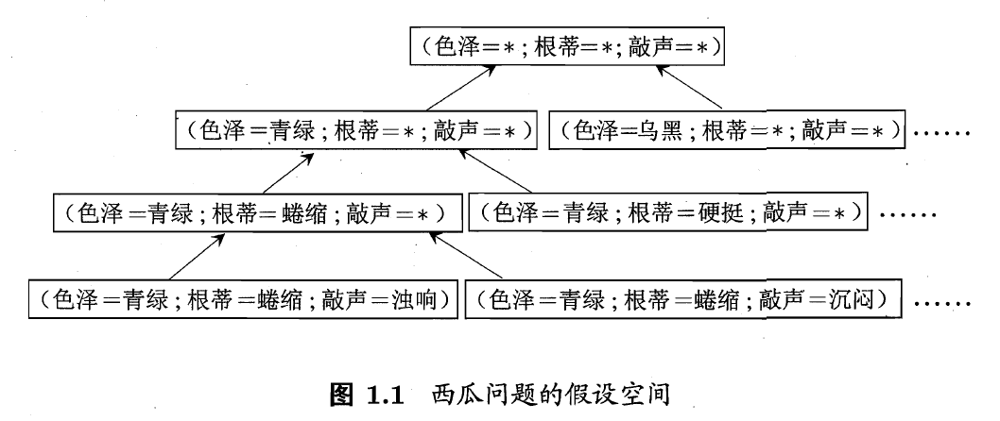

# 0x03机器学习基本术语

## 基本术语

在宏观范畴上，机器学习的相关概念有：

- 人工智能
- 机器学习
- 深度学习
- 数据挖掘
- 计算机视觉
- 统计学习

它们之间的关系如下图所示：

要进行机器学习，首先要有数据。假设我们收集了一批关于西瓜的数据，例如：

|序号|色泽|根蒂|敲声|
|-|-|-|-|
|1|青绿|蜷缩|浊响|
|2|乌黑|蜷缩|沉闷|
|3|浅白|硬挺|清脆|

### 数据集

上面的数据每一行（记录）是一条数据（也称记录），这组数据的集合称为一个“数据集”（data set）。

### 示例或样本

每一条记录是关于一个事件或对象（这里是一个西瓜）的描述，称为一个“示例”（instance）或样本（sample）。

### 特征（feature）、属性（attribute）

反映事件或对象在某方面的表现或性质的事项，例如“色泽”、“根蒂”、“敲声”等，称为属性或特征。
属性的取值，例如“青绿”、“乌黑”等，称为属性值（attribute value）。

### 属性空间与特征向量

属性与属性值构成的空间称为“属性空间”（attribute space）。
例如，我们把“色泽”、“根蒂”、“敲声”作为三个坐标轴，则它们张成的一个用于描述西瓜的三维空间，每个西瓜都可以在这个空间中找到一个坐标位置。由于空间中的每个点对应一个坐标向量，因此我们也把一个示例称为一个“特征向量”（feature vector)。

### 形式化定义

一般地，令 $D={x_1,x_2,...,x_m}$ 表示包含m个示例地数据集，每个示例由d个属性描述（例如上面的西瓜数据使用了3个属性），则每个示例$x_i=(x_{i1};x_{i2};...x_{id})$ 是d维样本空间$\chi$中的一个向量，$x_i \in \chi$,其中$x_{ij}$是$x_i$在第j个属性上的取值，$d$称为样本$x_i$的“维数”（dimensionality）。

### 学习（learning）或训练（trainning）

从数据中学习得到模型的过程称为学习或训练，这个过程是通过执行某个学习算法来完成的。

### 训练数据（training data）

训练过程中，使用的数据集称为“训练数据”（training data），其中每个样本称为一个“训练样本”（training sample），训练样本组成的集合称为“训练集”（training set）。

### 假设（hypothesis）

学习得到的模型对应了关于数据的某种潜在规律，因此已成为“假设”（hypothesis）。

### 真相（truth）

我们希望学习得到的这种潜在规律自身，则称为“真相”或“真实”（ground-truth），学习过程就是为了找出或逼近真相。

### 学习器（learner）

有的教材会将模型称为“学习器”（learner），可以看作是学习算法在给定数据和参数空间上的实例化。

### 标记（label）

要建立“预测”（prediction）的模型，我们需要获得训练样本的“结果”信息，例如“好瓜”或“坏瓜”，这个结果称为“标记”（label）。

### 样例（example）

拥有标记信息的示例，称为“样例”。

|序号|色泽|根蒂|敲声|分类结果|
|-|-|-|-|-|
|1|青绿|蜷缩|浊响|好瓜|
|2|乌黑|蜷缩|沉闷|好瓜|
|3|浅白|硬挺|清脆|坏瓜|

一般地，使用$(x_i,y_i)$表示第i个样例，其中$y_i \in Y$ 是示例$x_i$的标记，Y是所有标记的集合。Y也被称为“标记空间”（label space）或“输出空间”

### 分类任务（classification）

如果我们预测的是离散值，例如“好瓜”或“坏瓜”，则对应的学习任务常被称为分类。

如果只涉及两个类别，我们称为“二分类”（binary classification）任务。通常称其中一个类维“正类”（positive class）；另一类为反类（negative class）。

涉及多个类别时，则称为“多分类”任务（multi-class classification）。

### 回归任务（regression）

如果我们预测的是连续值，例如西瓜成熟度0.95、0.37或股票价格30.98、40.55等等，则对应的学习任务常被称为回归。

### 形式化描述

一般地，预测任务是希望通过对训练集${(x_1,y_1),(x_2,y_2),...,(x_m,y_m)}$进行学习，建立一个从输入空间$\chi$到输出空间Y的映射 $f: \chi -> Y$。

- 对二分类任务，通常令$Y={-1,+1}$ 或 {0，1};
- 对多分类任务，|Y| > 2;
- 对回归任务， Y = R ,R为实数集。

### 测试（testing）

学得模型后，使用其进行预测的过程称为“测试”，被测试的样本称为“测试样本”（testing sample）。

例如，在学习得到f后，对测试例x，可得到其预测标记 y = f(x)。

## 监督学习（supervised learning）与无监督学习（unsupervised learning）

根据训练数据是否拥有标记信息，学习任务可分为两大类，监督学习和无监督学习。

- 监督学习是训练数据拥有标记的一类学习，典型代表是分类和回归；
- 无监督学习是训练数据没有标记的一类学习，典型代表是聚类（clustering）。

## 泛化能力（generalization）

机器学习的目标：是使学得的模型能够很好地适用于“新样本”（即能正确预测），而不仅仅是在训练样本上表现很好。

学得模型适用于新样本得能力，称为“泛化”能力（generalization）。

具有强泛化能力得模型能很好地适应于整个样本空间。而训练集通常只是样本空间中地一个很小地采样。

### 独立同分布

通常，假设样本空间中全体样本服从一个未知“分布”（distribution）D，我们获得地每个样本都是独立地从这个分布上采样得到地，即“独立同分布”（independent and identically distributed，简称 $i.i.d.$）。

一般而言，训练样本越多，我们得到的关于D的信息就越多，这样就越有可能通过学习获得具有强泛化能力的模型。

这就是“最终，数据将决定算法效果”的原因。

## 假设空间

### 归纳（induction）与演绎（deduction）

归纳和演绎是科学推理的两大基本手段。

归纳是从特殊到一般的“泛化”过程，即从具体的事实归结出一般性规律。从样例中学习（机器学习）显然是一个归纳的过程，所以机器学习也成为“归纳学习”（inductive learning）。

演绎是从一般到特殊的“特化”过程（specialization），即从基础原理推演出具体状况。例如，在数据公里系统中，基于一组公里和推理规则推导出与之相洽的定理。

### 归纳学习

归纳学习有狭义和广义之分，广义的归纳学习大体上相当于从样例中学习。狭义的归纳学习则要求从训练集中学得概念（concept），因此也称“概念学习”或“概念形成”，但这有些困难，目前相关的研究和应用都比较少。

最简单的概念学习是布尔概念学习，即对“是”或“不是”（可表示为1/0）的目标概念的学习。例如(例1)：

|序号|色泽|根蒂|敲声|分类结果|
|-|-|-|-|-|
|1|青绿|蜷缩|浊响|好瓜|
|2|乌黑|蜷缩|沉闷|好瓜|
|3|浅白|硬挺|清脆|坏瓜|

第一行中出现形成的结论，能否应用于其他样例？（能否泛化？）条件完全匹配时，自然可以直接生成结论，但如果是部分匹配条件，那么如何形成结论呢？

### 假设空间

我们可以把学习过程看作一个在所有假设（hypothesis）组成的空间中进行搜索的过程。搜素的目标是找到与训练集“匹配”（fit）的假设。例如：能够将训练集中的瓜，判断正确的假设。

假设的表示一旦确定，假设空间及其规模大小就确定了。

例如：上面例子的假设表示为：（色泽=？） and （根蒂=？）and （敲声=？），那么假设空间就是所有可能取值所形成的假设组成。下图反映了西瓜问题的假设空间：

可以有很多策略对这个假设空间进行搜索，例如自顶向下、从一般到特殊，或是自底向上、从特殊到一般。

搜索过程中可以不断删除与整理不一致的假设、和（或）与反例一致的假设。

最终将会获得与训练集一致的假设，这就是我们的学得结果。

### 版本空间（version space）

可能会有多个假设与训练集一致，即存在着一个与训练集一致得“假设集合”，称之为“版本空间”。

### 归纳偏好

上面通过例1训练集学习得到假设有3个，这给我们制造了麻烦：在面临新样本时，这3个假设的输出不同，那么使用哪个对新数据进行预测更为合适？

仅有例1中的样本，是无法确定哪个假设更好的。但是，对于一个具体的学习算法，必须要产生一个模型（选定一个假设作为结论）。这时，学习算法的“偏好”就会发挥作用。

所谓偏好，通常是人为指定一些参数，使归纳偏向于某个结论。

机器学习过程中对某种类型假设的偏好，称为“归纳偏好”（inductive bias），或简称为“偏好”。

任何一个有效的机器学习算法中都存在偏好的设定，完全公正，毫无偏好的算法几乎没有；否则会产生无法确定的学习结果，学习过程将没有意义。

偏好的设定在回归任务中十分明显，例如下图中，实线和虚线表示了选择“平滑”和“陡峭”两种偏好时的预测结果曲线。

## 奥卡姆剃刀（Occam’s razor）定理

归纳偏好看似是“人为”、“随性”的选择，它是学习算法在一个可能很庞大的假设空间中对假设进行选择的启发式或“价值观”。

那么有没有一般性的原则来引导算法确立“正确的价值观”（偏好）呢？

奥卡姆剃刀，是一种常用的、自然科学研究中最基本的原则。即“若存在多个假设与观察一致，则选最简单的那个”。

例如，假设在上图中我们认为“平滑”意味着简单（曲线易于用一个解析式描述），其方程式$y=-x^2+6x+1$，就是使用奥卡姆剃刀定理后的结论。

**当然，奥卡姆剃刀不是唯一可行的原则，而且有时使用它也并不容易，因为算法或人无法判断哪个更为简单。**

## 没有免费的午餐定理（No Free Lunch Theorem）

可以证明，对于任意两个学习算法a和b，它们预测误差的期望值是相同的。换句话说，无论学习算法a多么聪明，而学习算法b多么笨拙，它们出错的平均水平是一样的。

这就是“没有免费的午餐”定理（No Free Lunch Theorem，简称NFL定理）[Wolpert 1996]

了解到这条定理，是否使你学习机器学习的热情一下子骤减呢？就像被泼了一盆冷水。既然学习得到的算法的期望性能与随机胡猜差不多，还有必要费劲学习么？

需要注意：**NFL定理有一个重要前提：所有“问题”出现的机会相同，或所有问题同等重要**，但事实上，这种情况很少见。

很多时候，我们只关注自己正在解决的问题（具体任务），希望为它找到一个方案，至于这个方案在别的问题上、甚至类似问题上表现如何并不关心。

而且**证明NFL定理时假设了真实情况的发生是均匀分布的，其实有些真像经常发生，有些真像很少发生。**

**所以，NFL定理最重要的寓意，是让我们清楚的认识到，脱离实际问题，空泛地谈论“什么学习算法好”毫无意义。**

## 机器学习方法三要素

方法 = 模型 + 策略 + 算法

### 策略

#### 损失函数（loss function）

- 0-1损失函数

- 平方损失函数

- 绝对损失函数

- 对数损失函数

- 对数似然损失函数

#### 风险函数

### 形式化表示

- 当假设空间F为决策函数的集合

$F = {f | Y = f(x)}$
- F实质为参数向量决定的函数族

### 学习三要素

数据、算法、算力。

深度学习近些年来掀起热潮，就是在数据量变大、算力变强后的结果。

## 训练误差和测试误差

略

## 正则化

略

## 生成模型与判别模型

略