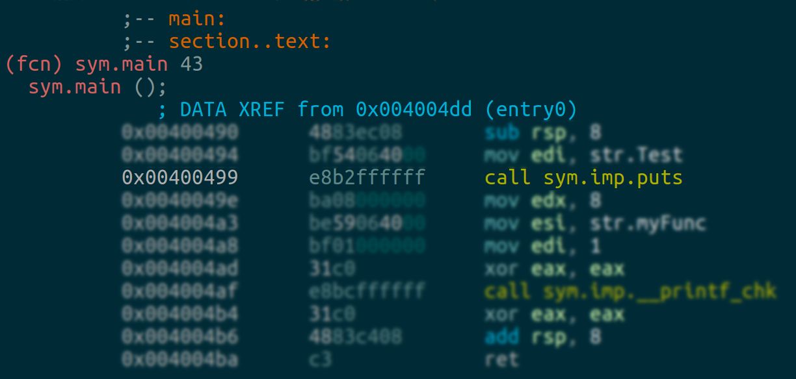
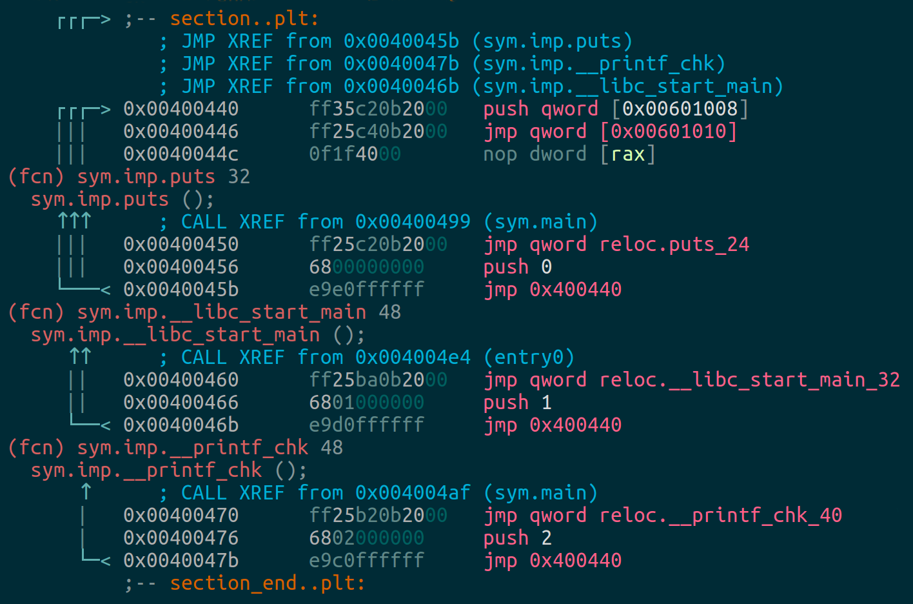
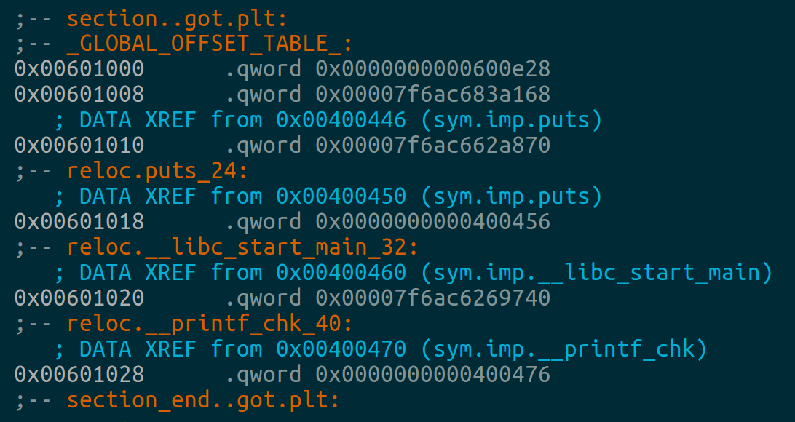

# ROP 系列 1 Beginner’s Guide
文章内容来自：https://ropemporium.com/guide.html

## ROP 和 ROP Emporium 概述
Returned oriented programming（ROP） 是一种可以绕过渗透防御模式（例如NX/DEP）的机制。一些相关提法可参考 [Wiki](https://en.wikipedia.org/wiki/Return-oriented_programming) 更多深度的语句可参考Sarif el
-Sherei's [ROP FTW paper](https://www.exploit-db.com/docs/english/28479-return-oriented-programming-(rop-ftw).pdf).

ROP Emporium 提供了一系列挑战，这些挑战旨在单独教授ROP，而对逆向工程或错误查找的要求却最低。每个挑战都引入了一个复杂度逐渐提高的新概念。按照主页上的链接查看练习说明和挑战二进制文件。有时会包括一些有关如何解决挑战的线索。

ROP Emporium面临的挑战有4种不同的体系结构: x86，x86_64，ARMv5和MIPS。这个想法是为了帮助您了解它们之间在ROP链结构方面的差异，因此绝对值得尝试使用不同的版本。熟悉每种调用约定，以便您知道在调用之前将参数放在何处。假设您使用的是x86_64 Linux操作系统，附录B中的“[使用外部体系结构](https://ropemporium.com/guide.html#Appendix%20B)”部分可以帮助您开始利用x86，ARMv5和MIPS挑战。

### 工具
- [ropper](https://github.com/sashs/Ropper)
  - ROP小工具查找器，还可以显示有关二进制文件的有用信息。它具有彩色输出，交互式搜索并支持错误字符列表。
- [ROPGadget](https://github.com/JonathanSalwan/ROPgadget)
  - 功能强大的ROP小工具查找器，没有交互式的搜索或色彩丰富的输出，但是对于ARM体系结构，它具有更强大的小工具检测功能。
- pwntools
  - 用Python编写的CTF框架。简化了与本地和远程二进制文件的交互，这使在目标上测试ROP链变得更加容易。请考虑浏览 由pwntools开发人员/维护人员编写的 [示例解决方案](https://gist.github.com/zachriggle/e4d591db7ceaafbe8ea32b461e239320)。
- [radare2](https://github.com/radare/radare2)
  - 反汇编器，调试器和二进制分析工具。它功能强大，您几乎或完全拥有radare2框架内所需的一切来完成本网站上的挑战。
  - [cheatsheet](https://github.com/radare/radare2/blob/master/doc/intro.md)
- [pwndbg](https://github.com/pwndbg/pwndbg)
  - pwndbg是PEDA和GEF等框架的后继者，它是GDB的插件，可以大大增强其漏洞利用开发能力。

### 一般性建议

#### Bug hunting

The ROP Emporium challenges 消除了很多逆向和bug hunting，你可以聚焦于构造ROP链。

每个二进制文件都具有相同的漏洞；用户提供的字符串将被复制到基于堆栈的缓冲区中，而无需进行边界检查，从而可以覆盖函数保存的返回地址。由于此溢出发生在堆栈上，因此您可以将ROP链粘在此处，程序将按需返回。重点是如何围绕挑战所施加的限制来设计链条；在某些情况下，您可能必须处理不良字符，而在其他情况下，您可能只能访问一组有限或晦涩的小工具。

#### Debuggery（调试）
一旦你制定了ROP链，调试器可以使错误更加清楚。pwntools可以利用GDB 和radare2 启动二进制文件，它们都是很厉害的debugger。调试能够给你清楚的指示，你的链是否实际有效。

#### 自动化

不鼓励使用 ROP 链生成器，例如 angrop 。如果您发现自己总是在二进制文件中搜索同一组小工具，或者为自己的漏洞利用编写一些模板功能，那么不要回避编写自己的自动化工具，从而避免重复工作。

### 寻宝

#### 调用堆栈中的针 Needles in callstacks

开发自己第一个ROP链的第一个问题是手机需要开始构建东西的信息。存在哪些有用的功能？有哪些小工具可供选择？本节包含上述工具的一些用例，以帮助您快速找到此信息。每个挑战页面都对要求的内容进行了更深入的介绍，在某些情况下，还提供了更具体的工具使用技巧。

#### 确认保护

应对挑战时，最好检查一下它已启用的保护（如果有）。请记住，有些依赖于编译二进制文件的标志和操作系统。ROP Emporium挑战所有实施NX，因为这是我们试图绕过的缓解措施，并且旨在在启用了ASLR的OS上运行。您可以使用rabin2或checksec来确认您没有在浪费时间：
$ rabin2 -I <binary>
$ checksec <binary>

rabin2是组成radare2套件的许多独立二进制文件之一，如果您已经安装radare2，它将可以使用。可以从git单独下载checksec，但强烈建议将其功能集成到pwntools框架中。

#### 函数名称

在未拆解（unstripped）的二进制函数名可能有用，尤其是在程序员使用有用的标题（例如win_this_challenge（））的情况下。您仍然可以从剥离的二进制文件中了解导入函数的名称。列出从共享库中导入的函数很简单：
$ rabin2 -i <binary>
$ nm -u <binary>
仅列出程序员编写的那些函数比较困难，粗略的近似可能是：
$ rabin2 -qs <binary> | grep -ve imp -e ' 0 '
留下一些 lint，但比列出所有符号更易读。在ROP Emporium挑战中，请留意该usefulGadgets符号，该符号标记了添加到二进制文件中的小工具的位置，以帮助您简化生活。

#### 字符串

与寻常不同，不要使用‘strings’ 命令在二进制题目中搜索字符串，而是使用rabin2.例如; 在“ split”挑战中运行字符串会产生许多行输出，其中大多数是无关紧要的。另一方面，运行：
$ rabin2 -z split
将产生很少的行，所有这些行都是程序员有意放入二进制文件中的字符串。

### 常见的陷阱（common pitfalls）
这是您可能会遇到的一些问题，其原因不是很明显。

#### MOVAPS问题
如果在x86_64质询中或之中使用Ubuntu 18.04并在一条movaps指令上 进行段错误修复，则在返回GLIBC函数（如或）之前，请确保堆栈已对齐16字节。Ubuntu 18.04随附的GLIBC版本使用指令将某些功能中的数据移动到堆栈中。64位调用约定要求在 指令之前将堆栈对齐16字节，但是在ROP链执行过程中很容易违反堆栈规则，从而导致该函数进行的所有其他调用都使用未对齐的堆栈进行。buffered_vfprintf()do_system()printf()system()movapscallmovaps当对未对齐的数据进行操作时会触发一般性保护错误，因此请ret 在返回函数之前或在返回函数之前跳过ROP链时，对ROP链进行额外填充push 。

#### / usr / bin / bash
使用GDB调试ROP链时，如果您已成功调用，system()但传递的字符串不是有效程序，则GDB仍会告诉您它已经开始了新进程“ / usr / bin / bash”。当您尝试删除外壳程序时，这可能会特别令人困惑。查看手册system()页，了解背后的原因。

#### 过犹不及
考虑您的ROP链的长度，每个二进制文件在处理您的输入之前只会读取特定数量的字节。如果您超出挑战的输入长度，则可能会引导玩家朝着挑战的理想解决方案发展，这可能会使您的生活变得更加艰难。如有疑问，请检查整个链条是否已完整地存入内存。您可以ltrace用来检查质询二进制文件试图读取的确切字节数。

#### 堆栈对齐
如果已经移动了堆栈指针，请确保它仍针对目标架构正确对齐，否则可能会发生奇怪的事情。

#### 堆栈位置
考虑一下您的链在进行处理时所处的位置。例如，如果您已将链旋转并放置在进程内存的.data节中，请考虑调用的函数需要多少堆栈空间。如果该函数需要大量空间，则可能会将堆栈指针移至不可写内存或覆盖内存，如果损坏，则会对程序稳定性产生不利影响。

## 第一个ROP链

Look ma No-eXecute

你自己点击 ret2win这个题目连接到主页。里面有介绍如果实现，包括一些工具的使用方法。

## 附件 A
### 如何延迟绑定
本节试图解释延迟绑定的工作原理。示例来自在Ubuntu Linux上运行的，使用GCC为x86_64架构编译的简单64位ELF。
This section attempts to explain how lazy binding works. Examples are from a simple 64 bit ELF compiled with GCC for x86_64 architecture, running on Ubuntu Linux.

Lazy binding is a technique used by the dynamic linker to decrease program startup time, in which symbol lookups for function calls into shared objects are deferred until the first time a function is actually called. Two program sections are used to achieve this effect; the procedure linkage table (.plt) and part of the global offset table (.got.plt). Lazy binding may be disabled by setting the LD_BIND_NOW environment variable to a nonempty string or using the RTLD_NOW flag when calling dlopen().

### Calls
The first time an external function is called it, must be resolved. After that, all calls to it will be passed straight through to the desired function. The calling convention does not change. The figure below shows a call from the example program. The call to puts() here lands in the .plt section, as do all external function calls.

### The .plt section
The figure below shows the .plt section from the example program. In this case 3 function stubs reside here, they take the form jmp; push; jmp;. Above the stubs a push; jmp; sits at the head of the .plt section. Each stub jumps to the address residing at that function's .got.plt entry, which before resolution points straight back into the .plt one instruction below: the push; jmp;.

Each function stub pushes its .got.plt entry's offset, then jmps to the head of the .plt. The push; jmp; at the head of the .plt pushes the second entry of the .got.plt, which is the address of the linkmap head, then jmps to the third entry; a resolved function named _dl_runtime_resolve_avx() which will patch the appropriate function's .got.plt entry with the correct address of the desired function, then call it. After this first call, all future calls to the function's .plt stub will jmp straight to the appropriate function.
### The .got.plt section

The .got.plt section shown below contains 6 entries; the first 3 will in all cases be the address of the program's .dynamic section, the address of the linkmap head, and the address of _dl_runtime_resolve_avx(). All entries after these are functions to be resolved at call time.

In this case __libc_start_main() has been resolved and its entry points to the actual function address in the libc shared object. puts() and __printf_chk() have not been resolved yet and their entries point back into their respective .plt stubs. Once these functions have been called for the first time, their entries will be updated to reflect their actual addresses.
## Appendix B
Working with foreign architectures
If you're new to ARMv5 & MIPS, this section can help you get started pwning the ROP Emporium challenges for those architectures. It assumes your host OS is an x86_64 Linux platform, and the examples are for Ubuntu 20.04 LTS. If you're using a Linux distro with a different package manager, the package names may differ.

x86
Getting the x86 challenges working on an x86_64 platform is simple, just install the libc6-i386 package:
$ sudo apt install libc6-i386

After this you should be able to run the x86 challenges and debug them under GDB as you would an x86_64 binary.

ARMv5
Running programs compiled for foreign architectures is much easier than it used to be, this example uses qemu-user to achieve this. The setup is simple, and only involves installing 2 packages and creating a symlink:
$ sudo apt install qemu-user
$ sudo apt install libc6-armel-cross
$ sudo mkdir /etc/qemu-binfmt
$ sudo ln -s /usr/arm-linux-gnueabi /etc/qemu-binfmt/arm

This is enough to let you run the ARMv5 challenges from the command line as if they were native binaries. Be aware that at the time of writing, qemu does not support ASLR in this configuration. You'll just have to suspend your disbelief and imagine that the stack, heap & libraries are all subject to ASLR when building your ROP chains.

Debugging ARMv5 challenges with this setup is slightly different to how you would normally do it. You'll need the appropriate version of GDB:
$ sudo apt install gdb-multiarch

If you're launching GDB from within a pwntools script, it will detect that you're trying to debug for a foreign architecture and take the appropriate measures. If you have pwntools installed but want to debug from the command line, you can use:
$ pwn debug --exec <path_to_challenge_binary>

If you don't have pwntools installed, then you'll have to do the following to debug the ARMv5 challenges:
$ qemu-arm -g 1234 <path_to_challenge_binary>

Where the -g flag is telling qemu to start a GDB debugging stub and 1234 is the port it should listen on. Then from a 2nd terminal, start gdb-multiarch and attach to the session:
$ gdb-multiarch
(gdb) file <path_to_challenge_binary>
(gdb) target remote localhost:1234

Note that as of writing, pwndbg doesn't play nice with programs launched from qemu-user in this way. If you're debugging the ARMv5 or MIPS challenges, it's best to disable pwndbg for now.

MIPS
Exploiting the MIPS challenges from an x86_64 host is just as easy as with the ARMv5 challenges:
$ sudo apt install qemu-user
$ sudo apt install libc6-mipsel-cross
$ sudo mkdir /etc/qemu-binfmt
$ sudo ln -s /usr/mipsel-linux-gnu /etc/qemu-binfmt/mipsel

This lets you run the MIPS challenges from the command line as if they were native binaries. Be aware that, as is the case with the ARMv5 binaries, qemu-user does not support ASLR in this configuration right now.

Debugging the MIPS challenges involves the same steps documented above for the ARMv5 binaries using gdb-multiarch. The same issues currently exist with pwndbg so watch out.